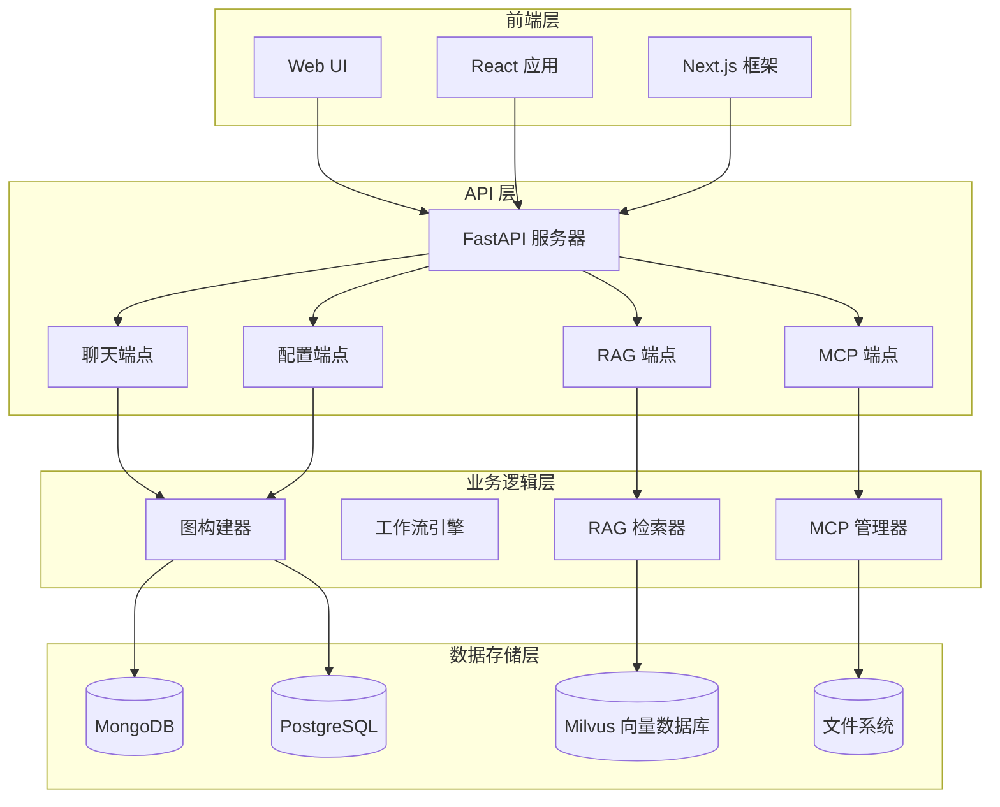
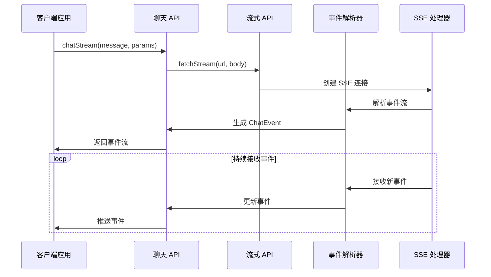
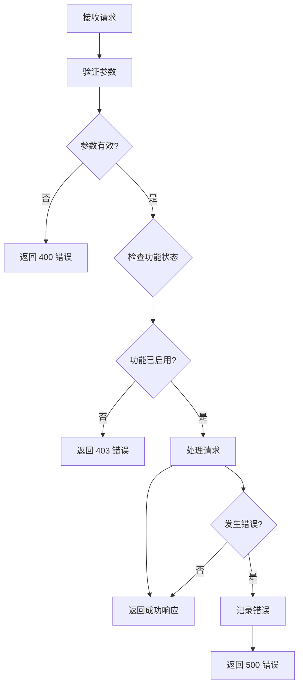

# DeerFlow API 参考文档

<cite>
**本文档中引用的文件**
- [app.py](file://src/server/app.py)
- [chat_request.py](file://src/server/chat_request.py)
- [mcp_request.py](file://src/server/mcp_request.py)
- [rag_request.py](file://src/server/rag_request.py)
- [config_request.py](file://src/server/config_request.py)
- [chat.ts](file://web/src/core/api/chat.ts)
- [mcp.ts](file://web/src/core/api/mcp.ts)
- [types.ts](file://web/src/core/api/types.ts)
- [fetch-stream.ts](file://web/src/core/sse/fetch-stream.ts)
- [schema.ts](file://web/src/core/mcp/schema.ts)
- [types.ts](file://web/src/core/mcp/types.ts)
</cite>

## 目录
1. [简介](#简介)
2. [项目架构概览](#项目架构概览)
3. [核心 API 端点](#核心-api-端点)
4. [聊天 API](#聊天-api)
5. [MCP 集成 API](#mcp-集成-api)
6. [RAG 请求 API](#rag-请求-api)
7. [配置 API](#配置-api)
8. [前端客户端封装](#前端客户端封装)
9. [安全与认证](#安全与认证)
10. [错误处理](#错误处理)
11. [性能优化](#性能优化)
12. [故障排除指南](#故障排除指南)

## 简介

DeerFlow 是一个基于 FastAPI 构建的智能对话系统，提供了完整的 RESTful API 接口用于处理聊天、语音合成、播客生成、PPT 创建和提示增强等功能。该系统采用流式传输技术，支持实时响应和动态工具加载，特别集成了 Model Control Protocol (MCP) 以实现动态工具发现和加载。

## 项目架构概览



**图表来源**
- [app.py](file://src/server/app.py#L1-L50)
- [chat.ts](file://web/src/core/api/chat.ts#L1-L20)

## 核心 API 端点

DeerFlow 提供以下主要 API 端点：

### 基础信息
- **基础 URL**: `/api`
- **版本**: `0.1.0`
- **标题**: `DeerFlow API`
- **描述**: `API for Deer`

### 支持的 HTTP 方法
- `POST`: 创建资源和执行操作
- `GET`: 获取配置和状态信息
- `OPTIONS`: 跨域预检请求

### 内容类型
- `application/json`: 主要请求/响应格式
- `text/event-stream`: 流式传输响应

**章节来源**
- [app.py](file://src/server/app.py#L45-L60)

## 聊天 API

### 流式聊天端点

#### 端点: `POST /api/chat/stream`

**描述**: 处理用户消息并返回流式响应，支持多模态内容和动态工具调用。

**请求体结构**:
```typescript
interface ChatRequest {
  messages: ChatMessage[];           // 用户历史消息
  resources: Resource[];             // 可用资源列表
  debug: boolean;                    // 是否启用调试日志
  thread_id: string;                 // 会话标识符
  max_plan_iterations: number;       // 最大计划迭代次数
  max_step_num: number;              // 计划最大步骤数
  max_search_results: number;        // 最大搜索结果数
  search_engine: string;             // 搜索引擎类型
  custom_search_repository: string;  // 自定义搜索引擎仓库
  auto_accepted_plan: boolean;       // 是否自动接受计划
  interrupt_feedback: string;        // 中断反馈
  mcp_settings: dict;               // MCP 设置
  enable_background_investigation: boolean; // 是否启用背景调查
  report_style: ReportStyle;         // 报告风格
  enable_deep_thinking: boolean;     // 是否启用深度思考
}
```

**响应格式**:
```typescript
interface ChatEvent {
  type: string;                      // 事件类型
  data: object;                      // 事件数据
}
```

**事件类型**:
- `message_chunk`: 消息块
- `tool_calls`: 工具调用
- `tool_call_chunks`: 工具调用块
- `tool_call_result`: 工具调用结果
- `interrupt`: 中断事件

**示例请求**:
```json
{
  "messages": [
    {
      "role": "user",
      "content": "请帮我分析一下人工智能的发展趋势"
    }
  ],
  "thread_id": "session-123",
  "max_plan_iterations": 3,
  "search_engine": "tavily",
  "report_style": "academic"
}
```

**示例响应**:
```json
event: message_chunk
data: {
  "thread_id": "session-123",
  "id": "msg_abc123",
  "role": "assistant",
  "agent": "coordinator",
  "content": "人工智能的发展趋势可以从以下几个方面...",
  "langgraph_node": "coordinator",
  "langgraph_step": 1
}

event: tool_calls
data: {
  "thread_id": "session-123",
  "id": "tool_abc123",
  "role": "assistant",
  "agent": "researcher",
  "tool_calls": [
    {
      "id": "call_abc123",
      "type": "function",
      "function": {
        "name": "search_web",
        "arguments": "{\"query\":\"AI trends 2024\"}"
      }
    }
  ]
}
```

**章节来源**
- [app.py](file://src/server/app.py#L70-L120)
- [chat_request.py](file://src/server/chat_request.py#L25-L60)

## MCP 集成 API

### MCP 服务器元数据端点

#### 端点: `POST /api/mcp/server/metadata`

**描述**: 获取 MCP 服务器的元数据信息，包括可用工具和服务配置。

**请求体结构**:
```typescript
interface MCPServerMetadataRequest {
  transport: string;                 // 连接类型 (stdio/sse/streamable_http)
  command?: string;                  // 执行命令 (stdio 类型)
  args?: string[];                   // 命令参数 (stdio 类型)
  url?: string;                      // SSE 服务器 URL (sse 类型)
  env?: Record<string, string>;      // 环境变量 (stdio 类型)
  headers?: Record<string, string>;  // HTTP 头部 (sse/streamable_http 类型)
  timeout_seconds?: number;          // 自定义超时时间
}
```

**响应体结构**:
```typescript
interface MCPServerMetadataResponse {
  transport: string;                 // 连接类型
  command?: string;                  // 执行命令
  args?: string[];                   // 命令参数
  url?: string;                      // SSE 服务器 URL
  env?: Record<string, string>;      // 环境变量
  headers?: Record<string, string>;  // HTTP 头部
  tools: any[];                      // 可用工具列表
}
```

**MCP 连接类型**:
- `stdio`: 标准输入输出连接
- `sse`: 服务器发送事件连接
- `streamable_http`: 可流式 HTTP 连接

**示例请求**:
```json
{
  "transport": "sse",
  "url": "http://localhost:8080/mcp",
  "headers": {
    "Authorization": "Bearer token123"
  },
  "timeout_seconds": 300
}
```

**示例响应**:
```json
{
  "transport": "sse",
  "url": "http://localhost:8080/mcp",
  "tools": [
    {
      "name": "web_search",
      "description": "Perform web searches",
      "inputSchema": {
        "type": "object",
        "properties": {
          "query": {"type": "string"}
        }
      }
    }
  ]
}
```

**章节来源**
- [mcp_request.py](file://src/server/mcp_request.py#L10-L60)
- [app.py](file://src/server/app.py#L580-L620)

## RAG 请求 API

### RAG 配置端点

#### 端点: `GET /api/rag/config`

**描述**: 获取 RAG (检索增强生成) 服务的配置信息。

**响应体结构**:
```typescript
interface RAGConfigResponse {
  provider: string | null;           // RAG 提供商名称
}
```

**示例响应**:
```json
{
  "provider": "ragflow"
}
```

### RAG 资源查询端点

#### 端点: `GET /api/rag/resources`

**描述**: 查询 RAG 系统中的可用资源。

**查询参数**:
```typescript
interface RAGResourceRequest {
  query?: string | null;             // 搜索查询
}
```

**响应体结构**:
```typescript
interface RAGResourcesResponse {
  resources: Resource[];             // 资源列表
}
```

**示例请求**:
```
GET /api/rag/resources?query=artificial+intelligence
```

**示例响应**:
```json
{
  "resources": [
    {
      "id": "doc_001",
      "title": "AI Trends 2024",
      "description": "Latest developments in artificial intelligence",
      "metadata": {
        "source": "research_paper",
        "tags": ["AI", "machine_learning"]
      }
    }
  ]
}
```

**章节来源**
- [rag_request.py](file://src/server/rag_request.py#L10-L28)
- [app.py](file://src/server/app.py#L620-L640)

## 配置 API

### 服务器配置端点

#### 端点: `GET /api/config`

**描述**: 获取服务器的完整配置信息，包括 RAG 配置、模型列表和自定义搜索仓库。

**响应体结构**:
```typescript
interface ConfigResponse {
  rag: RAGConfigResponse;                     // RAG 配置
  models: LLMModel[];                         // 可用模型列表
  custom_search_repositories: CustomSearchRepositoryConfig[]; // 自定义搜索仓库
}
```

**示例响应**:
```json
{
  "rag": {
    "provider": "ragflow"
  },
  "models": [
    {
      "name": "gpt-4",
      "provider": "openai",
      "capabilities": ["chat", "vision"]
    }
  ],
  "custom_search_repositories": [
    {
      "id": "github",
      "name": "GitHub Repositories",
      "description": "Search GitHub repositories",
      "repository": "github"
    }
  ]
}
```

**章节来源**
- [app.py](file://src/server/app.py#L640-L680)

## 前端客户端封装

### 客户端 API 封装

前端通过 `web/src/core/api` 目录下的模块封装了所有 API 调用：



**图表来源**
- [chat.ts](file://web/src/core/api/chat.ts#L15-L40)
- [fetch-stream.ts](file://web/src/core/sse/fetch-stream.ts#L8-L30)

### 流式传输实现

前端使用 SSE (Server-Sent Events) 实现流式传输：

```typescript
// 流式事件解析
async function* fetchStream(url: string, init: RequestInit) {
  const response = await fetch(url, {
    method: "POST",
    headers: {
      "Content-Type": "application/json",
      "Cache-Control": "no-cache",
    },
    ...init,
  });
  
  const reader = response.body
    ?.pipeThrough(new TextDecoderStream())
    .getReader();
    
  while (true) {
    const { done, value } = await reader.read();
    if (done) break;
    
    buffer += value;
    while (true) {
      const index = buffer.indexOf("\n\n");
      if (index === -1) break;
      
      const chunk = buffer.slice(0, index);
      buffer = buffer.slice(index + 2);
      const event = parseEvent(chunk);
      if (event) yield event;
    }
  }
}
```

**章节来源**
- [chat.ts](file://web/src/core/api/chat.ts#L15-L80)
- [fetch-stream.ts](file://web/src/core/sse/fetch-stream.ts#L8-L50)

## 安全与认证

### CORS 配置

系统通过 CORS 中间件配置跨域访问：

```python
# 允许的来源从环境变量加载
allowed_origins_str = get_str_env("ALLOWED_ORIGINS", "http://localhost:3000")
allowed_origins = [origin.strip() for origin in allowed_origins_str.split(",")]

app.add_middleware(
    CORSMiddleware,
    allow_origins=allowed_origins,
    allow_credentials=True,
    allow_methods=["GET", "POST", "OPTIONS"],
    allow_headers=["*"],
)
```

### MCP 功能控制

MCP 功能需要显式启用：
```python
mcp_enabled = get_bool_env("ENABLE_MCP_SERVER_CONFIGURATION", False)
if request.mcp_settings and not mcp_enabled:
    raise HTTPException(
        status_code=403,
        detail="MCP server configuration is disabled. Set ENABLE_MCP_SERVER_CONFIGURATION=true to enable MCP features.",
    )
```

### 环境变量安全配置

关键配置通过环境变量管理：
- `ALLOWED_ORIGINS`: 允许的 CORS 来源
- `ENABLE_MCP_SERVER_CONFIGURATION`: MCP 功能开关
- `VOLCENGINE_TTS_APPID`: Volcengine TTS 应用 ID
- `VOLCENGINE_TTS_ACCESS_TOKEN`: Volcengine TTS 访问令牌

**章节来源**
- [app.py](file://src/server/app.py#L50-L70)
- [app.py](file://src/server/app.py#L75-L85)

## 错误处理

### HTTP 状态码

系统使用标准 HTTP 状态码：
- `200 OK`: 成功响应
- `400 Bad Request`: 请求参数错误
- `403 Forbidden`: 功能未启用或权限不足
- `500 Internal Server Error`: 服务器内部错误

### 错误事件格式

流式传输中的错误事件：
```typescript
interface ErrorEvent {
  type: "error";
  data: {
    thread_id: string;
    error: string;
  };
}
```

### 异常处理流程



**图表来源**
- [app.py](file://src/server/app.py#L70-L90)

**章节来源**
- [app.py](file://src/server/app.py#L680-L688)

## 性能优化

### 连接复用

系统支持多种检查点保存器以优化性能：

```python
# PostgreSQL 检查点保存器
if checkpoint_url.startswith("postgresql://"):
    async with AsyncConnectionPool(checkpoint_url, kwargs=connection_kwargs) as conn:
        checkpointer = AsyncPostgresSaver(conn)
        await checkpointer.setup()

# MongoDB 检查点保存器  
if checkpoint_url.startswith("mongodb://"):
    async with AsyncMongoDBSaver.from_conn_string(checkpoint_url) as checkpointer:
        checkpointer = checkpointer
```

### 流式传输优化

- 使用 SSE 协议实现实时响应
- 支持断点续传和状态恢复
- 内存检查点保存减少重复计算

### 并发处理

- 异步处理避免阻塞
- 连接池管理数据库连接
- 流式处理大量数据

**章节来源**
- [app.py](file://src/server/app.py#L400-L450)

## 故障排除指南

### 常见问题及解决方案

#### 1. MCP 功能无法使用
**症状**: 收到 403 错误
**原因**: MCP 功能未启用
**解决方案**: 设置环境变量 `ENABLE_MCP_SERVER_CONFIGURATION=true`

#### 2. CORS 错误
**症状**: 浏览器阻止跨域请求
**原因**: 允许的来源配置不正确
**解决方案**: 设置 `ALLOWED_ORIGINS` 环境变量

#### 3. TTS 功能失败
**症状**: 音频生成失败
**原因**: 缺少必要的认证信息
**解决方案**: 配置 `VOLCENGINE_TTS_APPID` 和 `VOLCENGINE_TTS_ACCESS_TOKEN`

#### 4. 流式传输中断
**症状**: 事件流意外终止
**原因**: 网络连接问题或服务器异常
**解决方案**: 实现重连机制和错误恢复

### 调试技巧

1. **启用调试日志**: 设置 `debug=True` 参数
2. **检查网络连接**: 确保 SSE 连接正常
3. **验证配置**: 检查所有必需的环境变量
4. **监控资源**: 关注内存和数据库连接使用情况

### 日志记录

系统使用 Python logging 模块记录详细信息：
```python
logger = logging.getLogger(__name__)
logger.info(f"Allowed origins: {allowed_origins}")
logger.exception("Error during graph execution")
```

**章节来源**
- [app.py](file://src/server/app.py#L50-L70)
- [app.py](file://src/server/app.py#L400-L420)