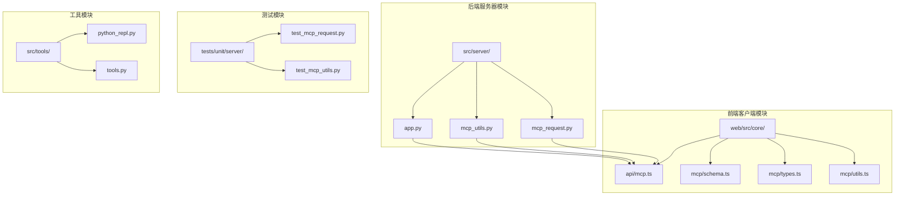
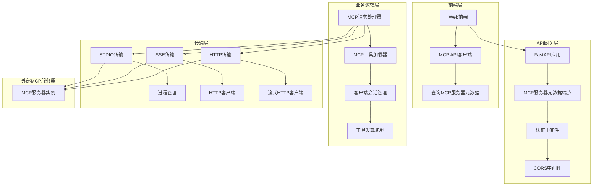
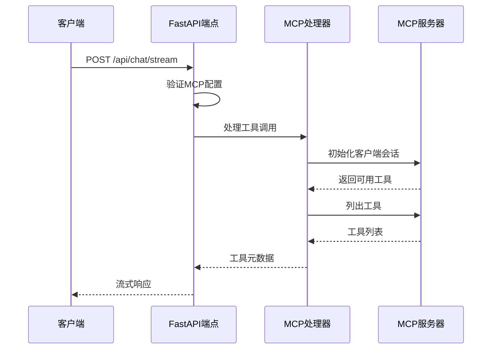
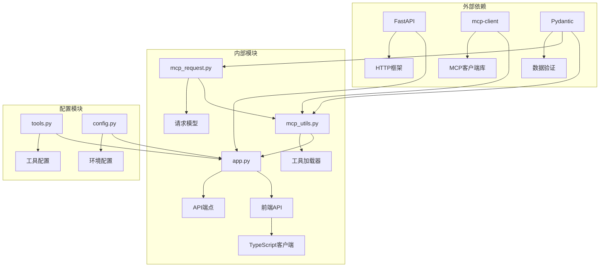

# DeerFlow MCP 集成API文档

<cite>
**本文档中引用的文件**
- [mcp_request.py](file://src/server/mcp_request.py)
- [mcp_utils.py](file://src/server/mcp_utils.py)
- [app.py](file://src/server/app.py)
- [mcp.ts](file://web/src/core/api/mcp.ts)
- [schema.ts](file://web/src/core/mcp/schema.ts)
- [types.ts](file://web/src/core/mcp/types.ts)
- [utils.ts](file://web/src/core/mcp/utils.ts)
- [test_mcp_request.py](file://tests/unit/server/test_mcp_request.py)
- [test_mcp_utils.py](file://tests/unit/server/test_mcp_utils.py)
- [python_repl.py](file://src/tools/python_repl.py)
- [tools.py](file://src/config/tools.py)
</cite>

## 目录
1. [简介](#简介)
2. [项目结构](#项目结构)
3. [核心组件](#核心组件)
4. [架构概览](#架构概览)
5. [详细组件分析](#详细组件分析)
6. [依赖关系分析](#依赖关系分析)
7. [性能考虑](#性能考虑)
8. [故障排除指南](#故障排除指南)
9. [结论](#结论)

## 简介

DeerFlow MCP（Model Control Protocol）集成API是一个完整的MCP服务器发现和工具调用系统，旨在为AI模型提供标准化的外部数据访问和工具执行接口。该系统支持多种传输协议，包括标准输入输出（stdio）、服务器发送事件（SSE）和可流式HTTP连接，为开发者提供了灵活且强大的MCP集成解决方案。

MCP协议作为Anthropic在2024年11月引入的开放标准，专门设计用于标准化AI模型与外部数据源和工具的交互方式。它类似于"USB接口"，使AI模型能够无缝地与外部数据源和工具进行交互，简化了集成过程并提高了现有模型在实际工作流程中的实用性和效率。

## 项目结构

DeerFlow MCP系统的文件组织结构清晰，分为后端服务器模块和前端客户端模块：



**图表来源**
- [mcp_request.py](file://src/server/mcp_request.py#L1-L65)
- [mcp_utils.py](file://src/server/mcp_utils.py#L1-L123)
- [app.py](file://src/server/app.py#L1-L688)

**章节来源**
- [mcp_request.py](file://src/server/mcp_request.py#L1-L65)
- [mcp_utils.py](file://src/server/mcp_utils.py#L1-L123)
- [app.py](file://src/server/app.py#L1-L688)

## 核心组件

### MCP服务器元数据请求模型

MCP系统的核心是`MCPServerMetadataRequest`和`MCPServerMetadataResponse`模型，它们定义了MCP服务器发现的标准接口：

```python
class MCPServerMetadataRequest(BaseModel):
    """MCP服务器元数据请求模型"""
    
    transport: str = Field(..., description="MCP服务器连接类型 (stdio或sse或streamable_http)")
    command: Optional[str] = Field(None, description="执行命令 (stdio类型)")
    args: Optional[List[str]] = Field(None, description="命令参数 (stdio类型)")
    url: Optional[str] = Field(None, description="SSE服务器URL (sse类型)")
    env: Optional[Dict[str, str]] = Field(None, description="环境变量 (stdio类型)")
    headers: Optional[Dict[str, str]] = Field(None, description="HTTP头部 (sse/streamable_http类型)")
    timeout_seconds: Optional[int] = Field(None, description="操作超时时间（秒）")
```

### MCP工具加载器

`load_mcp_tools`函数是MCP系统的核心工具加载器，支持三种不同的传输协议：

```python
async def load_mcp_tools(
    server_type: str,
    command: Optional[str] = None,
    args: Optional[List[str]] = None,
    url: Optional[str] = None,
    env: Optional[Dict[str, str]] = None,
    headers: Optional[Dict[str, str]] = None,
    timeout_seconds: int = 60,
) -> List:
    """从MCP服务器加载工具"""
```

**章节来源**
- [mcp_request.py](file://src/server/mcp_request.py#L8-L65)
- [mcp_utils.py](file://src/server/mcp_utils.py#L40-L123)

## 架构概览

DeerFlow MCP系统采用分层架构设计，确保了良好的模块化和可扩展性：



**图表来源**
- [app.py](file://src/server/app.py#L602-L640)
- [mcp_utils.py](file://src/server/mcp_utils.py#L40-L123)

## 详细组件分析

### 后端API端点分析

#### GET /mcp/servers 端点

虽然当前代码中没有直接的GET端点，但系统通过POST /api/mcp/server/metadata端点实现了类似功能：

```python
@app.post("/api/mcp/server/metadata", response_model=MCPServerMetadataResponse)
async def mcp_server_metadata(request: MCPServerMetadataRequest):
    """获取MCP服务器信息"""
    # 检查MCP服务器配置是否启用
    if not get_bool_env("ENABLE_MCP_SERVER_CONFIGURATION", False):
        raise HTTPException(
            status_code=403,
            detail="MCP服务器配置已禁用。设置ENABLE_MCP_SERVER_CONFIGURATION=true以启用MCP功能。",
        )
    
    try:
        # 设置默认超时时间
        timeout = 300  # 默认300秒
        
        # 使用请求中的自定义超时值
        if request.timeout_seconds is not None:
            timeout = request.timeout_seconds
            
        # 使用工具函数从MCP服务器加载工具
        tools = await load_mcp_tools(
            server_type=request.transport,
            command=request.command,
            args=request.args,
            url=request.url,
            env=request.env,
            headers=request.headers,
            timeout_seconds=timeout,
        )
        
        # 创建包含工具的响应
        response = MCPServerMetadataResponse(
            transport=request.transport,
            command=request.command,
            args=request.args,
            url=request.url,
            env=request.env,
            headers=request.headers,
            tools=tools,
        )
        
        return response
    except Exception as e:
        logger.exception(f"MCP服务器元数据端点错误: {str(e)}")
        raise HTTPException(status_code=500, detail=INTERNAL_SERVER_ERROR_DETAIL)
```

#### POST /mcp/call 端点

系统通过集成到主聊天流中实现了工具调用功能：



**图表来源**
- [app.py](file://src/server/app.py#L602-L640)
- [mcp_utils.py](file://src/server/mcp_utils.py#L20-L38)

### 前端API客户端分析

#### MCP API客户端实现

前端通过`mcp.ts`文件提供了MCP服务器元数据查询功能：

```typescript
export async function queryMCPServerMetadata(
  config: SimpleMCPServerMetadata, 
  signal?: AbortSignal
) {
  const response = await fetch(resolveServiceURL("mcp/server/metadata"), {
    method: "POST",
    headers: {
      "Content-Type": "application/json",
    },
    body: JSON.stringify(config),
    signal,
  });
  
  if (!response.ok) {
    throw new Error(`HTTP error! status: ${response.status}`);
  }
  
  return response.json();
}
```

#### MCP类型定义

前端定义了完整的MCP类型系统：

```typescript
export interface MCPToolMetadata {
  name: string;
  description: string;
  inputSchema?: Record<string, unknown>;
}

export interface GenericMCPServerMetadata<T extends string> {
  name: string;
  transport: T;
  enabled: boolean;
  env?: Record<string, string>;
  headers?: Record<string, string>;
  tools: MCPToolMetadata[];
  createdAt: number;
  updatedAt: number;
}

export interface StdioMCPServerMetadata
  extends GenericMCPServerMetadata<"stdio"> {
  transport: "stdio";
  command: string;
  args?: string[];
}

export interface SSEMCPServerMetadata
  extends GenericMCPServerMetadata<"sse" | "streamable_http"> {
  transport: "sse" | "streamable_http";
  url: string;
}
```

**章节来源**
- [app.py](file://src/server/app.py#L602-L640)
- [mcp.ts](file://web/src/core/api/mcp.ts#L8-L21)
- [types.ts](file://web/src/core/mcp/types.ts#L6-L46)

### MCP传输协议支持

#### STDIO传输协议

STDIO传输协议是最基础的MCP通信方式，适用于本地进程间通信：

```python
elif server_type == "stdio":
    if not command:
        raise HTTPException(
            status_code=400, detail="stdio类型需要命令"
        )
        
    server_params = StdioServerParameters(
        command=command,  # 可执行文件
        args=args,  # 可选命令行参数
        env=env,  # 可选环境变量
    )
    
    return await _get_tools_from_client_session(
        stdio_client(server_params), timeout_seconds
    )
```

#### SSE传输协议

SSE传输协议支持基于HTTP的服务器发送事件通信：

```python
elif server_type == "sse":
    if not url:
        raise HTTPException(
            status_code=400, detail="sse类型需要URL"
        )
        
    return await _get_tools_from_client_session(
        sse_client(url=url, headers=headers, timeout=timeout_seconds), 
        timeout_seconds
    )
```

#### HTTP传输协议

HTTP传输协议支持流式HTTP通信：

```python
elif server_type == "streamable_http":
    if not url:
        raise HTTPException(
            status_code=400, detail="streamable_http类型需要URL"
        )
        
    return await _get_tools_from_client_session(
        streamablehttp_client(url=url, headers=headers, timeout=timeout_seconds), 
        timeout_seconds,
    )
```

**章节来源**
- [mcp_utils.py](file://src/server/mcp_utils.py#L40-L95)

### 错误处理和安全机制

#### 异常处理策略

系统实现了全面的异常处理机制：

```python
try:
    # MCP服务器发现逻辑
    tools = await load_mcp_tools(...)
    return response
except Exception as e:
    if not isinstance(e, HTTPException):
        logger.exception(f"加载MCP工具时出错: {str(e)}")
        raise HTTPException(status_code=500, detail=str(e))
    raise
```

#### 安全配置检查

系统在处理MCP请求前会检查配置状态：

```python
# 检查MCP服务器配置是否启用
if not get_bool_env("ENABLE_MCP_SERVER_CONFIGURATION", False):
    raise HTTPException(
        status_code=403,
        detail="MCP服务器配置已禁用。设置ENABLE_MCP_SERVER_CONFIGURATION=true以启用MCP功能。",
    )
```

**章节来源**
- [mcp_utils.py](file://src/server/mcp_utils.py#L97-L123)
- [app.py](file://src/server/app.py#L607-L612)

## 依赖关系分析

### 核心依赖图



**图表来源**
- [mcp_request.py](file://src/server/mcp_request.py#L1-L65)
- [mcp_utils.py](file://src/server/mcp_utils.py#L1-L123)
- [app.py](file://src/server/app.py#L1-L688)

### 模块间耦合度分析

系统采用了松耦合的设计模式，各模块职责明确：

- **低耦合**: MCP请求模型与工具加载器分离
- **高内聚**: 相关功能集中在同一模块中
- **清晰边界**: 前后端模块职责分明
- **可扩展**: 支持新的传输协议和工具类型

**章节来源**
- [mcp_request.py](file://src/server/mcp_request.py#L1-L65)
- [mcp_utils.py](file://src/server/mcp_utils.py#L1-L123)

## 性能考虑

### 超时配置优化

系统为不同场景设置了合理的超时配置：

```python
# 默认超时设置
timeout = 300  # 元数据端点默认300秒
timeout_seconds = 60  # 工具加载默认60秒

# 支持自定义超时
if request.timeout_seconds is not None:
    timeout = request.timeout_seconds
```

### 并发处理能力

系统支持异步并发处理多个MCP请求：

```python
async def _get_tools_from_client_session(
    client_context_manager: Any, 
    timeout_seconds: int = 10
) -> List:
    """从客户端会话获取工具的辅助函数"""
    async with client_context_manager as context_result:
        read = context_result[0]
        write = context_result[1]
        
        async with ClientSession(
            read, write, 
            read_timeout_seconds=timedelta(seconds=timeout_seconds)
        ) as session:
            await session.initialize()
            listed_tools = await session.list_tools()
            return listed_tools.tools
```

### 内存管理

系统使用上下文管理器确保资源正确释放：

```python
async with ClientSession(...) as session:
    # 使用session
    pass  # 自动关闭连接
```

## 故障排除指南

### 常见错误代码和解决方案

#### 403 Forbidden - MCP配置禁用

**错误信息**: "MCP服务器配置已禁用"

**解决方案**:
1. 设置环境变量 `ENABLE_MCP_SERVER_CONFIGURATION=true`
2. 重启应用程序
3. 验证配置是否正确加载

#### 400 Bad Request - 参数缺失

**错误信息**: "命令是stdio类型的必需参数" 或 "URL是sse类型的必需参数"

**解决方案**:
1. 检查请求参数完整性
2. 确保指定正确的传输类型
3. 提供必要的配置参数

#### 500 Internal Server Error - 连接失败

**错误信息**: "加载MCP工具时出错"

**解决方案**:
1. 检查MCP服务器状态
2. 验证网络连接
3. 查看服务器日志获取详细错误信息

### 调试技巧

#### 启用详细日志

```python
import logging
logging.basicConfig(level=logging.DEBUG)
logger = logging.getLogger(__name__)
```

#### 环境变量配置

```bash
# 启用MCP功能
export ENABLE_MCP_SERVER_CONFIGURATION=true

# 设置超时时间
export MCP_TIMEOUT_SECONDS=300

# 启用调试模式
export DEBUG_MCP=true
```

#### 前端调试

```typescript
// 在前端添加调试信息
console.log('MCP服务器配置:', config);
const response = await queryMCPServerMetadata(config);
console.log('MCP服务器响应:', response);
```

### 性能监控建议

#### 关键指标监控

1. **响应时间**: 监控MCP服务器元数据查询的平均响应时间
2. **成功率**: 跟踪成功和失败的MCP请求比例
3. **并发数**: 监控同时处理的MCP请求数量
4. **内存使用**: 跟踪MCP相关组件的内存消耗

#### 监控配置示例

```python
# 在app.py中添加监控中间件
@app.middleware("http")
async def monitor_mcp_requests(request: Request, call_next):
    start_time = time.time()
    
    response = await call_next(request)
    
    process_time = time.time() - start_time
    logger.info(f"MCP请求耗时: {process_time:.3f}秒")
    
    return response
```

**章节来源**
- [app.py](file://src/server/app.py#L607-L612)
- [mcp_utils.py](file://src/server/mcp_utils.py#L20-L38)

## 结论

DeerFlow MCP集成API提供了一个完整、可靠且高性能的MCP服务器发现和工具调用解决方案。系统具有以下优势：

### 主要特性

1. **多协议支持**: 支持STDIO、SSE和HTTP三种传输协议
2. **类型安全**: 使用Pydantic和TypeScript确保数据验证
3. **异步处理**: 全面支持异步操作，提高并发性能
4. **错误处理**: 完善的异常处理和错误恢复机制
5. **可扩展性**: 模块化设计便于添加新功能

### 最佳实践建议

1. **配置管理**: 正确设置环境变量以启用MCP功能
2. **超时配置**: 根据实际需求调整超时时间
3. **安全考虑**: 在生产环境中启用适当的认证和授权
4. **监控告警**: 实施完善的监控和告警机制
5. **文档维护**: 保持API文档与代码同步更新

### 未来发展方向

1. **协议扩展**: 支持更多MCP传输协议
2. **性能优化**: 进一步优化并发处理能力
3. **安全增强**: 加强身份验证和授权机制
4. **监控完善**: 增加更详细的性能监控指标
5. **工具生态**: 扩展支持更多类型的MCP工具

通过遵循本文档的指导原则和最佳实践，开发者可以有效地集成和使用DeerFlow的MCP功能，构建强大的AI应用系统。