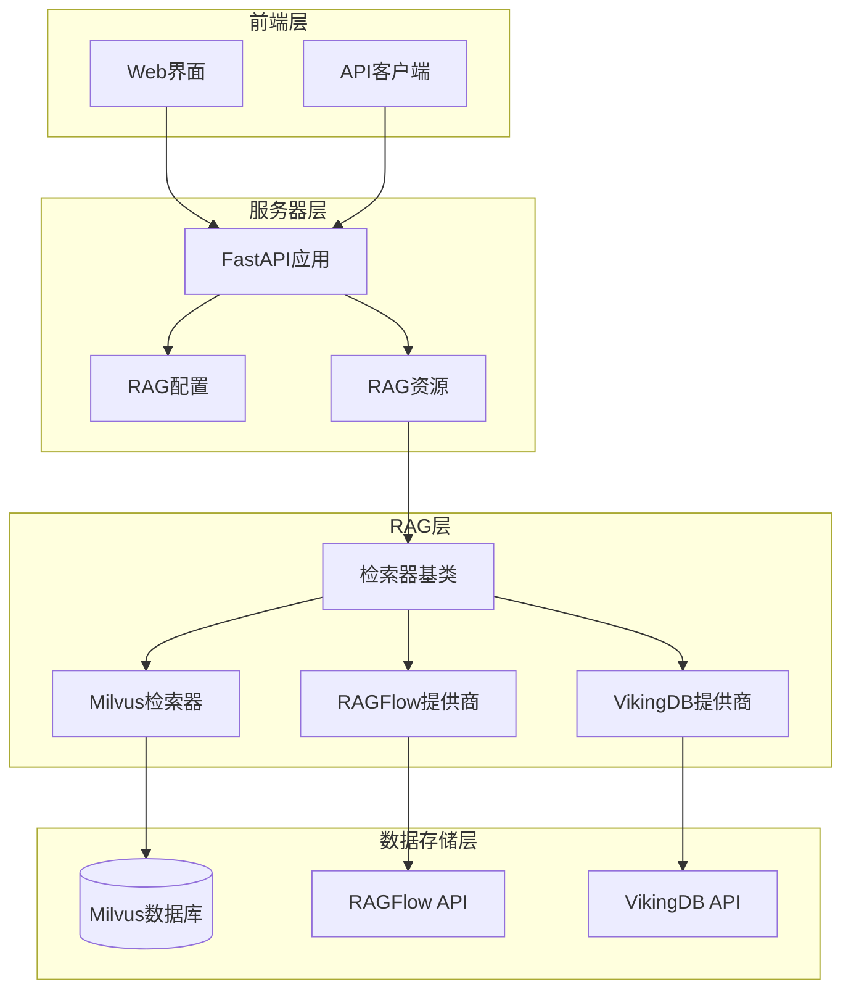
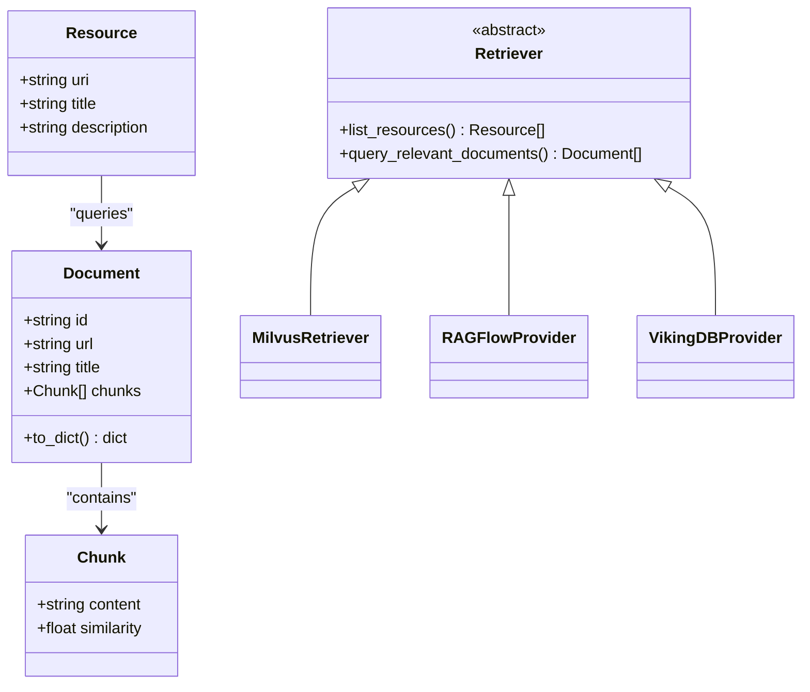
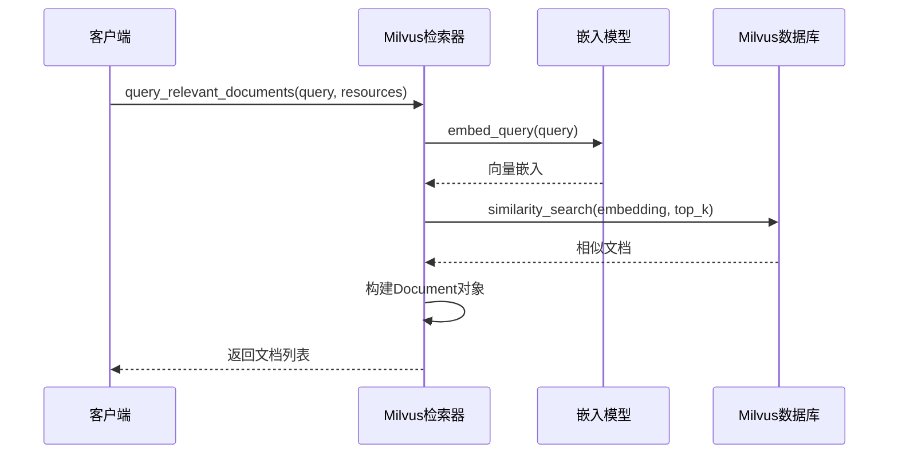
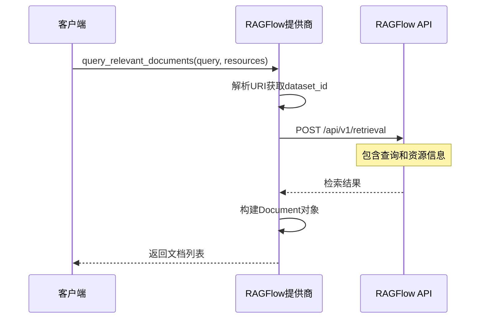
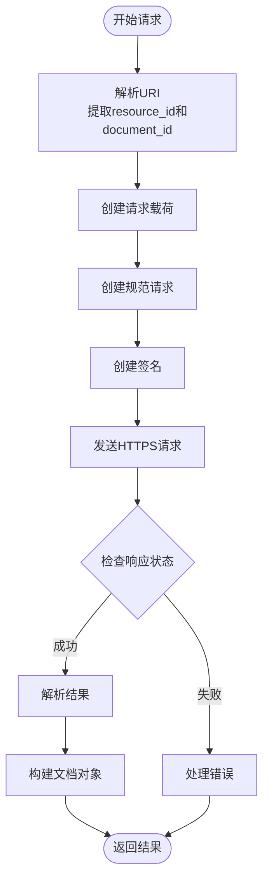
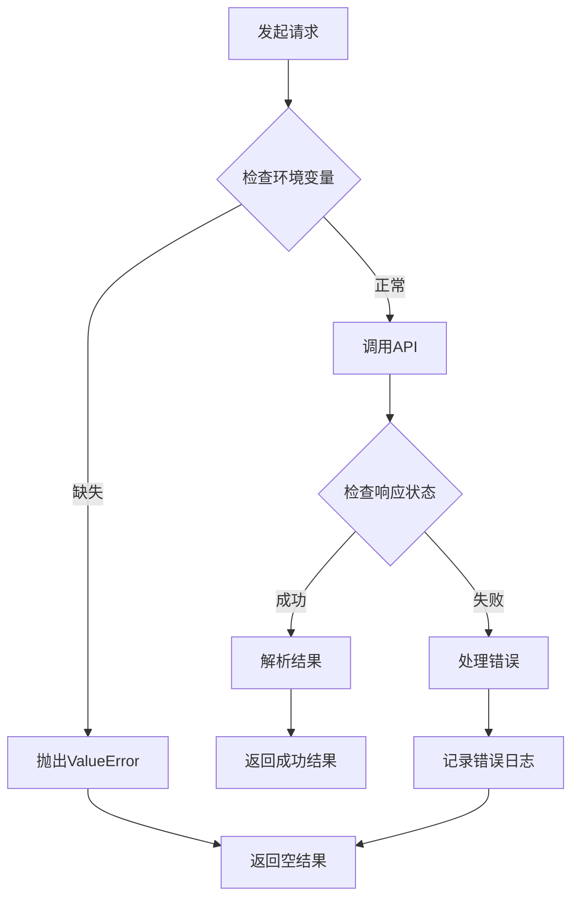

# DeerFlow RAG检索API文档

<cite>
**本文档引用的文件**
- [rag_request.py](file://src/server/rag_request.py)
- [retriever.py](file://src/rag/retriever.py)
- [milvus.py](file://src/rag/milvus.py)
- [ragflow.py](file://src/rag/ragflow.py)
- [vikingdb_knowledge_base.py](file://src/rag/vikingdb_knowledge_base.py)
- [builder.py](file://src/rag/builder.py)
- [app.py](file://src/server/app.py)
- [rag.ts](file://web/src/core/api/rag.ts)
- [tools.py](file://src/config/tools.py)
- [config_request.py](file://src/server/config_request.py)
</cite>

## 目录
1. [简介](#简介)
2. [项目架构](#项目架构)
3. [核心组件](#核心组件)
4. [API端点详解](#api端点详解)
5. [检索器实现](#检索器实现)
6. [向量数据库集成](#向量数据库集成)
7. [前端调用示例](#前端调用示例)
8. [配置选项](#配置选项)
9. [性能优化](#性能优化)
10. [错误处理](#错误处理)
11. [故障排除](#故障排除)
12. [总结](#总结)

## 简介

DeerFlow RAG（检索增强生成）API是一个强大的文档检索系统，支持多种向量数据库和检索提供商。该系统提供了统一的接口来查询文档、管理资源和执行语义搜索。主要特性包括：

- 支持多种RAG提供商：Milvus、RAGFlow、VikingDB
- 统一的检索器接口设计
- 高效的向量相似度搜索
- 灵活的配置管理
- 完整的错误处理机制

## 项目架构



**图表来源**
- [app.py](file://src/server/app.py#L642-L686)
- [builder.py](file://src/rag/builder.py#L10-L20)

## 核心组件

### 检索器抽象基类

所有RAG提供商都继承自`Retriever`抽象基类，确保了一致的接口：

```python
class Retriever(abc.ABC):
    @abc.abstractmethod
    def list_resources(self, query: str | None = None) -> list[Resource]:
        """从RAG提供商列出资源"""
        pass

    @abc.abstractmethod
    def query_relevant_documents(
        self, query: str, resources: list[Resource] = []
    ) -> list[Document]:
        """从资源中查询相关文档"""
        pass
```

### 数据模型

系统使用以下核心数据模型：



**图表来源**
- [retriever.py](file://src/rag/retriever.py#L15-L82)

**章节来源**
- [retriever.py](file://src/rag/retriever.py#L1-L82)

## API端点详解

### GET /api/rag/config

获取RAG配置信息。

**响应格式：**
```json
{
  "provider": "milvus"
}
```

**实现逻辑：**
```python
@app.get("/api/rag/config", response_model=RAGConfigResponse)
async def rag_config():
    """获取RAG配置"""
    return RAGConfigResponse(provider=SELECTED_RAG_PROVIDER)
```

### GET /api/rag/resources

获取RAG资源列表。

**请求参数：**
- `query` (可选): 资源名称查询字符串

**响应格式：**
```json
{
  "resources": [
    {
      "uri": "rag://dataset/123",
      "title": "文档集名称",
      "description": "文档集描述"
    }
  ]
}
```

**实现逻辑：**
```python
@app.get("/api/rag/resources", response_model=RAGResourcesResponse)
async def rag_resources(request: Annotated[RAGResourceRequest, Query()]):
    """获取RAG资源"""
    retriever = build_retriever()
    if retriever:
        return RAGResourcesResponse(resources=retriever.list_resources(request.query))
    return RAGResourcesResponse(resources=[])
```

**章节来源**
- [app.py](file://src/server/app.py#L642-L686)
- [rag_request.py](file://src/server/rag_request.py#L1-L29)

## 检索器实现

### Milvus检索器

Milvus检索器支持本地Lite和远程服务器两种部署模式：



**图表来源**
- [milvus.py](file://src/rag/milvus.py#L50-L100)

### RAGFlow提供商

RAGFlow提供商通过REST API与RAGFlow服务通信：



**图表来源**
- [ragflow.py](file://src/rag/ragflow.py#L35-L88)

### VikingDB提供商

VikingDB提供商实现了完整的AWS签名认证：



**图表来源**
- [vikingdb_knowledge_base.py](file://src/rag/vikingdb_knowledge_base.py#L150-L200)

**章节来源**
- [milvus.py](file://src/rag/milvus.py#L1-L199)
- [ragflow.py](file://src/rag/ragflow.py#L1-L136)
- [vikingdb_knowledge_base.py](file://src/rag/vikingdb_knowledge_base.py#L1-L199)

## 向量数据库集成

### Milvus集成

Milvus支持多种嵌入模型和部署模式：

**环境配置：**
```bash
# 连接配置
MILVUS_URI=http://localhost:19530
MILVUS_USER=admin
MILVUS_PASSWORD=password
MILVUS_COLLECTION=documents

# 搜索配置
MILVUS_TOP_K=10
MILVUS_VECTOR_FIELD=embedding
MILVUS_CONTENT_FIELD=content

# 嵌入配置
MILVUS_EMBEDDING_PROVIDER=openai
MILVUS_EMBEDDING_MODEL=text-embedding-ada-002
MILVUS_EMBEDDING_DIM=1536
```

**索引配置：**
- 索引类型：IVF_FLAT
- 度量标准：内积（IP）
- 聚类数量：1024

### RAGFlow集成

RAGFlow提供完整的文档管理和检索功能：

**环境配置：**
```bash
RAGFLOW_API_URL=http://localhost:9380
RAGFLOW_API_KEY=your-api-key
RAGFLOW_PAGE_SIZE=10
RAGFLOW_CROSS_LANGUAGES=en,zh
```

### VikingDB集成

VikingDB提供企业级知识库服务：

**环境配置：**
```bash
VIKINGDB_KNOWLEDGE_BASE_API_URL=api.example.com
VIKINGDB_KNOWLEDGE_BASE_API_AK=access-key
VIKINGDB_KNOWLEDGE_BASE_API_SK=secret-key
VIKINGDB_KNOWLEDGE_BASE_RETRIEVAL_SIZE=10
VIKINGDB_KNOWLEDGE_BASE_REGION=cn-north-1
```

**章节来源**
- [milvus.py](file://src/rag/milvus.py#L50-L150)
- [ragflow.py](file://src/rag/ragflow.py#L20-L35)
- [vikingdb_knowledge_base.py](file://src/rag/vikingdb_knowledge_base.py#L20-L50)

## 前端调用示例

### JavaScript API调用

前端通过`rag.ts`模块调用RAG服务：

```typescript
import type { Resource } from "../messages";
import { resolveServiceURL } from "./resolve-service-url";

export function queryRAGResources(query: string) {
  return fetch(resolveServiceURL(`rag/resources?query=${query}`), {
    method: "GET",
  })
    .then((res) => res.json())
    .then((res) => {
      return res.resources as Array<Resource>;
    })
    .catch(() => {
      return [];
    });
}
```

### React Hook使用示例

```typescript
import { useState, useEffect } from 'react';
import { queryRAGResources } from '@/core/api/rag';

function useRAGResources(query: string) {
  const [resources, setResources] = useState<Resource[]>([]);
  const [loading, setLoading] = useState(false);
  const [error, setError] = useState<string | null>(null);

  useEffect(() => {
    if (!query) {
      setResources([]);
      return;
    }

    setLoading(true);
    setError(null);

    queryRAGResources(query)
      .then(setResources)
      .catch((err) => {
        setError(err.message);
        setResources([]);
      })
      .finally(() => setLoading(false));
  }, [query]);

  return { resources, loading, error };
}
```

**章节来源**
- [rag.ts](file://web/src/core/api/rag.ts#L1-L17)

## 配置选项

### RAG提供商选择

系统支持三种主要的RAG提供商：

```python
class RAGProvider(enum.Enum):
    RAGFLOW = "ragflow"
    VIKINGDB_KNOWLEDGE_BASE = "vikingdb_knowledge_base"
    MILVUS = "milvus"
```

### 构建器模式

`build_retriever()`函数根据配置动态创建相应的检索器实例：

```python
def build_retriever() -> Retriever | None:
    if SELECTED_RAG_PROVIDER == RAGProvider.RAGFLOW.value:
        return RAGFlowProvider()
    elif SELECTED_RAG_PROVIDER == RAGProvider.VIKINGDB_KNOWLEDGE_BASE.value:
        return VikingDBKnowledgeBaseProvider()
    elif SELECTED_RAG_PROVIDER == RAGProvider.MILVUS.value:
        return MilvusProvider()
    elif SELECTED_RAG_PROVIDER:
        raise ValueError(f"Unsupported RAG provider: {SELECTED_RAG_PROVIDER}")
    return None
```

### 配置验证

系统在启动时会验证必要的环境变量：

```python
# RAGFlow配置验证
if not api_url:
    raise ValueError("RAGFLOW_API_URL is not set")
if not api_key:
    raise ValueError("RAGFLOW_API_KEY is not set")

# Milvus配置验证
if not self.uri:
    raise ValueError("MILVUS_URI is not set")
```

**章节来源**
- [tools.py](file://src/config/tools.py#L1-L30)
- [builder.py](file://src/rag/builder.py#L1-L21)

## 性能优化

### 缓存策略

虽然当前实现没有显式的缓存机制，但可以通过以下方式优化性能：

1. **嵌入模型缓存**：缓存常用的查询向量
2. **文档结果缓存**：缓存频繁查询的文档集合
3. **连接池管理**：复用数据库连接

### 批量检索

对于多个资源的检索，可以考虑批量处理：

```python
def batch_query_relevant_documents(
    self, queries: list[str], resources: list[Resource]
) -> dict[str, list[Document]]:
    """批量查询相关文档"""
    results = {}
    for query in queries:
        results[query] = self.query_relevant_documents(query, resources)
    return results
```

### 并行处理

利用异步编程提高并发性能：

```python
async def async_query_resources(self, queries: list[str]) -> list[Document]:
    """异步查询多个资源"""
    tasks = [self.query_relevant_documents(q) for q in queries]
    return await asyncio.gather(*tasks)
```

### 内存优化

- 使用生成器处理大量文档
- 及时释放不需要的向量数据
- 实现文档分页加载

## 错误处理

### 异常类型

系统定义了多种异常类型来处理不同的错误场景：

```python
# 环境变量缺失
ValueError: "RAGFLOW_API_URL is not set"

# API调用失败
Exception: "Failed to query documents: {response.text}"

# URI格式错误
ValueError: "Invalid URI: {uri}"
```

### 错误恢复策略



### 日志记录

系统使用Python标准日志模块记录错误信息：

```python
import logging

logger = logging.getLogger(__name__)

try:
    response = requests.post(url, headers=headers, json=payload)
    if response.status_code != 200:
        logger.error(f"Failed to query documents: {response.text}")
        raise Exception(f"Failed to query documents: {response.text}")
except Exception as e:
    logger.exception(f"Error in RAG query: {str(e)}")
    raise
```

**章节来源**
- [ragflow.py](file://src/rag/ragflow.py#L35-L45)
- [vikingdb_knowledge_base.py](file://src/rag/vikingdb_knowledge_base.py#L150-L170)

## 故障排除

### 常见问题及解决方案

#### 1. RAG提供商未设置

**问题症状：**
```
ValueError: Unsupported RAG provider: None
```

**解决方案：**
```bash
# 设置RAG提供商
export RAG_PROVIDER=milvus
# 或者
export RAG_PROVIDER=ragflow
export RAG_PROVIDER=vikingdb_knowledge_base
```

#### 2. Milvus连接失败

**问题症状：**
```
Connection refused: localhost:19530
```

**解决方案：**
- 确认Milvus服务正在运行
- 检查网络连接和防火墙设置
- 验证`MILVUS_URI`配置

#### 3. RAGFlow API调用失败

**问题症状：**
```
Failed to query documents: Unauthorized
```

**解决方案：**
- 验证API密钥是否正确
- 检查API URL是否可达
- 确认用户权限设置

#### 4. VikingDB签名认证失败

**问题症状：**
```
Request failed: Authentication failed
```

**解决方案：**
- 验证Access Key和Secret Key
- 检查时间同步
- 确认区域配置正确

### 性能监控指标

建议监控以下关键指标：

1. **响应时间**：API调用的平均响应时间
2. **成功率**：成功处理的请求数占总请求数的比例
3. **错误率**：各类错误的发生频率
4. **资源利用率**：内存和CPU使用情况
5. **数据库连接数**：活跃的数据库连接数量

### 调试工具

```python
# 启用调试日志
import logging
logging.basicConfig(level=logging.DEBUG)

# 性能分析
import time
start_time = time.time()
result = retriever.query_relevant_documents(query)
print(f"Query took {time.time() - start_time:.2f} seconds")
```

## 总结

DeerFlow RAG API提供了一个强大而灵活的文档检索系统，具有以下优势：

### 主要特性

1. **多提供商支持**：兼容Milvus、RAGFlow、VikingDB等多种RAG解决方案
2. **统一接口**：通过抽象基类提供一致的API体验
3. **高性能**：支持向量化搜索和相似度匹配
4. **易于扩展**：模块化设计便于添加新的RAG提供商
5. **完善的错误处理**：全面的异常捕获和日志记录

### 最佳实践

1. **合理选择提供商**：根据具体需求选择最适合的RAG解决方案
2. **优化配置参数**：调整搜索参数以获得最佳性能
3. **实施监控**：建立完善的监控和告警机制
4. **定期维护**：及时更新依赖库和配置文件
5. **测试覆盖**：确保充分的单元测试和集成测试

### 发展方向

未来可以考虑的功能扩展：

1. **缓存机制**：实现智能缓存以提高性能
2. **负载均衡**：支持多实例部署和负载分发
3. **高级过滤**：支持更复杂的查询条件
4. **实时更新**：支持增量索引和实时文档更新
5. **多语言支持**：增强跨语言检索能力

通过本文档的指导，开发者可以充分利用DeerFlow RAG API的强大功能，构建高质量的文档检索应用。