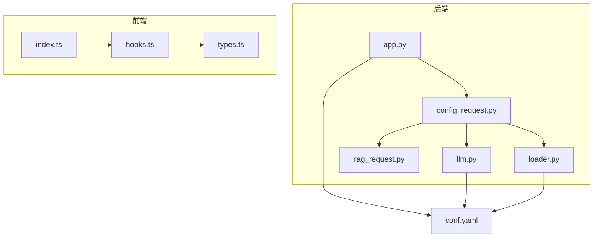
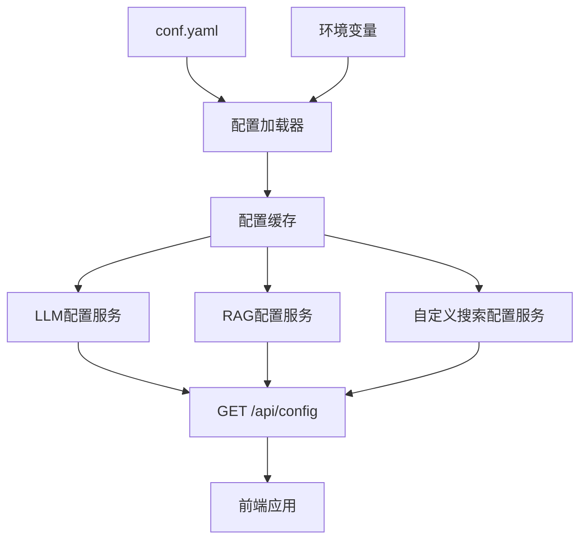
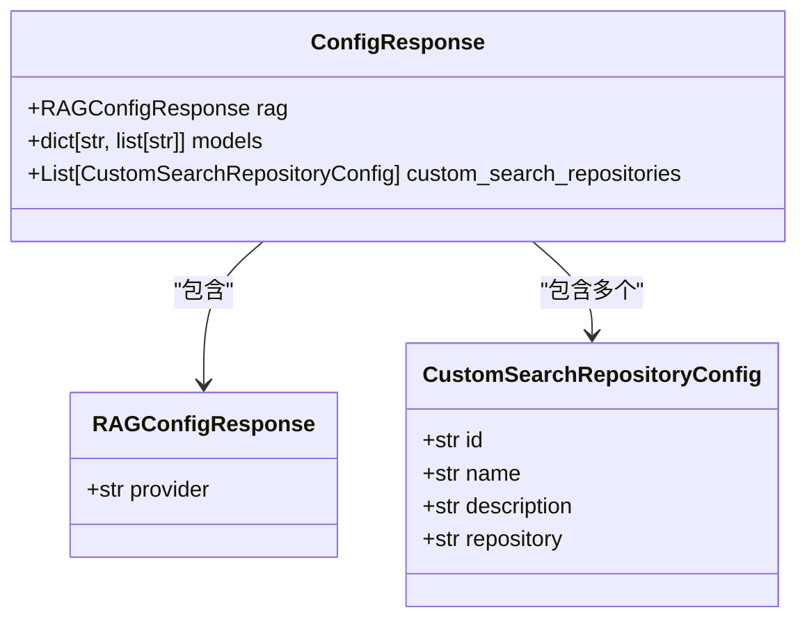
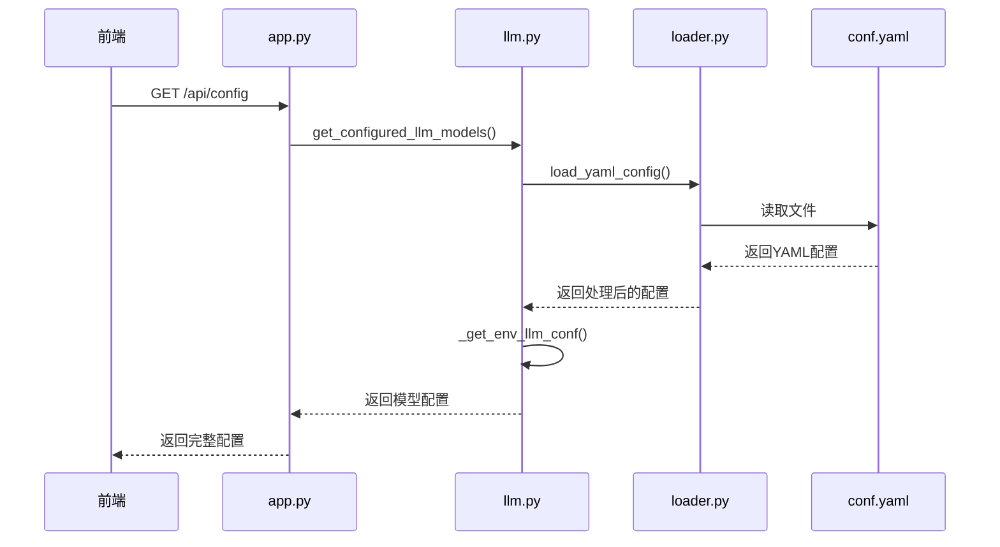
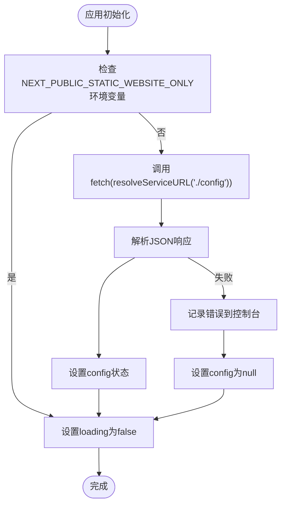
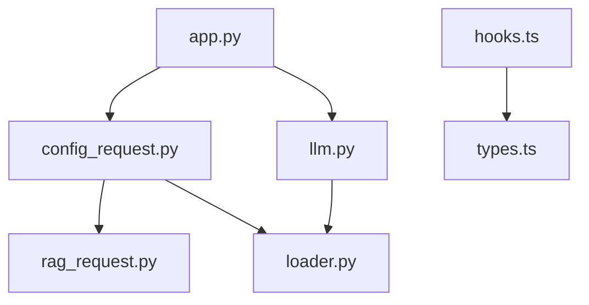

# 配置管理API

<cite>
**本文档中引用的文件**  
- [config_request.py](file://src/server/config_request.py)
- [app.py](file://src/server/app.py)
- [llm.py](file://src/llms/llm.py)
- [rag_request.py](file://src/server/rag_request.py)
- [loader.py](file://src/config/loader.py)
- [conf.yaml](file://conf.yaml)
- [index.ts](file://web/src/core/api/index.ts)
- [hooks.ts](file://web/src/core/api/hooks.ts)
- [types.ts](file://web/src/core/config/types.ts)
</cite>

## 目录
1. [简介](#简介)
2. [项目结构](#项目结构)
3. [核心组件](#核心组件)
4. [架构概述](#架构概述)
5. [详细组件分析](#详细组件分析)
6. [依赖分析](#依赖分析)
7. [性能考虑](#性能考虑)
8. [故障排除指南](#故障排除指南)
9. [结论](#结论)

## 简介
本文档详细记录了DeerFlow系统的配置管理API，涵盖了GET /config和POST /config端点的HTTP方法、URL模式和请求/响应模式。文档描述了系统配置的获取、更新和验证机制，包括LLM提供商、工具设置和代理参数。详细解释了config_request.py中配置处理的实现细节，包括配置加载、验证和持久化。提供了前端如何通过web/src/core/api/index.ts获取和更新配置的示例。涵盖了配置安全策略、敏感信息保护和配置版本管理。包括配置更新的实时生效机制和错误处理流程。

## 项目结构
DeerFlow项目的配置管理功能主要分布在后端服务器和前端应用两个部分。后端配置管理核心位于src/server目录下，主要由config_request.py和app.py文件组成。前端配置管理功能位于web/src/core/api目录下，通过hooks.ts和types.ts文件实现配置的获取和类型定义。

**Diagram sources**
- [app.py](file://src/server/app.py)
- [config_request.py](file://src/server/config_request.py)
- [llm.py](file://src/llms/llm.py)
- [rag_request.py](file://src/server/rag_request.py)
- [loader.py](file://src/config/loader.py)
- [index.ts](file://web/src/core/api/index.ts)
- [hooks.ts](file://web/src/core/api/hooks.ts)
- [types.ts](file://web/src/core/config/types.ts)

**Section sources**
- [app.py](file://src/server/app.py)
- [config_request.py](file://src/server/config_request.py)
- [llm.py](file://src/llms/llm.py)
- [rag_request.py](file://src/server/rag_request.py)
- [loader.py](file://src/config/loader.py)
- [conf.yaml](file://conf.yaml)
- [index.ts](file://web/src/core/api/index.ts)
- [hooks.ts](file://web/src/core/api/hooks.ts)
- [types.ts](file://web/src/core/config/types.ts)

## 核心组件
配置管理API的核心组件包括配置请求处理、LLM模型配置、RAG配置和自定义搜索仓库配置。系统通过Pydantic模型定义了清晰的请求和响应结构，确保了类型安全和数据验证。配置数据来源于YAML文件和环境变量，通过分层配置机制实现了灵活的配置管理。

**Section sources**
- [config_request.py](file://src/server/config_request.py)
- [app.py](file://src/server/app.py)
- [llm.py](file://src/llms/llm.py)
- [rag_request.py](file://src/server/rag_request.py)

## 架构概述
DeerFlow配置管理API采用分层架构设计，从数据源到API端点形成了清晰的数据流。系统首先从conf.yaml文件和环境变量中加载原始配置，然后通过配置加载器进行处理和缓存，最后通过API端点暴露给前端应用。

**Diagram sources**
- [loader.py](file://src/config/loader.py)
- [llm.py](file://src/llms/llm.py)
- [rag_request.py](file://src/server/rag_request.py)
- [app.py](file://src/server/app.py)

## 详细组件分析

### 配置请求处理分析
配置请求处理组件负责处理GET /api/config请求，整合来自不同配置源的数据，并返回统一的配置响应。该组件通过ConfigResponse模型定义了响应结构，包含了RAG配置、LLM模型配置和自定义搜索仓库配置。

**Diagram sources**
- [config_request.py](file://src/server/config_request.py)
- [rag_request.py](file://src/server/rag_request.py)

**Section sources**
- [config_request.py](file://src/server/config_request.py)
- [app.py](file://src/server/app.py)

### LLM配置管理分析
LLM配置管理组件负责获取和管理所有配置的LLM模型。系统支持从YAML文件和环境变量中加载配置，环境变量的配置优先级高于YAML文件。配置信息包括模型类型、API密钥、基础URL等，支持多种LLM提供商。

**Diagram sources**
- [app.py](file://src/server/app.py)
- [llm.py](file://src/llms/llm.py)
- [loader.py](file://src/config/loader.py)
- [conf.yaml](file://conf.yaml)

**Section sources**
- [llm.py](file://src/llms/llm.py)
- [app.py](file://src/server/app.py)

### 前端配置获取分析
前端通过useConfig Hook从后端获取配置信息。系统在应用初始化时自动调用配置API，获取当前系统的配置状态。配置数据被缓存并在整个应用中共享，确保了配置的一致性。

**Diagram sources**
- [hooks.ts](file://web/src/core/api/hooks.ts)
- [types.ts](file://web/src/core/config/types.ts)

**Section sources**
- [hooks.ts](file://web/src/core/api/hooks.ts)
- [types.ts](file://web/src/core/config/types.ts)

## 依赖分析
配置管理系统的组件间存在明确的依赖关系。后端app.py依赖于config_request.py中的响应模型，而config_request.py又依赖于rag_request.py中的RAG配置模型。配置数据的加载依赖于loader.py中的YAML加载功能。前端hooks.ts依赖于types.ts中的类型定义。

**Diagram sources**
- [app.py](file://src/server/app.py)
- [config_request.py](file://src/server/config_request.py)
- [rag_request.py](file://src/server/rag_request.py)
- [loader.py](file://src/config/loader.py)
- [llm.py](file://src/llms/llm.py)
- [hooks.ts](file://web/src/core/api/hooks.ts)
- [types.ts](file://web/src/core/config/types.ts)

## 性能考虑
配置管理系统在性能方面进行了多项优化。首先，配置加载器实现了缓存机制，避免了重复读取和解析YAML文件的开销。其次，LLM实例被缓存，避免了重复创建LLM客户端的开销。API响应经过优化，一次性返回所有必要的配置信息，减少了前端的请求次数。

## 故障排除指南
配置管理API可能遇到的常见问题包括配置文件读取失败、环境变量配置错误和网络连接问题。系统在遇到配置文件不存在时会返回空配置而非抛出异常，确保了系统的健壮性。对于LLM配置加载失败的情况，系统会记录警告日志并返回空的模型配置。

**Section sources**
- [loader.py](file://src/config/loader.py)
- [llm.py](file://src/llms/llm.py)
- [app.py](file://src/server/app.py)

## 结论
DeerFlow配置管理API提供了一套完整的配置管理解决方案，支持从多个源加载配置，具有良好的扩展性和灵活性。系统通过清晰的分层架构和类型安全的设计，确保了配置管理的可靠性和可维护性。前端和后端的紧密集成使得配置信息能够实时反映系统状态，为用户提供了一致的体验。