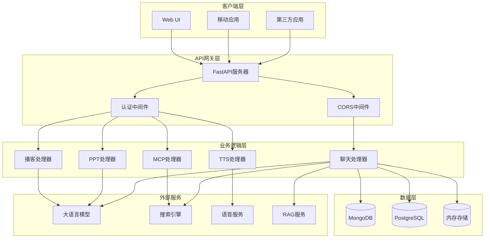
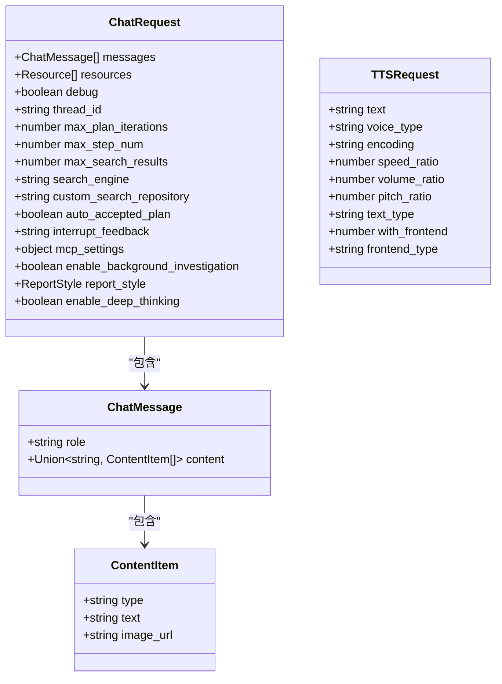
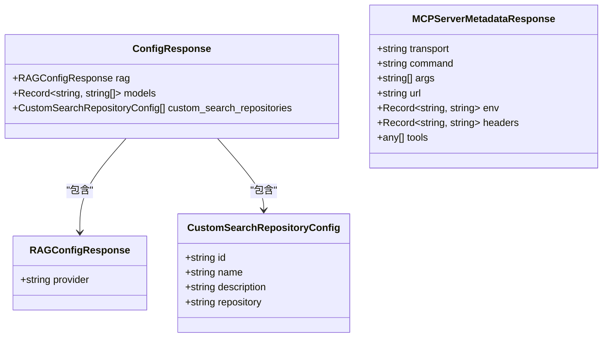
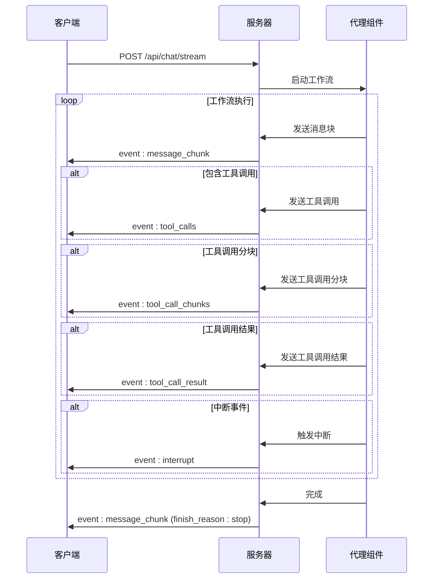
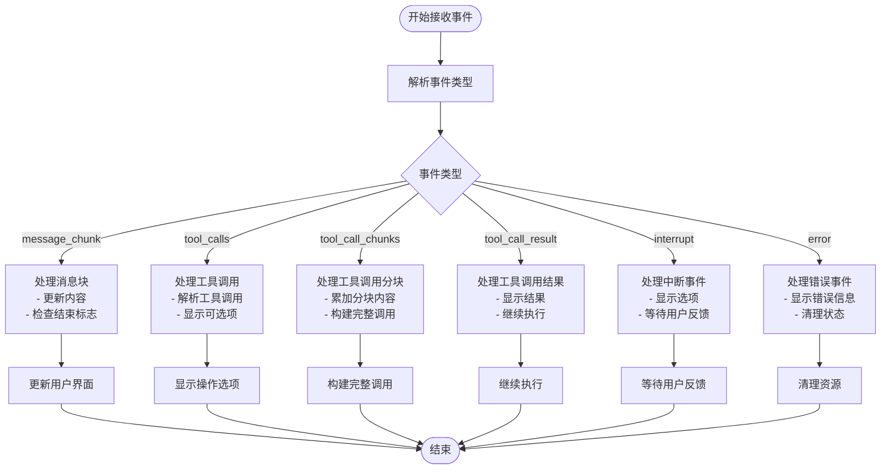
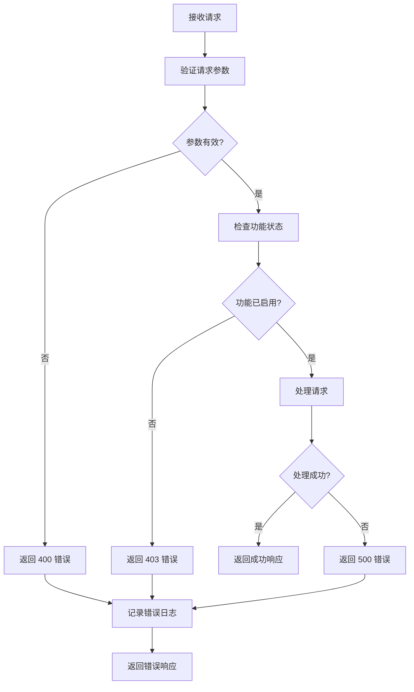

现在我已经收集了足够的信息来创建详细的API文档。让我开始生成文档内容：

<docs>
# DeerFlow API 文档

<cite>
**本文档引用的文件**
- [app.py](file://src/server/app.py)
- [chat_request.py](file://src/server/chat_request.py)
- [config_request.py](file://src/server/config_request.py)
- [mcp_request.py](file://src/server/mcp_request.py)
- [rag_request.py](file://src/server/rag_request.py)
- [mcp_utils.py](file://src/server/mcp_utils.py)
- [types.ts](file://web/src/core/api/types.ts)
- [configuration.py](file://src/config/configuration.py)
</cite>

## 目录
1. [简介](#简介)
2. [项目架构概览](#项目架构概览)
3. [核心API端点](#核心api端点)
4. [数据模型](#数据模型)
5. [流式响应(SSE)](#流式响应sse)
6. [认证与授权](#认证与授权)
7. [使用示例](#使用示例)
8. [错误处理](#错误处理)
9. [性能考虑](#性能考虑)
10. [故障排除指南](#故障排除指南)

## 简介

DeerFlow 是一个基于 FastAPI 的深度研究框架后端服务，提供了完整的 RESTful API 接口用于处理聊天、语音合成、播客生成、PPT 创建等功能。该服务采用流式响应(SSE)技术，支持实时消息传递和多模态交互。

### 主要功能特性

- **深度研究对话**: 支持多轮对话和智能规划
- **流式响应**: 实时消息推送，提升用户体验
- **多模态输入**: 支持文本、图片等多种内容类型
- **MCP 集成**: 支持模型上下文协议的服务集成
- **语音合成**: TTS 功能将文本转换为音频
- **内容生成**: 播客和 PPT 自动生成
- **报告增强**: 提供多种风格的报告优化

## 项目架构概览



**图表来源**
- [app.py](file://src/server/app.py#L1-L688)

## 核心API端点

### 聊天流式接口

**端点**: `POST /api/chat/stream`

**描述**: 处理用户聊天请求并返回流式响应

**请求参数**:
- **Content-Type**: `application/json`
- **Authorization**: 可选的认证令牌

**请求体** (`ChatRequest`):

```typescript
interface ChatRequest {
  messages: ChatMessage[];           // 历史消息列表
  resources: Resource[];             // 使用的资源列表
  debug: boolean;                    // 是否启用调试日志
  thread_id: string;                 // 对话标识符
  max_plan_iterations: number;       // 最大计划迭代次数
  max_step_num: number;              // 计划中的最大步骤数
  max_search_results: number;        // 最大搜索结果数
  search_engine: string;             // 搜索引擎类型
  custom_search_repository: string;  // 自定义搜索仓库ID
  auto_accepted_plan: boolean;       // 是否自动接受计划
  interrupt_feedback: string;        // 中断反馈
  mcp_settings: object;              // MCP 设置
  enable_background_investigation: boolean; // 是否启用背景调查
  report_style: ReportStyle;         // 报告风格
  enable_deep_thinking: boolean;     // 是否启用深度思考
}
```

**响应**: 流式响应 (SSE)

**状态码**:
- `200`: 成功
- `400`: 请求参数错误
- `403`: MCP 功能被禁用
- `500`: 内部服务器错误

### 语音合成接口

**端点**: `POST /api/tts`

**描述**: 将文本转换为语音

**请求体** (`TTSRequest`):

```typescript
interface TTSRequest {
  text: string;              // 要转换为语音的文本
  voice_type: string;        // 语音类型
  encoding: string;          // 音频编码格式
  speed_ratio: number;       // 语速比例
  volume_ratio: number;      // 音量比例
  pitch_ratio: number;       // 音高比例
  text_type: string;         // 文本类型
  with_frontend: number;     // 是否使用前端处理
  frontend_type: string;     // 前端类型
}
```

**响应**: 音频文件 (MP3)

**状态码**:
- `200`: 成功
- `400`: 缺少必要的配置或参数无效
- `500`: TTS 服务错误

### 播客生成接口

**端点**: `POST /api/podcast/generate`

**描述**: 基于内容生成播客音频

**请求体**:

```typescript
interface GeneratePodcastRequest {
  content: string;  // 播客内容
}
```

**响应**: MP3 音频文件

**状态码**:
- `200`: 成功
- `500`: 播客生成失败

### PPT 生成接口

**端点**: `POST /api/ppt/generate`

**描述**: 基于内容生成 PPT 文件

**请求体**:

```typescript
interface GeneratePPTRequest {
  content: string;  // PPT 内容
}
```

**响应**: PPTX 文件

**状态码**:
- `200`: 成功
- `500`: PPT 生成失败

### 报告增强接口

**端点**: `POST /api/prompt/enhance`

**描述**: 增强原始提示词

**请求体**:

```typescript
interface EnhancePromptRequest {
  prompt: string;        // 要增强的原始提示词
  context: string;       // 额外的上下文信息
  report_style: string;  // 报告风格
}
```

**响应**:

```typescript
interface EnhanceResponse {
  result: string;  // 增强后的结果
}
```

**状态码**:
- `200`: 成功
- `500`: 增强失败

### MCP 服务器元数据接口

**端点**: `POST /api/mcp/server/metadata`

**描述**: 获取 MCP 服务器信息

**请求体** (`MCPServerMetadataRequest`):

```typescript
interface MCPServerMetadataRequest {
  transport: string;           // 连接类型 (stdio/sse/streamable_http)
  command?: string;            // 执行命令 (stdio 类型需要)
  args?: string[];            // 命令参数 (stdio 类型需要)
  url?: string;               // SSE/HTTP 服务器 URL
  env?: Record<string, string>; // 环境变量 (stdio 类型需要)
  headers?: Record<string, string>; // HTTP 头 (sse/streamable_http 类型需要)
  timeout_seconds?: number;    // 可选的超时时间(秒)
}
```

**响应体** (`MCPServerMetadataResponse`):

```typescript
interface MCPServerMetadataResponse {
  transport: string;
  command?: string;
  args?: string[];
  url?: string;
  env?: Record<string, string>;
  headers?: Record<string, string>;
  tools: any[];  // MCP 服务器可用的工具列表
}
```

**状态码**:
- `200`: 成功
- `400`: 参数错误或缺少必要参数
- `403`: MCP 功能被禁用
- `500`: MCP 服务器连接失败

### RAG 配置接口

**端点**: `GET /api/rag/config`

**描述**: 获取 RAG 配置信息

**响应体**:

```typescript
interface RAGConfigResponse {
  provider: string | null;  // RAG 提供商
}
```

**状态码**:
- `200`: 成功

### RAG 资源接口

**端点**: `GET /api/rag/resources`

**描述**: 获取 RAG 资源列表

**查询参数**:

```typescript
interface RAGResourceRequest {
  query?: string;  // 查询关键词
}
```

**响应体**:

```typescript
interface RAGResourcesResponse {
  resources: Resource[];  // RAG 资源列表
}
```

**状态码**:
- `200`: 成功

### 服务器配置接口

**端点**: `GET /api/config`

**描述**: 获取服务器配置信息

**响应体**:

```typescript
interface ConfigResponse {
  rag: RAGConfigResponse;  // RAG 配置
  models: Record<string, string[]>;  // 配置的模型列表
  custom_search_repositories: CustomSearchRepositoryConfig[];  // 自定义搜索仓库
}
```

**状态码**:
- `200`: 成功

**节来源**
- [app.py](file://src/server/app.py#L70-L688)
- [chat_request.py](file://src/server/chat_request.py#L1-L116)

## 数据模型

### 聊天消息模型



**图表来源**
- [chat_request.py](file://src/server/chat_request.py#L10-L116)

### 响应模型



**图表来源**
- [config_request.py](file://src/server/config_request.py#L1-L28)
- [mcp_request.py](file://src/server/mcp_request.py#L1-L65)

**节来源**
- [chat_request.py](file://src/server/chat_request.py#L1-L116)
- [config_request.py](file://src/server/config_request.py#L1-L28)
- [mcp_request.py](file://src/server/mcp_request.py#L1-L65)
- [rag_request.py](file://src/server/rag_request.py#L1-L29)

## 流式响应(SSE)

DeerFlow 使用 Server-Sent Events (SSE) 技术实现实时消息推送，支持多种事件类型。

### 事件类型



**图表来源**
- [app.py](file://src/server/app.py#L150-L250)

### 事件格式

每个 SSE 事件都遵循以下格式：

```typescript
interface GenericEvent<T extends string, D extends object> {
  type: T;  // 事件类型
  data: {
    id: string;                                    // 消息ID
    thread_id: string;                             // 线程ID
    agent: "coordinator" | "planner" | "researcher" | "coder" | "reporter";  // 代理名称
    role: "user" | "assistant" | "tool";          // 角色
    finish_reason?: "stop" | "tool_calls" | "interrupt";  // 结束原因
  } & D;
}
```

### 具体事件类型

#### 1. 消息块事件 (`message_chunk`)

```typescript
interface MessageChunkEvent extends GenericEvent<
  "message_chunk",
  {
    content?: string;              // 消息内容
    reasoning_content?: string;    // 推理内容
  }
> {}
```

#### 2. 工具调用事件 (`tool_calls`)

```typescript
interface ToolCallsEvent extends GenericEvent<
  "tool_calls",
  {
    tool_calls: ToolCall[];        // 完整的工具调用列表
    tool_call_chunks: ToolCallChunk[];  // 工具调用分块
  }
> {}
```

#### 3. 工具调用分块事件 (`tool_call_chunks`)

```typescript
interface ToolCallChunksEvent extends GenericEvent<
  "tool_call_chunks",
  {
    tool_call_chunks: ToolCallChunk[];  // 工具调用分块列表
  }
> {}
```

#### 4. 工具调用结果事件 (`tool_call_result`)

```typescript
interface ToolCallResultEvent extends GenericEvent<
  "tool_call_result",
  {
    tool_call_id: string;          // 工具调用ID
    content?: string;              // 结果内容
  }
> {}
```

#### 5. 中断事件 (`interrupt`)

```typescript
interface InterruptEvent extends GenericEvent<
  "interrupt",
  {
    options: Option[];             // 可选项
  }
> {}
```

### 事件处理流程



**图表来源**
- [app.py](file://src/server/app.py#L250-L400)

**节来源**
- [types.ts](file://web/src/core/api/types.ts#L1-L85)
- [app.py](file://src/server/app.py#L150-L400)

## 认证与授权

### CORS 配置

DeerFlow 使用 CORS 中间件来控制跨域访问：

```python
allowed_origins_str = get_str_env("ALLOWED_ORIGINS", "http://localhost:3000")
allowed_origins = [origin.strip() for origin in allowed_origins_str.split(",")]

app.add_middleware(
    CORSMiddleware,
    allow_origins=allowed_origins,
    allow_credentials=True,
    allow_methods=["GET", "POST", "OPTIONS"],
    allow_headers=["*"],
)
```

### 环境变量配置

- **ALLOWED_ORIGINS**: 允许的前端域名列表，逗号分隔
- **ENABLE_MCP_SERVER_CONFIGURATION**: 是否启用 MCP 服务器配置
- **AGENT_RECURSION_LIMIT**: 代理递归限制

### 认证机制

目前 API 不强制要求认证，但可以通过以下方式实现：

1. **API 密钥**: 在请求头中添加 `Authorization: Bearer <api_key>`
2. **CORS 限制**: 通过 ALLOWED_ORIGINS 控制访问来源
3. **IP 白名单**: 在网关层实现 IP 访问控制

**节来源**
- [app.py](file://src/server/app.py#L40-L60)

## 使用示例

### 基础聊天请求

```bash
curl --location 'http://localhost:8000/api/chat/stream' \
--header 'Content-Type: application/json' \
--data '{
    "messages": [
        {
            "role": "user",
            "content": "什么是量子计算？"
        }
    ],
    "thread_id": "my_conversation_123",
    "max_plan_iterations": 2,
    "report_style": "ACADEMIC"
}'
```

### 语音合成请求

```bash
curl --location 'http://localhost:8000/api/tts' \
--header 'Content-Type: application/json' \
--data '{
    "text": "量子计算是一种利用量子力学原理进行信息处理的新型计算模式。",
    "speed_ratio": 1.2,
    "volume_ratio": 1.0,
    "pitch_ratio": 1.0
}' \
--output "quantum_computing.mp3"
```

### MCP 服务器元数据请求

```bash
curl --location 'http://localhost:8000/api/mcp/server/metadata' \
--header 'Content-Type: application/json' \
--data '{
    "transport": "stdio",
    "command": "/usr/local/bin/my-mcp-server",
    "args": ["--config", "mcp-config.json"],
    "timeout_seconds": 30
}'
```

### 获取服务器配置

```bash
curl 'http://localhost:8000/api/config'
```

### 流式响应处理

```javascript
const eventSource = new EventSource('http://localhost:8000/api/chat/stream');

eventSource.onmessage = function(event) {
    const data = JSON.parse(event.data);
    
    switch(data.type) {
        case 'message_chunk':
            console.log('消息:', data.data.content);
            break;
        case 'tool_calls':
            console.log('工具调用:', data.data.tool_calls);
            break;
        case 'interrupt':
            console.log('中断:', data.data.options);
            break;
        case 'error':
            console.error('错误:', data.data.error);
            break;
    }
};

eventSource.onerror = function(error) {
    console.error('SSE 错误:', error);
    eventSource.close();
};
```

### 使用 Python 客户端

```python
import requests
import json

# 聊天请求
def chat_request(messages, thread_id="default"):
    url = "http://localhost:8000/api/chat/stream"
    payload = {
        "messages": messages,
        "thread_id": thread_id,
        "max_plan_iterations": 1,
        "report_style": "ACADEMIC"
    }
    
    response = requests.post(url, json=payload, stream=True)
    
    for line in response.iter_lines():
        if line.startswith(b'data: '):
            try:
                data = json.loads(line.decode('utf-8')[5:])
                print(f"Received: {data}")
            except json.JSONDecodeError:
                continue

# TTS 请求
def tts_request(text, speed=1.0):
    url = "http://localhost:8000/api/tts"
    payload = {
        "text": text,
        "speed_ratio": speed
    }
    
    response = requests.post(url, json=payload)
    
    if response.status_code == 200:
        with open("output.mp3", "wb") as f:
            f.write(response.content)
        print("音频文件已保存")
    else:
        print(f"错误: {response.status_code} - {response.text}")
```

## 错误处理

### 常见错误代码

| 状态码 | 错误类型 | 描述 |
|--------|----------|------|
| 400 | Bad Request | 请求参数无效或缺失 |
| 403 | Forbidden | 功能被禁用或权限不足 |
| 500 | Internal Server Error | 服务器内部错误 |

### 错误响应格式

```typescript
interface ErrorResponse {
  detail: string;  // 错误详情
}
```

### 错误处理策略



### 错误恢复机制

1. **重试机制**: 对于临时性错误，建议实现指数退避重试
2. **降级处理**: 当某些功能不可用时，提供基础功能
3. **优雅降级**: 在部分功能失败时，不影响核心流程

**节来源**
- [app.py](file://src/server/app.py#L70-L150)

## 性能考虑

### 并发处理

- **异步处理**: 所有 API 端点都使用异步处理
- **连接池**: 数据库连接使用连接池管理
- **资源限制**: 通过环境变量控制并发数量

### 缓存策略

- **内存缓存**: 使用 InMemoryStore 缓存流式消息
- **数据库缓存**: 支持 MongoDB 和 PostgreSQL 检查点
- **响应缓存**: 对静态配置信息进行缓存

### 优化建议

1. **批量处理**: 对于多个请求，考虑批量处理以提高效率
2. **连接复用**: 使用 HTTP/2 或连接池减少连接开销
3. **压缩传输**: 启用 gzip 压缩减少传输大小
4. **CDN 加速**: 对静态资源使用 CDN

### 监控指标

- **响应时间**: 监控各端点的平均响应时间
- **错误率**: 跟踪各状态码的错误率
- **并发数**: 监控同时处理的请求数量
- **资源使用**: 监控 CPU、内存和磁盘使用情况

## 故障排除指南

### 常见问题及解决方案

#### 1. MCP 功能无法使用

**症状**: 收到 "MCP server configuration is disabled" 错误

**解决方案**:
```bash
# 设置环境变量
export ENABLE_MCP_SERVER_CONFIGURATION=true

# 或在 .env 文件中添加
ENABLE_MCP_SERVER_CONFIGURATION=true
```

#### 2. TTS 服务失败

**症状**: TTS 请求返回 500 错误

**解决方案**:
```bash
# 检查 TTS 配置
export VOLCENGINE_TTS_APPID="your_app_id"
export VOLCENGINE_TTS_ACCESS_TOKEN="your_access_token"

# 验证 API 密钥有效性
curl -X POST "https://api.volcengine.com/tts/v1" \
     -H "Authorization: Bearer $VOLCENGINE_TTS_ACCESS_TOKEN" \
     -d '{"text": "test"}'
```

#### 3. 数据库连接问题

**症状**: 检查点功能失效

**解决方案**:
```bash
# 检查数据库连接字符串
export LANGGRAPH_CHECKPOINT_DB_URL="postgresql://localhost:5432/postgres"

# 验证数据库连接
psql "$LANGGRAPH_CHECKPOINT_DB_URL" -c "\dt"
```

#### 4. CORS 问题

**症状**: 跨域请求被阻止

**解决方案**:
```bash
# 设置允许的域名
export ALLOWED_ORIGINS="http://localhost:3000,http://example.com"

# 或在代码中配置
allowed_origins = ["http://localhost:3000", "https://example.com"]
```

### 调试技巧

1. **启用调试日志**:
```bash
export DEBUG=true
```

2. **检查环境变量**:
```bash
# 列出所有相关环境变量
env | grep -E "(API|TTS|MCP|RAG|LANGGRAPH)"

# 验证特定变量
echo $VOLCENGINE_TTS_APPID
```

3. **测试网络连接**:
```bash
# 测试外部服务连接
curl -I "https://api.tavily.com"

# 测试