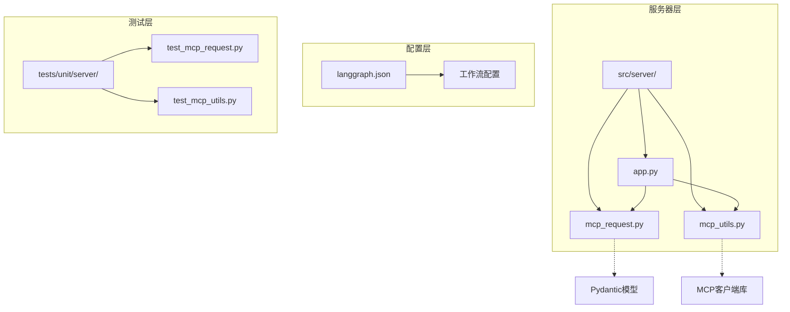
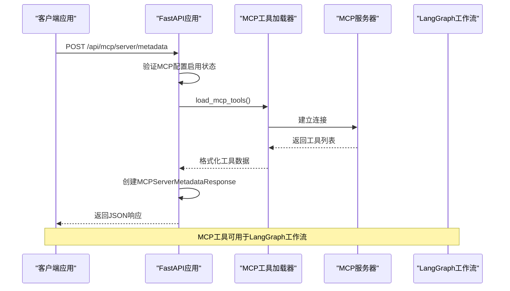
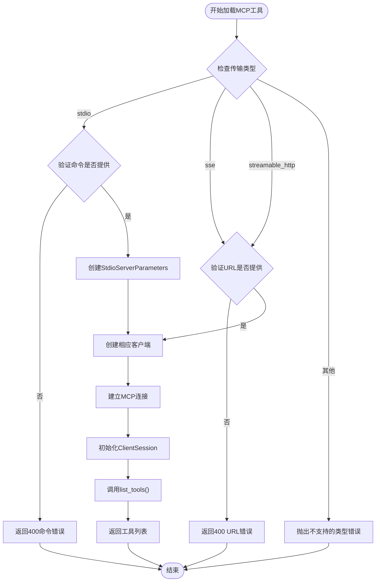
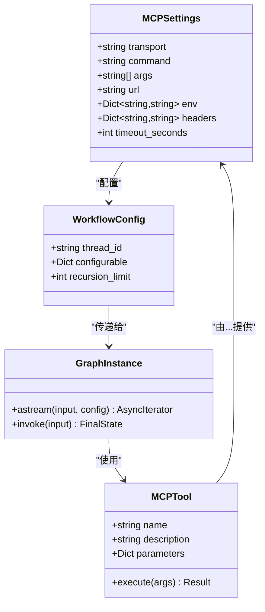
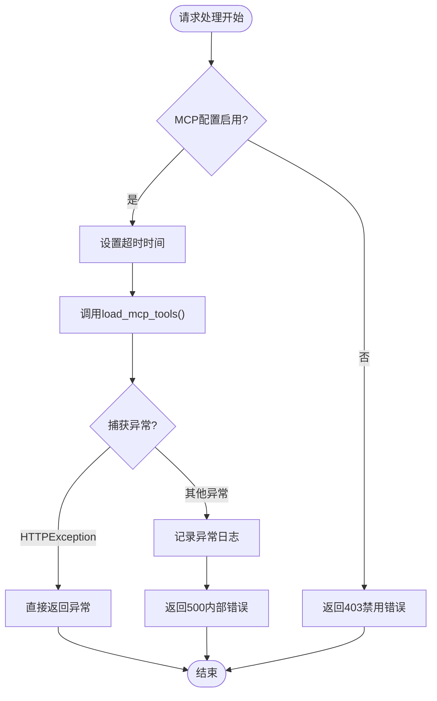
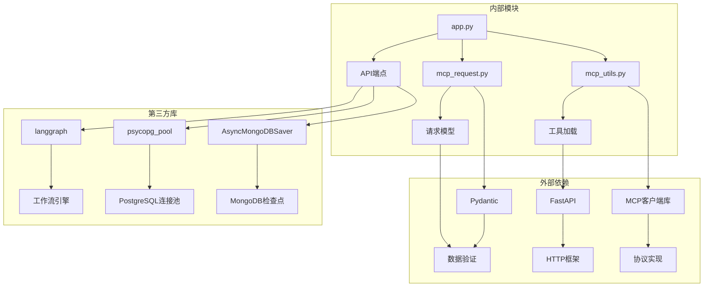

# MCP API 文档

<cite>
**本文档引用的文件**
- [mcp_request.py](file://src/server/mcp_request.py)
- [mcp_utils.py](file://src/server/mcp_utils.py)
- [app.py](file://src/server/app.py)
- [langgraph.json](file://langgraph.json)
- [test_mcp_request.py](file://tests/unit/server/test_mcp_request.py)
- [test_mcp_utils.py](file://tests/unit/server/test_mcp_utils.py)
</cite>

## 目录
1. [简介](#简介)
2. [项目结构](#项目结构)
3. [核心组件](#核心组件)
4. [架构概览](#架构概览)
5. [详细组件分析](#详细组件分析)
6. [依赖关系分析](#依赖关系分析)
7. [性能考虑](#性能考虑)
8. [故障排除指南](#故障排除指南)
9. [结论](#结论)

## 简介

MCP（Model Context Protocol）API 是 deer-flow 项目中的一个重要组件，它提供了与模型上下文协议服务器进行交互的能力。该API通过 `/api/mcp/server/metadata` 端点接收POST请求，用于获取MCP服务器的元数据信息，包括可用工具列表和其他配置信息。

MCP API 的主要功能包括：
- 支持多种传输协议（stdio、SSE、streamable_http）
- 动态加载MCP服务器工具
- 与LangGraph工作流系统集成
- 提供标准化的工具调用接口
- 支持多智能体协作环境

## 项目结构

deer-flow 项目采用模块化的架构设计，MCP API 相关的文件主要位于以下目录结构中：



**图表来源**
- [app.py](file://src/server/app.py#L1-L50)
- [mcp_request.py](file://src/server/mcp_request.py#L1-L65)
- [mcp_utils.py](file://src/server/mcp_utils.py#L1-L123)

**章节来源**
- [app.py](file://src/server/app.py#L1-L688)
- [mcp_request.py](file://src/server/mcp_request.py#L1-L65)
- [mcp_utils.py](file://src/server/mcp_utils.py#L1-L123)

## 核心组件

### MCP 请求模型

MCP API 使用两个核心的 Pydantic 模型来处理请求和响应：

#### MCPServerMetadataRequest
这是客户端发送给MCP服务器的请求模型，包含以下字段：

- **transport** (必需): 连接类型（stdio、sse、streamable_http）
- **command** (可选): 执行命令（仅适用于stdio类型）
- **args** (可选): 命令参数（仅适用于stdio类型）
- **url** (可选): SSE/HTTP服务器URL（适用于sse和streamable_http类型）
- **env** (可选): 环境变量（仅适用于stdio类型）
- **headers** (可选): HTTP头部（适用于sse和streamable_http类型）
- **timeout_seconds** (可选): 超时时间（秒）

#### MCPServerMetadataResponse
这是MCP服务器返回的响应模型，包含：

- **transport**: 连接类型
- **command**: 执行命令
- **args**: 命令参数
- **url**: 服务器URL
- **env**: 环境变量
- **headers**: HTTP头部
- **tools**: 可用工具列表

**章节来源**
- [mcp_request.py](file://src/server/mcp_request.py#L8-L65)

## 架构概览

MCP API 的整体架构展示了从客户端请求到最终响应的完整流程：



**图表来源**
- [app.py](file://src/server/app.py#L640-L680)
- [mcp_utils.py](file://src/server/mcp_utils.py#L40-L123)

## 详细组件分析

### MCP 工具加载器

MCP 工具加载器是整个MCP API的核心组件，负责根据不同的传输协议与MCP服务器建立连接并获取可用工具。



**图表来源**
- [mcp_utils.py](file://src/server/mcp_utils.py#L40-L123)

#### 支持的传输协议

1. **stdio 协议**
   - 适用于本地进程通信
   - 需要指定可执行命令
   - 支持命令行参数和环境变量

2. **SSE 协议**
   - 适用于基于服务器发送事件的通信
   - 需要提供服务器URL
   - 支持自定义HTTP头部

3. **streamable_http 协议**
   - 适用于HTTP流式通信
   - 需要提供服务器URL
   - 支持HTTP头部认证

**章节来源**
- [mcp_utils.py](file://src/server/mcp_utils.py#L40-L123)

### LangGraph 集成

MCP API 与 LangGraph 工作流系统深度集成，允许在多智能体协作环境中使用MCP工具：



**图表来源**
- [app.py](file://src/server/app.py#L200-L300)
- [mcp_request.py](file://src/server/mcp_request.py#L8-L65)

**章节来源**
- [app.py](file://src/server/app.py#L200-L350)

### 错误处理机制

MCP API 实现了完善的错误处理机制：



**图表来源**
- [app.py](file://src/server/app.py#L640-L680)

**章节来源**
- [app.py](file://src/server/app.py#L640-L680)
- [mcp_utils.py](file://src/server/mcp_utils.py#L100-L123)

## 依赖关系分析

MCP API 的依赖关系展现了清晰的分层架构：



**图表来源**
- [mcp_utils.py](file://src/server/mcp_utils.py#L1-L15)
- [app.py](file://src/server/app.py#L1-L50)

**章节来源**
- [mcp_utils.py](file://src/server/mcp_utils.py#L1-L15)
- [app.py](file://src/server/app.py#L1-L50)

## 性能考虑

### 超时管理

MCP API 实现了灵活的超时管理策略：

- **默认超时**: 60秒（首次执行）
- **端点特定超时**: 300秒（metadata端点）
- **可配置超时**: 支持自定义超时时间

### 并发处理

由于使用了异步编程模式，MCP API 能够高效处理多个并发请求：

- 异步客户端连接
- 非阻塞I/O操作
- 连接池复用

### 内存优化

- 工具列表的惰性加载
- 上下文管理器确保资源释放
- 适当的异常处理避免内存泄漏

## 故障排除指南

### 常见问题及解决方案

1. **MCP服务器配置未启用**
   ```
   错误: 403 Forbidden
   解决方案: 设置环境变量 ENABLE_MCP_SERVER_CONFIGURATION=true
   ```

2. **stdio类型缺少命令**
   ```
   错误: 400 Bad Request
   解决方案: 在请求中提供有效的command字段
   ```

3. **SSE/HTTP类型缺少URL**
   ```
   错误: 400 Bad Request
   解决方案: 在请求中提供有效的url字段
   ```

4. **连接超时**
   ```
   错误: 500 Internal Server Error
   解决方案: 增加timeout_seconds参数或检查网络连接
   ```

### 调试技巧

- 启用详细日志记录
- 检查环境变量配置
- 验证MCP服务器可达性
- 使用测试用例验证功能

**章节来源**
- [test_mcp_request.py](file://tests/unit/server/test_mcp_request.py#L1-L75)
- [test_mcp_utils.py](file://tests/unit/server/test_mcp_utils.py#L1-L133)

## 结论

MCP API 是 deer-flow 项目中一个设计精良的组件，它成功地实现了以下目标：

1. **标准化接口**: 提供了符合MCP标准的API接口
2. **多协议支持**: 支持stdio、SSE和streamable_http三种传输协议
3. **LangGraph集成**: 无缝集成到LangGraph工作流系统中
4. **错误处理**: 实现了完善的错误处理和异常管理
5. **可扩展性**: 设计上支持未来协议的扩展

该API为deer-flow项目提供了强大的工具调用能力，使其能够在多智能体协作环境中发挥更大的作用。通过合理的架构设计和完善的测试覆盖，确保了系统的稳定性和可靠性。