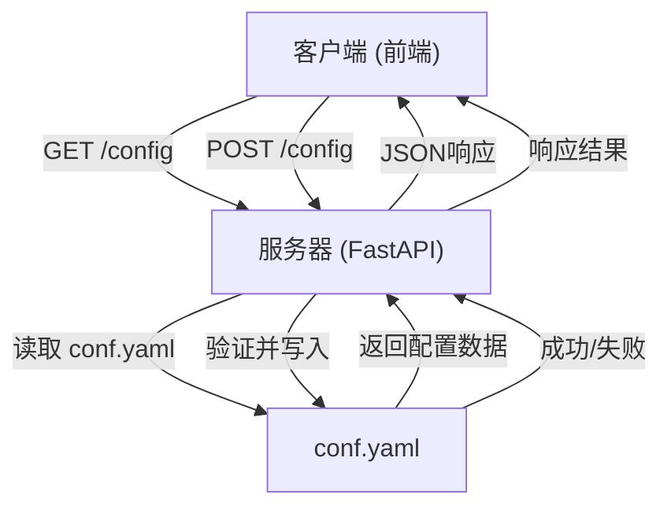
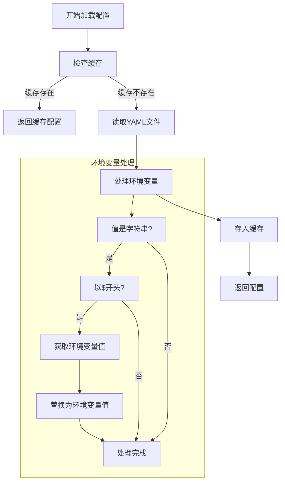
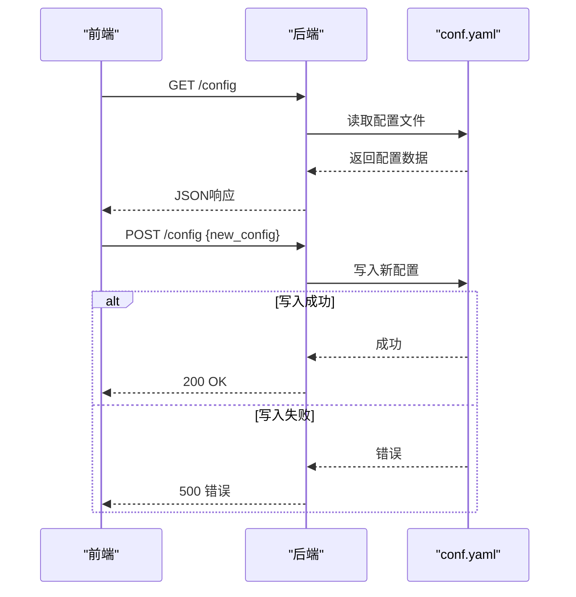

# 配置API

<cite>
**本文档中引用的文件**  
- [config_request.py](file://src/server/config_request.py)
- [configuration.py](file://src/config/configuration.py)
- [loader.py](file://src/config/loader.py)
- [conf.yaml](file://conf.yaml)
- [app.py](file://src/server/app.py)
- [types.ts](file://web/src/core/config/types.ts)
- [hooks.ts](file://web/src/core/api/hooks.ts)
</cite>

## 目录
1. [简介](#简介)
2. [配置API端点](#配置api端点)
3. [配置读取与写入逻辑](#配置读取与写入逻辑)
4. [可配置选项](#可配置选项)
5. [前端配置交互](#前端配置交互)
6. [curl示例](#curl示例)
7. [配置持久化与重启要求](#配置持久化与重启要求)

## 简介
本文档详细描述了deer-flow系统的配置API，涵盖`/config`端点的GET和POST方法，用于获取和更新系统配置。文档解释了配置的处理逻辑、可配置选项、前端交互方式以及配置变更的持久化机制。

## 配置API端点
`/config`端点提供GET和POST方法来管理系统的配置。

- **GET /config**: 获取当前系统配置
- **POST /config**: 更新系统配置

这些端点在`src/server/app.py`中定义，并通过FastAPI框架暴露。



**Diagram sources**  
- [app.py](file://src/server/app.py)
- [config_request.py](file://src/server/config_request.py)

**Section sources**  
- [app.py](file://src/server/app.py#L1-L200)
- [config_request.py](file://src/server/config_request.py#L1-L28)

## 配置读取与写入逻辑
配置的读取和写入逻辑主要在`src/config/loader.py`中实现，通过`load_yaml_config`函数加载YAML配置文件，并支持环境变量替换。

```python
def load_yaml_config(file_path: str) -> Dict[str, Any]:
    """加载并处理YAML配置文件。"""
    if not os.path.exists(file_path):
        return {}
        
    if file_path in _config_cache:
        return _config_cache[file_path]
        
    with open(file_path, "r") as f:
        config = yaml.safe_load(f)
    processed_config = process_dict(config)
    _config_cache[file_path] = processed_config
    return processed_config
```

配置数据在内存中被缓存以提高性能，且支持递归处理字典中的环境变量引用。



**Diagram sources**  
- [loader.py](file://src/config/loader.py#L50-L78)

**Section sources**  
- [loader.py](file://src/config/loader.py#L1-L78)

## 可配置选项
系统支持多种可配置选项，主要分为LLM提供商、智能体设置和工具配置等类别。

### LLM提供商配置
在`conf.yaml`中可以配置基础模型和推理模型：

```yaml
BASIC_MODEL:
  base_url: http://192.168.0.106:8088/v1
  model: qwen3-0.6
  api_key: xxxx
  verify_ssl: false

REASONING_MODEL:
  base_url: https://ark.cn-beijing.volces.com/api/v3
  model: "doubao-1-5-thinking-pro-m-250428"
  api_key: xxxx
  max_retries: 3
```

### 智能体设置
通过`Configuration`类定义了智能体的各种参数：

```python
@dataclass(kw_only=True)
class Configuration:
    resources: list[Resource] = field(default_factory=list)
    max_plan_iterations: int = 1
    max_step_num: int = 3
    max_search_results: int = 3
    search_engine: str = "custom_search"
    custom_search_repository: Optional[str] = None
    mcp_settings: dict = None
    report_style: str = ReportStyle.ACADEMIC.value
    enable_deep_thinking: bool = False
```

### 工具配置
搜索工具和自定义搜索仓库的配置：

```yaml
SEARCH_ENGINE:
  engine: tavily
  include_domains:
    - example.com
    - trusted-news.com
  exclude_domains:
    - example.com

CUSTOM_SEARCH:
  repositories:
    aggregation_search:
      name: "聚合搜索"
      description: "聚合多个数据源的搜索服务"
      repository: "aggregation-search"
    vector_search:
      name: "向量库"
      description: "基于向量相似度的搜索服务"
      repository: "euvd-searchByChannelId"
    dynamic_search:
      name: "交行知道"
      description: "交通银行内部知识库搜索"
      repository: "okic-dynamicSearch"
  default_repository: "dynamic_search"
```

**Section sources**  
- [conf.yaml](file://conf.yaml#L1-L68)
- [configuration.py](file://src/config/configuration.py#L1-L70)

## 前端配置交互
前端通过`web/src/core/api/hooks.ts`中的hook来获取和提交配置变更。

```typescript
useEffect(() => {
  fetch(resolveServiceURL("./config"))
    .then((res) => res.json())
    .then((config) => {
      setConfig(config);
      setLoading(false);
    })
    .catch((err) => {
      console.error("Failed to fetch config", err);
      setConfig(null);
      setLoading(false);
    });
}, []);
```

前端配置类型定义在`web/src/core/config/types.ts`中：

```typescript
export interface DeerFlowConfig {
  rag: RagConfig;
  models: ModelConfig;
  custom_search_repositories: CustomSearchRepositoryConfig[];
}
```

当用户在设置界面修改配置时，前端会通过POST请求将更新后的配置发送到`/config`端点。



**Diagram sources**  
- [hooks.ts](file://web/src/core/api/hooks.ts#L53-L72)
- [types.ts](file://web/src/core/config/types.ts#L1-L22)

**Section sources**  
- [hooks.ts](file://web/src/core/api/hooks.ts#L53-L72)
- [types.ts](file://web/src/core/config/types.ts#L1-L22)

## curl示例
以下是使用curl查询当前配置和应用新配置设置的示例。

### 查询当前配置
```bash
curl -X GET http://localhost:8000/api/config
```

响应示例：
```json
{
  "rag": {
    "provider": "milvus"
  },
  "models": {
    "basic": ["qwen3-0.6"],
    "reasoning": ["doubao-1-5-thinking-pro-m-250428"]
  },
  "custom_search_repositories": [
    {
      "id": "aggregation_search",
      "name": "聚合搜索",
      "description": "聚合多个数据源的搜索服务",
      "repository": "aggregation-search"
    }
  ]
}
```

### 应用新的配置设置
```bash
curl -X POST http://localhost:8000/api/config \
  -H "Content-Type: application/json" \
  -d '{
    "rag": {
      "provider": "milvus"
    },
    "models": {
      "basic": ["qwen3-0.6"],
      "reasoning": ["doubao-1-5-thinking-pro-m-250428"]
    },
    "custom_search_repositories": [
      {
        "id": "aggregation_search",
        "name": "聚合搜索",
        "description": "聚合多个数据源的搜索服务",
        "repository": "aggregation-search"
      }
    ]
  }'
```

成功响应：
```json
{"message":"Configuration updated successfully"}
```

**Section sources**  
- [app.py](file://src/server/app.py#L1-L200)
- [config_request.py](file://src/server/config_request.py#L1-L28)

## 配置持久化与重启要求
配置变更的持久化机制和重启要求如下：

1. **持久化机制**：所有配置变更都会写入`conf.yaml`文件，确保重启后配置仍然有效。
2. **缓存机制**：配置在内存中被缓存，`load_yaml_config`函数会检查缓存以提高读取性能。
3. **重启要求**：根据`conf.yaml`文件中的注释，每次更改配置文件后都需要重启服务才能使更改生效。


**Section sources**  
- [conf.yaml](file://conf.yaml#L1-L68)
- [loader.py](file://src/config/loader.py#L50-L78)