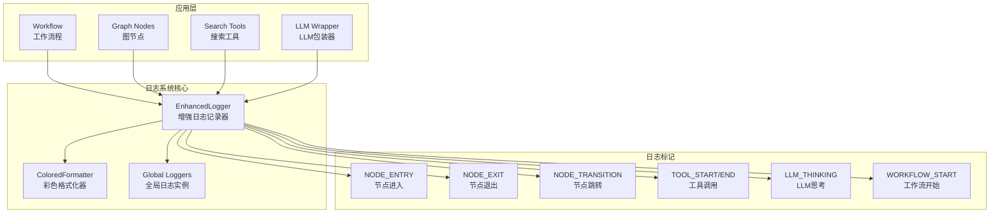

# 增强日志系统

<cite>
**本文档中引用的文件**
- [ENHANCED_LOGGING.md](file://ENHANCED_LOGGING.md)
- [src/utils/enhanced_logger.py](file://src/utils/enhanced_logger.py)
- [enhanced_logging_demo.py](file://enhanced_logging_demo.py)
- [src/workflow.py](file://src/workflow.py)
- [src/graph/nodes.py](file://src/graph/nodes.py)
- [src/tools/search.py](file://src/tools/search.py)
- [src/llms/llm.py](file://src/llms/llm.py)
</cite>

## 目录
1. [概述](#概述)
2. [系统架构](#系统架构)
3. [核心组件](#核心组件)
4. [日志级别与标记](#日志级别与标记)
5. [使用方法](#使用方法)
6. [日志输出示例](#日志输出示例)
7. [性能监控](#性能监控)
8. [故障排除指南](#故障排除指南)
9. [最佳实践](#最佳实践)
10. [总结](#总结)

## 概述

DeerFlow增强日志系统是一个全面的日志记录解决方案，专为跟踪工程中每一步检索、思考和节点跳转而设计。该系统提供了彩色输出、详细的执行跟踪和性能监控功能，帮助开发者深入了解应用程序的运行过程。

### 主要特性

- **彩色日志输出**：前面部分使用绿色，后面部分使用紫色，符合用户偏好设置
- **节点执行跟踪**：记录节点的进入、退出和跳转过程
- **工具调用日志**：详细记录工具调用的开始、结束和结果
- **LLM思考过程**：记录AI思考的详细过程和流式处理
- **工作流程监控**：从开始到完成的完整工作流程跟踪
- **性能分析**：自动计算和记录各步骤执行时间

## 系统架构



**图表来源**
- [src/utils/enhanced_logger.py](file://src/utils/enhanced_logger.py#L53-L90)
- [src/workflow.py](file://src/workflow.py#L15-L20)

## 核心组件

### EnhancedLogger 类

EnhancedLogger 是整个日志系统的核心类，提供了丰富的日志记录功能：

```python
class EnhancedLogger:
    """增强的日志记录器，专门用于跟踪工作流程"""
    
    def __init__(self, name: str):
        self.logger = logging.getLogger(name)
        self.session_id = None
        self.workflow_context = {}
        
    def setup_enhanced_logging(self, level=logging.INFO, enable_colors=True):
        """设置增强日志"""
        handler = logging.StreamHandler()
        
        if enable_colors:
            formatter = ColoredFormatter(
                '%(asctime)s - %(name)s - %(levelname)s - %(message)s',
                datefmt='%H:%M:%S'
            )
        else:
            formatter = logging.Formatter(
                '%(asctime)s - %(name)s - %(levelname)s - %(message)s',
                datefmt='%H:%M:%S'
            )
```

### ColoredFormatter 类

ColoredFormatter 提供了彩色日志输出功能，根据用户偏好设置颜色：

```python
class ColoredFormatter(logging.Formatter):
    """彩色日志格式器，根据用户偏好设置颜色"""
    
    # ANSI色彩代码
    COLORS = {
        'DEBUG': '\033[96m',      # 青色
        'INFO': '\033[92m',       # 绿色 (前面部分)
        'WARNING': '\033[93m',    # 黄色
        'ERROR': '\033[91m',      # 红色
        'CRITICAL': '\033[95m',   # 紫色
        'PURPLE': '\033[35m',     # 紫色 (后面部分)
        'RESET': '\033[0m',       # 重置
        'BOLD': '\033[1m',        # 粗体
    }
```

**章节来源**
- [src/utils/enhanced_logger.py](file://src/utils/enhanced_logger.py#L13-L50)
- [src/utils/enhanced_logger.py](file://src/utils/enhanced_logger.py#L53-L90)

## 日志级别与标记

### 工作流程相关标记

| 标记 | 描述 | 使用场景 |
|------|------|----------|
| `🚀 WORKFLOW_START` | 工作流开始 | 记录工作流启动 |
| `📝 WORKFLOW_CONFIG` | 工作流配置 | 记录配置参数 |
| `📊 WORKFLOW_SUMMARY` | 工作流摘要 | 记录执行统计 |
| `🏁 WORKFLOW_COMPLETE` | 工作流完成 | 记录工作流结束 |

### 节点执行相关标记

| 标记 | 描述 | 使用场景 |
|------|------|----------|
| `🔄 NODE_ENTRY` | 节点进入 | 记录节点开始执行 |
| `✅ NODE_EXIT` | 节点退出 | 记录节点执行完成 |
| `🔀 NODE_TRANSITION` | 节点跳转 | 记录节点间跳转 |
| `📊 NODE_EXECUTED` | 节点执行 | 记录节点已执行 |

### 工具调用相关标记

| 标记 | 描述 | 使用场景 |
|------|------|----------|
| `🔧 TOOL_START` | 工具调用开始 | 记录工具调用开始 |
| `🔧 TOOL_END` | 工具调用结束 | 记录工具调用完成 |
| `🔧 TOOL_PARAMS` | 工具参数 | 记录调用参数 |
| `🔧 TOOL_RESULT` | 工具结果 | 记录返回结果 |

### LLM思考过程相关标记

| 标记 | 描述 | 使用场景 |
|------|------|----------|
| `🧠 LLM_INVOKE` | LLM调用开始 | 记录LLM调用开始 |
| `🧠 LLM_THINKING` | LLM思考过程 | 记录思考详细过程 |
| `🧠 LLM_STREAM` | LLM流式处理 | 记录流式思考过程 |
| `🤖 LLM_INVOKE` | LLM调用 | 记录LLM调用 |
| `🤖 LLM_STREAM` | LLM流式 | 记录流式处理 |

### 搜索过程相关标记

| 标记 | 描述 | 使用场景 |
|------|------|----------|
| `🔍 SEARCH` | 搜索过程 | 记录搜索查询和结果 |
| `🔍 TOOL_START` | 搜索工具开始 | 记录搜索工具调用 |
| `🔍 TOOL_END` | 搜索工具结束 | 记录搜索工具完成 |

**章节来源**
- [src/utils/enhanced_logger.py](file://src/utils/enhanced_logger.py#L91-L180)
- [ENHANCED_LOGGING.md](file://ENHANCED_LOGGING.md#L15-L40)

## 使用方法

### 基本使用

```python
from src.utils.enhanced_logger import get_enhanced_logger, setup_enhanced_logging

# 设置增强日志
setup_enhanced_logging(level=logging.INFO, enable_colors=True)

# 获取日志实例
logger = get_enhanced_logger('your_module')
```

### 在工作流程中使用

```python
from src.utils.enhanced_logger import get_enhanced_logger, setup_enhanced_logging

# 初始化增强日志
setup_enhanced_logging(level=logging.DEBUG if debug else logging.INFO, enable_colors=True)

# 设置会话上下文
session_id = f"session_{int(time.time())}"
enhanced_logger.set_session_context(session_id, user_input)
enhanced_logger.logger.info(f"🚀 WORKFLOW_START | {session_id} | 开始工作流执行 | 用户输入: '{user_input}'")
```

### 在节点中使用

```python
from src.utils.enhanced_logger import get_enhanced_logger

enhanced_logger = get_enhanced_logger('graph.nodes')

def background_investigation_node(state: State, config: RunnableConfig):
    start_time = time.time()
    enhanced_logger.logger.info(f"🔄 NODE_ENTRY | background_investigation | 开始执行背景调研节点")
    
    # 执行节点逻辑...
    
    duration = time.time() - start_time
    enhanced_logger.logger.info(f"✅ NODE_EXIT | background_investigation | 节点执行完成 | 耗时: {duration:.2f}s")
```

### 在工具中使用

```python
from src.utils.enhanced_logger import get_enhanced_logger

enhanced_logger = get_enhanced_logger('tools.search')

def get_web_search_tool(max_search_results: int, engine: Optional[str] = None):
    start_time = time.time()
    enhanced_logger.logger.info(f"🔧 TOOL_INIT | web_search | 初始化搜索工具 | 引擎: {selected_engine}")
    
    # 创建和配置工具...
    
    duration = time.time() - start_time
    enhanced_logger.logger.info(f"🔧 TOOL_READY | 搜索工具就绪 | 耗时: {duration:.2f}s")
```

### 在LLM中使用

```python
from src.utils.enhanced_logger import get_enhanced_logger

enhanced_logger = get_enhanced_logger(f'llm.{llm_type}')

def invoke(self, messages, **kwargs):
    start_time = time.time()
    prompt_length = self._calculate_prompt_length(messages)
    
    self.enhanced_logger.logger.info(f"🤖 LLM_INVOKE | {self.llm_type} | 开始思考 | 提示长度: {prompt_length}")
    
    try:
        result = self.llm.invoke(messages, **kwargs)
        duration = time.time() - start_time
        response_length = len(str(result.content)) if hasattr(result, 'content') else 0
        
        self.enhanced_logger.log_llm_thinking(self.llm_type, prompt_length, response_length, duration)
        
        return result
        
    except Exception as e:
        duration = time.time() - start_time
        self.enhanced_logger.logger.error(f"❌ LLM_INVOKE_ERROR | {self.llm_type} | 思考失败: {str(e)} | 耗时: {duration:.2f}s")
        raise
```

**章节来源**
- [ENHANCED_LOGGING.md](file://ENHANCED_LOGGING.md#L49-L77)
- [src/workflow.py](file://src/workflow.py#L45-L60)
- [src/graph/nodes.py](file://src/graph/nodes.py#L40-L50)
- [src/llms/llm.py](file://src/llms/llm.py#L30-L50)

## 日志输出示例

### 完整的工作流程日志

运行时您将看到类似以下的彩色日志输出：

```
🚀 WORKFLOW_START | session_1728123456 | 开始工作流执行 | 用户输入: 'f1赛车是如何制造的'
📝 WORKFLOW_CONFIG | 最大计划迭代: 1 | 最大步骤数: 3 | 背景调研: True
🔄 NODE_ENTRY | coordinator | 开始执行协调者节点
🧠 LLM_INVOKE | coordinator | 开始思考 | 提示长度: 1024
🧠 LLM_THINKING | coordinator | 提示长度: 1024 | 响应长度: 512 | 耗时: 2.3s
🔀 NODE_TRANSITION | coordinator → background_investigator | 原因: 需要背景调研
✅ NODE_EXIT | coordinator | 节点执行完成 | 耗时: 2.5s
🔄 NODE_ENTRY | background_investigation | 开始执行背景调研节点
🔍 SEARCH | background_investigation | 查询: 'f1赛车是如何制造的' | 结果数: 5
🔧 TOOL_START | web_search | 开始调用工具
🔧 TOOL_END | web_search | 工具调用完成 | 耗时: 1.8s
✅ NODE_EXIT | background_investigation | 节点执行完成 | 耗时: 2.1s
📊 WORKFLOW_SUMMARY | 总耗时: 15.2s | 执行节点: 5 | 使用工具: 3
🏁 WORKFLOW_COMPLETE | session_1728123456 | 工作流执行完成 | 总耗时: 15.2s
```

### 节点执行日志

```
🔄 NODE_ENTRY | background_investigation | 开始执行背景调研节点
📝 NODE_STATE | background_investigation | 输入状态: {
  "research_topic": "f1赛车制造",
  "locale": "zh-CN",
  "messages": [
    {
      "role": "user",
      "content": "f1赛车是如何制造的"
    }
  ]
}
🔍 SEARCH | background_investigation | 查询: 'f1赛车是如何制造的' | 结果数: 5
🔧 TOOL_START | web_search | 开始调用工具
🔧 TOOL_PARAMS | web_search | 参数: {
  "query": "f1赛车制造",
  "max_results": 5
}
🔧 TOOL_RESULT | web_search | 结果: {
  "search_results": [...],
  "metadata": {...}
}
🔧 TOOL_END | web_search | 工具调用完成 | 耗时: 1.8s
✅ NODE_EXIT | background_investigation | 节点执行完成 | 耗时: 2.1s
📝 NODE_RESULT | background_investigation | 输出结果: {
  "background_investigation_results": "..."
}
```

### LLM思考过程日志

```
🤖 LLM_INVOKE | planner | 开始思考 | 提示长度: 1500
🤖 LLM_THINKING | planner | 提示长度: 1500 | 响应长度: 800 | 耗时: 3.2s
🤖 LLM_USAGE | planner | token使用: {
  "prompt_tokens": 1500,
  "completion_tokens": 800,
  "total_tokens": 2300
}
🔧 TOOL_CALL_PLANNED | web_search | 计划调用工具 #1
🔧 TOOL_CALL_PLANNED | python_repl | 计划调用工具 #2
🤖 LLM_TOOLS_COMPLETE | planner | 工具思考完成 | 工具调用数: 2 | 耗时: 3.5s
```

**章节来源**
- [ENHANCED_LOGGING.md](file://ENHANCED_LOGGING.md#L78-L95)
- [enhanced_logging_demo.py](file://enhanced_logging_demo.py#L40-L60)

## 性能监控

### 自动性能跟踪

增强日志系统自动跟踪和记录各个操作的执行时间：

```python
def log_node_entry(self, node_name: str, state: Union[Dict[str, Any], object]):
    """记录节点进入"""
    self.logger.info(f"🔄 NODE_ENTRY | {node_name} | 开始执行节点")
    if self.logger.isEnabledFor(logging.DEBUG):
        if hasattr(state, '__dict__'):
            state_dict = state.__dict__
        elif isinstance(state, dict):
            state_dict = state
        else:
            state_dict = {'state': str(state)}
        self.logger.debug(f"🔄 NODE_STATE | {node_name} | 输入状态: {self._format_state(state_dict)}")
```

### 执行时间计算

```python
def log_node_exit(self, node_name: str, result: Any, duration: float):
    """记录节点退出"""
    self.logger.info(f"✅ NODE_EXIT | {node_name} | 节点执行完成 | 耗时: {duration:.2f}s")
    if self.logger.isEnabledFor(logging.DEBUG):
        self.logger.debug(f"✅ NODE_RESULT | {node_name} | 输出结果: {self._format_result(result)}")
```

### 工作流程摘要

```python
def log_workflow_summary(self, total_duration: float, nodes_executed: List[str], tools_used: List[str]):
    """记录工作流程摘要"""
    self.logger.info(f"📊 WORKFLOW_SUMMARY | 总耗时: {total_duration:.2f}s | 执行节点: {len(nodes_executed)} | 使用工具: {len(tools_used)}")
    if self.logger.isEnabledFor(logging.DEBUG):
        self.logger.debug(f"📊 NODES_EXECUTED: {', '.join(nodes_executed)}")
        self.logger.debug(f"📊 TOOLS_USED: {', '.join(tools_used)}")
```

### 性能指标

- **节点执行时间**：精确测量每个节点的执行时间
- **工具调用时间**：记录工具调用的耗时
- **LLM响应时间**：跟踪LLM思考和响应的时间
- **总工作流程时间**：计算整个工作流程的总耗时

**章节来源**
- [src/utils/enhanced_logger.py](file://src/utils/enhanced_logger.py#L91-L120)
- [src/utils/enhanced_logger.py](file://src/utils/enhanced_logger.py#L121-L140)
- [src/utils/enhanced_logger.py](file://src/utils/enhanced_logger.py#L161-L180)

## 故障排除指南

### 常见问题与解决方案

#### 1. 日志不显示彩色输出

**问题**：日志输出没有彩色效果

**解决方案**：
```python
# 确保启用彩色输出
setup_enhanced_logging(level=logging.INFO, enable_colors=True)

# 或者检查终端是否支持ANSI颜色
import sys
print(sys.stdout.isatty())  # 应该返回True
```

#### 2. 日志级别设置问题

**问题**：某些日志信息没有显示

**解决方案**：
```python
# 设置合适的日志级别
setup_enhanced_logging(level=logging.DEBUG, enable_colors=True)  # 显示详细信息

# 或者单独设置某个模块的日志级别
import logging
logging.getLogger('src.graph.nodes').setLevel(logging.DEBUG)
```

#### 3. 节点日志记录失败

**问题**：节点执行日志没有正确记录

**解决方案**：
```python
# 确保正确初始化增强日志
from src.utils.enhanced_logger import get_enhanced_logger
enhanced_logger = get_enhanced_logger('graph.nodes')

# 在节点函数中正确使用日志
def node_function(state):
    enhanced_logger.logger.info(f"🔄 NODE_ENTRY | node_name | 开始执行节点")
    # 节点逻辑...
    enhanced_logger.logger.info(f"✅ NODE_EXIT | node_name | 节点执行完成")
```

#### 4. 工具调用日志异常

**问题**：工具调用日志记录异常

**解决方案**：
```python
# 检查工具是否正确包装
from src.tools.decorators import create_logged_tool
LoggedTool = create_logged_tool(OriginalTool)

# 确保工具调用前后都有日志记录
def tool_function():
    enhanced_logger.logger.info(f"🔧 TOOL_START | tool_name | 开始调用工具")
    try:
        result = original_tool_function()
        enhanced_logger.logger.info(f"🔧 TOOL_END | tool_name | 工具调用完成")
        return result
    except Exception as e:
        enhanced_logger.logger.error(f"🔧 TOOL_ERROR | tool_name | 工具调用失败: {str(e)}")
        raise
```

### 调试技巧

#### 1. 启用详细日志

```bash
# 调试模式运行
python main.py --debug "你的问题"

# 或者在代码中启用
from src.utils.enhanced_logger import setup_enhanced_logging
setup_enhanced_logging(level=logging.DEBUG, enable_colors=True)
```

#### 2. 检查日志配置

```python
# 检查当前日志配置
import logging
logger = logging.getLogger('src.utils.enhanced_logger')
print(f"Level: {logger.level}")
print(f"Handlers: {logger.handlers}")
```

#### 3. 单独测试日志功能

```python
from src.utils.enhanced_logger import get_enhanced_logger, setup_enhanced_logging

# 测试基本日志功能
setup_enhanced_logging(level=logging.INFO, enable_colors=True)
logger = get_enhanced_logger('test')
logger.logger.info("这是一个测试日志")
```

**章节来源**
- [src/utils/enhanced_logger.py](file://src/utils/enhanced_logger.py#L53-L90)
- [ENHANCED_LOGGING.md](file://ENHANCED_LOGGING.md#L49-L77)

## 最佳实践

### 1. 日志命名规范

```python
# 使用有意义的模块名称
enhanced_logger = get_enhanced_logger('graph.nodes.background_investigation')
enhanced_logger = get_enhanced_logger('tools.search.web_search')
enhanced_logger = get_enhanced_logger('llms.planner')
```

### 2. 合理的日志级别使用

```python
# INFO级别：主要流程和决策点
logger.info(f"🔄 NODE_ENTRY | {node_name} | 开始执行节点")

# DEBUG级别：详细的状态和参数
if logger.isEnabledFor(logging.DEBUG):
    logger.debug(f"📊 NODE_STATE | {node_name} | 输入状态: {state}")

# ERROR级别：错误和异常情况
logger.error(f"❌ NODE_ERROR | {node_name} | 节点执行失败: {str(e)}")
```

### 3. 会话跟踪

```python
# 设置会话上下文
session_id = f"session_{int(time.time())}"
enhanced_logger.set_session_context(session_id, user_input)

# 在所有日志中包含会话ID
logger.info(f"🚀 WORKFLOW_START | {session_id} | 开始工作流执行")
```

### 4. 性能监控

```python
# 自动记录执行时间
start_time = time.time()
try:
    result = function_call()
finally:
    duration = time.time() - start_time
    logger.info(f"✅ OPERATION_COMPLETE | 操作完成 | 耗时: {duration:.2f}s")
```

### 5. 错误处理

```python
try:
    # 执行可能出错的操作
    result = risky_operation()
except Exception as e:
    logger.error(f"❌ OPERATION_FAILED | 操作失败: {str(e)}")
    # 记录更多上下文信息
    if logger.isEnabledFor(logging.DEBUG):
        logger.debug(f"❌ OPERATION_CONTEXT | 错误上下文: {context_info}")
    raise
```

### 6. 状态格式化

```python
def _format_state(self, state: Dict[str, Any]) -> str:
    """格式化状态信息"""
    if not state:
        return "空状态"
    
    # 只显示关键字段，避免日志过长
    key_fields = ['research_topic', 'locale', 'current_plan', 'messages']
    formatted = {}
    
    for key in key_fields:
        if key in state:
            if key == 'messages':
                formatted[key] = f"消息数量: {len(state[key])}"
            elif key == 'current_plan' and hasattr(state[key], 'title'):
                formatted[key] = f"计划: {state[key].title}"
            else:
                formatted[key] = str(state[key])[:100] + "..." if len(str(state[key])) > 100 else state[key]
                
    return json.dumps(formatted, ensure_ascii=False, indent=2)
```

### 7. 工具包装

```python
# 使用装饰器包装工具函数
from src.utils.enhanced_logger import log_execution_time

@log_execution_time(enhanced_logger, "web_search")
def web_search(query: str, max_results: int = 5):
    # 工具实现
    pass
```

**章节来源**
- [src/utils/enhanced_logger.py](file://src/utils/enhanced_logger.py#L181-L200)
- [src/graph/nodes.py](file://src/graph/nodes.py#L40-L50)

## 总结

DeerFlow增强日志系统是一个功能强大且全面的日志记录解决方案，它为工程中的每一步检索、思考和节点跳转提供了详细的跟踪和监控能力。通过彩色输出、详细的执行时间和性能指标，该系统大大提高了开发和调试效率。

### 主要优势

1. **全面的跟踪能力**：从工作流开始到完成的全程跟踪
2. **彩色输出**：提高日志可读性和用户体验
3. **自动性能监控**：精确测量各步骤执行时间
4. **灵活的配置**：支持不同级别的日志输出
5. **易于集成**：简单的API接口，方便在现有代码中集成

### 适用场景

- **开发调试**：跟踪应用程序执行过程，快速定位问题
- **性能分析**：分析各组件的执行时间，优化系统性能
- **生产监控**：实时监控系统运行状态，及时发现异常
- **用户反馈**：提供详细的执行日志，帮助理解系统行为

### 未来发展方向

- **分布式追踪**：支持多服务环境下的链路追踪
- **可视化界面**：提供图形化的日志分析界面
- **智能告警**：基于日志内容的智能异常检测和告警
- **历史数据分析**：长期存储和分析日志数据，发现潜在问题

通过合理使用增强日志系统，开发者可以更好地理解和优化DeerFlow应用程序的运行过程，提高开发效率和系统可靠性。