# 多智能体架构

<cite>
**本文档引用的文件**
- [agents.py](file://src/agents/agents.py) - *已更新增强日志*
- [builder.py](file://src/graph/builder.py) - *已更新增强日志*
- [nodes.py](file://src/graph/nodes.py) - *已更新增强日志*
- [types.py](file://src/graph/types.py)
- [coordinator.md](file://src/prompts/coordinator.md)
- [planner.md](file://src/prompts/planner.md)
- [researcher.md](file://src/prompts/researcher.md)
- [reporter.md](file://src/prompts/reporter.md)
- [planner_model.py](file://src/prompts/planner_model.py)
- [agents.py](file://src/config/agents.py)
- [ENHANCED_LOGGING.md](file://ENHANCED_LOGGING.md) - *新增增强日志文档*
- [enhanced_logger.py](file://src/utils/enhanced_logger.py) - *新增增强日志模块*
</cite>

## 更新摘要
**变更内容**
- 在`builder.py`和`nodes.py`中集成了增强日志系统，增加了详细的节点执行、跳转决策和LLM调用日志
- 新增了`ENHANCED_LOGGING.md`文档，详细说明增强日志系统的功能和使用方法
- 更新了所有受影响的架构图和流程图，以反映新的日志记录机制
- 增加了对节点执行时间、状态变化和工具调用的详细监控

## 目录
1. [简介](#简介)
2. [项目结构概览](#项目结构概览)
3. [核心智能体类型](#核心智能体类型)
4. [工作流图构建](#工作流图构建)
5. [状态管理机制](#状态管理机制)
6. [智能体协作流程](#智能体协作流程)
7. [提示词模板系统](#提示词模板系统)
8. [架构优势与扩展性](#架构优势与扩展性)
9. [性能考虑](#性能考虑)
10. [故障排除指南](#故障排除指南)
11. [结论](#结论)

## 简介

deer-flow是一个基于LangGraph构建的多智能体系统，专门设计用于处理复杂的深度研究任务。该系统通过协调不同类型的智能体（协调者、规划者、研究员、代码分析员、报告生成器）来完成从问题识别到最终报告输出的完整研究流程。

系统的核心设计理念是将复杂的研究任务分解为多个专业化智能体可以独立处理的子任务，每个智能体都有明确的职责和行为模式。这种模块化的设计不仅提高了系统的可维护性和可扩展性，还确保了每个环节都能发挥其专业优势。

最近的更新集成了增强日志系统，为系统的每个执行步骤提供了详细的跟踪和监控能力。通过在`graph.builder`和`graph.nodes`模块中增加详细的节点日志、跳转决策日志和LLM调用日志，开发者现在可以更清晰地观察和调试系统的工作流程。

## 项目结构概览

deer-flow的多智能体系统主要由以下几个核心模块组成：

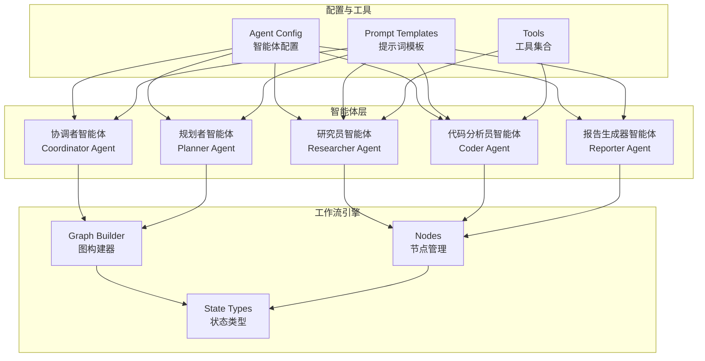

**图表来源**
- [agents.py](file://src/agents/agents.py#L1-L20)
- [builder.py](file://src/graph/builder.py#L1-L88)
- [nodes.py](file://src/graph/nodes.py#L1-L512)

## 核心智能体类型

### 协调者智能体 (Coordinator Agent)

协调者智能体是整个系统的第一道门面，负责处理用户的基本交互和请求分类。

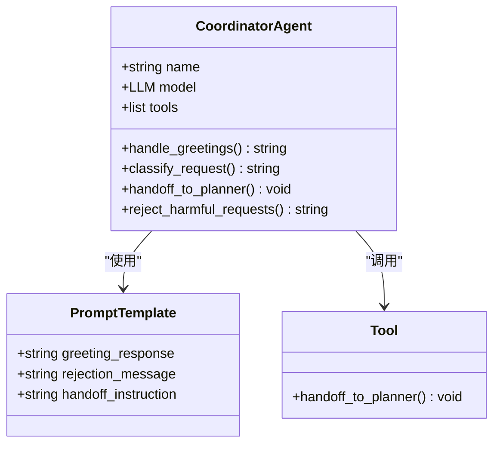

**图表来源**
- [coordinator.md](file://src/prompts/coordinator.md#L1-L56)
- [agents.py](file://src/agents/agents.py#L10-L20)

协调者智能体的主要职责包括：
- **问候与闲聊**：处理简单的问候语和闲聊对话
- **请求分类**：识别用户的输入类型并进行分类
- **安全过滤**：拒绝有害或不当的请求
- **任务转交**：将研究类任务转交给规划者智能体

### 规划者智能体 (Planner Agent)

规划者智能体负责将用户的研究需求转化为详细的行动计划。

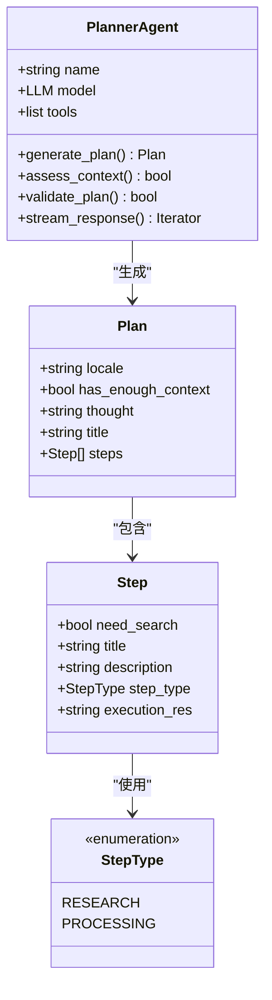

**图表来源**
- [planner.md](file://src/prompts/planner.md#L1-L188)
- [planner_model.py](file://src/prompts/planner_model.py#L1-L59)

规划者智能体的关键功能：
- **上下文评估**：严格评估是否已有足够信息
- **计划生成**：创建包含多个步骤的详细行动计划
- **资源分配**：根据步骤类型分配合适的资源
- **迭代优化**：支持多次迭代以完善计划

### 研究员智能体 (Researcher Agent)

研究员智能体专注于信息收集和资料整理。

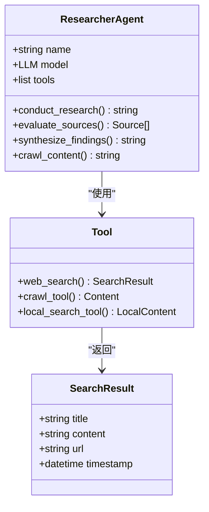

**图表来源**
- [researcher.md](file://src/prompts/researcher.md#L1-L87)
- [nodes.py](file://src/graph/nodes.py#L481-L510)

研究员智能体的特点：
- **多源搜索**：整合多种搜索工具的结果
- **内容爬取**：深度抓取网页内容
- **本地检索**：利用本地知识库进行检索
- **信息验证**：评估信息的可靠性和时效性

### 代码分析员智能体 (Coder Agent)

代码分析员智能体专门处理需要编程和数据分析的任务。

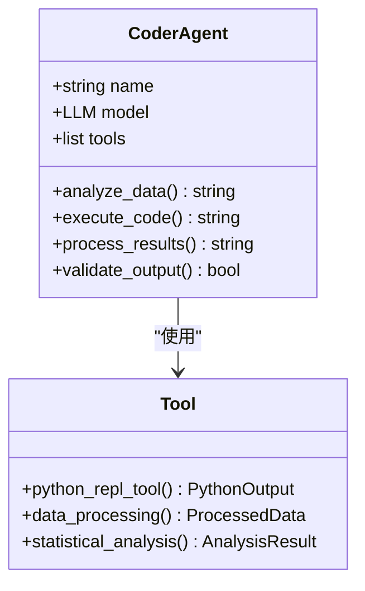

**图表来源**
- [nodes.py](file://src/graph/nodes.py#L512-L540)

代码分析员智能体的功能：
- **数据处理**：执行Python代码进行数据分析
- **统计计算**：进行各种统计分析和数学运算
- **结果验证**：确保代码输出的准确性和可靠性
- **格式转换**：将原始数据转换为可用格式

### 报告生成器智能体 (Reporter Agent)

报告生成器智能体负责将收集的信息整合成最终的报告。

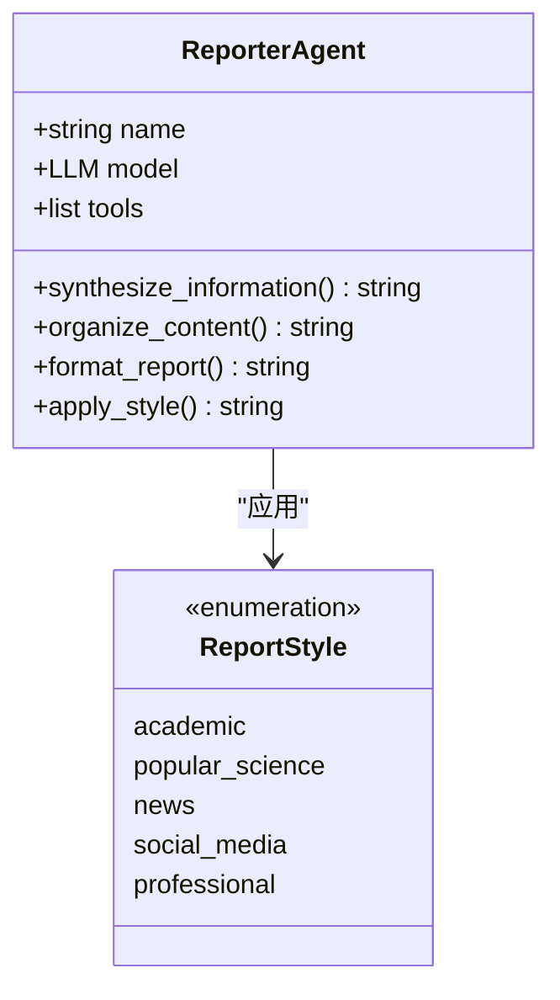

**图表来源**
- [reporter.md](file://src/prompts/reporter.md#L1-L280)

报告生成器智能体的特性：
- **风格适配**：根据不同受众调整写作风格
- **结构组织**：按照标准格式组织报告内容
- **引用管理**：正确标注所有信息来源
- **可视化集成**：整合图片和其他多媒体元素

**章节来源**
- [agents.py](file://src/agents/agents.py#L1-L20)
- [coordinator.md](file://src/prompts/coordinator.md#L1-L56)
- [planner.md](file://src/prompts/planner.md#L1-L188)
- [researcher.md](file://src/prompts/researcher.md#L1-L87)
- [reporter.md](file://src/prompts/reporter.md#L1-L280)

## 工作流图构建

deer-flow使用LangGraph框架构建智能体协作的工作流图，通过`builder.py`模块实现。

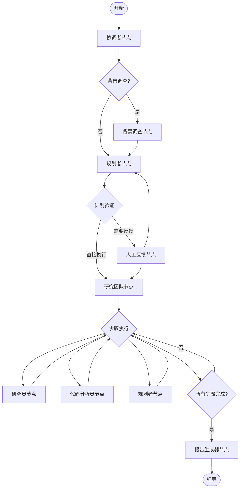

**图表来源**
- [builder.py](file://src/graph/builder.py#L25-L88)
- [nodes.py](file://src/graph/nodes.py#L1-L512)

### 图构建器详解

`builder.py`中的`_build_base_graph()`函数定义了核心的工作流结构：

```python
def _build_base_graph():
    """构建并返回包含所有节点和边的基础状态图。"""
    builder = StateGraph(State)
    builder.add_edge(START, "coordinator")
    builder.add_node("coordinator", coordinator_node)
    builder.add_node("background_investigator", background_investigation_node)
    builder.add_node("planner", planner_node)
    builder.add_node("reporter", reporter_node)
    builder.add_node("research_team", research_team_node)
    builder.add_node("researcher", researcher_node)
    builder.add_node("coder", coder_node)
    builder.add_node("human_feedback", human_feedback_node)
    builder.add_edge("background_investigator", "planner")
    builder.add_conditional_edges(
        "research_team",
        continue_to_running_research_team,
        ["planner", "researcher", "coder"],
    )
    builder.add_edge("reporter", END)
    return builder
```

### 条件路由机制

系统使用智能的条件路由来决定下一步的执行路径：

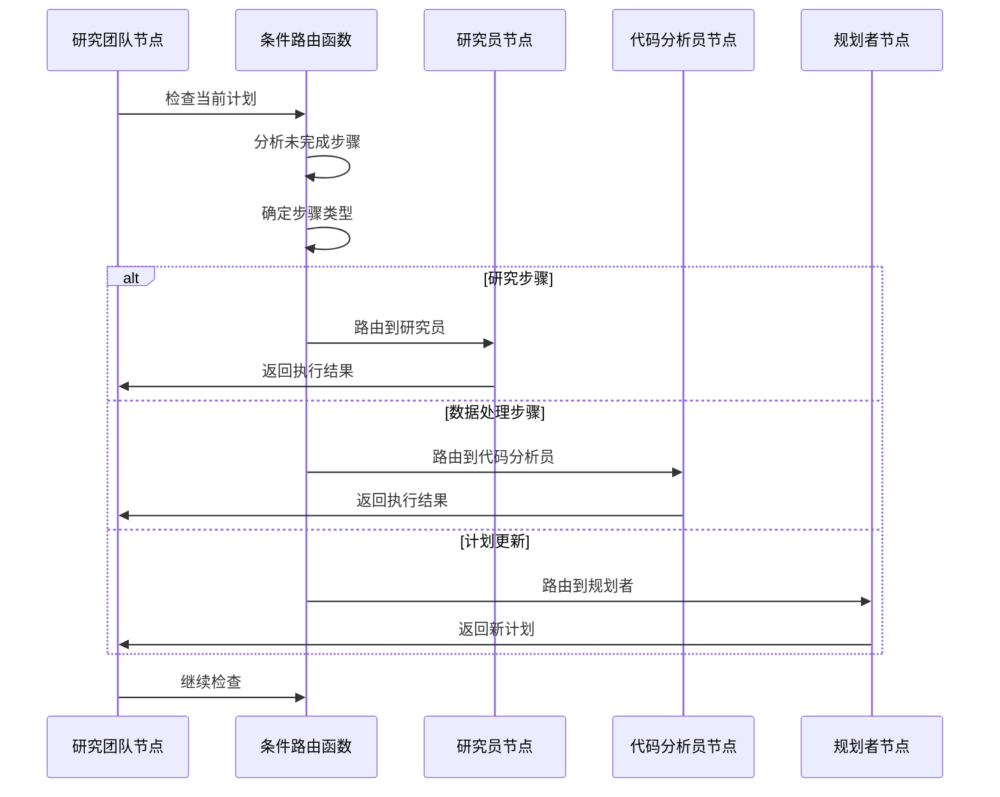

**图表来源**
- [builder.py](file://src/graph/builder.py#L15-L24)

**章节来源**
- [builder.py](file://src/graph/builder.py#L1-L88)
- [nodes.py](file://src/graph/nodes.py#L1-L512)

## 状态管理机制

系统通过`types.py`中定义的`State`类来管理智能体间的通信和状态传递。

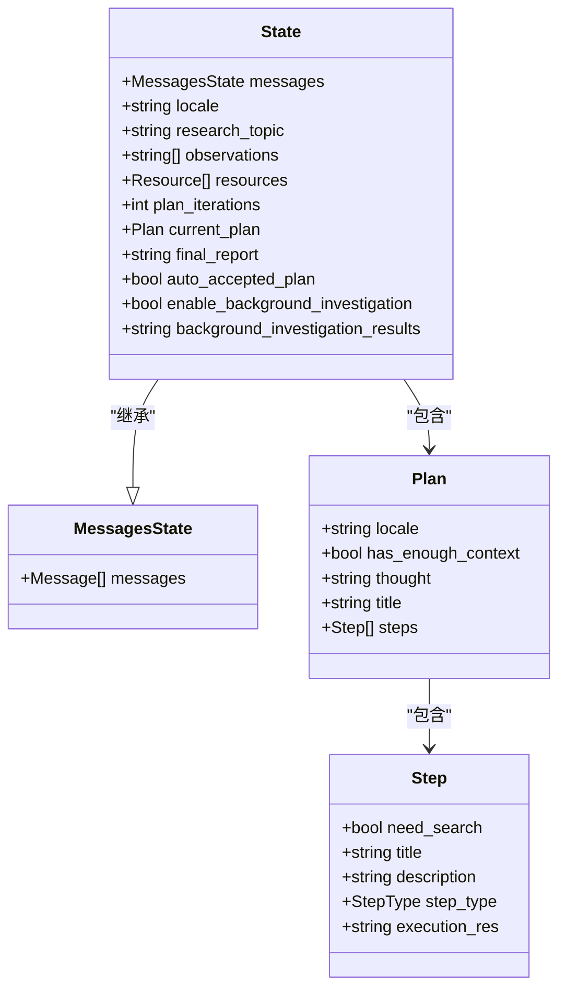

**图表来源**
- [types.py](file://src/graph/types.py#L1-L25)
- [planner_model.py](file://src/prompts/planner_model.py#L1-L59)

### 状态字段详解

`State`类包含了以下关键字段：

1. **消息状态**：继承自`MessagesState`，存储所有智能体的对话历史
2. **研究主题**：当前研究的具体主题或问题
3. **观察记录**：收集到的所有观察和发现
4. **资源列表**：可用的参考资料和知识库
5. **计划迭代**：当前计划的迭代次数
6. **当前计划**：正在执行的详细行动计划
7. **最终报告**：已完成的完整报告内容
8. **自动接受标志**：是否跳过人工审核
9. **背景调查开关**：是否启用背景调查功能
10. **背景调查结果**：背景调查收集到的信息

### 状态流转机制

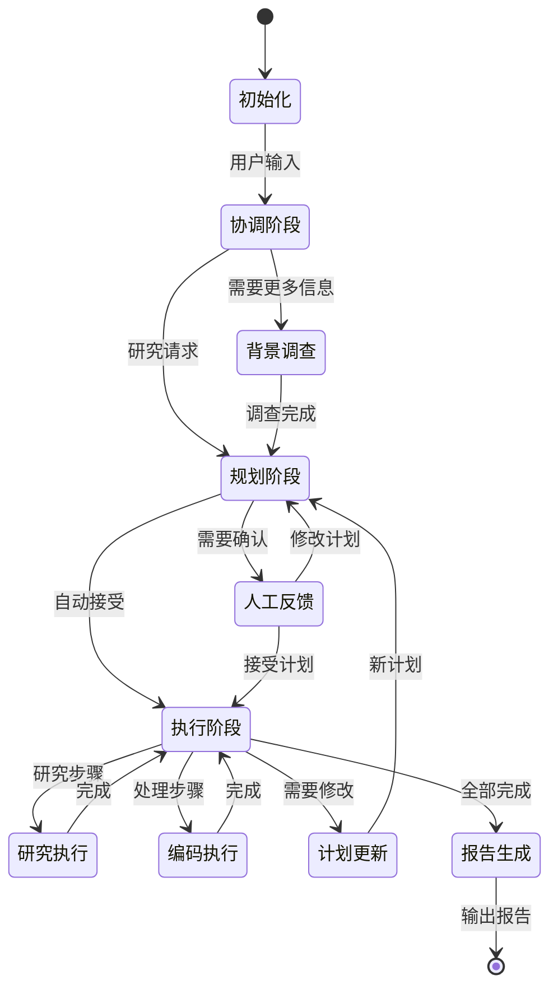

**章节来源**
- [types.py](file://src/graph/types.py#L1-L25)
- [planner_model.py](file://src/prompts/planner_model.py#L1-L59)

## 智能体协作流程

### 典型研究任务执行流程

以下是系统处理一个典型研究任务的完整流程：

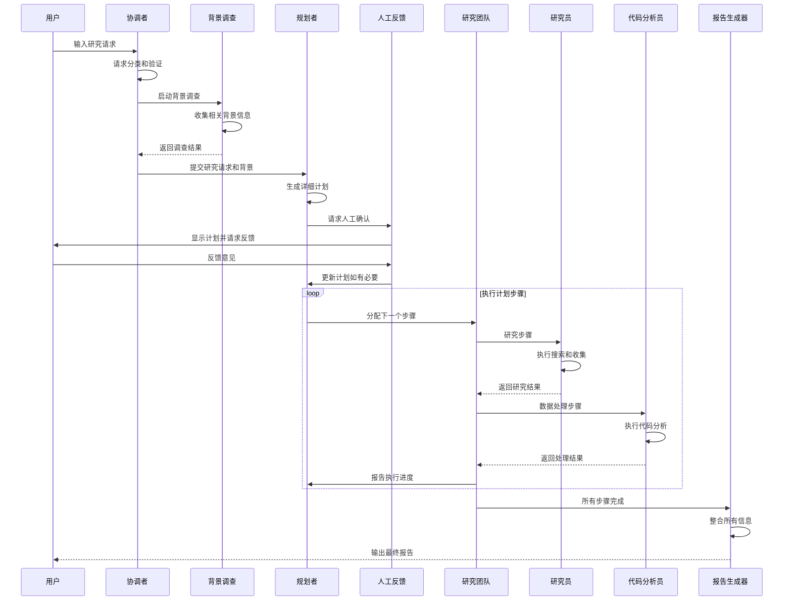

**图表来源**
- [nodes.py](file://src/graph/nodes.py#L1-L512)
- [builder.py](file://src/graph/builder.py#L1-L88)

### 智能体间通信协议

系统通过标准化的消息格式和工具接口实现智能体间的高效通信：

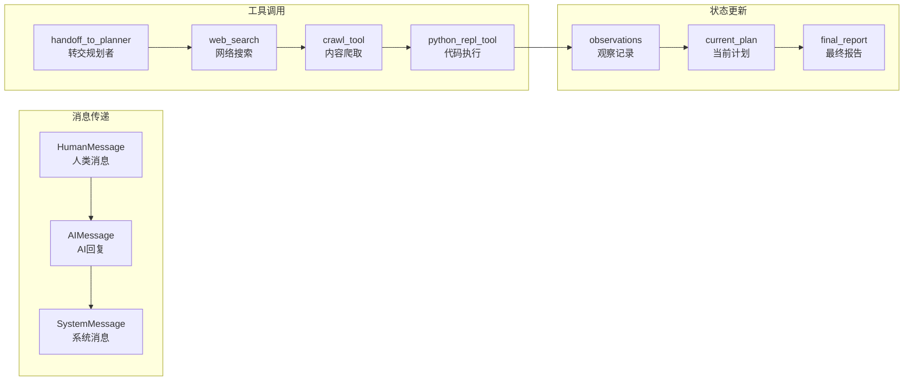

**章节来源**
- [nodes.py](file://src/graph/nodes.py#L1-L512)
- [builder.py](file://src/graph/builder.py#L1-L88)

## 提示词模板系统

deer-flow使用精心设计的提示词模板来指导每个智能体的行为。

### 协调者提示词模板

协调者的提示词模板定义了如何处理不同类型用户输入：

```markdown
# 协调者职责
- 响应问候语和简单闲聊
- 拒绝有害或不当请求
- 将研究任务转交给规划者
- 维持与用户的友好对话

# 请求分类规则
1. 直接处理：简单问候、基本闲聊
2. 拒绝：安全风险、有害内容
3. 转交：研究问题、事实查询
```

### 规划者提示词模板

规划者的提示词模板强调全面性和深度要求：

```markdown
# 规划者标准
- **全面覆盖**：涵盖主题的所有方面
- **充分深度**：提供详细的数据和事实
- **充足数量**：收集大量高质量信息
- **严格评估**：使用严格标准判断信息充分性

# 步骤类型
- 研究步骤：需要网络搜索和外部数据
- 数据处理步骤：API调用和数据提取
```

### 研究员提示词模板

研究员的提示词模板指导信息收集的最佳实践：

```markdown
# 研究员方法论
1. 理解问题：仔细阅读问题陈述
2. 评估工具：选择最适合的工具
3. 规划解决方案：确定最佳研究路径
4. 执行方案：系统性地收集信息
5. 综合信息：整合所有收集到的数据

# 工具使用指南
- 优先使用专门工具而非通用工具
- 仔细阅读工具文档
- 错误时调整方法
- 结合多种工具获得最佳结果
```

### 报告生成器提示词模板

报告生成器支持多种写作风格以适应不同的受众：

```markdown
# 写作风格选项
- 学术风格：正式、技术性强、引用规范
- 科普风格：生动有趣、易于理解、富有启发性
- 新闻风格：权威客观、结构清晰、时效性强
- 社交媒体风格：互动性强、视觉吸引、易于分享
```

**章节来源**
- [coordinator.md](file://src/prompts/coordinator.md#L1-L56)
- [planner.md](file://src/prompts/planner.md#L1-L188)
- [researcher.md](file://src/prompts/researcher.md#L1-L87)
- [reporter.md](file://src/prompts/reporter.md#L1-L280)

## 架构优势与扩展性

### 主要优势

1. **模块化设计**：每个智能体都是独立的模块，便于开发和维护
2. **专业化分工**：不同智能体专注于特定领域，提高效率和质量
3. **灵活的路由机制**：基于条件的动态路由确保任务分配的合理性
4. **状态共享**：统一的状态管理系统确保信息的一致性和完整性
5. **工具集成**：丰富的工具生态系统支持多样化的任务需求
6. **增强日志系统**：详细的节点执行、跳转决策和LLM调用日志，便于调试和监控

### 扩展性考虑

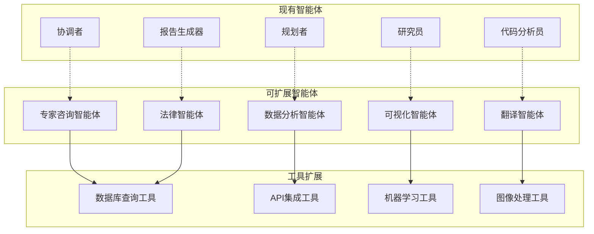

### 潜在瓶颈

1. **并发处理能力**：当多个研究任务同时进行时可能面临资源竞争
2. **状态同步开销**：大型状态对象可能导致内存和传输成本增加
3. **工具依赖性**：对外部工具的依赖可能影响系统的稳定性
4. **错误恢复机制**：需要更完善的错误处理和恢复策略
5. **日志性能影响**：详细的日志记录可能对系统性能产生一定影响

### 扩展建议

1. **添加新的智能体类型**：如专家咨询、法律分析等专业领域
2. **增强工具生态**：集成更多专业工具和API
3. **改进状态管理**：使用分布式缓存减少内存压力
4. **优化路由算法**：基于历史数据预测最优路径
5. **加强监控和日志**：实时跟踪系统性能和智能体行为
6. **实现日志级别控制**：根据需要动态调整日志详细程度

## 性能考虑

### 并发处理优化

系统通过异步处理和并行执行来提高性能：

```python
async def _setup_and_execute_agent_step(
    state: State,
    config: RunnableConfig,
    agent_type: str,
    default_tools: list,
) -> Command[Literal["research_team"]]:
    """设置代理并执行步骤的辅助函数"""
    # 异步执行智能体任务
    result = await agent.ainvoke(
        input=agent_input, 
        config={"recursion_limit": recursion_limit}
    )
    return Command(
        update={
            "messages": [HumanMessage(content=response_content, name=agent_name)],
            "observations": observations + [response_content],
        },
        goto="research_team",
    )
```

### 内存管理策略

1. **状态压缩**：定期清理不必要的历史消息
2. **增量更新**：只更新变化的部分而不是整个状态
3. **缓存机制**：缓存常用的结果和中间状态
4. **资源池化**：复用LLM连接和工具实例

### 网络优化

1. **批量请求**：合并多个网络请求减少延迟
2. **超时控制**：设置合理的超时时间防止阻塞
3. **重试机制**：自动重试失败的网络操作
4. **负载均衡**：分散请求到多个服务端点

### 增强日志系统性能

**章节来源**
- [builder.py](file://src/graph/builder.py#L22-L22)
- [nodes.py](file://src/graph/nodes.py#L35-L35)
- [enhanced_logger.py](file://src/utils/enhanced_logger.py#L53-L182)

增强日志系统为系统提供了详细的执行跟踪能力，但需要注意其对性能的影响：

1. **日志级别控制**：在生产环境中使用INFO级别，在调试时启用DEBUG级别
2. **异步日志记录**：避免日志记录阻塞主执行流程
3. **日志采样**：对高频操作进行采样记录，避免日志爆炸
4. **结构化日志**：使用JSON格式便于后续分析和处理

## 故障排除指南

### 常见问题及解决方案

1. **智能体卡死**
   - 检查递归限制设置
   - 验证工具配置是否正确
   - 查看日志中的错误信息

2. **状态同步问题**
   - 确认状态序列化/反序列化正常
   - 检查并发访问冲突
   - 验证状态字段完整性

3. **工具执行失败**
   - 测试工具的可用性
   - 检查网络连接状态
   - 验证API密钥和权限

4. **计划循环**
   - 分析条件路由逻辑
   - 检查计划验证规则
   - 调整迭代次数限制

### 调试技巧

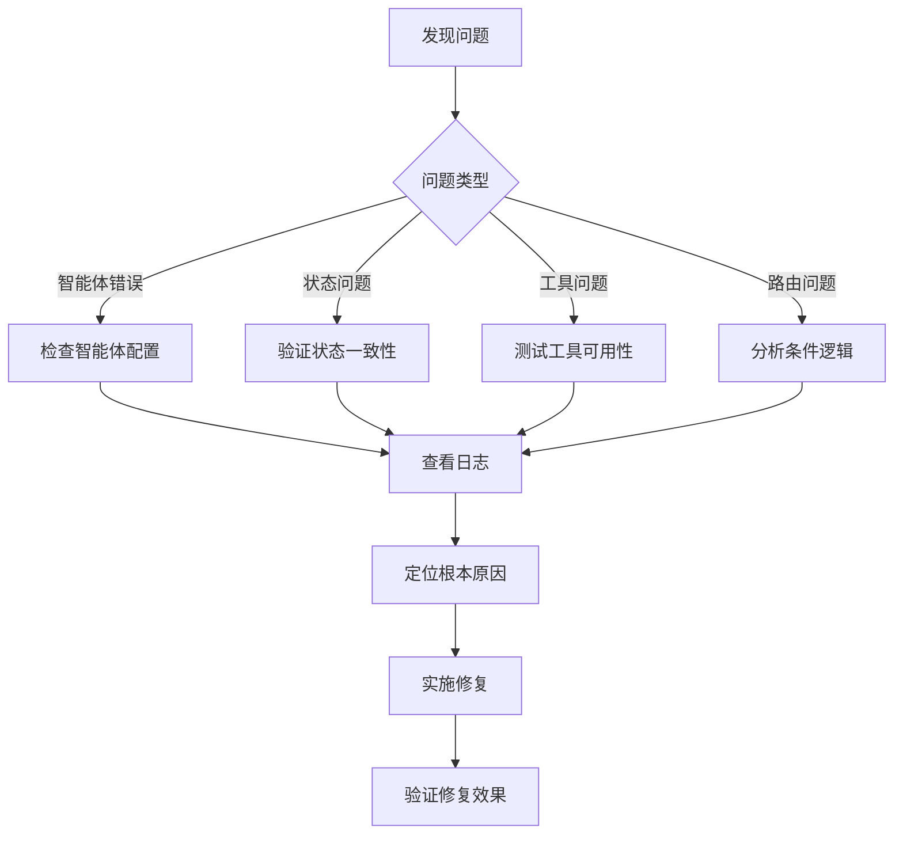

**章节来源**
- [nodes.py](file://src/graph/nodes.py#L433-L480)

### 监控指标

1. **响应时间**：各智能体的平均处理时间
2. **成功率**：任务完成的成功率
3. **资源使用**：CPU、内存、网络带宽使用情况
4. **错误率**：各类错误的发生频率
5. **吞吐量**：单位时间内处理的任务数量
6. **日志指标**：节点执行时间、LLM思考耗时、工具调用次数

**章节来源**
- [nodes.py](file://src/graph/nodes.py#L433-L480)

## 结论

deer-flow的多智能体系统架构展现了现代AI应用设计的最佳实践。通过将复杂的研究任务分解为多个专业化智能体，系统实现了高度的专业化和灵活性。每个智能体都有明确的职责边界，通过标准化的接口进行协作，确保了系统的可维护性和可扩展性。

系统的核心优势在于其模块化设计和专业化分工。协调者智能体负责前端交互和请求分类，规划者智能体专注于任务分解和资源分配，研究员智能体和代码分析员智能体分别处理信息收集和数据处理，最后由报告生成器智能体整合所有信息产出最终成果。

最近集成的增强日志系统为系统提供了前所未有的可观测性。通过详细的节点执行日志、跳转决策日志和LLM调用日志，开发者可以深入理解系统的运行机制，快速定位和解决问题。这种透明度不仅提高了系统的可靠性，也为进一步优化提供了数据支持。

这种架构不仅提高了系统的处理能力和质量保证，还为未来的功能扩展提供了良好的基础。随着更多专业智能体的加入和工具生态的丰富，系统将能够处理更加复杂和多样化的需求。

对于开发者而言，这种设计模式提供了很好的参考价值。它展示了如何通过合理的架构设计来解决复杂的业务问题，如何通过模块化来提高系统的可维护性，以及如何通过标准化接口来实现组件间的松耦合。

总的来说，deer-flow的多智能体系统架构是一个成功的案例，它不仅解决了实际的业务需求，也为AI应用的架构设计提供了宝贵的实践经验。