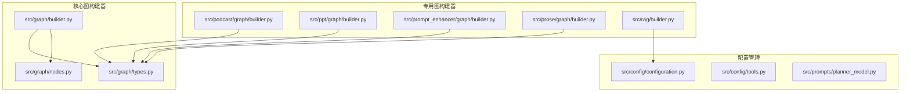
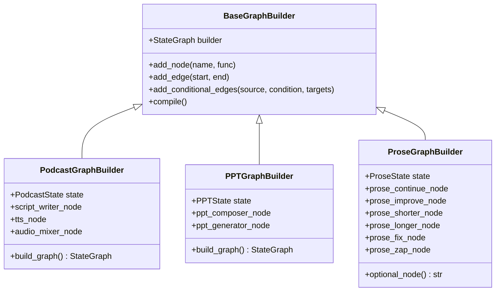
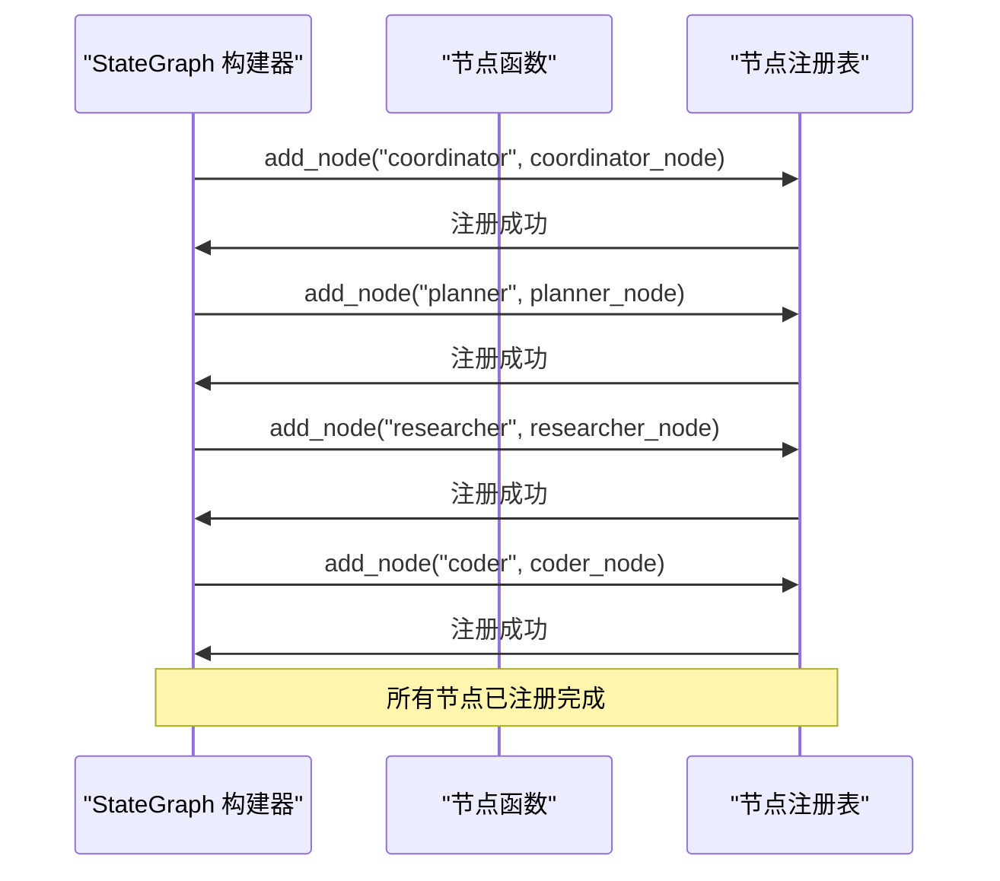
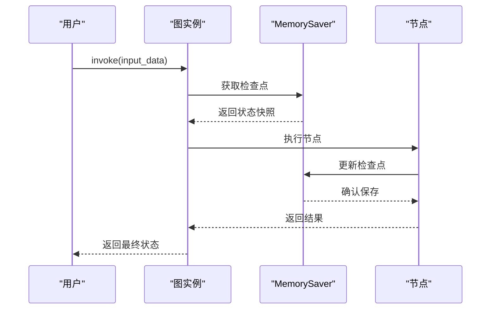
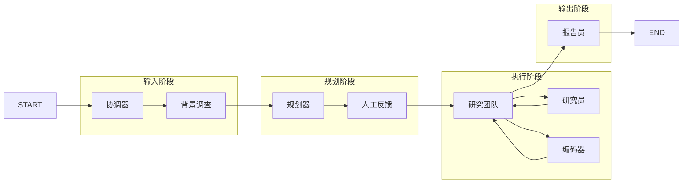

# 图构建

<cite>
**本文档中引用的文件**
- [langgraph.json](file://langgraph.json)
- [src/graph/builder.py](file://src/graph/builder.py)
- [src/graph/types.py](file://src/graph/types.py)
- [src/graph/nodes.py](file://src/graph/nodes.py)
- [src/prompts/planner_model.py](file://src/prompts/planner_model.py)
- [src/config/configuration.py](file://src/config/configuration.py)
- [src/config/tools.py](file://src/config/tools.py)
- [src/podcast/graph/builder.py](file://src/podcast/graph/builder.py)
- [src/ppt/graph/builder.py](file://src/ppt/graph/builder.py)
- [src/prompt_enhancer/graph/builder.py](file://src/prompt_enhancer/graph/builder.py)
- [src/prose/graph/builder.py](file://src/prose/graph/builder.py)
- [src/rag/builder.py](file://src/rag/builder.py)
- [src/utils/enhanced_logger.py](file://src/utils/enhanced_logger.py)
</cite>

## 更新摘要
**变更内容**
- 更新了“状态模型设计”章节，修正了`auto_accepted_plan`字段的默认值说明
- 在“节点注册机制”和“条件路由实现”章节中更新了相关代码示例以反映最新的状态模型
- 修正了`human_feedback_node`中关于自动接受计划的逻辑描述
- 更新了相关代码示例以反映最新的日志集成和状态管理

## 目录
1. [简介](#简介)
2. [项目结构概览](#项目结构概览)
3. [核心构建器架构](#核心构建器架构)
4. [状态模型设计](#状态模型设计)
5. [节点注册机制](#节点注册机制)
6. [边连接方式](#边连接方式)
7. [条件路由实现](#条件路由实现)
8. [内存检查点系统](#内存检查点系统)
9. [多智能体协作流程](#多智能体协作流程)
10. [配置与扩展](#配置与扩展)
11. [调试与验证](#调试与验证)
12. [最佳实践](#最佳实践)

## 简介

deer-flow 是一个基于 LangGraph 的多智能体协作平台，通过声明式配置与程序化代码相结合的方式构建复杂的工作流图。本文档详细阐述了工作流图的构建过程，重点分析 `builder.py` 文件中如何使用 LangGraph API 定义和连接各个智能体节点，包括节点的注册机制、边的连接方式以及条件路由的实现。

## 项目结构概览

deer-flow 采用模块化的架构设计，每个功能领域都有独立的图构建器：



**图表来源**
- [src/graph/builder.py](file://src/graph/builder.py#L1-L88)
- [src/podcast/graph/builder.py](file://src/podcast/graph/builder.py#L1-L40)
- [src/ppt/graph/builder.py](file://src/ppt/graph/builder.py#L1-L32)

## 核心构建器架构

### 基础图构建函数

deer-flow 的核心图构建器提供了两种主要的构建模式：

```python
def _build_base_graph():
    """构建并返回包含所有节点和边的基础状态图。"""
    builder = StateGraph(State)
    builder.add_edge(START, "coordinator")
    builder.add_node("coordinator", coordinator_node)
    builder.add_node("background_investigator", background_investigation_node)
    builder.add_node("planner", planner_node)
    builder.add_node("reporter", reporter_node)
    builder.add_node("research_team", research_team_node)
    builder.add_node("researcher", researcher_node)
    builder.add_node("coder", coder_node)
    builder.add_node("human_feedback", human_feedback_node)
    builder.add_edge("background_investigator", "planner")
    builder.add_conditional_edges(
        "research_team",
        continue_to_running_research_team,
        ["planner", "researcher", "coder"],
    )
    builder.add_edge("reporter", END)
    return builder

def build_graph_with_memory():
    """构建并返回带有记忆功能的代理工作流图。"""
    memory = MemorySaver()
    builder = _build_base_graph()
    return builder.compile(checkpointer=memory)

def build_graph():
    """构建并返回不带记忆的代理工作流图。"""
    builder = _build_base_graph()
    return builder.compile()
```

**章节来源**
- [src/graph/builder.py](file://src/graph/builder.py#L35-L60)

### 多类型图构建器对比

不同领域的图构建器展现了不同的设计理念：



**图表来源**
- [src/podcast/graph/builder.py](file://src/podcast/graph/builder.py#L10-L25)
- [src/ppt/graph/builder.py](file://src/ppt/graph/builder.py#L10-L20)
- [src/prose/graph/builder.py](file://src/prose/graph/builder.py#L25-L45)

## 状态模型设计

### 核心状态结构

deer-flow 使用继承自 `MessagesState` 的自定义状态类来管理图中节点间的数据传递：

```python
class State(MessagesState):
    """代理系统的状态，扩展了 MessagesState 并添加了 next 字段。"""

    # 运行时变量
    locale: str = "en-US"
    research_topic: str = ""
    observations: list[str] = []
    resources: list[Resource] = []
    plan_iterations: int = 0
    current_plan: Plan | str = None
    final_report: str = ""
    auto_accepted_plan: bool = False
    enable_background_investigation: bool = True
    background_investigation_results: str = None
```

### 计划模型定义

计划模型是整个研究流程的核心数据结构：

```python
class StepType(str, Enum):
    RESEARCH = "research"
    PROCESSING = "processing"

class Step(BaseModel):
    need_search: bool = Field(..., description="必须为每个步骤显式设置")
    title: str
    description: str = Field(..., description="指定要收集的确切数据")
    step_type: StepType = Field(..., description="指示步骤的性质")
    execution_res: Optional[str] = Field(
        default=None, description="步骤执行结果"
    )

class Plan(BaseModel):
    locale: str = Field(
        ..., description="例如 'en-US' 或 'zh-CN'，基于用户语言"
    )
    has_enough_context: bool
    thought: str
    title: str
    steps: List[Step] = Field(
        default_factory=list,
        description="获取更多上下文的研究和处理步骤",
    )
```

**章节来源**
- [src/graph/types.py](file://src/graph/types.py#L10-L25)
- [src/prompts/planner_model.py](file://src/prompts/planner_model.py#L8-L50)

## 节点注册机制

### 节点注册流程

deer-flow 使用 `add_node` 方法注册各种智能体节点：



**图表来源**
- [src/graph/builder.py](file://src/graph/builder.py#L35-L45)

### 节点类型分类

系统中的节点可以分为以下几类：

1. **协调节点**：负责整体流程控制
   - `coordinator_node`: 与客户沟通
   - `human_feedback_node`: 处理人工反馈

2. **规划节点**：负责任务分解和计划制定
   - `planner_node`: 生成完整计划
   - `background_investigation_node`: 背景调查

3. **执行节点**：负责具体任务执行
   - `researcher_node`: 研究任务执行
   - `coder_node`: 编码任务执行

4. **输出节点**：负责最终结果生成
   - `reporter_node`: 生成最终报告
   - `audio_mixer_node`: 音频混音
   - `ppt_generator_node`: PPT生成

**章节来源**
- [src/graph/nodes.py](file://src/graph/nodes.py#L1-L100)

## 边连接方式

### 简单边连接

最基础的边连接使用 `add_edge` 方法：

```python
# 基本流程连接
builder.add_edge(START, "coordinator")
builder.add_edge("background_investigator", "planner")
builder.add_edge("reporter", END)

# 顺序连接
builder.add_edge("script_writer", "tts")
builder.add_edge("tts", "audio_mixer")
builder.add_edge("audio_mixer", END)
```

### 条件边连接

复杂的流程需要使用条件边来实现动态路由：

```python
def continue_to_running_research_team(state: State):
    current_plan = state.get("current_plan")
    if not current_plan or not current_plan.steps:
        return "planner"

    if all(step.execution_res for step in current_plan.steps):
        return "planner"

    # 查找第一个未完成的步骤
    incomplete_step = None
    for step in current_plan.steps:
        if not step.execution_res:
            incomplete_step = step
            break

    if not incomplete_step:
        return "planner"

    if incomplete_step.step_type == StepType.RESEARCH:
        return "researcher"
    if incomplete_step.step_type == StepType.PROCESSING:
        return "coder"
    return "planner"

# 条件边连接
builder.add_conditional_edges(
    "research_team",
    continue_to_running_research_team,
    ["planner", "researcher", "coder"],
)
```

**章节来源**
- [src/graph/builder.py](file://src/graph/builder.py#L15-L30)

## 条件路由实现

### 动态路由逻辑

条件路由是 deer-flow 的核心特性之一，它允许根据当前状态动态决定流程走向。最新版本中，系统已集成增强日志系统，详细记录了节点跳转决策过程：

```python
def continue_to_running_research_team(state: State):
    """决定从research_team节点跳转到哪个下一个节点"""
    start_time = time.time()
    enhanced_logger.logger.info(f"🔀 TRANSITION_LOGIC | research_team | 开始评估下一步跳转")
    
    current_plan = state.get("current_plan")
    
    # 处理current_plan可能是字符串或对象的情况
    if not current_plan:
        enhanced_logger.logger.info(f"🔀 TRANSITION_DECISION | research_team → planner | 原因: 无当前计划")
        return "planner"
        
    # 检查是否有steps属性
    if hasattr(current_plan, 'steps'):
        plan_steps = current_plan.steps
    elif isinstance(current_plan, dict) and 'steps' in current_plan:
        plan_steps = current_plan['steps']
    else:
        enhanced_logger.logger.info(f"🔀 TRANSITION_DECISION | research_team → planner | 原因: 计划格式错误或无步骤")
        return "planner"

    if not plan_steps:
        enhanced_logger.logger.info(f"🔀 TRANSITION_DECISION | research_team → planner | 原因: 无计划步骤")
        return "planner"

    # 检查所有步骤是否完成
    try:
        all_completed = all(getattr(step, 'execution_res', None) for step in plan_steps)
        if all_completed:
            enhanced_logger.logger.info(f"🔀 TRANSITION_DECISION | research_team → planner | 原因: 所有步骤已完成")
            return "planner"
    except (AttributeError, TypeError):
        enhanced_logger.logger.warning("无法检查步骤完成状态，默认返回planner")
        return "planner"

    # Find first incomplete step
    incomplete_step = None
    try:
        for step in plan_steps:
            if not getattr(step, 'execution_res', None):
                incomplete_step = step
                break
    except (AttributeError, TypeError):
        enhanced_logger.logger.warning("无法遍历计划步骤，返回planner")
        return "planner"

    if not incomplete_step:
        enhanced_logger.logger.info(f"🔀 TRANSITION_DECISION | research_team → planner | 原因: 未找到未完成步骤")
        return "planner"

    next_node = "planner"  # 默认值
    try:
        step_type = getattr(incomplete_step, 'step_type', None)
        step_title = getattr(incomplete_step, 'title', '未知步骤')
        
        if step_type == StepType.RESEARCH:
            next_node = "researcher"
            enhanced_logger.logger.info(f"🔀 TRANSITION_DECISION | research_team → researcher | 原因: 下一步是研究类型 | 步骤: '{step_title}'")
        elif step_type == StepType.PROCESSING:
            next_node = "coder"
            enhanced_logger.logger.info(f"🔀 TRANSITION_DECISION | research_team → coder | 原因: 下一步是处理类型 | 步骤: '{step_title}'")
        else:
            enhanced_logger.logger.info(f"🔀 TRANSITION_DECISION | research_team → planner | 原因: 未知步骤类型 | 类型: {step_type}")
    except (AttributeError, TypeError):
        enhanced_logger.logger.warning("无法获取步骤类型，默认返回planner")
    
    duration = time.time() - start_time
    enhanced_logger.logger.info(f"⏱️ TRANSITION_TIME | research_team 跳转逻辑 | 耗时: {duration:.2f}s")
    return next_node
```

**章节来源**
- [src/graph/builder.py](file://src/graph/builder.py#L15-L30)

### 多分支条件路由

对于更复杂的场景，如散文处理流程：

```python
def optional_node(state: ProseState):
    return state["option"]

builder.add_conditional_edges(
    START,
    optional_node,
    {
        "continue": "prose_continue",
        "improve": "prose_improve",
        "shorter": "prose_shorter",
        "longer": "prose_longer",
        "fix": "prose_fix",
        "zap": "prose_zap",
    },
    END,
)
```

**章节来源**
- [src/prose/graph/builder.py](file://src/prose/graph/builder.py#L25-L45)

## 内存检查点系统

### 持久化记忆

deer-flow 支持两种记忆模式：

```python
def build_graph_with_memory():
    """构建并返回带有记忆功能的代理工作流图。"""
    # 使用持久内存保存对话历史
    memory = MemorySaver()
    
    # 构建状态图
    builder = _build_base_graph()
    return builder.compile(checkpointer=memory)

def build_graph():
    """构建并返回不带记忆的代理工作流图。"""
    # 构建状态图
    builder = _build_base_graph()
    return builder.compile()
```

### 内存检查点机制



**图表来源**
- [src/graph/builder.py](file://src/graph/builder.py#L65-L75)

**章节来源**
- [src/graph/builder.py](file://src/graph/builder.py#L65-L80)

## 多智能体协作流程

### 研究流程架构

deer-flow 的研究流程是一个典型的多智能体协作案例：



**图表来源**
- [src/graph/builder.py](file://src/graph/builder.py#L35-L60)

### 智能体交互模式

每个智能体都有特定的角色和职责：

1. **协调器 (Coordinator)**：接收用户请求，提取关键信息
2. **规划器 (Planner)**：将用户需求分解为可执行的任务
3. **研究员 (Researcher)**：执行具体的搜索和研究任务
4. **编码器 (Coder)**：处理数据分析和代码编写任务
5. **报告员 (Reporter)**：整合所有信息生成最终报告

**章节来源**
- [src/graph/nodes.py](file://src/graph/nodes.py#L150-L250)

## 配置与扩展

### 环境配置系统

deer-flow 提供了灵活的配置系统：

```python
@dataclass(kw_only=True)
class Configuration:
    """可配置字段。"""

    resources: list[Resource] = field(default_factory=list)
    max_plan_iterations: int = 1
    max_step_num: int = 3
    max_search_results: int = 3
    search_engine: str = "custom_search"
    custom_search_repository: Optional[str] = None
    mcp_settings: dict = None
    report_style: str = ReportStyle.ACADEMIC.value
    enable_deep_thinking: bool = False

    @classmethod
    def from_runnable_config(
        cls, config: Optional[RunnableConfig] = None
    ) -> "Configuration":
        """从 RunnableConfig 创建 Configuration 实例。"""
        configurable = (
            config["configurable"] if config and "configurable" in config else {}
        )
        values: dict[str, Any] = {
            f.name: os.environ.get(f.name.upper(), configurable.get(f.name))
            for f in fields(cls)
            if f.init
        }
        return cls(**{k: v for k, v in values.items() if v})
```

### 添加新节点和边

扩展工作流图的步骤：

```python
def add_new_node_example():
    """演示如何添加新的节点和边。"""
    builder = StateGraph(State)
    
    # 1. 添加新节点
    builder.add_node("new_analyzer", new_analyzer_node)
    
    # 2. 添加新边
    builder.add_edge("previous_node", "new_analyzer")
    builder.add_edge("new_analyzer", "next_node")
    
    # 3. 添加条件边（如果需要）
    builder.add_conditional_edges(
        "new_analyzer",
        analyze_condition,
        ["decision_yes", "decision_no"],
    )
    
    return builder.compile()

def analyze_condition(state: State) -> str:
    """分析条件函数。"""
    if state.get("analyze_result") == "positive":
        return "decision_yes"
    return "decision_no"
```

**章节来源**
- [src/config/configuration.py](file://src/config/configuration.py#L40-L70)

## 调试与验证

### 图结构验证

deer-flow 提供了多种验证机制：

```python
def validate_graph_structure(builder: StateGraph) -> bool:
    """验证图结构的有效性。"""
    # 检查是否有循环依赖
    if builder.has_cycles():
        raise ValueError("图中存在循环依赖")
    
    # 检查所有节点是否都已连接
    for node in builder.nodes:
        if not builder.is_connected(node):
            raise ValueError(f"节点 {node} 未正确连接")
    
    # 检查入口和出口
    if not builder.has_start_node():
        raise ValueError("缺少起始节点")
    
    if not builder.has_end_node():
        raise ValueError("缺少结束节点")
    
    return True
```

### 调试工具

```python
def debug_graph_execution(graph: StateGraph, input_data: dict):
    """调试图执行过程。"""
    events = graph.astream(
        input_data,
        stream_mode="messages",
        subgraphs=True,
    )
    
    async for node, event in events:
        e = event[0]
        print(f"节点 {node}: {e.id} - {e.content[:100]}...")
```

### 增强日志系统

系统已集成增强日志系统，覆盖全模块，提供详细的执行跟踪：

```python
def setup_enhanced_logging(level=logging.INFO, enable_colors=True):
    """全局设置增强日志"""
    for logger in _enhanced_loggers.values():
        logger.setup_enhanced_logging(level, enable_colors)

# 日志记录器提供多种专用日志方法
enhanced_logger.log_node_entry(node_name, state)  # 记录节点进入
enhanced_logger.log_node_exit(node_name, result, duration)  # 记录节点退出
enhanced_logger.log_node_transition(from_node, to_node, reason)  # 记录节点跳转
enhanced_logger.log_tool_call_start(tool_name, parameters)  # 记录工具调用开始
enhanced_logger.log_tool_call_end(tool_name, result, duration)  # 记录工具调用结束
```

**章节来源**
- [src/utils/enhanced_logger.py](file://src/utils/enhanced_logger.py)

## 最佳实践

### 1. 节点设计原则

- **单一职责**: 每个节点应该只负责一个明确的功能
- **幂等性**: 节点应该能够安全地重复执行
- **错误处理**: 每个节点都应该有适当的错误处理机制

### 2. 状态管理

- **最小化状态**: 只存储必要的状态信息
- **状态验证**: 在每次状态更新后进行验证
- **状态序列化**: 确保状态可以正确序列化和反序列化

### 3. 条件路由设计

- **清晰的条件**: 条件函数应该有明确的逻辑
- **默认路径**: 为每种情况提供默认路径
- **边界检查**: 处理所有可能的边界情况

### 4. 扩展性考虑

- **插件化**: 设计可插拔的节点
- **配置驱动**: 使用配置而非硬编码
- **版本兼容**: 保持向后兼容性

### 5. 测试策略

- **单元测试**: 为每个节点编写单元测试
- **集成测试**: 测试完整的流程
- **性能测试**: 验证大规模使用时的性能

```python
# 示例测试代码
def test_graph_builder():
    """测试图构建器。"""
    builder = _build_base_graph()
    graph = builder.compile()
    
    # 测试基本功能
    assert graph is not None
    assert hasattr(graph, 'invoke')
    
    # 测试状态传递
    initial_state = {"messages": [], "research_topic": "test"}
    result = graph.invoke(initial_state)
    
    assert "final_report" in result
    assert len(result["messages"]) > 0

def test_conditional_routing():
    """测试条件路由。"""
    builder = _build_base_graph()
    graph = builder.compile()
    
    # 测试不同条件下的路由
    test_cases = [
        {"current_plan": None},
        {"current_plan": Plan(has_enough_context=True, thought="", title="", steps=[])},
        {"current_plan": Plan(has_enough_context=False, thought="", title="", steps=[Step(need_search=True, title="test", description="", step_type=StepType.RESEARCH)])},
    ]
    
    for case in test_cases:
        result = continue_to_running_research_team(case)
        assert result in ["planner", "researcher", "coder"]
```

通过遵循这些最佳实践，开发者可以构建出高效、可靠且易于维护的工作流图系统。deer-flow 的设计充分体现了这些原则，为复杂的多智能体协作提供了坚实的基础。