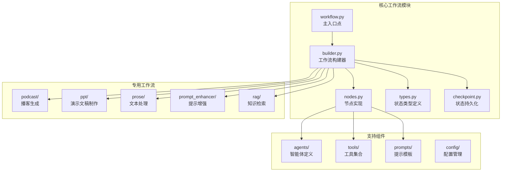
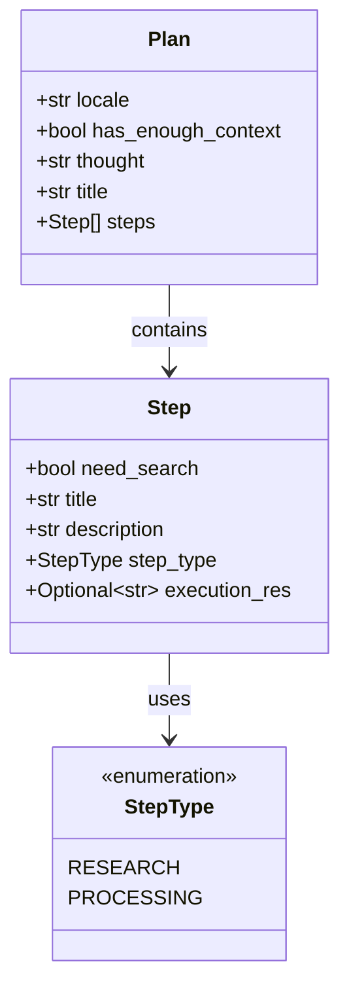
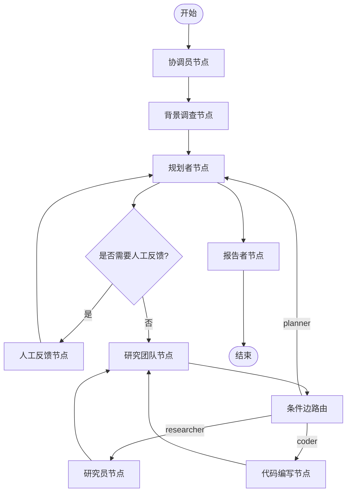
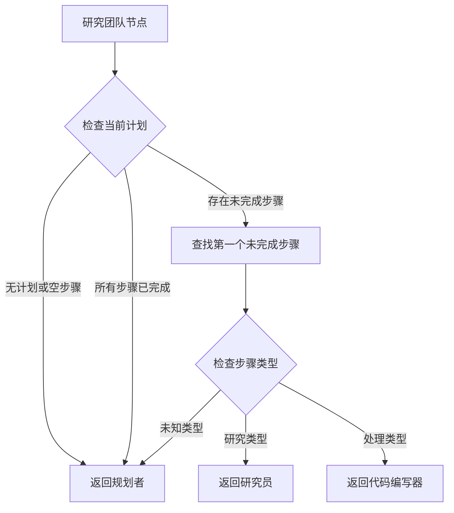
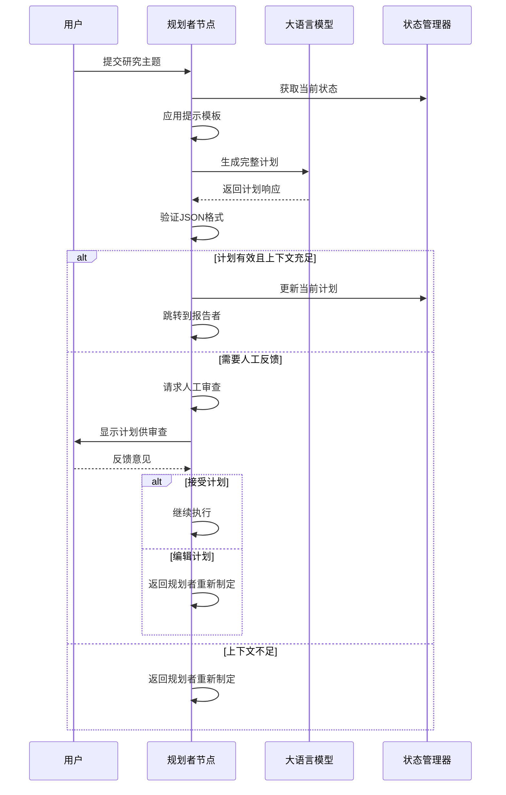
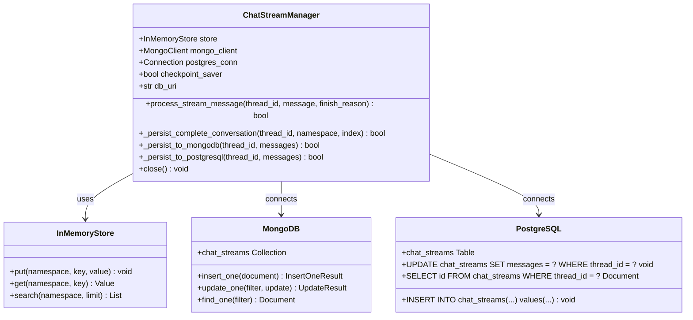
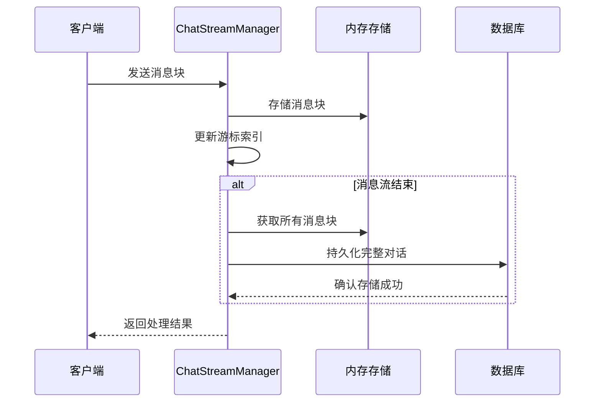
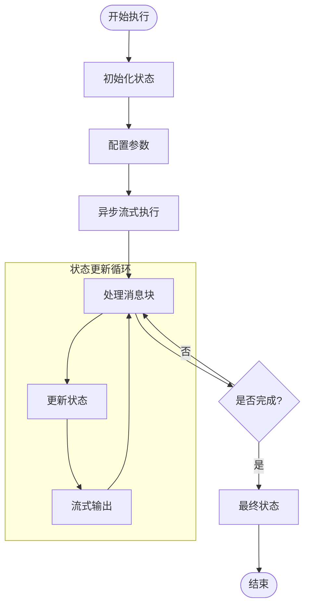
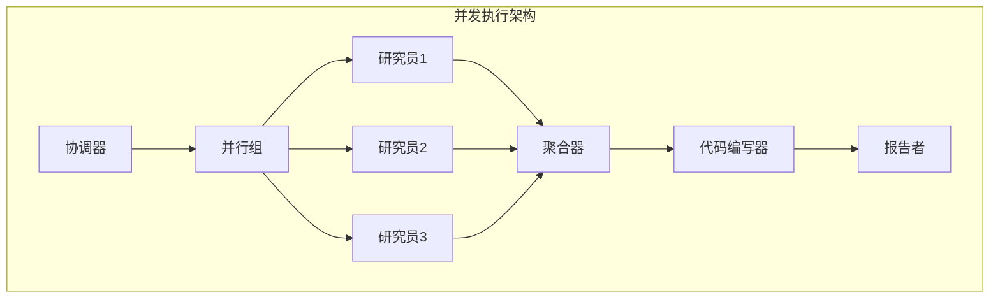

# 工作流编排机制

<cite>
**本文档引用的文件**
- [builder.py](file://src/graph/builder.py)
- [nodes.py](file://src/graph/nodes.py)
- [checkpoint.py](file://src/graph/checkpoint.py)
- [types.py](file://src/graph/types.py)
- [workflow.py](file://src/workflow.py)
- [planner_model.py](file://src/prompts/planner_model.py)
- [test_builder.py](file://tests/unit/graph/test_builder.py)
- [podcast_builder.py](file://src/podcast/graph/builder.py)
- [enhanced_logger.py](file://src/utils/enhanced_logger.py) - *在最近提交中更新*
</cite>

## 目录
1. [简介](#简介)
2. [项目架构概览](#项目架构概览)
3. [核心组件分析](#核心组件分析)
4. [工作流构建器详解](#工作流构建器详解)
5. [节点功能分析](#节点功能分析)
6. [状态管理与持久化](#状态管理与持久化)
7. [工作流执行流程](#工作流执行流程)
8. [高级特性](#高级特性)
9. [故障排除指南](#故障排除指南)
10. [总结](#总结)

## 简介

deer-flow 是一个基于 LangGraph 的智能工作流编排系统，专门设计用于构建复杂的多智能体协作任务。该系统通过有向无环图（DAG）的方式组织不同类型的智能体节点，实现了从简单的单智能体任务到复杂多阶段研究项目的无缝扩展。

系统的核心设计理念是将复杂的任务分解为可管理的子任务，每个子任务由专门的智能体负责执行。通过精心设计的状态管理和条件路由机制，系统能够根据任务进展动态调整执行路径，确保任务的高效完成。

近期，系统集成了增强日志系统，覆盖了全模块的节点跳转决策和耗时记录，显著提升了系统的可观察性和调试能力。

## 项目架构概览

deer-flow 采用模块化的架构设计，将工作流编排功能集中在 `src/graph` 目录下，同时支持多种特定领域的工作流实现。



**图表来源**
- [workflow.py](file://src/workflow.py#L1-L20)
- [builder.py](file://src/graph/builder.py#L1-L30)
- [nodes.py](file://src/graph/nodes.py#L1-L30)

**章节来源**
- [workflow.py](file://src/workflow.py#L1-L104)
- [builder.py](file://src/graph/builder.py#L1-L88)

## 核心组件分析

### 状态类型定义

系统通过 `State` 类扩展了 LangGraph 的 `MessagesState`，定义了工作流执行过程中需要维护的各种状态变量：

```python
class State(MessagesState):
    """Agent system state, extends MessagesState with additional fields."""
    
    # 运行时变量
    locale: str = "en-US"
    research_topic: str = ""
    observations: list[str] = []
    resources: list[Resource] = []
    plan_iterations: int = 0
    current_plan: Plan | str = None
    final_report: str = ""
    auto_accepted_plan: bool = False
    enable_background_investigation: bool = True
    background_investigation_results: str = None
```

### 计划模型结构

系统使用分层的计划模型来指导任务执行：



**图表来源**
- [planner_model.py](file://src/prompts/planner_model.py#L1-L59)

**章节来源**
- [types.py](file://src/graph/types.py#L1-L25)
- [planner_model.py](file://src/prompts/planner_model.py#L1-L59)

## 工作流构建器详解

### 基础工作流构建

`builder.py` 中的 `_build_base_graph()` 函数负责构建基础的工作流图结构：



**图表来源**
- [builder.py](file://src/graph/builder.py#L35-L60)

### 节点注册与连接

系统通过以下方式注册和连接各个节点：

1. **起始节点设置**：所有工作流都从 "coordinator" 节点开始
2. **静态节点添加**：使用 `add_node()` 方法添加固定节点
3. **条件边配置**：使用 `add_conditional_edges()` 实现动态路由

```python
def _build_base_graph():
    """构建并返回包含所有节点和边的基础状态图。"""
    builder = StateGraph(State)
    builder.add_edge(START, "coordinator")
    builder.add_node("coordinator", coordinator_node)
    builder.add_node("background_investigator", background_investigation_node)
    builder.add_node("planner", planner_node)
    builder.add_node("reporter", reporter_node)
    builder.add_node("research_team", research_team_node)
    builder.add_node("researcher", researcher_node)
    builder.add_node("coder", coder_node)
    builder.add_node("human_feedback", human_feedback_node)
    builder.add_edge("background_investigator", "planner")
    builder.add_conditional_edges(
        "research_team",
        continue_to_running_research_team,
        ["planner", "researcher", "coder"],
    )
    builder.add_edge("reporter", END)
    return builder
```

### 条件路由机制

`continue_to_running_research_team` 函数实现了复杂的研究任务调度逻辑，并新增了详细的跳转决策日志和耗时记录：



**图表来源**
- [builder.py](file://src/graph/builder.py#L15-L32)

**章节来源**
- [builder.py](file://src/graph/builder.py#L15-L88)

## 节点功能分析

### 协调员节点（Coordinator Node）

协调员节点作为工作流的入口点，负责初始化任务状态和启动后续流程。它通常不执行具体的计算任务，而是协调其他节点的执行顺序。

### 规划者节点（Planner Node）

规划者节点是工作流中最关键的组件之一，负责根据用户输入和背景信息生成详细的执行计划：



**图表来源**
- [nodes.py](file://src/graph/nodes.py#L60-L120)

### 研究员节点（Researcher Node）

研究员节点专注于信息收集和研究任务执行。它使用搜索工具和爬虫技术获取相关信息：

```python
def background_investigation_node(state: State, config: RunnableConfig):
    """背景调查节点，执行网络搜索和信息收集。"""
    configurable = Configuration.from_runnable_config(config)
    query = state.get("research_topic")
    background_investigation_results = None
    
    if SELECTED_SEARCH_ENGINE == SearchEngine.TAVILY.value:
        searched_content = LoggedTavilySearch(
            max_results=configurable.max_search_results
        ).invoke(query)
        # 处理搜索结果...
    else:
        background_investigation_results = get_web_search_tool(
            configurable.max_search_results, 
            configurable.search_engine,
            configurable.custom_search_repository
        ).invoke(query)
    
    return {
        "background_investigation_results": json.dumps(
            background_investigation_results, ensure_ascii=False
        )
    }
```

### 代码编写节点（Coder Node）

代码编写节点负责执行编程任务和数据处理工作。它使用 Python REPL 工具来执行代码片段：

```python
@tool
def python_repl_tool(code: str):
    """执行Python代码的工具。"""
    # 代码执行逻辑...
```

### 报告者节点（Reporter Node）

报告者节点整合所有收集的信息，生成最终的报告文档。它是工作流的终点节点，负责清理和格式化输出。

**章节来源**
- [nodes.py](file://src/graph/nodes.py#L40-L200)

## 状态管理与持久化

### 内存检查点机制

系统提供了两种状态保存模式：

1. **内存模式**：使用 `MemorySaver` 进行临时状态保存
2. **持久化模式**：支持 MongoDB 和 PostgreSQL 数据库的永久存储



**图表来源**
- [checkpoint.py](file://src/graph/checkpoint.py#L15-L80)

### 流式消息处理

`ChatStreamManager` 类实现了高效的流式消息处理机制：



**图表来源**
- [checkpoint.py](file://src/graph/checkpoint.py#L120-L180)

**章节来源**
- [checkpoint.py](file://src/graph/checkpoint.py#L1-L372)

## 工作流执行流程

### 异步执行模式

系统支持异步执行模式，允许实时监控和调试工作流执行过程：



**图表来源**
- [workflow.py](file://src/workflow.py#L25-L80)

### 执行配置选项

工作流执行支持多种配置选项：

```python
async def run_agent_workflow_async(
    user_input: str,
    debug: bool = False,
    max_plan_iterations: int = 1,
    max_step_num: int = 3,
    enable_background_investigation: bool = True,
):
    """异步运行代理工作流，带入给定的用户输入。"""
    
    initial_state = {
        "messages": [{"role": "user", "content": user_input}],
        "auto_accepted_plan": True,
        "enable_background_investigation": enable_background_investigation,
    }
    
    config = {
        "configurable": {
            "thread_id": "default",
            "max_plan_iterations": max_plan_iterations,
            "max_step_num": max_step_num,
            "mcp_settings": {
                "servers": {
                    "mcp-github-trending": {
                        "transport": "stdio",
                        "command": "uvx",
                        "args": ["mcp-github-trending"],
                        "enabled_tools": ["get_github_trending_repositories"],
                        "add_to_agents": ["researcher"],
                    }
                }
            },
        },
        "recursion_limit": get_recursion_limit(default=100),
    }
```

**章节来源**
- [workflow.py](file://src/workflow.py#L25-L104)

## 高级特性

### 错误处理与恢复

系统实现了多层次的错误处理机制：

1. **JSON 解析错误处理**：自动修复损坏的 JSON 输出
2. **递归限制**：防止无限递归导致的系统崩溃
3. **中断处理**：支持用户手动干预和计划编辑

### 并发执行支持

虽然当前实现主要是串行执行，但系统架构支持并发执行的扩展：



### 超时控制

系统通过配置参数控制执行超时：

- **递归限制**：默认 100 层
- **计划迭代次数**：可配置的最大迭代次数
- **步骤数量限制**：每个计划的最大步骤数

### MCP（Model Context Protocol）集成

系统支持 MCP 协议，允许与外部服务进行安全通信：

```python
"mcp_settings": {
    "servers": {
        "mcp-github-trending": {
            "transport": "stdio",
            "command": "uvx",
            "args": ["mcp-github-trending"],
            "enabled_tools": ["get_github_trending_repositories"],
            "add_to_agents": ["researcher"],
        }
    }
}
```

### 增强日志系统

系统集成了增强日志系统，覆盖全模块的节点跳转决策和耗时记录：

**节点执行日志示例**
```
🔄 NODE_ENTRY | background_investigation | 开始执行背景调研节点
🔍 使用Tavily搜索引擎进行背景调研 | 查询: 'AI发展趋势'
✅ NODE_EXIT | background_investigation | 节点执行完成 | 耗时: 2.34s
🔀 TRANSITION_LOGIC | research_team | 开始评估下一步跳转
🔀 TRANSITION_DECISION | research_team → researcher | 原因: 下一步是研究类型 | 步骤: '当前AI市场分析'
⏱️ TRANSITION_TIME | research_team 跳转逻辑 | 耗时: 0.02s
```

**日志功能特性**
- **节点执行跟踪**：记录每个节点的进入和退出时间
- **跳转决策日志**：详细记录条件路由的决策过程和原因
- **性能监控**：精确记录节点执行和跳转逻辑的耗时
- **彩色输出**：使用不同颜色区分日志级别和模块
- **上下文信息**：包含会话ID、用户查询等上下文信息

**章节来源**
- [builder.py](file://src/graph/builder.py#L25-L93)
- [nodes.py](file://src/graph/nodes.py#L100-L150)
- [enhanced_logger.py](file://src/utils/enhanced_logger.py#L1-L266)

## 故障排除指南

### 常见问题诊断

1. **状态丢失问题**
   - 检查数据库连接配置
   - 验证 `LANGGRAPH_CHECKPOINT_SAVER` 环境变量
   - 确认数据库权限设置

2. **工作流卡住问题**
   - 检查递归限制设置
   - 验证条件路由逻辑
   - 查看日志中的错误信息

3. **性能问题**
   - 监控内存使用情况
   - 优化大语言模型调用频率
   - 考虑启用缓存机制

### 调试技巧

1. **启用调试日志**：
```python
def enable_debug_logging():
    """启用调试级别的日志记录以获取更详细的执行信息。"""
    logging.getLogger("src").setLevel(logging.DEBUG)
```

2. **状态检查点**：定期保存中间状态以便回溯

3. **节点隔离测试**：单独测试每个节点的功能

4. **利用增强日志**：通过详细的跳转决策日志和耗时记录快速定位问题

**章节来源**
- [workflow.py](file://src/workflow.py#L15-L25)
- [checkpoint.py](file://src/graph/checkpoint.py#L350-L372)

## 总结

deer-flow 的工作流编排机制展现了现代 AI 系统设计的最佳实践。通过 LangGraph 的强大能力，系统实现了：

1. **模块化架构**：清晰的职责分离和可扩展的设计
2. **智能路由**：基于任务状态的动态决策机制
3. **状态持久化**：可靠的长期任务执行支持
4. **异步执行**：实时监控和交互能力
5. **错误恢复**：健壮的异常处理和恢复机制
6. **增强日志**：全面的节点跳转决策和性能监控

该系统不仅适用于当前的研究任务场景，也为未来的复杂 AI 应用提供了坚实的基础架构。通过持续的优化和扩展，deer-flow 将能够支持更多样化的应用场景和更复杂的业务需求。

系统的开源性质使其成为一个优秀的学习和参考案例，展示了如何在实际生产环境中构建可靠、可维护的 AI 工作流系统。