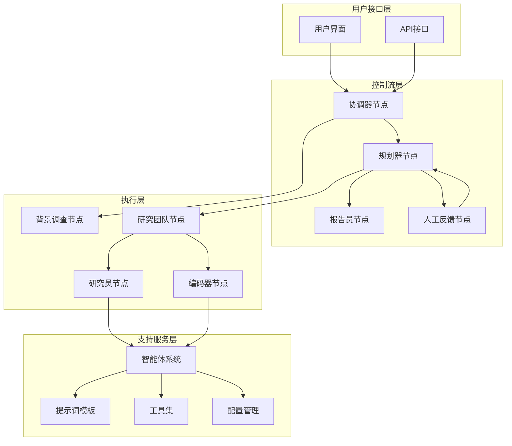
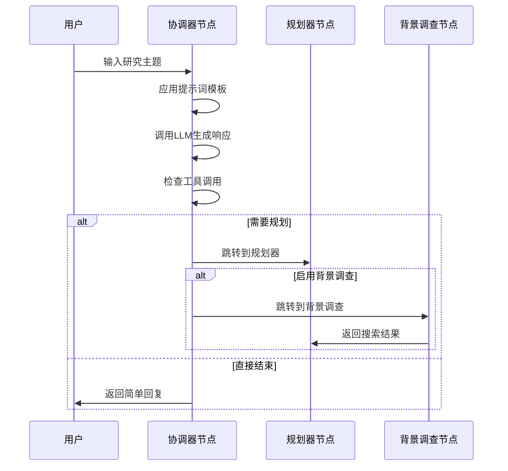
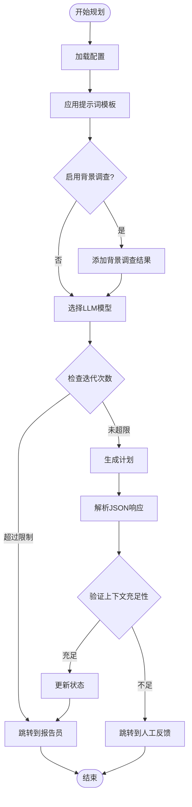
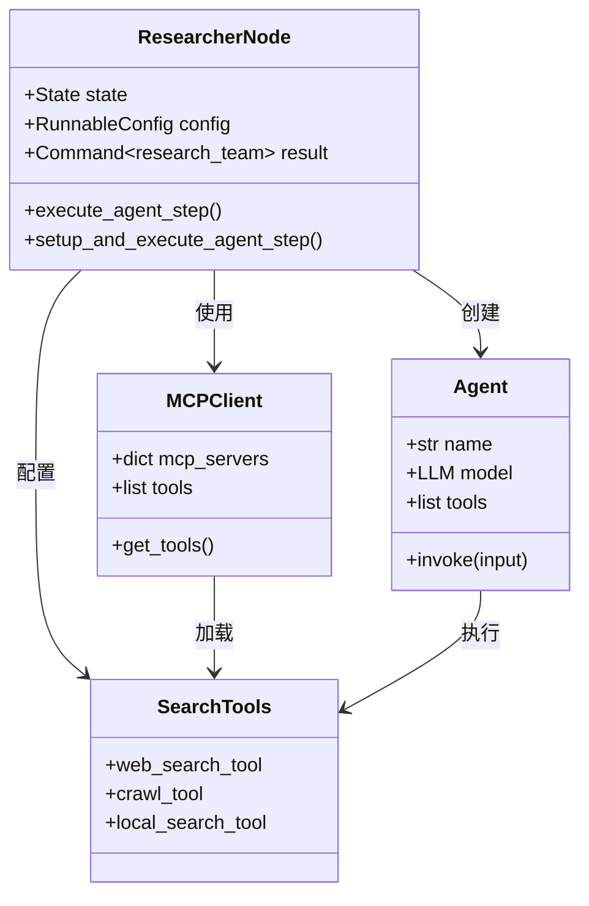
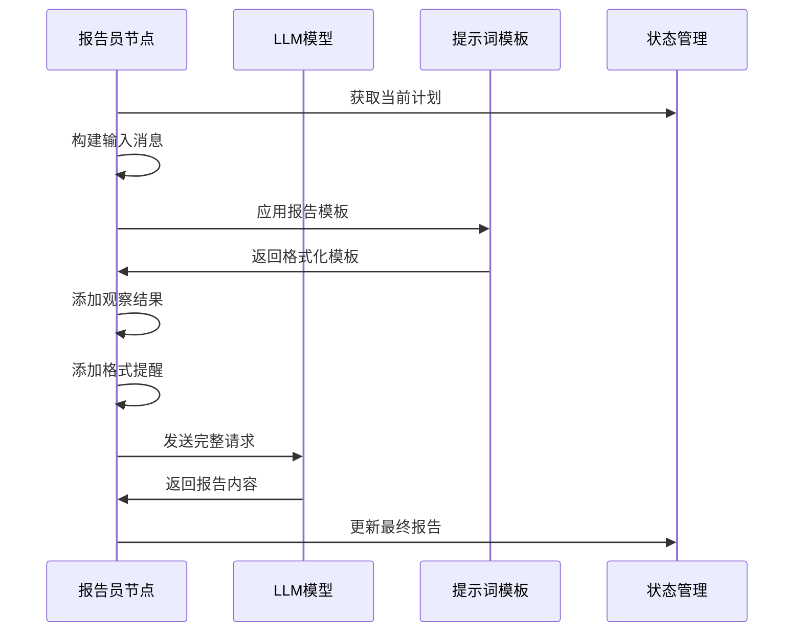
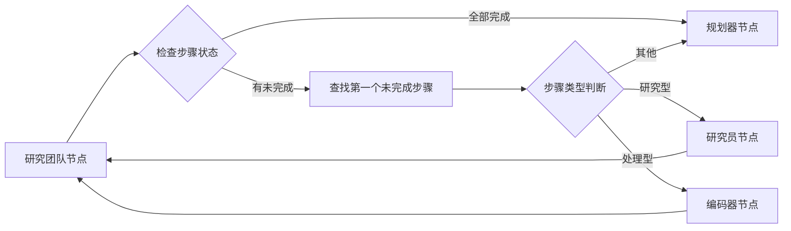
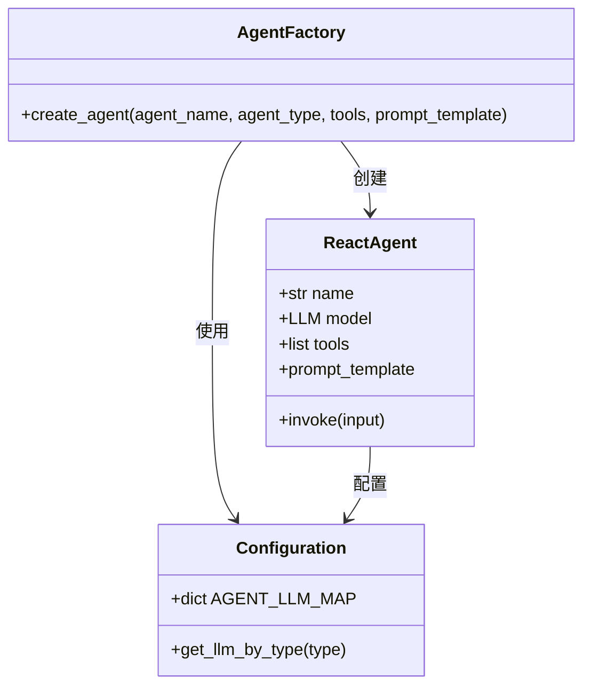
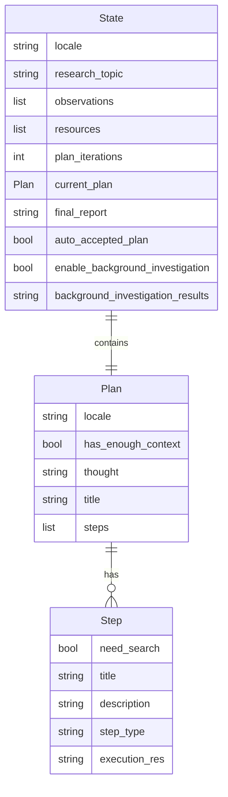
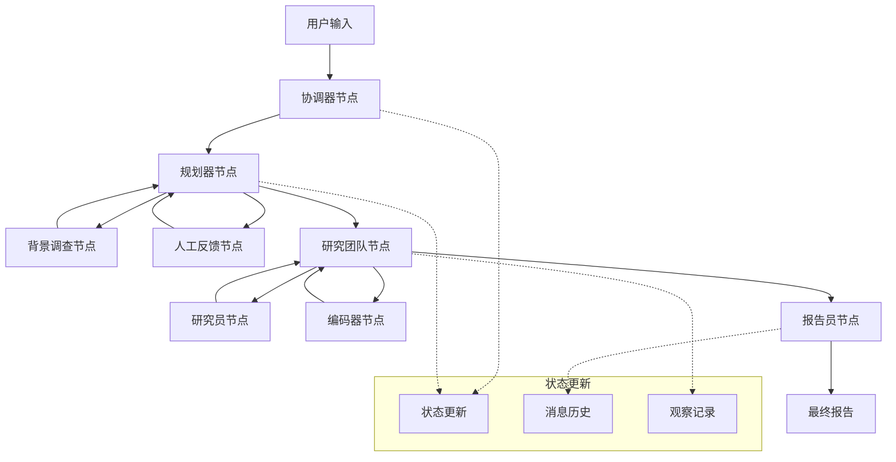

# 节点实现

<cite>
**本文档引用的文件**
- [nodes.py](file://src/graph/nodes.py)
- [coordinator.md](file://src/prompts/coordinator.md)
- [planner.md](file://src/prompts/planner.md)
- [researcher.md](file://src/prompts/researcher.md)
- [reporter.md](file://src/prompts/reporter.md)
- [agents.py](file://src/agents/agents.py)
- [configuration.py](file://src/config/configuration.py)
- [types.py](file://src/graph/types.py)
- [builder.py](file://src/graph/builder.py)
- [search.py](file://src/tools/search.py)
- [test_nodes.py](file://tests/integration/test_nodes.py)
</cite>

## 目录
1. [简介](#简介)
2. [项目架构概览](#项目架构概览)
3. [核心节点分析](#核心节点分析)
4. [节点间协作模式](#节点间协作模式)
5. [提示词模板系统](#提示词模板系统)
6. [智能体集成机制](#智能体集成机制)
7. [数据流分析](#数据流分析)
8. [调试技巧](#调试技巧)
9. [性能优化建议](#性能优化建议)
10. [总结](#总结)

## 简介

DeerFlow工作流是一个基于LangGraph框架的智能研究系统，通过多个专门化的节点协同工作来完成复杂的深度研究任务。每个节点都有特定的职责和功能，从协调用户交互到执行具体的研究步骤，形成了一个完整的智能代理生态系统。

本文档深入分析了`nodes.py`中各个核心节点的实现细节，包括它们的业务逻辑、输入参数处理、与下游智能体的调用机制以及输出结果的格式化过程。同时结合对应的提示词模板，说明节点如何将状态数据与提示词结合，驱动LLM生成决策或内容。

## 项目架构概览



**图表来源**
- [builder.py](file://src/graph/builder.py#L25-L50)
- [nodes.py](file://src/graph/nodes.py#L1-L50)

## 核心节点分析

### 协调器节点 (coordinator_node)

协调器节点是整个工作流的入口点，负责与用户进行初步交互并决定后续流程走向。



**图表来源**
- [nodes.py](file://src/graph/nodes.py#L180-L230)
- [coordinator.md](file://src/prompts/coordinator.md#L1-L56)

#### 核心功能特性

1. **多语言支持**: 自动识别用户语言并保持一致性
2. **安全过滤**: 拒绝不当请求，保护系统安全
3. **智能路由**: 根据输入内容决定最佳执行路径
4. **资源传递**: 将用户资源配置传递给后续节点

#### 输入参数处理

- `state`: 包含当前对话状态和用户输入
- `config`: 运行时配置，包含搜索设置和报告样式

#### 输出结果格式化

协调器节点通过工具调用机制向规划器发送研究指令，同时维护完整的对话历史记录。

**章节来源**
- [nodes.py](file://src/graph/nodes.py#L180-L230)
- [coordinator.md](file://src/prompts/coordinator.md#L1-L56)

### 规划器节点 (planner_node)

规划器节点负责为研究任务制定详细的行动计划，是整个工作流的核心决策节点。



**图表来源**
- [nodes.py](file://src/graph/nodes.py#L60-L120)
- [planner.md](file://src/prompts/planner.md#L1-L188)

#### 严格上下文评估标准

规划器采用了严格的上下文充足性评估标准：

1. **充分条件**:
   - 完全回答用户问题的所有方面
   - 信息全面、最新且来自可靠来源
   - 无显著空白、模糊或矛盾
   - 数据点有可信证据支持

2. **不足条件** (默认假设):
   - 任何部分问题未完全回答
   - 信息过时、不完整或来源可疑
   - 缺少关键数据点或证据
   - 任何合理的不确定性存在

#### 计划生成流程

规划器节点通过以下步骤生成详细的研究计划：

1. **模板应用**: 将状态数据与提示词模板结合
2. **LLM调用**: 使用适当的模型生成响应
3. **JSON解析**: 解析结构化输出
4. **上下文验证**: 评估信息充足性
5. **状态更新**: 更新工作流状态

**章节来源**
- [nodes.py](file://src/graph/nodes.py#L60-L120)
- [planner.md](file://src/prompts/planner.md#L1-L188)

### 研究员节点 (researcher_node)

研究员节点负责执行具体的搜索和信息收集任务，是信息获取的主要执行者。



**图表来源**
- [nodes.py](file://src/graph/nodes.py#L450-L512)
- [agents.py](file://src/agents/agents.py#L1-L20)

#### 工具集成机制

研究员节点支持两种工具配置模式：

1. **MCP服务器模式**: 动态加载外部工具
2. **默认工具模式**: 使用预配置的基础工具集

#### 递归限制管理

系统实现了智能的递归限制机制：

```python
# 递归限制配置示例
try:
    env_value_str = os.getenv("AGENT_RECURSION_LIMIT", str(default_recursion_limit))
    parsed_limit = int(env_value_str)
    
    if parsed_limit > 0:
        recursion_limit = parsed_limit
    else:
        recursion_limit = default_recursion_limit
except ValueError:
    recursion_limit = default_recursion_limit
```

**章节来源**
- [nodes.py](file://src/graph/nodes.py#L450-L512)
- [search.py](file://src/tools/search.py#L1-L114)

### 报告员节点 (reporter_node)

报告员节点负责整合所有收集的信息，生成最终的研究报告。



**图表来源**
- [nodes.py](file://src/graph/nodes.py#L230-L280)
- [reporter.md](file://src/prompts/reporter.md#L1-L199)

#### 报告格式规范

报告员节点遵循严格的格式规范：

1. **标题**: 使用一级标题格式
2. **关键要点**: 4-6个最重要的发现要点
3. **概述**: 1-2段的主题介绍和背景
4. **详细分析**: 逻辑清晰的分段分析
5. **调查笔记**: 更全面报告的附加分析
6. **关键引用**: 参考文献列表

**章节来源**
- [nodes.py](file://src/graph/nodes.py#L230-L280)
- [reporter.md](file://src/prompts/reporter.md#L1-L199)

## 节点间协作模式

### 条件路由机制



**图表来源**
- [builder.py](file://src/graph/builder.py#L20-L35)

### 状态流转控制

节点间的状态流转通过命令模式实现：

```python
# 命令模式示例
return Command(
    update={
        "messages": [AIMessage(content=full_response, name="planner")],
        "current_plan": new_plan,
    },
    goto="reporter",
)
```

这种设计确保了：
- 明确的状态变更
- 清晰的执行路径
- 可预测的行为模式

**章节来源**
- [nodes.py](file://src/graph/nodes.py#L60-L120)
- [builder.py](file://src/graph/builder.py#L20-L35)

## 提示词模板系统

### 模板应用机制

提示词模板系统通过`apply_prompt_template`函数将动态状态数据注入静态模板：

```python
# 模板应用示例
messages = apply_prompt_template("planner", state, configurable)
```

### 多样化提示词设计

不同节点使用专门设计的提示词模板：

1. **协调器模板**: 处理用户交互和安全过滤
2. **规划器模板**: 制定详细的研究计划
3. **研究员模板**: 执行信息收集任务
4. **报告员模板**: 生成最终研究报告

**章节来源**
- [coordinator.md](file://src/prompts/coordinator.md#L1-L56)
- [planner.md](file://src/prompts/planner.md#L1-L188)
- [researcher.md](file://src/prompts/researcher.md#L1-L87)
- [reporter.md](file://src/prompts/reporter.md#L1-L199)

## 智能体集成机制

### 智能体工厂模式



**图表来源**
- [agents.py](file://src/agents/agents.py#L1-L20)

### MCP工具集成

系统支持通过MCP (Model Context Protocol) 动态加载外部工具：

```python
# MCP服务器配置示例
mcp_servers = {
    "server_name": {
        "transport": "websocket",
        "command": "/path/to/tool",
        "enabled_tools": ["tool1", "tool2"],
        "add_to_agents": ["researcher", "coder"]
    }
}
```

**章节来源**
- [agents.py](file://src/agents/agents.py#L1-L20)
- [nodes.py](file://src/graph/nodes.py#L450-L512)

## 数据流分析

### 状态数据结构



**图表来源**
- [types.py](file://src/graph/types.py#L1-L25)

### 数据流向图



**图表来源**
- [builder.py](file://src/graph/builder.py#L25-L50)
- [types.py](file://src/graph/types.py#L1-L25)

**章节来源**
- [types.py](file://src/graph/types.py#L1-L25)
- [builder.py](file://src/graph/builder.py#L25-L50)

## 调试技巧

### 单节点调试方法

1. **日志级别调整**:
```python
import logging
logging.getLogger("src.graph.nodes").setLevel(logging.DEBUG)
```

2. **状态检查点**:
```python
# 在关键节点添加状态打印
logger.debug(f"Current state: {state}")
```

3. **LLM响应监控**:
```python
# 监控LLM调用和响应
logger.info(f"LLM response: {response}")
```

### 常见问题排查

1. **JSON解析错误**:
   - 检查提示词模板语法
   - 验证LLM输出格式
   - 使用`repair_json_output`函数修复

2. **工具调用失败**:
   - 验证工具配置
   - 检查MCP服务器连接
   - 确认权限设置

3. **状态同步问题**:
   - 使用内存检查点
   - 验证状态序列化
   - 检查状态字段完整性

**章节来源**
- [test_nodes.py](file://tests/integration/test_nodes.py#L1-L100)

## 性能优化建议

### 并发执行优化

1. **异步节点执行**:
```python
# 使用asyncio并发执行多个节点
await asyncio.gather(
    researcher_node(state, config),
    coder_node(state, config)
)
```

2. **缓存机制**:
```python
# 实现响应缓存减少重复计算
cache_key = hash(str(state) + prompt_hash)
if cache_key in cache:
    return cache[cache_key]
```

### 内存管理

1. **状态压缩**:
```python
# 定期清理历史消息
if len(state["messages"]) > MAX_HISTORY_LENGTH:
    state["messages"] = state["messages"][-MAX_HISTORY_LENGTH:]
```

2. **资源池化**:
```python
# 复用LLM实例和工具对象
llm_pool = LLMFactory.get_pool()
tool_pool = ToolFactory.get_pool()
```

### 配置优化

1. **模型选择策略**:
```python
# 根据任务复杂度选择合适模型
if task_complexity > HIGH_THRESHOLD:
    model = get_llm_by_type("advanced")
else:
    model = get_llm_by_type("basic")
```

2. **工具配置优化**:
```python
# 动态调整工具数量
if resource_constrained:
    tools = basic_tools
else:
    tools = advanced_tools
```

## 总结

DeerFlow工作流的节点实现展现了现代AI系统的复杂性和精密性。通过精心设计的节点架构，系统能够：

1. **模块化设计**: 每个节点专注于特定功能，便于维护和扩展
2. **灵活路由**: 支持多种执行路径和条件分支
3. **智能协作**: 节点间通过状态共享和命令模式实现高效协作
4. **可扩展性**: 支持MCP协议和动态工具加载
5. **健壮性**: 具备完善的错误处理和恢复机制

这种设计不仅提高了系统的可靠性，也为未来的功能扩展奠定了坚实基础。开发者可以通过深入理解这些节点的工作原理，更好地定制和优化系统以满足特定需求。