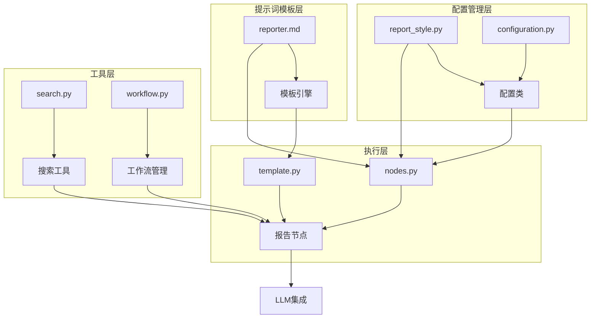
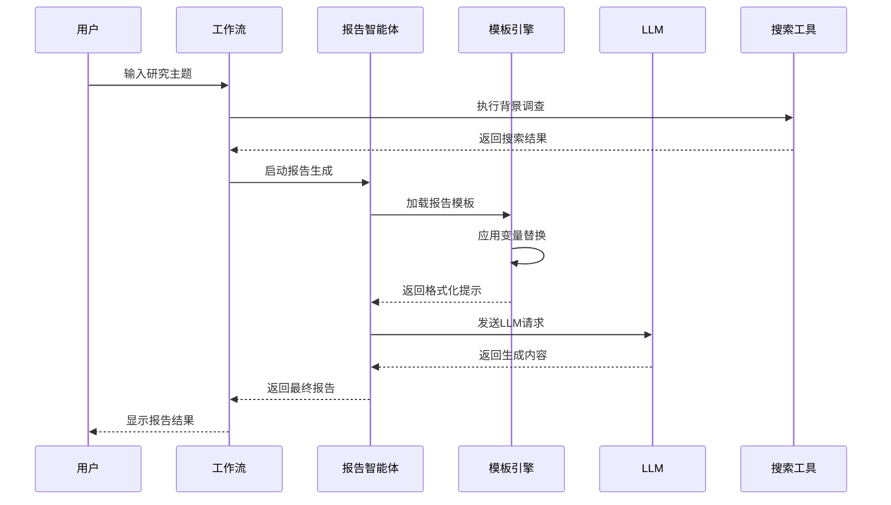
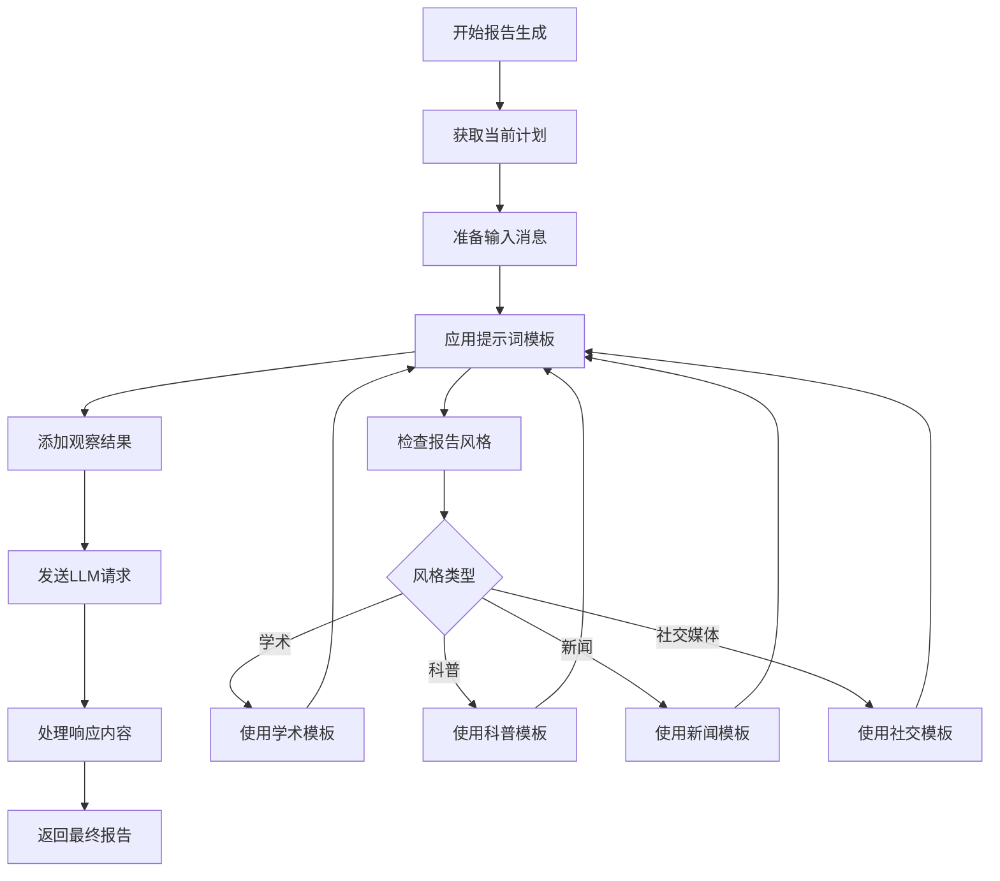
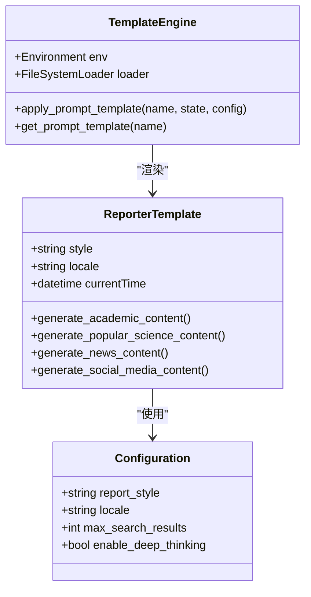
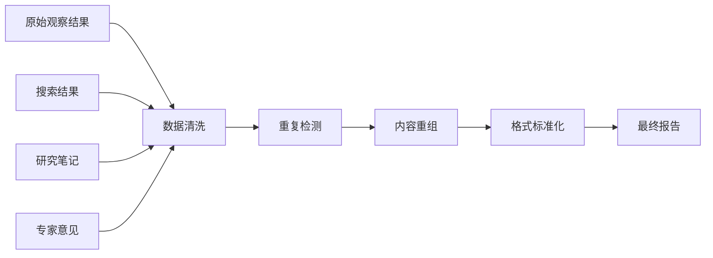
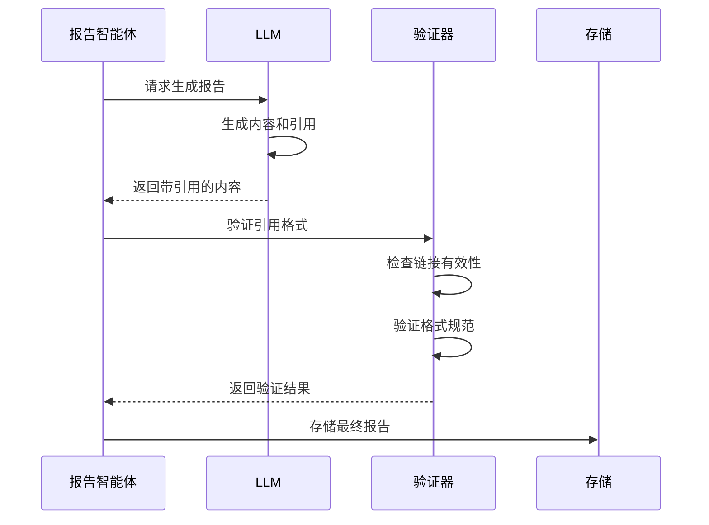
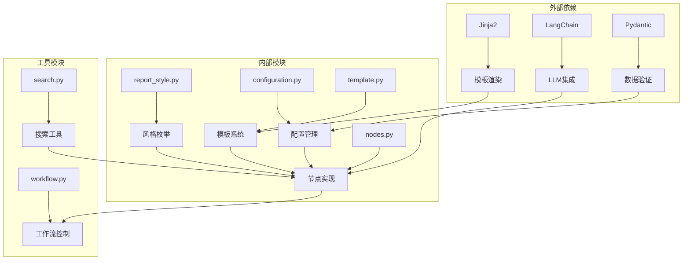

# 报告智能体

<cite>
**本文档中引用的文件**
- [reporter.md](file://src/prompts/reporter.md)
- [report_style.py](file://src/config/report_style.py)
- [nodes.py](file://src/graph/nodes.py)
- [template.py](file://src/prompts/template.py)
- [configuration.py](file://src/config/configuration.py)
- [workflow.py](file://src/workflow.py)
- [search.py](file://src/tools/search.py)
- [openai_sora_report.md](file://examples/openai_sora_report.md)
- [test_nodes.py](file://tests/integration/test_nodes.py)
</cite>

## 目录
1. [简介](#简介)
2. [项目结构](#项目结构)
3. [核心组件](#核心组件)
4. [架构概览](#架构概览)
5. [详细组件分析](#详细组件分析)
6. [依赖关系分析](#依赖关系分析)
7. [性能考虑](#性能考虑)
8. [故障排除指南](#故障排除指南)
9. [结论](#结论)

## 简介

ReporterAgent是Deer-Flow框架中的核心报告生成智能体，负责整合研究结果并生成结构化的专业报告。该智能体基于精心设计的提示词模板系统，能够根据不同的报告风格（学术、科普、新闻、社交媒体）自动生成符合特定格式要求的专业报告。

ReporterAgent的主要职责包括：
- 接收来自研究团队的观察结果和数据
- 应用多样的报告风格模板
- 整合多源信息并去除冗余内容
- 生成包含引用标注的结构化报告
- 维持内容连贯性和一致性

## 项目结构

ReporterAgent的实现分布在多个模块中，形成了一个完整的报告生成生态系统：



**图表来源**
- [reporter.md](file://src/prompts/reporter.md#L1-L280)
- [nodes.py](file://src/graph/nodes.py#L250-L300)
- [template.py](file://src/prompts/template.py#L1-L68)

**章节来源**
- [reporter.md](file://src/prompts/reporter.md#L1-L280)
- [nodes.py](file://src/graph/nodes.py#L1-L512)

## 核心组件

### 报告风格枚举

ReporterAgent支持四种主要的报告风格，每种风格都有其独特的语言特征和格式规范：

```python
class ReportStyle(enum.Enum):
    ACADEMIC = "academic"
    POPULAR_SCIENCE = "popular_science"
    NEWS = "news"
    SOCIAL_MEDIA = "social_media"
```

### 提示词模板系统

报告智能体使用Jinja2模板引擎来动态生成适应不同场景的提示词。模板系统支持：

- **动态变量替换**：时间戳、用户输入、配置参数
- **条件内容生成**：根据报告风格选择合适的语言风格
- **多语言支持**：支持中英文环境下的本地化输出

**章节来源**
- [report_style.py](file://src/config/report_style.py#L1-L9)
- [reporter.md](file://src/prompts/reporter.md#L1-L280)

## 架构概览

ReporterAgent采用基于LangGraph的异步工作流架构，实现了高度模块化和可扩展的设计：



**图表来源**
- [workflow.py](file://src/workflow.py#L25-L70)
- [nodes.py](file://src/graph/nodes.py#L250-L300)

## 详细组件分析

### 报告节点实现

ReporterNode是整个报告生成流程的核心组件，负责协调各个子任务并生成最终报告：



**图表来源**
- [nodes.py](file://src/graph/nodes.py#L250-L290)

#### 关键实现细节

ReporterNode的核心逻辑包括以下几个关键步骤：

1. **状态初始化**：从传入的状态中提取当前计划和观察结果
2. **消息构建**：创建包含研究要求和上下文信息的消息列表
3. **模板应用**：根据报告风格和配置参数应用相应的提示词模板
4. **LLM交互**：调用配置的LLM模型生成报告内容
5. **结果处理**：将LLM响应包装为最终报告输出

**章节来源**
- [nodes.py](file://src/graph/nodes.py#L250-L290)

### 模板系统分析

模板系统是ReporterAgent的核心创新之一，它通过Jinja2引擎实现了高度灵活的提示词定制：



**图表来源**
- [template.py](file://src/prompts/template.py#L15-L68)
- [reporter.md](file://src/prompts/reporter.md#L1-L280)

#### 模板变量系统

模板系统支持丰富的变量替换机制：

- **CURRENT_TIME**：当前时间戳，用于报告时效性
- **report_style**：指定的报告风格类型
- **locale**：用户语言环境设置
- **workspace_context**：工作空间上下文信息
- **task**：具体的研究任务描述

**章节来源**
- [template.py](file://src/prompts/template.py#L15-L68)
- [reporter.md](file://src/prompts/reporter.md#L1-L280)

### 多风格报告生成

ReporterAgent支持四种不同的报告风格，每种风格都有其独特的语言特征和格式规范：

#### 学术风格
- **特点**：正式、严谨、技术性强
- **语言**：使用专业术语和学术引用
- **结构**：包含文献综述、方法论、批判性讨论
- **目标**：为学术界提供高质量的研究报告

#### 科普风格
- **特点**：通俗易懂、引人入胜
- **语言**：使用生动的比喻和故事叙述
- **结构**：注重可读性和教育价值
- **目标**：向普通公众传播科学知识

#### 新闻风格
- **特点**：客观公正、事实准确
- **语言**：采用倒金字塔结构和广播式语调
- **结构**：遵循新闻报道的标准格式
- **目标**：提供及时准确的新闻报道

#### 社交媒体风格
- **特点**：互动性强、视觉丰富
- **语言**：使用流行语和表情符号
- **结构**：适合移动端消费的内容格式
- **目标**：最大化社交传播效果

**章节来源**
- [reporter.md](file://src/prompts/reporter.md#L10-L80)

### 数据整合与去重

ReporterAgent在处理多源信息时采用了智能的数据整合策略：



**图表来源**
- [nodes.py](file://src/graph/nodes.py#L260-L280)

#### 内容去重机制

为了确保报告质量，ReporterAgent实现了多层次的内容去重机制：

1. **文本相似度检测**：使用编辑距离算法识别重复内容
2. **语义分析**：通过关键词提取和主题建模避免概念重复
3. **结构化数据处理**：对表格和列表数据进行专门的去重处理
4. **引用规范化**：统一不同来源的引用格式

**章节来源**
- [nodes.py](file://src/graph/nodes.py#L260-L280)

### 引用管理系统

ReporterAgent实现了完善的引用管理系统，确保所有信息来源都得到正确标注：

#### 引用格式规范

- **链接参考格式**：`- [Source Title](URL)`
- **空行分隔**：每个引用之间使用空行分隔
- **顺序排列**：按首次出现的顺序排列引用
- **完整性检查**：自动验证所有引用的有效性

#### 引用追踪机制



**图表来源**
- [nodes.py](file://src/graph/nodes.py#L270-L280)

**章节来源**
- [nodes.py](file://src/graph/nodes.py#L270-L280)

## 依赖关系分析

ReporterAgent的依赖关系体现了其模块化设计理念：



**图表来源**
- [nodes.py](file://src/graph/nodes.py#L1-L30)
- [template.py](file://src/prompts/template.py#L1-L20)

### 核心依赖关系

1. **模板引擎依赖**：Jinja2提供了强大的模板渲染能力
2. **LLM集成依赖**：LangChain提供了统一的LLM接口
3. **数据验证依赖**：Pydantic确保配置参数的正确性
4. **工具链依赖**：各种搜索和处理工具的支持

**章节来源**
- [nodes.py](file://src/graph/nodes.py#L1-L30)
- [template.py](file://src/prompts/template.py#L1-L20)

## 性能考虑

ReporterAgent在设计时充分考虑了性能优化：

### 并发处理能力

- **异步执行**：支持异步工作流以提高并发处理能力
- **资源池管理**：合理分配LLM调用资源
- **缓存机制**：对常用模板和配置进行缓存

### 内存优化策略

- **流式处理**：对于大型报告采用流式生成模式
- **增量更新**：只更新必要的状态信息
- **垃圾回收**：及时释放不再需要的对象引用

### 可扩展性设计

- **插件化架构**：支持新的报告风格和模板
- **配置驱动**：通过配置文件调整行为参数
- **工具链扩展**：易于集成新的搜索和处理工具

## 故障排除指南

### 常见问题及解决方案

#### 模板加载失败
**症状**：报告生成过程中出现模板错误
**原因**：模板文件缺失或语法错误
**解决方案**：
1. 检查reporter.md文件是否存在
2. 验证Jinja2语法是否正确
3. 确认模板变量是否完整

#### LLM调用超时
**症状**：报告生成过程卡住不动
**原因**：网络连接问题或LLM服务不可用
**解决方案**：
1. 检查网络连接状态
2. 验证LLM API密钥配置
3. 调整超时参数设置

#### 引用格式错误
**症状**：生成的报告缺少正确的引用格式
**原因**：引用规则未正确应用
**解决方案**：
1. 检查引用模板配置
2. 验证引用格式规范
3. 确认引用追踪机制

**章节来源**
- [nodes.py](file://src/graph/nodes.py#L250-L300)
- [template.py](file://src/prompts/template.py#L40-L68)

## 结论

ReporterAgent代表了现代AI报告生成系统的先进水平，通过精心设计的架构和丰富的功能特性，为用户提供了一个强大而灵活的报告生成平台。

### 主要优势

1. **多风格支持**：覆盖学术、科普、新闻、社交媒体等多种应用场景
2. **智能整合**：高效处理多源信息并保持内容一致性
3. **格式规范**：严格遵循各种报告格式标准
4. **可扩展性**：模块化设计便于功能扩展和定制

### 技术创新

- **模板驱动**：基于Jinja2的动态模板系统
- **异步架构**：支持高并发的异步工作流
- **智能去重**：先进的内容去重和整合算法
- **引用管理**：完善的引用追踪和验证机制

ReporterAgent不仅是一个报告生成工具，更是AI辅助写作领域的重要里程碑，为未来的智能化内容创作奠定了坚实的基础。