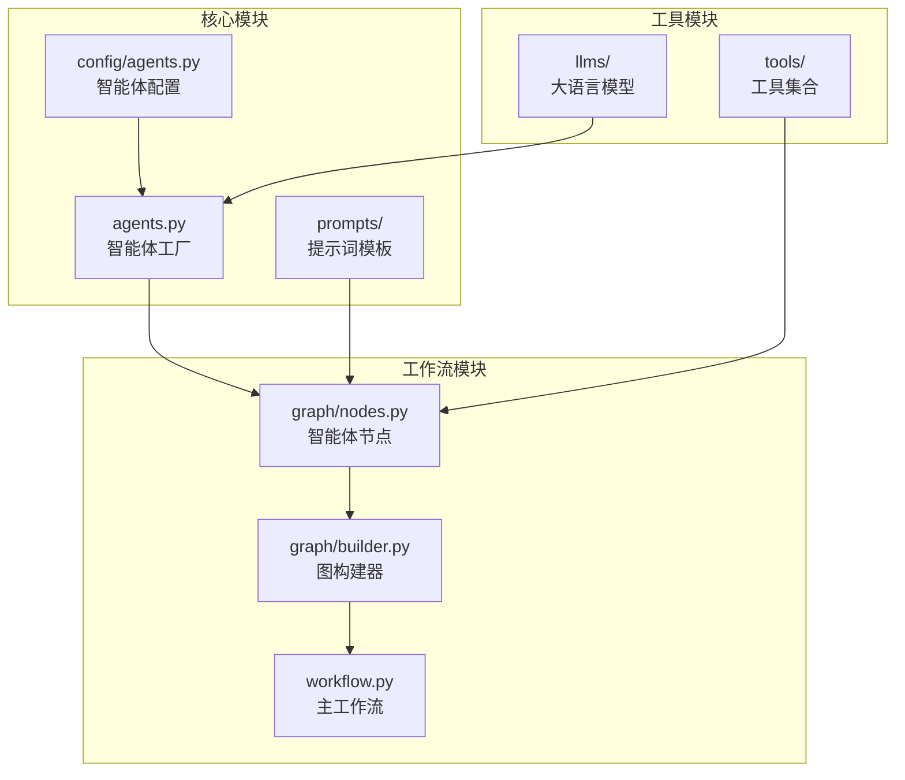
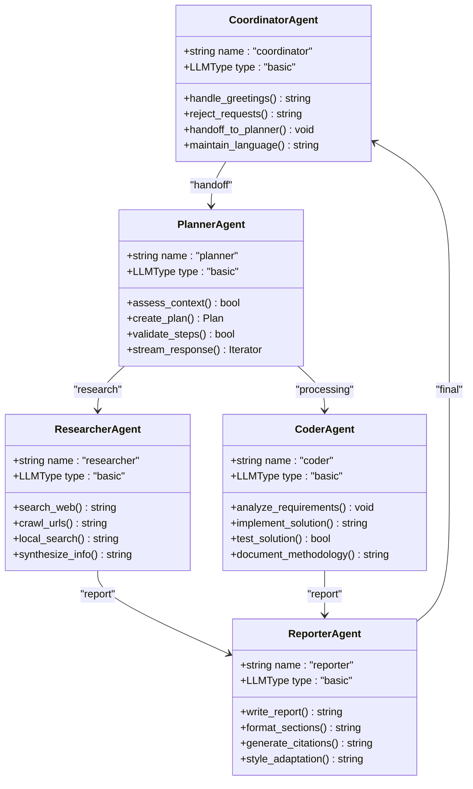
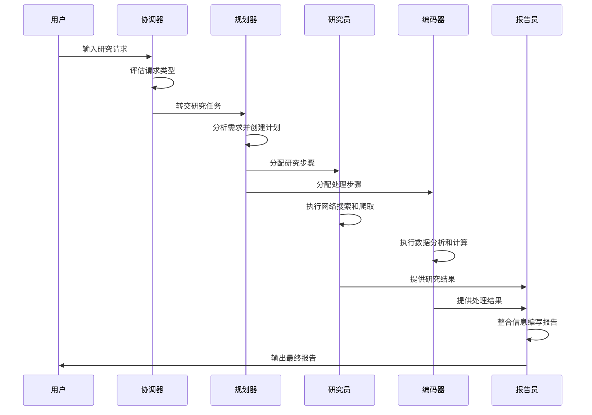
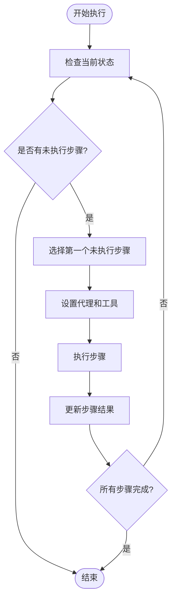

# 智能体类型

<cite>
**本文档中引用的文件**
- [agents.py](file://src/agents/agents.py)
- [coordinator.md](file://src/prompts/coordinator.md)
- [planner.md](file://src/prompts/planner.md)
- [researcher.md](file://src/prompts/researcher.md)
- [reporter.md](file://src/prompts/reporter.md)
- [coder.md](file://src/prompts/coder.md)
- [nodes.py](file://src/graph/nodes.py)
- [builder.py](file://src/graph/builder.py)
- [agents.py](file://src/config/agents.py)
- [planner_model.py](file://src/prompts/planner_model.py)
- [workflow.py](file://src/workflow.py)
</cite>

## 目录
1. [简介](#简介)
2. [项目结构概览](#项目结构概览)
3. [核心智能体架构](#核心智能体架构)
4. [智能体类型详解](#智能体类型详解)
5. [智能体协作流程](#智能体协作流程)
6. [提示词模板分析](#提示词模板分析)
7. [智能体节点实现](#智能体节点实现)
8. [扩展方法](#扩展方法)
9. [总结](#总结)

## 简介

deer-flow是一个基于LangGraph构建的多智能体协作系统，专门设计用于深度研究任务。该系统通过多个专业化智能体的协同工作，能够处理从简单咨询到复杂数据分析的各种研究需求。每个智能体都有明确的职责分工，形成了一个高效的研究工作流。

## 项目结构概览

deer-flow项目采用模块化设计，将智能体功能分布在不同的目录中：



**图表来源**
- [agents.py](file://src/agents/agents.py#L1-L20)
- [nodes.py](file://src/graph/nodes.py#L1-L50)
- [builder.py](file://src/graph/builder.py#L1-L43)

## 核心智能体架构

deer-flow系统包含五个主要的智能体类型，每个都有特定的角色和职责：



**图表来源**
- [agents.py](file://src/agents/agents.py#L10-L19)
- [agents.py](file://src/config/agents.py#L10-L19)

**章节来源**
- [agents.py](file://src/agents/agents.py#L1-L20)
- [agents.py](file://src/config/agents.py#L1-L19)

## 智能体类型详解

### 协调器智能体 (CoordinatorAgent)

协调器智能体是系统的入口点，负责与用户进行初步交互并判断请求类型。

**核心职责：**
- 响应问候和闲聊
- 拒绝不当请求
- 评估研究需求
- 将研究任务转交给规划器

**行为模式：**
```python
# 协调器的决策逻辑
if is_simple_greeting(input):
    return friendly_response()
elif is_security_risk(input):
    return polite_rejection()
else:
    return handoff_to_planner()
```

**关键特性：**
- 支持多语言响应
- 具备安全过滤机制
- 能够识别研究需求
- 提供友好的用户体验

### 规划器智能体 (PlannerAgent)

规划器智能体负责制定详细的研究计划，将用户需求分解为可执行的任务。

**核心职责：**
- 分析用户需求
- 创建研究步骤
- 评估信息充分性
- 管理计划迭代

**计划结构：**
```python
class Plan:
    locale: string          # 用户语言环境
    has_enough_context: bool # 是否有足够的上下文
    thought: string         # 思考过程
    title: string          # 计划标题
    steps: List[Step]      # 研究步骤列表
```

**章节来源**
- [planner.md](file://src/prompts/planner.md#L1-L187)
- [planner_model.py](file://src/prompts/planner_model.py#L1-L58)

### 研究员智能体 (ResearcherAgent)

研究员智能体专注于信息收集，使用多种工具进行网络搜索和内容爬取。

**核心职责：**
- 执行网络搜索
- 爬取网页内容
- 本地知识库检索
- 信息综合整理

**可用工具：**
- **内置工具：**
  - `web_search`: 网络搜索
  - `crawl_tool`: 网页爬取
  - `local_search_tool`: 本地知识库搜索

- **动态工具：**
  - GitHub趋势搜索
  - 地图工具
  - 数据库检索工具

**章节来源**
- [researcher.md](file://src/prompts/researcher.md#L1-L86)
- [nodes.py](file://src/graph/nodes.py#L481-L510)

### 报告员智能体 (ReporterAgent)

报告员智能体负责将收集的信息整理成结构化的研究报告。

**核心职责：**
- 编写研究报告
- 格式化输出内容
- 生成引用列表
- 风格适配

**支持的报告风格：**
- **学术风格**: 学术严谨，理论框架完整
- **科普风格**: 易于理解，富有故事性
- **新闻风格**: 权威报道，事实准确
- **社交媒体风格**: 互动性强，易于传播

**章节来源**
- [reporter.md](file://src/prompts/reporter.md#L1-L199)

### 编码器智能体 (CoderAgent)

编码器智能体专注于Python编程任务，处理数据分析和计算问题。

**核心职责：**
- 分析编程需求
- 实现解决方案
- 测试代码质量
- 文档化方法论

**支持的功能：**
- 数据分析
- 数学计算
- 算法实现
- 文件操作

**预装库：**
- `pandas`: 数据处理
- `numpy`: 数值计算
- `yfinance`: 金融数据获取

**章节来源**
- [coder.md](file://src/prompts/coder.md#L1-L34)

## 智能体协作流程

deer-flow系统采用分层协作模式，智能体之间通过明确的消息传递机制进行通信：



**图表来源**
- [nodes.py](file://src/graph/nodes.py#L183-L225)
- [nodes.py](file://src/graph/nodes.py#L200-L250)

**章节来源**
- [nodes.py](file://src/graph/nodes.py#L1-L512)
- [builder.py](file://src/graph/builder.py#L1-L43)

## 提示词模板分析

每个智能体都有一套专门设计的提示词模板，确保其行为符合预期：

### 协调器提示词特点
- 清晰的请求分类规则
- 安全过滤机制
- 友好的用户交互方式
- 多语言支持

### 规划器提示词特点
- 严格的上下文评估标准
- 详细的步骤约束
- 最大化信息收集原则
- JSON格式输出要求

### 研究员提示词特点
- 工具选择指导
- 信息验证要求
- 引用格式规范
- 时间范围处理

### 报告员提示词特点
- 多样化的写作风格
- 结构化报告格式
- 引用管理规范
- 内容质量保证

**章节来源**
- [coordinator.md](file://src/prompts/coordinator.md#L1-L55)
- [planner.md](file://src/prompts/planner.md#L1-L187)
- [researcher.md](file://src/prompts/researcher.md#L1-L86)
- [reporter.md](file://src/prompts/reporter.md#L1-L199)

## 智能体节点实现

智能体节点是系统的核心执行单元，负责具体的任务执行：

### 节点执行流程



**图表来源**
- [nodes.py](file://src/graph/nodes.py#L300-L400)

### 工具集成机制

系统支持两种工具集成方式：

1. **静态工具**: 固定配置的工具集
2. **动态MCP工具**: 通过MCP协议加载的工具

```python
# 动态工具配置示例
mcp_servers = {
    "mcp-github-trending": {
        "transport": "stdio",
        "command": "uvx",
        "args": ["mcp-github-trending"],
        "enabled_tools": ["get_github_trending_repositories"],
        "add_to_agents": ["researcher"],
    }
}
```

**章节来源**
- [nodes.py](file://src/graph/nodes.py#L400-L512)

## 扩展方法

### 添加新智能体类型

要添加新的智能体类型，需要遵循以下步骤：

1. **定义智能体配置**:
```python
# 在agents.py中添加配置
AGENT_LLM_MAP: dict[str, LLMType] = {
    # ... 现有配置
    "new_agent": "basic",  # 新智能体类型
}
```

2. **创建提示词模板**:
```markdown
# 新智能体提示词模板
你是一个新的智能体，负责...
```

3. **实现节点逻辑**:
```python
async def new_agent_node(state: State, config: RunnableConfig):
    """新智能体节点实现"""
    # 实现具体逻辑
    pass
```

4. **注册到工作流**:
```python
# 在builder.py中添加节点
from .nodes import new_agent_node

def build_graph():
    # ... 现有节点
    graph.add_node("new_agent", new_agent_node)
```

### 自定义工具集成

系统支持通过MCP协议集成自定义工具：

```python
# 配置自定义MCP服务器
custom_mcp_config = {
    "servers": {
        "custom-tool": {
            "transport": "stdio",
            "command": "/path/to/custom/tool",
            "enabled_tools": ["custom_function"],
            "add_to_agents": ["researcher", "coder"],
        }
    }
}
```

## 总结

deer-flow的智能体系统通过精心设计的架构实现了高效的协作模式。每个智能体都有明确的职责边界，通过标准化的接口进行通信，形成了一个完整的研究工作流。这种设计不仅提高了系统的可维护性，也为未来的功能扩展提供了良好的基础。

系统的主要优势包括：
- **模块化设计**: 每个组件职责清晰，便于维护和扩展
- **灵活的工具集成**: 支持静态和动态工具配置
- **多语言支持**: 能够适应不同地区的用户需求
- **安全机制**: 内置的安全过滤和拒绝机制
- **可扩展性**: 易于添加新的智能体类型和工具

通过这种设计，deer-flow能够处理从简单的信息查询到复杂的多步骤研究任务，为用户提供高质量的研究服务。