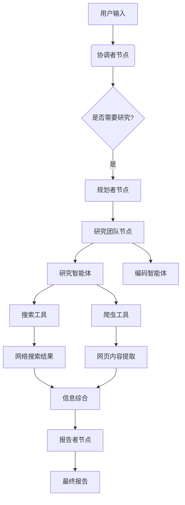
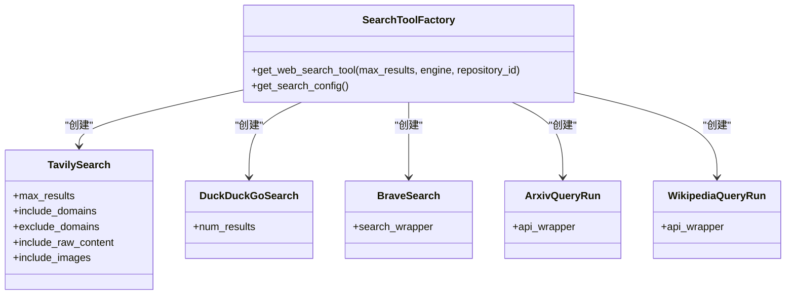
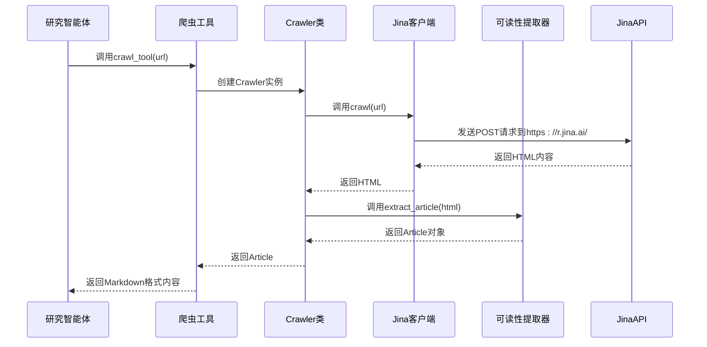
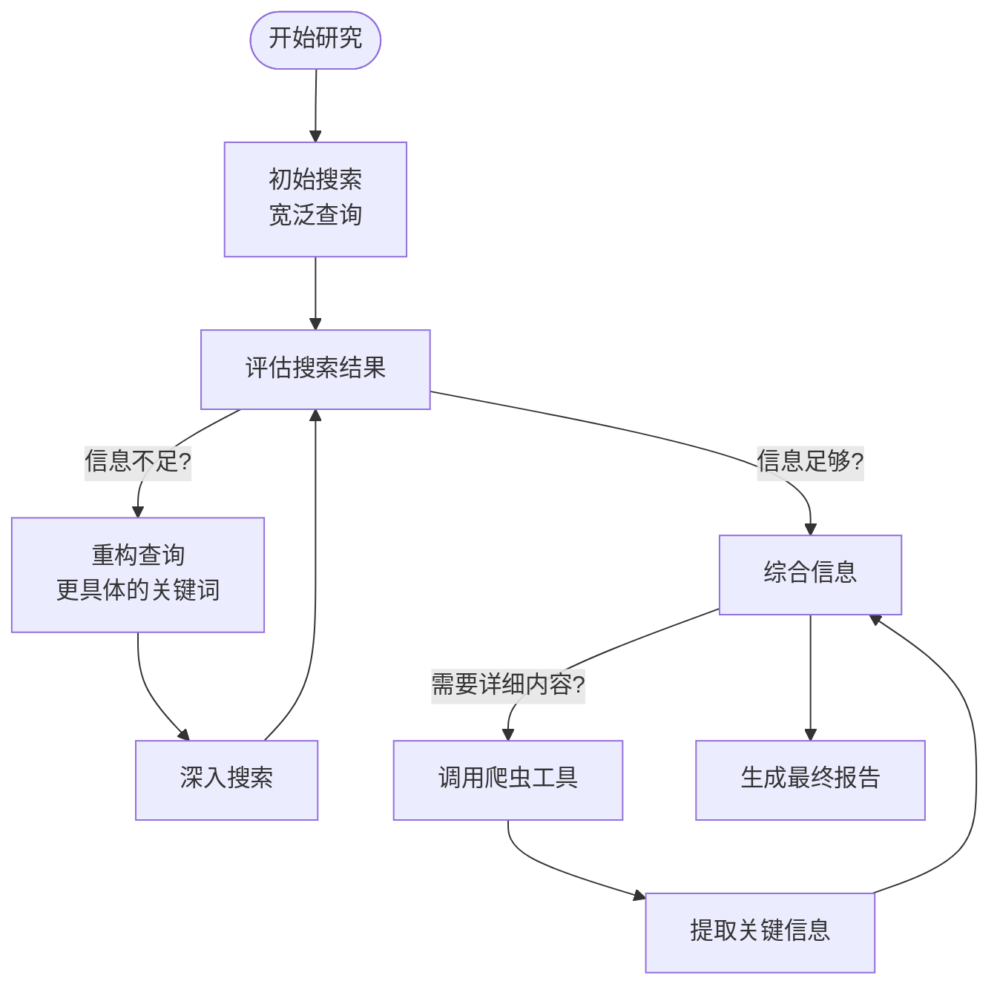

# 研究智能体

<cite>
**本文档引用的文件**  
- [researcher.md](file://src/prompts/researcher.md)
- [search.py](file://src/tools/search.py)
- [crawl.py](file://src/tools/crawl.py)
- [crawler.py](file://src/crawler/crawler.py)
- [jina_client.py](file://src/crawler/jina_client.py)
- [readability_extractor.py](file://src/crawler/readability_extractor.py)
- [article.py](file://src/crawler/article.py)
- [conf.yaml](file://conf.yaml)
- [nodes.py](file://src/graph/nodes.py)
- [builder.py](file://src/graph/builder.py)
- [agents.py](file://src/agents/agents.py)
- [workflow.py](file://src/workflow.py)
</cite>

## 目录
1. [引言](#引言)
2. [研究智能体架构概述](#研究智能体架构概述)
3. [核心研究能力分析](#核心研究能力分析)
4. [搜索工具实现机制](#搜索工具实现机制)
5. [网络爬虫技术细节](#网络爬虫技术细节)
6. [信息检索决策流程](#信息检索决策流程)
7. [迭代搜索与资源管理](#迭代搜索与资源管理)
8. [信息过载与噪声数据处理策略](#信息过载与噪声数据处理策略)
9. [系统集成与工作流](#系统集成与工作流)
10. [结论](#结论)

## 引言

研究智能体（ResearcherAgent）是一个专门设计用于执行深入信息调查的智能系统。该智能体通过集成多种搜索工具和网络爬虫技术，能够系统性地获取、处理和综合信息，为复杂问题提供全面的解决方案。本报告将深入分析研究智能体的核心能力，重点阐述其如何利用`researcher.md`提示词模板指导信息检索过程，包括查询重构、结果评估和关键信息提取的技术细节。同时，将结合`search.py`和`crawler.py`等核心模块的实现，详细说明其调用外部API、处理网页内容和提取关键事实的技术机制。

**Section sources**
- [researcher.md](file://src/prompts/researcher.md)
- [nodes.py](file://src/graph/nodes.py)

## 研究智能体架构概述

研究智能体是整个智能系统中的一个关键组件，它与其他智能体（如规划者、协调者和报告者）协同工作，形成一个完整的任务执行闭环。该智能体基于LangGraph框架构建，通过状态图（StateGraph）管理复杂的任务流程。其核心功能是执行由规划者节点生成的研究任务，并将结果反馈给报告者节点以生成最终报告。

**Diagram sources**
- [builder.py](file://src/graph/builder.py#L0-L87)
- [nodes.py](file://src/graph/nodes.py#L0-L511)

**Section sources**
- [builder.py](file://src/graph/builder.py#L0-L87)
- [nodes.py](file://src/graph/nodes.py#L0-L511)

## 核心研究能力分析

研究智能体的核心能力体现在其系统化的信息检索和处理流程上。根据`researcher.md`提示词模板，智能体遵循一套严格的步骤来完成研究任务：首先理解问题，然后评估可用工具，制定解决方案计划，执行研究并综合信息。这一流程确保了研究的系统性和完整性。

智能体能够访问两类工具：内置工具和动态加载工具。内置工具包括`web_search`用于网络搜索和`crawl_tool`用于内容爬取。动态加载工具则根据配置动态提供，如GitHub趋势搜索等，这使得智能体能够适应不同的研究需求。智能体被明确指示要优先使用工具获取信息，而非依赖其内部知识。

**Section sources**
- [researcher.md](file://src/prompts/researcher.md#L0-L86)

## 搜索工具实现机制

搜索工具的实现位于`src/tools/search.py`文件中，它提供了一个灵活的接口来集成多种搜索引擎。系统支持Tavily、DuckDuckGo、Brave Search、ArXiv和Wikipedia等多种搜索服务。通过工厂模式`get_web_search_tool`函数，系统可以根据配置选择合适的搜索引擎。

**Diagram sources**
- [search.py](file://src/tools/search.py#L0-L113)

**Section sources**
- [search.py](file://src/tools/search.py#L0-L113)
- [conf.yaml](file://conf.yaml#L0-L68)

## 网络爬虫技术细节

网络爬虫功能由`src/tools/crawl.py`和`src/crawler/`目录下的模块共同实现。`crawl_tool`是一个装饰器工具，它调用`Crawler`类来执行实际的爬取任务。`Crawler`类使用Jina Reader API来获取网页的HTML内容，然后通过ReadabilityExtractor提取可读的文章内容。

**Diagram sources**
- [crawl.py](file://src/tools/crawl.py#L0-L29)
- [crawler.py](file://src/crawler/crawler.py#L0-L27)
- [jina_client.py](file://src/crawler/jina_client.py#L0-L26)
- [readability_extractor.py](file://src/crawler/readability_extractor.py#L0-L15)

**Section sources**
- [crawl.py](file://src/tools/crawl.py#L0-L29)
- [crawler.py](file://src/crawler/crawler.py#L0-L27)
- [jina_client.py](file://src/crawler/jina_client.py#L0-L26)
- [readability_extractor.py](file://src/crawler/readability_extractor.py#L0-L15)

## 信息检索决策流程

研究智能体的信息检索决策流程是一个多阶段的系统化过程。首先，智能体根据`researcher.md`模板中的指导原则，将复杂问题分解为可管理的子任务。然后，它评估可用的工具集，选择最适合每个子任务的工具。

对于需要最新信息或广泛网络信息的任务，智能体会使用`web_search`工具进行初步搜索。搜索结果会经过评估，如果发现关键信息无法从摘要中获取，智能体会调用`crawl_tool`来获取完整网页内容。整个过程遵循"先搜索，后爬取"的原则，以优化资源使用和响应速度。

智能体还特别关注信息来源的可靠性和时效性。在处理有时间范围要求的任务时，它会在查询中加入适当的时间参数（如"after:2020"），并验证信息来源的发布日期。

**Section sources**
- [researcher.md](file://src/prompts/researcher.md#L0-L86)
- [nodes.py](file://src/graph/nodes.py#L0-L511)

## 迭代搜索与资源管理

研究智能体采用迭代式搜索策略来逐步深化研究。初始搜索提供广泛的信息概览，随后的搜索基于初步发现进行重构和细化。这种迭代方法允许智能体从宽泛的查询开始，然后根据获得的信息逐步聚焦到更具体的子主题。

在资源管理方面，智能体通过配置文件`conf.yaml`中的参数来控制搜索行为。例如，`max_search_results`参数限制了每次搜索返回的结果数量，防止信息过载。同时，智能体被设计为只在必要时才调用资源密集型的爬虫工具，优先利用搜索结果中的摘要信息。

**Diagram sources**
- [conf.yaml](file://conf.yaml#L0-L68)
- [search.py](file://src/tools/search.py#L0-L113)

**Section sources**
- [conf.yaml](file://conf.yaml#L0-L68)
- [search.py](file://src/tools/search.py#L0-L113)

## 信息过载与噪声数据处理策略

面对信息过载和噪声数据，研究智能体采用了多层次的过滤和验证策略。首先，通过配置文件中的`include_domains`和`exclude_domains`参数，智能体可以限制搜索结果的来源，优先考虑可信域名（如.gov.cn和.edu.cn），排除低质量或不可靠的网站。

其次，智能体在信息综合阶段会交叉验证来自多个来源的信息，识别并排除不一致或可疑的数据。对于提取的内容，系统使用Readability算法来过滤网页中的广告、导航栏等噪声元素，只保留主要的文章内容。

此外，智能体被明确指示要验证信息来源的可信度，并在最终报告中准确引用所有信息来源，这不仅提高了信息的可靠性，也为用户提供了验证信息的途径。

**Section sources**
- [conf.yaml](file://conf.yaml#L0-L68)
- [researcher.md](file://src/prompts/researcher.md#L0-L86)
- [readability_extractor.py](file://src/crawler/readability_extractor.py#L0-L15)

## 系统集成与工作流

研究智能体深度集成在整体系统工作流中，通过`src/workflow.py`定义的异步工作流进行管理。工作流从用户输入开始，经过协调者、规划者等节点，最终到达研究团队节点，由研究智能体执行具体的研究任务。

系统使用LangGraph的状态图来管理复杂的任务流程，支持