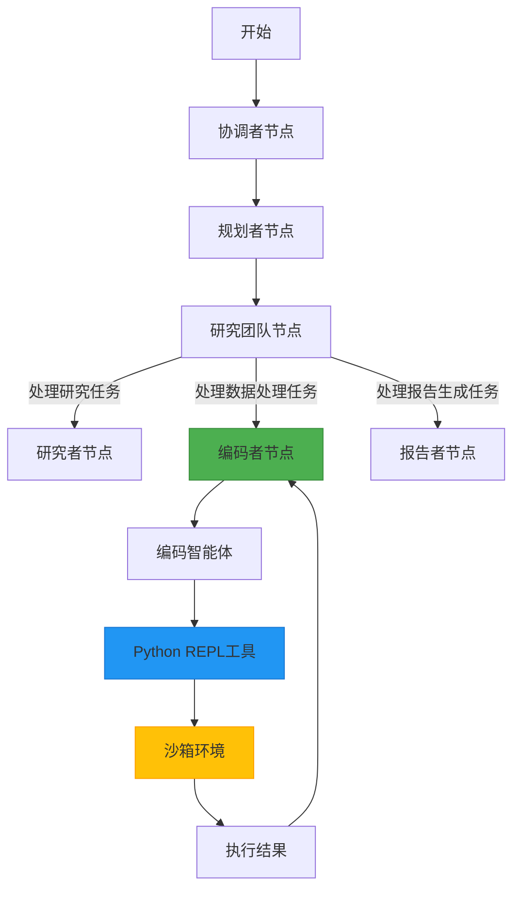
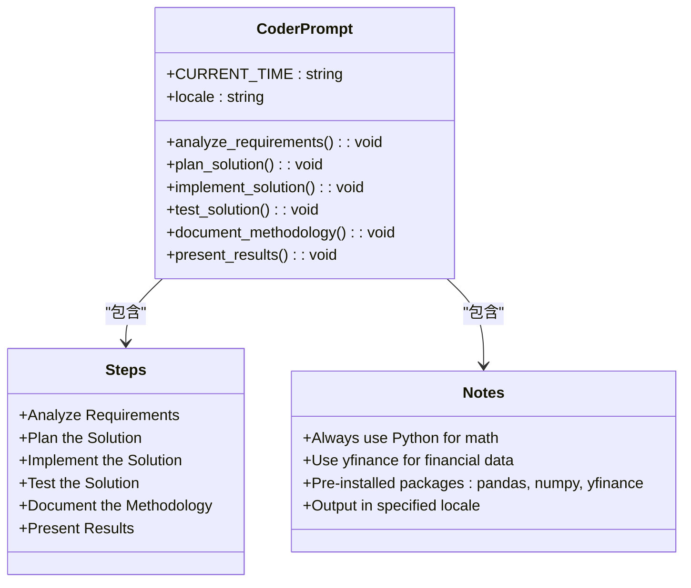
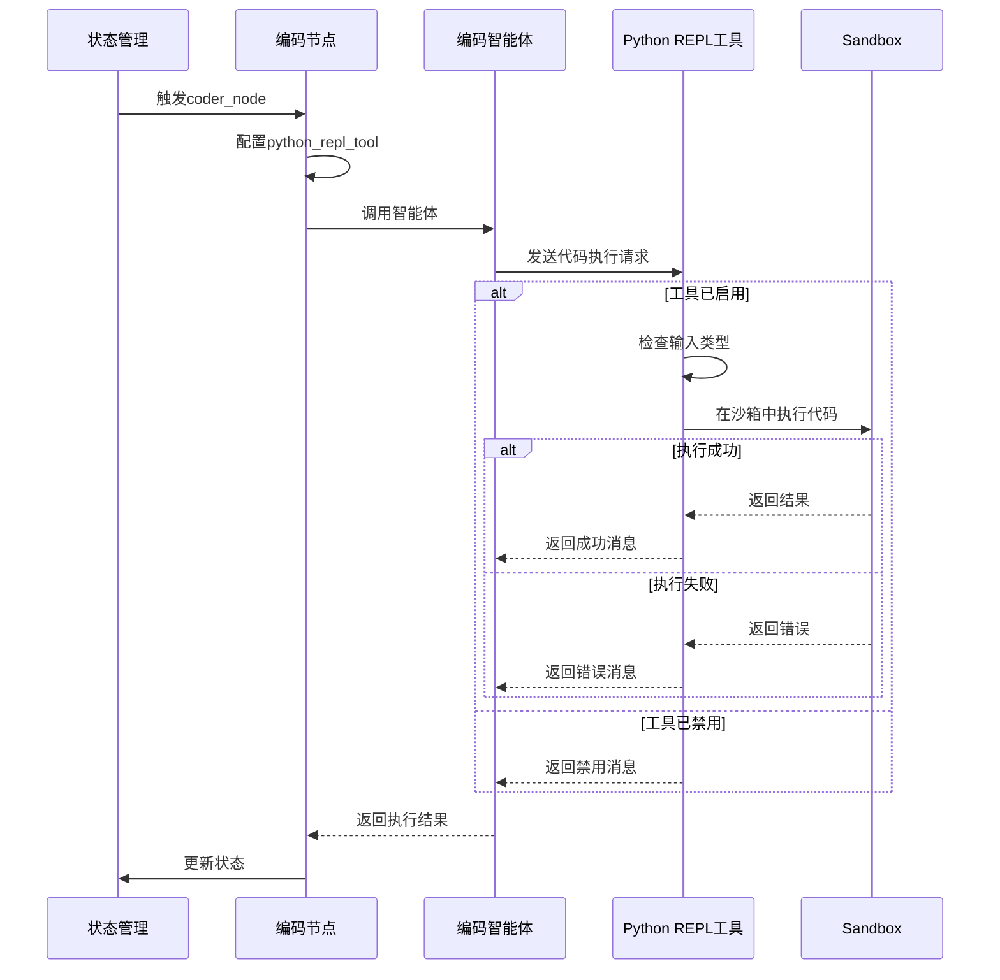
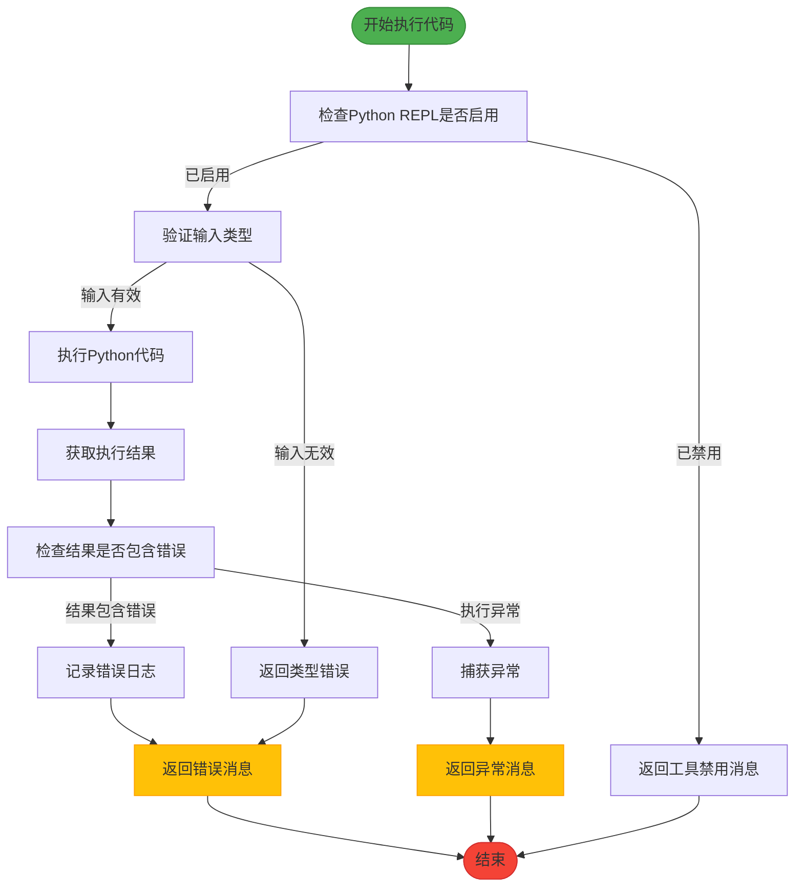

# 编码智能体

<cite>
**本文档引用的文件**  
- [coder.md](file://src/prompts/coder.md)
- [python_repl.py](file://src/tools/python_repl.py)
- [nodes.py](file://src/graph/nodes.py)
- [builder.py](file://src/graph/builder.py)
- [tools.py](file://src/config/tools.py)
- [configuration.py](file://src/config/configuration.py)
- [test_python_repl.py](file://tests/unit/tools/test_python_repl.py)
- [chat_request.py](file://src/server/chat_request.py)
</cite>

## 目录
1. [引言](#引言)
2. [项目结构](#项目结构)
3. [核心组件](#核心组件)
4. [架构概述](#架构概述)
5. [详细组件分析](#详细组件分析)
6. [依赖分析](#依赖分析)
7. [性能考虑](#性能考虑)
8. [故障排除指南](#故障排除指南)
9. [结论](#结论)

## 引言
编码智能体是Deer-Flow系统中的关键组件，专门负责理解编程任务并生成可运行的Python代码。该智能体基于`coder.md`提示词模板，结合`python_repl.py`工具，在安全的沙箱环境中执行代码，实现算法求解、数据处理和代码重构等功能。本文档将深入分析其工作原理、执行环境、错误处理策略以及与其他系统组件的集成方式。

## 项目结构
编码智能体的功能分布在多个模块中，主要集中在`src`目录下。核心功能由提示词模板、工具实现和工作流节点构成，形成了一个完整的代码生成与执行闭环。

```mermaid
graph TB
subgraph "核心模块"
prompts["src/prompts"]
tools["src/tools"]
graph["src/graph"]
end
subgraph "配置模块"
config["src/config"]
end
subgraph "测试模块"
tests["tests/unit/tools"]
end
prompts --> graph : "提供coder.md模板"
tools --> graph : "提供python_repl_tool"
config --> tools : "控制工具启用"
graph --> tests : "单元测试验证"
```

**图示来源**  
- [coder.md](file://src/prompts/coder.md)
- [python_repl.py](file://src/tools/python_repl.py)
- [nodes.py](file://src/graph/nodes.py)
- [tools.py](file://src/config/tools.py)

## 核心组件
编码智能体的核心组件包括提示词模板、代码执行工具和工作流节点。`coder.md`定义了智能体的行为准则和工作流程，`python_repl.py`提供了安全的代码执行环境，而`nodes.py`中的`coder_node`则负责将这些组件集成到整体工作流中。

**本节来源**  
- [coder.md](file://src/prompts/coder.md)
- [python_repl.py](file://src/tools/python_repl.py)
- [nodes.py](file://src/graph/nodes.py)

## 架构概述
编码智能体的架构基于状态机模式，通过LangGraph框架实现。当系统识别到需要代码处理的任务时，工作流会路由到`coder_node`，该节点调用编码智能体并提供`python_repl_tool`作为执行工具。



**图示来源**  
- [builder.py](file://src/graph/builder.py)
- [nodes.py](file://src/graph/nodes.py)
- [python_repl.py](file://src/tools/python_repl.py)

## 详细组件分析
### 编码智能体分析
编码智能体通过`coder_node`节点集成到工作流中，当任务类型为`PROCESSING`时被激活。该智能体使用`python_repl_tool`作为主要工具，能够在安全的环境中执行Python代码。

#### 提示词模板分析


**图示来源**  
- [coder.md](file://src/prompts/coder.md)

#### 代码执行流程分析


**图示来源**  
- [nodes.py](file://src/graph/nodes.py)
- [python_repl.py](file://src/tools/python_repl.py)

#### 错误处理流程分析


**图示来源**  
- [python_repl.py](file://src/tools/python_repl.py)
- [test_python_repl.py](file://tests/unit/tools/test_python_repl.py)

## 依赖分析
编码智能体依赖于多个系统组件和外部库，这些依赖关系确保了其功能的完整性和安全性。

```mermaid
graph LR
    CoderAgent[编码智能体] --> LangChain["langchain-core"]
    CoderAgent --> LangChainExperimental["langchain-experimental"]
    CoderAgent --> PythonREPL["Python REPL"]
    
    PythonREPL --> Sandbox["沙箱环境"]
    Sandbox --> RestrictedModules["限制的模块访问"]
    Sandbox --> Timeout["执行超时"]
    Sandbox --> MemoryLimit["内存限制"]
    
    CoderAgent --> PreinstalledPackages["预安装包"]
    PreinstalledPackages --> Pandas["pandas"]
    PreinstalledPackages --> Numpy["numpy"]
    PreinstalledPackages --> YFinance["yfinance"]
    
    CoderAgent --> Configuration["配置系统"]
    Configuration --> EnvVar["ENABLE_PYTHON_REPL环境变量"]
    Configuration --> RecursionLimit["AGENT_RECURSION_LIMIT"]
    
    style CoderAgent fill:#4CAF50,stroke:#388E3C
    style PythonREPL fill:#2196F3,stroke:#1976D2
    style Sandbox fill:#FFC107,stroke:#FFA000
    style PreinstalledPackages fill:#9C27B0,stroke:#7B1FA2
    style Configuration fill:#00968