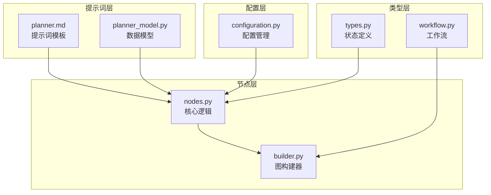
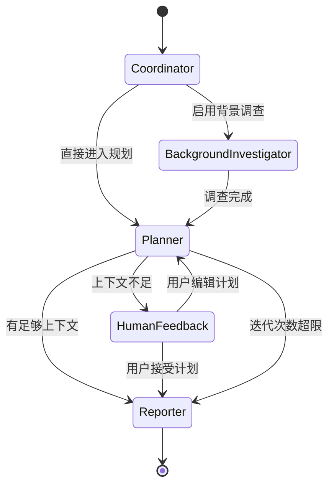
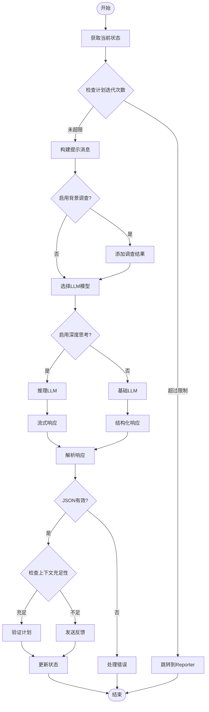
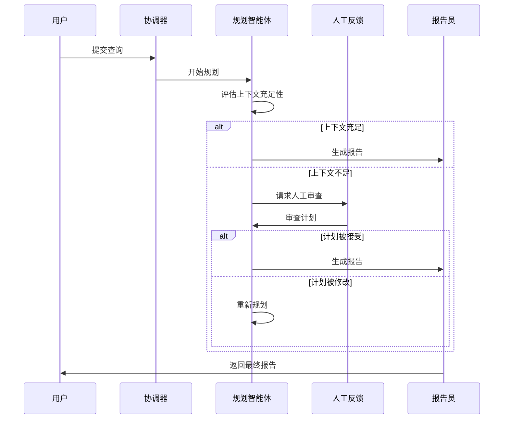
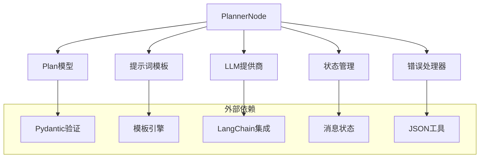

# 规划智能体

<cite>
**本文档引用的文件**
- [planner.md](file://src/prompts/planner.md)
- [planner_model.py](file://src/prompts/planner_model.py)
- [nodes.py](file://src/graph/nodes.py)
- [types.py](file://src/graph/types.py)
- [builder.py](file://src/graph/builder.py)
- [configuration.py](file://src/config/configuration.py)
- [workflow.py](file://src/workflow.py)
- [test_nodes.py](file://tests/integration/test_nodes.py)
- [what_is_llm.md](file://examples/what_is_llm.md)
- [openai_sora_report.md](file://examples/openai_sora_report.md)
</cite>

## 目录
1. [简介](#简介)
2. [项目结构](#项目结构)
3. [核心组件](#核心组件)
4. [架构概览](#架构概览)
5. [详细组件分析](#详细组件分析)
6. [依赖关系分析](#依赖关系分析)
7. [性能考虑](#性能考虑)
8. [故障排除指南](#故障排除指南)
9. [结论](#结论)

## 简介

规划智能体（Planner Agent）是Deer-Flow系统中的核心组件之一，负责将用户的查询分解为可执行的研究计划。该智能体基于精心设计的提示词模板（planner.md），能够生成结构化的计划（Plan），包括任务分解、优先级排序和资源预估。

规划智能体的主要功能包括：
- 将复杂查询分解为多个研究步骤
- 评估信息充足性并决定是否需要更多调查
- 创建包含具体数据收集目标的详细计划
- 支持人类反馈和迭代优化
- 动态调整计划以应对研究障碍

## 项目结构

规划智能体的实现分布在多个模块中，形成了清晰的分层架构：



**图表来源**
- [planner.md](file://src/prompts/planner.md#L1-L188)
- [planner_model.py](file://src/prompts/planner_model.py#L1-L59)
- [nodes.py](file://src/graph/nodes.py#L1-L512)
- [builder.py](file://src/graph/builder.py#L1-L88)

## 核心组件

### Plan数据模型

Plan是规划智能体的核心数据结构，定义了完整的计划格式：

```python
class Plan(BaseModel):
    locale: str  # 语言环境，如"en-US"或"zh-CN"
    has_enough_context: bool  # 是否有足够的上下文信息
    thought: str  # 智能体的思考过程
    title: str  # 计划标题
    steps: List[Step] = []  # 研究和处理步骤列表
```

每个Step包含以下字段：
- `need_search`: 布尔值，指示是否需要网络搜索
- `title`: 步骤标题
- `description`: 具体的数据收集描述
- `step_type`: 步骤类型（research或processing）
- `execution_res`: 执行结果（可选）

### 提示词模板

planner.md提供了详细的指导框架，包括：

1. **信息质量标准**：全面覆盖、充分深度、充足数量
2. **上下文评估**：严格的充足性判断标准
3. **步骤类型**：研究步骤和数据处理步骤的区别
4. **排除规则**：禁止直接计算的限制
5. **分析框架**：历史、现状、未来、利益相关者等维度
6. **执行规则**：重复用户需求、严格评估充足性、优先级排序等

**章节来源**
- [planner_model.py](file://src/prompts/planner_model.py#L1-L59)
- [planner.md](file://src/prompts/planner.md#L1-L188)

## 架构概览

规划智能体采用LangGraph框架构建的状态机架构：



**图表来源**
- [builder.py](file://src/graph/builder.py#L35-L50)
- [nodes.py](file://src/graph/nodes.py#L84-L200)

## 详细组件分析

### PlannerNode核心逻辑

PlannerNode是规划智能体的核心执行单元，负责生成完整计划：



**图表来源**
- [nodes.py](file://src/graph/nodes.py#L84-L156)

### 输入输出数据结构

#### 输入状态结构

```python
class State(MessagesState):
    locale: str = "en-US"
    research_topic: str = ""
    observations: list[str] = []
    resources: list[Resource] = []
    plan_iterations: int = 0
    current_plan: Plan | str = None
    final_report: str = ""
    auto_accepted_plan: bool = False
    enable_background_investigation: bool = True
    background_investigation_results: str = None
```

#### 输出命令结构

```python
Command[Literal["human_feedback", "reporter"]]
```

返回的Command对象包含：
- `goto`: 下一步执行的目标节点
- `update`: 需要更新的状态字段

### 计划生成过程

规划智能体遵循严格的生成流程：

1. **上下文评估**：使用严格标准判断现有信息是否足以回答问题
2. **任务分解**：基于分析框架将主题分解为子主题
3. **步骤创建**：最多创建max_step_num个聚焦且全面的步骤
4. **优先级排序**：根据研究问题的重要性优先收集关键信息
5. **资源预估**：评估每个步骤所需的资源和时间

### 与工作流状态的交互

规划智能体通过State对象与整个工作流进行交互：



**图表来源**
- [nodes.py](file://src/graph/nodes.py#L84-L200)
- [types.py](file://src/graph/types.py#L1-L25)

**章节来源**
- [nodes.py](file://src/graph/nodes.py#L84-L200)
- [types.py](file://src/graph/types.py#L1-L25)

### 错误处理和恢复机制

规划智能体实现了多层次的错误处理机制：

1. **JSON解析错误**：当响应无法解析为有效JSON时
   - 第一次迭代失败：终止工作流
   - 后续迭代失败：跳转到Reporter节点

2. **计划迭代限制**：防止无限循环
   - 默认最大迭代次数：1次
   - 可通过配置调整

3. **LLM响应异常**：处理模型响应问题
   - 流式响应模式
   - 结构化输出模式

### 实际代码示例

以下是规划智能体处理复杂查询的实际示例：

```python
# 示例：处理关于大型语言模型的查询
user_query = "请提供关于大型语言模型的全面研究报告"

# 规划智能体生成的计划示例
plan = {
    "has_enough_context": False,
    "thought": "为了提供关于大型语言模型的全面报告，需要收集架构、训练方法、应用领域、性能基准、局限性和伦理考虑等方面的信息。",
    "title": "大型语言模型综合研究报告",
    "steps": [
        {
            "need_search": True,
            "title": "LLM架构和定义研究",
            "description": "收集关于LLM定义、架构组件（编码器、解码器、注意力机制）、参数规模等技术细节。",
            "step_type": "research"
        },
        {
            "need_search": True,
            "title": "训练数据和方法研究",
            "description": "收集训练数据集（如Common Crawl、The Pile）、训练方法（预训练、微调）和算法细节。",
            "step_type": "research"
        },
        {
            "need_search": True,
            "title": "应用领域和性能研究",
            "description": "收集LLM在文本生成、机器翻译、问答系统等领域的应用案例和性能指标。",
            "step_type": "research"
        },
        {
            "need_search": True,
            "title": "局限性和伦理研究",
            "description": "收集LLM的局限性、偏见问题、伦理挑战和缓解策略的相关信息。",
            "step_type": "research"
        }
    ]
}
```

### 动态调整和迭代优化

规划智能体支持动态调整计划的能力：

1. **人类反馈集成**：允许用户审查和修改生成的计划
2. **迭代优化**：基于反馈不断改进计划质量
3. **上下文增强**：通过背景调查增加信息丰富度
4. **自适应调整**：根据研究进展动态调整后续步骤

**章节来源**
- [nodes.py](file://src/graph/nodes.py#L202-L279)
- [test_nodes.py](file://tests/integration/test_nodes.py#L200-L399)

## 依赖关系分析

规划智能体的依赖关系展现了清晰的模块化设计：



**图表来源**
- [nodes.py](file://src/graph/nodes.py#L1-L50)
- [planner_model.py](file://src/prompts/planner_model.py#L1-L20)

### 关键依赖说明

1. **Pydantic模型验证**：确保Plan数据结构的完整性
2. **LangChain集成**：提供LLM接口和工具调用功能
3. **模板系统**：支持动态提示词生成
4. **状态管理**：维护工作流状态的一致性
5. **错误处理**：提供健壮的异常处理机制

**章节来源**
- [nodes.py](file://src/graph/nodes.py#L1-L50)
- [planner_model.py](file://src/prompts/planner_model.py#L1-L59)

## 性能考虑

规划智能体在设计时考虑了多个性能优化方面：

### 并发处理
- 支持流式响应以提高响应速度
- 异步处理减少阻塞等待
- 内存优化避免大对象占用过多资源

### 资源管理
- 限制最大计划步骤数（默认3步）
- 控制最大计划迭代次数（默认1次）
- 优化LLM调用频率和成本

### 缓存策略
- 提示词模板缓存
- LLM响应结果缓存
- 状态变更记录优化

## 故障排除指南

### 常见问题及解决方案

1. **JSON解析失败**
   - 检查LLM输出格式
   - 验证修复JSON函数
   - 查看日志获取详细错误信息

2. **计划迭代超限**
   - 增加max_plan_iterations配置
   - 检查计划生成逻辑
   - 优化提示词模板

3. **LLM响应异常**
   - 切换到备用LLM模型
   - 调整模型参数
   - 检查API连接状态

4. **上下文评估不准确**
   - 调整充足性判断标准
   - 增加背景调查深度
   - 优化提示词模板

**章节来源**
- [nodes.py](file://src/graph/nodes.py#L121-L156)
- [test_nodes.py](file://tests/integration/test_nodes.py#L335-L399)

## 结论

规划智能体是Deer-Flow系统中的关键组件，通过精心设计的提示词模板和强大的LLM能力，能够有效地将复杂的用户查询分解为可执行的研究计划。其主要优势包括：

1. **结构化规划**：基于明确的分析框架生成全面的研究计划
2. **上下文评估**：严格的充足性判断确保研究质量
3. **人机协作**：支持人工审查和迭代优化
4. **错误恢复**：多层次的错误处理保证系统稳定性
5. **扩展性强**：模块化设计便于功能扩展和定制

规划智能体的设计体现了现代AI系统的最佳实践，通过清晰的职责分离、完善的错误处理和灵活的配置选项，为用户提供高质量的研究服务。随着AI技术的不断发展，规划智能体将继续演进，为更复杂的查询提供更精确的规划能力。