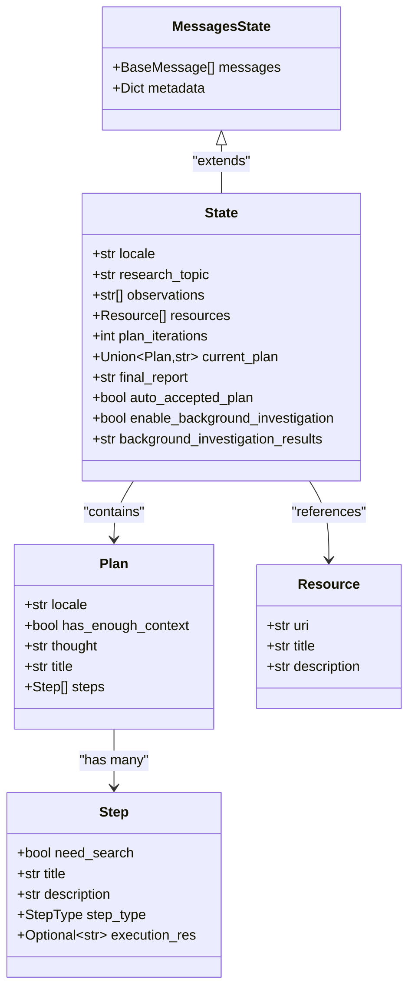
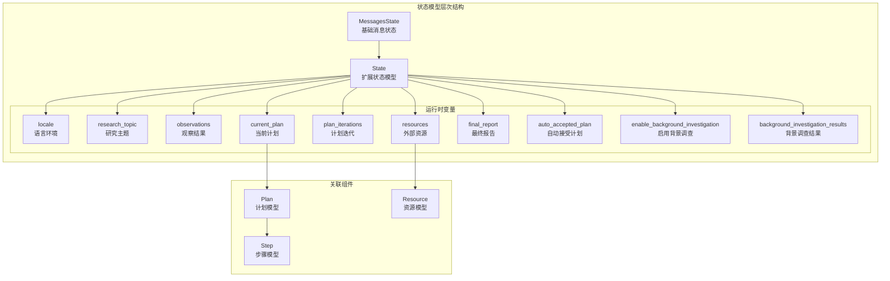
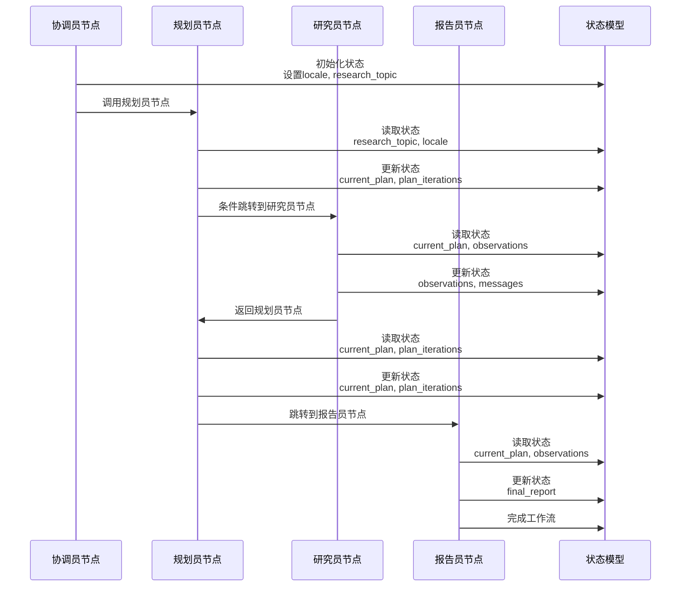
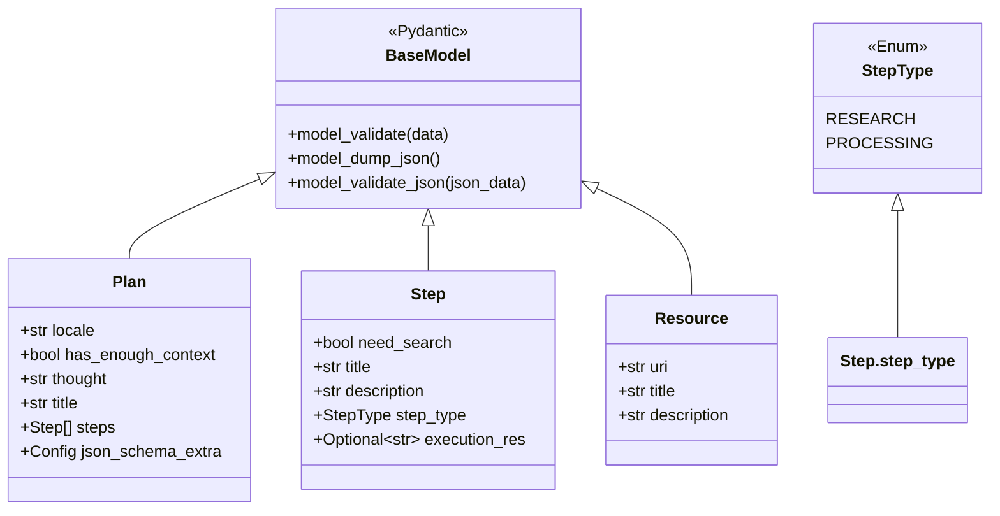
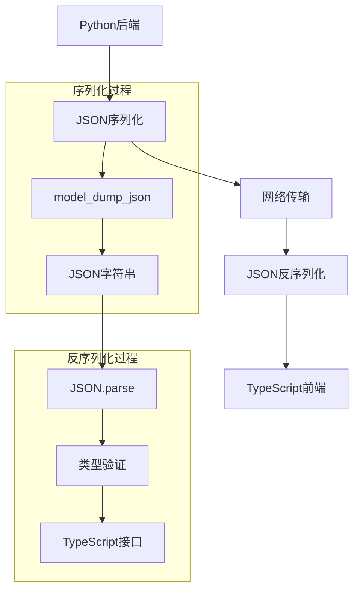
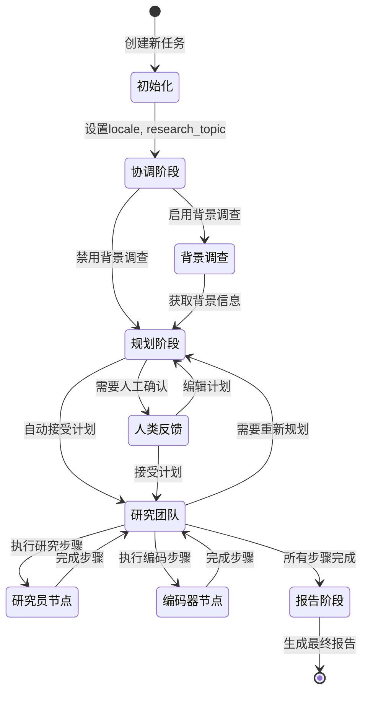
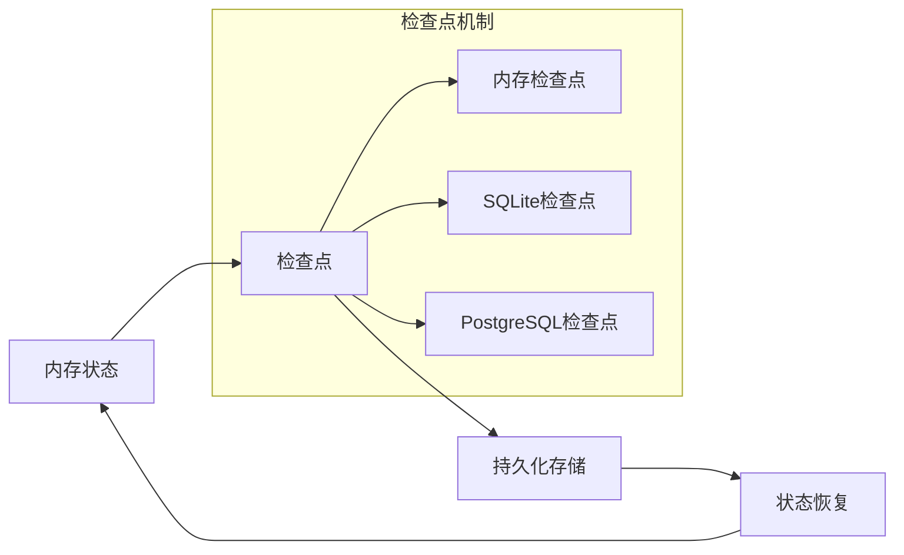

# 状态模型

<cite>
**本文档引用的文件**
- [types.py](file://src/graph/types.py)
- [chat_request.py](file://src/server/chat_request.py)
- [planner_model.py](file://src/prompts/planner_model.py)
- [retriever.py](file://src/rag/retriever.py)
- [nodes.py](file://src/graph/nodes.py)
- [builder.py](file://src/graph/builder.py)
- [test_state.py](file://tests/test_state.py)
- [types.ts](file://web/src/core/api/types.ts)
</cite>

## 目录
1. [简介](#简介)
2. [核心状态结构](#核心状态结构)
3. [状态字段详解](#状态字段详解)
4. [状态模型架构](#状态模型架构)
5. [状态传递机制](#状态传递机制)
6. [Pydantic模型验证](#pydantic模型验证)
7. [前后端类型同步](#前后端类型同步)
8. [状态生命周期](#状态生命周期)
9. [设计权衡与扩展性](#设计权衡与扩展性)
10. [故障排除指南](#故障排除指南)
11. [总结](#总结)

## 简介

deer-flow的状态管理模型是一个精心设计的数据结构系统，用于在多智能体协作环境中跟踪和传递研究任务的状态信息。该模型基于Pydantic框架构建，确保了数据完整性和类型安全，同时通过LangGraph集成实现了复杂的工作流管理。

状态模型的核心设计理念是提供一个统一的、可扩展的数据容器，能够容纳研究任务的所有相关信息，从初始的研究主题到最终的报告输出。这种设计使得系统能够在多个智能体节点之间无缝传递状态信息，支持复杂的决策流程和条件分支。

## 核心状态结构

deer-flow的状态模型建立在LangGraph的`MessagesState`之上，通过继承扩展了基本的消息状态功能，添加了专门针对研究任务的运行时变量。



**图表来源**
- [types.py](file://src/graph/types.py#L1-L25)
- [planner_model.py](file://src/prompts/planner_model.py#L1-L59)
- [retriever.py](file://src/rag/retriever.py#L1-L82)

**章节来源**
- [types.py](file://src/graph/types.py#L1-L25)
- [planner_model.py](file://src/prompts/planner_model.py#L1-L59)

## 状态字段详解

### 基础消息字段

状态模型继承自`MessagesState`，包含以下基础字段：

- **messages**: 存储对话历史记录，包含用户和助手之间的所有消息交互
- **metadata**: 可选的元数据字典，用于存储额外的上下文信息

### 运行时变量字段

#### locale
- **类型**: `str`
- **默认值**: `"en-US"`
- **用途**: 指定用户语言环境，影响提示模板的语言选择和内容本地化
- **示例**: `"zh-CN"`, `"en-US"`, `"fr-FR"`

#### research_topic
- **类型**: `str`
- **默认值**: `""`
- **用途**: 存储当前研究任务的主题或查询
- **重要性**: 作为整个工作流的输入参数，贯穿所有处理阶段

#### observations
- **类型**: `List[str]`
- **默认值**: `[]`
- **用途**: 收集研究过程中产生的观察结果和发现
- **特点**: 动态增长列表，每个元素代表一个独立的观察

#### resources
- **类型**: `List[Resource]`
- **默认值**: `[]`
- **用途**: 引用外部资源，如文档、数据库或其他知识源
- **结构**: 每个资源包含URI、标题和描述信息

#### plan_iterations
- **类型**: `int`
- **默认值**: `0`
- **用途**: 跟踪计划迭代次数，防止无限循环
- **限制**: 受配置参数`max_plan_iterations`控制

#### current_plan
- **类型**: `Union[Plan, str]`
- **默认值**: `None`
- **用途**: 当前正在执行的计划对象或JSON字符串
- **灵活性**: 支持两种格式以适应不同的处理阶段

#### final_report
- **类型**: `str`
- **默认值**: `""`
- **用途**: 存储最终的研究报告内容
- **生成**: 由reporter节点负责填充

#### auto_accepted_plan
- **类型**: `bool`
- **默认值**: `False`
- **用途**: 控制是否自动接受计划而无需人工确认
- **影响**: 影响工作流的决策路径

#### enable_background_investigation
- **类型**: `bool`
- **默认值**: `True`
- **用途**: 启用或禁用背景调查功能
- **性能**: 在不需要时可关闭以提高效率

#### background_investigation_results
- **类型**: `str`
- **默认值**: `None`
- **用途**: 存储背景调查的结果文本
- **格式**: 结构化的搜索结果摘要

**章节来源**
- [types.py](file://src/graph/types.py#L1-L25)
- [test_state.py](file://tests/test_state.py#L47-L88)

## 状态模型架构

状态模型采用分层架构设计，确保了清晰的职责分离和良好的可维护性。



**图表来源**
- [types.py](file://src/graph/types.py#L1-L25)
- [planner_model.py](file://src/prompts/planner_model.py#L1-L59)
- [retriever.py](file://src/rag/retriever.py#L1-L82)

### 架构设计原则

1. **继承复用**: 基于LangGraph的标准状态模型，避免重复实现
2. **模块化**: 每个字段都有明确的职责和用途
3. **类型安全**: 使用Python类型注解确保编译时检查
4. **可扩展性**: 设计允许未来添加新的状态字段
5. **向后兼容**: 新版本不会破坏现有功能

**章节来源**
- [types.py](file://src/graph/types.py#L1-L25)
- [builder.py](file://src/graph/builder.py#L1-L88)

## 状态传递机制

状态在智能体节点间的传递是deer-flow工作流的核心机制。每个节点都可以读取和修改状态，但必须遵循特定的模式以确保一致性。



**图表来源**
- [nodes.py](file://src/graph/nodes.py#L1-L512)
- [builder.py](file://src/graph/builder.py#L1-L88)

### 状态更新模式

1. **只读访问**: 节点可以读取状态但不修改
2. **增量更新**: 只更新需要改变的字段
3. **条件更新**: 根据业务逻辑决定是否更新
4. **批量更新**: 一次性更新多个相关字段

### 状态传递最佳实践

- **最小化更新**: 只更新必要的字段，减少内存占用
- **原子性操作**: 确保状态更新的原子性，避免部分更新
- **状态验证**: 在更新后验证状态的一致性
- **错误处理**: 实现完善的错误恢复机制

**章节来源**
- [nodes.py](file://src/graph/nodes.py#L1-L512)
- [builder.py](file://src/graph/builder.py#L1-L88)

## Pydantic模型验证

deer-flow使用Pydantic模型确保状态数据的完整性和有效性。这不仅提供了运行时验证，还生成了类型安全的接口。



**图表来源**
- [planner_model.py](file://src/prompts/planner_model.py#L1-L59)
- [retriever.py](file://src/rag/retriever.py#L1-L82)

### 验证特性

#### 类型验证
- **静态类型检查**: Python类型注解提供编译时检查
- **运行时验证**: Pydantic在运行时验证数据类型
- **嵌套验证**: 支持复杂对象的递归验证

#### 数据转换
- **自动类型转换**: 支持字符串到数值类型的自动转换
- **JSON序列化**: 自动处理JSON格式的数据
- **默认值处理**: 自动应用默认值

#### 错误处理
- **详细错误信息**: 提供详细的验证错误描述
- **错误聚合**: 收集所有验证错误而不是立即抛出
- **自定义验证**: 支持自定义验证逻辑

### 验证示例

```python
# 计划验证示例
try:
    validated_plan = Plan.model_validate(raw_plan_data)
except ValidationError as e:
    logger.error(f"计划验证失败: {e}")
    # 处理验证错误
```

**章节来源**
- [planner_model.py](file://src/prompts/planner_model.py#L1-L59)
- [test_state.py](file://tests/test_state.py#L47-L88)

## 前后端类型同步

deer-flow实现了前后端类型定义的同步机制，确保JavaScript客户端和Python后端之间的数据交换一致性。

### 后端类型定义

后端使用Pydantic模型定义状态结构：

```python
class State(BaseModel):
    locale: str = "en-US"
    research_topic: str = ""
    observations: List[str] = []
    resources: List[Resource] = []
    # ... 其他字段
```

### 前端类型映射

前端使用TypeScript类型定义对应的状态结构：

```typescript
interface State {
    locale: string;
    research_topic: string;
    observations: string[];
    resources: Resource[];
    // ... 对应的字段
}
```

### 序列化机制



**图表来源**
- [chat_request.py](file://src/server/chat_request.py#L1-L116)
- [types.ts](file://web/src/core/api/types.ts#L1-L85)

### 同步策略

1. **手动映射**: 手动定义前后端的类型对应关系
2. **代码生成**: 使用工具自动生成TypeScript类型
3. **文档驱动**: 基于API文档同步类型定义
4. **测试验证**: 通过端到端测试验证类型一致性

**章节来源**
- [chat_request.py](file://src/server/chat_request.py#L1-L116)
- [types.ts](file://web/src/core/api/types.ts#L1-L85)

## 状态生命周期

状态模型在整个研究工作流中的生命周期展示了其动态变化和演进过程。



### 生命周期阶段

#### 初始化阶段
- 设置基本的locale和research_topic
- 初始化空的observations列表
- 准备空的resources数组

#### 协调阶段
- 分析用户意图和需求
- 确定研究方向和范围
- 决定是否启用背景调查

#### 规划阶段
- 生成初步的研究计划
- 分解为具体的研究步骤
- 设置计划迭代计数器

#### 执行阶段
- 按顺序执行研究步骤
- 收集观察结果和证据
- 更新执行状态

#### 总结阶段
- 整合所有观察结果
- 生成最终研究报告
- 清理临时状态数据

### 状态持久化



**图表来源**
- [builder.py](file://src/graph/builder.py#L1-L88)

**章节来源**
- [nodes.py](file://src/graph/nodes.py#L1-L512)
- [builder.py](file://src/graph/builder.py#L1-L88)

## 设计权衡与扩展性

deer-flow的状态模型在设计时考虑了多个权衡因素，以平衡功能性、性能和可维护性。

### 设计权衡

#### 灵活性 vs. 简单性
- **灵活性**: 支持多种数据类型和可变结构
- **简单性**: 保持核心字段的简洁性
- **折衷**: 使用Union类型支持多种格式

#### 性能 vs. 功能性
- **性能**: 最小化状态大小和序列化开销
- **功能性**: 提供丰富的状态信息
- **折衷**: 使用惰性加载和延迟计算

#### 类型安全 vs. 开发效率
- **类型安全**: 使用Pydantic确保数据完整性
- **开发效率**: 提供灵活的类型定义
- **折衷**: 平衡严格验证和开发便利性

### 扩展性考虑

#### 字段扩展
```python
# 添加新字段的示例
class ExtendedState(State):
    new_field: Optional[str] = None
    timestamp: datetime = Field(default_factory=datetime.utcnow)
```

#### 类型扩展
```python
# 支持新的资源类型
class ExtendedResource(Resource):
    metadata: Dict[str, Any] = {}
```

#### 验证规则扩展
```python
# 添加自定义验证规则
class ValidatedState(State):
    @validator('research_topic')
    def validate_research_topic(cls, v):
        if len(v) < 5:
            raise ValueError('研究主题太短')
        return v
```

### 版本兼容性

#### 向后兼容
- 保持核心字段不变
- 为新字段提供合理的默认值
- 维护JSON序列化格式

#### 迁移策略
- 渐进式迁移：逐步引入新字段
- 数据转换：自动转换旧格式数据
- 回滚机制：支持降级到旧版本

**章节来源**
- [types.py](file://src/graph/types.py#L1-L25)
- [test_state.py](file://tests/test_state.py#L47-L134)

## 故障排除指南

### 常见问题及解决方案

#### 状态初始化失败
**症状**: 状态对象创建时出现异常
**原因**: 缺少必需的字段或类型不匹配
**解决方案**: 
```python
# 正确的状态初始化
state = State(messages=[], locale="en-US")
```

#### 计划验证错误
**症状**: Plan模型验证失败
**原因**: JSON格式不正确或字段缺失
**解决方案**:
```python
try:
    plan = Plan.model_validate(json_data)
except ValidationError as e:
    logger.error(f"计划验证错误: {e}")
    # 尝试修复JSON格式
    fixed_data = repair_json_output(raw_data)
    plan = Plan.model_validate(fixed_data)
```

#### 状态序列化问题
**症状**: 状态无法正确序列化为JSON
**原因**: 包含不可序列化的对象
**解决方案**:
```python
# 使用model_dump_json进行序列化
state_json = state.model_dump_json(exclude_none=True)
```

#### 内存泄漏
**症状**: 状态对象占用过多内存
**原因**: 观察结果积累过多
**解决方案**:
```python
# 定期清理观察结果
if len(state.observations) > MAX_OBSERVATIONS:
    state.observations = state.observations[-MAX_OBSERVATIONS:]
```

### 调试技巧

#### 状态监控
```python
def log_state_status(state: State):
    logger.info(f"状态统计 - 消息数量: {len(state.messages)}")
    logger.info(f"观察结果数量: {len(state.observations)}")
    logger.info(f"计划迭代次数: {state.plan_iterations}")
```

#### 性能分析
```python
import time
from functools import wraps

def monitor_state_performance(func):
    @wraps(func)
    def wrapper(state: State, *args, **kwargs):
        start_time = time.time()
        result = func(state, *args, **kwargs)
        end_time = time.time()
        logger.info(f"函数 {func.__name__} 执行时间: {end_time - start_time:.4f}s")
        return result
    return wrapper
```

**章节来源**
- [test_state.py](file://tests/test_state.py#L47-L134)
- [nodes.py](file://src/graph/nodes.py#L1-L512)

## 总结

deer-flow的状态管理模型是一个精心设计的系统，它成功地平衡了功能性、性能和可维护性的需求。通过基于Pydantic的类型安全设计、LangGraph的集成以及清晰的架构分层，该模型为多智能体协作环境提供了强大而灵活的状态管理能力。

### 主要优势

1. **类型安全**: Pydantic模型确保数据完整性和类型正确性
2. **可扩展性**: 模块化设计支持未来的功能扩展
3. **性能优化**: 最小化状态大小和高效的序列化机制
4. **易于调试**: 清晰的状态结构和完善的错误处理
5. **前后端同步**: 确保JavaScript和Python之间的类型一致性

### 未来发展方向

1. **增强验证**: 添加更多业务逻辑验证规则
2. **性能优化**: 实现状态压缩和懒加载机制
3. **监控改进**: 添加更详细的状态监控和分析功能
4. **扩展支持**: 支持更多的状态扩展和插件机制
5. **版本管理**: 实现更完善的版本控制和迁移机制

这个状态模型为deer-flow项目奠定了坚实的基础，使其能够处理复杂的多智能体协作场景，同时保持系统的可维护性和可扩展性。随着项目的不断发展，这个模型也将继续演进以满足新的需求和挑战。