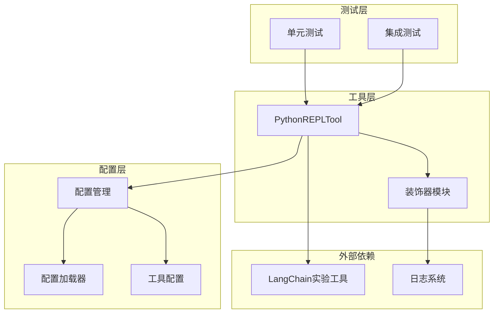
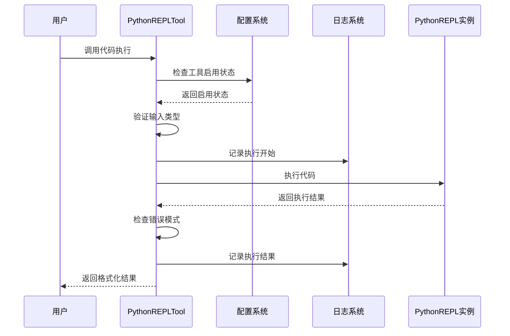
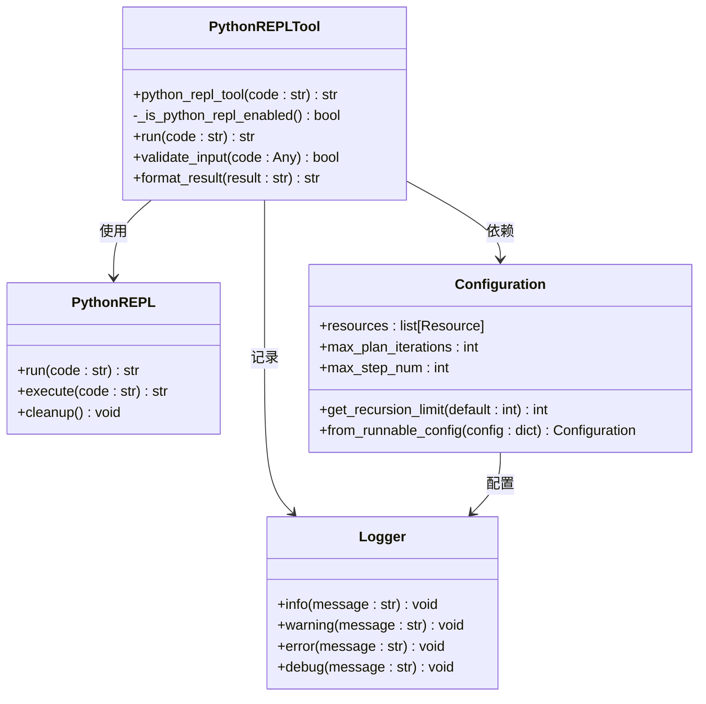
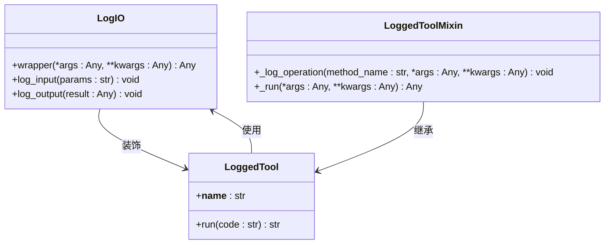
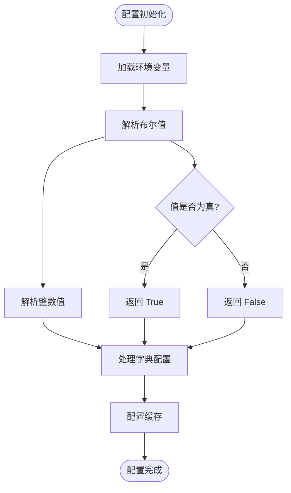
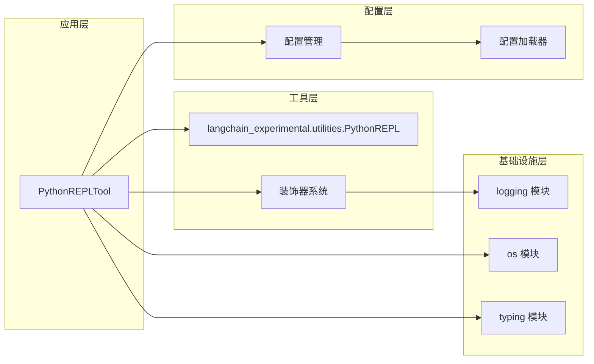

# DeerFlow Python 执行环境详细文档

<cite>
**本文档引用的文件**
- [python_repl.py](file://src/tools/python_repl.py)
- [decorators.py](file://src/tools/decorators.py)
- [test_python_repl.py](file://tests/unit/tools/test_python_repl.py)
- [configuration.py](file://src/config/configuration.py)
- [loader.py](file://src/config/loader.py)
- [tools.py](file://src/config/tools.py)
</cite>

## 目录
1. [简介](#简介)
2. [项目结构](#项目结构)
3. [核心组件](#核心组件)
4. [架构概览](#架构概览)
5. [详细组件分析](#详细组件分析)
6. [依赖关系分析](#依赖关系分析)
7. [性能考虑](#性能考虑)
8. [故障排除指南](#故障排除指南)
9. [结论](#结论)

## 简介

DeerFlow Python 执行环境是一个安全的代码执行系统，专门设计用于在受控环境中执行 Python 代码。该系统通过 PythonREPLTool 提供安全的代码执行能力，支持数据分析、计算和研究任务。系统采用多层安全策略，包括沙箱隔离、输入验证、输出截断和错误处理机制。

该执行环境的核心目标是在确保安全性的同时，为用户提供强大的 Python 编程能力，特别适用于研究和编码场景。通过环境变量配置、日志记录和详细的错误处理，系统能够有效管理代码执行过程中的各种风险。

## 项目结构

DeerFlow Python 执行环境的项目结构围绕安全代码执行这一核心功能组织：



**图表来源**
- [python_repl.py](file://src/tools/python_repl.py#L1-L64)
- [decorators.py](file://src/tools/decorators.py#L1-L82)

**章节来源**
- [python_repl.py](file://src/tools/python_repl.py#L1-L64)
- [decorators.py](file://src/tools/decorators.py#L1-L82)

## 核心组件

### PythonREPLTool 主要功能

PythonREPLTool 是系统的核心组件，负责安全地执行 Python 代码。它提供了以下关键功能：

1. **环境变量控制**：通过 `ENABLE_PYTHON_REPL` 环境变量控制工具启用状态
2. **输入验证**：确保传入的代码必须是字符串类型
3. **错误处理**：捕获并处理代码执行过程中的各种异常
4. **结果格式化**：提供标准化的执行结果输出格式

### 安全策略实现

系统实现了多层次的安全策略：

- **沙箱隔离**：基于 LangChain 实验工具提供的 PythonREPL 功能
- **输入验证**：严格的类型检查和参数验证
- **输出过滤**：对执行结果进行格式化和安全检查
- **异常监控**：全面的异常捕获和日志记录

**章节来源**
- [python_repl.py](file://src/tools/python_repl.py#L15-L64)
- [decorators.py](file://src/tools/decorators.py#L15-L35)

## 架构概览

Python 执行环境采用分层架构设计，确保安全性和可维护性：



**图表来源**
- [python_repl.py](file://src/tools/python_repl.py#L30-L62)
- [decorators.py](file://src/tools/decorators.py#L15-L35)

## 详细组件分析

### PythonREPLTool 实现分析



**图表来源**
- [python_repl.py](file://src/tools/python_repl.py#L15-L64)
- [configuration.py](file://src/config/configuration.py#L35-L71)

#### 启用状态检查机制

系统通过 `_is_python_repl_enabled()` 函数检查工具启用状态：

```python
def _is_python_repl_enabled() -> bool:
    """Check if Python REPL tool is enabled from configuration."""
    # Check environment variable first
    env_enabled = os.getenv("ENABLE_PYTHON_REPL", "false").lower()
    if env_enabled in ("true", "1", "yes", "on"):
        return True
    return False
```

该函数支持多种环境变量值来表示启用状态：
- `"true"`, `"1"`, `"yes"`, `"on"` - 表示启用
- 默认值 `"false"` - 表示禁用

#### 输入验证和错误处理

PythonREPLTool 实现了严格的输入验证和错误处理机制：

```python
if not isinstance(code, str):
    error_msg = f"Invalid input: code must be a string, got {type(code)}"
    logger.error(error_msg)
    return f"Error executing code:\n```python\n{code}\n```\nError: {error_msg}"
```

系统会检查：
1. 输入类型是否为字符串
2. 代码执行过程中是否产生错误消息
3. 是否发生未捕获的异常

#### 结果格式化

成功执行的结果会被格式化为标准输出：

```python
result_str = f"Successfully executed:\n```python\n{code}\n```\nStdout: {result}"
return result_str
```

**章节来源**
- [python_repl.py](file://src/tools/python_repl.py#L15-L64)

### 装饰器系统分析



**图表来源**
- [decorators.py](file://src/tools/decorators.py#L15-L82)

装饰器系统提供了完整的输入输出日志记录功能：

1. **函数级日志**：记录工具调用的输入参数和返回结果
2. **方法级日志**：为工具类提供操作日志记录
3. **混合继承**：支持工具类的扩展和定制

**章节来源**
- [decorators.py](file://src/tools/decorators.py#L15-L82)

### 配置管理系统

配置系统提供了灵活的环境变量处理和配置管理：



**图表来源**
- [loader.py](file://src/config/loader.py#L10-L79)
- [configuration.py](file://src/config/configuration.py#L35-L71)

**章节来源**
- [loader.py](file://src/config/loader.py#L10-L79)
- [configuration.py](file://src/config/configuration.py#L35-L71)

## 依赖关系分析

Python 执行环境的依赖关系展现了清晰的分层架构：



**图表来源**
- [python_repl.py](file://src/tools/python_repl.py#L1-L12)
- [decorators.py](file://src/tools/decorators.py#L1-L12)

**章节来源**
- [python_repl.py](file://src/tools/python_repl.py#L1-L12)
- [decorators.py](file://src/tools/decorators.py#L1-L12)

## 性能考虑

### 内存管理

PythonREPLTool 采用了懒加载策略，只有在工具启用时才会初始化 PythonREPL 实例：

```python
repl: Optional[PythonREPL] = PythonREPL() if _is_python_repl_enabled() else None
```

这种设计避免了不必要的内存占用，同时保持了系统的响应性。

### 错误处理性能

系统实现了高效的错误处理机制，避免了不必要的异常传播：

1. **早期验证**：在执行前进行输入验证
2. **快速失败**：遇到无效输入立即返回错误
3. **异常隔离**：捕获所有异常并转换为用户友好的错误消息

### 日志记录优化

装饰器系统提供了选择性的日志记录功能，可以根据需要启用或禁用详细日志：

- **INFO 级别**：记录正常执行流程
- **WARNING 级别**：记录配置问题和工具禁用
- **ERROR 级别**：记录执行错误和异常

## 故障排除指南

### 常见问题和解决方案

#### 工具未启用

**问题症状**：返回 "Tool disabled: Python REPL tool is disabled" 消息

**解决方案**：
1. 设置环境变量 `ENABLE_PYTHON_REPL=true`
2. 重启应用程序使配置生效
3. 验证环境变量设置正确

#### 输入类型错误

**问题症状**：返回 "Invalid input: code must be a string" 错误

**解决方案**：
1. 确保传入的代码是字符串类型
2. 检查数据序列化过程
3. 验证 API 调用参数

#### 代码执行错误

**问题症状**：返回包含错误信息的执行结果

**解决方案**：
1. 检查代码语法和逻辑
2. 验证所需的 Python 库是否可用
3. 查看日志文件获取详细错误信息

#### 异常处理

系统会捕获所有异常并返回友好的错误消息：

```python
except BaseException as e:
    error_msg = repr(e)
    logger.error(error_msg)
    return f"Error executing code:\n```python\n{code}\n```\nError: {error_msg}"
```

**章节来源**
- [python_repl.py](file://src/tools/python_repl.py#L43-L62)
- [test_python_repl.py](file://tests/unit/tools/test_python_repl.py#L42-L119)

## 结论

DeerFlow Python 执行环境提供了一个安全、可靠且易于使用的代码执行平台。通过多层安全策略、完善的错误处理机制和详细的日志记录，系统能够在保证安全性的同时，为用户提供强大的 Python 编程能力。

### 主要优势

1. **安全性**：多层安全策略确保代码执行的安全性
2. **易用性**：简单的环境变量配置即可启用工具
3. **可靠性**：全面的错误处理和异常捕获机制
4. **可观测性**：详细的日志记录和监控功能
5. **灵活性**：支持多种配置选项和扩展机制

### 最佳实践建议

1. **安全增强**：定期审查和更新安全配置
2. **性能优化**：监控资源使用情况，优化配置参数
3. **错误处理**：建立完善的错误处理和恢复机制
4. **日志管理**：合理配置日志级别，平衡性能和可观测性
5. **测试覆盖**：确保充分的单元测试和集成测试覆盖

该 Python 执行环境为 DeerFlow 平台提供了重要的编程能力，支持复杂的数据分析和计算任务，是整个系统的重要组成部分。