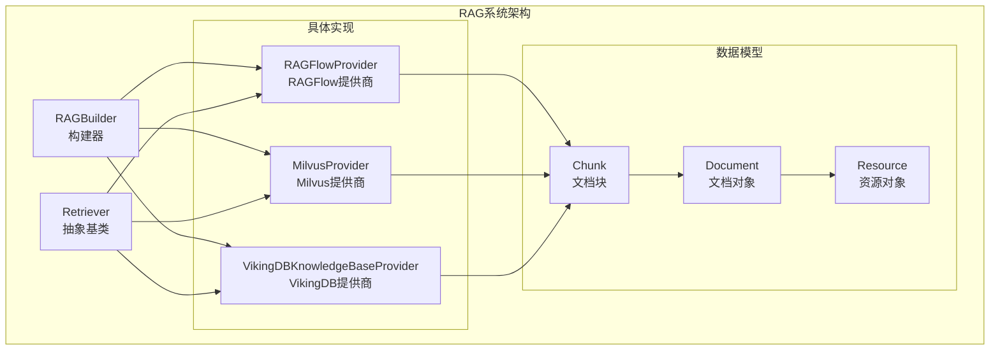
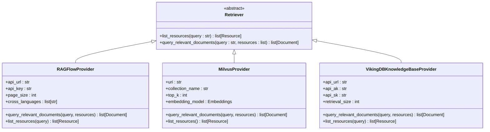
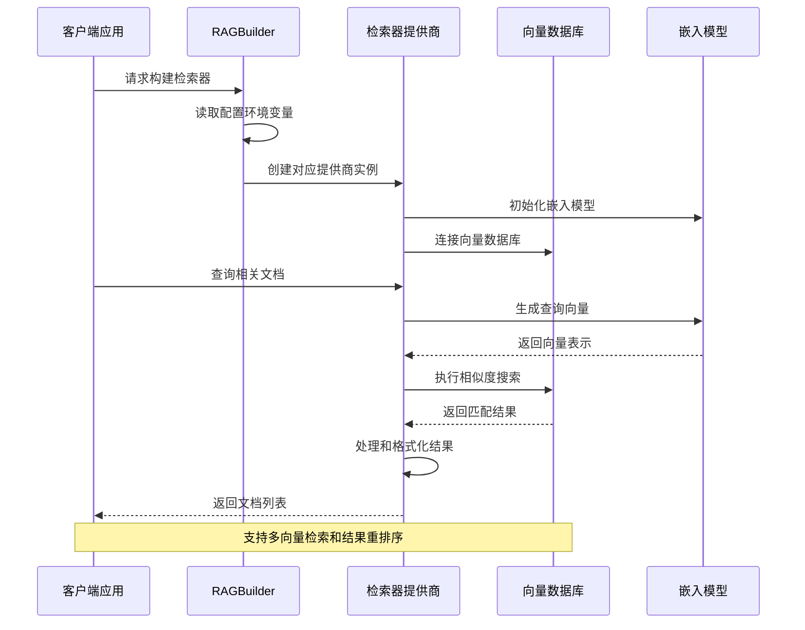
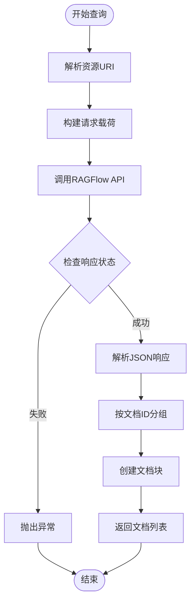
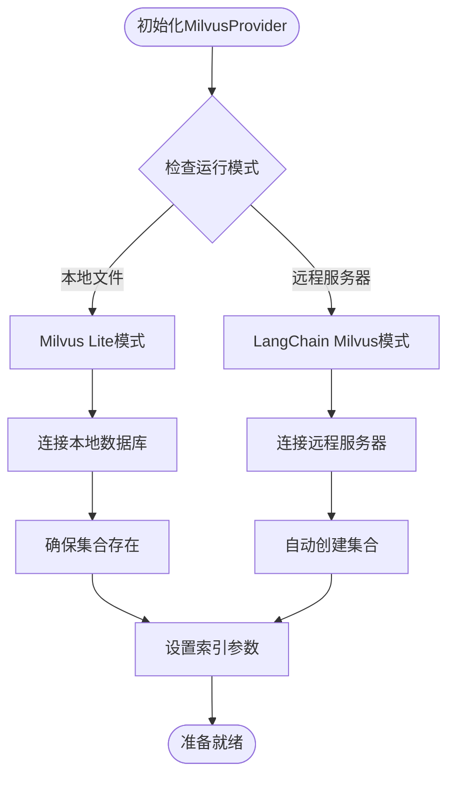
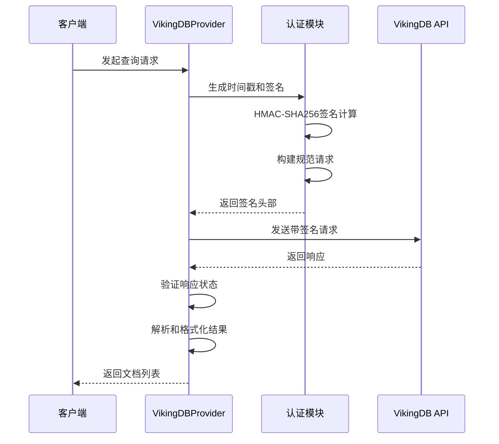
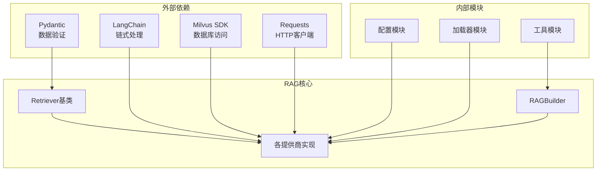

# DeerFlow RAG系统技术架构文档

<cite>
**本文档引用的文件**
- [builder.py](file://src/rag/builder.py)
- [retriever.py](file://src/rag/retriever.py)
- [milvus.py](file://src/rag/milvus.py)
- [ragflow.py](file://src/rag/ragflow.py)
- [vikingdb_knowledge_base.py](file://src/rag/vikingdb_knowledge_base.py)
- [tools.py](file://src/config/tools.py)
- [loader.py](file://src/config/loader.py)
- [conf.yaml](file://conf.yaml)
</cite>

## 目录
1. [简介](#简介)
2. [项目结构概览](#项目结构概览)
3. [核心组件分析](#核心组件分析)
4. [架构概览](#架构概览)
5. [详细组件分析](#详细组件分析)
6. [依赖关系分析](#依赖关系分析)
7. [性能考虑](#性能考虑)
8. [故障排除指南](#故障排除指南)
9. [结论](#结论)

## 简介

DeerFlow RAG（检索增强生成）系统是一个高度模块化的向量数据库检索框架，专门设计用于支持多种向量数据库和检索器后端。该系统通过统一的接口抽象，实现了对RAGFlow、Milvus和VikingDB知识库的无缝集成，为用户提供灵活且高性能的文档检索服务。

系统的核心设计理念是通过RAGBuilder协调不同的向量数据库和检索器组件，包括索引创建、查询处理和结果重排序等关键功能。Retriever类作为所有检索器实现的基础抽象，定义了标准的查询接口和文档表示格式。

## 项目结构概览

DeerFlow RAG系统采用分层架构设计，主要包含以下核心模块：



**图表来源**
- [builder.py](file://src/rag/builder.py#L1-L21)
- [retriever.py](file://src/rag/retriever.py#L1-L82)

**章节来源**
- [builder.py](file://src/rag/builder.py#L1-L21)
- [retriever.py](file://src/rag/retriever.py#L1-L82)

## 核心组件分析

### RAGBuilder：检索器工厂

RAGBuilder是整个RAG系统的核心协调器，负责根据配置选择合适的检索器实现：

```python
def build_retriever() -> Retriever | None:
    if SELECTED_RAG_PROVIDER == RAGProvider.RAGFLOW.value:
        return RAGFlowProvider()
    elif SELECTED_RAG_PROVIDER == RAGProvider.VIKINGDB_KNOWLEDGE_BASE.value:
        return VikingDBKnowledgeBaseProvider()
    elif SELECTED_RAG_PROVIDER == RAGProvider.MILVUS.value:
        return MilvusProvider()
    elif SELECTED_RAG_PROVIDER:
        raise ValueError(f"Unsupported RAG provider: {SELECTED_RAG_PROVIDER}")
    return None
```

该函数通过环境变量`RAG_PROVIDER`确定要使用的检索器类型，支持三种主要的向量数据库后端：
- **RAGFlow**：企业级RAG解决方案
- **Milvus**：高性能向量数据库
- **VikingDB**：知识库集成方案

### Retriever抽象基类

Retriever类定义了所有检索器实现必须遵循的标准接口：



**图表来源**
- [retriever.py](file://src/rag/retriever.py#L45-L82)
- [ragflow.py](file://src/rag/ragflow.py#L12-L137)
- [milvus.py](file://src/rag/milvus.py#L67-L200)
- [vikingdb_knowledge_base.py](file://src/rag/vikingdb_knowledge_base.py#L18-L300)

**章节来源**
- [builder.py](file://src/rag/builder.py#L1-L21)
- [retriever.py](file://src/rag/retriever.py#L45-L82)

## 架构概览

DeerFlow RAG系统采用插件化架构，支持多种向量数据库后端的无缝切换：



**图表来源**
- [builder.py](file://src/rag/builder.py#L10-L21)
- [ragflow.py](file://src/rag/ragflow.py#L50-L86)
- [milvus.py](file://src/rag/milvus.py#L368-L400)

## 详细组件分析

### RAGFlowProvider实现

RAGFlowProvider是企业级RAG解决方案的实现，通过HTTP API与RAGFlow服务通信：



**图表来源**
- [ragflow.py](file://src/rag/ragflow.py#L50-L86)

RAGFlowProvider的关键特性包括：
- **多资源查询**：支持同时查询多个数据集和文档
- **跨语言检索**：可配置的语言过滤和翻译支持
- **灵活的分页**：可调整的结果数量控制
- **URI解析**：自动解析rag://协议的资源标识符

### MilvusProvider实现

MilvusProvider提供了对Milvus向量数据库的完整支持，包括本地Lite和远程服务器两种模式：



**图表来源**
- [milvus.py](file://src/rag/milvus.py#L368-L400)
- [milvus.py](file://src/rag/milvus.py#L200-L250)

MilvusProvider的核心功能：

1. **双模式支持**：本地Lite模式适合开发和小规模部署，远程服务器模式适合生产环境
2. **智能索引**：支持IVF_FLAT索引类型和内积相似度度量
3. **动态元数据**：支持JSON格式的动态元数据字段
4. **自动集合管理**：根据配置自动创建和维护集合

### VikingDBKnowledgeBaseProvider实现

VikingDBProvider专为知识库集成设计，实现了完整的AWS签名认证机制：



**图表来源**
- [vikingdb_knowledge_base.py](file://src/rag/vikingdb_knowledge_base.py#L100-L150)
- [vikingdb_knowledge_base.py](file://src/rag/vikingdb_knowledge_base.py#L150-L200)

VikingDBProvider的独特优势：
- **安全认证**：完整的AWS签名认证机制
- **多资源聚合**：支持从多个知识库同时检索
- **智能重排序**：结合密集和稀疏向量的混合检索
- **文档过滤**：支持基于文档ID的精确过滤

**章节来源**
- [ragflow.py](file://src/rag/ragflow.py#L12-L137)
- [milvus.py](file://src/rag/milvus.py#L67-L200)
- [vikingdb_knowledge_base.py](file://src/rag/vikingdb_knowledge_base.py#L18-L300)

## 依赖关系分析

DeerFlow RAG系统的依赖关系体现了清晰的分层架构：



**图表来源**
- [retriever.py](file://src/rag/retriever.py#L1-L10)
- [milvus.py](file://src/rag/milvus.py#L1-L20)
- [ragflow.py](file://src/rag/ragflow.py#L1-L10)

**章节来源**
- [retriever.py](file://src/rag/retriever.py#L1-L10)
- [milvus.py](file://src/rag/milvus.py#L1-L20)
- [ragflow.py](file://src/rag/ragflow.py#L1-L10)

## 性能考虑

### 索引策略优化

不同检索器实现采用了针对性的索引优化策略：

1. **Milvus索引配置**：
   - 使用IVF_FLAT索引类型，平衡查询速度和内存使用
   - 内积（IP）相似度度量，适合文本嵌入向量
   - nlist参数设置为1024，适用于中等规模数据集

2. **RAGFlow检索优化**：
   - 可配置的页面大小，平衡内存使用和查询性能
   - 跨语言检索的智能缓存机制
   - 批量文档处理的并发优化

3. **VikingDB混合检索**：
   - 密集向量权重0.5，平衡语义和关键词检索
   - 文档级别的去重和重排序
   - 智能的预处理和查询改写

### 缓存机制

系统在多个层面实现了缓存优化：

- **嵌入模型缓存**：避免重复的向量计算
- **查询结果缓存**：针对高频查询的响应缓存
- **连接池管理**：减少数据库连接开销

### 查询优化技巧

1. **批量处理**：支持批量插入和查询操作
2. **异步处理**：非阻塞的API调用和数据库操作
3. **智能分页**：根据实际需求动态调整结果数量
4. **资源过滤**：基于URI的精确资源定位

## 故障排除指南

### 常见问题诊断

1. **连接问题**：
   - 检查环境变量配置是否正确
   - 验证网络连通性和防火墙设置
   - 确认数据库服务是否正常运行

2. **认证失败**：
   - 验证API密钥和认证凭据
   - 检查时间同步和签名算法
   - 确认权限配置是否正确

3. **性能问题**：
   - 监控查询响应时间和资源使用
   - 分析索引效率和数据分布
   - 优化查询参数和批处理大小

### 调试工具和方法

系统提供了丰富的日志记录和调试功能：

- **详细的日志输出**：记录每个步骤的执行情况
- **性能监控指标**：跟踪查询延迟和吞吐量
- **错误追踪机制**：完整的异常堆栈信息
- **配置验证工具**：自动检测配置错误

**章节来源**
- [milvus.py](file://src/rag/milvus.py#L368-L400)
- [vikingdb_knowledge_base.py](file://src/rag/vikingdb_knowledge_base.py#L100-L150)

## 结论

DeerFlow RAG系统通过精心设计的架构和模块化实现，为现代RAG应用提供了强大而灵活的基础设施。系统的核心优势包括：

1. **统一接口**：通过Retriever抽象，实现了不同向量数据库的无缝切换
2. **多后端支持**：灵活支持RAGFlow、Milvus和VikingDB等多种后端
3. **高性能设计**：针对大规模向量检索进行了深度优化
4. **企业级特性**：完整的认证、缓存和监控机制
5. **易于扩展**：清晰的架构便于添加新的检索器实现

该系统特别适合需要处理大量文档、要求高查询性能和具备企业级安全性的应用场景。通过合理的配置和优化，可以满足从原型开发到生产部署的各种需求。

未来的改进方向包括：
- 更多向量数据库后端的支持
- 智能查询改写和重排序算法
- 分布式部署和负载均衡
- 更丰富的监控和分析功能