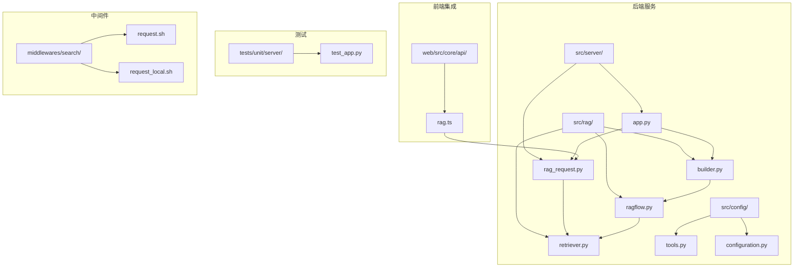
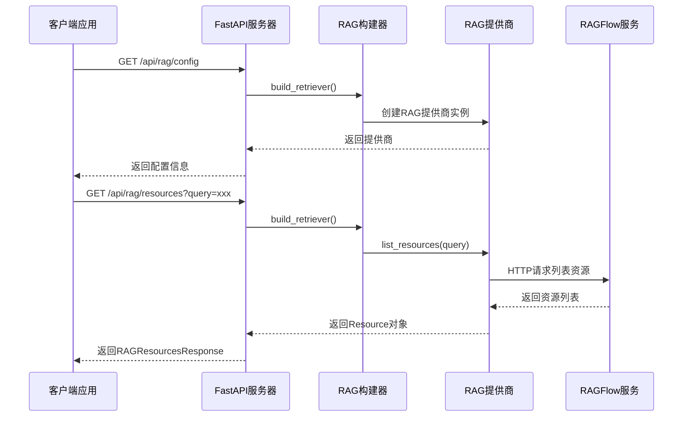
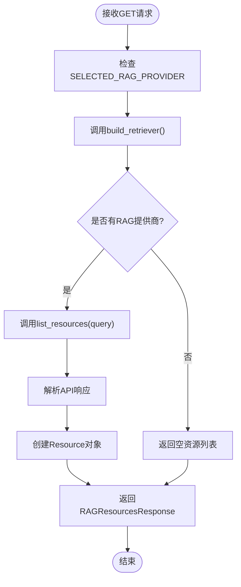
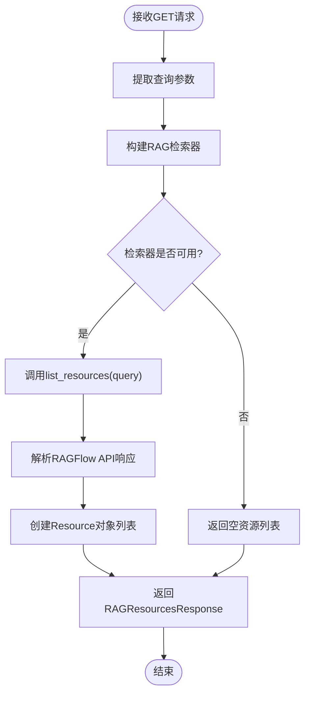
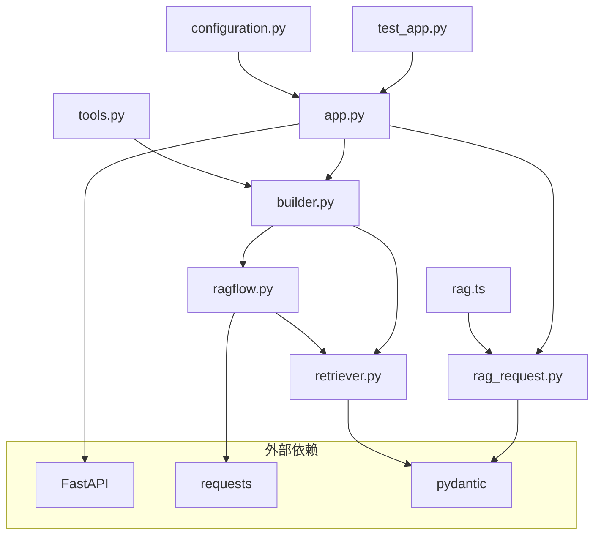

# RAG系统API集成文档

<cite>
**本文档引用的文件**
- [rag_request.py](file://src/server/rag_request.py)
- [app.py](file://src/server/app.py)
- [ragflow.py](file://src/rag/ragflow.py)
- [retriever.py](file://src/rag/retriever.py)
- [builder.py](file://src/rag/builder.py)
- [tools.py](file://src/config/tools.py)
- [configuration.py](file://src/config/configuration.py)
- [rag.ts](file://web/src/core/api/rag.ts)
- [test_app.py](file://tests/unit/server/test_app.py)
- [request.sh](file://middlewares/search/request.sh)
- [request_local.sh](file://middlewares/search/request_local.sh)
</cite>

## 目录
1. [简介](#简介)
2. [项目结构](#项目结构)
3. [核心组件](#核心组件)
4. [架构概览](#架构概览)
5. [详细组件分析](#详细组件分析)
6. [依赖关系分析](#依赖关系分析)
7. [性能考虑](#性能考虑)
8. [故障排除指南](#故障排除指南)
9. [结论](#结论)

## 简介

本文档详细介绍了DeerFlow RAG（检索增强生成）系统的API集成实现。该系统提供了完整的HTTP端点来支持RAG功能，包括资源查询、配置管理和文档检索。系统采用FastAPI框架构建，支持多种RAG提供商，并提供了完整的身份验证、错误处理和监控机制。

RAG系统的核心目标是通过检索相关文档来增强AI模型的输出质量，为用户提供更准确、更有根据的信息。系统设计遵循RESTful API原则，提供清晰的接口规范和完整的错误处理机制。

## 项目结构

RAG系统API集成的项目结构组织如下：



**图表来源**
- [rag_request.py](file://src/server/rag_request.py#L1-L29)
- [app.py](file://src/server/app.py#L1-L688)
- [ragflow.py](file://src/rag/ragflow.py#L1-L137)
- [retriever.py](file://src/rag/retriever.py#L1-L82)

**章节来源**
- [rag_request.py](file://src/server/rag_request.py#L1-L29)
- [app.py](file://src/server/app.py#L1-L688)
- [ragflow.py](file://src/rag/ragflow.py#L1-L137)

## 核心组件

### RAG请求模型

系统定义了三个核心的Pydantic模型来处理RAG请求：

1. **RAGConfigResponse**: RAG配置响应模型
2. **RAGResourceRequest**: RAG资源请求模型
3. **RAGResourcesResponse**: RAG资源响应模型

这些模型确保了请求和响应数据的类型安全和结构化。

### RAG提供商抽象

系统通过`Retriever`抽象类定义了RAG提供商的标准接口：

```python
class Retriever(abc.ABC):
    @abc.abstractmethod
    def list_resources(self, query: str | None = None) -> list[Resource]:
        pass

    @abc.abstractmethod
    def query_relevant_documents(
        self, query: str, resources: list[Resource] = []
    ) -> list[Document]:
        pass
```

**章节来源**
- [rag_request.py](file://src/server/rag_request.py#L8-L28)
- [retriever.py](file://src/rag/retriever.py#L60-L82)

## 架构概览

RAG系统采用分层架构设计，确保了模块化和可扩展性：



**图表来源**
- [app.py](file://src/server/app.py#L648-L658)
- [builder.py](file://src/rag/builder.py#L10-L20)
- [ragflow.py](file://src/rag/ragflow.py#L88-L135)

## 详细组件分析

### RAG配置端点

#### 端点定义

```python
@app.get("/api/rag/config", response_model=RAGConfigResponse)
async def rag_config():
    """Get the config of the RAG."""
    return RAGConfigResponse(provider=SELECTED_RAG_PROVIDER)
```

**支持的HTTP方法**: GET  
**URL路径**: `/api/rag/config`  
**响应模型**: `RAGConfigResponse`

#### 请求处理流程



**图表来源**
- [app.py](file://src/server/app.py#L648-L658)
- [builder.py](file://src/rag/builder.py#L10-L20)

### RAG资源查询端点

#### 端点定义

```python
@app.get("/api/rag/resources", response_model=RAGResourcesResponse)
async def rag_resources(request: Annotated[RAGResourceRequest, Query()]):
    """Get the resources of the RAG."""
    retriever = build_retriever()
    if retriever:
        return RAGResourcesResponse(resources=retriever.list_resources(request.query))
    return RAGResourcesResponse(resources=[])
```

**支持的HTTP方法**: GET  
**URL路径**: `/api/rag/resources`  
**查询参数**: `query` (可选字符串)  
**响应模型**: `RAGResourcesResponse`

#### 资源查询处理流程



**图表来源**
- [app.py](file://src/server/app.py#L654-L658)
- [ragflow.py](file://src/rag/ragflow.py#L88-L135)

### RAGFlow提供商实现

#### HTTP请求处理

RAGFlow提供商实现了完整的HTTP客户端功能：

```python
def list_resources(self, query: str | None = None) -> list[Resource]:
    headers = {
        "Authorization": f"Bearer {self.api_key}",
        "Content-Type": "application/json",
    }

    params = {}
    if query:
        params["name"] = query

    response = requests.get(
        f"{self.api_url}/api/v1/datasets", headers=headers, params=params
    )

    if response.status_code != 200:
        raise Exception(f"Failed to list resources: {response.text}")

    result = response.json()
    resources = []

    for item in result.get("data", []):
        item = Resource(
            uri=f"rag://dataset/{item.get('id')}",
            title=item.get("name", ""),
            description=item.get("description", ""),
        )
        resources.append(item)

    return resources
```

#### 错误处理机制

系统实现了完善的错误处理：

1. **HTTP状态码检查**: 验证API响应状态
2. **异常抛出**: 在失败情况下抛出详细异常
3. **环境变量验证**: 确保必要的配置存在

**章节来源**
- [ragflow.py](file://src/rag/ragflow.py#L88-L135)
- [app.py](file://src/server/app.py#L648-L658)

### 前端API集成

#### JavaScript客户端实现

```typescript
export function queryRAGResources(query: string) {
  return fetch(resolveServiceURL(`rag/resources?query=${query}`), {
    method: "GET",
  })
    .then((res) => res.json())
    .then((res) => {
      return res.resources as Array<Resource>;
    })
    .catch(() => {
      return [];
    });
}
```

#### 使用示例

```javascript
// 查询所有资源
const allResources = await queryRAGResources('');

// 查询特定关键词的资源
const filteredResources = await queryRAGResources('人工智能');

// 处理结果
filteredResources.forEach(resource => {
  console.log(`标题: ${resource.title}`);
  console.log(`描述: ${resource.description}`);
});
```

**章节来源**
- [rag.ts](file://web/src/core/api/rag.ts#L5-L16)

## 依赖关系分析

### 模块依赖图



**图表来源**
- [app.py](file://src/server/app.py#L1-L50)
- [builder.py](file://src/rag/builder.py#L1-L21)
- [ragflow.py](file://src/rag/ragflow.py#L1-L15)

### 环境变量配置

系统依赖以下关键环境变量：

- `RAG_PROVIDER`: 指定RAG提供商类型
- `RAGFLOW_API_URL`: RAGFlow服务地址
- `RAGFLOW_API_KEY`: RAGFlow API密钥
- `RAGFLOW_PAGE_SIZE`: 分页大小
- `RAGFLOW_CROSS_LANGUAGES`: 跨语言支持

**章节来源**
- [builder.py](file://src/rag/builder.py#L10-L20)
- [ragflow.py](file://src/rag/ragflow.py#L18-L40)

## 性能考虑

### 连接池和超时设置

系统使用requests库进行HTTP通信，建议在生产环境中配置适当的超时和重试机制：

```python
# 推荐的超时配置
timeout = (5, 30)  # 连接超时5秒，读取超时30秒
max_retries = 3

response = requests.get(
    url,
    headers=headers,
    params=params,
    timeout=timeout,
    retries=max_retries
)
```

### 缓存策略

建议在应用层面实现缓存机制：

1. **资源列表缓存**: 缓存RAG资源列表，减少API调用频率
2. **查询结果缓存**: 对频繁查询的文档进行缓存
3. **配置缓存**: 缓存RAG配置信息

### 并发处理

系统支持异步处理，可以通过以下方式优化性能：

```python
# 异步批量查询
async def batch_query_resources(resource_ids: list[str]):
    tasks = []
    for resource_id in resource_ids:
        task = asyncio.create_task(fetch_resource_details(resource_id))
        tasks.append(task)
    
    results = await asyncio.gather(*tasks)
    return results
```

## 故障排除指南

### 常见错误码

| 状态码 | 错误类型 | 解决方案 |
|--------|----------|----------|
| 400 | 请求参数错误 | 检查查询参数格式 |
| 401 | 认证失败 | 验证API密钥有效性 |
| 404 | 资源不存在 | 检查RAGFlow服务状态 |
| 500 | 内部服务器错误 | 查看服务器日志 |

### 调试技巧

#### 启用详细日志

```python
import logging
logging.basicConfig(level=logging.DEBUG)
logger = logging.getLogger(__name__)
```

#### CURL测试命令

```bash
# 测试RAG配置端点
curl -X GET "http://localhost:8000/api/rag/config" \
     -H "Accept: application/json"

# 测试资源查询端点
curl -X GET "http://localhost:8000/api/rag/resources?query=人工智能" \
     -H "Accept: application/json"
```

#### Python客户端调试

```python
import requests

def debug_rag_endpoint(endpoint="/api/rag/config"):
    try:
        response = requests.get(f"http://localhost:8000{endpoint}")
        print(f"状态码: {response.status_code}")
        print(f"响应内容: {response.json()}")
    except Exception as e:
        print(f"请求失败: {e}")

# 调试配置端点
debug_rag_endpoint()

# 调试资源查询端点
debug_rag_endpoint("/api/rag/resources?query=test")
```

### 监控和日志记录

#### 关键指标监控

1. **API响应时间**: 监控RAG端点的响应延迟
2. **错误率**: 跟踪HTTP错误的发生频率
3. **资源查询成功率**: 监控资源查询的成功率
4. **并发请求数**: 跟踪同时处理的请求数量

#### 日志记录建议

```python
import logging

logger = logging.getLogger(__name__)

def log_rag_request(request_data, response_data, duration):
    """记录RAG请求的日志"""
    logger.info({
        "event": "rag_request",
        "duration_ms": duration * 1000,
        "request_size": len(str(request_data)),
        "response_size": len(str(response_data)),
        "status_code": getattr(response_data, 'status_code', None)
    })
```

**章节来源**
- [test_app.py](file://tests/unit/server/test_app.py#L355-L381)
- [request.sh](file://middlewares/search/request.sh#L1-L35)

## 结论

本文档详细介绍了DeerFlow RAG系统的API集成实现。系统采用了现代化的架构设计，提供了完整的HTTP端点来支持RAG功能，包括：

1. **RESTful API设计**: 符合REST原则的端点设计
2. **类型安全**: 使用Pydantic模型确保数据完整性
3. **多提供商支持**: 支持多种RAG提供商的抽象接口
4. **错误处理**: 完善的错误处理和异常管理
5. **性能优化**: 异步处理和缓存策略
6. **监控支持**: 详细的日志记录和监控指标

通过本文档提供的API规范、使用示例和故障排除指南，开发者可以有效地集成和使用RAG系统功能。系统的设计确保了良好的可扩展性和维护性，为未来的功能扩展奠定了坚实的基础。