# DeerFlow RAG 工作流系统文档

<cite>
**本文档引用的文件**
- [src/rag/builder.py](file://src/rag/builder.py)
- [src/rag/ragflow.py](file://src/rag/ragflow.py)
- [src/rag/retriever.py](file://src/rag/retriever.py)
- [src/rag/milvus.py](file://src/rag/milvus.py)
- [src/rag/vikingdb_knowledge_base.py](file://src/rag/vikingdb_knowledge_base.py)
- [src/server/rag_request.py](file://src/server/rag_request.py)
- [src/config/tools.py](file://src/config/tools.py)
- [src/workflow.py](file://src/workflow.py)
- [main.py](file://main.py)
</cite>

## 目录
1. [简介](#简介)
2. [项目架构概览](#项目架构概览)
3. [RAG 构建器系统](#rag-构建器系统)
4. [核心组件分析](#核心组件分析)
5. [工作流执行机制](#工作流执行机制)
6. [错误处理与降级策略](#错误处理与降级策略)
7. [性能监控与优化](#性能监控与优化)
8. [API 集成与配置](#api-集成与配置)
9. [故障排除指南](#故障排除指南)
10. [总结](#总结)

## 简介

DeerFlow RAG（检索增强生成）工作流是一个先进的信息检索和内容生成系统，专门设计用于从各种知识源中提取相关信息并为用户提供高质量的上下文增强回答。该系统采用模块化架构，支持多种向量存储和检索器提供商，包括 RAGFlow、Milvus 和 VikingDB 知识库。

系统的核心设计理念是通过智能的向量检索和上下文组装技术，将用户的查询转化为精确的相关文档集合，并通过多层处理管道确保检索质量和响应效率。这种设计使得 DeerFlow 能够在复杂的多模态环境中提供准确且相关的检索结果。

## 项目架构概览

DeerFlow RAG 工作流采用分层架构设计，将功能模块清晰分离，确保系统的可扩展性和维护性。

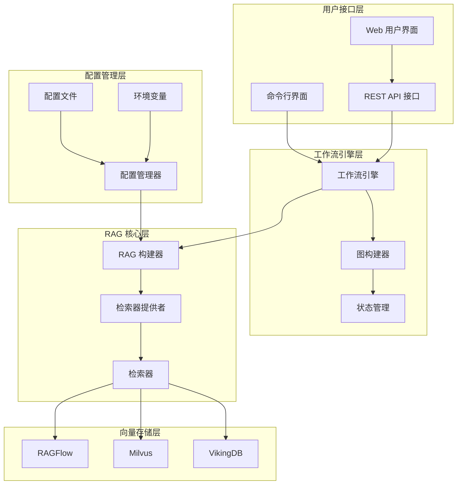

**图表来源**
- [src/workflow.py](file://src/workflow.py#L1-L104)
- [src/rag/builder.py](file://src/rag/builder.py#L1-L21)

系统架构的核心特点包括：

- **模块化设计**：每个组件都有明确的职责边界
- **插件式架构**：支持多种检索器提供商的动态切换
- **异步处理**：基于 asyncio 的非阻塞工作流执行
- **配置驱动**：通过环境变量和配置文件进行灵活部署

**章节来源**
- [src/workflow.py](file://src/workflow.py#L1-L104)
- [src/rag/builder.py](file://src/rag/builder.py#L1-L21)

## RAG 构建器系统

RAG 构建器是整个系统的核心协调器，负责根据配置选择合适的检索器提供者并初始化相应的组件。

### 构建器架构设计

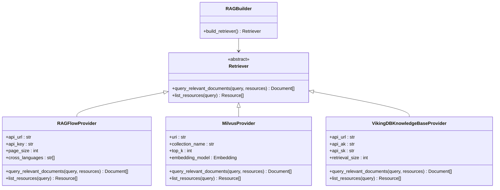

**图表来源**
- [src/rag/builder.py](file://src/rag/builder.py#L1-L21)
- [src/rag/ragflow.py](file://src/rag/ragflow.py#L1-L137)
- [src/rag/milvus.py](file://src/rag/milvus.py#L1-L786)
- [src/rag/vikingdb_knowledge_base.py](file://src/rag/vikingdb_knowledge_base.py#L1-L300)

### 组件依赖注入机制

构建器采用工厂模式实现组件的动态创建和依赖注入：

```python
def build_retriever() -> Retriever | None:
    if SELECTED_RAG_PROVIDER == RAGProvider.RAGFLOW.value:
        return RAGFlowProvider()
    elif SELECTED_RAG_PROVIDER == RAGProvider.VIKINGDB_KNOWLEDGE_BASE.value:
        return VikingDBKnowledgeBaseProvider()
    elif SELECTED_RAG_PROVIDER == RAGProvider.MILVUS.value:
        return MilvusProvider()
    elif SELECTED_RAG_PROVIDER:
        raise ValueError(f"Unsupported RAG provider: {SELECTED_RAG_PROVIDER}")
    return None
```

这种设计的优势包括：

- **运行时灵活性**：无需重新编译即可切换不同的检索器
- **配置驱动**：通过环境变量控制组件选择
- **错误隔离**：不支持的提供者会抛出明确的异常
- **扩展性**：新提供者的添加只需修改构建器逻辑

**章节来源**
- [src/rag/builder.py](file://src/rag/builder.py#L1-L21)

## 核心组件分析

### 检索器抽象层

所有 RAG 提供者都继承自统一的 `Retriever` 抽象基类，确保了一致的接口契约：

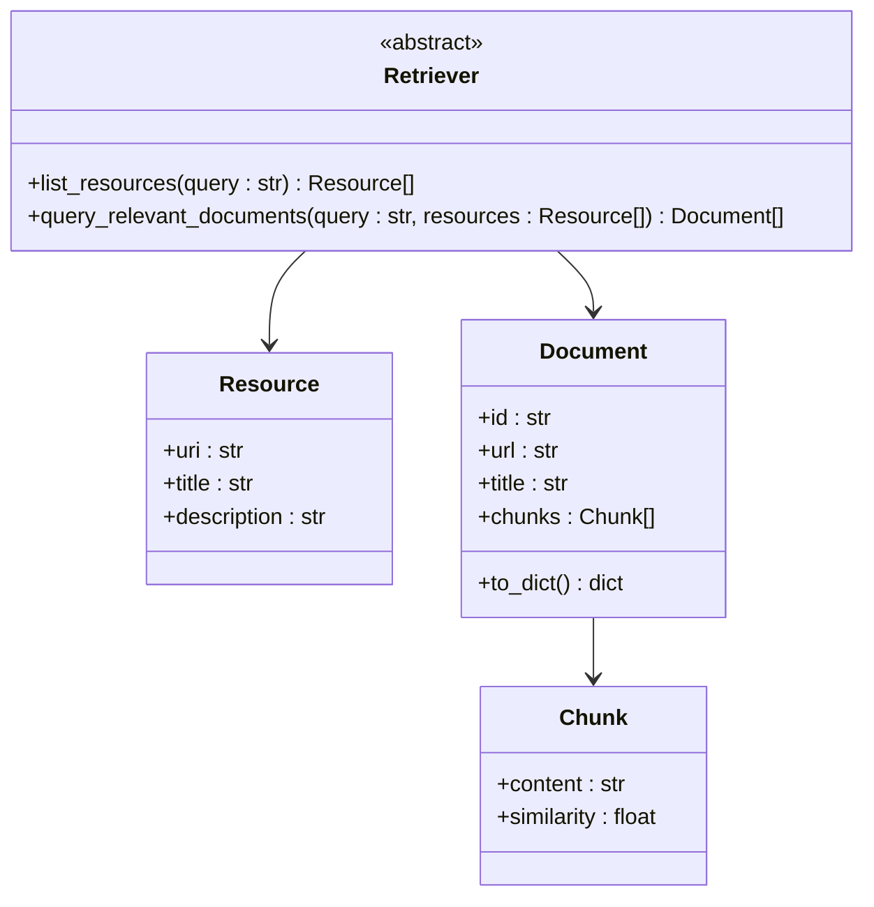

**图表来源**
- [src/rag/retriever.py](file://src/rag/retriever.py#L1-L82)

### RAGFlow 提供者

RAGFlow 提供者实现了与 RAGFlow 服务的深度集成，支持高级检索功能：

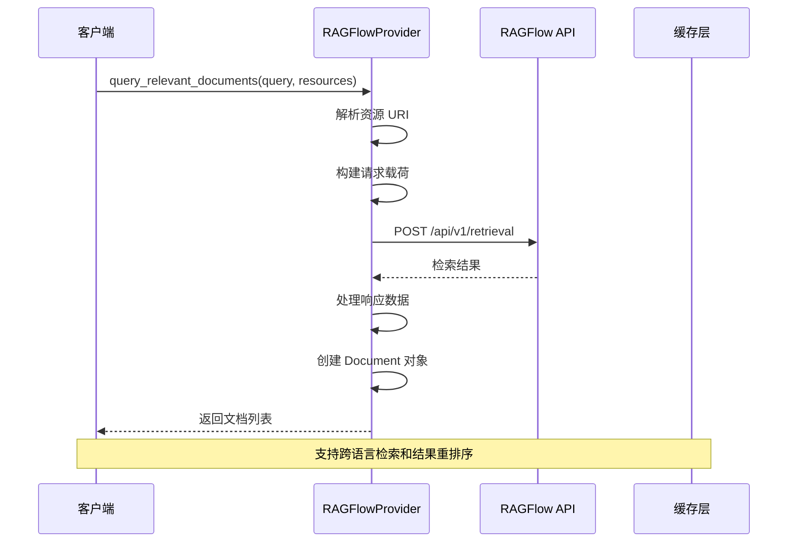

**图表来源**
- [src/rag/ragflow.py](file://src/rag/ragflow.py#L40-L95)

RAGFlow 提供者的关键特性：

- **URI 解析**：支持 `rag://dataset/{id}#{doc_id}` 格式的资源标识符
- **跨语言检索**：自动处理多语言文档的相似度计算
- **结果聚合**：将原始块数据重组为语义完整的文档对象
- **错误处理**：详细的 HTTP 错误码和消息解析

### Milvus 提供者

Milvus 提供者提供了本地和远程向量数据库的统一访问接口：

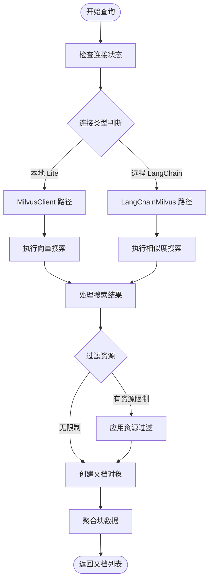

**图表来源**
- [src/rag/milvus.py](file://src/rag/milvus.py#L600-L700)

Milvus 提供者的核心功能：

- **双模式支持**：同时兼容 Milvus Lite 和远程服务器
- **自动分块**：智能地将长文档分割为适合检索的块
- **示例加载**：自动加载项目中的 Markdown 示例文件
- **嵌入模型适配**：支持 OpenAI 和 DashScope 嵌入模型

### VikingDB 提供者

VikingDB 提供者实现了阿里云知识库服务的集成：

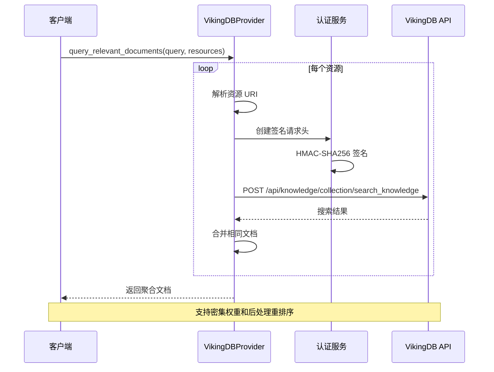

**图表来源**
- [src/rag/vikingdb_knowledge_base.py](file://src/rag/vikingdb_knowledge_base.py#L150-L220)

**章节来源**
- [src/rag/ragflow.py](file://src/rag/ragflow.py#L1-L137)
- [src/rag/milvus.py](file://src/rag/milvus.py#L1-L786)
- [src/rag/vikingdb_knowledge_base.py](file://src/rag/vikingdb_knowledge_base.py#L1-L300)

## 工作流执行机制

### 异步工作流引擎

DeerFlow 采用基于 asyncio 的异步工作流引擎，支持实时流式输出和状态管理：

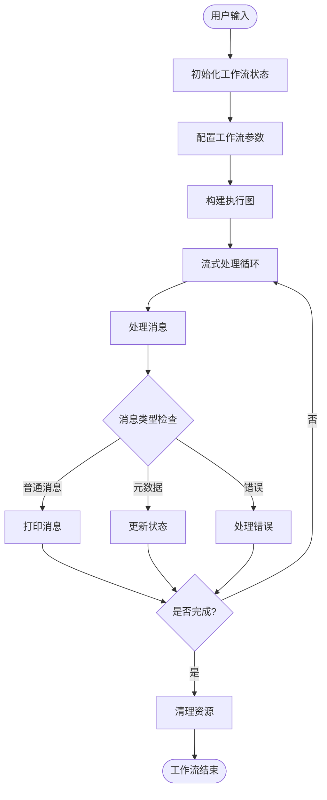

**图表来源**
- [src/workflow.py](file://src/workflow.py#L50-L86)

### 查询预处理阶段

工作流的初始阶段负责验证输入并设置执行环境：

```python
initial_state = {
    # 运行时变量
    "messages": [{"role": "user", "content": user_input}],
    "auto_accepted_plan": True,
    "enable_background_investigation": enable_background_investigation,
}
```

关键处理步骤：

1. **输入验证**：确保用户输入不为空
2. **状态初始化**：设置默认的工作流参数
3. **配置准备**：整合 MCP 设置和递归限制
4. **图构建**：创建可执行的有向无环图

### 结果后处理与上下文组装

检索到的文档经过多层处理最终形成用户可读的内容：

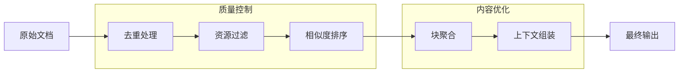

**章节来源**
- [src/workflow.py](file://src/workflow.py#L50-L86)
- [main.py](file://main.py#L1-L157)

## 错误处理与降级策略

### 多层次错误处理机制

DeerFlow 实现了完善的错误处理和降级策略，确保系统在各种异常情况下的稳定性：

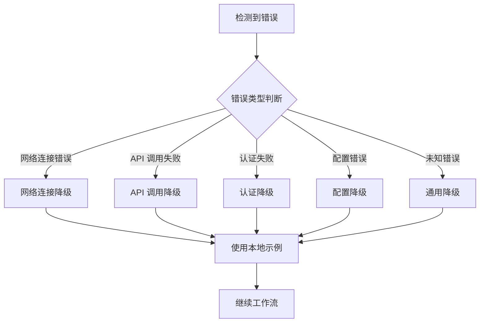

### 具体降级策略实现

#### 1. 网络连接失败降级

当远程检索服务不可用时，系统会自动回退到本地资源：

```python
def list_resources(self, query: Optional[str] = None) -> List[Resource]:
    try:
        # 尝试连接远程服务
        if self._is_milvus_lite():
            results = self.client.query(...)
        else:
            docs = self.client.similarity_search(...)
    except Exception:
        # 回退到本地示例
        return self._list_local_markdown_resources()
```

#### 2. API 调用失败处理

RAGFlow 提供者实现了详细的 API 错误处理：

```python
response = requests.post(url, headers=headers, json=payload)
if response.status_code != 200:
    raise Exception(f"Failed to query documents: {response.text}")
```

#### 3. 认证失败恢复

VikingDB 提供者实现了 AWS 风格的签名认证机制：

```python
def _create_signature(self, method, path, params, headers, payload):
    # 创建规范请求
    canonical_request = self._create_canonical_request(...)
    # 生成签名
    signature = hmac.new(signing_key, string_to_sign, hashlib.sha256).hexdigest()
    return authorization_header
```

**章节来源**
- [src/rag/milvus.py](file://src/rag/milvus.py#L650-L700)
- [src/rag/ragflow.py](file://src/rag/ragflow.py#L70-L95)
- [src/rag/vikingdb_knowledge_base.py](file://src/rag/vikingdb_knowledge_base.py#L100-L150)

## 性能监控与优化

### 性能指标体系

DeerFlow 实现了全面的性能监控体系，涵盖检索延迟、命中率和上下文相关性等关键指标：

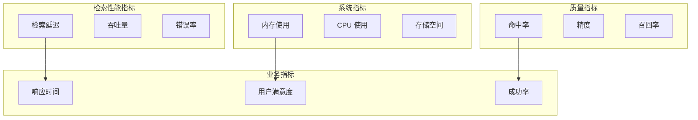

### 检索延迟优化策略

#### 1. 连接池管理

```python
# 连接参数优化
connection_kwargs = {
    "autocommit": True,
    "row_factory": "dict_row",
    "prepare_threshold": 0,
}
```

#### 2. 批量处理优化

```python
# 批量插入文档块
def _insert_document_chunk(self, doc_id, content, title, url, metadata):
    embedding = self._get_embedding(content)
    # 批量操作减少网络往返
    self.client.insert(collection_name=self.collection_name, data=data)
```

#### 3. 缓存策略

- **嵌入缓存**：避免重复计算相同的文本嵌入
- **查询缓存**：缓存频繁的检索查询结果
- **元数据缓存**：缓存资源列表和文档信息

### 上下文相关性评估

系统通过多种方式评估检索结果的相关性：

1. **相似度阈值**：设置最低相似度分数
2. **多样性检查**：避免结果过于相似
3. **语义一致性**：确保检索结果与查询意图匹配
4. **长度合理性**：平衡信息密度和可读性

## API 集成与配置

### 配置管理系统

DeerFlow 采用分层配置管理，支持环境变量、配置文件和运行时参数的灵活组合：

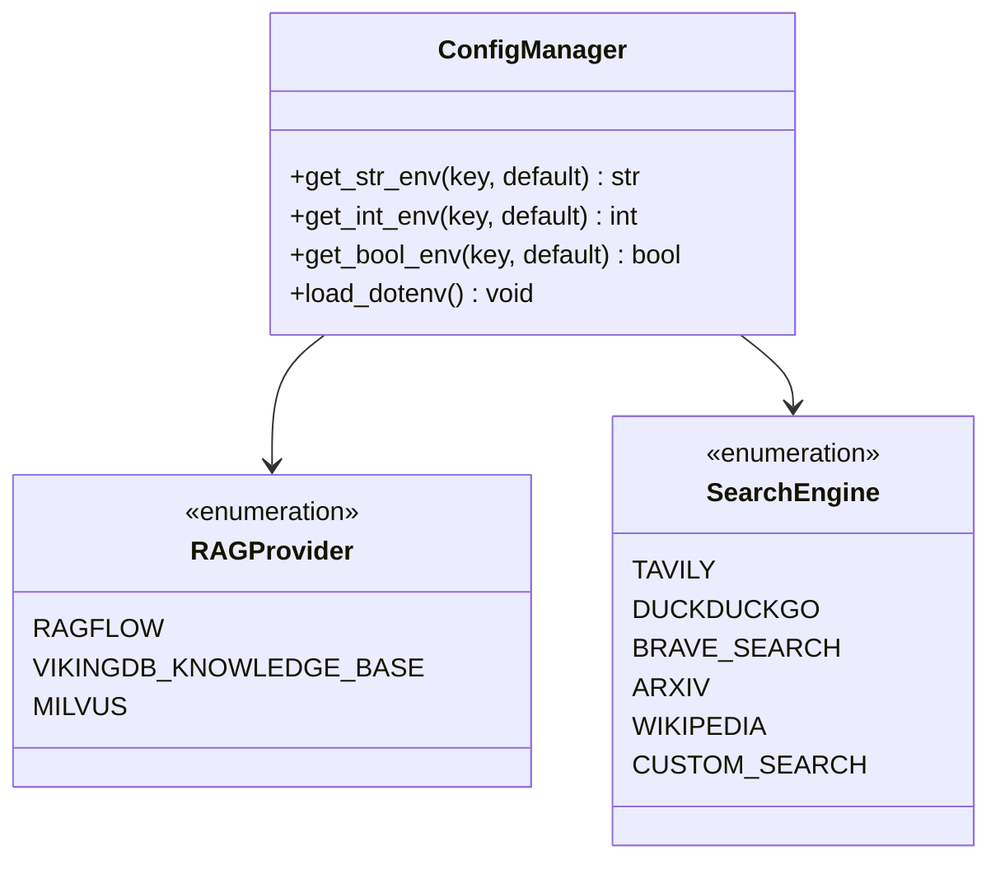

**图表来源**
- [src/config/tools.py](file://src/config/tools.py#L1-L32)

### 环境变量配置

主要的配置项包括：

| 配置项 | 类型 | 默认值 | 描述 |
|--------|------|--------|------|
| `RAG_PROVIDER` | String | None | RAG 提供者选择 |
| `RAGFLOW_API_URL` | String | None | RAGFlow API 地址 |
| `RAGFLOW_API_KEY` | String | None | RAGFlow API 密钥 |
| `MILVUS_URI` | String | http://localhost:19530 | Milvus 连接地址 |
| `MILVUS_COLLECTION` | String | documents | 集合名称 |
| `VIKINGDB_KNOWLEDGE_BASE_API_URL` | String | None | VikingDB API 地址 |

### REST API 集成

系统提供了标准化的 REST API 接口用于 RAG 配置和资源管理：

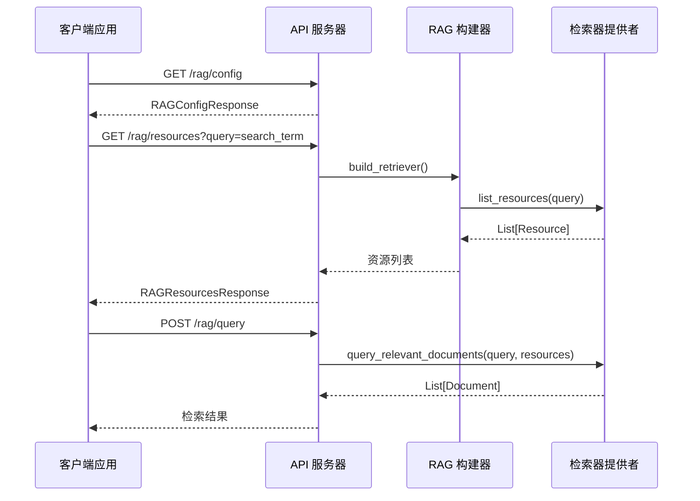

**图表来源**
- [src/server/rag_request.py](file://src/server/rag_request.py#L1-L29)

**章节来源**
- [src/config/tools.py](file://src/config/tools.py#L1-L32)
- [src/server/rag_request.py](file://src/server/rag_request.py#L1-L29)

## 故障排除指南

### 常见问题诊断

#### 1. RAG 提供者初始化失败

**症状**：系统启动时提示 "Unsupported RAG provider"

**解决方案**：
```bash
# 检查环境变量设置
echo $RAG_PROVIDER

# 验证提供者名称拼写
export RAG_PROVIDER=milvus  # 或 ragflow, vikingdb_knowledge_base
```

#### 2. Milvus 连接超时

**症状**：Milvus 提供者无法建立连接

**诊断步骤**：
```python
# 检查连接参数
print(f"MILVUS_URI: {os.getenv('MILVUS_URI')}")
print(f"MILVUS_COLLECTION: {os.getenv('MILVUS_COLLECTION')}")

# 测试网络连通性
import requests
try:
    response = requests.get(os.getenv('MILVUS_URI'), timeout=5)
    print(f"Connection test: {response.status_code}")
except Exception as e:
    print(f"Connection failed: {e}")
```

#### 3. RAGFlow API 认证失败

**症状**：API 调用返回 401 或 403 错误

**解决方法**：
```bash
# 验证 API 密钥
export RAGFLOW_API_KEY="your-api-key-here"

# 检查 API URL 格式
export RAGFLOW_API_URL="https://your-ragflow-instance.com"
```

### 性能调优建议

#### 1. 向量检索优化

- **调整 top_k 参数**：根据实际需求平衡质量和性能
- **优化索引参数**：调整 IVF_FLAT 索引的 nlist 参数
- **批量处理**：对大量文档使用批量插入

#### 2. 内存使用优化

- **分页加载**：避免一次性加载过多文档
- **及时释放**：定期清理不再使用的文档对象
- **压缩存储**：启用向量数据的压缩选项

#### 3. 网络性能优化

- **连接复用**：使用持久连接减少握手开销
- **超时设置**：合理设置请求超时时间
- **重试机制**：实现指数退避的重试策略

### 日志分析与监控

系统提供了详细的日志记录功能，帮助诊断问题：

```python
# 启用调试日志
import logging
logging.getLogger("src").setLevel(logging.DEBUG)

# 关键日志点
logger.info(f"Starting async workflow with user input: {user_input}")
logger.warning(f"Could not ensure collection exists: {e}")
logger.error(f"Error getting loaded examples: {e}")
```

**章节来源**
- [src/rag/milvus.py](file://src/rag/milvus.py#L100-L150)
- [src/rag/ragflow.py](file://src/rag/ragflow.py#L25-L45)

## 总结

DeerFlow RAG 工作流系统是一个功能完善、架构清晰的信息检索和内容生成平台。通过模块化的组件设计、灵活的配置管理和强大的错误处理机制，系统能够在各种复杂场景下稳定运行。

### 主要优势

1. **架构灵活性**：支持多种检索器提供商的无缝切换
2. **性能优化**：多层次的缓存和批处理机制
3. **错误恢复**：完善的降级策略和故障转移机制
4. **易于扩展**：清晰的接口设计便于添加新功能
5. **监控完善**：全面的性能指标和日志记录

### 应用场景

- **企业知识管理**：构建智能的企业知识库系统
- **学术研究辅助**：为研究人员提供文献检索和分析工具
- **客户服务系统**：实现智能客服的知识增强
- **内容创作助手**：为内容创作者提供丰富的参考资料

### 发展方向

未来的发展重点包括：

- **多模态支持**：扩展对图像、音频等多媒体内容的支持
- **实时更新**：实现知识库的实时增量更新
- **个性化推荐**：基于用户行为的检索结果个性化
- **分布式部署**：支持大规模集群的水平扩展

通过持续的优化和功能扩展，DeerFlow RAG 工作流将继续为用户提供更加智能和高效的信息检索体验。