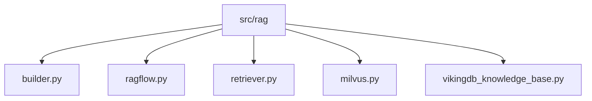
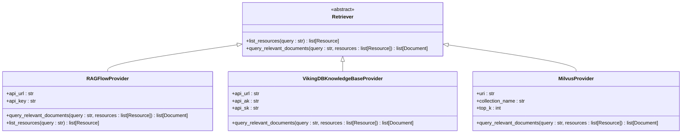
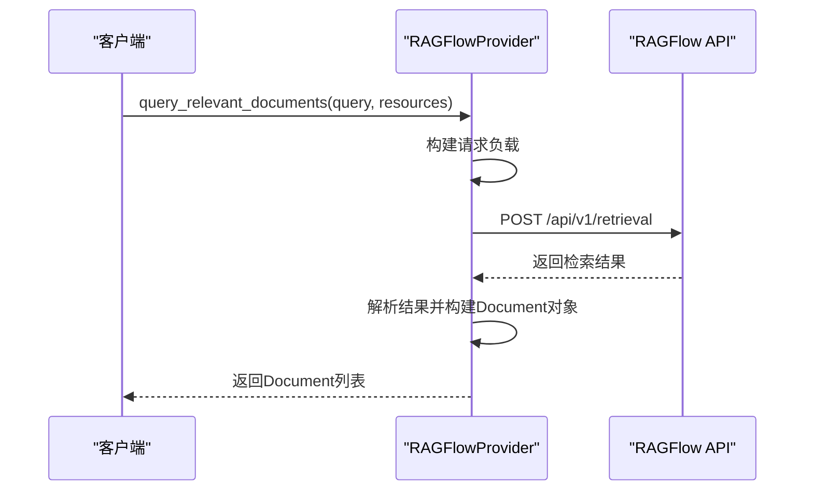
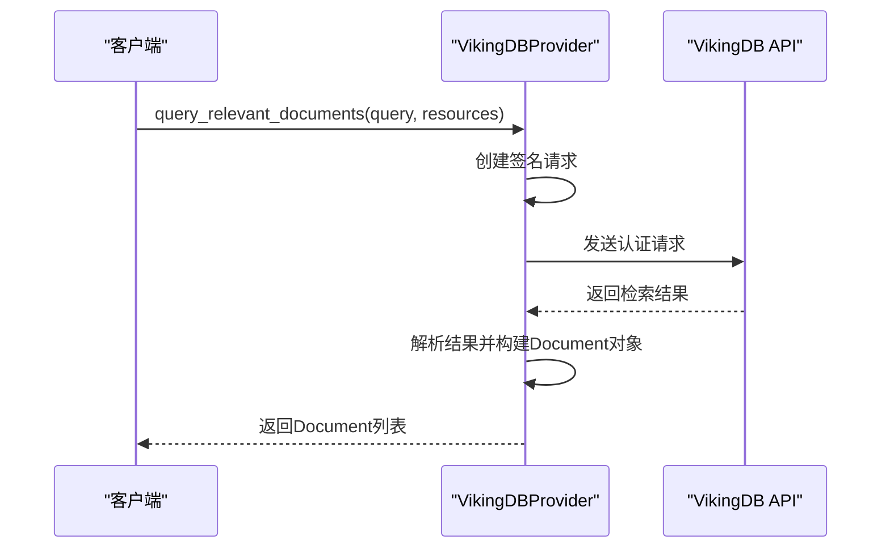
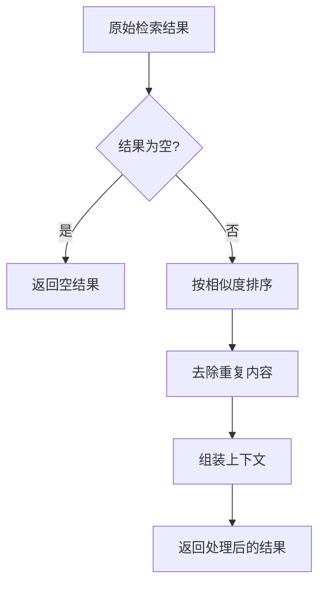
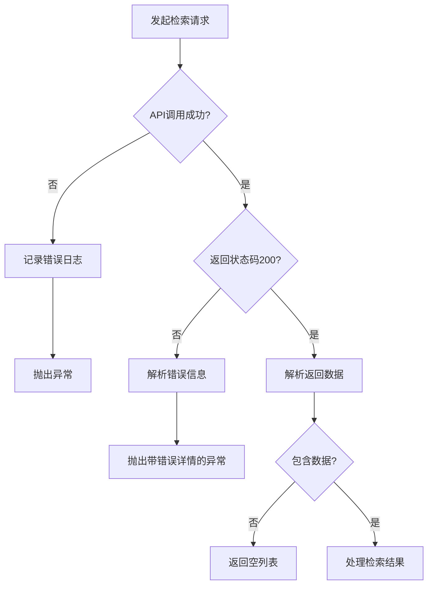
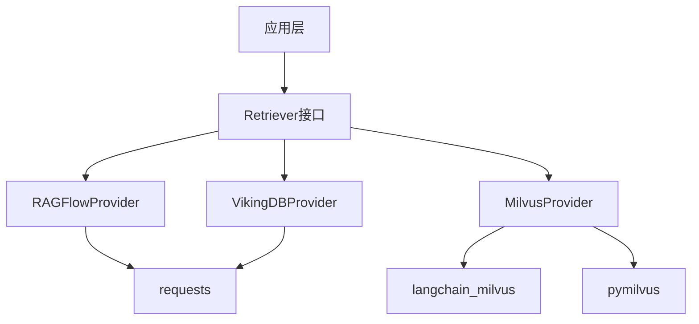

# RAG执行流程

<cite>
**本文档引用的文件**
- [ragflow.py](file://src/rag/ragflow.py)
- [retriever.py](file://src/rag/retriever.py)
- [builder.py](file://src/rag/builder.py)
- [milvus.py](file://src/rag/milvus.py)
- [vikingdb_knowledge_base.py](file://src/rag/vikingdb_knowledge_base.py)
- [tools.py](file://src/tools/retriever.py)
- [configuration.py](file://src/config/configuration.py)
</cite>

## 目录
1. [简介](#简介)
2. [项目结构](#项目结构)
3. [核心组件](#核心组件)
4. [架构概述](#架构概述)
5. [详细组件分析](#详细组件分析)
6. [依赖分析](#依赖分析)
7. [性能考虑](#性能考虑)
8. [故障排除指南](#故障排除指南)
9. [结论](#结论)

## 简介
本文档详细解析了RAGFlow工作流从查询输入到上下文输出的完整处理链。文档涵盖了查询预处理、向量检索、结果后处理等关键阶段，并提供了执行流程的时序图和性能优化建议。

## 项目结构
RAG相关组件位于`src/rag`目录下，主要包含检索器实现、构建器和配置管理。系统通过工厂模式动态选择RAG提供程序，支持RAGFlow、VikingDB和Milvus三种后端。

**图示来源**
- [builder.py](file://src/rag/builder.py#L1-L20)
- [ragflow.py](file://src/rag/ragflow.py#L1-L136)

**本节来源**
- [ragflow.py](file://src/rag/ragflow.py#L1-L136)
- [builder.py](file://src/rag/builder.py#L1-L20)

## 核心组件
核心组件包括`RAGFlowProvider`、`Retriever`抽象基类和`build_retriever`工厂函数。系统通过环境变量配置选择具体的RAG提供程序，实现了灵活的后端切换机制。

**本节来源**
- [ragflow.py](file://src/rag/ragflow.py#L1-L136)
- [retriever.py](file://src/rag/retriever.py#L1-L81)
- [builder.py](file://src/rag/builder.py#L1-L20)

## 架构概述
系统采用模块化架构，通过`Retriever`接口抽象不同RAG后端的实现细节。客户端代码通过`build_retriever`工厂函数获取具体实现，实现了松耦合的设计。

**图示来源**
- [retriever.py](file://src/rag/retriever.py#L1-L81)
- [ragflow.py](file://src/rag/ragflow.py#L1-L136)
- [vikingdb_knowledge_base.py](file://src/rag/vikingdb_knowledge_base.py#L1-L199)
- [milvus.py](file://src/rag/milvus.py#L1-L199)

## 详细组件分析

### 查询预处理
查询预处理阶段主要由`Retriever`接口的实现类完成。系统首先对输入查询进行文本清洗，然后根据配置的分块策略将文档分割成适当大小的块，最后通过嵌入模型将文本向量化。

**本节来源**
- [retriever.py](file://src/rag/retriever.py#L1-L81)
- [milvus.py](file://src/rag/milvus.py#L1-L199)

### 向量检索机制
向量检索机制根据所选的RAG提供程序而有所不同。RAGFlow和VikingDB通过HTTP API进行检索，而Milvus则直接在本地或远程向量数据库中执行相似度搜索。

#### RAGFlow检索流程

**图示来源**
- [ragflow.py](file://src/rag/ragflow.py#L1-L136)

#### VikingDB检索流程

**图示来源**
- [vikingdb_knowledge_base.py](file://src/rag/vikingdb_knowledge_base.py#L1-L199)

### 结果后处理
结果后处理包括冗余去除、相关性排序和上下文组装。系统根据相似度分数对检索结果进行排序，并通过`Document.to_dict()`方法将多个文本块组装成完整的上下文。

**图示来源**
- [retriever.py](file://src/rag/retriever.py#L1-L81)

**本节来源**
- [retriever.py](file://src/rag/retriever.py#L1-L81)
- [ragflow.py](file://src/rag/ragflow.py#L1-L136)

### 错误处理路径
系统实现了完善的错误处理机制，包括空结果集处理和API调用失败的降级策略。

**图示来源**
- [ragflow.py](file://src/rag/ragflow.py#L1-L136)
- [vikingdb_knowledge_base.py](file://src/rag/vikingdb_knowledge_base.py#L1-L199)

## 依赖分析
系统依赖关系清晰，通过`Retriever`接口解耦了上层应用与具体RAG后端的实现。

**图示来源**
- [retriever.py](file://src/rag/retriever.py#L1-L81)
- [builder.py](file://src/rag/builder.py#L1-L20)

**本节来源**
- [retriever.py](file://src/rag/retriever.py#L1-L81)
- [builder.py](file://src/rag/builder.py#L1-L20)

## 性能考虑
### 索引优化
- Milvus后端使用IVF_FLAT索引类型，nlist参数设置为1024
- 支持通过环境变量配置嵌入模型维度和top_k参数
- 提供自动加载示例文件的功能，便于快速测试

### 批量查询处理
系统支持批量查询处理，通过`page_size`参数控制每次检索返回的结果数量。RAGFlow和VikingDB后端均支持跨语言检索功能。

**本节来源**
- [milvus.py](file://src/rag/milvus.py#L1-L199)
- [ragflow.py](file://src/rag/ragflow.py#L1-L136)

## 故障排除指南
常见问题包括API密钥未配置、网络连接问题和环境变量设置错误。建议检查以下配置：
- RAGFLOW_API_URL和RAGFLOW_API_KEY环境变量
- VIKINGDB_KNOWLEDGE_BASE_API_URL、API_AK和API_SK环境变量
- MILVUS_URI和相关认证信息

**本节来源**
- [ragflow.py](file://src/rag/ragflow.py#L1-L136)
- [vikingdb_knowledge_base.py](file://src/rag/vikingdb_knowledge_base.py#L1-L199)
- [milvus.py](file://src/rag/milvus.py#L1-L199)

## 结论
RAGFlow工作流提供了灵活的RAG后端选择机制，通过统一的接口抽象了不同向量数据库的差异。系统设计注重可扩展性和易用性，支持多种部署场景和性能优化选项。