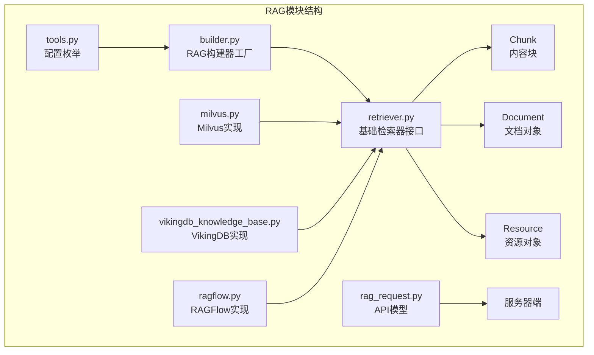
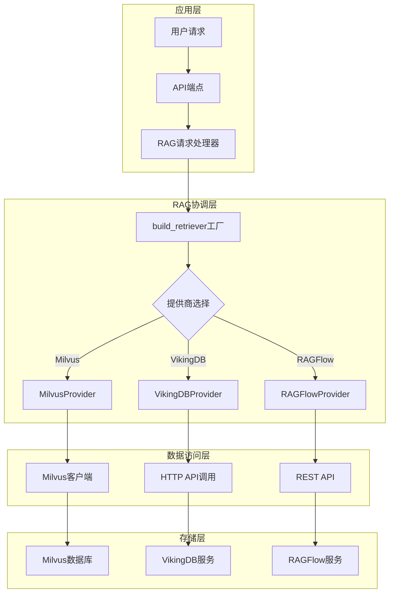
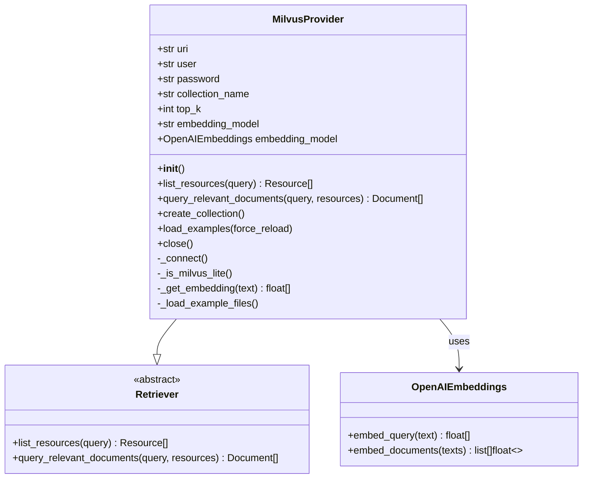
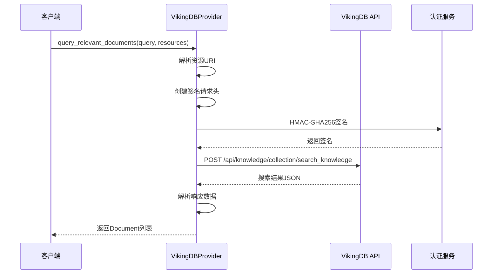
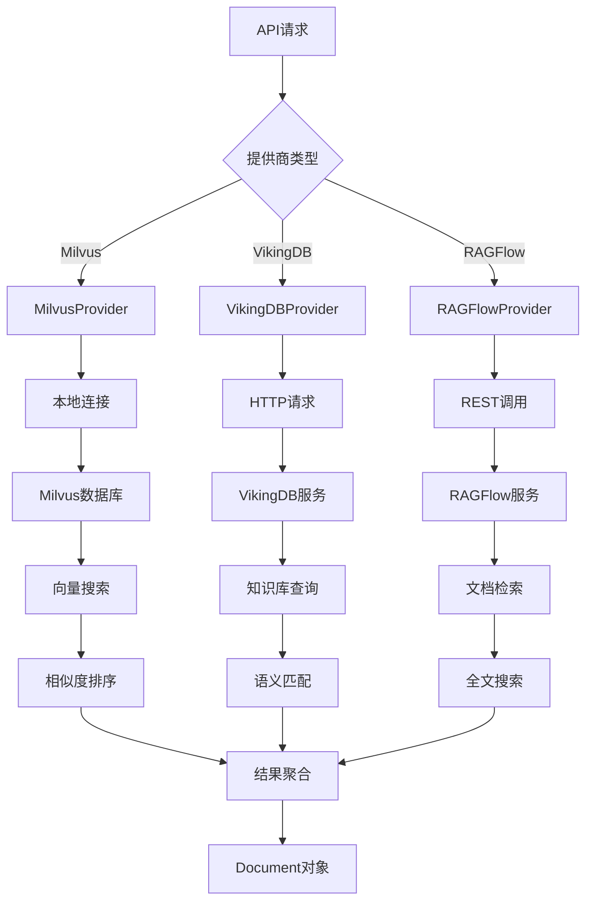
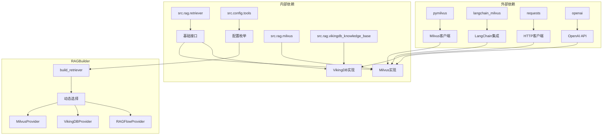

# RAG构建器

<cite>
**本文档中引用的文件**
- [builder.py](file://src/rag/builder.py)
- [retriever.py](file://src/rag/retriever.py)
- [milvus.py](file://src/rag/milvus.py)
- [vikingdb_knowledge_base.py](file://src/rag/vikingdb_knowledge_base.py)
- [tools.py](file://src/config/tools.py)
- [rag_request.py](file://src/server/rag_request.py)
- [test_milvus.py](file://tests/unit/rag/test_milvus.py)
- [test_vikingdb_knowledge_base.py](file://tests/unit/rag/test_vikingdb_knowledge_base.py)
</cite>

## 目录
1. [简介](#简介)
2. [项目结构](#项目结构)
3. [核心组件](#核心组件)
4. [架构概览](#架构概览)
5. [详细组件分析](#详细组件分析)
6. [依赖关系分析](#依赖关系分析)
7. [性能考虑](#性能考虑)
8. [故障排除指南](#故障排除指南)
9. [结论](#结论)

## 简介

RAGBuilder是DeerFlow RAG系统的核心协调者，负责根据配置选择合适的向量数据库提供商，并初始化相应的检索器组件。该系统支持多种向量数据库后端，包括Milvus、VikingDB知识库和RAGFlow，为用户提供灵活的RAG解决方案。

RAGBuilder采用工厂模式设计，通过统一的接口抽象不同向量数据库的复杂性，使上层应用能够无缝切换不同的RAG提供商。这种设计不仅提高了系统的可扩展性，还简化了配置管理和部署流程。

## 项目结构

RAG模块位于`src/rag/`目录下，包含以下核心文件：



**图表来源**
- [builder.py](file://src/rag/builder.py#L1-L21)
- [retriever.py](file://src/rag/retriever.py#L1-L82)
- [milvus.py](file://src/rag/milvus.py#L1-L786)
- [vikingdb_knowledge_base.py](file://src/rag/vikingdb_knowledge_base.py#L1-L300)

**章节来源**
- [builder.py](file://src/rag/builder.py#L1-L21)
- [retriever.py](file://src/rag/retriever.py#L1-L82)

## 核心组件

### RAGBuilder工厂函数

RAGBuilder的核心是一个简单的工厂函数`build_retriever()`，它根据环境变量中的配置选择合适的RAG提供商：

```python
def build_retriever() -> Retriever | None:
    if SELECTED_RAG_PROVIDER == RAGProvider.RAGFLOW.value:
        return RAGFlowProvider()
    elif SELECTED_RAG_PROVIDER == RAGProvider.VIKINGDB_KNOWLEDGE_BASE.value:
        return VikingDBKnowledgeBaseProvider()
    elif SELECTED_RAG_PROVIDER == RAGProvider.MILVUS.value:
        return MilvusProvider()
    elif SELECTED_RAG_PROVIDER:
        raise ValueError(f"Unsupported RAG provider: {SELECTED_RAG_PROVIDER}")
    return None
```

这个函数实现了以下功能：
- **动态提供商选择**：根据`RAG_PROVIDER`环境变量自动选择合适的提供商
- **类型安全**：返回统一的`Retriever`接口类型
- **错误处理**：对不支持的提供商抛出明确的异常
- **空值处理**：当未设置提供商时返回None

### 基础检索器接口

所有RAG提供商都继承自`Retriever`抽象基类，确保了一致的接口：

```python
class Retriever(abc.ABC):
    @abc.abstractmethod
    def list_resources(self, query: str | None = None) -> list[Resource]:
        """从RAG提供商列出资源"""
        pass

    @abc.abstractmethod
    def query_relevant_documents(
        self, query: str, resources: list[Resource] = []
    ) -> list[Document]:
        """查询相关文档"""
        pass
```

**章节来源**
- [builder.py](file://src/rag/builder.py#L10-L20)
- [retriever.py](file://src/rag/retriever.py#L48-L82)

## 架构概览

RAGBuilder采用分层架构设计，将复杂的向量数据库操作封装在各个提供商实现中：



**图表来源**
- [builder.py](file://src/rag/builder.py#L10-L20)
- [milvus.py](file://src/rag/milvus.py#L50-L150)
- [vikingdb_knowledge_base.py](file://src/rag/vikingdb_knowledge_base.py#L15-L50)

## 详细组件分析

### MilvusProvider实现

MilvusProvider是最复杂的RAG提供商实现，支持本地和远程两种部署模式：



**图表来源**
- [milvus.py](file://src/rag/milvus.py#L50-L150)
- [retriever.py](file://src/rag/retriever.py#L48-L82)

#### 初始化过程

MilvusProvider的初始化过程包括多个步骤：

1. **环境变量配置**：
   ```python
   self.uri: str = get_str_env("MILVUS_URI", "http://localhost:19530")
   self.user: str = get_str_env("MILVUS_USER")
   self.password: str = get_str_env("MILVUS_PASSWORD")
   self.collection_name: str = get_str_env("MILVUS_COLLECTION", "documents")
   ```

2. **嵌入模型初始化**：
   ```python
   def _init_embedding_model(self) -> None:
       kwargs = {
           "api_key": self.embedding_api_key,
           "model": self.embedding_model,
           "base_url": self.embedding_base_url,
           "encoding_format": "float",
           "dimensions": self.embedding_dim,
       }
       if self.embedding_provider.lower() == "openai":
           self.embedding_model = OpenAIEmbeddings(**kwargs)
       elif self.embedding_provider.lower() == "dashscope":
           self.embedding_model = DashscopeEmbeddings(**kwargs)
   ```

3. **连接建立**：
   ```python
   def _connect(self) -> None:
       if self._is_milvus_lite():
           self.client = MilvusClient(self.uri)
           self._ensure_collection_exists()
       else:
           self.client = LangchainMilvus(
               embedding_function=self.embedding_model,
               collection_name=self.collection_name,
               connection_args=connection_args,
               drop_old=False,
           )
   ```

#### 配置参数管理

MilvusProvider支持丰富的配置参数：

- **连接参数**：URI、用户名、密码
- **集合参数**：集合名称、字段映射
- **搜索参数**：top_k结果数、向量字段名
- **嵌入参数**：模型名称、API密钥、提供商类型
- **示例参数**：自动加载、示例目录

### VikingDBProvider实现

VikingDBProvider专注于云原生知识库服务：



**图表来源**
- [vikingdb_knowledge_base.py](file://src/rag/vikingdb_knowledge_base.py#L150-L250)

#### 认证机制

VikingDBProvider实现了AWS风格的签名认证：

```python
def _create_signature(self, method, path, query_params, headers, payload):
    now = datetime.utcnow()
    date_stamp = now.strftime("%Y%m%dT%H%M%SZ")
    auth_date = date_stamp[:8]
    
    headers["X-Date"] = date_stamp
    headers["Host"] = self.api_url.replace("https://", "").replace("http://", "")
    headers["X-Content-Sha256"] = self._hash_sha256(payload).hex()
    headers["Content-Type"] = "application/json"
    
    # 创建规范请求
    canonical_request, signed_headers = self._create_canonical_request(
        method, path, query_params, headers, payload
    )
    
    # 生成签名
    algorithm = "HMAC-SHA256"
    credential_scope = f"{auth_date}/{self.region}/{self.service}/request"
    canonical_request_hash = self._hash_sha256(
        canonical_request.encode("utf-8")
    ).hex()
    
    string_to_sign = "\n".join([
        algorithm, date_stamp, credential_scope, canonical_request_hash
    ])
    
    signing_key = self._get_signed_key(
        self.api_sk, auth_date, self.region, self.service
    )
    signature = hmac.new(
        signing_key, string_to_sign.encode("utf-8"), hashlib.sha256
    ).hexdigest()
    
    return f"{algorithm} Credential={self.api_ak}/{credential_scope}, SignedHeaders={signed_headers}, Signature={signature}"
```

**章节来源**
- [milvus.py](file://src/rag/milvus.py#L50-L200)
- [vikingdb_knowledge_base.py](file://src/rag/vikingdb_knowledge_base.py#L15-L100)

### 组件间通信模式

RAG系统采用事件驱动的通信模式：



**图表来源**
- [builder.py](file://src/rag/builder.py#L10-L20)
- [milvus.py](file://src/rag/milvus.py#L600-L700)
- [vikingdb_knowledge_base.py](file://src/rag/vikingdb_knowledge_base.py#L150-L250)

## 依赖关系分析

RAGBuilder的依赖关系体现了清晰的分层架构：



**图表来源**
- [builder.py](file://src/rag/builder.py#L1-L10)
- [milvus.py](file://src/rag/milvus.py#L1-L20)
- [vikingdb_knowledge_base.py](file://src/rag/vikingdb_knowledge_base.py#L1-L15)

**章节来源**
- [builder.py](file://src/rag/builder.py#L1-L21)
- [milvus.py](file://src/rag/milvus.py#L1-L30)
- [vikingdb_knowledge_base.py](file://src/rag/vikingdb_knowledge_base.py#L1-L30)

## 性能考虑

### 连接池配置

对于高并发场景，建议配置连接池：

```python
# Milvus连接池配置
MILVUS_POOL_SIZE = 10
MILVUS_MAX_CONNECTIONS = 50

# VikingDB连接超时配置
VIKINGDB_TIMEOUT = 30
VIKINGDB_RETRY_COUNT = 3
```

### 缓存策略

实施多级缓存策略以提高性能：

1. **嵌入缓存**：缓存常用查询的向量表示
2. **结果缓存**：缓存热门查询的结果
3. **元数据缓存**：缓存集合元数据信息

### 查询优化

- **批量查询**：支持批量文档检索
- **索引优化**：合理配置Milvus索引参数
- **相似度阈值**：设置合适的相似度过滤阈值

## 故障排除指南

### 常见配置错误

#### Milvus连接失败

**症状**：无法连接到Milvus服务器或数据库

**解决方案**：
```bash
# 检查环境变量
echo $MILVUS_URI
echo $MILVUS_COLLECTION

# 验证网络连接
telnet localhost 19530

# 检查数据库状态
docker ps | grep milvus
```

#### VikingDB认证失败

**症状**：API请求返回认证错误

**解决方案**：
```bash
# 验证API密钥
echo $VIKINGDB_KNOWLEDGE_BASE_API_AK
echo $VIKINGDB_KNOWLEDGE_BASE_API_SK

# 检查时间同步
date

# 验证区域配置
echo $VIKINGDB_KNOWLEDGE_BASE_REGION
```

#### 不支持的提供商

**症状**：`ValueError: Unsupported RAG provider`

**解决方案**：
```python
# 检查可用提供商
from src.config.tools import RAGProvider
print([p.value for p in RAGProvider])

# 设置正确的提供商
export RAG_PROVIDER=milvus
# 或
export RAG_PROVIDER=vikingdb_knowledge_base
```

### 性能问题诊断

#### 查询响应缓慢

1. **检查索引状态**：
   ```python
   # Milvus索引检查
   retriever = MilvusProvider()
   retriever._connect()
   print(retriever.client.describe_index(collection_name=retriever.collection_name))
   ```

2. **监控内存使用**：
   ```bash
   # 查看内存使用情况
   free -h
   
   # 检查进程内存
   ps aux | grep python
   ```

3. **分析查询日志**：
   ```python
   import logging
   logging.getLogger('src.rag.milvus').setLevel(logging.DEBUG)
   ```

**章节来源**
- [milvus.py](file://src/rag/milvus.py#L600-L700)
- [vikingdb_knowledge_base.py](file://src/rag/vikingdb_knowledge_base.py#L250-L300)

## 结论

RAGBuilder作为DeerFlow RAG系统的核心协调者，通过精心设计的架构提供了高度可扩展和可维护的解决方案。其主要优势包括：

1. **统一接口**：通过抽象基类确保所有提供商的一致性
2. **灵活配置**：支持多种向量数据库和嵌入模型
3. **错误处理**：完善的异常处理和错误恢复机制
4. **性能优化**：支持连接池、缓存和批量操作
5. **易于扩展**：新的RAG提供商可以轻松集成

未来的发展方向包括：
- 支持更多向量数据库提供商
- 实施更智能的负载均衡策略
- 增强监控和可观测性功能
- 优化大规模部署的性能

通过遵循本文档提供的最佳实践和故障排除指南，开发者可以有效地部署和维护基于RAGBuilder的RAG系统。