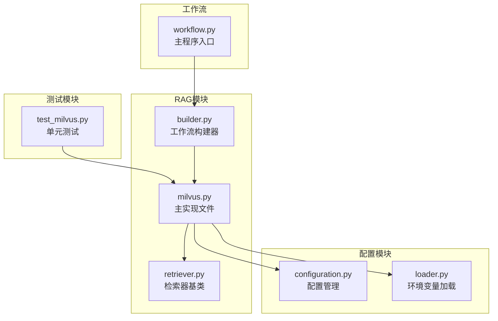
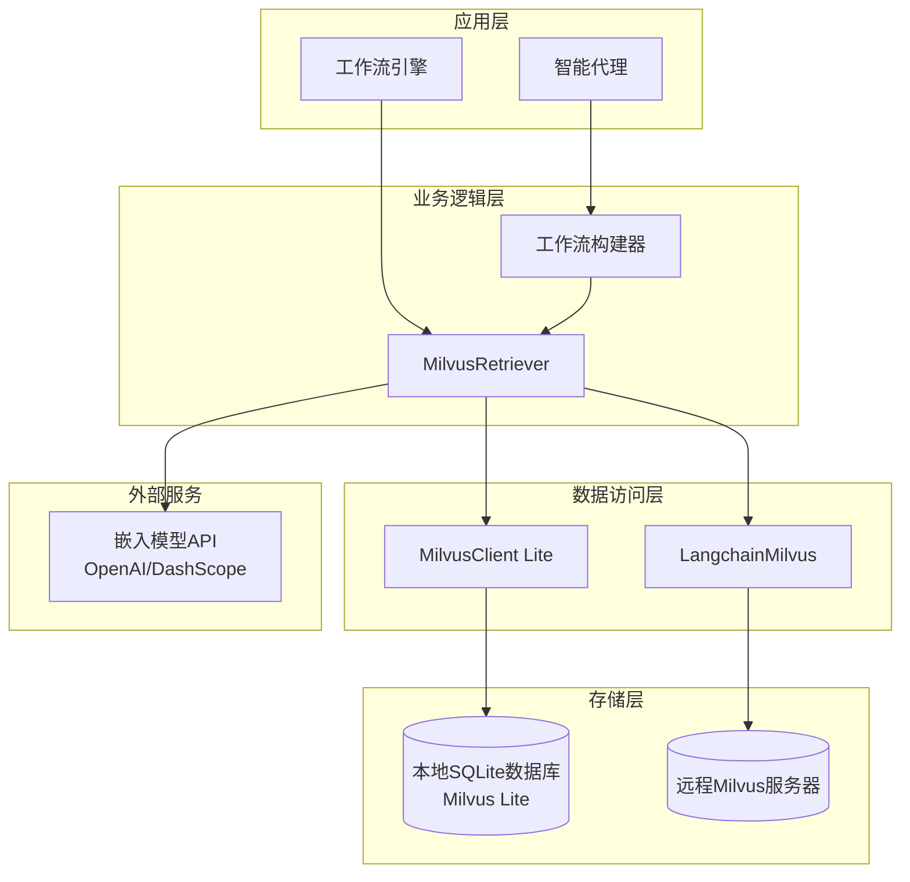
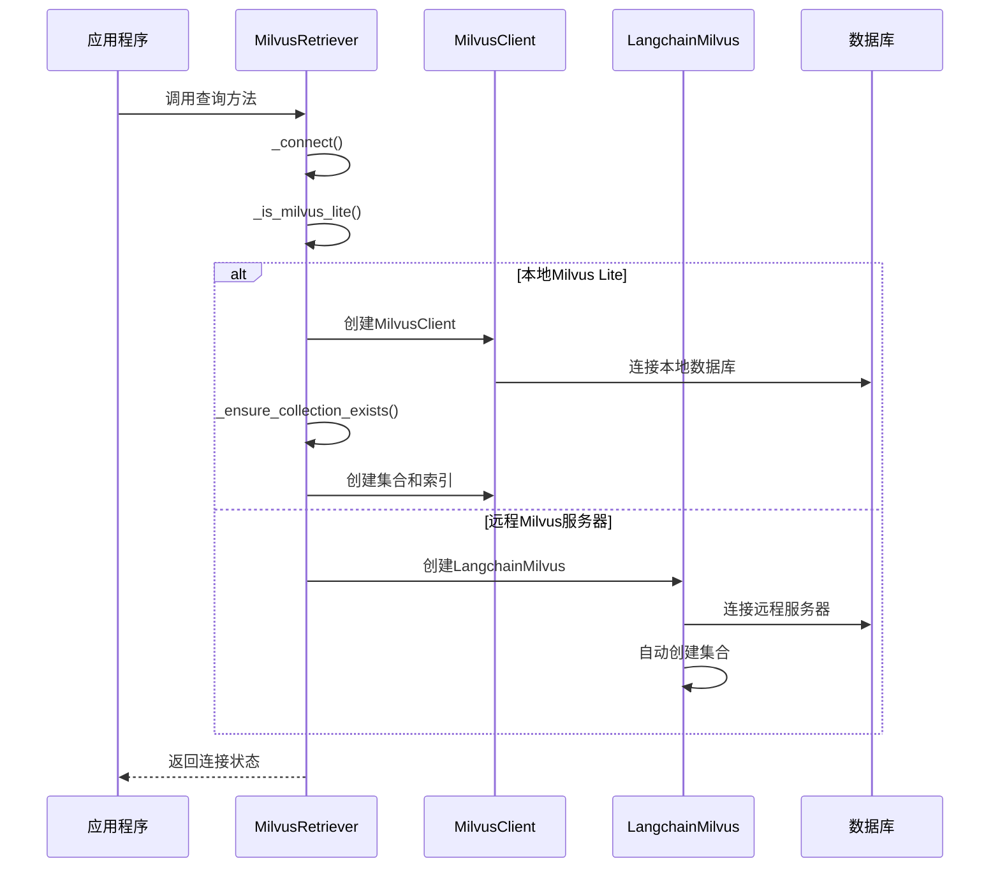
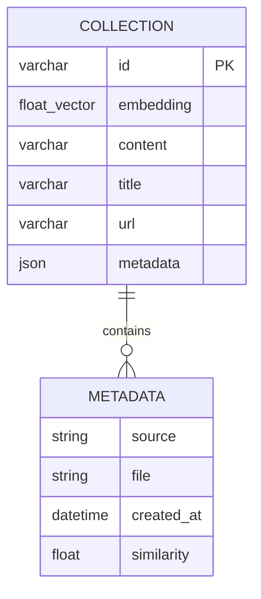
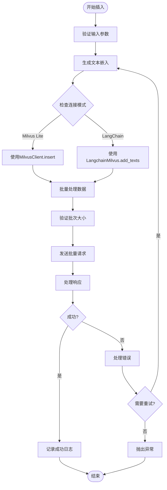
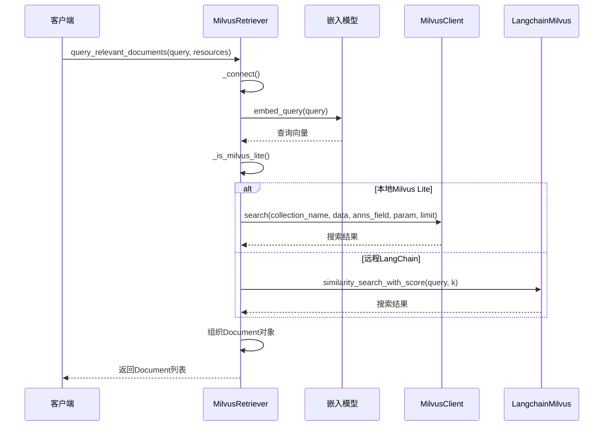
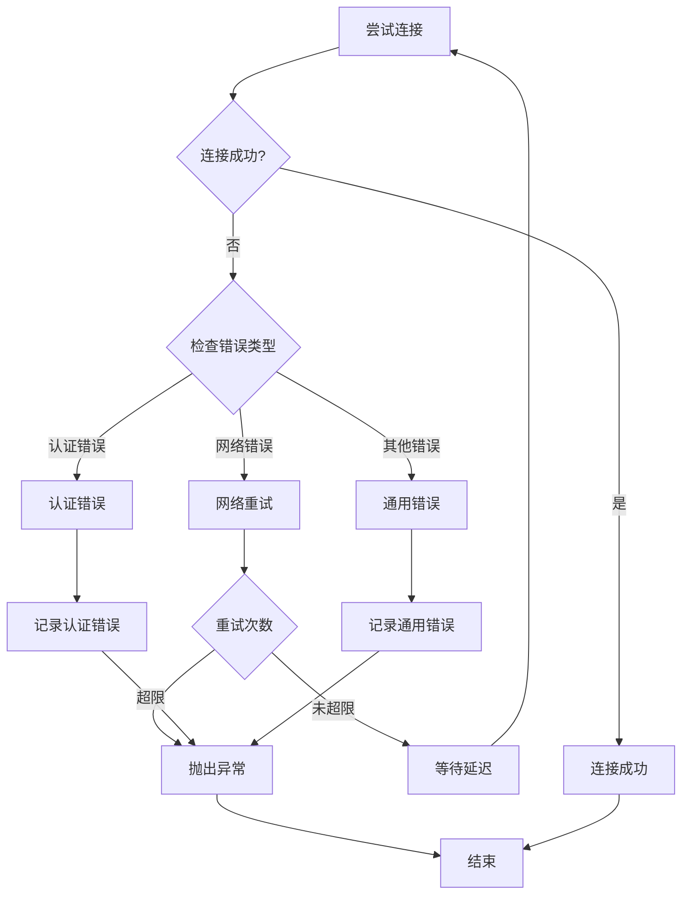
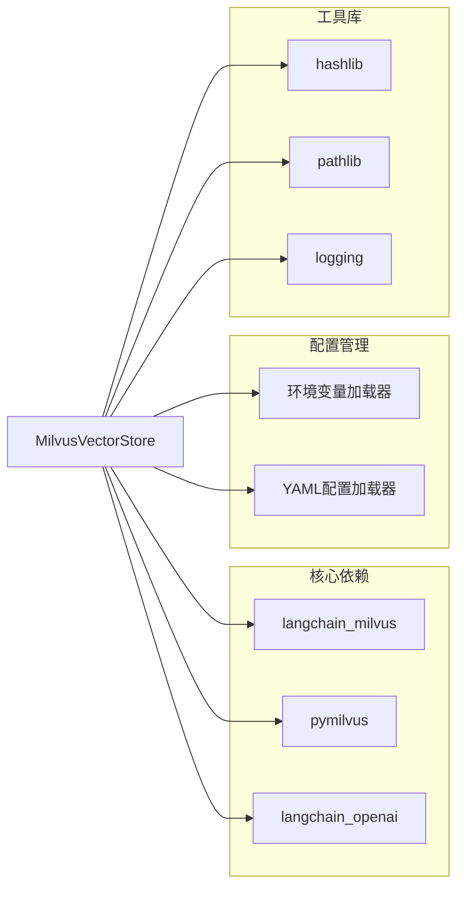
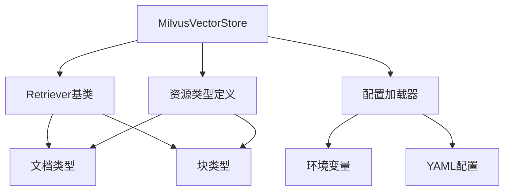

# Milvus向量存储

<cite>
**本文档引用的文件**
- [milvus.py](file://src/rag/milvus.py)
- [test_milvus.py](file://tests/unit/rag/test_milvus.py)
- [loader.py](file://src/config/loader.py)
- [configuration.py](file://src/config/configuration.py)
- [workflow.py](file://src/workflow.py)
</cite>

## 目录
1. [简介](#简介)
2. [项目结构](#项目结构)
3. [核心组件](#核心组件)
4. [架构概览](#架构概览)
5. [详细组件分析](#详细组件分析)
6. [依赖关系分析](#依赖关系分析)
7. [性能考虑](#性能考虑)
8. [故障排除指南](#故障排除指南)
9. [结论](#结论)

## 简介

MilvusVectorStore是DeerFlow项目中的核心向量数据库组件，基于Milvus构建，专门用于处理向量相似性搜索和大规模文档检索任务。该组件提供了完整的向量存储解决方案，支持本地Milvus Lite和远程Milvus服务器两种部署模式，具备自动连接管理、智能索引优化和批量数据处理能力。

MilvusVectorStore的设计目标是为DeerFlow的RAG（检索增强生成）系统提供高性能的向量存储和检索服务，支持多种嵌入模型，并具备完善的错误处理和资源管理机制。

## 项目结构

MilvusVectorStore在DeerFlow项目中的组织结构如下：



**图表来源**
- [milvus.py](file://src/rag/milvus.py#L1-L50)
- [retriever.py](file://src/rag/retriever.py)
- [builder.py](file://src/graph/builder.py)

**章节来源**
- [milvus.py](file://src/rag/milvus.py#L1-L786)
- [test_milvus.py](file://tests/unit/rag/test_milvus.py#L1-L825)

## 核心组件

### MilvusRetriever类

MilvusRetriever是MilvusVectorStore的核心实现类，继承自Retriever基类，负责管理与Milvus数据库的连接、数据插入、查询检索等核心功能。

#### 主要特性：
- **双模式支持**：同时支持Milvus Lite（本地文件数据库）和远程Milvus服务器
- **智能连接管理**：根据URI自动识别部署模式并建立相应连接
- **动态字段支持**：启用动态字段以支持任意元数据存储
- **批量处理**：支持批量插入和查询操作
- **资源管理**：提供完整的生命周期管理

#### 关键属性：
- `uri`: 连接URI或本地数据库文件路径
- `collection_name`: 集合名称，默认为"documents"
- `embedding_model`: 嵌入模型实例
- `top_k`: 查询结果数量限制
- `vector_field`: 向量字段名称
- `id_field`: 文档ID字段名称

**章节来源**
- [milvus.py](file://src/rag/milvus.py#L67-L91)
- [milvus.py](file://src/rag/milvus.py#L368-L396)

### DashscopeEmbeddings类

DashscopeEmbeddings是一个兼容OpenAI接口的嵌入模型包装器，用于支持阿里云DashScope服务的文本嵌入功能。

#### 特性：
- **OpenAI兼容接口**：提供与OpenAIEmbeddings相同的接口
- **多提供商支持**：支持OpenAI和DashScope两种嵌入服务
- **灵活配置**：支持自定义API密钥、基础URL和编码格式
- **错误处理**：完善的异常处理和输入验证

**章节来源**
- [milvus.py](file://src/rag/milvus.py#L25-L55)

## 架构概览

MilvusVectorStore采用分层架构设计，确保了系统的可扩展性和维护性：



**图表来源**
- [milvus.py](file://src/rag/milvus.py#L368-L396)
- [workflow.py](file://src/workflow.py#L1-L50)

## 详细组件分析

### 连接管理机制

#### 自动连接检测

MilvusVectorStore实现了智能的连接模式检测机制：

```python
def _is_milvus_lite(self) -> bool:
    """判断是否使用Milvus Lite（本地文件数据库）"""
    return self.uri.endswith(".db") or (
        not self.uri.startswith(("http://", "https://")) and "://" not in self.uri
    )
```

该方法通过以下规则判断连接类型：
- **本地文件模式**：URI以`.db`结尾或不包含HTTP/HTTPS协议
- **远程服务器模式**：包含HTTP/HTTPS协议头

#### 连接建立流程



**图表来源**
- [milvus.py](file://src/rag/milvus.py#L368-L396)

**章节来源**
- [milvus.py](file://src/rag/milvus.py#L368-L396)

### 集合创建与管理

#### 集合模式检测

MilvusVectorStore支持两种不同的集合管理模式：

1. **Milvus Lite模式**：手动创建集合和索引
2. **LangChain模式**：由LangChain自动管理

#### 索引配置

对于Milvus Lite，系统默认配置以下索引参数：

```python
index_params = {
    "field_name": self.vector_field,
    "index_type": "IVF_FLAT",
    "metric_type": "IP",
    "params": {"nlist": 1024},
}
```

- **索引类型**：IVF_FLAT（倒排文件）
- **相似度度量**：内积（IP）
- **聚类中心数**：1024

#### 字段定义

集合的Schema定义包含以下字段：



**图表来源**
- [milvus.py](file://src/rag/milvus.py#L120-L140)

**章节来源**
- [milvus.py](file://src/rag/milvus.py#L120-L140)
- [milvus.py](file://src/rag/milvus.py#L142-L160)

### 数据插入机制

#### 批量插入优化

MilvusVectorStore实现了高效的批量数据插入机制：



**图表来源**
- [milvus.py](file://src/rag/milvus.py#L320-L366)

#### ID生成策略

系统采用稳定的文档ID生成策略：

```python
def _generate_doc_id(self, file_path: Path) -> str:
    """从文件名、大小和修改时间生成稳定标识符"""
    file_stat = file_path.stat()
    content_hash = hashlib.md5(
        f"{file_path.name}_{file_stat.st_size}_{file_stat.st_mtime}".encode()
    ).hexdigest()[:8]
    return f"example_{file_path.stem}_{content_hash}"
```

该策略确保：
- **唯一性**：基于文件内容和元数据生成唯一ID
- **稳定性**：相同内容的文件始终生成相同ID
- **可追溯**：ID包含原始文件名信息

**章节来源**
- [milvus.py](file://src/rag/milvus.py#L320-L366)
- [milvus.py](file://src/rag/milvus.py#L200-L210)

### 相似度搜索功能

#### 查询流程



**图表来源**
- [milvus.py](file://src/rag/milvus.py#L500-L580)

#### 参数配置

搜索功能支持以下关键参数：

- **top_k**：结果数量限制，默认10
- **metric_type**：相似度度量类型（IP、L2、Cosine）
- **nprobe**：搜索精度参数
- **过滤条件**：支持基于元数据的过滤

**章节来源**
- [milvus.py](file://src/rag/milvus.py#L500-L580)

### 错误处理机制

#### 连接失败重试

MilvusVectorStore实现了多层次的错误处理机制：



**图表来源**
- [milvus.py](file://src/rag/milvus.py#L368-L396)

#### 异常分类处理

系统对不同类型的异常进行分类处理：

1. **连接异常**：ConnectionError，包含详细的错误信息
2. **嵌入异常**：RuntimeError，处理嵌入生成失败
3. **查询异常**：RuntimeError，处理搜索操作失败
4. **资源异常**：ResourceError，处理资源获取失败

**章节来源**
- [milvus.py](file://src/rag/milvus.py#L368-L396)

## 依赖关系分析

### 外部依赖

MilvusVectorStore依赖以下外部库：



**图表来源**
- [milvus.py](file://src/rag/milvus.py#L1-L20)
- [loader.py](file://src/config/loader.py#L1-L79)

### 内部依赖

内部模块间的依赖关系：



**图表来源**
- [milvus.py](file://src/rag/milvus.py#L1-L20)
- [configuration.py](file://src/config/configuration.py#L1-L71)

**章节来源**
- [milvus.py](file://src/rag/milvus.py#L1-L20)
- [loader.py](file://src/config/loader.py#L1-L79)

## 性能考虑

### 索引优化

MilvusVectorStore针对不同使用场景提供了多种索引优化策略：

1. **IVF_FLAT索引**：适用于大规模数据集，平衡查询速度和内存使用
2. **HNSW索引**：适用于高维向量，提供更好的查询精度
3. **自适应索引选择**：根据数据规模自动调整索引参数

### 缓存策略

- **连接池管理**：避免频繁的连接建立和销毁
- **嵌入缓存**：缓存常用文本的嵌入向量
- **查询结果缓存**：缓存高频查询的结果

### 批量处理

- **批量插入**：支持批量数据插入，减少网络开销
- **批量查询**：支持批量查询操作，提高吞吐量
- **异步处理**：支持异步操作，提升并发性能

## 故障排除指南

### 常见问题及解决方案

#### 连接问题

**问题**：无法连接到Milvus服务器
**解决方案**：
1. 检查URI配置是否正确
2. 验证网络连通性
3. 确认防火墙设置
4. 检查认证凭据

#### 性能问题

**问题**：查询响应缓慢
**解决方案**：
1. 调整nprobe参数
2. 优化索引配置
3. 增加硬件资源
4. 实施查询缓存

#### 存储问题

**问题**：磁盘空间不足
**解决方案**：
1. 清理过期数据
2. 优化数据结构
3. 增加存储容量
4. 实施数据压缩

**章节来源**
- [milvus.py](file://src/rag/milvus.py#L368-L396)

## 结论

MilvusVectorStore作为DeerFlow项目的核心组件，提供了完整而强大的向量存储和检索功能。其设计充分考虑了生产环境的需求，具备以下优势：

1. **灵活性**：支持本地和远程两种部署模式
2. **高性能**：优化的索引策略和批量处理机制
3. **可靠性**：完善的错误处理和资源管理
4. **易用性**：简洁的API接口和丰富的配置选项

通过合理配置和使用MilvusVectorStore，可以为DeerFlow的RAG系统提供高效、稳定的向量存储服务，满足大规模文档检索和相似性搜索的需求。