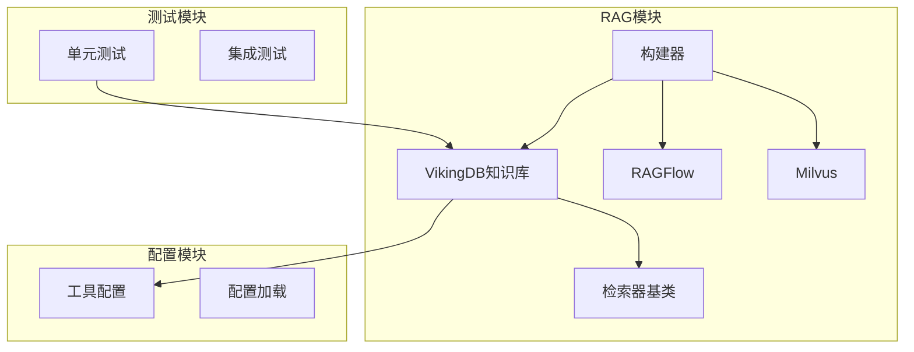
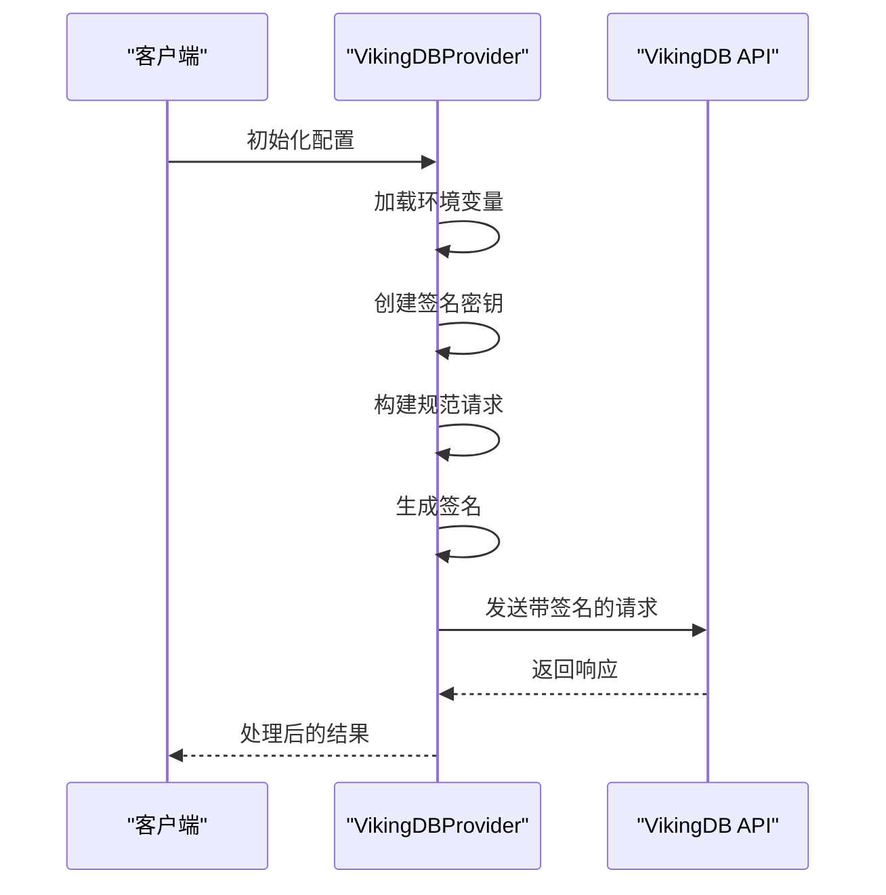
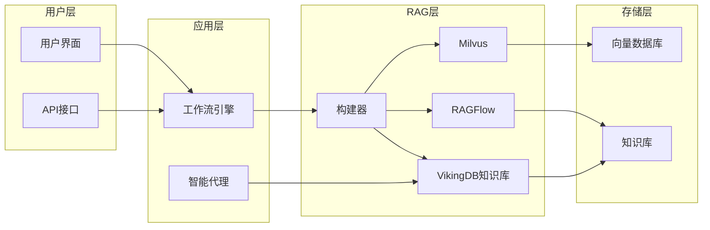
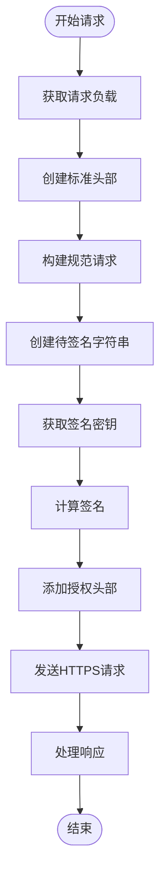
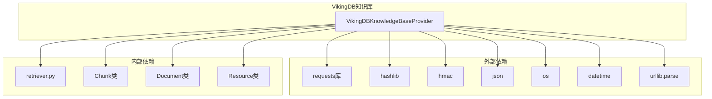

# VikingDB知识库集成技术文档

<cite>
**本文档引用的文件**
- [vikingdb_knowledge_base.py](file://src/rag/vikingdb_knowledge_base.py)
- [retriever.py](file://src/rag/retriever.py)
- [builder.py](file://src/rag/builder.py)
- [tools.py](file://src/config/tools.py)
- [test_vikingdb_knowledge_base.py](file://tests/unit/rag/test_vikingdb_knowledge_base.py)
</cite>

## 目录
1. [简介](#简介)
2. [项目结构](#项目结构)
3. [核心组件](#核心组件)
4. [架构概览](#架构概览)
5. [详细组件分析](#详细组件分析)
6. [依赖关系分析](#依赖关系分析)
7. [性能考虑](#性能考虑)
8. [故障排除指南](#故障排除指南)
9. [结论](#结论)

## 简介

VikingDB知识库是DeerFlow项目中的一个重要组件，它提供了基于VikingDB服务的知识库检索功能。该组件通过API密钥认证机制与VikingDB服务进行安全通信，实现了高效的文档检索和知识管理功能。

VikingDB知识库集成主要包含以下核心功能：
- 基于API密钥的安全认证
- 高效的文档检索和查询处理
- 支持多资源并行查询
- 智能的结果排序和相关性评分
- 完善的错误处理和重试机制

## 项目结构

VikingDB知识库的实现位于`src/rag`目录下，与其他RAG组件协同工作：



**图表来源**
- [vikingdb_knowledge_base.py](file://src/rag/vikingdb_knowledge_base.py#L1-L300)
- [builder.py](file://src/rag/builder.py#L1-L21)
- [retriever.py](file://src/rag/retriever.py#L1-L82)

**章节来源**
- [vikingdb_knowledge_base.py](file://src/rag/vikingdb_knowledge_base.py#L1-L300)
- [builder.py](file://src/rag/builder.py#L1-L21)

## 核心组件

### VikingDBKnowledgeBaseProvider类

`VikingDBKnowledgeBaseProvider`是VikingDB知识库的核心实现类，继承自`Retriever`抽象基类。该类负责与VikingDB服务进行交互，提供文档检索和资源列表功能。

```python
class VikingDBKnowledgeBaseProvider(Retriever):
    """
    VikingDBKnowledgeBaseProvider is a provider that uses VikingDB Knowledge base API to retrieve documents.
    """
    
    api_url: str          # API端点URL
    api_ak: str           # API访问密钥
    api_sk: str           # API秘密密钥
    retrieval_size: int = 10  # 检索结果数量
    region: str = "cn-north-1"  # 区域设置
    service: str = "air"     # 服务标识
```

### 认证机制

VikingDB知识库采用基于HMAC-SHA256的签名认证机制：



**图表来源**
- [vikingdb_knowledge_base.py](file://src/rag/vikingdb_knowledge_base.py#L100-L150)

**章节来源**
- [vikingdb_knowledge_base.py](file://src/rag/vikingdb_knowledge_base.py#L18-L50)

## 架构概览

VikingDB知识库在整个RAG系统中的位置和作用：



**图表来源**
- [builder.py](file://src/rag/builder.py#L10-L21)
- [vikingdb_knowledge_base.py](file://src/rag/vikingdb_knowledge_base.py#L18-L30)

## 详细组件分析

### 初始化和配置

VikingDB知识库通过环境变量进行配置，确保安全性：

```python
def __init__(self):
    # 必需的环境变量
    api_url = os.getenv("VIKINGDB_KNOWLEDGE_BASE_API_URL")
    if not api_url:
        raise ValueError("VIKINGDB_KNOWLEDGE_BASE_API_URL is not set")
    self.api_url = api_url

    api_ak = os.getenv("VIKINGDB_KNOWLEDGE_BASE_API_AK")
    if not api_ak:
        raise ValueError("VIKINGDB_KNOWLEDGE_BASE_API_AK is not set")
    self.api_ak = api_ak

    api_sk = os.getenv("VIKINGDB_KNOWLEDGE_BASE_API_SK")
    if not api_sk:
        raise ValueError("VIKINGDB_KNOWLEDGE_BASE_API_SK is not set")
    self.api_sk = api_sk

    # 可选配置
    retrieval_size = os.getenv("VIKINGDB_KNOWLEDGE_BASE_RETRIEVAL_SIZE")
    if retrieval_size:
        self.retrieval_size = int(retrieval_size)

    region = os.getenv("VIKINGDB_KNOWLEDGE_BASE_REGION", "cn-north-1")
    self.region = region
```

### API认证流程

VikingDB知识库实现了完整的AWS Signature V4兼容的认证流程：



**图表来源**
- [vikingdb_knowledge_base.py](file://src/rag/vikingdb_knowledge_base.py#L100-L180)

### 文档检索实现

`query_relevant_documents`方法实现了智能的文档检索功能：

```python
def query_relevant_documents(self, query: str, resources: list[Resource] = []) -> list[Document]:
    """
    Query relevant documents from the knowledge base
    """
    if not resources:
        return []

    all_documents = {}
    for resource in resources:
        resource_id, document_id = parse_uri(resource.uri)
        request_params = {
            "resource_id": resource_id,
            "query": query,
            "limit": self.retrieval_size,
            "dense_weight": 0.5,
            "pre_processing": {
                "need_instruction": True,
                "rewrite": False,
                "return_token_usage": True,
            },
            "post_processing": {
                "rerank_switch": True,
                "chunk_diffusion_count": 0,
                "chunk_group": True,
                "get_attachment_link": True,
            },
        }
        
        # 如果有文档ID，则添加过滤条件
        if document_id:
            doc_filter = {"op": "must", "field": "doc_id", "conds": [document_id]}
            query_param = {"doc_filter": doc_filter}
            request_params["query_param"] = query_param

        # 发送请求并处理结果
        response = self._make_signed_request(
            method="POST", path=path, data=request_params
        )
        
        # 解析响应并构建文档对象
        # ...
```

### 资源管理

`list_resources`方法提供了知识库资源的列表功能：

```python
def list_resources(self, query: str | None = None) -> list[Resource]:
    """
    List resources (knowledge bases) from the knowledge base service
    """
    path = "/api/knowledge/collection/list"
    response = self._make_signed_request(method="POST", path=path)

    try:
        response_data = response.json()
    except json.JSONDecodeError as e:
        raise ValueError(f"Failed to parse JSON response: {e}")

    if response_data["code"] != 0:
        raise Exception(f"Failed to list resources: {response_data['message']}")

    resources = []
    rsp_data = response_data.get("data", {})
    collection_list = rsp_data.get("collection_list", [])
    
    for item in collection_list:
        collection_name = item.get("collection_name", "")
        description = item.get("description", "")

        if query and query.lower() not in collection_name.lower():
            continue

        resource_id = item.get("resource_id", "")
        resource = Resource(
            uri=f"rag://dataset/{resource_id}",
            title=collection_name,
            description=description,
        )
        resources.append(resource)

    return resources
```

**章节来源**
- [vikingdb_knowledge_base.py](file://src/rag/vikingdb_knowledge_base.py#L50-L300)

## 依赖关系分析

VikingDB知识库的依赖关系图：



**图表来源**
- [vikingdb_knowledge_base.py](file://src/rag/vikingdb_knowledge_base.py#L1-L15)

**章节来源**
- [vikingdb_knowledge_base.py](file://src/rag/vikingdb_knowledge_base.py#L1-L15)

## 性能考虑

### 查询优化策略

1. **批量处理**: 支持同时查询多个资源，减少网络往返次数
2. **结果合并**: 自动合并来自不同资源的相同文档
3. **智能过滤**: 支持文档级别的精确过滤，减少不必要的数据传输
4. **缓存友好**: 结果按文档ID去重，避免重复处理

### 并发控制

- 默认超时设置为30秒，防止长时间等待
- 支持可配置的检索结果数量，平衡性能和精度
- 实现了优雅的错误处理，避免单个失败影响整体性能

### 资源管理

- 使用连接池和适当的超时设置
- 实现了重试机制处理临时网络问题
- 提供详细的日志记录便于性能监控

## 故障排除指南

### 常见错误及解决方案

1. **认证失败**
   - 检查API密钥是否正确配置
   - 验证环境变量名称：`VIKINGDB_KNOWLEDGE_BASE_API_AK` 和 `VIKINGDB_KNOWLEDGE_BASE_API_SK`
   - 确认API URL格式正确

2. **网络连接问题**
   - 检查网络连接状态
   - 验证防火墙设置
   - 确认超时时间设置合理

3. **API响应错误**
   - 检查API返回的状态码和错误消息
   - 验证请求参数格式
   - 确认资源ID的有效性

### 调试技巧

```python
# 启用详细日志记录
import logging
logging.basicConfig(level=logging.DEBUG)

# 测试连接
try:
    provider = VikingDBKnowledgeBaseProvider()
    resources = provider.list_resources()
    print(f"成功获取 {len(resources)} 个资源")
except Exception as e:
    print(f"连接失败: {e}")
```

**章节来源**
- [test_vikingdb_knowledge_base.py](file://tests/unit/rag/test_vikingdb_knowledge_base.py#L142-L213)

## 结论

VikingDB知识库集成为DeerFlow项目提供了强大而灵活的知识检索能力。通过完善的认证机制、高效的查询处理和智能的结果管理，该组件能够满足现代RAG系统对知识库集成的各种需求。

主要优势包括：
- **安全性**: 基于HMAC-SHA256的完整认证机制
- **性能**: 批量处理和智能过滤优化查询效率
- **可靠性**: 完善的错误处理和重试机制
- **可扩展性**: 支持多资源并行查询和动态配置

未来改进方向：
- 实现查询结果缓存机制
- 添加更多高级过滤和排序选项
- 优化大规模数据集的处理性能
- 增强监控和指标收集功能