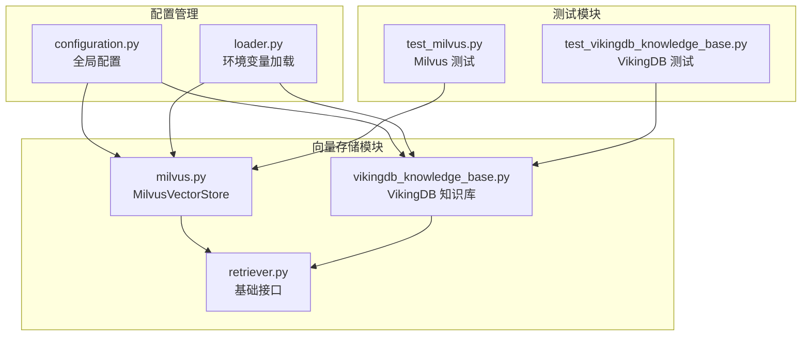
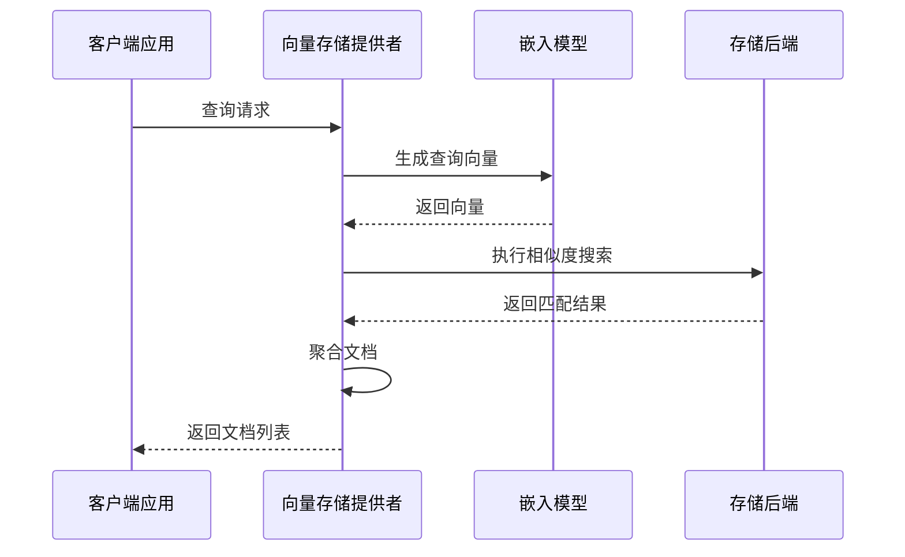
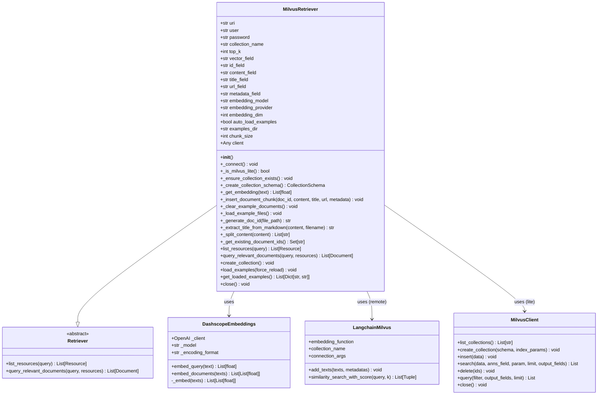
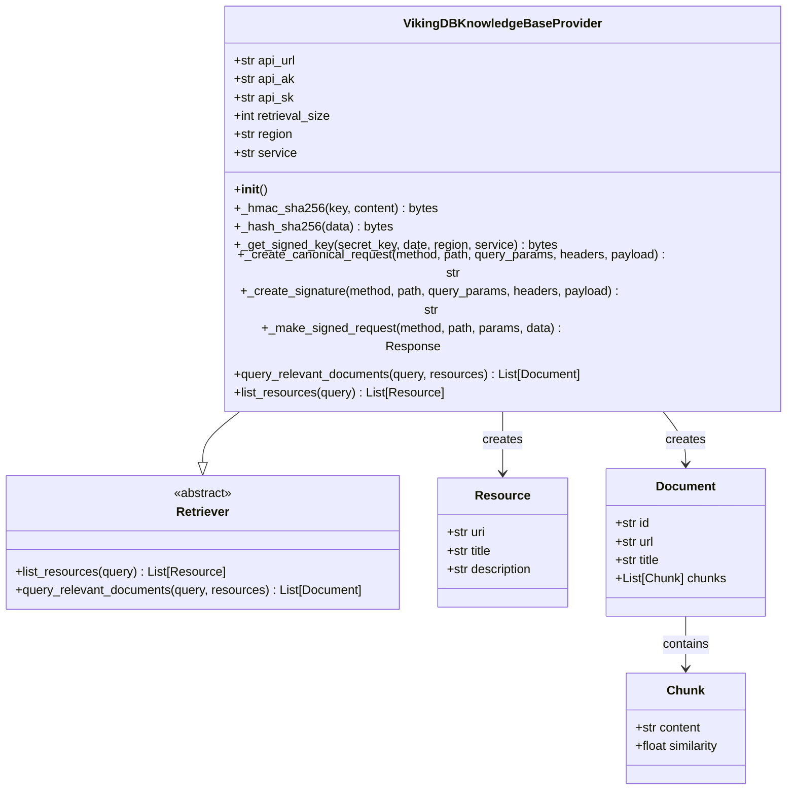
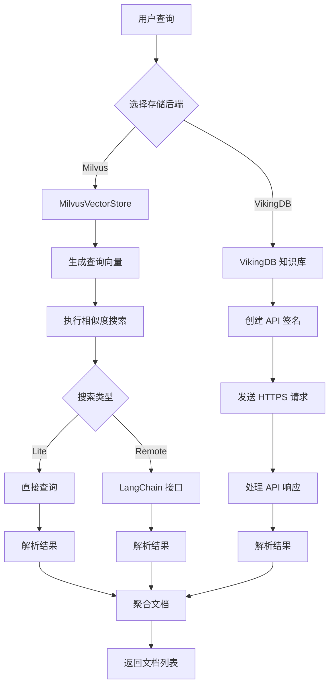

# 向量存储系统

<cite>
**本文档中引用的文件**
- [milvus.py](file://src/rag/milvus.py)
- [vikingdb_knowledge_base.py](file://src/rag/vikingdb_knowledge_base.py)
- [retriever.py](file://src/rag/retriever.py)
- [configuration.py](file://src/config/configuration.py)
- [loader.py](file://src/config/loader.py)
- [test_milvus.py](file://tests/unit/rag/test_milvus.py)
- [test_vikingdb_knowledge_base.py](file://tests/unit/rag/test_vikingdb_knowledge_base.py)
</cite>

## 目录
1. [简介](#简介)
2. [项目结构](#项目结构)
3. [核心组件](#核心组件)
4. [架构概览](#架构概览)
5. [MilvusVectorStore 实现](#milvusvectorstore-实现)
6. [VikingDB 知识库集成](#vikingdb-知识库集成)
7. [详细组件分析](#详细组件分析)
8. [性能优化建议](#性能优化建议)
9. [故障排除指南](#故障排除指南)
10. [结论](#结论)

## 简介

DeerFlow 向量存储系统是一个强大的 RAG（检索增强生成）解决方案，提供了两种主要的向量存储后端：MilvusVectorStore 和 VikingDB 知识库。该系统设计用于高效地存储、管理和检索大规模向量数据，支持多种嵌入模型和相似度搜索算法。

系统的核心特性包括：
- 支持本地 Milvus Lite 和远程 Milvus 服务器
- 多种嵌入提供商（OpenAI、DashScope）
- 高效的向量相似度搜索
- 自动化的示例文档加载
- 完整的 CRUD 操作支持
- 灵活的配置管理系统

## 项目结构



**图表来源**
- [milvus.py](file://src/rag/milvus.py#L1-L50)
- [vikingdb_knowledge_base.py](file://src/rag/vikingdb_knowledge_base.py#L1-L50)
- [retriever.py](file://src/rag/retriever.py#L1-L82)

**章节来源**
- [milvus.py](file://src/rag/milvus.py#L1-L786)
- [vikingdb_knowledge_base.py](file://src/rag/vikingdb_knowledge_base.py#L1-L300)

## 核心组件

### Retriever 基础接口

所有向量存储实现都继承自抽象基类 `Retriever`，定义了统一的接口：

```python
class Retriever(abc.ABC):
    @abc.abstractmethod
    def list_resources(self, query: str | None = None) -> list[Resource]:
        """列出可用资源"""
        pass

    @abc.abstractmethod
    def query_relevant_documents(
        self, query: str, resources: list[Resource] = []
    ) -> list[Document]:
        """查询相关文档"""
        pass
```

### 数据模型

系统使用以下核心数据模型：

- **Resource**: 表示可访问的知识源
- **Document**: 包含多个 Chunk 的文档对象
- **Chunk**: 单个文本片段及其相似度分数

**章节来源**
- [retriever.py](file://src/rag/retriever.py#L1-L82)

## 架构概览



**图表来源**
- [milvus.py](file://src/rag/milvus.py#L600-L700)
- [vikingdb_knowledge_base.py](file://src/rag/vikingdb_knowledge_base.py#L150-L250)

## MilvusVectorStore 实现

### 连接管理

MilvusVectorStore 支持两种部署模式：

1. **Milvus Lite**: 本地文件数据库，适用于开发和小规模部署
2. **远程 Milvus**: 分布式服务器，适用于生产环境

```python
def _connect(self) -> None:
    """建立 Milvus 客户端连接"""
    if self._is_milvus_lite():
        # 使用 MilvusClient 连接本地数据库
        self.client = MilvusClient(self.uri)
        self._ensure_collection_exists()
    else:
        # 使用 LangChain Milvus 连接远程服务器
        connection_args = {"uri": self.uri}
        if self.user:
            connection_args["user"] = self.user
        if self.password:
            connection_args["password"] = self.password
            
        self.client = LangchainMilvus(
            embedding_function=self.embedding_model,
            collection_name=self.collection_name,
            connection_args=connection_args,
            drop_old=False,
        )
```

### 集合管理

系统自动管理集合的创建和索引：

```python
def _ensure_collection_exists(self) -> None:
    """确保集合存在（必要时创建）"""
    if self._is_milvus_lite():
        collections = self.client.list_collections()
        if self.collection_name not in collections:
            schema = self._create_collection_schema()
            self.client.create_collection(
                collection_name=self.collection_name,
                schema=schema,
                index_params={
                    "field_name": self.vector_field,
                    "index_type": "IVF_FLAT",
                    "metric_type": "IP",
                    "params": {"nlist": 1024},
                },
            )
```

### 向量数据操作

#### 插入操作

```python
def _insert_document_chunk(
    self, doc_id: str, content: str, title: str, url: str, metadata: Dict[str, Any]
) -> None:
    """插入单个内容块到 Milvus"""
    embedding = self._get_embedding(content)
    
    if self._is_milvus_lite():
        data = [{
            self.id_field: doc_id,
            self.vector_field: embedding,
            self.content_field: content,
            self.title_field: title,
            self.url_field: url,
            **metadata,
        }]
        self.client.insert(collection_name=self.collection_name, data=data)
    else:
        self.client.add_texts(
            texts=[content],
            metadatas=[{
                self.id_field: doc_id,
                self.title_field: title,
                self.url_field: url,
                **metadata,
            }],
        )
```

#### 删除操作

```python
def _clear_example_documents(self) -> None:
    """删除已导入的示例文档"""
    if self._is_milvus_lite():
        results = self.client.query(
            collection_name=self.collection_name,
            filter="source == 'examples'",
            output_fields=[self.id_field],
            limit=10000,
        )
        
        if results:
            doc_ids = [result[self.id_field] for result in results]
            self.client.delete(
                collection_name=self.collection_name, ids=doc_ids
            )
```

### 相似度搜索

MilvusVectorStore 支持多种度量方式：

```python
def query_relevant_documents(
    self, query: str, resources: Optional[List[Resource]] = None
) -> List[Document]:
    """执行向量相似度搜索"""
    query_embedding = self._get_embedding(query)
    
    if self._is_milvus_lite():
        search_results = self.client.search(
            collection_name=self.collection_name,
            data=[query_embedding],
            anns_field=self.vector_field,
            param={"metric_type": "IP", "params": {"nprobe": 10}},
            limit=self.top_k,
            output_fields=[self.id_field, self.content_field, self.title_field, self.url_field],
        )
    else:
        search_results = self.client.similarity_search_with_score(
            query=query, k=self.top_k
        )
```

**章节来源**
- [milvus.py](file://src/rag/milvus.py#L600-L786)

## VikingDB 知识库集成

### API 认证机制

VikingDB 使用基于 HMAC-SHA256 的签名认证：

```python
def _create_signature(
    self, method: str, path: str, query_params: dict, headers: dict, payload: bytes
) -> str:
    """创建 API 签名"""
    now = datetime.utcnow()
    date_stamp = now.strftime("%Y%m%dT%H%M%SZ")
    auth_date = date_stamp[:8]
    
    headers["X-Date"] = date_stamp
    headers["Host"] = self.api_url.replace("https://", "").replace("http://", "")
    headers["X-Content-Sha256"] = self._hash_sha256(payload).hex()
    headers["Content-Type"] = "application/json"
    
    canonical_request, signed_headers = self._create_canonical_request(
        method, path, query_params, headers, payload
    )
    
    algorithm = "HMAC-SHA256"
    credential_scope = f"{auth_date}/{self.region}/{self.service}/request"
    canonical_request_hash = self._hash_sha256(
        canonical_request.encode("utf-8")
    ).hex()
    
    string_to_sign = "\n".join([
        algorithm, date_stamp, credential_scope, canonical_request_hash
    ])
    
    signing_key = self._get_signed_key(
        self.api_sk, auth_date, self.region, self.service
    )
    signature = hmac.new(
        signing_key, string_to_sign.encode("utf-8"), hashlib.sha256
    ).hexdigest()
    
    authorization = f"{algorithm} Credential={self.api_ak}/{credential_scope}, SignedHeaders={signed_headers}, Signature={signature}"
    headers["Authorization"] = authorization
    
    return headers
```

### 查询转换

VikingDB 提供高级的查询转换功能：

```python
def query_relevant_documents(
    self, query: str, resources: list[Resource] = []
) -> list[Document]:
    """从知识库查询相关文档"""
    all_documents = {}
    
    for resource in resources:
        resource_id, document_id = parse_uri(resource.uri)
        request_params = {
            "resource_id": resource_id,
            "query": query,
            "limit": self.retrieval_size,
            "dense_weight": 0.5,
            "pre_processing": {
                "need_instruction": True,
                "rewrite": False,
                "return_token_usage": True,
            },
            "post_processing": {
                "rerank_switch": True,
                "chunk_diffusion_count": 0,
                "chunk_group": True,
                "get_attachment_link": True,
            },
        }
        
        if document_id:
            doc_filter = {"op": "must", "field": "doc_id", "conds": [document_id]}
            query_param = {"doc_filter": doc_filter}
            request_params["query_param"] = query_param
        
        response = self._make_signed_request(
            method="POST", path="/api/knowledge/collection/search_knowledge", 
            data=request_params
        )
        
        # 处理响应并聚合结果...
```

### 数据同步

VikingDB 支持实时的数据同步和增量更新：

```python
def list_resources(self, query: str | None = None) -> list[Resource]:
    """列出知识库服务中的资源"""
    path = "/api/knowledge/collection/list"
    response = self._make_signed_request(method="POST", path=path)
    
    response_data = response.json()
    if response_data["code"] != 0:
        raise Exception(f"Failed to list resources: {response_data['message']}")
    
    resources = []
    collection_list = response_data.get("data", {}).get("collection_list", [])
    
    for item in collection_list:
        collection_name = item.get("collection_name", "")
        description = item.get("description", "")
        
        if query and query.lower() not in collection_name.lower():
            continue
            
        resource_id = item.get("resource_id", "")
        resource = Resource(
            uri=f"rag://dataset/{resource_id}",
            title=collection_name,
            description=description,
        )
        resources.append(resource)
    
    return resources
```

**章节来源**
- [vikingdb_knowledge_base.py](file://src/rag/vikingdb_knowledge_base.py#L1-L300)

## 详细组件分析

### MilvusVectorStore 类图



**图表来源**
- [milvus.py](file://src/rag/milvus.py#L67-L122)
- [milvus.py](file://src/rag/milvus.py#L25-L60)

### VikingDB 知识库类图



**图表来源**
- [vikingdb_knowledge_base.py](file://src/rag/vikingdb_knowledge_base.py#L15-L50)
- [retriever.py](file://src/rag/retriever.py#L15-L82)

### 数据流图



**图表来源**
- [milvus.py](file://src/rag/milvus.py#L600-L700)
- [vikingdb_knowledge_base.py](file://src/rag/vikingdb_knowledge_base.py#L150-L250)

**章节来源**
- [milvus.py](file://src/rag/milvus.py#L67-L200)
- [vikingdb_knowledge_base.py](file://src/rag/vikingdb_knowledge_base.py#L15-L100)

## 性能优化建议

### Milvus 索引类型选择

根据不同的使用场景选择合适的索引类型：

1. **IVF_FLAT**: 适合中小规模数据集，精度高但内存占用较大
2. **IVF_SQ8**: 适合大规模数据集，内存效率高
3. **HNSW**: 适合高维向量，查询速度快
4. **ANNOY**: 适合快速近似最近邻搜索

```python
# 推荐的索引配置
index_params = {
    "field_name": self.vector_field,
    "index_type": "IVF_FLAT",  # 或 "HNSW", "IVF_SQ8"
    "metric_type": "IP",  # 或 "L2", "COSINE"
    "params": {
        "nlist": 1024,  # 聚类中心数量
        "nprobe": 10,   # 搜索时考虑的聚类中心数
    },
}
```

### 分区策略

对于大型知识库，建议实施分区策略：

```python
# 创建带分区的集合
schema = CollectionSchema(
    fields=fields,
    partition_key_field="category",  # 按类别分区
    description="Partitioned collection for large datasets"
)
```

### 内存管理

1. **批量操作**: 使用批量插入和删除减少网络开销
2. **连接池**: 对于远程 Milvus，启用连接池
3. **缓存策略**: 缓存频繁查询的结果

### 查询优化

1. **Top-K 调整**: 根据实际需求调整返回结果数量
2. **过滤条件**: 使用适当的过滤条件减少搜索范围
3. **并发控制**: 控制并发查询数量避免资源耗尽

## 故障排除指南

### 常见问题及解决方案

#### Milvus 连接问题

```python
# 检查连接状态
try:
    retriever._connect()
except ConnectionError as e:
    logger.error(f"Milvus 连接失败: {e}")
    # 检查 URI 格式
    if retriever._is_milvus_lite():
        logger.info("使用 Milvus Lite 模式")
    else:
        logger.info("使用远程 Milvus 模式")
```

#### 嵌入模型配置错误

```python
# 验证嵌入模型配置
try:
    retriever._init_embedding_model()
except ValueError as e:
    logger.error(f"嵌入模型初始化失败: {e}")
    # 检查环境变量
    logger.info(f"当前配置: provider={retriever.embedding_provider}, model={retriever.embedding_model}")
```

#### VikingDB 认证失败

```python
# 检查 API 凭据
try:
    provider = VikingDBKnowledgeBaseProvider()
    provider.list_resources()
except ValueError as e:
    logger.error(f"VikingDB 认证失败: {e}")
    # 验证环境变量
    required_vars = ["VIKINGDB_KNOWLEDGE_BASE_API_URL", "VIKINGDB_KNOWLEDGE_BASE_API_AK", "VIKINGDB_KNOWLEDGE_BASE_API_SK"]
    for var in required_vars:
        value = os.getenv(var)
        logger.info(f"{var}: {'设置正确' if value else '未设置'}")
```

### 日志监控

系统提供详细的日志记录：

```python
# 启用调试日志
logging.basicConfig(level=logging.DEBUG)
logger = logging.getLogger(__name__)

# 关键操作的日志记录
logger.info(f"成功连接到 Milvus: {retriever.uri}")
logger.warning(f"无法确保集合存在: {e}")
logger.error(f"查询文档失败: {e}")
```

**章节来源**
- [milvus.py](file://src/rag/milvus.py#L700-L786)
- [vikingdb_knowledge_base.py](file://src/rag/vikingdb_knowledge_base.py#L250-L300)

## 结论

DeerFlow 向量存储系统提供了强大而灵活的 RAG 解决方案，通过 MilvusVectorStore 和 VikingDB 知识库两种主要实现，满足不同规模和场景的需求。

### 主要优势

1. **双模式支持**: 兼容本地开发和生产部署
2. **多提供商集成**: 支持多种嵌入模型提供商
3. **高性能搜索**: 优化的相似度搜索算法
4. **自动化管理**: 自动化的集合管理和数据同步
5. **安全可靠**: 完善的错误处理和重试机制

### 最佳实践建议

1. **环境隔离**: 在不同环境中使用不同的配置
2. **监控告警**: 建立完善的监控和告警机制
3. **定期维护**: 定期清理过期数据和重建索引
4. **性能调优**: 根据实际使用情况调整参数配置
5. **备份策略**: 建立完善的数据备份和恢复机制

通过合理配置和使用这些向量存储组件，可以构建高效、可靠的 RAG 应用系统，为用户提供优质的检索增强生成体验。