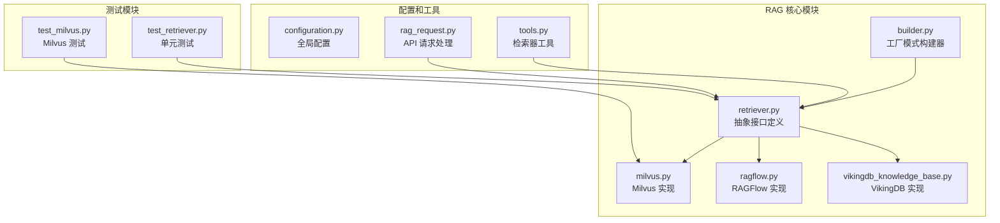
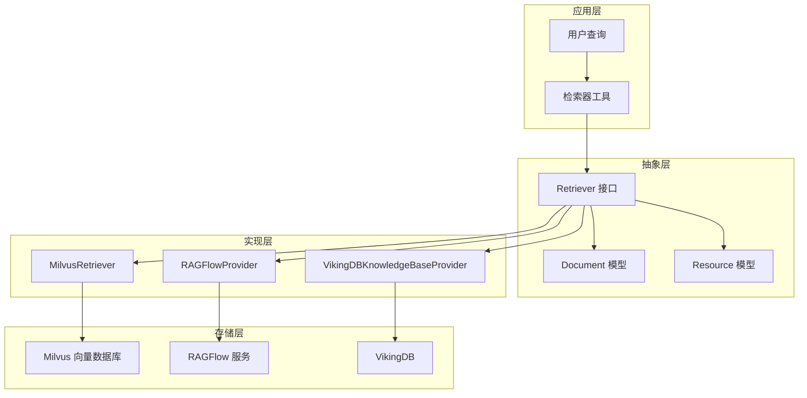
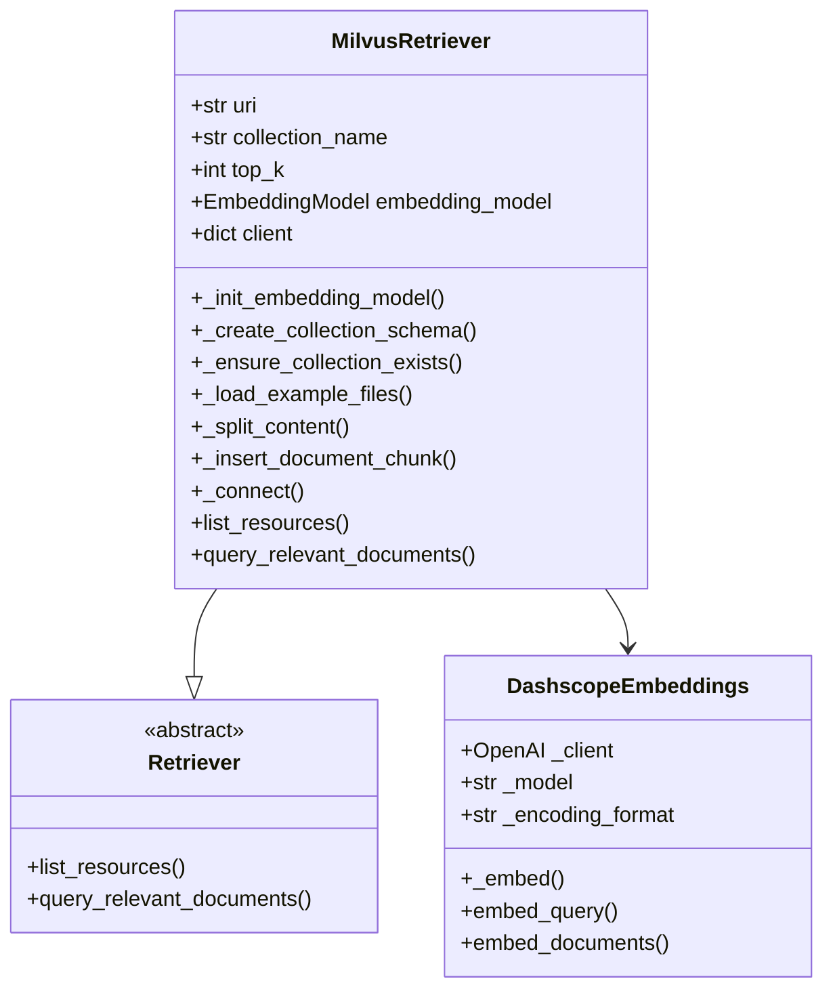
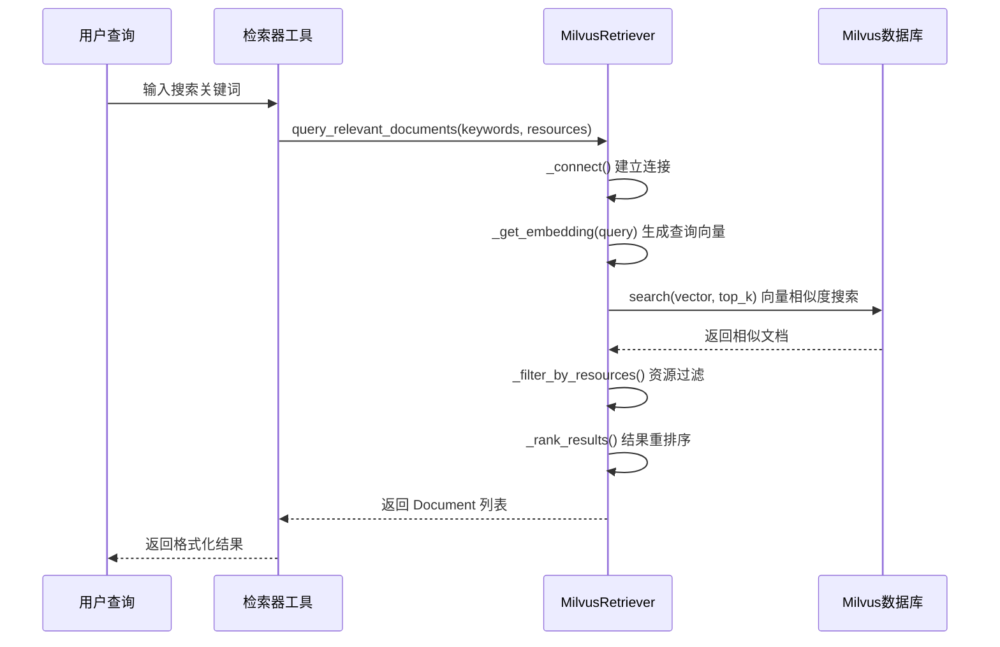
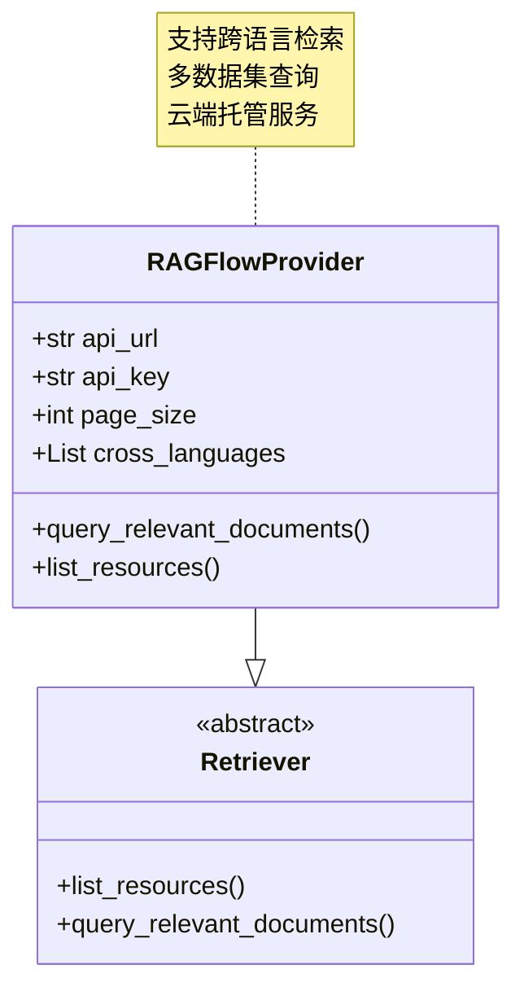
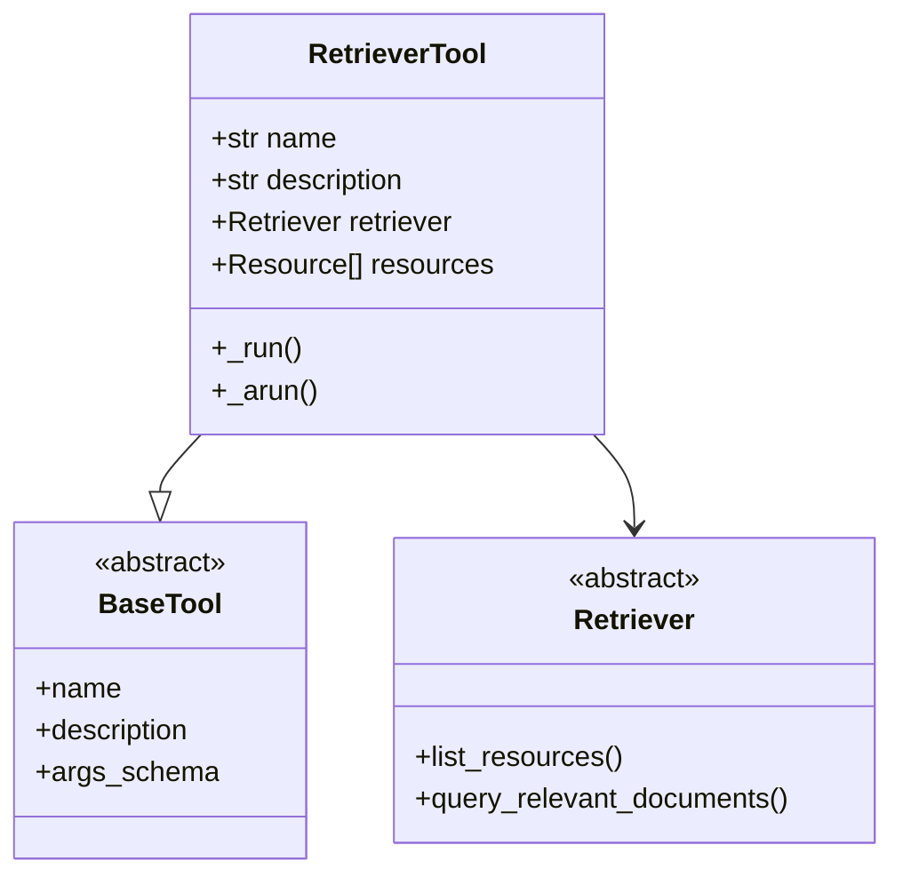
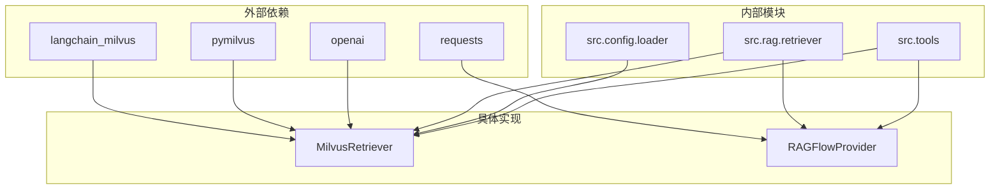

# DeerFlow 检索器组件详细文档

<cite>
**本文档中引用的文件**
- [retriever.py](file://src/rag/retriever.py)
- [milvus.py](file://src/rag/milvus.py)
- [ragflow.py](file://src/rag/ragflow.py)
- [builder.py](file://src/rag/builder.py)
- [configuration.py](file://src/config/configuration.py)
- [tools.py](file://src/tools/retriever.py)
- [rag_request.py](file://src/server/rag_request.py)
- [test_retriever.py](file://tests/unit/rag/test_retriever.py)
- [test_milvus.py](file://tests/unit/rag/test_milvus.py)
- [what_is_llm.md](file://examples/what_is_llm.md)
</cite>

## 目录
1. [简介](#简介)
2. [项目结构](#项目结构)
3. [核心组件](#核心组件)
4. [架构概览](#架构概览)
5. [详细组件分析](#详细组件分析)
6. [依赖关系分析](#依赖关系分析)
7. [性能考虑](#性能考虑)
8. [故障排除指南](#故障排除指南)
9. [结论](#结论)

## 简介

DeerFlow 检索器组件是一个高度可扩展的 RAG（检索增强生成）系统，提供了多种检索器实现来满足不同的应用场景需求。该系统的核心是抽象的 `Retriever` 接口，支持多种后端存储方案，包括 Milvus 向量数据库、RAGFlow 和 VikingDB 知识库。

检索器组件的主要功能包括：
- 查询转换和扩展
- 多向量检索（密集向量和稀疏向量）
- 结果重排序和相关性评分
- 上下文压缩和句子窗口检索
- 配置化管理和优化

## 项目结构

DeerFlow 检索器组件采用模块化设计，主要文件组织如下：



**图表来源**
- [retriever.py](file://src/rag/retriever.py#L1-L82)
- [milvus.py](file://src/rag/milvus.py#L1-L50)
- [builder.py](file://src/rag/builder.py#L1-L19)

**章节来源**
- [retriever.py](file://src/rag/retriever.py#L1-L82)
- [milvus.py](file://src/rag/milvus.py#L1-L786)
- [ragflow.py](file://src/rag/ragflow.py#L1-L137)

## 核心组件

### 抽象 Retriever 接口

`Retriever` 是所有检索器实现的基础抽象类，定义了统一的接口规范：

```python
class Retriever(abc.ABC):
    """
    定义 RAG 提供商，可用于查询文档和资源。
    """

    @abc.abstractmethod
    def list_resources(self, query: str | None = None) -> list[Resource]:
        """
        从 RAG 提供商列出资源。
        """
        pass

    @abc.abstractmethod
    def query_relevant_documents(
        self, query: str, resources: list[Resource] = []
    ) -> list[Document]:
        """
        从资源中查询相关文档。
        """
        pass
```

### 数据模型

系统定义了三个核心数据模型：

1. **Chunk（块）**：表示文档的最小语义单元
2. **Document（文档）**：包含多个块的完整文档
3. **Resource（资源）**：表示可被检索的数据源

```python
class Chunk:
    content: str
    similarity: float

    def __init__(self, content: str, similarity: float):
        self.content = content
        self.similarity = similarity

class Document:
    id: str
    url: str | None = None
    title: str | None = None
    chunks: list[Chunk] = []

    def to_dict(self) -> dict:
        # 将文档转换为字典格式
        pass
```

**章节来源**
- [retriever.py](file://src/rag/retriever.py#L8-L82)

## 架构概览

DeerFlow 检索器组件采用分层架构设计，支持多种检索器后端：



**图表来源**
- [retriever.py](file://src/rag/retriever.py#L45-L82)
- [milvus.py](file://src/rag/milvus.py#L50-L100)
- [builder.py](file://src/rag/builder.py#L10-L19)

## 详细组件分析

### Milvus 检索器实现

Milvus 检索器是最完整的实现，支持本地和远程部署：



**图表来源**
- [milvus.py](file://src/rag/milvus.py#L50-L200)
- [retriever.py](file://src/rag/retriever.py#L45-L82)

#### 配置选项

Milvus 检索器支持丰富的配置选项：

```python
# 连接配置
MILVUS_URI: str = "http://localhost:19530"
MILVUS_USER: str = ""
MILVUS_PASSWORD: str = ""
MILVUS_COLLECTION: str = "documents"

# 搜索配置
MILVUS_TOP_K: int = 10
MILVUS_CHUNK_SIZE: int = 4000

# 向量字段配置
MILVUS_VECTOR_FIELD: str = "embedding"
MILVUS_ID_FIELD: str = "id"
MILVUS_CONTENT_FIELD: str = "content"

# 嵌入模型配置
MILVUS_EMBEDDING_PROVIDER: str = "openai"
MILVUS_EMBEDDING_MODEL: str = ""
MILVUS_EMBEDDING_DIM: int = 1536
```

#### 查询处理流程



**图表来源**
- [milvus.py](file://src/rag/milvus.py#L300-L400)
- [tools.py](file://src/tools/retriever.py#L30-L50)

**章节来源**
- [milvus.py](file://src/rag/milvus.py#L50-L786)

### RAGFlow 检索器实现

RAGFlow 提供云端托管的检索服务：



**图表来源**
- [ragflow.py](file://src/rag/ragflow.py#L10-L50)

#### API 集成

RAGFlow 检索器通过 REST API 与云端服务交互：

```python
def query_relevant_documents(self, query: str, resources: list[Resource] = []) -> list[Document]:
    # 构建请求负载
    payload = {
        "question": query,
        "dataset_ids": dataset_ids,
        "document_ids": document_ids,
        "page_size": self.page_size,
    }
    
    # 发送 POST 请求到 RAGFlow API
    response = requests.post(
        f"{self.api_url}/api/v1/retrieval", 
        headers=headers, 
        json=payload
    )
    
    # 解析响应并构建 Document 对象
    result = response.json()
    # ...
```

**章节来源**
- [ragflow.py](file://src/rag/ragflow.py#L30-L80)

### 检索器工具集成

检索器工具作为 LangChain 工具的包装器，提供统一的接口：



**图表来源**
- [tools.py](file://src/tools/retriever.py#L20-L40)

**章节来源**
- [tools.py](file://src/tools/retriever.py#L1-L62)

## 依赖关系分析

### 组件耦合度



**图表来源**
- [milvus.py](file://src/rag/milvus.py#L1-L20)
- [ragflow.py](file://src/rag/ragflow.py#L1-L15)

### 配置管理

系统通过环境变量和配置类管理各种设置：

```python
# 环境变量配置
MILVUS_URI = get_str_env("MILVUS_URI", "http://localhost:19530")
MILVUS_TOP_K = get_int_env("MILVUS_TOP_K", 10)
RAG_PROVIDER = os.getenv("RAG_PROVIDER")

# 配置类
@dataclass(kw_only=True)
class Configuration:
    resources: list[Resource] = field(default_factory=list)
    max_plan_iterations: int = 1
    max_step_num: int = 3
    max_search_results: int = 3
```

**章节来源**
- [configuration.py](file://src/config/configuration.py#L1-L71)
- [milvus.py](file://src/rag/milvus.py#L60-L100)

## 性能考虑

### 向量搜索优化

Milvus 检索器使用 IVF_FLAT 索引类型进行高效的向量搜索：

```python
# Milvus 索引配置
index_params = {
    "field_name": self.vector_field,
    "index_type": "IVF_FLAT",
    "metric_type": "IP",  # 内积相似度
    "params": {"nlist": 1024},
}
```

### 批量处理

系统支持批量插入和查询以提高性能：

- **批量插入**：一次插入多个文档块
- **批量查询**：同时处理多个查询请求
- **缓存机制**：嵌入模型结果缓存

### 内存管理

- **流式处理**：大文档分块处理
- **延迟加载**：按需建立数据库连接
- **资源池化**：连接复用和管理

## 故障排除指南

### 常见问题

1. **连接失败**
   - 检查 Milvus 服务状态
   - 验证网络连接和防火墙设置
   - 确认认证凭据正确性

2. **查询无结果**
   - 检查嵌入模型配置
   - 验证文档是否正确索引
   - 调整相似度阈值

3. **性能问题**
   - 优化索引参数
   - 调整 top_k 参数
   - 检查硬件资源使用情况

### 调试工具

```python
# 启用详细日志记录
import logging
logging.basicConfig(level=logging.DEBUG)

# 检查配置
from src.config.loader import get_str_env, get_int_env
print(f"MILVUS_URI: {get_str_env('MILVUS_URI')}")
print(f"MILVUS_TOP_K: {get_int_env('MILVUS_TOP_K')}")
```

**章节来源**
- [test_milvus.py](file://tests/unit/rag/test_milvus.py#L250-L287)

## 结论

DeerFlow 检索器组件提供了一个强大而灵活的 RAG 系统框架，具有以下优势：

1. **模块化设计**：清晰的抽象层和具体实现分离
2. **多后端支持**：支持 Milvus、RAGFlow 和 VikingDB 等多种存储方案
3. **配置灵活性**：丰富的环境变量和配置选项
4. **性能优化**：向量索引、批量处理和缓存机制
5. **易于扩展**：新的检索器实现可以通过继承 Retriever 接口轻松添加

该系统适用于各种规模的应用场景，从本地开发环境到大规模生产部署都能提供可靠的服务。通过合理的配置和优化，可以实现高质量的检索效果和良好的用户体验。