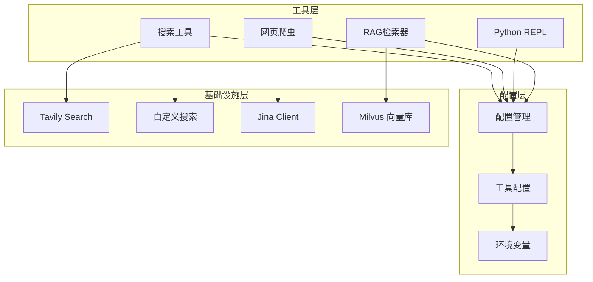
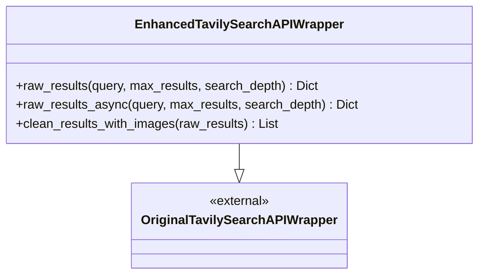
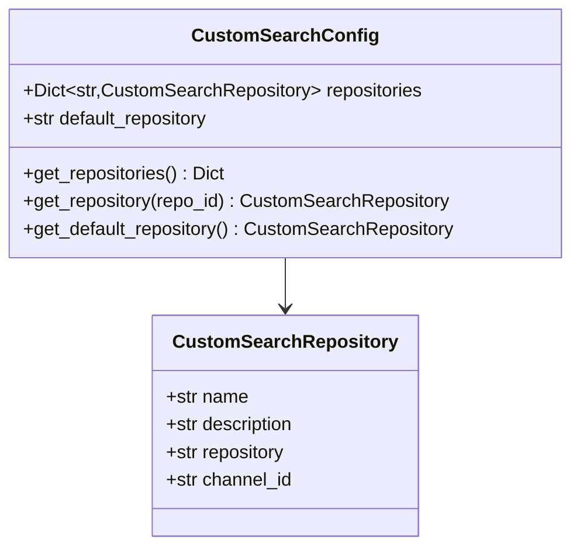
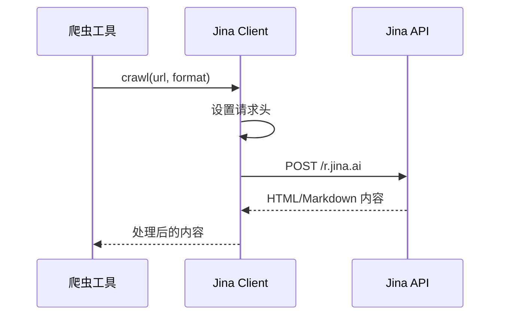
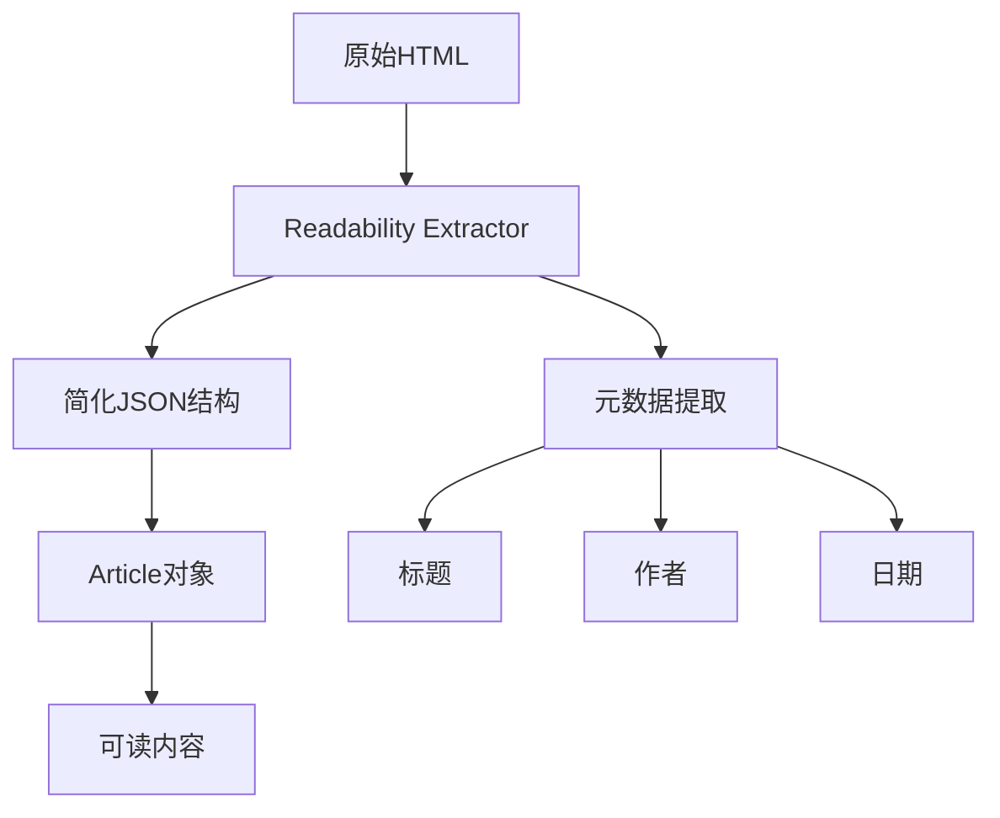
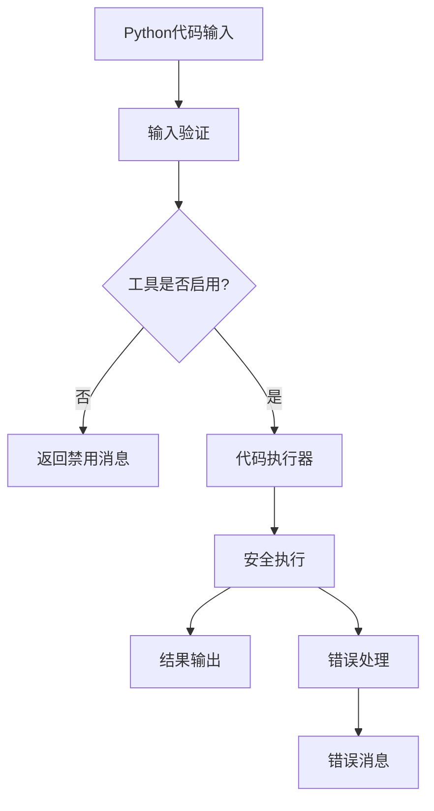
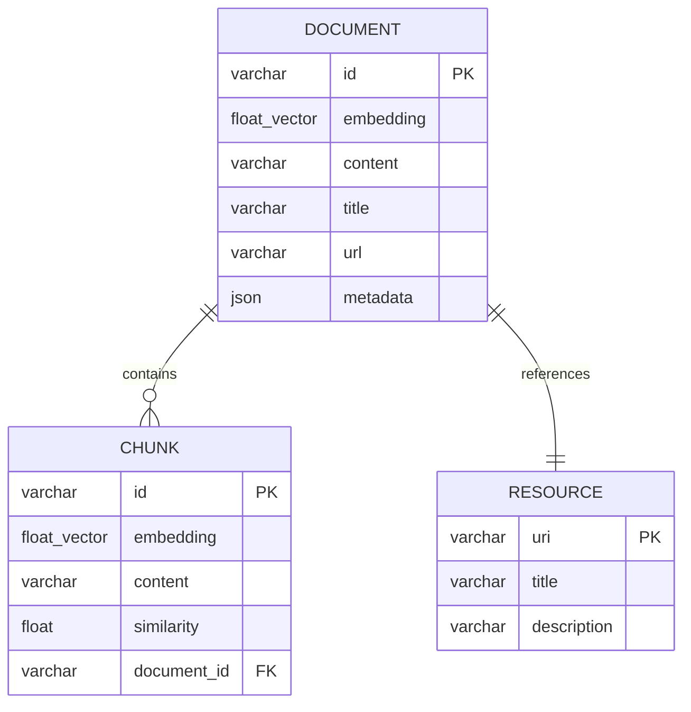
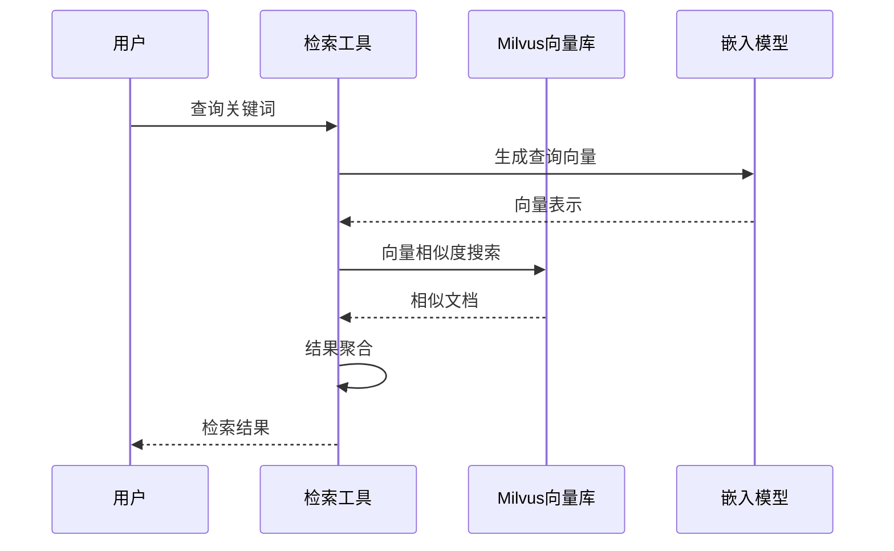
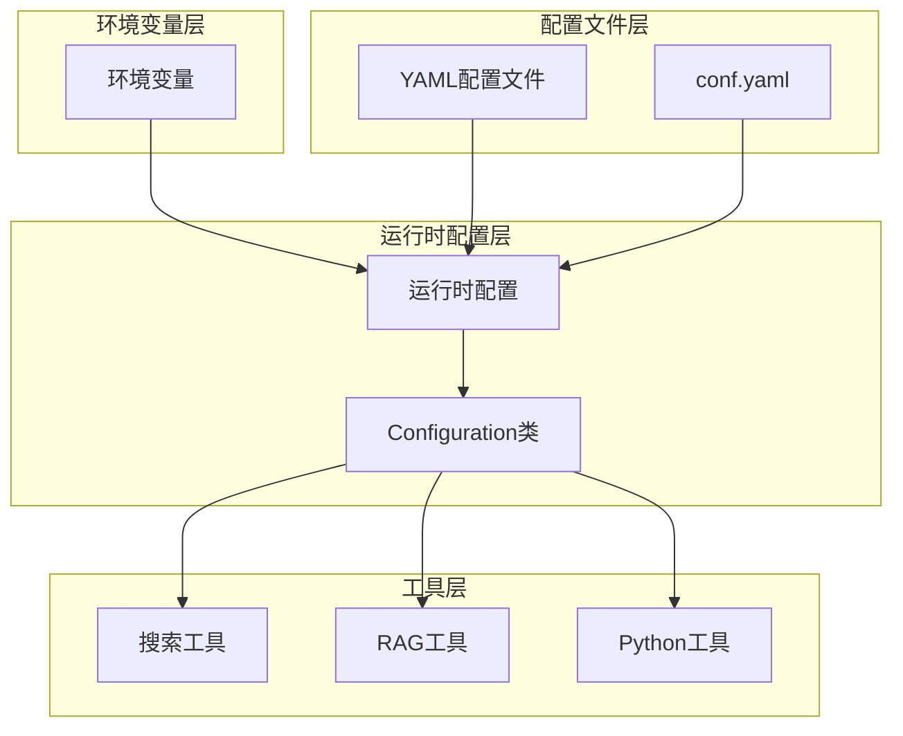
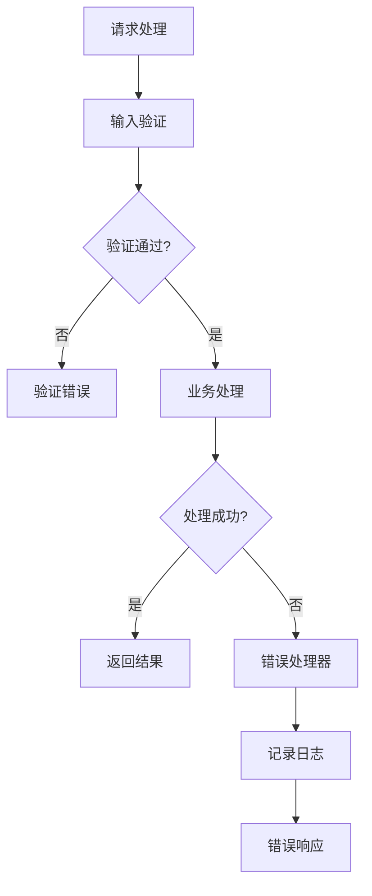

# DeerFlow 工具集成

<cite>
**本文档引用的文件**
- [tavily_search_api_wrapper.py](file://src/tools/tavily_search/tavily_search_api_wrapper.py)
- [crawl.py](file://src/tools/crawl.py)
- [jina_client.py](file://src/crawler/jina_client.py)
- [readability_extractor.py](file://src/crawler/readability_extractor.py)
- [python_repl.py](file://src/tools/python_repl.py)
- [milvus.py](file://src/rag/milvus.py)
- [custom_search.py](file://src/tools/custom_search.py)
- [retriever.py](file://src/tools/retriever.py)
- [tools.py](file://src/config/tools.py)
- [configuration.py](file://src/config/configuration.py)
- [custom_search.py](file://src/config/custom_search.py)
</cite>

## 目录
1. [简介](#简介)
2. [项目架构概览](#项目架构概览)
3. [搜索工具集成](#搜索工具集成)
4. [网页爬虫模块](#网页爬虫模块)
5. [Python 执行环境](#python-执行环境)
6. [RAG 系统实现](#rag-系统实现)
7. [工具配置与管理](#工具配置与管理)
8. [性能优化与安全考虑](#性能优化与安全考虑)
9. [故障排除指南](#故障排除指南)
10. [总结](#总结)

## 简介

DeerFlow 是一个强大的智能体框架，集成了多种工具来支持复杂的任务执行。本文档详细介绍了 DeerFlow 中的核心工具集成，包括搜索工具、网页爬虫、Python 执行环境和 RAG（检索增强生成）系统的实现。

这些工具作为智能体的工作手段，提供了从网络搜索到本地知识检索的完整解决方案。每个工具都经过精心设计，确保在安全性、性能和易用性之间取得平衡。

## 项目架构概览

DeerFlow 的工具集成采用模块化设计，主要分为以下几个核心模块：



**图表来源**
- [tools.py](file://src/config/tools.py#L1-L32)
- [configuration.py](file://src/config/configuration.py#L1-L71)

## 搜索工具集成

### Tavily Search 集成

Tavily Search 是 DeerFlow 的主要网络搜索工具，提供了高级的搜索功能和丰富的结果格式。

#### 核心特性

1. **增强的 API 包装器**：继承自 LangChain 的原生包装器，增加了额外的功能
2. **异步支持**：提供同步和异步两种调用方式
3. **图像支持**：可以获取搜索结果中的图片信息
4. **灵活的参数配置**：支持深度搜索、域名过滤等高级选项

#### 主要类结构



**图表来源**
- [tavily_search_api_wrapper.py](file://src/tools/tavily_search/tavily_search_api_wrapper.py#L13-L114)

#### 使用示例

```python
# 基本搜索
wrapper = EnhancedTavilySearchAPIWrapper()
results = wrapper.raw_results(
    query="人工智能最新发展",
    max_results=5,
    search_depth="advanced"
)

# 异步搜索
async def search():
    results = await wrapper.raw_results_async(
        query="机器学习算法",
        include_images=True
    )
```

**章节来源**
- [tavily_search_api_wrapper.py](file://src/tools/tavily_search/tavily_search_api_wrapper.py#L1-L114)

### 自定义搜索服务

DeerFlow 提供了专门针对交通银行内部需求的自定义搜索服务，实现了"边想边搜"功能。

#### 核心功能

1. **多数据源聚合**：支持聚合搜索、向量库搜索和动态搜索
2. **企业级认证**：集成用户身份验证和权限控制
3. **灵活的配置**：支持多种搜索仓库的选择和配置
4. **标准化输出**：将不同格式的搜索结果统一为标准格式

#### 配置管理



**图表来源**
- [custom_search.py](file://src/config/custom_search.py#L10-L120)

#### 使用示例

```python
# 创建自定义搜索工具
search_tool = get_custom_search_tool(
    max_results=10,
    repository_id="dynamic_search"
)

# 执行搜索
results = search_tool.run(
    query="最新的金融政策",
    repository_id="vector_search"
)
```

**章节来源**
- [custom_search.py](file://src/tools/custom_search.py#L1-L295)
- [custom_search.py](file://src/config/custom_search.py#L1-L120)

## 网页爬虫模块

DeerFlow 的网页爬虫模块提供了强大的内容提取和处理能力，支持多种爬取方式和内容格式。

### 核心组件

#### Jina Client

Jina Client 是一个轻量级的网页爬取服务，提供 HTML 和 Markdown 格式的内容提取。



**图表来源**
- [jina_client.py](file://src/crawler/jina_client.py#L1-L27)

#### Readability Extractor

Readability Extractor 使用 Readability.js 库来提取网页的主要内容，去除广告和其他干扰元素。



**图表来源**
- [readability_extractor.py](file://src/crawler/readability_extractor.py#L1-L16)

#### 爬虫工具集成

```python
@tool
@log_io
def crawl_tool(
    url: Annotated[str, "The url to crawl."]
) -> str:
    """Use this to crawl a url and get a readable content in markdown format."""
    try:
        crawler = Crawler()
        article = crawler.crawl(url)
        return {"url": url, "crawled_content": article.to_markdown()[:1000]}
    except BaseException as e:
        error_msg = f"Failed to crawl. Error: {repr(e)}"
        logger.error(error_msg)
        return error_msg
```

**章节来源**
- [crawl.py](file://src/tools/crawl.py#L1-L30)
- [jina_client.py](file://src/crawler/jina_client.py#L1-L27)
- [readability_extractor.py](file://src/crawler/readability_extractor.py#L1-L16)

## Python 执行环境

DeerFlow 提供了一个安全的 Python REPL（Read-Eval-Print Loop）工具，允许智能体执行 Python 代码进行数据分析和计算。

### 安全机制

1. **环境变量控制**：通过 `ENABLE_PYTHON_REPL` 环境变量启用或禁用
2. **输入验证**：严格检查代码输入类型和格式
3. **异常处理**：捕获并记录所有运行时错误
4. **输出限制**：限制输出内容长度以防止内存溢出

### 核心实现



**图表来源**
- [python_repl.py](file://src/tools/python_repl.py#L1-L64)

### 使用示例

```python
# 启用 Python REPL
export ENABLE_PYTHON_REPL=true

# 使用 Python REPL 工具
result = python_repl_tool(
    code="""
import pandas as pd
import numpy as np

# 数据分析示例
data = {'A': [1, 2, 3], 'B': [4, 5, 6]}
df = pd.DataFrame(data)
print(df.describe())
"""
)
```

**章节来源**
- [python_repl.py](file://src/tools/python_repl.py#L1-L64)

## RAG 系统实现

DeerFlow 的 RAG（检索增强生成）系统是一个完整的知识检索和管理系统，支持多种向量数据库和检索策略。

### Milvus 向量数据库集成

Milvus 是 DeerFlow RAG 系统的核心存储引擎，提供了高性能的向量相似度搜索。

#### 核心功能

1. **多提供商支持**：支持 OpenAI 和 DashScope 两种嵌入模型提供商
2. **自动集合管理**：自动创建和管理向量集合
3. **示例文档加载**：自动加载和索引示例文档
4. **灵活的查询接口**：支持语义搜索和混合搜索

#### 数据模型



**图表来源**
- [milvus.py](file://src/rag/milvus.py#L1-L786)

#### 检索流程



**图表来源**
- [milvus.py](file://src/rag/milvus.py#L700-L786)

### 检索器工具

RAG 检索器工具提供了统一的接口来访问各种知识源：

```python
class RetrieverTool(BaseTool):
    name: str = "local_search_tool"
    description: str = "Useful for retrieving information from the file with `rag://` uri prefix"
    
    def _run(self, keywords: str, run_manager=None) -> list[Document]:
        documents = self.retriever.query_relevant_documents(keywords, self.resources)
        if not documents:
            return "No results found from the local knowledge base."
        return [doc.to_dict() for doc in documents]
```

**章节来源**
- [milvus.py](file://src/rag/milvus.py#L1-L786)
- [retriever.py](file://src/tools/retriever.py#L1-L62)

## 工具配置与管理

### 配置系统架构

DeerFlow 使用分层配置系统来管理各种工具的设置：



**图表来源**
- [configuration.py](file://src/config/configuration.py#L1-L71)
- [tools.py](file://src/config/tools.py#L1-L32)

### 支持的工具类型

DeerFlow 支持多种类型的工具配置：

1. **搜索引擎**：
   - Tavily
   - DuckDuckGo
   - Brave Search
   - ArXiv
   - Wikipedia
   - 自定义搜索

2. **RAG 提供商**：
   - RAGFlow
   - VikingDB 知识库
   - Milvus

3. **其他工具**：
   - Python REPL
   - 文本转语音
   - 自定义工具

**章节来源**
- [tools.py](file://src/config/tools.py#L1-L32)
- [configuration.py](file://src/config/configuration.py#L1-L71)

## 性能优化与安全考虑

### 性能优化策略

1. **连接池管理**：合理管理数据库和 API 连接
2. **缓存机制**：对频繁访问的数据进行缓存
3. **异步处理**：使用异步 I/O 提高并发性能
4. **资源限制**：设置合理的超时和重试机制

### 安全考虑

1. **输入验证**：严格验证所有外部输入
2. **权限控制**：基于角色的访问控制
3. **日志审计**：记录所有敏感操作
4. **数据脱敏**：对敏感信息进行脱敏处理

### 错误处理机制



## 故障排除指南

### 常见问题及解决方案

1. **搜索 API 连接失败**
   - 检查 API 密钥配置
   - 验证网络连接
   - 查看防火墙设置

2. **Python REPL 权限不足**
   - 设置 `ENABLE_PYTHON_REPL=true`
   - 检查环境变量配置
   - 验证用户权限

3. **Milvus 连接问题**
   - 检查数据库地址和端口
   - 验证认证凭据
   - 确认数据库服务状态

4. **RAG 检索性能问题**
   - 优化嵌入模型配置
   - 调整索引参数
   - 增加硬件资源

### 监控和调试

1. **日志级别配置**：设置适当的日志级别
2. **性能指标监控**：跟踪关键性能指标
3. **健康检查**：定期检查系统健康状态
4. **告警机制**：设置异常情况告警

## 总结

DeerFlow 的工具集成系统提供了一个完整、安全且高效的解决方案，支持从网络搜索到本地知识检索的各种需求。通过模块化的架构设计和灵活的配置管理，开发者可以轻松扩展和定制工具功能。

主要优势包括：

1. **多样化工具支持**：涵盖搜索、爬虫、代码执行和知识检索
2. **企业级安全**：完善的权限控制和安全机制
3. **高性能设计**：异步处理和连接池优化
4. **易于扩展**：模块化架构便于功能扩展
5. **完整的配置管理**：多层次的配置系统

通过本文档的详细介绍，开发者可以充分理解和利用 DeerFlow 的工具集成能力，构建强大的智能应用系统。