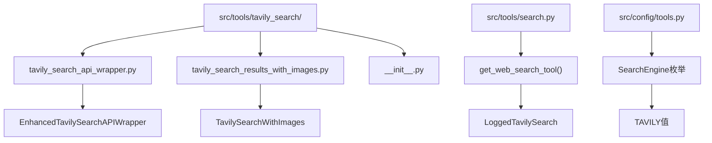
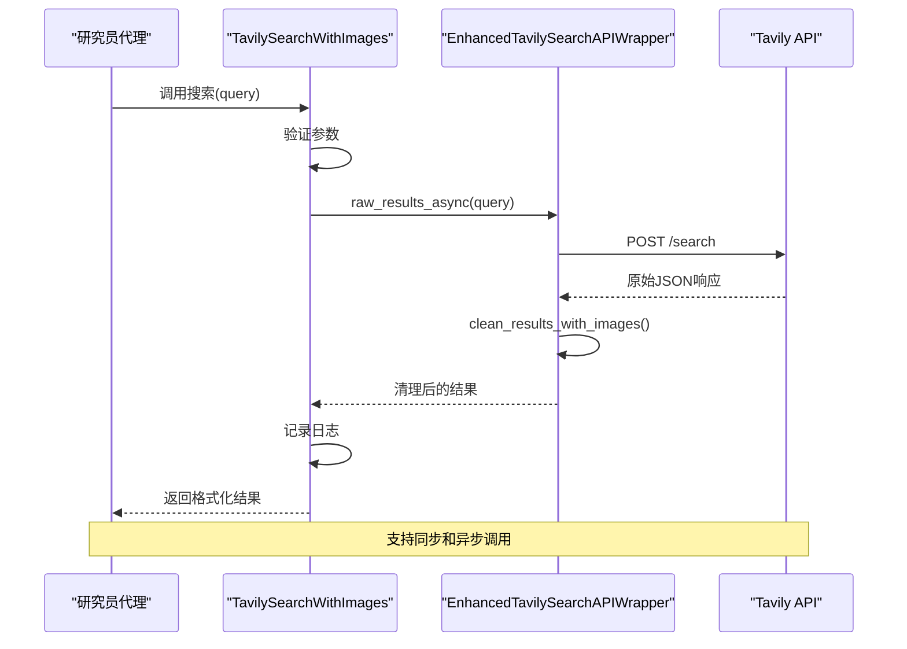
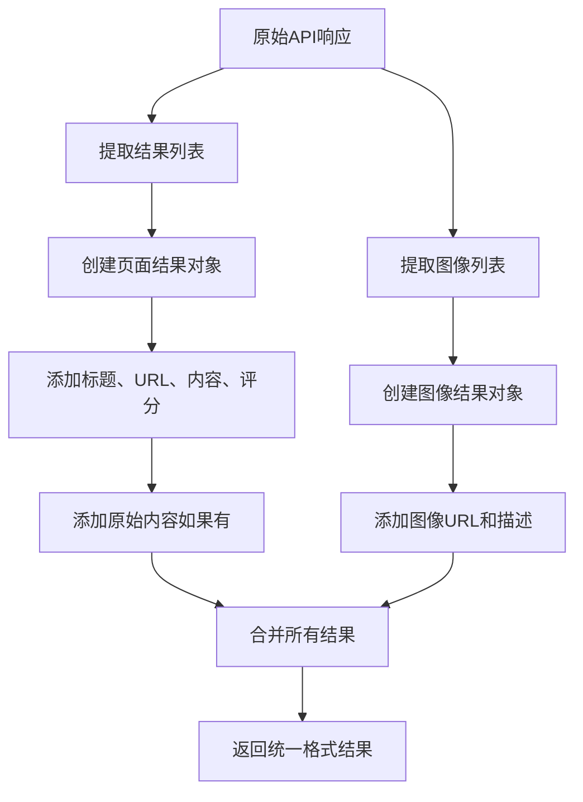
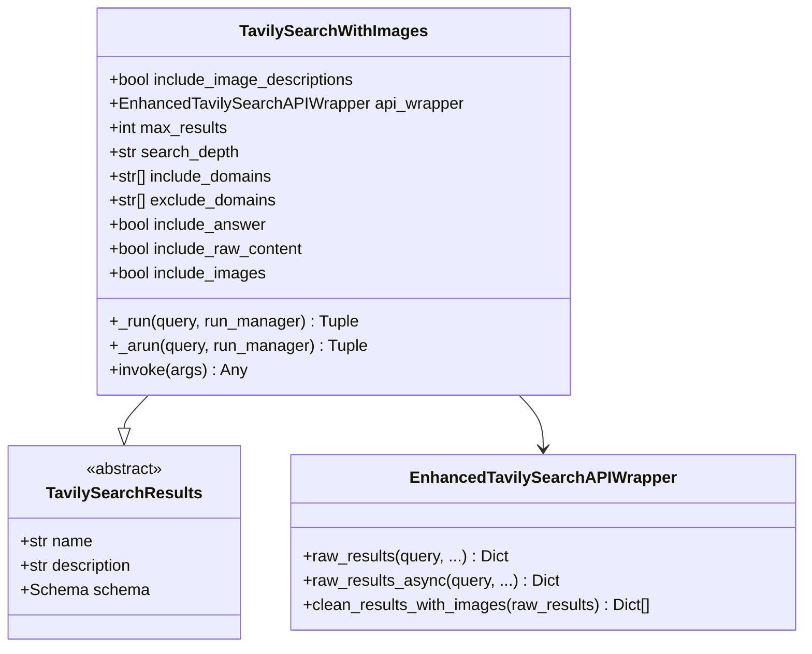
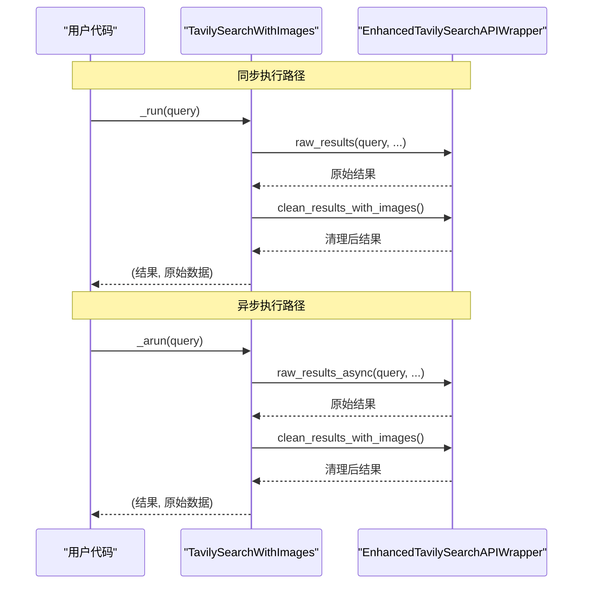

# Tavily搜索集成

<cite>
**本文档中引用的文件**
- [tavily_search_api_wrapper.py](file://src/tools/tavily_search/tavily_search_api_wrapper.py)
- [tavily_search_results_with_images.py](file://src/tools/tavily_search/tavily_search_results_with_images.py)
- [search.py](file://src/tools/search.py)
- [tools.py](file://src/config/tools.py)
- [__init__.py](file://src/tools/tavily_search/__init__.py)
- [test_tavily_search_api_wrapper.py](file://tests/unit/tools/test_tavily_search_api_wrapper.py)
- [test_tavily_search_results_with_images.py](file://tests/unit/tools/test_tavily_search_results_with_images.py)
- [researcher.md](file://src/prompts/researcher.md)
</cite>

## 目录
1. [简介](#简介)
2. [项目结构](#项目结构)
3. [核心组件](#核心组件)
4. [架构概览](#架构概览)
5. [详细组件分析](#详细组件分析)
6. [配置与部署](#配置与部署)
7. [使用示例](#使用示例)
8. [错误处理与性能优化](#错误处理与性能优化)
9. [故障排除指南](#故障排除指南)
10. [结论](#结论)

## 简介

Tavily搜索集成是Deer Flow框架中的一个关键组件，提供了强大的网络搜索功能。该集成基于Tavily API，为智能体工作流中的研究员代理节点提供高效的网络搜索能力。通过封装Tavily API调用，该工具支持多种搜索参数配置，包括搜索范围、结果数量、时间范围等，并能够处理图像搜索结果。

该集成设计为异步优先，支持同步和异步两种调用模式，确保在各种场景下的最佳性能。同时，它还提供了完善的错误处理机制和性能监控功能，使开发者能够轻松集成并使用这一强大的搜索工具。

## 项目结构

Tavily搜索集成位于`src/tools/tavily_search/`目录下，包含以下核心文件：



**图表来源**
- [tavily_search_api_wrapper.py](file://src/tools/tavily_search/tavily_search_api_wrapper.py#L1-L114)
- [tavily_search_results_with_images.py](file://src/tools/tavily_search/tavily_search_results_with_images.py#L1-L165)
- [search.py](file://src/tools/search.py#L1-L114)

**章节来源**
- [__init__.py](file://src/tools/tavily_search/__init__.py#L1-L3)
- [tavily_search_api_wrapper.py](file://src/tools/tavily_search/tavily_search_api_wrapper.py#L1-L114)

## 核心组件

### EnhancedTavilySearchAPIWrapper 类

这是Tavily API的核心封装类，继承自`OriginalTavilySearchAPIWrapper`，提供了以下主要功能：

1. **同步API调用**：`raw_results()`方法执行同步HTTP请求
2. **异步API调用**：`raw_results_async()`方法支持异步操作
3. **结果清理**：`clean_results_with_images()`方法格式化原始API响应

### TavilySearchWithImages 类

这个类扩展了`TavilySearchResults`，作为LangChain工具的标准接口，提供：

1. **标准工具接口**：符合LangChain工具规范
2. **图像搜索支持**：原生支持图像搜索结果
3. **日志记录**：内置日志记录功能
4. **错误处理**：完善的异常处理机制

**章节来源**
- [tavily_search_api_wrapper.py](file://src/tools/tavily_search/tavily_search_api_wrapper.py#L15-L114)
- [tavily_search_results_with_images.py](file://src/tools/tavily_search/tavily_search_results_with_images.py#L25-L165)

## 架构概览

Tavily搜索集成采用分层架构设计，确保了模块化和可扩展性：



**图表来源**
- [tavily_search_results_with_images.py](file://src/tools/tavily_search/tavily_search_results_with_images.py#L85-L120)
- [tavily_search_api_wrapper.py](file://src/tools/tavily_search/tavily_search_api_wrapper.py#L48-L85)

## 详细组件分析

### API包装器分析

#### 同步API调用

```python
def raw_results(
    self,
    query: str,
    max_results: Optional[int] = 5,
    search_depth: Optional[str] = "advanced",
    include_domains: Optional[List[str]] = [],
    exclude_domains: Optional[List[str]] = [],
    include_answer: Optional[bool] = False,
    include_raw_content: Optional[bool] = False,
    include_images: Optional[bool] = False,
    include_image_descriptions: Optional[bool] = False,
) -> Dict:
```

该方法执行同步HTTP POST请求到Tavily API，支持以下参数：
- `query`: 搜索查询字符串
- `max_results`: 最大返回结果数（默认5）
- `search_depth`: 搜索深度（"basic"或"advanced"）
- `include_domains`: 包含的域名列表
- `exclude_domains`: 排除的域名列表
- `include_answer`: 是否包含直接答案
- `include_raw_content`: 是否包含原始内容
- `include_images`: 是否包含图像结果
- `include_image_descriptions`: 是否包含图像描述

#### 异步API调用

```python
async def raw_results_async(
    self,
    query: str,
    max_results: Optional[int] = 5,
    search_depth: Optional[str] = "advanced",
    include_domains: Optional[List[str]] = [],
    exclude_domains: Optional[List[str]] = [],
    include_answer: Optional[bool] = False,
    include_raw_content: Optional[bool] = False,
    include_images: Optional[bool] = False,
    include_image_descriptions: Optional[bool] = False,
) -> Dict:
```

异步版本使用`aiohttp`库，提供非阻塞的API调用能力，适用于高并发场景。

#### 结果清理机制

```python
def clean_results_with_images(
    self, raw_results: Dict[str, List[Dict]]
) -> List[Dict]:
```

该方法将原始API响应转换为统一格式，支持两种类型的结果：
1. **页面结果**：包含标题、URL、内容和评分
2. **图像结果**：包含图像URL和描述



**图表来源**
- [tavily_search_api_wrapper.py](file://src/tools/tavily_search/tavily_search_api_wrapper.py#L87-L112)

**章节来源**
- [tavily_search_api_wrapper.py](file://src/tools/tavily_search/tavily_search_api_wrapper.py#L15-L114)

### 工具类分析

#### TavilySearchWithImages 类结构



**图表来源**
- [tavily_search_results_with_images.py](file://src/tools/tavily_search/tavily_search_results_with_images.py#L25-L165)
- [tavily_search_api_wrapper.py](file://src/tools/tavily_search/tavily_search_api_wrapper.py#L15-L114)

#### 同步和异步执行流程



**图表来源**
- [tavily_search_results_with_images.py](file://src/tools/tavily_search/tavily_search_results_with_images.py#L85-L120)

**章节来源**
- [tavily_search_results_with_images.py](file://src/tools/tavily_search/tavily_search_results_with_images.py#L25-L165)

## 配置与部署

### 环境变量配置

Tavily搜索集成依赖以下环境变量：

```bash
# 设置Tavily API密钥
export TAVILY_API_KEY="your-api-key"

# 可选：设置搜索引擎（默认为tavily）
export SEARCH_API="tavily"
```

### 配置文件设置

在`conf.yaml`中可以配置特定的搜索参数：

```yaml
SEARCH_ENGINE:
  include_domains: ["example.com", "news.org"]
  exclude_domains: ["spam.com", "ads.net"]
  wikipedia_lang: "zh"
  wikipedia_doc_content_chars_max: 4000
```

### 搜索引擎选择

系统支持多种搜索引擎，可以通过以下方式选择：

```python
from src.config import SearchEngine, SELECTED_SEARCH_ENGINE

# 获取当前选择的搜索引擎
print(SELECTED_SEARCH_ENGINE)  # 输出: "tavily"

# 切换到其他搜索引擎
with patch("src.tools.search.SELECTED_SEARCH_ENGINE", SearchEngine.DUCKDUCKGO.value):
    tool = get_web_search_tool(max_search_results=5)
```

**章节来源**
- [tools.py](file://src/config/tools.py#L1-L32)
- [search.py](file://src/tools/search.py#L36-L58)

## 使用示例

### 基本使用示例

```python
from src.tools.tavily_search import TavilySearchWithImages

# 创建工具实例
tool = TavilySearchWithImages(
    max_results=5,
    include_answer=True,
    include_raw_content=True,
    include_images=True,
    include_image_descriptions=True,
)

# 同步调用
results, raw_data = tool._run("人工智能最新发展")

# 异步调用
results, raw_data = await tool._arun("机器学习应用案例")
```

### 在代理中使用

```python
from src.tools.search import get_web_search_tool

# 获取Tavily搜索工具
search_tool = get_web_search_tool(
    max_search_results=10,
    engine="tavily"  # 显式指定引擎
)

# 在研究员代理中使用
result, raw_data = search_tool._run("最新的AI研究趋势")
```

### 高级配置示例

```python
# 自定义搜索参数
tool = TavilySearchWithImages(
    max_results=20,
    search_depth="advanced",
    include_domains=["arxiv.org", "researchgate.net"],
    exclude_domains=["wikipedia.org"],
    include_answer=True,
    include_raw_content=True,
    include_images=True,
    include_image_descriptions=True,
)
```

### 实际响应格式

以下是Tavily API返回的典型响应格式：

```json
{
  "query": "人工智能最新发展",
  "answer": "人工智能领域最近的发展包括...",
  "images": [
    {
      "url": "https://example.com/image1.jpg",
      "description": "人工智能应用场景图"
    }
  ],
  "results": [
    {
      "title": "人工智能技术发展趋势",
      "url": "https://example.com/article1",
      "content": "根据最新研究，人工智能...",
      "score": 0.98,
      "raw_content": "完整文章内容..."
    }
  ],
  "response_time": 2.34
}
```

**章节来源**
- [tavily_search_results_with_images.py](file://src/tools/tavily_search/tavily_search_results_with_images.py#L34-L70)
- [search.py](file://src/tools/search.py#L40-L58)

## 错误处理与性能优化

### 错误处理策略

#### API调用错误

```python
try:
    results = wrapper.raw_results(query)
except requests.HTTPError as e:
    logger.error(f"Tavily API HTTP error: {e}")
    # 处理HTTP错误
except Exception as e:
    logger.error(f"Tavily API unexpected error: {e}")
    # 处理其他异常
```

#### 速率限制处理

```python
import time
from functools import wraps

def rate_limit_retry(max_retries=3, delay=1):
    def decorator(func):
        @wraps(func)
        def wrapper(*args, **kwargs):
            for attempt in range(max_retries):
                try:
                    return func(*args, **kwargs)
                except Exception as e:
                    if attempt == max_retries - 1:
                        raise e
                    time.sleep(delay * (2 ** attempt))  # 指数退避
            return None
        return wrapper
    return decorator
```

### 性能优化建议

#### 连接池配置

```python
import aiohttp

# 配置连接池
connector = aiohttp.TCPConnector(
    limit=100,  # 全局连接池大小
    limit_per_host=30,  # 每个主机的连接数
    keepalive_timeout=30,
    enable_cleanup_closed=True,
)

session = aiohttp.ClientSession(connector=connector)
```

#### 缓存策略

```python
from functools import lru_cache
import hashlib

class CachedTavilySearch:
    def __init__(self, max_cache_size=1000):
        self.cache = {}
        self.max_cache_size = max_cache_size
    
    def cached_search(self, query: str, **kwargs) -> dict:
        # 生成缓存键
        cache_key = hashlib.md5(
            f"{query}:{','.join(sorted(str(v) for k, v in kwargs.items()))}".encode()
        ).hexdigest()
        
        # 检查缓存
        if cache_key in self.cache:
            return self.cache[cache_key]
        
        # 执行搜索并缓存结果
        result = self.api_wrapper.raw_results(query, **kwargs)
        self.cache[cache_key] = result
        
        # 维护缓存大小
        if len(self.cache) > self.max_cache_size:
            # 删除最旧的条目
            oldest_key = next(iter(self.cache))
            del self.cache[oldest_key]
        
        return result
```

#### 并发处理

```python
import asyncio
from concurrent.futures import ThreadPoolExecutor

async def batch_search(queries: List[str], max_concurrent: int = 5):
    semaphore = asyncio.Semaphore(max_concurrent)
    
    async def search_with_semaphore(query: str):
        async with semaphore:
            return await tool._arun(query)
    
    tasks = [search_with_semaphore(query) for query in queries]
    return await asyncio.gather(*tasks)
```

**章节来源**
- [tavily_search_results_with_images.py](file://src/tools/tavily_search/tavily_search_results_with_images.py#L95-L105)
- [tavily_search_api_wrapper.py](file://src/tools/tavily_search/tavily_search_api_wrapper.py#L48-L85)

## 故障排除指南

### 常见问题及解决方案

#### 1. API密钥问题

**问题**：`TAVILY_API_KEY`未设置或无效

**解决方案**：
```bash
# 检查环境变量
echo $TAVILY_API_KEY

# 正确设置API密钥
export TAVILY_API_KEY="your-valid-api-key"

# 或者在代码中设置
import os
os.environ["TAVILY_API_KEY"] = "your-api-key"
```

#### 2. 网络连接问题

**问题**：无法连接到Tavily API

**解决方案**：
```python
import requests

try:
    response = requests.get("https://api.tavily.com/ping")
    print("API连接正常:", response.status_code)
except requests.RequestException as e:
    print(f"API连接失败: {e}")
```

#### 3. 结果为空

**问题**：搜索返回空结果

**调试步骤**：
```python
# 启用详细日志
import logging
logging.basicConfig(level=logging.DEBUG)

# 测试基本搜索
tool = TavilySearchWithImages()
results, raw_data = tool._run("test query")

print("搜索结果数量:", len(results))
print("原始数据:", raw_data)
```

#### 4. 性能问题

**问题**：搜索响应缓慢

**优化措施**：
```python
# 减少结果数量
tool = TavilySearchWithImages(max_results=3)

# 使用基础搜索深度
tool = TavilySearchWithImages(search_depth="basic")

# 排除不相关域名
tool = TavilySearchWithImages(exclude_domains=["spam.com"])
```

### 调试工具

#### 日志配置

```python
import logging

# 配置日志级别
logging.basicConfig(
    level=logging.INFO,
    format='%(asctime)s - %(name)s - %(levelname)s - %(message)s'
)

# 获取特定模块的日志记录器
logger = logging.getLogger('src.tools.tavily_search')
logger.setLevel(logging.DEBUG)
```

#### 性能监控

```python
import time
from functools import wraps

def monitor_performance(func):
    @wraps(func)
    def wrapper(*args, **kwargs):
        start_time = time.time()
        try:
            result = func(*args, **kwargs)
            duration = time.time() - start_time
            print(f"{func.__name__} 执行时间: {duration:.2f}秒")
            return result
        except Exception as e:
            duration = time.time() - start_time
            print(f"{func.__name__} 执行失败 ({duration:.2f}秒): {e}")
            raise
    return wrapper

# 应用装饰器
@monitor_performance
def monitored_search(query):
    return tool._run(query)
```

**章节来源**
- [tavily_search_results_with_images.py](file://src/tools/tavily_search/tavily_search_results_with_images.py#L95-L105)
- [test_tavily_search_api_wrapper.py](file://tests/unit/tools/test_tavily_search_api_wrapper.py#L80-L110)

## 结论

Tavily搜索集成是一个功能强大且设计精良的搜索工具，为Deer Flow框架提供了可靠的网络搜索能力。通过其分层架构设计，该集成不仅支持同步和异步操作，还提供了丰富的配置选项和完善的错误处理机制。

### 主要优势

1. **高性能**：支持异步操作，适合高并发场景
2. **灵活配置**：提供多种搜索参数和过滤选项
3. **图像支持**：原生支持图像搜索结果
4. **错误处理**：完善的异常处理和重试机制
5. **易于集成**：符合LangChain工具标准，便于集成

### 最佳实践建议

1. **合理设置参数**：根据具体需求调整结果数量和搜索深度
2. **启用缓存**：对重复查询使用缓存机制
3. **监控性能**：定期检查API响应时间和错误率
4. **错误处理**：实现适当的重试和降级策略
5. **安全考虑**：妥善保管API密钥，避免泄露

通过遵循这些最佳实践，开发者可以充分利用Tavily搜索集成的强大功能，为用户提供高质量的搜索体验。