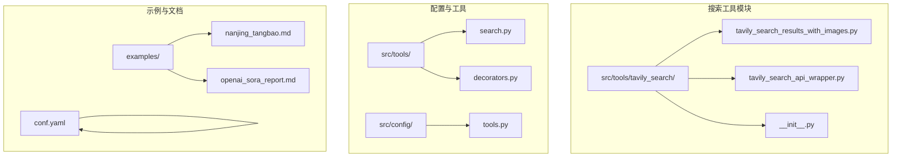
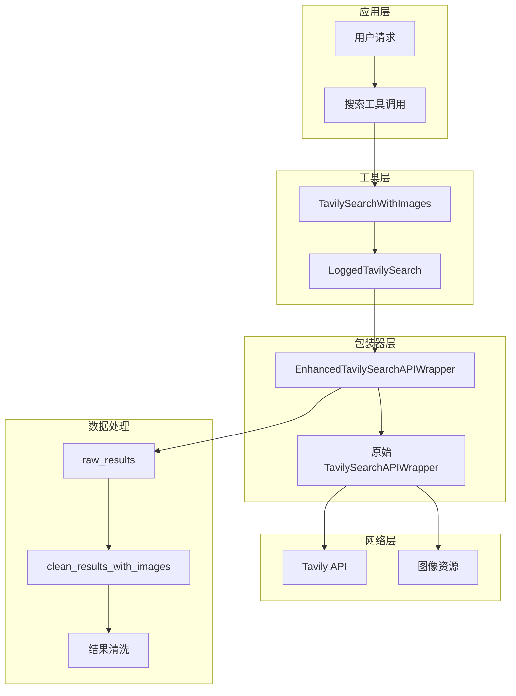
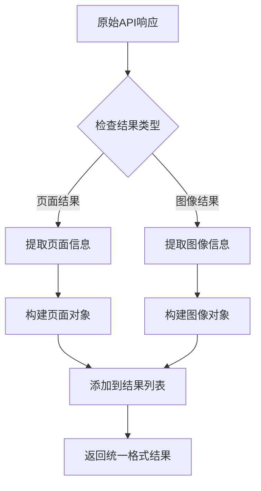
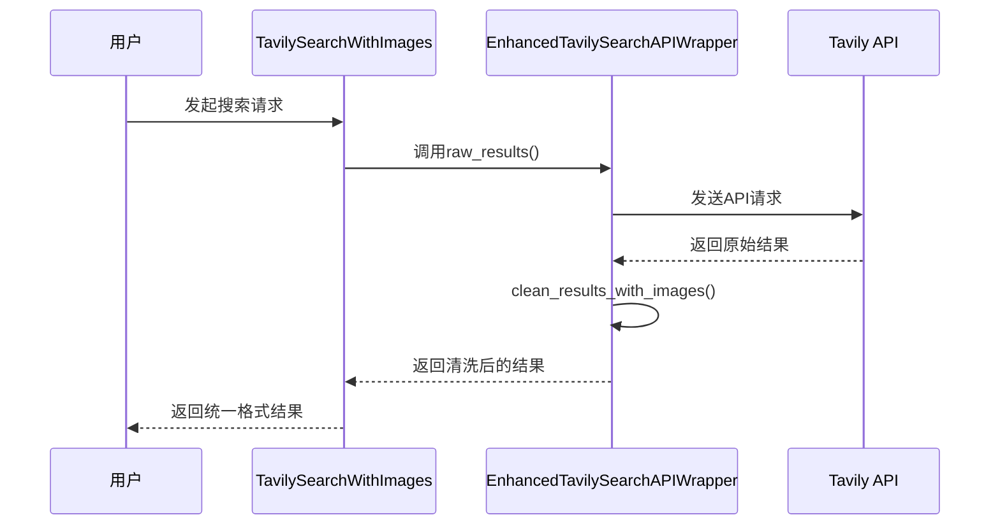

# 带图片结果的搜索功能详细文档

<cite>
**本文档引用的文件**
- [tavily_search_results_with_images.py](file://src/tools/tavily_search/tavily_search_results_with_images.py)
- [tavily_search_api_wrapper.py](file://src/tools/tavily_search/tavily_search_api_wrapper.py)
- [test_tavily_search_results_with_images.py](file://tests/unit/tools/test_tavily_search_results_with_images.py)
- [test_tavily_search_api_wrapper.py](file://tests/unit/tools/test_tavily_search_api_wrapper.py)
- [search.py](file://src/tools/search.py)
- [decorators.py](file://src/tools/decorators.py)
- [conf.yaml](file://conf.yaml)
- [reporter.md](file://src/prompts/reporter.md)
- [researcher.md](file://src/prompts/researcher.md)
- [nanjing_tangbao.md](file://examples/nanjing_tangbao.md)
- [openai_sora_report.md](file://examples/openai_sora_report.md)
</cite>

## 目录
1. [简介](#简介)
2. [项目结构概览](#项目结构概览)
3. [核心组件分析](#核心组件分析)
4. [架构概览](#架构概览)
5. [详细组件分析](#详细组件分析)
6. [数据结构与处理流程](#数据结构与处理流程)
7. [使用示例与最佳实践](#使用示例与最佳实践)
8. [性能考量与优化建议](#性能考量与优化建议)
9. [故障排除指南](#故障排除指南)
10. [结论](#结论)

## 简介

带图片结果的搜索功能是deer-flow框架中的一个重要扩展模块，它基于Tavily搜索引擎API，为用户提供包含图像结果的综合搜索能力。该功能通过`TavilySearchWithImages`类实现了对传统文本搜索的扩展，能够同时检索网页内容和相关图像，并提供丰富的元信息。

该功能特别适用于需要视觉内容的研究场景，如产品分析、地理特征研究、文化现象调查等。通过集成图像描述和元数据，用户可以获得更全面的信息理解，提升研究报告的质量和说服力。

## 项目结构概览

带图片结果搜索功能的实现分布在以下关键目录和文件中：



**图表来源**
- [tavily_search_results_with_images.py](file://src/tools/tavily_search/tavily_search_results_with_images.py#L1-L165)
- [tavily_search_api_wrapper.py](file://src/tools/tavily_search/tavily_search_api_wrapper.py#L1-L114)
- [search.py](file://src/tools/search.py#L1-L95)

## 核心组件分析

### TavilySearchWithImages 类

`TavilySearchWithImages`类是整个功能的核心，它继承自`TavilySearchResults`并扩展了图像搜索能力：

```python
class TavilySearchWithImages(TavilySearchResults):
    """Tool that queries the Tavily Search API and gets back json."""
    
    include_image_descriptions: bool = False
    api_wrapper: EnhancedTavilySearchAPIWrapper = Field(
        default_factory=EnhancedTavilySearchAPIWrapper
    )
```

该类的主要特性包括：
- **图像检索支持**：通过`include_images`参数启用图像结果获取
- **描述信息**：可选择是否包含图像描述信息
- **同步异步支持**：同时支持同步和异步搜索操作
- **错误处理**：完善的异常捕获和日志记录机制

### EnhancedTavilySearchAPIWrapper 类

这是增强的API包装器，负责与Tavily搜索引擎的实际交互：

```python
class EnhancedTavilySearchAPIWrapper(OriginalTavilySearchAPIWrapper):
    def raw_results(self, query: str, max_results: Optional[int] = 5, 
                   search_depth: Optional[str] = "advanced", 
                   include_images: Optional[bool] = False, 
                   include_image_descriptions: Optional[bool] = False) -> Dict:
```

**章节来源**
- [tavily_search_results_with_images.py](file://src/tools/tavily_search/tavily_search_results_with_images.py#L25-L165)
- [tavily_search_api_wrapper.py](file://src/tools/tavily_search/tavily_search_api_wrapper.py#L15-L114)

## 架构概览

带图片结果搜索功能采用了分层架构设计，确保了良好的可维护性和扩展性：



**图表来源**
- [tavily_search_results_with_images.py](file://src/tools/tavily_search/tavily_search_results_with_images.py#L25-L165)
- [tavily_search_api_wrapper.py](file://src/tools/tavily_search/tavily_search_api_wrapper.py#L15-L114)
- [search.py](file://src/tools/search.py#L36-L95)

## 详细组件分析

### 图像结果数据结构

当启用图像搜索时，Tavily API返回的结果包含两种类型的数据：

#### 页面结果结构
```python
{
    "type": "page",
    "title": "页面标题",
    "url": "页面URL",
    "content": "页面内容摘要",
    "score": 0.95,
    "raw_content": "完整页面内容（如果启用）"
}
```

#### 图像结果结构
```python
{
    "type": "image",
    "image_url": "图像URL",
    "image_description": "图像描述信息"
}
```

### 结果清洗流程

`clean_results_with_images`方法负责将原始API响应转换为统一的格式：



**图表来源**
- [tavily_search_api_wrapper.py](file://src/tools/tavily_search/tavily_search_api_wrapper.py#L84-L112)

### 同步与异步搜索

系统同时支持同步和异步搜索操作，以适应不同的使用场景：

#### 同步搜索
```python
def _run(self, query: str, run_manager: Optional[CallbackManagerForToolRun] = None) -> Tuple[Union[List[Dict[str, str]], str], Dict]:
    try:
        raw_results = self.api_wrapper.raw_results(...)
        cleaned_results = self.api_wrapper.clean_results_with_images(raw_results)
        return cleaned_results, raw_results
    except Exception as e:
        logger.error("Tavily search returned error: {}".format(e))
        return repr(e), {}
```

#### 异步搜索
```python
async def _arun(self, query: str, run_manager: Optional[AsyncCallbackManagerForToolRun] = None) -> Tuple[Union[List[Dict[str, str]], str], Dict]:
    try:
        raw_results = await self.api_wrapper.raw_results_async(...)
        cleaned_results = self.api_wrapper.clean_results_with_images(raw_results)
        return cleaned_results, raw_results
    except Exception as e:
        logger.error("Tavily search returned error: {}".format(e))
        return repr(e), {}
```

**章节来源**
- [tavily_search_results_with_images.py](file://src/tools/tavily_search/tavily_search_results_with_images.py#L115-L165)

## 数据结构与处理流程

### 配置参数详解

带图片结果搜索功能支持多种配置参数：

| 参数名称 | 类型 | 默认值 | 描述 |
|---------|------|--------|------|
| `max_results` | int | 5 | 最大返回结果数量 |
| `search_depth` | str | "advanced" | 搜索深度级别 |
| `include_domains` | List[str] | [] | 包含的域名列表 |
| `exclude_domains` | List[str] | [] | 排除的域名列表 |
| `include_answer` | bool | False | 是否包含直接答案 |
| `include_raw_content` | bool | False | 是否包含原始内容 |
| `include_images` | bool | False | 是否包含图像结果 |
| `include_image_descriptions` | bool | False | 是否包含图像描述 |

### 请求参数映射

系统会将这些参数映射到Tavily API的相应字段：

```python
params = {
    "api_key": self.tavily_api_key.get_secret_value(),
    "query": query,
    "max_results": max_results,
    "search_depth": search_depth,
    "include_domains": include_domains,
    "exclude_domains": exclude_domains,
    "include_answer": include_answer,
    "include_raw_content": include_raw_content,
    "include_images": include_images,
    "include_image_descriptions": include_image_descriptions,
}
```

### 结果格式标准化

无论原始API返回何种格式，系统都会将其标准化为统一的输出格式：



**图表来源**
- [tavily_search_results_with_images.py](file://src/tools/tavily_search/tavily_search_results_with_images.py#L115-L165)
- [tavily_search_api_wrapper.py](file://src/tools/tavily_search/tavily_search_api_wrapper.py#L20-L80)

**章节来源**
- [tavily_search_api_wrapper.py](file://src/tools/tavily_search/tavily_search_api_wrapper.py#L20-L80)
- [tavily_search_results_with_images.py](file://src/tools/tavily_search/tavily_search_results_with_images.py#L115-L165)

## 使用示例与最佳实践

### 基本使用示例

#### 初始化搜索工具
```python
from src.tools.tavily_search.tavily_search_results_with_images import TavilySearchWithImages

# 创建带图片搜索的工具实例
search_tool = TavilySearchWithImages(
    max_results=5,
    include_answer=True,
    include_raw_content=True,
    include_images=True,
    include_image_descriptions=True
)
```

#### 执行搜索查询
```python
# 同步搜索
results, raw_data = search_tool._run("南京小笼包历史")

# 异步搜索
results, raw_data = await search_tool._arun("OpenAI Sora 功能特点")
```

### 实际应用场景

#### 文化遗产研究
```python
# 研究特定地区的传统美食
results, _ = search_tool._run("南京汤包制作工艺")
# 结果将包含：
# - 文字描述：制作方法、历史背景
# - 图像结果：制作过程、成品展示
# - 相关链接：权威来源、文化介绍
```

#### 科技产品分析
```python
# 分析新兴技术产品的功能特性
results, _ = search_tool._run("OpenAI Sora 视频生成能力")
# 结果将包含：
# - 技术规格：分辨率、时长限制
# - 应用案例：实际使用场景
# - 产品截图：界面演示、功能展示
```

### 提示词优化策略

为了有效利用图像信息，建议采用以下提示词策略：

#### 结构化查询
```
"关键词1 关键词2" site:example.com -exclude_word
```

#### 时间范围限定
```
"关键词 after:2024-01-01 before:2024-12-31"
```

#### 地域限定
```
"关键词 北京 site:gov.cn"
```

### 配置最佳实践

#### 在conf.yaml中的配置
```yaml
SEARCH_ENGINE:
  engine: tavily
  include_domains:
    - example.com
    - trusted-news.com
    - reliable-source.org
  exclude_domains:
    - spam.com
```

#### 动态工具加载
```python
from src.tools.search import get_web_search_tool

# 获取带图片搜索功能的工具
search_tool = get_web_search_tool(
    max_search_results=10,
    engine="tavily"
)
```

**章节来源**
- [search.py](file://src/tools/search.py#L36-L95)
- [conf.yaml](file://conf.yaml#L25-L40)

## 性能考量与优化建议

### 带宽与延迟考虑

启用图像搜索功能会显著增加网络带宽消耗：

#### 带宽影响因素
- **图像数量**：每条搜索结果可能包含多个图像
- **图像质量**：高分辨率图像占用更多带宽
- **并发请求数**：同时进行的搜索请求数量

#### 性能优化策略
1. **合理设置max_results**：避免过多结果导致带宽浪费
2. **控制图像质量**：优先使用压缩版本的图像
3. **缓存机制**：对重复的图像URL进行缓存
4. **异步处理**：利用异步搜索减少等待时间

### 内存管理

#### 结果处理优化
```python
# 避免一次性加载所有图像到内存
def process_results_efficiently(results):
    for item in results:
        if item["type"] == "image":
            # 只处理必要的图像信息
            yield {
                "image_url": item["image_url"],
                "description": item.get("image_description", "")
            }
        else:
            # 处理页面内容
            yield item
```

### 错误处理与重试机制

系统内置了完善的错误处理机制：

```python
try:
    raw_results = self.api_wrapper.raw_results(...)
    cleaned_results = self.api_wrapper.clean_results_with_images(raw_results)
    return cleaned_results, raw_results
except Exception as e:
    logger.error("Tavily search returned error: {}".format(e))
    return repr(e), {}
```

**章节来源**
- [tavily_search_results_with_images.py](file://src/tools/tavily_search/tavily_search_results_with_images.py#L115-L165)

## 故障排除指南

### 常见问题与解决方案

#### API密钥问题
**症状**：搜索失败或返回认证错误
**解决方案**：
1. 确认TAVILY_API_KEY环境变量已正确设置
2. 检查API密钥的有效性和权限
3. 验证网络连接和防火墙设置

#### 网络连接问题
**症状**：请求超时或连接失败
**解决方案**：
1. 检查网络连接状态
2. 验证Tavily API服务可用性
3. 考虑使用代理服务器

#### 结果格式问题
**症状**：返回结果格式不符合预期
**解决方案**：
1. 检查API响应格式
2. 验证clean_results_with_images方法逻辑
3. 查看日志中的调试信息

### 调试技巧

#### 启用详细日志
```python
import logging
logging.basicConfig(level=logging.DEBUG)
logger = logging.getLogger(__name__)
```

#### 测试API连接
```python
# 直接测试API连接
wrapper = EnhancedTavilySearchAPIWrapper(tavily_api_key="your-key")
try:
    result = wrapper.raw_results("test query", max_results=1)
    print("API connection successful")
except Exception as e:
    print(f"API connection failed: {e}")
```

### 监控与维护

#### 性能监控指标
- **响应时间**：平均和最大响应时间
- **成功率**：成功请求与总请求数的比例
- **带宽使用**：图像传输的总字节数
- **错误率**：各类错误的发生频率

#### 维护建议
1. 定期更新API密钥
2. 监控服务可用性
3. 优化查询参数
4. 更新依赖库版本

**章节来源**
- [tavily_search_results_with_images.py](file://src/tools/tavily_search/tavily_search_results_with_images.py#L115-L165)
- [test_tavily_search_results_with_images.py](file://tests/unit/tools/test_tavily_search_results_with_images.py#L75-L201)

## 结论

带图片结果的搜索功能为deer-flow框架提供了强大的视觉内容检索能力。通过`TavilySearchWithImages`类和`EnhancedTavilySearchAPIWrapper`包装器的协同工作，系统能够高效地检索和处理包含图像的综合搜索结果。

### 主要优势

1. **功能完整性**：支持同步和异步操作，满足不同使用场景
2. **数据标准化**：统一的输出格式便于后续处理
3. **错误处理**：完善的异常捕获和日志记录机制
4. **配置灵活**：丰富的参数配置选项适应各种需求
5. **易于集成**：与现有搜索工具无缝集成

### 应用价值

该功能特别适用于需要视觉内容的研究场景，如：
- 文化遗产和传统工艺研究
- 科技产品功能分析
- 地理特征和景观调查
- 市场趋势和产品比较

### 发展方向

未来可以考虑的功能扩展：
- 图像识别和分类
- 视觉内容推荐算法
- 多模态搜索结果融合
- 实时图像处理能力

通过持续的优化和扩展，带图片结果的搜索功能将继续为用户提供更加强大和便捷的信息检索体验。