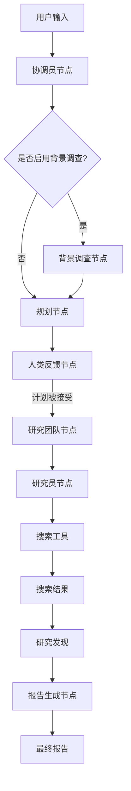
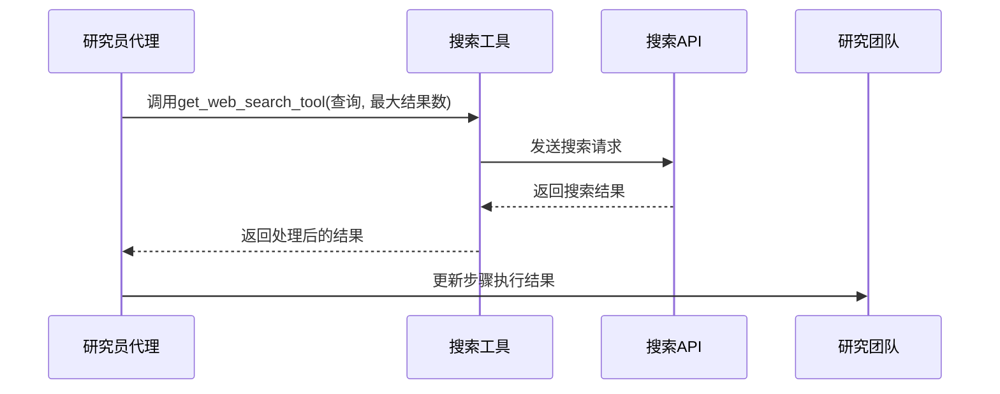
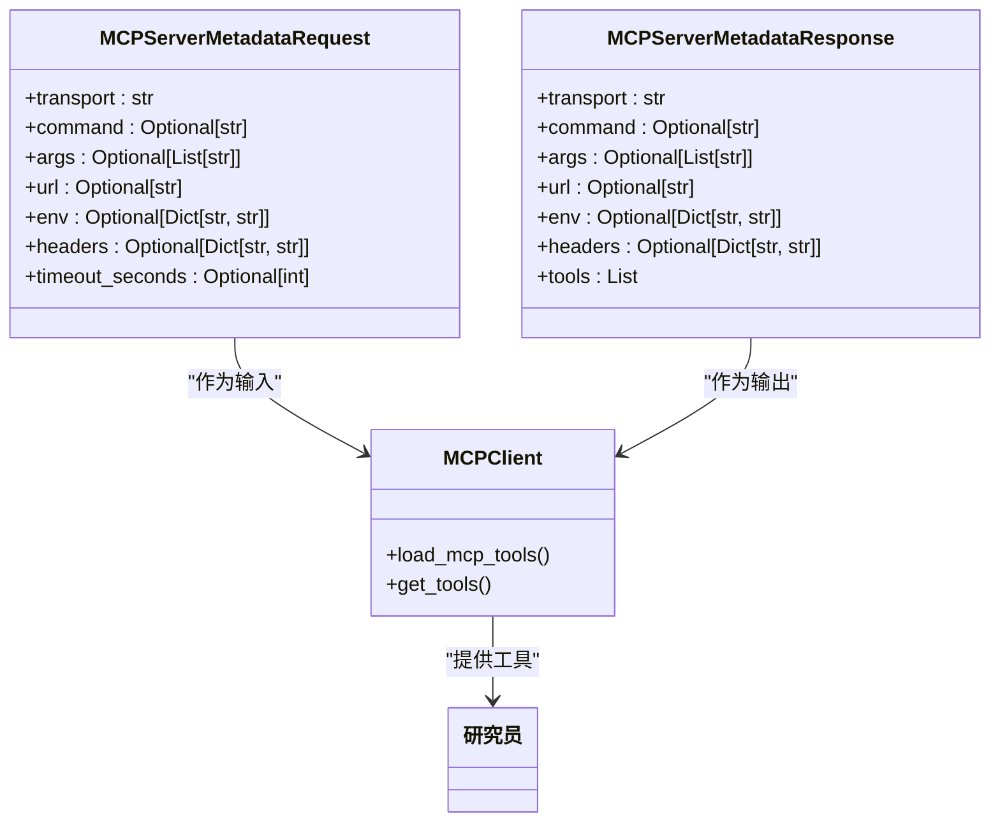

# 搜索工具在工作流中的应用

<cite>
**本文档引用的文件**
- [search.py](file://src/tools/search.py)
- [custom_search.py](file://src/tools/custom_search.py)
- [custom_search.py](file://src/config/custom_search.py)
- [configuration.py](file://src/config/configuration.py)
- [tools.py](file://src/config/tools.py)
- [nodes.py](file://src/graph/nodes.py)
- [mcp_request.py](file://src/server/mcp_request.py)
- [mcp_utils.py](file://src/server/mcp_utils.py)
- [mock_search_api.py](file://middlewares/search/mock_search_api.py)
- [conf.yaml](file://conf.yaml)
- [workflow.py](file://src/workflow.py)
- [researcher.md](file://src/prompts/researcher.md)
- [what_is_mcp.md](file://examples/what_is_mcp.md)
</cite>

## 目录
1. [引言](#引言)
2. [搜索工具集成架构](#搜索工具集成架构)
3. [研究员代理节点的搜索调用](#研究员代理节点的搜索调用)
4. [MCP协议在搜索中的作用](#mcp协议在搜索中的作用)
5. [搜索工作流序列图](#搜索工作流序列图)
6. [实际案例分析](#实际案例分析)
7. [结论](#结论)

## 引言
本文档详细阐述了搜索工具在多智能体工作流中的应用，重点分析了搜索功能如何与整体工作流集成。文档将深入探讨研究员代理节点如何调用搜索工具进行信息收集，以及搜索结果如何影响后续的规划和报告生成节点。同时，本文将解释MCP协议在搜索工具调用中的作用，包括请求格式、响应处理和错误传播机制。通过提供工作流中搜索调用的序列图或流程图，展示数据流和控制流，并结合实际案例分析，全面揭示复杂问题研究中多轮搜索的协调机制以及人工干预对搜索策略的影响。

## 搜索工具集成架构

搜索工具在多智能体工作流中扮演着核心角色，为各个代理节点提供外部信息获取能力。系统通过`src/tools/search.py`文件中的`get_web_search_tool`函数来获取和配置搜索工具，该函数根据配置选择不同的搜索引擎，包括Tavily、DuckDuckGo、Brave Search、Arxiv、Wikipedia以及自定义搜索引擎。

搜索工具的配置主要通过`conf.yaml`文件中的`SEARCH_ENGINE`和`CUSTOM_SEARCH`部分进行管理。`SEARCH_ENGINE`部分定义了默认的搜索引擎及其相关参数，如包含和排除的域名列表。`CUSTOM_SEARCH`部分则定义了自定义搜索引擎的配置，包括多个可用的repository，如“聚合搜索”、“向量库”和“交行知道”，并指定了默认的repository。

**Diagram sources**
- [conf.yaml](file://conf.yaml#L45-L68)
- [search.py](file://src/tools/search.py#L1-L113)

**Section sources**
- [search.py](file://src/tools/search.py#L1-L113)
- [conf.yaml](file://conf.yaml#L45-L68)

## 研究员代理节点的搜索调用

研究员代理节点是搜索工具的主要调用者，负责执行具体的搜索任务。在`src/graph/nodes.py`文件中，`researcher_node`函数定义了研究员节点的行为。该节点通过`_setup_and_execute_agent_step`辅助函数来设置和执行代理步骤，其中包含了搜索工具的配置和调用。

当研究员节点被激活时，它会根据当前计划中的步骤来执行搜索。`researcher_node`首先获取配置的搜索工具，包括`get_web_search_tool`和`crawl_tool`，并根据是否有资源文件来决定是否添加`retriever_tool`。然后，它调用`_execute_agent_step`函数来执行具体的代理步骤。

在`_execute_agent_step`函数中，系统会找到当前计划中第一个未执行的步骤，并将其作为输入传递给代理。代理会根据输入生成搜索查询，并调用相应的搜索工具。搜索结果会被处理并更新到当前步骤的执行结果中，然后传递给下一个节点。

**Diagram sources**
- [nodes.py](file://src/graph/nodes.py#L300-L511)
- [search.py](file://src/tools/search.py#L1-L113)

**Section sources**
- [nodes.py](file://src/graph/nodes.py#L300-L511)

## MCP协议在搜索中的作用

MCP（Model Context Protocol）协议在搜索工具调用中起到了关键的桥梁作用，它定义了代理与外部工具之间的通信标准。在`src/server/mcp_request.py`文件中，`MCPServerMetadataRequest`和`MCPServerMetadataResponse`模型定义了MCP服务器元数据的请求和响应格式。

MCP协议通过`src/server/mcp_utils.py`文件中的`load_mcp_tools`函数来加载和管理工具。该函数根据服务器类型（stdio、sse或streamable_http）来创建相应的客户端，并从服务器获取可用的工具列表。这些工具可以被动态地加载到代理中，从而扩展其功能。

当研究员节点需要使用MCP工具时，`_setup_and_execute_agent_step`函数会检查配置中的MCP设置，并为代理加载相应的工具。这些工具可以是专门的搜索工具、数据库检索工具或其他服务，它们通过MCP协议与代理进行通信，实现了灵活的工具集成和调用。

**Diagram sources**
- [mcp_request.py](file://src/server/mcp_request.py#L1-L64)
- [mcp_utils.py](file://src/server/mcp_utils.py#L1-L122)

**Section sources**
- [mcp_request.py](file://src