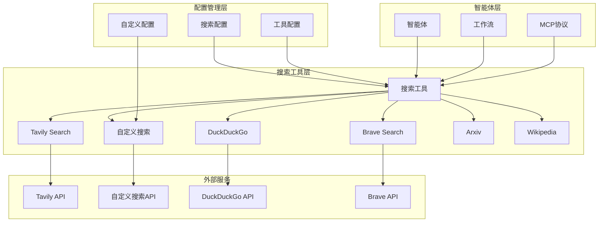
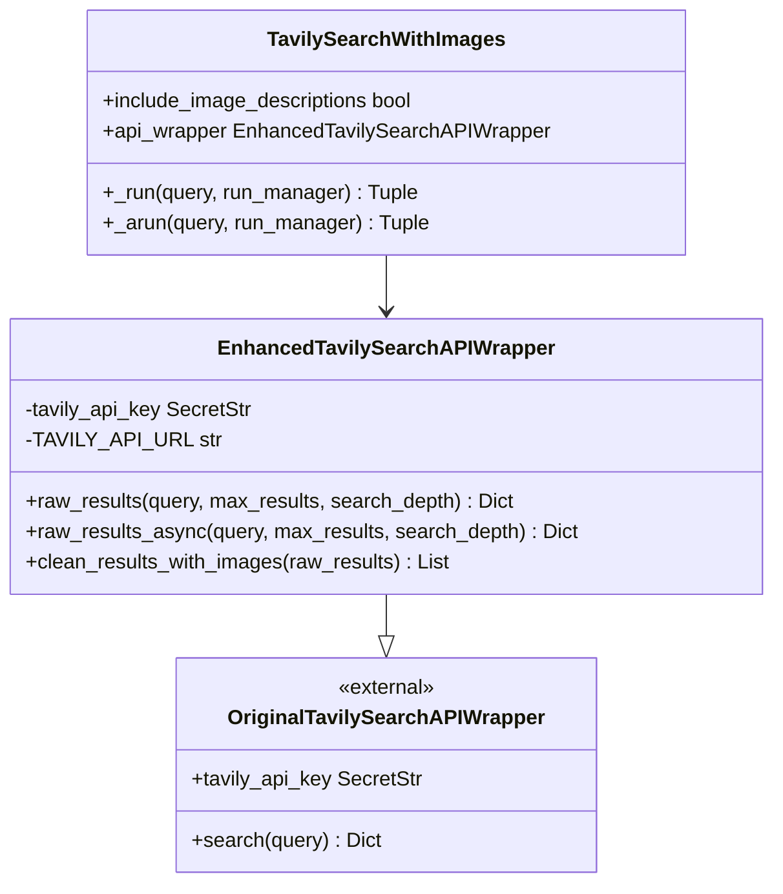
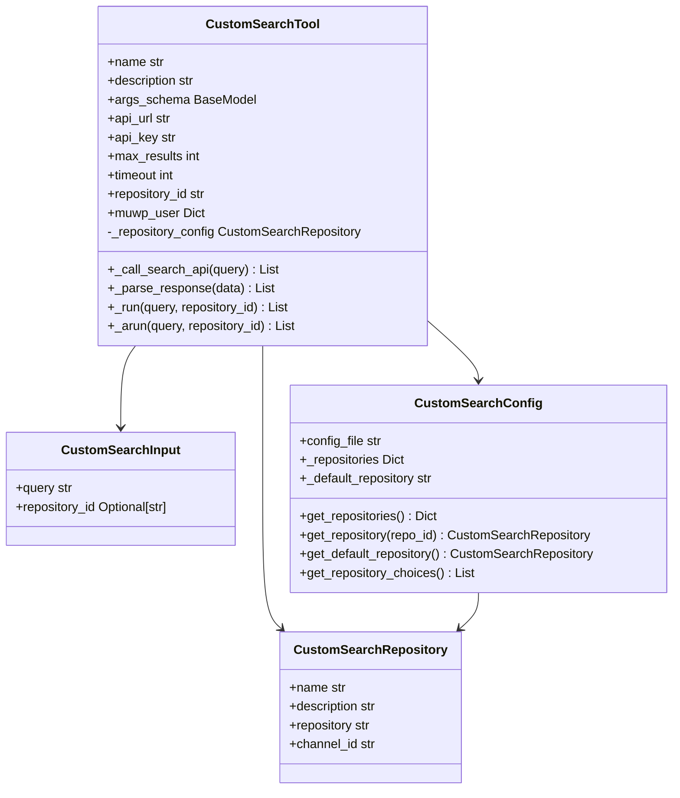
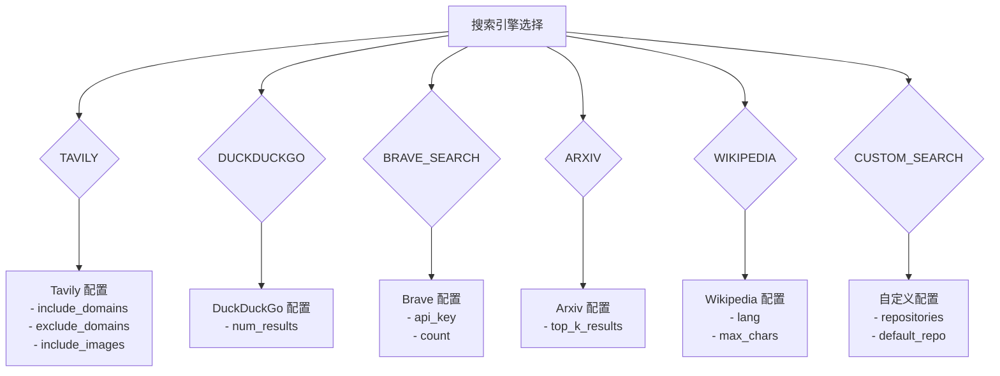
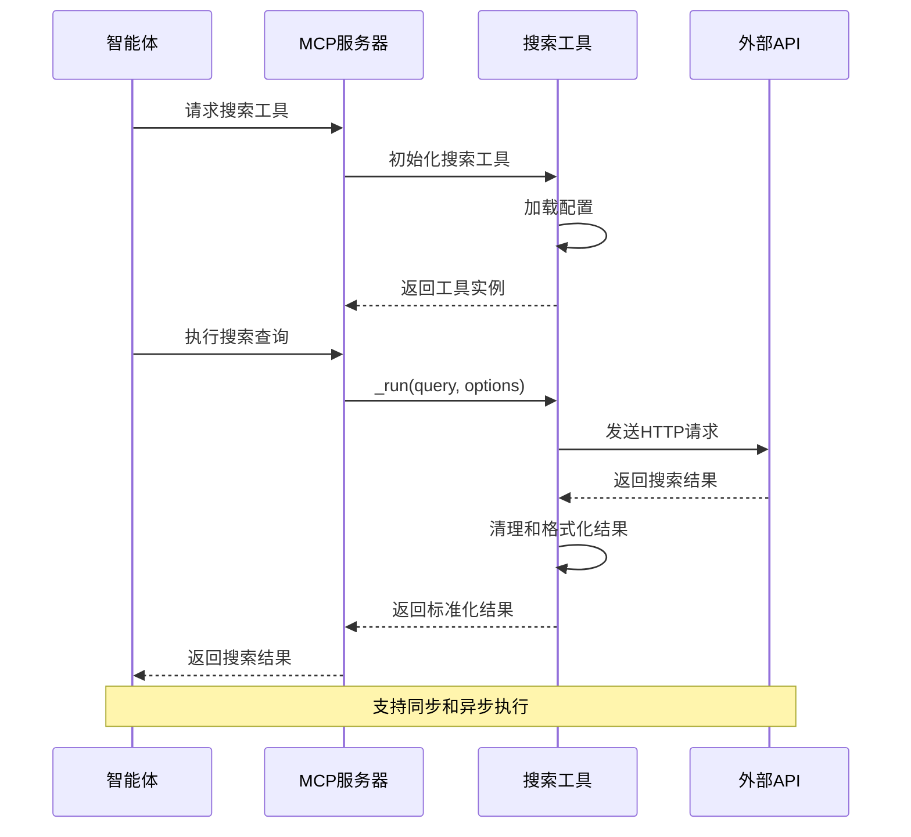
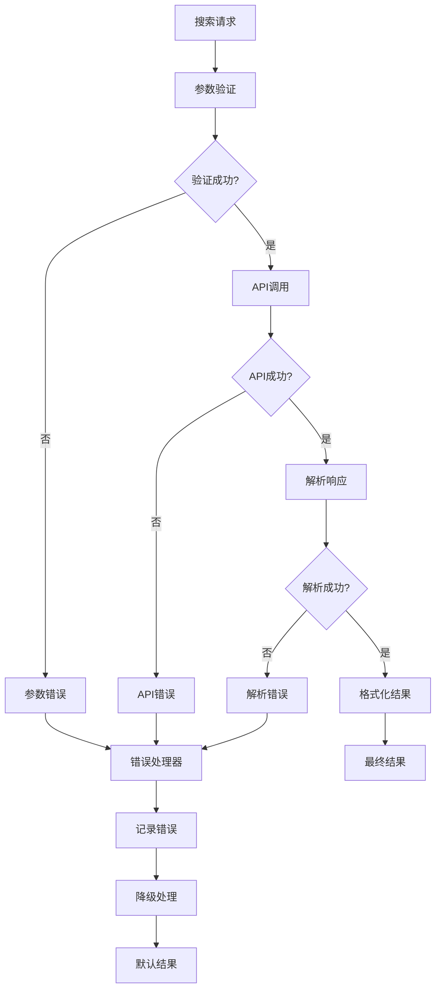

# 搜索工具集成

<cite>
**本文档引用的文件**
- [tavily_search_api_wrapper.py](file://src/tools/tavily_search/tavily_search_api_wrapper.py)
- [tavily_search_results_with_images.py](file://src/tools/tavily_search/tavily_search_results_with_images.py)
- [custom_search.py](file://src/tools/custom_search.py)
- [custom_search.py](file://src/config/custom_search.py)
- [search.py](file://src/tools/search.py)
- [configuration.py](file://src/config/configuration.py)
- [tools.py](file://src/config/tools.py)
- [conf.yaml](file://conf.yaml)
</cite>

## 目录
1. [简介](#简介)
2. [项目架构概览](#项目架构概览)
3. [Tavily Search 集成](#tavily-search-集成)
4. [自定义搜索服务](#自定义搜索服务)
5. [搜索工具配置](#搜索工具配置)
6. [智能体工作流集成](#智能体工作流集成)
7. [错误处理与性能优化](#错误处理与性能优化)
8. [扩展指南](#扩展指南)
9. [故障排除](#故障排除)
10. [总结](#总结)

## 简介

DeerFlow 搜索工具集成是一个高度模块化的搜索解决方案，支持多种搜索引擎和服务提供商。该系统主要包含两个核心组件：Tavily Search 和自定义搜索服务，为智能体工作流提供强大的信息检索能力。

系统设计遵循以下核心原则：
- **模块化架构**：每个搜索服务都是独立的模块，便于维护和扩展
- **统一接口**：所有搜索工具都实现相同的接口契约，确保一致性
- **配置驱动**：通过 YAML 配置文件管理搜索服务设置
- **异步支持**：提供同步和异步两种执行模式
- **错误处理**：完善的异常处理和降级机制

## 项目架构概览



**图表来源**
- [search.py](file://src/tools/search.py#L1-L114)
- [configuration.py](file://src/config/configuration.py#L1-L71)

## Tavily Search 集成

### TavilySearchAPIWrapper 增强类

TavilySearchAPIWrapper 是对原生 LangChain Tavily 包装器的增强实现，提供了更丰富的功能和更好的错误处理。



**图表来源**
- [tavily_search_api_wrapper.py](file://src/tools/tavily_search/tavily_search_api_wrapper.py#L1-L114)
- [tavily_search_results_with_images.py](file://src/tools/tavily_search/tavily_search_results_with_images.py#L1-L165)

#### 核心功能特性

1. **增强的 API 调用**：支持同步和异步两种调用方式
2. **图像结果支持**：扩展基础搜索功能以支持图像结果
3. **结果清理**：提供标准化的结果格式化
4. **参数验证**：完整的查询参数验证和处理

#### 同步 API 调用实现

```python
def raw_results(
    self,
    query: str,
    max_results: Optional[int] = 5,
    search_depth: Optional[str] = "advanced",
    include_domains: Optional[List[str]] = [],
    exclude_domains: Optional[List[str]] = [],
    include_answer: Optional[bool] = False,
    include_raw_content: Optional[bool] = False,
    include_images: Optional[bool] = False,
    include_image_descriptions: Optional[bool] = False,
) -> Dict:
    params = {
        "api_key": self.tavily_api_key.get_secret_value(),
        "query": query,
        "max_results": max_results,
        "search_depth": search_depth,
        "include_domains": include_domains,
        "exclude_domains": exclude_domains,
        "include_answer": include_answer,
        "include_raw_content": include_raw_content,
        "include_images": include_images,
        "include_image_descriptions": include_image_descriptions,
    }
    response = requests.post(f"{TAVILY_API_URL}/search", json=params)
    response.raise_for_status()
    return response.json()
```

#### 异步 API 调用实现

系统还提供了异步版本的 API 调用，使用 aiohttp 库实现非阻塞的 HTTP 请求：

```python
async def raw_results_async(
    self,
    query: str,
    max_results: Optional[int] = 5,
    search_depth: Optional[str] = "advanced",
    include_domains: Optional[List[str]] = [],
    exclude_domains: Optional[List[str]] = [],
    include_answer: Optional[bool] = False,
    include_raw_content: Optional[bool] = False,
    include_images: Optional[bool] = False,
    include_image_descriptions: Optional[bool] = False,
) -> Dict:
    async with aiohttp.ClientSession(trust_env=True) as session:
        async with session.post(f"{TAVILY_API_URL}/search", json=params) as res:
            if res.status == 200:
                data = await res.text()
                return json.loads(data)
            else:
                raise Exception(f"Error {res.status}: {res.reason}")
```

**章节来源**
- [tavily_search_api_wrapper.py](file://src/tools/tavily_search/tavily_search_api_wrapper.py#L18-L85)

### TavilySearchWithImages 工具

TavilySearchWithImages 是一个完整的搜索工具实现，继承自 LangChain 的 TavilySearchResults 类。

#### 工具配置选项

```python
class TavilySearchWithImages(TavilySearchResults):
    include_image_descriptions: bool = False
    api_wrapper: EnhancedTavilySearchAPIWrapper = Field(
        default_factory=EnhancedTavilySearchAPIWrapper
    )
```

#### 结果格式化

工具提供统一的结果格式化功能，将原始 API 响应转换为标准化格式：

```python
def clean_results_with_images(self, raw_results: Dict[str, List[Dict]]) -> List[Dict]:
    results = raw_results["results"]
    clean_results = []
    for result in results:
        clean_result = {
            "type": "page",
            "title": result["title"],
            "url": result["url"],
            "content": result["content"],
            "score": result["score"],
        }
        if raw_content := result.get("raw_content"):
            clean_result["raw_content"] = raw_content
        clean_results.append(clean_result)
    
    images = raw_results["images"]
    for image in images:
        clean_result = {
            "type": "image",
            "image_url": image["url"],
            "image_description": image["description"],
        }
        clean_results.append(clean_result)
    return clean_results
```

**章节来源**
- [tavily_search_results_with_images.py](file://src/tools/tavily_search/tavily_search_results_with_images.py#L1-L165)

## 自定义搜索服务

### CustomSearchTool 实现

自定义搜索服务是 DeerFlow 的核心特色之一，专门针对交通银行内部搜索需求设计。



**图表来源**
- [custom_search.py](file://src/tools/custom_search.py#L1-L295)
- [custom_search.py](file://src/config/custom_search.py#L1-L120)

#### 核心功能特性

1. **多仓库支持**：支持多个搜索仓库配置
2. **动态切换**：运行时动态切换搜索仓库
3. **用户信息管理**：自动管理 MUWP 用户信息
4. **错误恢复**：完善的错误处理和降级机制
5. **异步支持**：提供异步执行选项

#### 仓库配置管理

系统支持多种预定义的搜索仓库：

```python
default_repos = {
    "aggregation_search": CustomSearchRepository(
        name="聚合搜索",
        description="聚合多个数据源的搜索服务",
        repository="aggregation-search",
        channel_id="0"
    ),
    "vector_search": CustomSearchRepository(
        name="向量库",
        description="基于向量相似度的搜索服务",
        repository="euvd-searchByChannelId",
        channel_id="0"
    ),
    "dynamic_search": CustomSearchRepository(
        name="交行知道",
        description="交通银行内部知识库搜索",
        repository="okic-dynamicSearch",
        channel_id="0"
    )
}
```

#### API 请求格式

自定义搜索工具使用特定的 JSON 格式与交通银行内部 API 通信：

```python
payload = {
    "REQ_HEAD": {
        "TRANS_PROCESS": "",
        "TRAN_ID": ""
    },
    "REQ_BODY": {
        "param": {
            "messages": [
                {
                    "content": query,
                    "role": "user"
                }
            ],
            "repository": self._repository_config.repository,
            "param": {
                "channelId": self._repository_config.channel_id
            }
        },
        "muwpUser": self.muwp_user
    }
}
```

#### 结果解析与转换

工具将交通银行 API 的响应转换为统一的标准格式：

```python
def _parse_response(self, data: Dict[str, Any]) -> List[Dict[str, Any]]:
    results = []
    rsp_head = data.get("RSP_HEAD", {})
    if rsp_head.get("TRAN_SUCCESS") != "1":
        logger.warning(f"Search API returned error: {rsp_head}")
        return results
    
    rsp_body = data.get("RSP_BODY", {})
    api_results = rsp_body.get("result", [])
    
    for item in api_results:
        result = {
            "title": item.get("title", "").strip(),
            "url": item.get("url") or "",
            "content": item.get("content", "").strip() or item.get("absContent", "").strip(),
            "source": item.get("source", ""),
            "score": float(item.get("score", 0)) if item.get("score") else 0.0,
            "doc_id": item.get("docId", ""),
            "repository": item.get("repository", "")
        }
        
        # 添加其他可用字段
        if item.get("createTime"):
            result["create_time"] = item["createTime"]
        if item.get("updateTime"):
            result["update_time"] = item["updateTime"]
        if item.get("fullCategoryName"):
            result["category"] = item["fullCategoryName"]
        if item.get("fullOrgName"):
            result["organization"] = item["fullOrgName"]
            
        if result["title"] or result["content"]:
            results.append(result)
    
    results.sort(key=lambda x: x.get("score", 0), reverse=True)
    return results[:self.max_results]
```

**章节来源**
- [custom_search.py](file://src/tools/custom_search.py#L1-L295)

## 搜索工具配置

### 配置文件结构

搜索工具的配置通过 `conf.yaml` 文件管理，支持多种搜索引擎和服务提供商。

```yaml
SEARCH_ENGINE:
  engine: tavily
  include_domains:
    - example.com
    - trusted-news.com
    - reliable-source.org
    - gov.cn
    - edu.cn
  exclude_domains:
    - example.com

CUSTOM_SEARCH:
  repositories:
    aggregation_search:
      name: "聚合搜索"
      description: "聚合多个数据源的搜索服务"
      repository: "aggregation-search"
      channel_id: "0"
    vector_search:
      name: "向量库"
      description: "基于向量相似度的搜索服务"
      repository: "euvd-searchByChannelId"
      channel_id: "0"
    dynamic_search:
      name: "交行知道"
      description: "交通银行内部知识库搜索"
      repository: "okic-dynamicSearch"
      channel_id: "0"
  default_repository: "dynamic_search"
```

### 支持的搜索引擎

系统支持多种搜索引擎，每种都有其特定的配置选项：



**图表来源**
- [conf.yaml](file://conf.yaml#L25-L68)
- [tools.py](file://src/config/tools.py#L1-L32)

### 动态工具选择

系统根据配置动态选择合适的搜索工具：

```python
def get_web_search_tool(max_search_results: int, engine: str = None, repository_id: str = None):
    search_config = get_search_config()
    selected_engine = engine or SELECTED_SEARCH_ENGINE
    
    if selected_engine == SearchEngine.TAVILY.value:
        include_domains = search_config.get("include_domains", [])
        exclude_domains = search_config.get("exclude_domains", [])
        
        return LoggedTavilySearch(
            name="web_search",
            max_results=max_search_results,
            include_raw_content=True,
            include_images=True,
            include_image_descriptions=True,
            include_domains=include_domains,
            exclude_domains=exclude_domains,
        )
    elif selected_engine == SearchEngine.CUSTOM_SEARCH.value:
        if repository_id:
            return create_custom_search_with_repository(repository_id=repository_id, max_results=max_search_results)
        else:
            return get_custom_search_tool(max_results=max_search_results)
    # ... 其他引擎的处理逻辑
```

**章节来源**
- [search.py](file://src/tools/search.py#L1-L114)

## 智能体工作流集成

### MCP 协议支持

DeerFlow 通过 MCP（Model Context Protocol）协议为智能体提供搜索功能。系统实现了统一的工具接口，支持各种智能体框架。



**图表来源**
- [search.py](file://src/tools/search.py#L40-L114)

### 工具装饰器

系统使用装饰器模式为搜索工具添加日志记录功能：

```python
from src.tools.decorators import create_logged_tool

LoggedTavilySearch = create_logged_tool(TavilySearchWithImages)
LoggedDuckDuckGoSearch = create_logged_tool(DuckDuckGoSearchResults)
LoggedBraveSearch = create_logged_tool(BraveSearch)
```

### 配置驱动的工具初始化

智能体可以通过配置文件或运行时参数动态配置搜索工具：

```python
# 从配置文件读取
config = load_yaml_config("conf.yaml")
search_config = config.get("SEARCH_ENGINE", {})

# 创建工具实例
search_tool = get_web_search_tool(
    max_search_results=5,
    engine=search_config.get("engine", "tavily")
)

# 或者通过智能体配置
agent_config = {
    "search_engine": "custom_search",
    "custom_search_repository": "dynamic_search"
}
```

**章节来源**
- [search.py](file://src/tools/search.py#L20-L35)

## 错误处理与性能优化

### 错误处理机制

系统实现了多层次的错误处理机制：



#### 异常处理实现

```python
def _run(self, query: str, run_manager: Optional[CallbackManagerForToolRun] = None) -> List[Dict[str, Any]]:
    try:
        results = self._call_search_api(query)
        if not results:
            logger.warning("No search results found")
            return [{
                "title": "未找到相关结果",
                "url": "",
                "content": f"未能找到与查询“{query}”相关的信息，请尝试使用不同的关键词。",
                "source": "system",
                "score": 0.0
            }]
        return results
    except requests.exceptions.RequestException as e:
        logger.error(f"Custom search API request failed: {e}")
        return [{
            "title": "搜索错误",
            "url": "",
            "content": f"搜索服务出现错误: {str(e)}",
            "source": "error",
            "score": 0.0
        }]
    except Exception as e:
        logger.error(f"Unexpected error in search API call: {e}")
        return []
```

### 性能优化策略

1. **连接池管理**：使用 aiohttp 的连接池提高并发性能
2. **超时控制**：合理的超时设置避免长时间等待
3. **结果缓存**：对频繁查询的结果进行缓存
4. **异步执行**：支持异步操作减少阻塞时间

```python
# 异步执行示例
async def _arun(self, query: str, run_manager: Optional[AsyncCallbackManagerForToolRun] = None) -> List[Dict[str, Any]]:
    try:
        raw_results = await self.api_wrapper.raw_results_async(
            query,
            self.max_results,
            self.search_depth,
            self.include_domains,
            self.exclude_domains,
            self.include_answer,
            self.include_raw_content,
            self.include_images,
            self.include_image_descriptions,
        )
        cleaned_results = self.api_wrapper.clean_results_with_images(raw_results)
        return cleaned_results, raw_results
    except Exception as e:
        logger.error(f"Tavily search returned error: {e}")
        return [], {}
```

**章节来源**
- [custom_search.py](file://src/tools/custom_search.py#L200-L250)
- [tavily_search_results_with_images.py](file://src/tools/tavily_search/tavily_search_results_with_images.py#L120-L165)

## 扩展指南

### 添加新的搜索提供商

要添加新的搜索提供商，需要遵循以下步骤：

#### 1. 创建工具类

```python
from langchain_core.tools import BaseTool
from pydantic import BaseModel, Field
from typing import Optional, Dict, Any

class NewSearchInput(BaseModel):
    query: str = Field(description="搜索查询字符串")
    max_results: Optional[int] = Field(default=10, description="最大结果数")

class NewSearchTool(BaseTool):
    name: str = "new_search_provider"
    description: str = "新的搜索提供商工具"
    args_schema: type[BaseModel] = NewSearchInput
    
    def _run(self, query: str, max_results: int = 10, run_manager: Optional[CallbackManagerForToolRun] = None) -> List[Dict[str, Any]]:
        # 实现搜索逻辑
        pass
    
    async def _arun(self, query: str, max_results: int = 10, run_manager: Optional[AsyncCallbackManagerForToolRun] = None) -> List[Dict[str, Any]]:
        # 实现异步搜索逻辑
        pass
```

#### 2. 更新工具枚举

```python
class SearchEngine(enum.Enum):
    TAVILY = "tavily"
    DUCKDUCKGO = "duckduckgo"
    BRAVE_SEARCH = "brave_search"
    ARXIV = "arxiv"
    WIKIPEDIA = "wikipedia"
    CUSTOM_SEARCH = "custom_search"
    NEW_PROVIDER = "new_provider"  # 新增提供商
```

#### 3. 注册工具工厂函数

```python
def get_new_search_tool(max_results: int = 10) -> NewSearchTool:
    return NewSearchTool(max_results=max_results)

# 在 get_web_search_tool 中添加分支
elif selected_engine == SearchEngine.NEW_PROVIDER.value:
    return get_new_search_tool(max_results=max_search_results)
```

#### 4. 配置文件更新

```yaml
SEARCH_ENGINE:
  engine: new_provider
  
NEW_PROVIDER_CONFIG:
  api_key: "your-api-key"
  endpoint: "https://api.newprovider.com/search"
  timeout: 30
```

### 接口契约要求

所有搜索工具必须实现以下接口：

```python
class ISearchTool:
    def _run(self, query: str, **kwargs) -> List[Dict[str, Any]]:
        """同步执行搜索"""
        pass
    
    async def _arun(self, query: str, **kwargs) -> List[Dict[str, Any]]:
        """异步执行搜索"""
        pass
    
    def get_config(self) -> Dict[str, Any]:
        """获取工具配置"""
        pass
```

### 最佳实践

1. **标准化结果格式**：所有工具返回统一格式的结果
2. **错误处理**：实现完善的异常处理和降级机制
3. **日志记录**：添加详细的日志记录以便调试
4. **配置验证**：验证配置参数的有效性
5. **性能监控**：监控 API 调用时间和成功率

## 故障排除

### 常见问题及解决方案

#### 1. Tavily API 认证失败

**症状**：收到 "Invalid API key" 错误

**解决方案**：
```bash
# 检查环境变量
export TAVILY_API_KEY="your-api-key"

# 验证 API 密钥有效性
curl -X POST "https://api.tavily.com/search" \
     -H "Content-Type: application/json" \
     -d '{"api_key": "your-api-key", "query": "test"}'
```

#### 2. 自定义搜索 API 连接超时

**症状**：搜索请求超时或连接失败

**解决方案**：
```python
# 增加超时时间
custom_search = get_custom_search_tool(timeout=60)

# 检查网络连接
ping custom-search-api.example.com
```

#### 3. 配置文件格式错误

**症状**：启动时抛出配置解析错误

**解决方案**：
```yaml
# 正确的配置格式
SEARCH_ENGINE:
  engine: tavily
  include_domains:
    - example.com
  exclude_domains:
    - spam.com

CUSTOM_SEARCH:
  default_repository: dynamic_search
  repositories:
    dynamic_search:
      name: "交行知道"
      repository: "okic-dynamicSearch"
```

#### 4. 智能体无法识别搜索工具

**症状**：MCP 协议返回工具未找到错误

**解决方案**：
```python
# 确保工具已正确注册
from src.tools.search import get_web_search_tool

# 检查工具名称
tool = get_web_search_tool(max_search_results=5)
print(f"Tool name: {tool.name}")  # 应该是 "web_search"
```

### 调试技巧

1. **启用详细日志**：
```python
import logging
logging.basicConfig(level=logging.DEBUG)
```

2. **检查配置加载**：
```python
from src.config import load_yaml_config
config = load_yaml_config("conf.yaml")
print(config.get("SEARCH_ENGINE"))
```

3. **测试单个工具**：
```python
from src.tools.tavily_search.tavily_search_results_with_images import TavilySearchWithImages

tool = TavilySearchWithImages(max_results=3)
result, raw_data = tool._run("test query")
print(result)
```

## 总结

DeerFlow 搜索工具集成提供了一个强大、灵活且可扩展的搜索解决方案。通过模块化设计和统一接口，系统能够轻松集成多种搜索服务，并为智能体工作流提供可靠的信息检索能力。

### 主要优势

1. **多引擎支持**：支持 Tavily、自定义搜索等多种搜索服务
2. **统一接口**：所有工具都遵循相同的设计模式
3. **配置驱动**：通过 YAML 文件轻松配置和管理
4. **异步支持**：提供同步和异步两种执行模式
5. **错误处理**：完善的异常处理和降级机制
6. **易于扩展**：清晰的架构便于添加新的搜索提供商

### 未来发展方向

1. **更多搜索引擎**：支持更多第三方搜索服务
2. **智能路由**：根据查询类型自动选择最佳搜索引擎
3. **结果重排序**：基于用户反馈优化搜索结果排序
4. **缓存优化**：改进结果缓存策略提高性能
5. **监控增强**：添加更详细的性能监控和指标收集

通过持续的优化和扩展，DeerFlow 搜索工具集成将继续为用户提供更加强大和可靠的搜索体验。