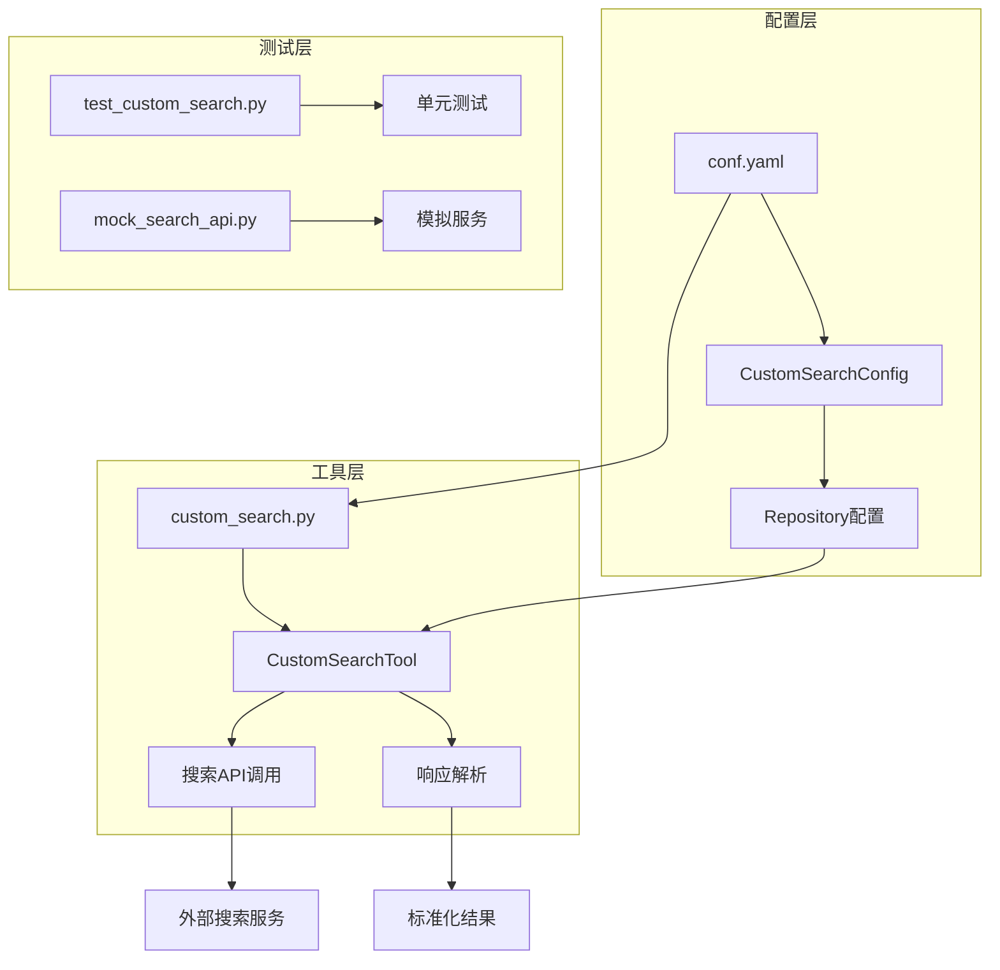
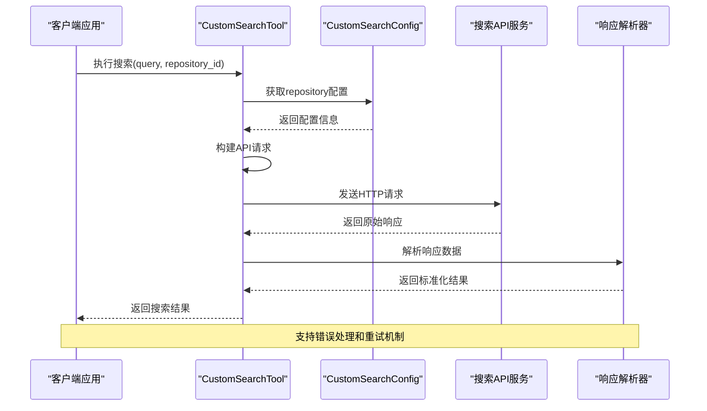
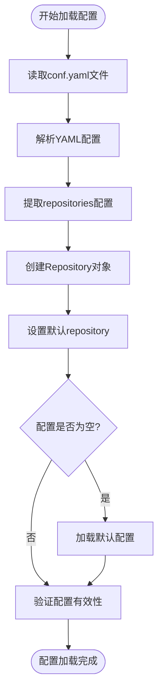
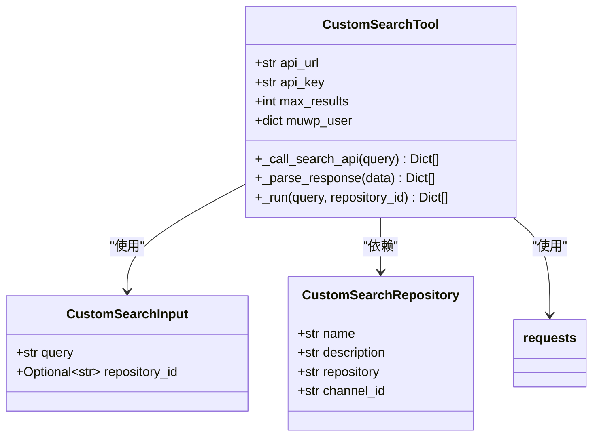
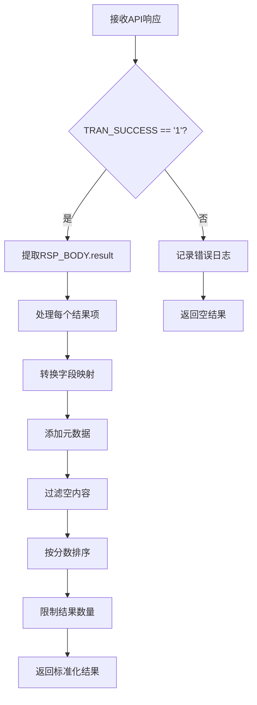

# 自定义搜索服务集成

<cite>
**本文档引用的文件**
- [conf.yaml](file://conf.yaml)
- [src/config/custom_search.py](file://src/config/custom_search.py)
- [src/tools/custom_search.py](file://src/tools/custom_search.py)
- [test_custom_search.py](file://test_custom_search.py)
- [middlewares/search/mock_search_api.py](file://middlewares/search/mock_search_api.py)
</cite>

## 目录
1. [简介](#简介)
2. [项目结构](#项目结构)
3. [核心组件](#核心组件)
4. [架构概览](#架构概览)
5. [详细组件分析](#详细组件分析)
6. [配置管理](#配置管理)
7. [API集成](#api集成)
8. [错误处理与调试](#错误处理与调试)
9. [性能考虑](#性能考虑)
10. [故障排除指南](#故障排除指南)
11. [结论](#结论)

## 简介

自定义搜索服务集成是DeerFlow框架中的一个重要功能模块，它允许用户通过conf.yaml配置文件定义和管理多种搜索服务提供商。该模块的核心是CustomSearch类，它能够根据配置动态构建HTTP请求并处理来自不同搜索提供商的响应数据。

本模块的主要特点包括：
- 支持多种搜索服务提供商（如交通银行内部知识库、聚合搜索、向量库等）
- 灵活的配置管理，可通过YAML文件定义API端点和认证方式
- 统一的响应格式转换，确保不同提供商的数据格式一致性
- 完整的错误处理和调试机制
- 支持异步和同步搜索操作

## 项目结构

自定义搜索服务集成模块在项目中的组织结构如下：



**图表来源**
- [conf.yaml](file://conf.yaml#L1-L69)
- [src/config/custom_search.py](file://src/config/custom_search.py#L1-L120)
- [src/tools/custom_search.py](file://src/tools/custom_search.py#L1-L295)

**章节来源**
- [conf.yaml](file://conf.yaml#L1-L69)
- [src/config/custom_search.py](file://src/config/custom_search.py#L1-L120)
- [src/tools/custom_search.py](file://src/tools/custom_search.py#L1-L295)

## 核心组件

### CustomSearchConfig类

CustomSearchConfig类是配置管理的核心，负责从YAML文件加载和管理搜索服务的配置信息。

```python
@dataclass
class CustomSearchRepository:
    """自定义搜索引擎的Repository配置"""
    name: str
    description: str
    repository: str
    channel_id: str = "0"

class CustomSearchConfig:
    """自定义搜索引擎配置管理器"""
    
    def __init__(self, config_file: str = "conf.yaml"):
        self.config_file = config_file
        self._repositories = {}
        self._default_repository = None
        self._load_config()
```

### CustomSearchTool类

CustomSearchTool类实现了具体的搜索功能，封装了与外部搜索服务的交互逻辑。

```python
class CustomSearchTool(BaseTool):
    """
    自定义搜索引擎工具
    实现"边想边搜"功能的检索接口
    适配交通银行内部搜索API格式
    """
    
    name: str = "web_search"
    description: str = "搜索网络信息。输入应该是搜索查询字符串。"
    args_schema: Type[BaseModel] = CustomSearchInput
    
    # 配置参数
    api_url: str = Field(default="")
    api_key: str = Field(default="")
    max_results: int = Field(default=10)
    timeout: int = Field(default=30)
    repository_id: str = Field(default="dynamic_search")
```

**章节来源**
- [src/config/custom_search.py](file://src/config/custom_search.py#L10-L120)
- [src/tools/custom_search.py](file://src/tools/custom_search.py#L20-L60)

## 架构概览

自定义搜索服务集成采用分层架构设计，确保了模块间的松耦合和高内聚：



**图表来源**
- [src/tools/custom_search.py](file://src/tools/custom_search.py#L150-L200)
- [src/config/custom_search.py](file://src/config/custom_search.py#L40-L80)

## 详细组件分析

### 配置加载机制

CustomSearchConfig类实现了灵活的配置加载机制，支持从YAML文件中读取配置并提供默认值：



**图表来源**
- [src/config/custom_search.py](file://src/config/custom_search.py#L25-L50)

### API请求构建

CustomSearchTool类负责构建符合交通银行内部API格式的请求：



**图表来源**
- [src/tools/custom_search.py](file://src/tools/custom_search.py#L20-L80)
- [src/config/custom_search.py](file://src/config/custom_search.py#L10-L25)

### 响应解析流程

响应解析是确保不同搜索提供商数据格式一致性的关键环节：



**图表来源**
- [src/tools/custom_search.py](file://src/tools/custom_search.py#L120-L180)

**章节来源**
- [src/tools/custom_search.py](file://src/tools/custom_search.py#L120-L200)
- [src/config/custom_search.py](file://src/config/custom_search.py#L25-L80)

## 配置管理

### conf.yaml配置文件结构

conf.yaml文件定义了自定义搜索服务的配置参数：

```yaml
CUSTOM_SEARCH:
  # 可用的repository配置
  repositories:
    aggregation_search:
      name: "聚合搜索"
      description: "聚合多个数据源的搜索服务"
      repository: "aggregation-search"
      channel_id: "0"
    vector_search:
      name: "向量库"
      description: "基于向量相似度的搜索服务"
      repository: "euvd-searchByChannelId"
      channel_id: "0"
    dynamic_search:
      name: "交行知道"
      description: "交通银行内部知识库搜索"
      repository: "okic-dynamicSearch"
      channel_id: "0"
  # 默认使用的repository
  default_repository: "dynamic_search"
```

### 环境变量配置

系统支持通过环境变量覆盖配置参数：

```python
# 从环境变量获取配置
self.api_url = os.getenv("CUSTOM_SEARCH_API_URL", "")
self.api_key = os.getenv("CUSTOM_SEARCH_API_KEY", "")

# 用户信息配置
self.muwp_user = {
    "muwp_branchID": os.getenv("MUWP_BRANCH_ID", "1000027159"),
    "muwp_loginName": os.getenv("MUWP_LOGIN_NAME", "xuew_4"),
    "muwp_userCode": os.getenv("MUWP_USER_CODE", "9743616"),
    "muwp_userName": os.getenv("MUWP_USER_NAME", "薛巍"),
    "muwp_userID": os.getenv("MUWP_USER_ID", "132298")
}
```

**章节来源**
- [conf.yaml](file://conf.yaml#L45-L69)
- [src/tools/custom_search.py](file://src/tools/custom_search.py#L60-L90)

## API集成

### 交通银行内部API格式

CustomSearchTool类专门适配交通银行内部搜索API的格式：

```python
# 构建符合交通银行API格式的请求参数
payload = {
    "REQ_HEAD": {
        "TRANS_PROCESS": "",
        "TRAN_ID": ""
    },
    "REQ_BODY": {
        "param": {
            "messages": [
                {
                    "content": query,
                    "role": "user"
                }
            ],
            "repository": self._repository_config.repository,
            "param": {
                "channelId": self._repository_config.channel_id
            }
        },
        "muwpUser": self.muwp_user
    }
}
```

### 请求头配置

系统自动设置必要的HTTP请求头：

```python
headers = {
    "Content-Type": "application/json",
    "Accept": "*/*",
    "Accept-Encoding": "gzip, deflate, br",
    "Connection": "keep-alive",
    "User-Agent": "DeerFlow-SearchTool/1.0.0",
    "jumpCloud-Env": "BASE"
}

# 如果需要 API 密钥
if self.api_key:
    headers["Authorization"] = f"Bearer {self.api_key}"
```

### 支持的搜索提供商

系统支持多种搜索提供商，每种都有其特定的配置：

1. **聚合搜索** (`aggregation-search`)
   - 功能：聚合多个数据源的搜索服务
   - 适用场景：需要综合多个来源信息的搜索需求

2. **向量库** (`euvd-searchByChannelId`)
   - 功能：基于向量相似度的搜索服务
   - 适用场景：语义搜索和相似内容查找

3. **交行知道** (`okic-dynamicSearch`)
   - 功能：交通银行内部知识库搜索
   - 适用场景：企业内部知识检索

**章节来源**
- [src/tools/custom_search.py](file://src/tools/custom_search.py#L90-L120)
- [conf.yaml](file://conf.yaml#L45-L60)

## 错误处理与调试

### 错误处理机制

CustomSearchTool类实现了完善的错误处理机制：

```python
try:
    response = requests.post(
        self.api_url,
        headers=headers,
        json=payload,
        timeout=self.timeout
    )
    response.raise_for_status()
    
    # 解析响应
    data = response.json()
    results = self._parse_response(data)
    return results
    
except requests.exceptions.RequestException as e:
    logger.error(f"Custom search API request failed: {e}")
    return []
except json.JSONDecodeError as e:
    logger.error(f"Failed to parse custom search API response: {e}")
    return []
except Exception as e:
    logger.error(f"Unexpected error in search API call: {e}")
    return []
```

### 日志记录

系统提供详细的日志记录功能：

```python
def log_search_summary(query, result_count, results_data=None):
    """记录检索摘要日志"""
    print(f"\033[32m[检索摘要] 主题词: '{query}'\033[0m \033[35m| 返回结果数: {result_count} 条\033[0m")
    if result_count > 0:
        print(f"\033[32m[检索详情] 检索成功\033[0m \033[35m| 数据源: {repository} | 渠道ID: {channel_id}\033[0m")
        
        # 显示前3条结果的标题和评分
        if results_data and len(results_data) > 0:
            print(f"\033[32m[结果预览] 前{min(3, len(results_data))}条结果:\033[0m")
            for i, result in enumerate(results_data[:3]):
                title = result.get('title', '无标题')[:50]  # 截取50个字符
                score = result.get('score', '0')
                doc_id = result.get('docId', 'N/A')
                print(f"\033[35m  {i+1}. [{doc_id}] {title} (评分: {score})\033[0m")
    else:
        print(f"\033[32m[检索详情] 无匹配结果\033[0m \033[35m| 数据源: {repository} | 渠道ID: {channel_id}\033[0m")
```

### 调试工具

提供了完整的测试套件来验证功能：

```python
def test_custom_search():
    """测试自定义搜索工具"""
    os.environ["CUSTOM_SEARCH_API_URL"] = "http://localhost:8010/ELLM.ELLM-OFFICE.V-1.0/querySources.do"
    
    try:
        search_tool = get_custom_search_tool(max_results=5)
        test_queries = ["规章制度"]
        
        for query in test_queries:
            results = search_tool._run(query)
            if results:
                print(f"✅ 找到 {len(results)} 个结果:")
                for i, result in enumerate(results, 1):
                    print(f"\n{i}. {result.get('title', '无标题')}")
                    print(f"   来源: {result.get('source', '未知')}")
                    print(f"   评分: {result.get('score', 0)}")
            else:
                print("❌ 未找到结果")
                
    except Exception as e:
        print(f"❌ 测试失败: {e}")
        return False
```

**章节来源**
- [src/tools/custom_search.py](file://src/tools/custom_search.py#L100-L150)
- [test_custom_search.py](file://test_custom_search.py#L30-L80)

## 性能考虑

### 结果数量限制

系统默认限制返回的结果数量，以提高性能和用户体验：

```python
# 限制结果数量
return results[:self.max_results]
```

### 超时设置

合理的超时设置确保系统不会因等待响应而长时间阻塞：

```python
timeout: int = Field(default=30)  # 30秒超时
```

### 缓存策略

虽然当前实现没有内置缓存，但可以通过扩展实现缓存机制来提高性能。

### 并发处理

系统支持异步操作，可以在需要时实现并发搜索：

```python
async def _arun(
    self,
    query: str,
    repository_id: Optional[str] = None,
    run_manager: Optional[AsyncCallbackManagerForToolRun] = None,
) -> List[Dict[str, Any]]:
    """异步执行搜索（可选实现）"""
    # 对于简单的 HTTP 请求，可以直接调用同步方法
    return self._run(query, repository_id, None)
```

## 故障排除指南

### 常见问题及解决方案

1. **API URL配置错误**
   ```bash
   # 检查环境变量
   echo $CUSTOM_SEARCH_API_URL
   
   # 验证URL可达性
   curl -I $CUSTOM_SEARCH_API_URL
   ```

2. **认证失败**
   ```bash
   # 检查API密钥
   echo $CUSTOM_SEARCH_API_KEY
   
   # 测试认证
   curl -H "Authorization: Bearer $CUSTOM_SEARCH_API_KEY" \
        -H "Content-Type: application/json" \
        $CUSTOM_SEARCH_API_URL
   ```

3. **网络连接问题**
   ```bash
   # 检查防火墙设置
   telnet <api_host> <port>
   
   # 测试DNS解析
   nslookup <api_host>
   ```

### 调试技巧

1. **启用详细日志**
   ```python
   import logging
   logging.basicConfig(level=logging.DEBUG)
   ```

2. **使用mock服务测试**
   ```bash
   # 启动mock搜索服务
   cd middlewares/search
   python mock_search_api.py
   
   # 运行测试
   python test_custom_search.py
   ```

3. **检查配置文件语法**
   ```bash
   # 验证YAML语法
   python -c "import yaml; yaml.safe_load(open('conf.yaml'))"
   ```

**章节来源**
- [test_custom_search.py](file://test_custom_search.py#L200-L250)
- [middlewares/search/mock_search_api.py](file://middlewares/search/mock_search_api.py#L270-L278)

## 结论

自定义搜索服务集成模块为DeerFlow框架提供了强大而灵活的搜索能力。通过统一的配置管理和标准化的API接口，它能够轻松集成多种搜索服务提供商，包括交通银行内部知识库、聚合搜索和向量库等。

### 主要优势

1. **灵活性**：支持多种搜索提供商，配置简单
2. **标准化**：统一的响应格式，便于后续处理
3. **健壮性**：完善的错误处理和日志记录
4. **可扩展性**：模块化设计，易于添加新的搜索提供商

### 最佳实践

1. **配置管理**：合理使用环境变量和配置文件
2. **错误处理**：始终包含适当的错误处理逻辑
3. **性能优化**：合理设置结果数量和超时时间
4. **监控调试**：启用详细日志记录以便问题排查

### 未来发展方向

1. **缓存机制**：实现结果缓存以提高性能
2. **负载均衡**：支持多个API端点的负载均衡
3. **智能路由**：根据查询内容智能选择最佳搜索提供商
4. **指标监控**：添加性能指标和监控功能

通过遵循本文档的指导原则和最佳实践，开发者可以有效地集成和使用自定义搜索服务，为用户提供高质量的搜索体验。