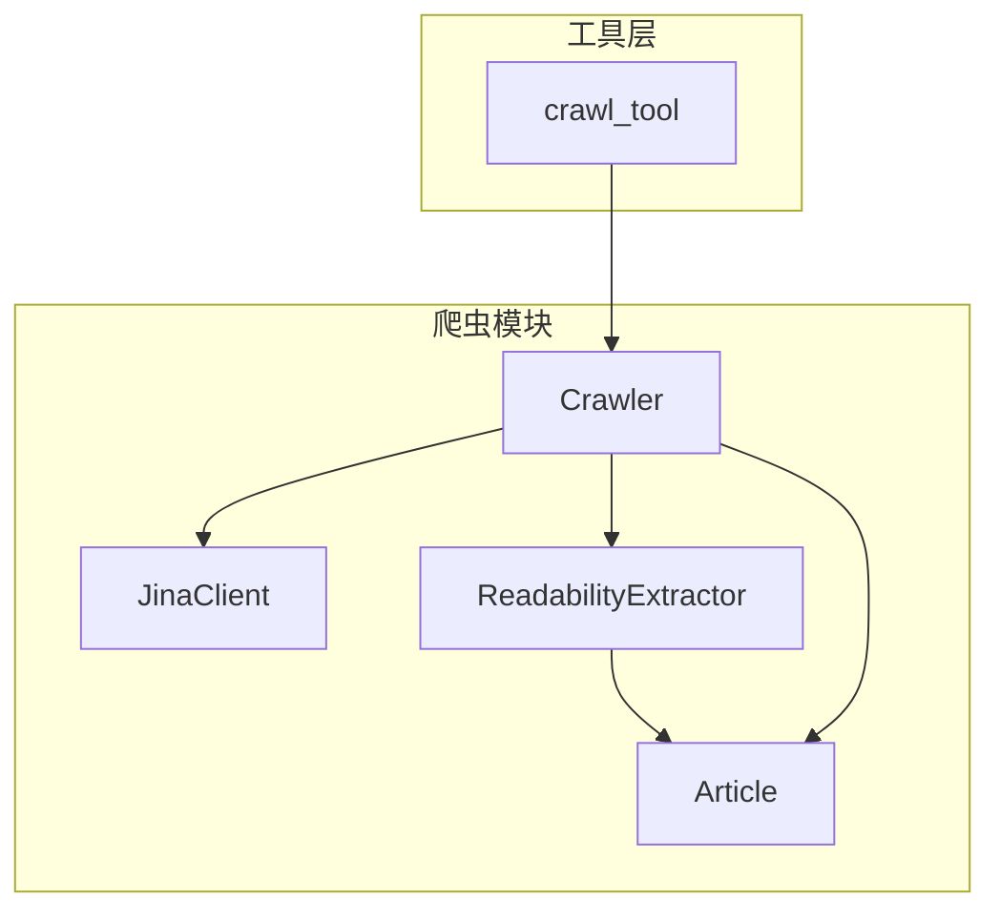
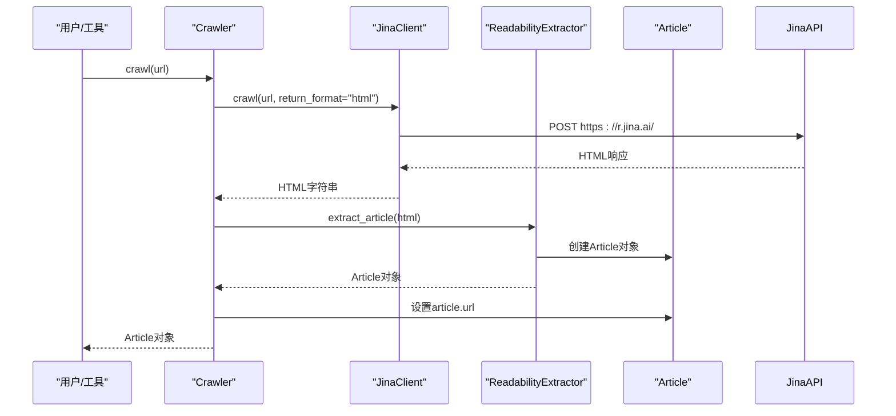
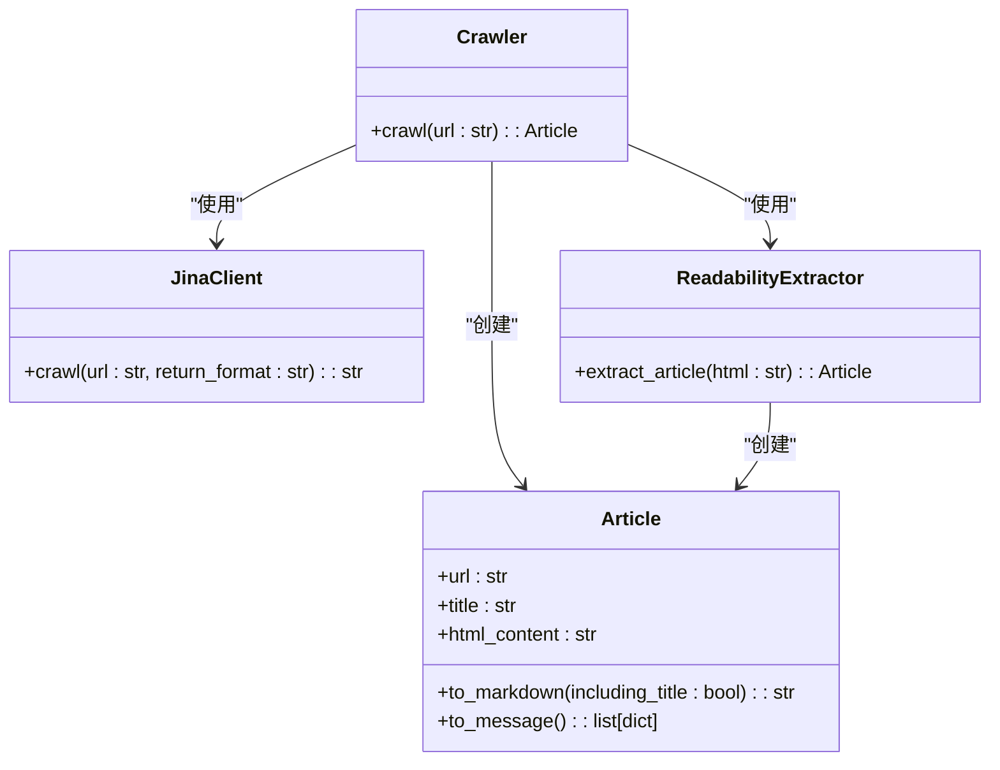
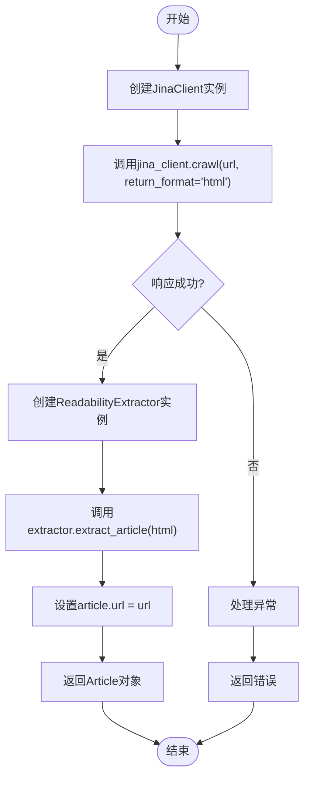

# Jina Client集成

<cite>
**本文档引用的文件**   
- [jina_client.py](file://src/crawler/jina_client.py)
- [crawler.py](file://src/crawler/crawler.py)
- [readability_extractor.py](file://src/crawler/readability_extractor.py)
- [article.py](file://src/crawler/article.py)
- [crawl.py](file://src/tools/crawl.py)
- [conf.yaml](file://conf.yaml)
- [configuration.py](file://src/config/configuration.py)
</cite>

## 目录
1. [简介](#简介)
2. [项目结构](#项目结构)
3. [核心组件](#核心组件)
4. [架构概述](#架构概述)
5. [详细组件分析](#详细组件分析)
6. [依赖分析](#依赖分析)
7. [性能考虑](#性能考虑)
8. [故障排除指南](#故障排除指南)
9. [结论](#结论)

## 简介
本文档详细介绍了Jina Client在项目中的集成实现，重点分析了JinaClientWrapper类（在代码中为JinaClient类）的实现细节。文档涵盖了API认证机制、请求构造、响应处理和错误码映射。详细描述了如何处理速率限制、超时和网络异常，以及如何解析Jina API返回的结构化数据。提供了实际代码示例展示如何在爬虫工作流中调用Jina Client，包括配置参数、最佳实践和性能优化建议。同时讨论了与Jina服务的依赖关系和版本兼容性要求。

## 项目结构
项目中的Jina Client集成主要位于`src/crawler`目录下，与其他爬虫相关组件紧密协作。该模块负责从网页抓取内容，并将其转换为适合LLM处理的格式。



**图表来源**
- [jina_client.py](file://src/crawler/jina_client.py#L1-L27)
- [crawler.py](file://src/crawler/crawler.py#L1-L28)
- [readability_extractor.py](file://src/crawler/readability_extractor.py#L1-L16)
- [article.py](file://src/crawler/article.py#L1-L38)

**本节来源**
- [src/crawler](file://src/crawler)

## 核心组件
Jina Client集成的核心组件包括`JinaClient`类，它直接与Jina API进行交互，以及`Crawler`类，它作为更高层次的抽象，协调JinaClient和内容提取器的工作流程。

**本节来源**
- [jina_client.py](file://src/crawler/jina_client.py#L1-L27)
- [crawler.py](file://src/crawler/crawler.py#L1-L28)

## 架构概述
Jina Client的集成遵循一个清晰的分层架构。`Crawler`类作为入口点，接收URL并协调整个抓取过程。它首先使用`JinaClient`从目标URL获取原始HTML内容。然后，`ReadabilityExtractor`使用readabilipy库从HTML中提取干净的文章内容。最后，`Article`类将提取的内容封装成一个结构化的对象，可以轻松转换为Markdown或消息格式。



**图表来源**
- [jina_client.py](file://src/crawler/jina_client.py#L1-L27)
- [crawler.py](file://src/crawler/crawler.py#L1-L28)
- [readability_extractor.py](file://src/crawler/readability_extractor.py#L1-L16)
- [article.py](file://src/crawler/article.py#L1-L38)

## 详细组件分析

### JinaClient类分析
`JinaClient`类是与Jina Reader API交互的核心。它提供了一个简单的`crawl`方法，该方法构造一个HTTP POST请求，将目标URL发送到Jina的服务端点。

#### API认证机制
`JinaClient`通过检查环境变量`JINA_API_KEY`来实现API认证。如果该变量存在，它会将API密钥作为Bearer令牌包含在请求头的`Authorization`字段中。如果未设置API密钥，客户端会记录一个警告，提示用户设置密钥以获得更高的速率限制。

#### 请求构造
`crawl`方法构造的请求具有以下特征：
- **URL**: `https://r.jina.ai/`
- **方法**: POST
- **请求头**: 
  - `Content-Type: application/json`
  - `X-Return-Format`: 由`return_format`参数指定，默认为`html`
  - `Authorization`: 如果设置了`JINA_API_KEY`，则为`Bearer <API_KEY>`
- **请求体**: 一个包含`url`字段的JSON对象。

#### 响应处理和错误码映射
`JinaClient`直接返回`requests.post`调用的响应文本。它目前没有实现详细的错误码映射或异常处理。这意味着任何HTTP错误（如404、500）或网络异常都会导致`requests`库抛出异常，该异常会向上传播到调用者。`Crawler`类或更高层的工具需要处理这些异常。

#### 速率限制、超时和网络异常处理
当前的`JinaClient`实现没有内置的超时设置或重试逻辑。`requests`库的默认行为将被使用，这可能包括无限期等待。速率限制由Jina服务端强制执行，如果超过限制，将返回相应的HTTP状态码（如429）。客户端通过记录警告来提示用户使用API密钥以获得更高的速率限制，但没有实现具体的速率限制处理策略（如指数退避）。



**图表来源**
- [jina_client.py](file://src/crawler/jina_client.py#L1-L27)
- [crawler.py](file://src/crawler/crawler.py#L1-L28)
- [readability_extractor.py](file://src/crawler/readability_extractor.py#L1-L16)
- [article.py](file://src/crawler/article.py#L1-L38)

**本节来源**
- [jina_client.py](file://src/crawler/jina_client.py#L1-L27)
- [crawler.py](file://src/crawler/crawler.py#L1-L28)

### Crawler工作流分析
`Crawler`类封装了使用Jina Client进行网页抓取的完整工作流。它不仅调用`JinaClient`，还负责后续的内容提取和格式化。

#### 在爬虫工作流中调用Jina Client
`Crawler.crawl`方法是调用Jina Client的标准方式。它创建一个`JinaClient`实例，调用其`crawl`方法获取HTML，然后将HTML传递给`ReadabilityExtractor`。

#### 配置参数
虽然`JinaClient`本身没有复杂的配置对象，但其行为受环境变量`JINA_API_KEY`控制。`Crawler`类则通过`conf.yaml`文件中的`SEARCH_ENGINE`等配置与其他系统组件集成。

#### 最佳实践和性能优化建议
- **使用API密钥**: 始终设置`JINA_API_KEY`环境变量以避免速率限制警告并获得更好的服务。
- **错误处理**: 在调用`Crawler.crawl`时，应使用try-catch块来捕获可能的网络或HTTP异常。
- **缓存**: 对于频繁访问的相同URL，应实现缓存机制以避免重复请求和提高性能。
- **并发**: 如果需要抓取多个页面，可以考虑使用异步HTTP客户端（如aiohttp）来提高吞吐量。



**图表来源**
- [crawler.py](file://src/crawler/crawler.py#L1-L28)
- [jina_client.py](file://src/crawler/jina_client.py#L1-L27)

**本节来源**
- [crawler.py](file://src/crawler/crawler.py#L1-L28)
- [crawl.py](file://src/tools/crawl.py#L1-L30)

### 数据解析分析
Jina API返回的HTML内容由`ReadabilityExtractor`和`Article`类进行解析和结构化。

#### 解析Jina API返回的结构化数据
`ReadabilityExtractor`使用`readabilipy.simple_json_from_html_string`函数从HTML中提取文章标题和主要内容。这个函数返回一个字典，其中包含`title`和`content`等键。`Article`类接收这些数据并将其存储为实例属性。

#### 结构化数据转换
`Article`类提供了`to_markdown()`方法，该方法将HTML内容转换为Markdown格式，便于LLM阅读。它还提供了`to_message()`方法，该方法将文章内容（包括内联图像）分割成一个字典列表，每个字典代表一个文本块或一个图像块，这种格式可以直接用于构建LLM的消息。

**本节来源**
- [readability_extractor.py](file://src/crawler/readability_extractor.py#L1-L16)
- [article.py](file://src/crawler/article.py#L1-L38)

## 依赖分析
Jina Client集成依赖于几个关键的外部库和内部模块。

```mermaid
graph TD
JinaClient --> requests : "requests"
ReadabilityExtractor --> readabilipy : "readabilipy"
Article --> markdownify : "markdownify"
Crawler --> JinaClient
Crawler --> ReadabilityExtractor
Crawler --> Article
CrawlTool --> Crawler
```

**图表来源**
- [jina_client.py](file://src/crawler/jina_client.py#L1-L27)
- [readability_extractor.py](file://src/crawler/readability_extractor.py#L1-L16)
- [article.py](file://src/crawler/article.py#L1-L38)
- [crawler.py](file://src/crawler/crawler.py#L1-L28)
- [crawl.py](file://src/tools/crawl.py#L1-L30)

**本节来源**
- [jina_client.py](file://src/crawler/jina_client.py#L1-L27)
- [readability_extractor.py](file://src/crawler/readability_extractor.py#L1-L16)
- [article.py](file://src/crawler/article.py#L1-L38)

## 性能考虑
- **网络延迟**: Jina API的响应