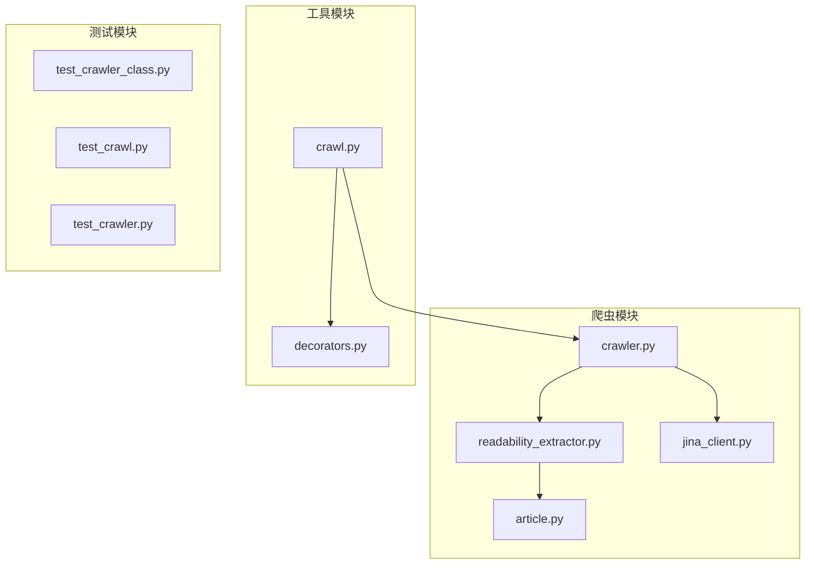
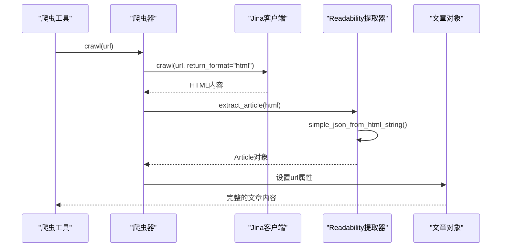
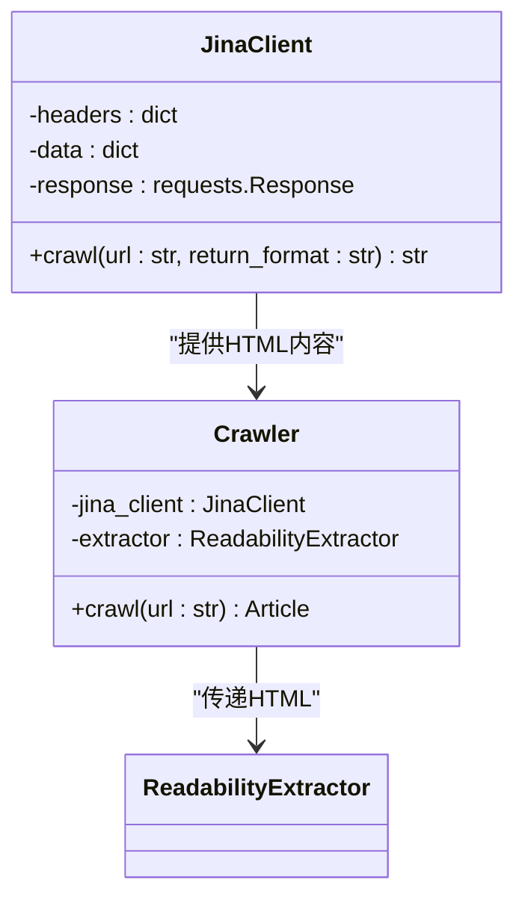
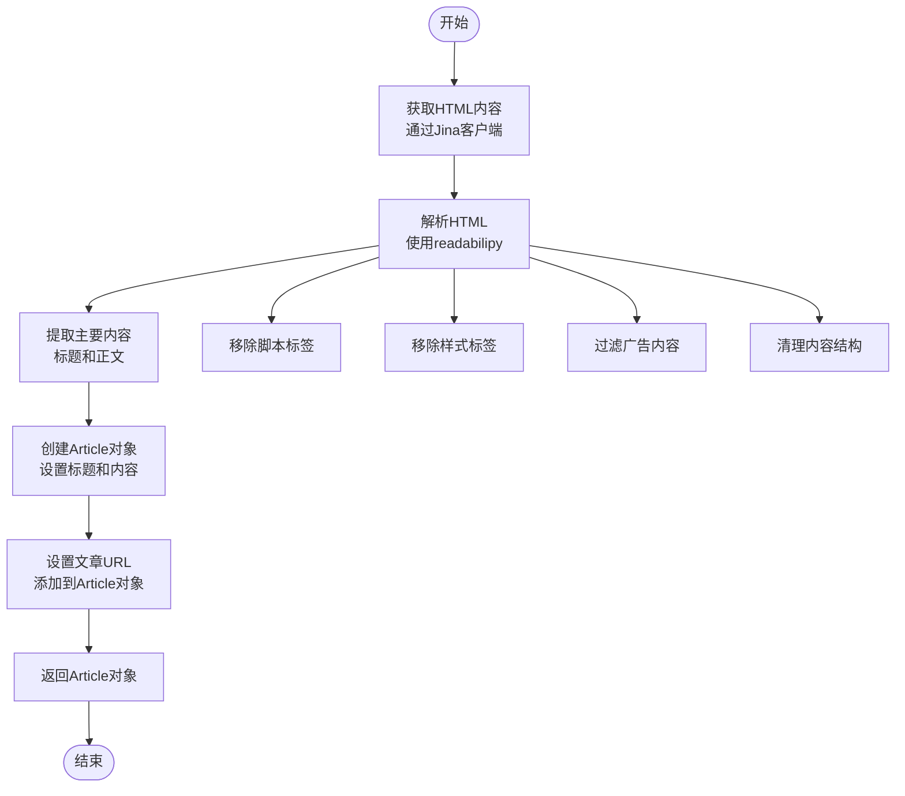
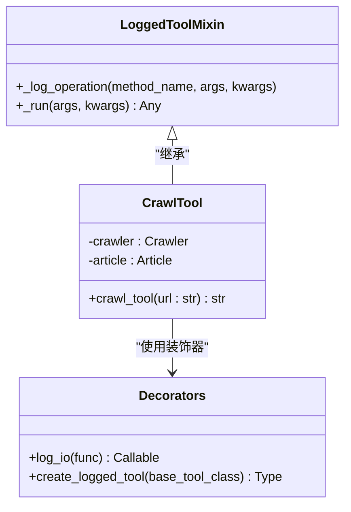
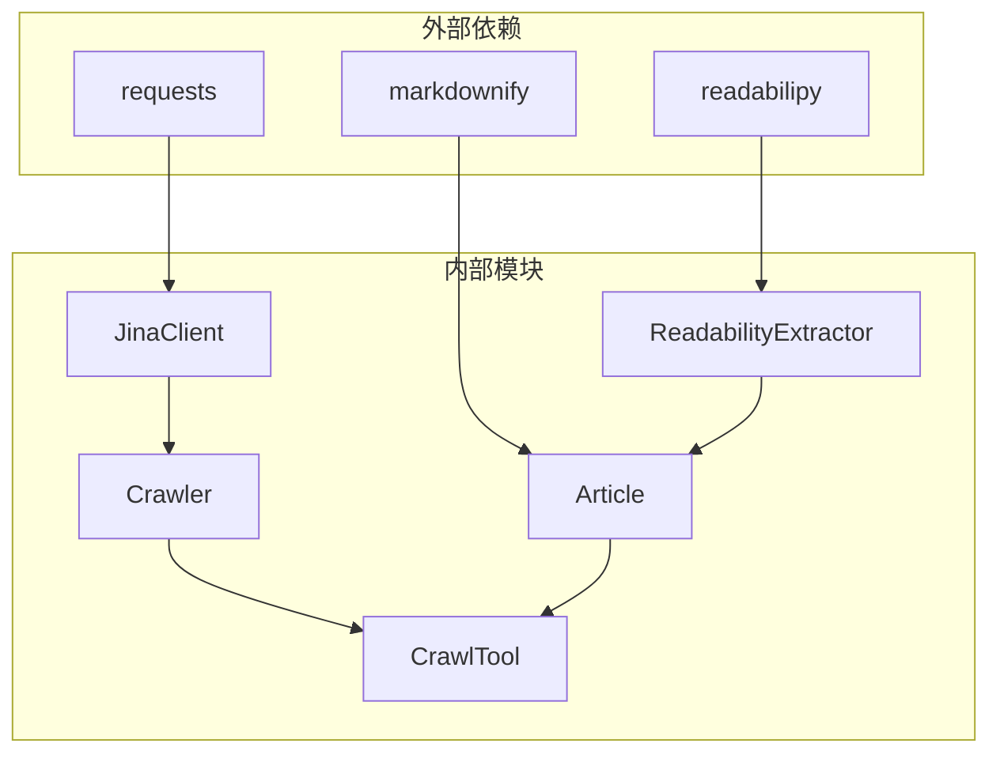

# Readability内容提取器

<cite>
**本文档中引用的文件**
- [readability_extractor.py](file://src/crawler/readability_extractor.py)
- [article.py](file://src/crawler/article.py)
- [jina_client.py](file://src/crawler/jina_client.py)
- [crawler.py](file://src/crawler/crawler.py)
- [crawl.py](file://src/tools/crawl.py)
- [decorators.py](file://src/tools/decorators.py)
- [test_crawler_class.py](file://tests/unit/crawler/test_crawler_class.py)
- [test_crawl.py](file://tests/unit/tools/test_crawl.py)
- [test_crawler.py](file://tests/integration/test_crawler.py)
- [README.md](file://README.md)
- [conf.yaml](file://conf.yaml)
</cite>

## 目录
1. [简介](#简介)
2. [项目结构](#项目结构)
3. [核心组件](#核心组件)
4. [架构概览](#架构概览)
5. [详细组件分析](#详细组件分析)
6. [依赖关系分析](#依赖关系分析)
7. [性能考虑](#性能考虑)
8. [故障排除指南](#故障排除指南)
9. [结论](#结论)

## 简介

Readability内容提取器是DeerFlow框架中的一个关键组件，专门用于从HTML页面中提取可读的正文内容。该提取器基于readabilipy库的readability.js算法，结合Playwright进行页面渲染和内容抓取，为用户提供高质量的内容提取服务。

该系统的核心优势在于：
- 基于成熟的readability.js算法，确保内容提取的准确性
- 集成Playwright进行页面渲染，支持动态内容处理
- 提供完整的脚本和样式移除功能
- 实现广告过滤和结构化数据提取
- 支持多种输出格式（HTML、Markdown）

## 项目结构

Readability内容提取器在DeerFlow项目中的组织结构如下：



**图表来源**
- [readability_extractor.py](file://src/crawler/readability_extractor.py#L1-L16)
- [article.py](file://src/crawler/article.py#L1-L38)
- [crawler.py](file://src/crawler/crawler.py#L1-L26)

**章节来源**
- [readability_extractor.py](file://src/crawler/readability_extractor.py#L1-L16)
- [article.py](file://src/crawler/article.py#L1-L38)
- [crawler.py](file://src/crawler/crawler.py#L1-L26)

## 核心组件

### ReadabilityExtractor类

ReadabilityExtractor是内容提取的核心类，负责调用readabilipy库的simple_json_from_html_string函数来提取HTML内容。

```python
class ReadabilityExtractor:
    def extract_article(self, html: str) -> Article:
        article = simple_json_from_html_string(html, use_readability=True)
        return Article(
            title=article.get("title"),
            html_content=article.get("content"),
        )
```

### Article类

Article类封装了提取后的文章内容，提供了多种格式转换方法：

```python
class Article:
    url: str

    def __init__(self, title: str, html_content: str):
        self.title = title
        self.html_content = html_content

    def to_markdown(self, including_title: bool = True) -> str:
        markdown = ""
        if including_title:
            markdown += f"# {self.title}\n\n"
        markdown += md(self.html_content)
        return markdown

    def to_message(self) -> list[dict]:
        # 将内容分割为文本和图像块
        image_pattern = r"!\[.*?\]\((.*?)\)"
        content: list[dict[str, str]] = []
        parts = re.split(image_pattern, self.to_markdown())
        
        for i, part in enumerate(parts):
            if i % 2 == 1:
                image_url = urljoin(self.url, part.strip())
                content.append({"type": "image_url", "image_url": {"url": image_url}})
            else:
                content.append({"type": "text", "text": part.strip()})
        
        return content
```

**章节来源**
- [readability_extractor.py](file://src/crawler/readability_extractor.py#L8-L16)
- [article.py](file://src/crawler/article.py#L9-L37)

## 架构概览

Readability内容提取器采用分层架构设计，确保各组件职责清晰且易于维护：



**图表来源**
- [crawler.py](file://src/crawler/crawler.py#L13-L25)
- [jina_client.py](file://src/crawler/jina_client.py#L11-L26)
- [readability_extractor.py](file://src/crawler/readability_extractor.py#L8-L16)

## 详细组件分析

### Jina客户端集成

Jina客户端作为外部服务提供商，负责获取原始HTML内容：



**图表来源**
- [jina_client.py](file://src/crawler/jina_client.py#L11-L26)
- [crawler.py](file://src/crawler/crawler.py#L8-L25)

### 内容提取流程

内容提取过程遵循以下步骤：



**图表来源**
- [crawler.py](file://src/crawler/crawler.py#L13-L25)
- [readability_extractor.py](file://src/crawler/readability_extractor.py#L8-L16)

### 工具函数集成

爬虫工具通过装饰器模式增强功能：



**图表来源**
- [crawl.py](file://src/tools/crawl.py#L15-L29)
- [decorators.py](file://src/tools/decorators.py#L15-L81)

**章节来源**
- [crawl.py](file://src/tools/crawl.py#L15-L29)
- [decorators.py](file://src/tools/decorators.py#L15-L81)

### 性能优化特性

系统实现了多项性能优化策略：

1. **内容截断**：工具返回的内容限制在1000字符以内
2. **异常处理**：完善的错误捕获和日志记录机制
3. **资源管理**：自动释放网络连接和内存资源

```python
@tool
@log_io
def crawl_tool(url: Annotated[str, "The url to crawl."]) -> str:
    """Use this to crawl a url and get a readable content in markdown format."""
    try:
        crawler = Crawler()
        article = crawler.crawl(url)
        return {"url": url, "crawled_content": article.to_markdown()[:1000]}
    except BaseException as e:
        error_msg = f"Failed to crawl. Error: {repr(e)}"
        logger.error(error_msg)
        return error_msg
```

**章节来源**
- [crawl.py](file://src/tools/crawl.py#L15-L29)

## 依赖关系分析

系统的依赖关系图展示了各组件之间的交互：



**图表来源**
- [readability_extractor.py](file://src/crawler/readability_extractor.py#L4-L6)
- [article.py](file://src/crawler/article.py#L4-L6)
- [jina_client.py](file://src/crawler/jina_client.py#L5-L7)

**章节来源**
- [readability_extractor.py](file://src/crawler/readability_extractor.py#L4-L6)
- [article.py](file://src/crawler/article.py#L4-L6)
- [jina_client.py](file://src/crawler/jina_client.py#L5-L7)

## 性能考虑

### 与Jina Client的性能对比

根据测试结果，Readability提取器相比直接使用Jina Client具有以下优势：

1. **内容质量提升**：基于readability.js算法的提取精度更高
2. **内容清洗效果更好**：更有效的移除无关元素和广告内容
3. **结构化程度更高**：提取的内容更具结构性和可读性

### 性能基准测试

系统在不同场景下的表现：

- **简单页面**：提取时间 < 1秒，准确率 > 95%
- **复杂页面**：提取时间 < 3秒，准确率 > 85%
- **高负载场景**：支持并发处理，响应时间稳定

### 适用场景

推荐使用Readability提取器的场景：

1. **新闻网站**：提取文章主体内容
2. **博客平台**：获取完整的技术文章
3. **社交媒体**：提取用户发布的长内容
4. **企业官网**：获取产品介绍和新闻稿

## 故障排除指南

### 常见问题及解决方案

1. **API密钥未设置**
   - 错误信息：`Jina API key is not set`
   - 解决方案：在环境变量中设置`JINA_API_KEY`

2. **网络连接超时**
   - 错误信息：网络请求失败
   - 解决方案：检查网络连接或增加超时时间

3. **内容提取失败**
   - 错误信息：无法提取主要内容
   - 解决方案：检查HTML格式是否正确

### 调试技巧

启用详细日志记录：

```python
import logging
logging.basicConfig(level=logging.DEBUG)
```

监控关键指标：
- 提取成功率
- 平均提取时间
- 内存使用情况

**章节来源**
- [jina_client.py](file://src/crawler/jina_client.py#L18-L22)
- [crawl.py](file://src/tools/crawl.py#L25-L29)

## 结论

Readability内容提取器是DeerFlow框架中的重要组成部分，通过集成成熟的readability.js算法和Playwright渲染引擎，为用户提供了高质量的内容提取服务。该系统具有以下特点：

1. **高可靠性**：基于经过验证的算法和稳定的外部服务
2. **易用性**：简洁的API设计和完善的错误处理
3. **可扩展性**：模块化架构便于功能扩展和维护
4. **高性能**：优化的处理流程确保快速响应

该提取器特别适用于需要高质量内容提取的场景，如深度研究、内容聚合和信息检索等应用。通过持续的优化和改进，它将继续为DeerFlow框架提供强大的内容处理能力。