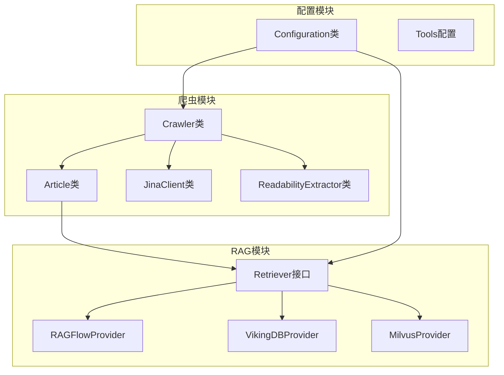
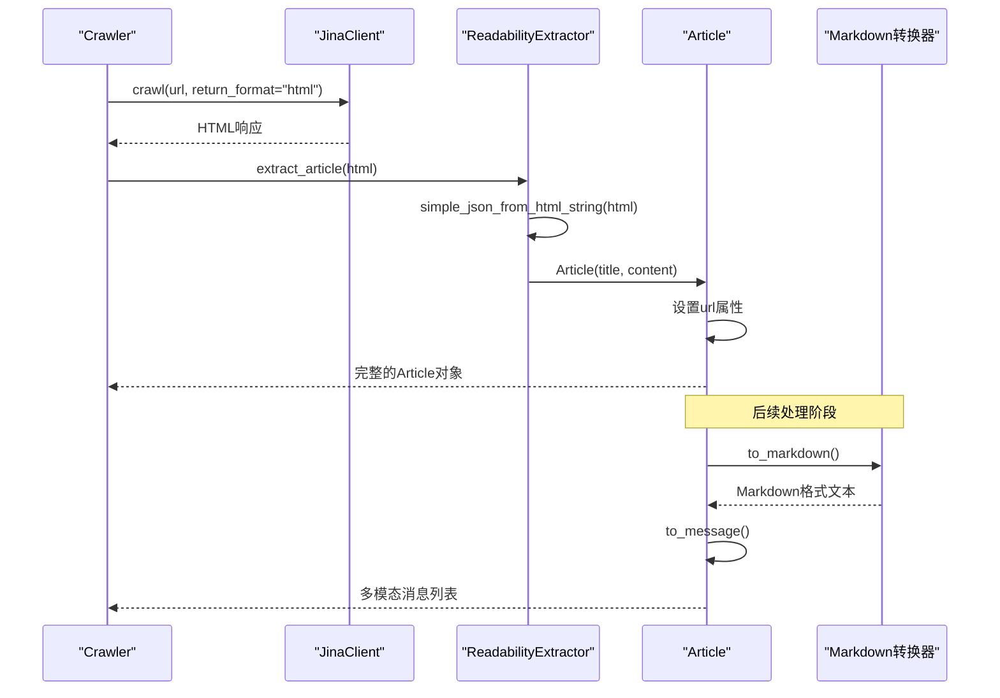
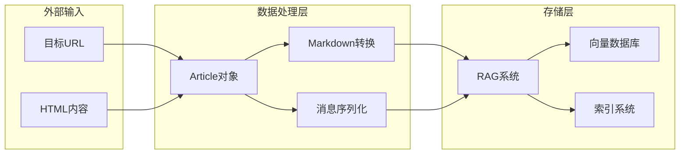
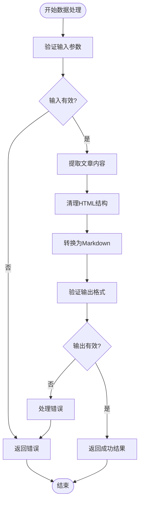
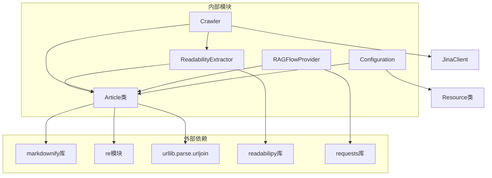

# 文章数据模型

<cite>
**本文档中引用的文件**
- [article.py](file://src/crawler/article.py)
- [readability_extractor.py](file://src/crawler/readability_extractor.py)
- [crawler.py](file://src/crawler/crawler.py)
- [jina_client.py](file://src/crawler/jina_client.py)
- [retriever.py](file://src/rag/retriever.py)
- [ragflow.py](file://src/rag/ragflow.py)
- [configuration.py](file://src/config/configuration.py)
- [test_article.py](file://tests/unit/crawler/test_article.py)
- [openai_sora_report.md](file://examples/openai_sora_report.md)
</cite>

## 目录
1. [简介](#简介)
2. [项目结构](#项目结构)
3. [核心组件](#核心组件)
4. [架构概览](#架构概览)
5. [详细组件分析](#详细组件分析)
6. [依赖关系分析](#依赖关系分析)
7. [性能考虑](#性能考虑)
8. [故障排除指南](#故障排除指南)
9. [结论](#结论)

## 简介

Article类是deer-flow项目中的核心数据模型，专门用于处理从网页抓取的文章内容。该模型负责管理文章的标题、HTML内容、URL地址和发布日期等关键属性，并提供了从HTML到Markdown的转换功能，以及支持多模态消息格式的序列化机制。

Article类的设计遵循了简洁性和实用性的原则，通过组合模式与其他组件协作，实现了从原始HTML内容到结构化数据的完整转换流程。该模型不仅支持基本的文本提取，还能处理复杂的HTML结构，包括图片资源的识别和处理。

## 项目结构

deer-flow项目采用模块化的架构设计，Article类位于爬虫模块的核心位置，与其他系统组件形成了清晰的职责分离：



**图表来源**
- [crawler.py](file://src/crawler/crawler.py#L1-L28)
- [article.py](file://src/crawler/article.py#L1-L38)
- [retriever.py](file://src/rag/retriever.py#L1-L82)

**章节来源**
- [crawler.py](file://src/crawler/crawler.py#L1-L28)
- [article.py](file://src/crawler/article.py#L1-L38)

## 核心组件

### Article类数据结构

Article类是一个简洁而高效的数据模型，专注于处理网页文章的核心属性：

```python
class Article:
    url: str
    
    def __init__(self, title: str, html_content: str):
        self.title = title
        self.html_content = html_content
```

该类包含以下关键属性：
- **title**: 文章标题，用于构建Markdown输出的标题行
- **html_content**: 原始HTML内容，包含文章的主要文本和结构信息
- **url**: 文章的原始URL地址，用于资源定位和图像链接解析

### 数据提取流程

Article类通过一系列精心设计的方法实现了从原始HTML到结构化数据的转换：



**图表来源**
- [crawler.py](file://src/crawler/crawler.py#L12-L20)
- [readability_extractor.py](file://src/crawler/readability_extractor.py#L9-L15)
- [article.py](file://src/crawler/article.py#L12-L18)

**章节来源**
- [article.py](file://src/crawler/article.py#L1-L38)
- [crawler.py](file://src/crawler/crawler.py#L1-L28)

## 架构概览

Article类在整个系统架构中扮演着关键的数据传输角色，连接了前端爬虫层和后端处理层：



**图表来源**
- [article.py](file://src/crawler/article.py#L12-L38)
- [retriever.py](file://src/rag/retriever.py#L40-L82)

## 详细组件分析

### HTML到Markdown转换机制

Article类的核心功能之一是从HTML内容生成结构化的Markdown格式。这一过程通过markdownify库实现，确保了良好的可读性和兼容性：

```python
def to_markdown(self, including_title: bool = True) -> str:
    markdown = ""
    if including_title:
        markdown += f"# {self.title}\n\n"
    markdown += md(self.html_content)
    return markdown
```

转换过程的关键特性：
- **标题处理**: 可选择是否包含标题作为Markdown的一级标题
- **内容保留**: 保持原始HTML的语义结构，包括段落、列表、表格等
- **样式转换**: 将HTML标签转换为相应的Markdown语法

### 多模态消息序列化

为了支持现代LLM系统的输入要求，Article类提供了to_message方法，将内容分解为文本和图像两种类型的消息块：

```python
def to_message(self) -> list[dict]:
    image_pattern = r"!\[.*?\]\((.*?)\)"
    
    content: list[dict[str, str]] = []
    parts = re.split(image_pattern, self.to_markdown())
    
    for i, part in enumerate(parts):
        if i % 2 == 1:
            image_url = urljoin(self.url, part.strip())
            content.append({"type": "image_url", "image_url": {"url": image_url}})
        else:
            content.append({"type": "text", "text": part.strip()})
    
    return content
```

该方法的处理逻辑：
1. **图像识别**: 使用正则表达式识别Markdown格式的图片标记
2. **URL标准化**: 将相对路径转换为绝对URL
3. **消息分组**: 将文本和图像内容分别组织为不同类型的消息块
4. **类型标注**: 为每种消息类型添加适当的标识符

### 数据验证和清洗

虽然Article类本身不包含复杂的数据验证逻辑，但它依赖于上游组件（如ReadabilityExtractor）来确保数据的质量：



**图表来源**
- [readability_extractor.py](file://src/crawler/readability_extractor.py#L9-L15)
- [article.py](file://src/crawler/article.py#L12-L38)

**章节来源**
- [article.py](file://src/crawler/article.py#L12-L38)
- [test_article.py](file://tests/unit/crawler/test_article.py#L1-L74)

### 与其他系统组件的集成

Article类与RAG模块紧密集成，支持多种知识库提供商：

```python
# RAG模块中的集成示例
class Document:
    id: str
    url: str | None = None
    title: str | None = None
    chunks: list[Chunk] = []
    
    def to_dict(self) -> dict:
        d = {
            "id": self.id,
            "content": "\n\n".join([chunk.content for chunk in self.chunks]),
        }
        if self.url:
            d["url"] = self.url
        if self.title:
            d["title"] = self.title
        return d
```

这种集成方式允许：
- **统一的数据格式**: 所有知识库提供商都使用相似的文档结构
- **灵活的检索**: 支持基于查询的文档检索和相关性排序
- **扩展性**: 易于添加新的RAG提供商

**章节来源**
- [retriever.py](file://src/rag/retriever.py#L20-L50)
- [ragflow.py](file://src/rag/ragflow.py#L88-L135)

## 依赖关系分析

Article类的依赖关系体现了清晰的分层架构设计：



**图表来源**
- [article.py](file://src/crawler/article.py#L1-L10)
- [readability_extractor.py](file://src/crawler/readability_extractor.py#L1-L16)
- [crawler.py](file://src/crawler/crawler.py#L1-L10)

**章节来源**
- [article.py](file://src/crawler/article.py#L1-L38)
- [readability_extractor.py](file://src/crawler/readability_extractor.py#L1-L16)
- [crawler.py](file://src/crawler/crawler.py#L1-L28)

## 性能考虑

Article类在设计时充分考虑了性能优化：

### 内存效率
- **惰性加载**: 只在需要时才执行HTML到Markdown的转换
- **字符串操作**: 使用高效的字符串拼接和正则表达式匹配
- **对象复用**: 避免重复创建相同的内容对象

### 处理速度
- **单次转换**: 每个Article实例只进行一次完整的转换流程
- **缓存友好**: 转换后的结果可以被缓存以避免重复计算
- **异步支持**: 支持异步处理大量文章内容

### 扩展性
- **批量处理**: 支持同时处理多个Article实例
- **流式处理**: 可以逐步处理大型HTML文档
- **并发安全**: 线程安全的设计允许多线程环境下的并发访问

## 故障排除指南

### 常见问题及解决方案

#### 1. HTML转换失败
**症状**: to_markdown方法返回空字符串或异常
**原因**: HTML内容格式不正确或包含无效字符
**解决方案**: 
- 在调用前验证HTML内容的有效性
- 使用try-catch块捕获转换异常
- 提供默认的空内容处理逻辑

#### 2. 图像URL解析错误
**症状**: 图像消息中的URL不正确或无法访问
**原因**: 相对路径未正确转换为绝对路径
**解决方案**:
- 确保Article.url属性已正确设置
- 使用urljoin函数进行URL标准化
- 添加URL有效性检查

#### 3. 内存使用过高
**症状**: 处理大型HTML文档时内存消耗过大
**原因**: 单个Article实例包含过多内容
**解决方案**:
- 实现内容分块处理
- 使用生成器模式减少内存占用
- 添加内容大小限制

### 调试技巧

```python
# 启用详细日志记录
import logging
logging.basicConfig(level=logging.DEBUG)

# 验证Article实例状态
def debug_article(article):
    print(f"Title: {article.title}")
    print(f"Content length: {len(article.html_content)}")
    print(f"URL: {article.url}")
    print(f"Markdown output: {article.to_markdown()}")
    print(f"Message output: {article.to_message()}")
```

**章节来源**
- [test_article.py](file://tests/unit/crawler/test_article.py#L15-L74)

## 结论

Article类作为deer-flow项目的核心数据模型，展现了优秀的架构设计和实用性。它不仅提供了简洁而强大的数据处理能力，还通过与其他系统组件的无缝集成，实现了从原始网页内容到结构化知识的完整转换流程。

该模型的成功之处在于：
- **简洁性**: 设计简单明了，易于理解和维护
- **灵活性**: 支持多种输出格式和处理需求
- **可扩展性**: 易于添加新的功能和集成点
- **性能**: 高效的算法和数据结构设计

未来的发展方向可能包括：
- 增强内容质量评估功能
- 支持更多的内容格式和语言
- 优化大规模数据处理性能
- 添加更丰富的元数据提取能力

通过持续的改进和优化，Article类将继续为deer-flow项目提供稳定可靠的数据处理基础，支撑整个系统的高效运行。