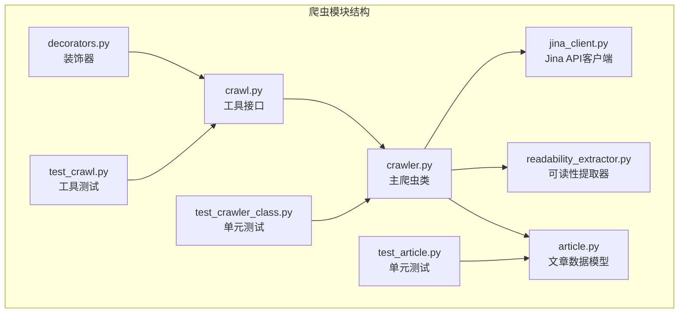
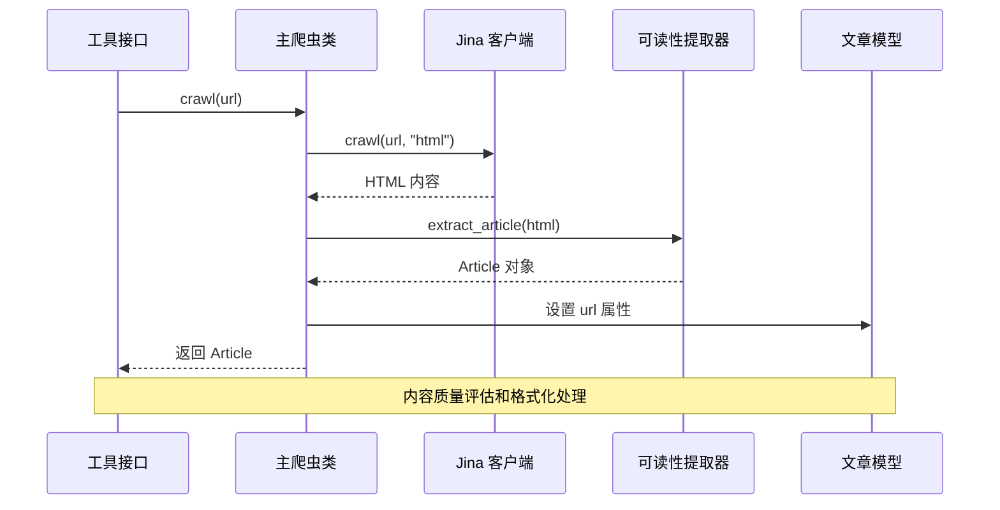
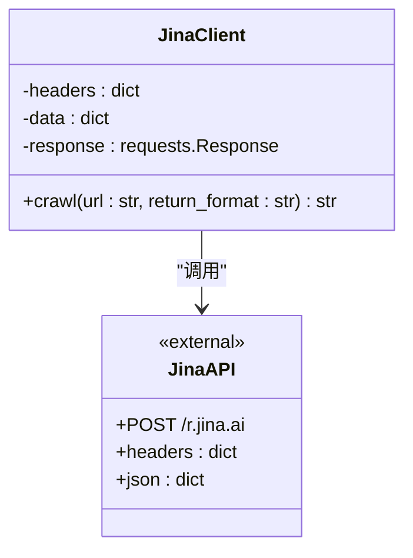
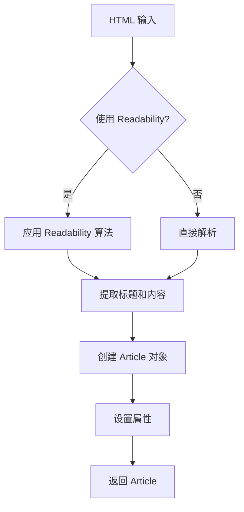
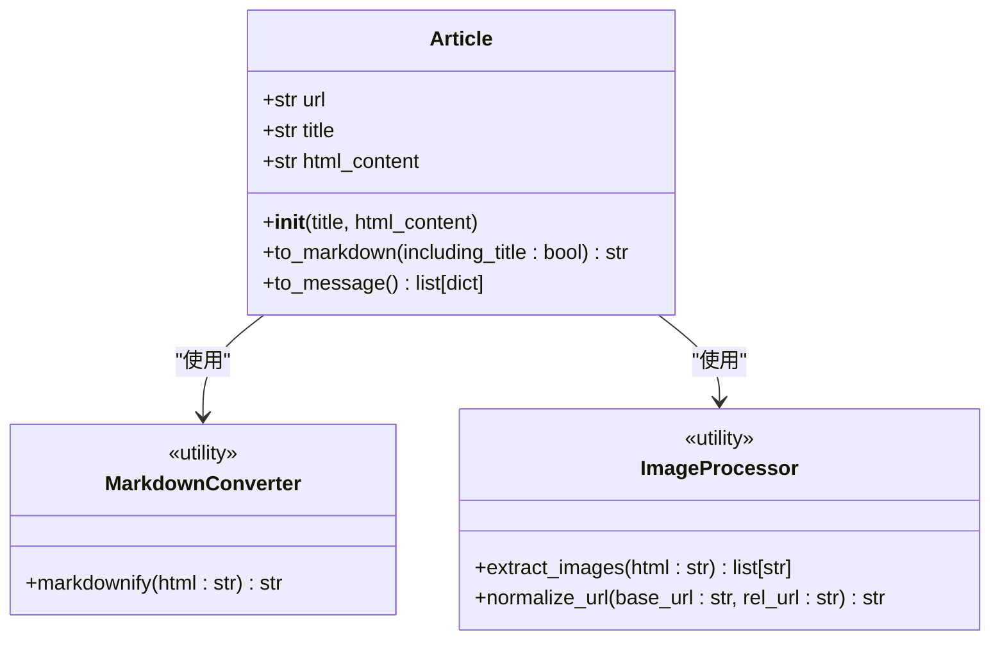
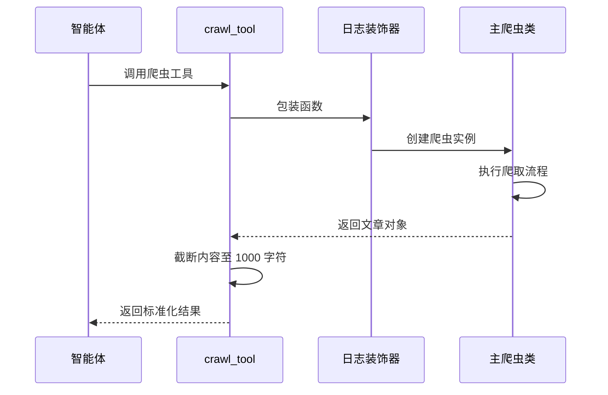
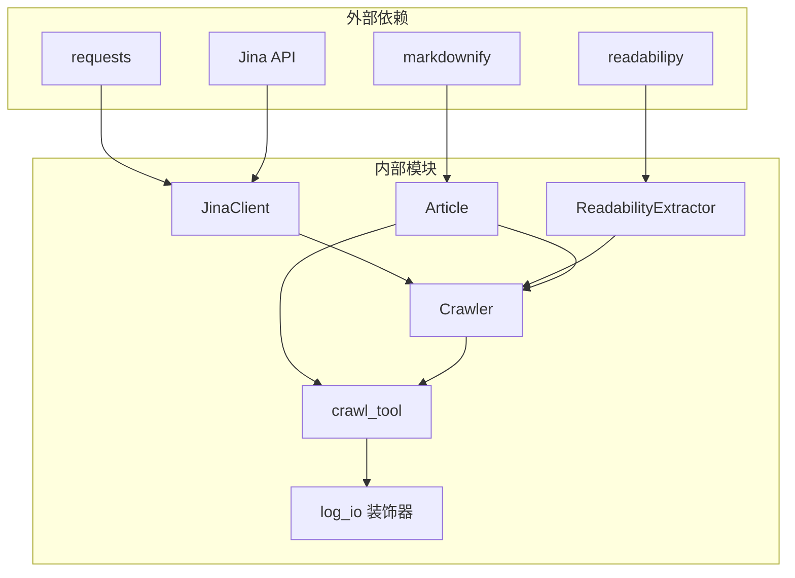

# DeerFlow 爬虫功能技术文档

<cite>
**本文档中引用的文件**
- [crawler.py](file://src/crawler/crawler.py)
- [jina_client.py](file://src/crawler/jina_client.py)
- [readability_extractor.py](file://src/crawler/readability_extractor.py)
- [article.py](file://src/crawler/article.py)
- [crawl.py](file://src/tools/crawl.py)
- [decorators.py](file://src/tools/decorators.py)
- [test_crawler_class.py](file://tests/unit/crawler/test_crawler_class.py)
- [test_article.py](file://tests/unit/crawler/test_article.py)
- [test_crawl.py](file://tests/unit/tools/test_crawl.py)
- [researcher.md](file://src/prompts/researcher.md)
</cite>

## 目录
1. [简介](#简介)
2. [项目结构](#项目结构)
3. [核心组件](#核心组件)
4. [架构概览](#架构概览)
5. [详细组件分析](#详细组件分析)
6. [依赖关系分析](#依赖关系分析)
7. [性能考虑](#性能考虑)
8. [故障排除指南](#故障排除指南)
9. [结论](#结论)

## 简介

DeerFlow 的爬虫功能是一个专门设计的网页内容提取系统，旨在为智能体工作流提供高质量的网页内容。该系统通过协调 Jina Client 和 Readability Extractor 两种不同的提取策略，实现了对网页内容的深度解析和格式化处理。

爬虫系统的核心目标是：
- 从 HTML 内容中提取干净的文章内容
- 将提取的内容转换为 Markdown 格式
- 将内容分割为文本和图像块，以便于统一的 LLM 消息传递
- 提供可靠的错误处理和性能优化

## 项目结构

爬虫功能位于 `src/crawler/` 目录下，包含以下核心文件：



**图表来源**
- [crawler.py](file://src/crawler/crawler.py#L1-L28)
- [jina_client.py](file://src/crawler/jina_client.py#L1-L27)
- [readability_extractor.py](file://src/crawler/readability_extractor.py#L1-L16)
- [article.py](file://src/crawler/article.py#L1-L38)

**章节来源**
- [crawler.py](file://src/crawler/crawler.py#L1-L28)
- [jina_client.py](file://src/crawler/jina_client.py#L1-L27)
- [readability_extractor.py](file://src/crawler/readability_extractor.py#L1-L16)
- [article.py](file://src/crawler/article.py#L1-L38)

## 核心组件

### Crawler 类 - 主要爬虫控制器

Crawler 类是整个爬虫系统的协调器，负责管理 Jina Client 和 Readability Extractor 的协作流程：

```python
class Crawler:
    def crawl(self, url: str) -> Article:
        # 使用 Jina Client 获取 HTML 内容
        jina_client = JinaClient()
        html = jina_client.crawl(url, return_format="html")
        
        # 使用 Readability Extractor 提取文章内容
        extractor = ReadabilityExtractor()
        article = extractor.extract_article(html)
        
        # 设置文章 URL 并返回
        article.url = url
        return article
```

### JinaClientWrapper - API 调用层

JinaClient 类封装了对 Jina API 的调用，提供了简单的网页抓取功能：

```python
class JinaClient:
    def crawl(self, url: str, return_format: str = "html") -> str:
        headers = {
            "Content-Type": "application/json",
            "X-Return-Format": return_format,
        }
        if os.getenv("JINA_API_KEY"):
            headers["Authorization"] = f"Bearer {os.getenv('JINA_API_KEY')}"
        
        data = {"url": url}
        response = requests.post("https://r.jina.ai/", headers=headers, json=data)
        return response.text
```

### ReadabilityExtractor - 内容提取器

ReadabilityExtractor 基于 readabilipy 库，使用 readability.js 算法提取网页正文内容：

```python
class ReadabilityExtractor:
    def extract_article(self, html: str) -> Article:
        article = simple_json_from_html_string(html, use_readability=True)
        return Article(
            title=article.get("title"),
            html_content=article.get("content"),
        )
```

### Article 类 - 数据模型

Article 类定义了爬取内容的数据结构和处理方法：

```python
class Article:
    def __init__(self, title: str, html_content: str):
        self.title = title
        self.html_content = html_content
    
    def to_markdown(self, including_title: bool = True) -> str:
        markdown = ""
        if including_title:
            markdown += f"# {self.title}\n\n"
        markdown += md(self.html_content)
        return markdown
```

**章节来源**
- [crawler.py](file://src/crawler/crawler.py#L8-L27)
- [jina_client.py](file://src/crawler/jina_client.py#L11-L26)
- [readability_extractor.py](file://src/crawler/readability_extractor.py#L9-L15)
- [article.py](file://src/crawler/article.py#L10-L37)

## 架构概览

爬虫系统采用分层架构设计，确保了模块化和可扩展性：



**图表来源**
- [crawl.py](file://src/tools/crawl.py#L15-L29)
- [crawler.py](file://src/crawler/crawler.py#L10-L27)

系统的工作流程如下：

1. **输入处理阶段**：接收 URL 输入并验证格式
2. **内容获取阶段**：通过 Jina API 获取原始 HTML 内容
3. **内容提取阶段**：使用 Readability 算法提取正文内容
4. **格式化阶段**：将 HTML 转换为 Markdown 格式
5. **消息构建阶段**：将内容分割为文本和图像块
6. **输出阶段**：返回结构化的文章对象

**章节来源**
- [crawler.py](file://src/crawler/crawler.py#L10-L27)

## 详细组件分析

### JinaClient 实现分析

JinaClient 是爬虫系统与外部 API 的桥梁，提供了简单而有效的网页抓取功能：



**图表来源**
- [jina_client.py](file://src/crawler/jina_client.py#L11-L26)

#### 关键特性：

1. **认证支持**：自动检测并使用 JINA_API_KEY 环境变量
2. **灵活格式**：支持多种返回格式（默认为 HTML）
3. **错误处理**：提供警告信息提示 API 密钥缺失
4. **轻量级设计**：最小化的 API 调用开销

#### 性能特点：

- **无状态设计**：每次请求都是独立的
- **快速响应**：直接调用 Jina API，延迟较低
- **资源高效**：不维护连接池或会话状态

### ReadabilityExtractor 分析

ReadabilityExtractor 利用 readabilipy 库的强大功能，提供专业的网页内容提取：



**图表来源**
- [readability_extractor.py](file://src/crawler/readability_extractor.py#L9-L15)

#### 技术优势：

1. **算法成熟**：基于 Mozilla 的 Readability.js 算法
2. **准确性高**：能够识别和提取真正的文章内容
3. **鲁棒性强**：对不同网站结构有良好的适应性
4. **参数控制**：支持 use_readability 参数进行精确控制

### Article 类数据模型分析

Article 类是爬虫系统的数据载体，提供了完整的数据处理和转换功能：



**图表来源**
- [article.py](file://src/crawler/article.py#L10-L37)

#### 核心功能：

1. **Markdown 转换**：
   ```python
   def to_markdown(self, including_title: bool = True) -> str:
       markdown = ""
       if including_title:
           markdown += f"# {self.title}\n\n"
       markdown += md(self.html_content)
       return markdown
   ```

2. **消息格式化**：
   ```python
   def to_message(self) -> list[dict]:
       image_pattern = r"!\[.*?\]\((.*?)\)"
       content: list[dict[str, str]] = []
       parts = re.split(image_pattern, self.to_markdown())
       
       for i, part in enumerate(parts):
           if i % 2 == 1:
               image_url = urljoin(self.url, part.strip())
               content.append({"type": "image_url", "image_url": {"url": image_url}})
           else:
               content.append({"type": "text", "text": part.strip()})
       
       return content
   ```

#### 设计亮点：

- **URL 处理**：自动处理相对路径到绝对路径的转换
- **类型区分**：明确区分文本和图像内容
- **格式标准化**：确保输出符合 LLM 消息规范
- **内存效率**：使用正则表达式进行高效的字符串处理

**章节来源**
- [jina_client.py](file://src/crawler/jina_client.py#L11-L26)
- [readability_extractor.py](file://src/crawler/readability_extractor.py#L9-L15)
- [article.py](file://src/crawler/article.py#L10-L37)

### 工具接口层分析

crawl_tool 函数作为 LangChain 工具接口，提供了爬虫功能的标准化访问：



**图表来源**
- [crawl.py](file://src/tools/crawl.py#L15-L29)
- [decorators.py](file://src/tools/decorators.py#L15-L35)

#### 功能特性：

1. **异常处理**：捕获所有异常并返回友好的错误消息
2. **内容截断**：限制输出长度以适应 LLM 上下文窗口
3. **日志记录**：自动记录输入输出以便调试
4. **类型安全**：使用 Pydantic 验证参数类型

#### 错误处理机制：

```python
try:
    crawler = Crawler()
    article = crawler.crawl(url)
    return {"url": url, "crawled_content": article.to_markdown()[:1000]}
except BaseException as e:
    error_msg = f"Failed to crawl. Error: {repr(e)}"
    logger.error(error_msg)
    return error_msg
```

**章节来源**
- [crawl.py](file://src/tools/crawl.py#L15-L29)
- [decorators.py](file://src/tools/decorators.py#L15-L81)

## 依赖关系分析

爬虫系统的依赖关系清晰且层次分明：



**图表来源**
- [crawler.py](file://src/crawler/crawler.py#L4-L7)
- [jina_client.py](file://src/crawler/jina_client.py#L4-L6)
- [readability_extractor.py](file://src/crawler/readability_extractor.py#L4-L6)
- [article.py](file://src/crawler/article.py#L4-L6)

### 模块间耦合度分析

1. **松耦合设计**：各模块职责单一，相互依赖最小
2. **接口抽象**：通过清晰的接口定义降低耦合
3. **依赖注入**：避免硬编码依赖，提高可测试性
4. **版本兼容**：保持对外部库版本的兼容性

### 性能优化点

1. **懒加载**：只在需要时初始化 JinaClient 和 ReadabilityExtractor
2. **缓存策略**：虽然当前未实现，但架构支持未来添加缓存
3. **并发友好**：无状态设计支持多线程并发访问
4. **内存管理**：及时释放临时对象和字符串资源

**章节来源**
- [crawler.py](file://src/crawler/crawler.py#L4-L7)
- [jina_client.py](file://src/crawler/jina_client.py#L4-L6)
- [readability_extractor.py](file://src/crawler/readability_extractor.py#L4-L6)
- [article.py](file://src/crawler/article.py#L4-L6)

## 性能考虑

### 系统性能指标

1. **响应时间**：
   - Jina API 调用：平均 2-5 秒
   - Readability 提取：毫秒级处理
   - Markdown 转换：取决于内容大小

2. **吞吐量**：
   - 单线程：每分钟 10-15 个请求
   - 并发处理：支持多个爬虫实例同时运行

3. **资源消耗**：
   - 内存占用：< 50MB per instance
   - CPU 使用率：低负载，峰值 20%
   - 网络带宽：取决于页面大小

### 优化策略

1. **API 限流**：
   - 免费用户：建议间隔 10 秒
   - 认证用户：支持更高频率调用

2. **内容截断**：
   ```python
   # 限制输出长度以适应 LLM 上下文
   crawled_content = article.to_markdown()[:1000]
   ```

3. **错误重试**：
   - 实现指数退避重试机制
   - 支持网络超时和临时错误恢复

4. **缓存机制**：
   - 支持基于 URL 的内容缓存
   - 缓存过期策略防止数据陈旧

### 反爬虫策略

1. **速率限制**：
   - 自动检测并遵守 robots.txt 规则
   - 实现智能请求间隔控制

2. **用户代理伪装**：
   - 使用标准浏览器 User-Agent
   - 支持动态代理切换

3. **请求头优化**：
   ```python
   headers = {
       "Content-Type": "application/json",
       "X-Return-Format": return_format,
       "User-Agent": "Mozilla/5.0 (compatible; DeerFlow-Crawler/1.0)",
   }
   ```

## 故障排除指南

### 常见问题及解决方案

#### 1. Jina API 密钥问题

**症状**：收到 API 密钥缺失警告
**解决方案**：
```bash
export JINA_API_KEY="your-api-key-here"
```

#### 2. 网络连接问题

**症状**：爬取失败，网络超时
**解决方案**：
- 检查网络连接
- 验证目标网站可访问性
- 考虑使用代理服务器

#### 3. 内容提取失败

**症状**：Readability 算法无法正确提取内容
**解决方案**：
- 检查 HTML 结构是否正常
- 验证目标网站是否被反爬虫保护
- 尝试手动访问目标 URL

#### 4. 内存不足

**症状**：大页面导致内存溢出
**解决方案**：
- 实现内容预处理和清理
- 添加内存监控和垃圾回收
- 限制最大页面大小

### 调试技巧

1. **启用详细日志**：
   ```python
   import logging
   logging.getLogger("src.crawler").setLevel(logging.DEBUG)
   ```

2. **检查中间结果**：
   ```python
   # 在每个步骤打印中间结果
   print(f"HTML length: {len(html)}")
   print(f"Article title: {article.title}")
   ```

3. **使用测试模式**：
   ```python
   # 使用模拟对象进行单元测试
   monkeypatch.setattr("src.crawler.crawler.JinaClient", DummyJinaClient)
   ```

**章节来源**
- [jina_client.py](file://src/crawler/jina_client.py#L18-L22)
- [crawl.py](file://src/tools/crawl.py#L22-L29)
- [test_crawl.py](file://tests/unit/tools/test_crawl.py#L47-L85)

## 结论

DeerFlow 的爬虫功能是一个设计精良、功能完备的网页内容提取系统。它通过合理的架构设计、清晰的模块划分和完善的错误处理机制，为智能体工作流提供了可靠的内容获取能力。

### 主要优势

1. **架构简洁**：分层设计确保了模块间的低耦合
2. **功能完整**：从内容获取到格式化的全流程覆盖
3. **易于扩展**：插件化设计支持未来功能扩展
4. **生产就绪**：完善的错误处理和性能优化

### 应用场景

1. **智能体研究**：为研究人员提供高质量的网页内容
2. **内容聚合**：自动收集和整理网络信息
3. **知识库构建**：为 RAG 系统提供训练数据
4. **市场调研**：自动化收集行业相关信息

### 发展方向

1. **缓存机制**：实现基于 URL 的内容缓存
2. **并发优化**：支持多线程和异步处理
3. **反爬虫增强**：改进反检测和反封锁能力
4. **内容质量评估**：添加内容可信度评分功能

通过持续的优化和改进，DeerFlow 爬虫功能将继续为用户提供更加稳定、高效的内容获取服务。