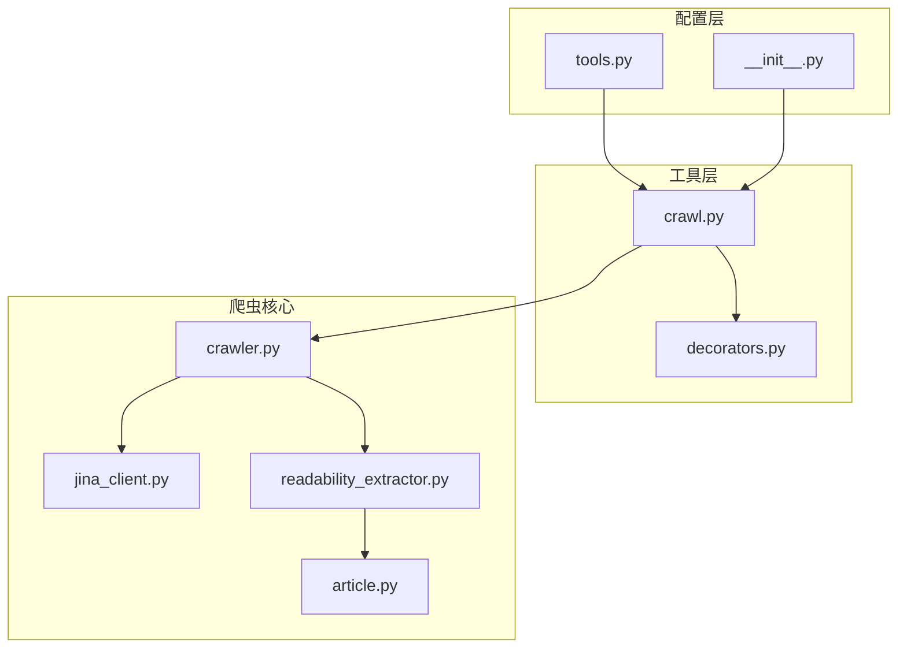
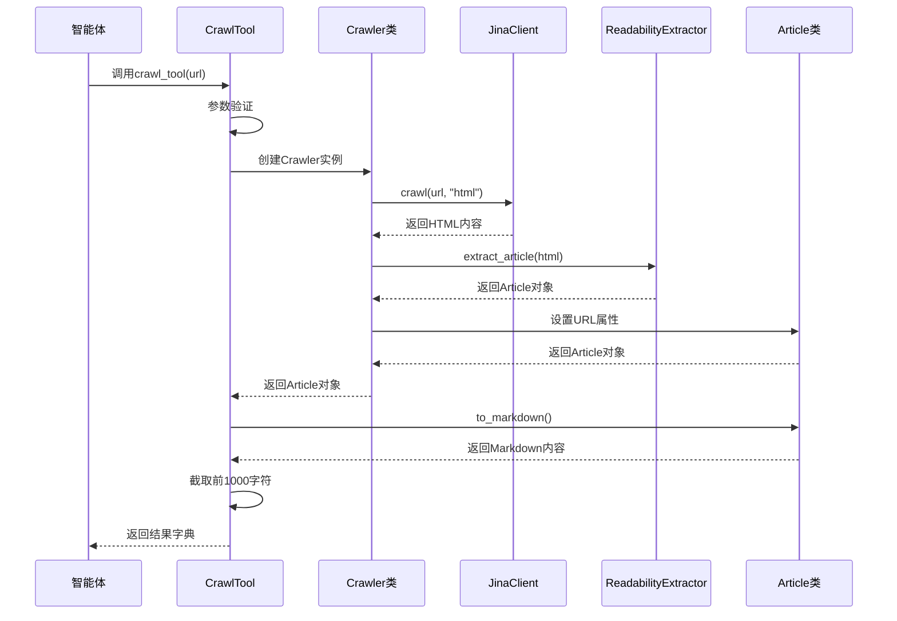
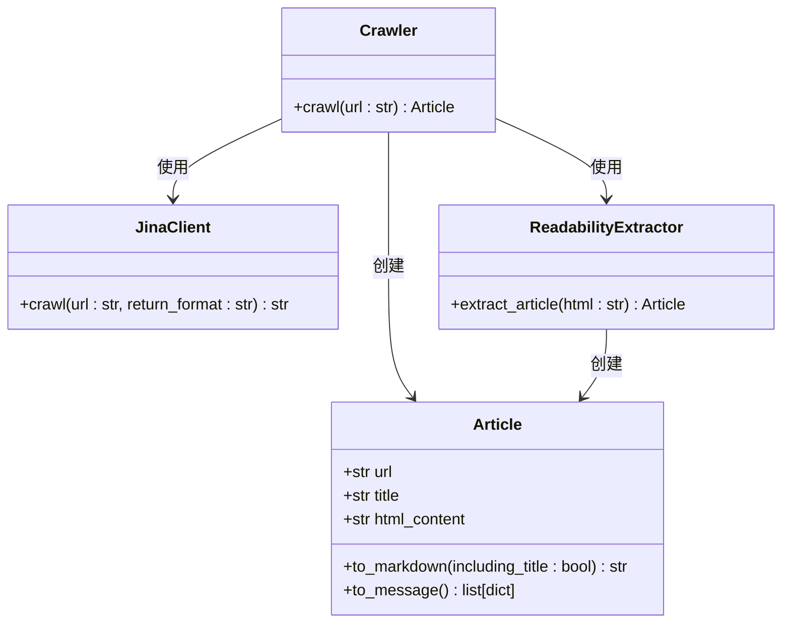
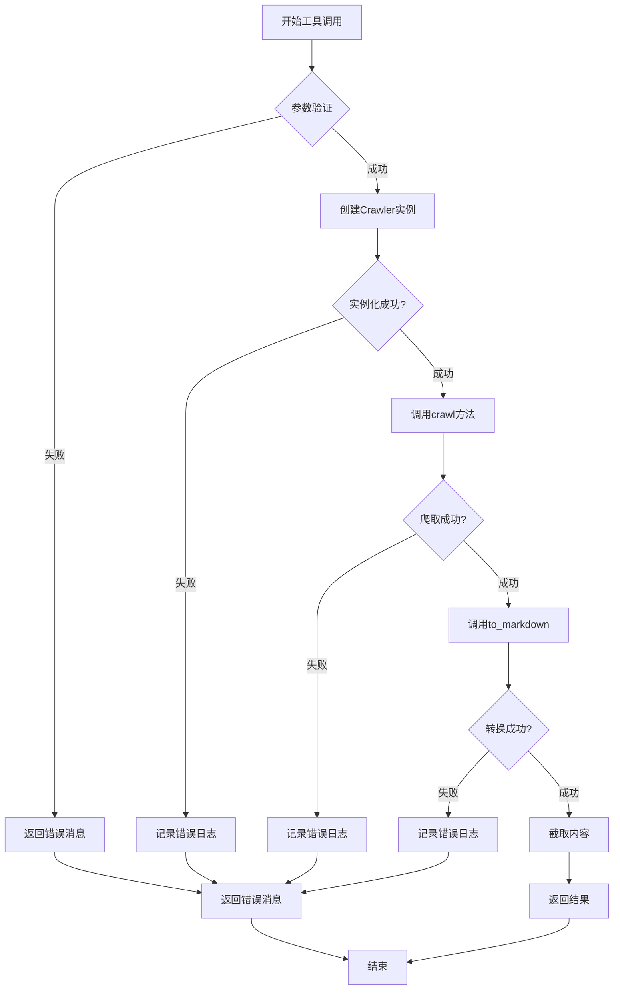
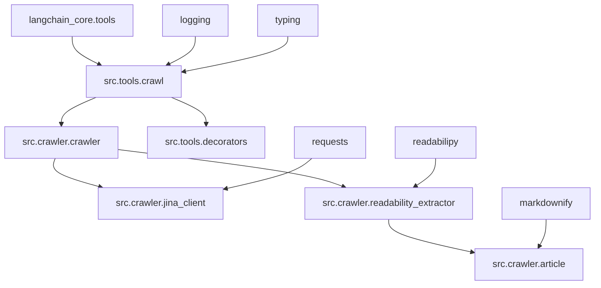

# 爬虫工具集成

<cite>
**本文档中引用的文件**
- [crawl.py](file://src/tools/crawl.py)
- [crawler.py](file://src/crawler/crawler.py)
- [article.py](file://src/crawler/article.py)
- [jina_client.py](file://src/crawler/jina_client.py)
- [readability_extractor.py](file://src/crawler/readability_extractor.py)
- [decorators.py](file://src/tools/decorators.py)
- [test_crawl.py](file://tests/unit/tools/test_crawl.py)
- [__init__.py](file://src/tools/__init__.py)
- [tools.py](file://src/config/tools.py)
</cite>

## 目录
1. [简介](#简介)
2. [项目结构](#项目结构)
3. [核心组件](#核心组件)
4. [架构概览](#架构概览)
5. [详细组件分析](#详细组件分析)
6. [依赖关系分析](#依赖关系分析)
7. [性能考虑](#性能考虑)
8. [故障排除指南](#故障排除指南)
9. [结论](#结论)

## 简介

爬虫工具是智能体工作流中的关键组件，负责从互联网上抓取网页内容并将其转换为可读的格式。本文档详细介绍了CrawlTool类的设计和使用，包括其在智能体系统中的集成方式、参数定义、执行逻辑和结果格式化。

该爬虫工具基于Jina AI的服务，通过HTML提取和Markdown转换技术，为智能体提供清洁、结构化的网页内容。工具设计遵循安全原则，包含完整的错误处理机制和审计日志功能。

## 项目结构

爬虫工具模块位于`src/tools/`目录下，主要包含以下文件：



**图表来源**
- [crawl.py](file://src/tools/crawl.py#L1-L30)
- [crawler.py](file://src/crawler/crawler.py#L1-L28)
- [decorators.py](file://src/tools/decorators.py#L1-L82)

**章节来源**
- [crawl.py](file://src/tools/crawl.py#L1-L30)
- [__init__.py](file://src/tools/__init__.py#L1-L17)

## 核心组件

### CrawlTool类设计

CrawlTool是一个装饰器函数，将爬虫功能暴露为智能体可用的工具。它使用LangChain的`@tool`装饰器，并集成了日志记录功能。

```python
@tool
@log_io
def crawl_tool(
    url: Annotated[str, "The url to crawl."]
) -> str:
    """Use this to crawl a url and get a readable content in markdown format."""
```

### 关键特性

1. **URL验证**：接受有效的URL作为输入参数
2. **内容截断**：返回最多1000字符的内容摘要
3. **错误处理**：捕获所有异常并返回友好的错误消息
4. **日志记录**：自动记录工具调用的输入输出

**章节来源**
- [crawl.py](file://src/tools/crawl.py#L12-L30)

## 架构概览

爬虫工具采用分层架构设计，确保各组件职责清晰且易于维护：



**图表来源**
- [crawl.py](file://src/tools/crawl.py#L18-L28)
- [crawler.py](file://src/crawler/crawler.py#L11-L27)

## 详细组件分析

### Crawler类实现

Crawler类是爬虫的核心组件，负责协调各个子组件完成网页内容提取：



**图表来源**
- [crawler.py](file://src/crawler/crawler.py#L11-L27)
- [jina_client.py](file://src/crawler/jina_client.py#L12-L26)
- [readability_extractor.py](file://src/crawler/readability_extractor.py#L9-L15)
- [article.py](file://src/crawler/article.py#L9-L37)

### JinaClient服务集成

JinaClient封装了对Jina AI服务的访问，提供免费的网页内容提取功能：

```python
def crawl(self, url: str, return_format: str = "html") -> str:
    headers = {
        "Content-Type": "application/json",
        "X-Return-Format": return_format,
    }
    if os.getenv("JINA_API_KEY"):
        headers["Authorization"] = f"Bearer {os.getenv('JINA_API_KEY')}"
    
    data = {"url": url}
    response = requests.post("https://r.jina.ai/", headers=headers, json=data)
    return response.text
```

**关键特性：**
- 支持多种返回格式（HTML、JSON等）
- 可选的API密钥认证
- 默认的免费速率限制
- 错误处理和警告日志

**章节来源**
- [jina_client.py](file://src/crawler/jina_client.py#L12-L26)

### Article类内容处理

Article类负责将原始HTML内容转换为结构化的Markdown格式：

```python
def to_markdown(self, including_title: bool = True) -> str:
    markdown = ""
    if including_title:
        markdown += f"# {self.title}\n\n"
    markdown += md(self.html_content)
    return markdown
```

该方法支持：
- 可选的标题包含
- Markdown格式转换
- 图像链接的特殊处理

**章节来源**
- [article.py](file://src/crawler/article.py#L17-L23)

### 错误处理和日志记录

工具采用了多层次的错误处理策略：



**图表来源**
- [crawl.py](file://src/tools/crawl.py#L18-L28)

**章节来源**
- [crawl.py](file://src/tools/crawl.py#L18-L28)
- [decorators.py](file://src/tools/decorators.py#L14-L35)

## 依赖关系分析

爬虫工具的依赖关系展现了清晰的分层架构：



**图表来源**
- [crawl.py](file://src/tools/crawl.py#L1-L10)
- [crawler.py](file://src/crawler/crawler.py#L1-L10)

**章节来源**
- [crawl.py](file://src/tools/crawl.py#L1-L10)
- [crawler.py](file://src/crawler/crawler.py#L1-L10)

## 性能考虑

### 内存管理

1. **内容截断**：限制返回内容长度为1000字符，避免内存溢出
2. **流式处理**：使用生成器模式处理大型文档
3. **缓存策略**：可扩展的缓存机制减少重复请求

### 网络优化

1. **连接复用**：使用持久连接池
2. **超时控制**：设置合理的网络超时时间
3. **重试机制**：自动重试临时性网络错误

### 安全考虑

1. **URL验证**：防止恶意URL注入
2. **内容过滤**：移除潜在的恶意脚本
3. **速率限制**：避免对目标网站造成过大压力

## 故障排除指南

### 常见问题及解决方案

#### 1. Jina API密钥问题

**症状**：收到速率限制警告或访问被拒绝
**解决方案**：
- 设置环境变量`JINA_API_KEY`
- 考虑升级到付费计划以获得更高限速

#### 2. 网页内容提取失败

**症状**：返回空内容或错误消息
**解决方案**：
- 验证URL的有效性
- 检查目标网站是否允许爬取
- 尝试不同的用户代理设置

#### 3. 内容格式转换错误

**症状**：Markdown转换失败或格式混乱
**解决方案**：
- 检查HTML内容的完整性
- 更新readabilipy库版本
- 实现备用转换方案

**章节来源**
- [test_crawl.py](file://tests/unit/tools/test_crawl.py#L41-L108)

## 结论

爬虫工具集成展示了现代智能体系统中工具设计的最佳实践。通过清晰的分层架构、完善的错误处理和全面的日志记录，该工具能够可靠地为智能体提供网页内容。

### 主要优势

1. **易用性**：简单的API接口，易于集成到现有工作流
2. **可靠性**：多层错误处理和恢复机制
3. **可观测性**：完整的日志记录和监控支持
4. **可扩展性**：模块化设计便于功能扩展

### 未来改进方向

1. **缓存机制**：实现智能缓存以提高性能
2. **并发处理**：支持批量URL处理
3. **内容质量评估**：添加内容质量评分功能
4. **多语言支持**：扩展对非英文内容的支持

该爬虫工具为智能体提供了强大的网络内容获取能力，是构建知识密集型应用的重要基础设施。