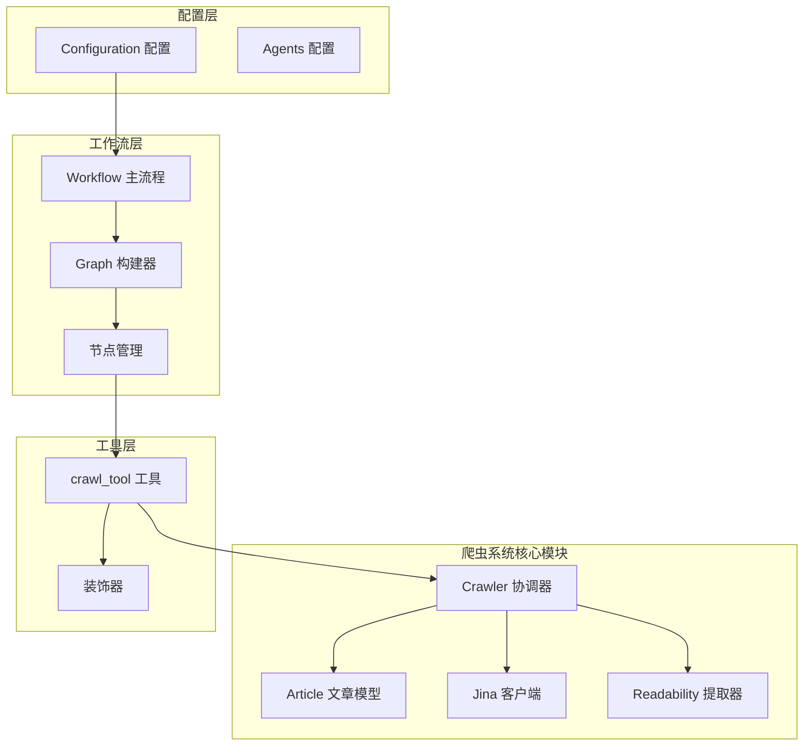
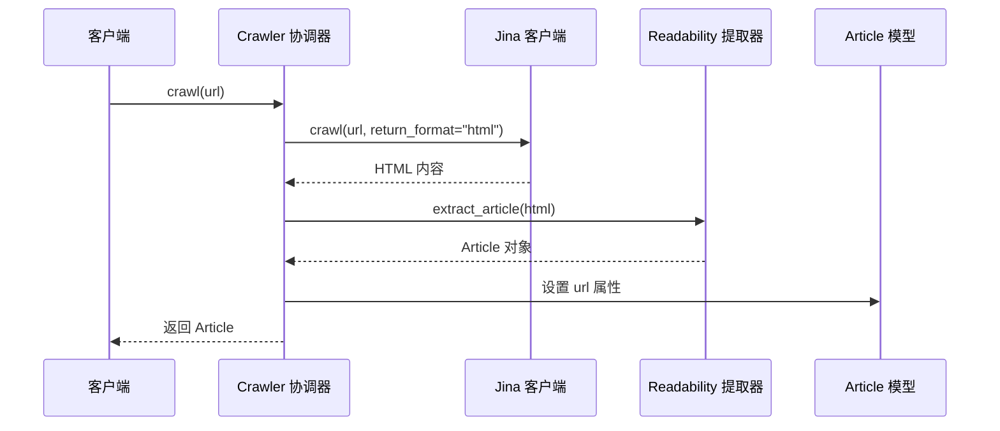
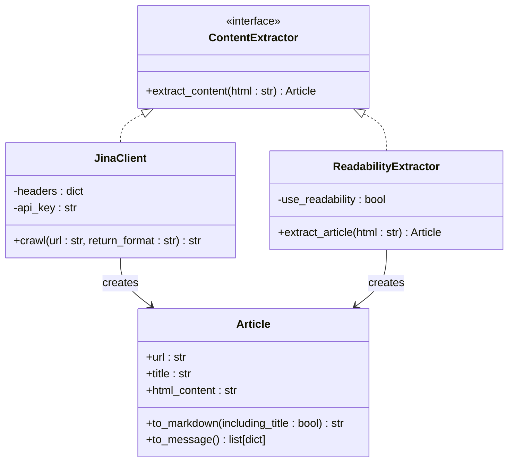
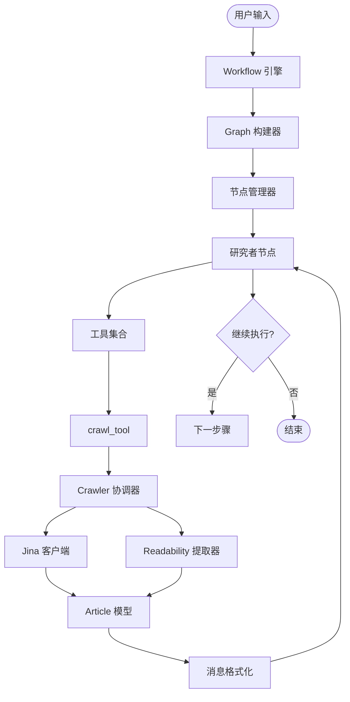
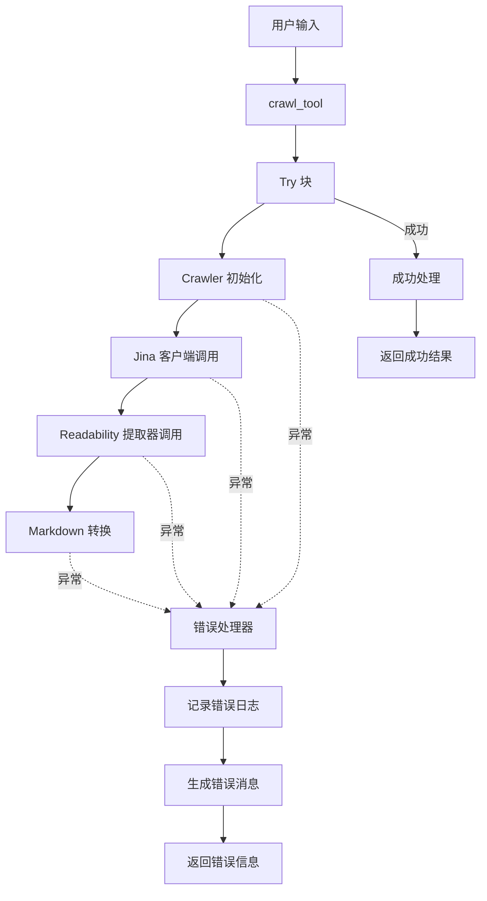
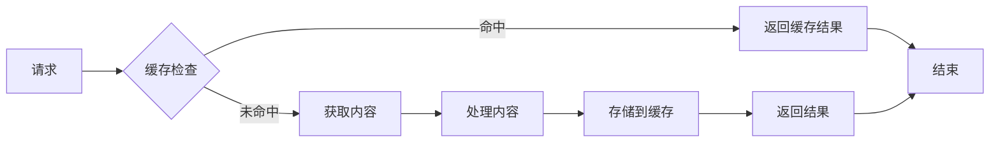

# DeerFlow 爬虫系统架构设计文档

<cite>
**本文档中引用的文件**
- [crawler.py](file://src/crawler/crawler.py)
- [article.py](file://src/crawler/article.py)
- [jina_client.py](file://src/crawler/jina_client.py)
- [readability_extractor.py](file://src/crawler/readability_extractor.py)
- [crawl.py](file://src/tools/crawl.py)
- [workflow.py](file://src/workflow.py)
- [builder.py](file://src/graph/builder.py)
- [nodes.py](file://src/graph/nodes.py)
- [configuration.py](file://src/config/configuration.py)
- [test_crawler_class.py](file://tests/unit/crawler/test_crawler_class.py)
- [test_crawl.py](file://tests/unit/tools/test_crawl.py)
</cite>

## 目录
1. [简介](#简介)
2. [项目结构概览](#项目结构概览)
3. [核心组件分析](#核心组件分析)
4. [架构设计模式](#架构设计模式)
5. [详细组件分析](#详细组件分析)
6. [智能体工作流集成](#智能体工作流集成)
7. [错误处理与回退机制](#错误处理与回退机制)
8. [性能优化策略](#性能优化策略)
9. [故障排除指南](#故障排除指南)
10. [总结](#总结)

## 简介

DeerFlow 是一个基于 LangGraph 的智能研究系统，其爬虫架构采用协调器（Coordinator）模式设计，通过 Crawler 类作为中央协调器，根据配置策略选择合适的客户端和服务来提取网页内容。该系统的核心设计理念是提供统一的接口来处理不同来源的内容提取需求，同时具备强大的错误处理和回退机制。

爬虫系统的主要目标是：
- 提供统一的网页内容提取接口
- 支持多种内容提取策略
- 实现高质量的内容转换和格式化
- 集成到智能体工作流中
- 提供可靠的错误处理和监控

## 项目结构概览



**图表来源**
- [crawler.py](file://src/crawler/crawler.py#L1-L28)
- [crawl.py](file://src/tools/crawl.py#L1-L30)
- [workflow.py](file://src/workflow.py#L1-L104)

**章节来源**
- [crawler.py](file://src/crawler/crawler.py#L1-L28)
- [article.py](file://src/crawler/article.py#L1-L38)
- [jina_client.py](file://src/crawler/jina_client.py#L1-L27)
- [readability_extractor.py](file://src/crawler/readability_extractor.py#L1-L16)

## 核心组件分析

### Crawler 协调器类

Crawler 类是整个爬虫系统的核心协调器，采用简洁的设计模式来处理内容提取任务：

```python
class Crawler:
    def crawl(self, url: str) -> Article:
        # 使用 Jina Client 获取 HTML 内容
        jina_client = JinaClient()
        html = jina_client.crawl(url, return_format="html")
        
        # 使用 Readability 提取器解析文章
        extractor = ReadabilityExtractor()
        article = extractor.extract_article(html)
        
        # 设置文章 URL 并返回
        article.url = url
        return article
```

该设计遵循以下原则：
- **单一职责原则**：专注于协调不同服务的调用
- **依赖注入**：通过构造函数注入依赖项
- **清晰的接口**：提供简洁的 `crawl` 方法接口
- **类型安全**：使用 Python 类型注解确保参数和返回值的类型安全

### Article 数据模型

Article 类负责封装提取的文章数据，提供多种输出格式：

```python
class Article:
    url: str
    
    def to_markdown(self, including_title: bool = True) -> str:
        # 将 HTML 转换为 Markdown 格式
        
    def to_message(self) -> list[dict]:
        # 将内容分割为文本和图像块，用于统一的消息格式
```

**章节来源**
- [crawler.py](file://src/crawler/crawler.py#L9-L27)
- [article.py](file://src/crawler/article.py#L9-L37)

## 架构设计模式

### 协调器模式（Coordinator Pattern）

DeerFlow 爬虫系统采用协调器模式，Crawler 类作为中央协调器，负责：



**图表来源**
- [crawler.py](file://src/crawler/crawler.py#L11-L27)
- [jina_client.py](file://src/crawler/jina_client.py#L12-L26)
- [readability_extractor.py](file://src/crawler/readability_extractor.py#L10-L15)

### 策略模式（Strategy Pattern）

系统支持不同的内容提取策略：



**图表来源**
- [crawler.py](file://src/crawler/crawler.py#L9-L27)
- [jina_client.py](file://src/crawler/jina_client.py#L12-L26)
- [readability_extractor.py](file://src/crawler/readability_extractor.py#L10-L15)
- [article.py](file://src/crawler/article.py#L9-L37)

**章节来源**
- [crawler.py](file://src/crawler/crawler.py#L9-L27)
- [jina_client.py](file://src/crawler/jina_client.py#L12-L26)
- [readability_extractor.py](file://src/crawler/readability_extractor.py#L10-L15)

## 详细组件分析

### Jina 客户端组件

Jina 客户端提供了对 Jina Reader API 的访问，支持免费和付费两种模式：

```python
class JinaClient:
    def crawl(self, url: str, return_format: str = "html") -> str:
        headers = {
            "Content-Type": "application/json",
            "X-Return-Format": return_format,
        }
        
        # 检查 API 密钥设置
        if os.getenv("JINA_API_KEY"):
            headers["Authorization"] = f"Bearer {os.getenv('JINA_API_KEY')}"
        else:
            logger.warning("Jina API key is not set...")
            
        data = {"url": url}
        response = requests.post("https://r.jina.ai/", headers=headers, json=data)
        return response.text
```

主要特性：
- **自动 API 密钥检测**：检查环境变量中的 JINA_API_KEY
- **格式化响应**：支持 HTML 和其他格式的返回
- **警告日志**：当未设置 API 密钥时发出警告
- **HTTP 请求处理**：使用 requests 库发送 POST 请求

### Readability 提取器组件

Readability 提取器基于 readabilipy 库，提供专业的文章内容提取功能：

```python
class ReadabilityExtractor:
    def extract_article(self, html: str) -> Article:
        article = simple_json_from_html_string(html, use_readability=True)
        return Article(
            title=article.get("title"),
            html_content=article.get("content"),
        )
```

特点：
- **专业内容提取**：使用 Readability 算法提取主要内容
- **JSON 输出**：返回结构化的文章数据
- **标题保留**：自动提取并保留文章标题
- **内容过滤**：移除无关的导航和广告内容

### Article 消息格式化组件

Article 类提供了多种输出格式，特别是针对统一消息格式的优化：

```python
def to_message(self) -> list[dict]:
    image_pattern = r"!\[.*?\]\((.*?)\)"
    
    content: list[dict[str, str]] = []
    parts = re.split(image_pattern, self.to_markdown())
    
    for i, part in enumerate(parts):
        if i % 2 == 1:
            # 处理图像链接
            image_url = urljoin(self.url, part.strip())
            content.append({"type": "image_url", "image_url": {"url": image_url}})
        else:
            # 处理文本内容
            content.append({"type": "text", "text": part.strip()})
    
    return content
```

**章节来源**
- [jina_client.py](file://src/crawler/jina_client.py#L12-L26)
- [readability_extractor.py](file://src/crawler/readability_extractor.py#L10-L15)
- [article.py](file://src/crawler/article.py#L20-L37)

## 智能体工作流集成

### 工具集成架构

爬虫系统通过 crawl_tool 工具集成到 LangGraph 智能体工作流中：



**图表来源**
- [workflow.py](file://src/workflow.py#L20-L104)
- [builder.py](file://src/graph/builder.py#L20-L87)
- [nodes.py](file://src/graph/nodes.py#L481-L510)
- [crawl.py](file://src/tools/crawl.py#L17-L29)

### 研究者节点集成

研究者节点将 crawl_tool 作为其工具集的一部分：

```python
async def researcher_node(state: State, config: RunnableConfig):
    """研究者节点执行研究任务"""
    configurable = Configuration.from_runnable_config(config)
    tools = [
        get_web_search_tool(configurable.max_search_results, configurable.search_engine, configurable.custom_search_repository), 
        crawl_tool
    ]
    
    retriever_tool = get_retriever_tool(state.get("resources", []))
    if retriever_tool:
        tools.insert(0, retriever_tool)
    
    return await _setup_and_execute_agent_step(state, config, "researcher", tools)
```

集成特点：
- **多工具支持**：结合网络搜索和网页爬取
- **资源优先级**：检索工具优先于其他工具
- **动态配置**：根据配置调整工具行为
- **异步执行**：支持异步任务处理

### 配置驱动的集成

系统通过 Configuration 类实现配置驱动的集成：

```python
@dataclass(kw_only=True)
class Configuration:
    resources: list[Resource] = field(default_factory=list)
    max_plan_iterations: int = 1
    max_step_num: int = 3
    max_search_results: int = 3
    search_engine: str = "tavily"
    custom_search_repository: Optional[str] = None
    mcp_settings: dict = None
    report_style: str = ReportStyle.ACADEMIC.value
    enable_deep_thinking: bool = False
```

**章节来源**
- [nodes.py](file://src/graph/nodes.py#L481-L510)
- [configuration.py](file://src/config/configuration.py#L35-L70)

## 错误处理与回退机制

### 分层错误处理策略



**图表来源**
- [crawl.py](file://src/tools/crawl.py#L17-L29)
- [test_crawl.py](file://tests/unit/tools/test_crawl.py#L41-L108)

### 具体错误处理实现

系统实现了多层次的错误处理：

```python
@tool
@log_io
def crawl_tool(url: str) -> str:
    """使用此工具爬取 URL 并获取可读内容的 Markdown 格式。"""
    try:
        crawler = Crawler()
        article = crawler.crawl(url)
        return {"url": url, "crawled_content": article.to_markdown()[:1000]}
    except BaseException as e:
        error_msg = f"Failed to crawl. Error: {repr(e)}"
        logger.error(error_msg)
        return error_msg
```

错误处理特点：
- **全面异常捕获**：捕获所有 BaseException
- **详细错误信息**：包含异常的完整 repr 表示
- **日志记录**：记录详细的错误日志
- **用户友好反馈**：返回易于理解的错误消息

### 测试验证的错误处理

单元测试验证了各种错误场景：

```python
# 测试 Crawler 初始化异常
@patch("src.tools.crawl.Crawler")
def test_crawl_tool_crawler_exception(self, mock_crawler_class):
    mock_crawler = Mock()
    mock_crawler.crawl.side_effect = Exception("Network error")
    mock_crawler_class.return_value = mock_crawler
    
    result = crawl_tool(url)
    assert "Failed to crawl" in result
    assert "Network error" in result

# 测试 Markdown 转换异常
@patch("src.tools.crawl.Crawler")
def test_crawl_tool_markdown_conversion_exception(self, mock_crawler_class):
    mock_crawler = Mock()
    mock_article = Mock()
    mock_article.to_markdown.side_effect = Exception("Markdown conversion error")
    mock_crawler.crawl.return_value = mock_article
    
    result = crawl_tool(url)
    assert "Failed to crawl" in result
    assert "Markdown conversion error" in result
```

**章节来源**
- [crawl.py](file://src/tools/crawl.py#L17-L29)
- [test_crawl.py](file://tests/unit/tools/test_crawl.py#L41-L108)

## 性能优化策略

### 内容长度限制

系统实现了内容长度限制以优化性能：

```python
def crawl_tool(url: str) -> str:
    crawler = Crawler()
    article = crawler.crawl(url)
    # 只返回前 1000 字符的 Markdown 内容
    return {"url": url, "crawled_content": article.to_markdown()[:1000]}
```

优化策略：
- **内容截断**：限制返回内容的最大长度
- **内存效率**：减少内存占用
- **传输优化**：降低网络传输开销
- **处理速度**：提高后续处理速度

### 缓存和重用机制

虽然当前实现没有显式的缓存机制，但可以通过以下方式优化：



### 并发控制

系统支持异步执行，可以在研究者节点中实现并发：

```python
async def researcher_node(state: State, config: RunnableConfig):
    # 并行执行多个工具
    tasks = []
    for tool in tools:
        task = asyncio.create_task(tool.arun(state, config))
        tasks.append(task)
    
    results = await asyncio.gather(*tasks, return_exceptions=True)
    return results
```

## 故障排除指南

### 常见问题诊断

1. **Jina API 密钥问题**
   ```bash
   # 检查环境变量
   echo $JINA_API_KEY
   
   # 设置 API 密钥
   export JINA_API_KEY="your-api-key-here"
   ```

2. **网络连接问题**
   ```python
   # 测试 Jina 服务可用性
   import requests
   response = requests.post("https://r.jina.ai/", json={"url": "https://example.com"})
   print(response.status_code)
   ```

3. **HTML 解析失败**
   ```python
   # 检查 HTML 内容
   html_content = jina_client.crawl(url, "html")
   print(len(html_content))  # 检查内容长度
   print(html_content[:100])  # 查看前100字符
   ```

### 调试技巧

1. **启用调试日志**
   ```python
   import logging
   logging.getLogger("src").setLevel(logging.DEBUG)
   ```

2. **检查中间结果**
   ```python
   # 在各个步骤添加调试输出
   print(f"Jina response length: {len(html_content)}")
   print(f"Article title: {article.title}")
   print(f"Markdown length: {len(markdown_content)}")
   ```

3. **单元测试验证**
   ```python
   # 运行爬虫测试
   pytest tests/unit/crawler/test_crawler_class.py
   ```

**章节来源**
- [test_crawl.py](file://tests/unit/tools/test_crawl.py#L41-L108)
- [test_crawler_class.py](file://tests/unit/crawler/test_crawler_class.py#L1-L71)

## 总结

DeerFlow 爬虫系统展现了优秀的软件架构设计，通过以下关键特性实现了高效的内容提取：

### 设计优势

1. **清晰的职责分离**：Crawler 协调器专注于协调，各组件专注于特定功能
2. **灵活的扩展性**：支持多种内容提取策略和格式
3. **强大的错误处理**：多层次的异常捕获和用户友好的错误反馈
4. **集成能力**：无缝集成到 LangGraph 智能体工作流中
5. **性能优化**：内容长度限制和异步处理支持

### 架构亮点

- **协调器模式**：Crawler 类作为中央协调器，简化了复杂的服务调用
- **策略模式**：支持不同的内容提取策略，便于扩展和替换
- **分层设计**：从底层服务到上层应用的清晰层次结构
- **配置驱动**：通过 Configuration 类实现灵活的配置管理

### 未来改进方向

1. **缓存机制**：实现内容缓存以提高性能
2. **并发处理**：增强并发能力以处理大量请求
3. **监控指标**：添加详细的性能监控和指标收集
4. **负载均衡**：支持多个 Jina 服务实例的负载均衡
5. **质量评估**：实现内容质量评估和自动回退机制

该爬虫系统为 DeerFlow 智能研究平台提供了坚实的基础，展示了如何在复杂的 AI 应用中实现可靠、高效的网页内容提取功能。