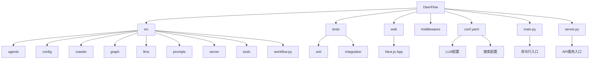
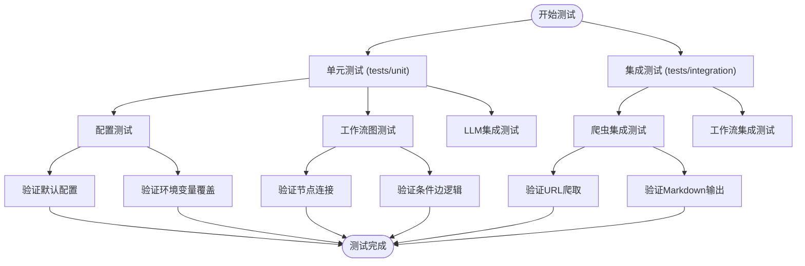

# 开发者指南

<cite>
**本文档中引用的文件**  
- [main.py](file://main.py)
- [server.py](file://server.py)
- [conf.yaml](file://conf.yaml)
- [debug_llm_connection.py](file://debug_llm_connection.py)
- [pyproject.toml](file://pyproject.toml)
- [bootstrap.sh](file://bootstrap.sh)
- [src/config/configuration.py](file://src/config/configuration.py)
- [src/workflow.py](file://src/workflow.py)
- [src/graph/builder.py](file://src/graph/builder.py)
- [tests/unit/config/test_configuration.py](file://tests/unit/config/test_configuration.py)
- [tests/integration/test_crawler.py](file://tests/integration/test_crawler.py)
- [tests/unit/graph/test_builder.py](file://tests/unit/graph/test_builder.py)
- [web/package.json](file://web/package.json)
</cite>

## 目录
1. [简介](#简介)
2. [项目结构](#项目结构)
3. [本地开发环境搭建](#本地开发环境搭建)
4. [调试技巧](#调试技巧)
5. [测试策略](#测试策略)
6. [贡献流程](#贡献流程)
7. [实用开发技巧](#实用开发技巧)
8. [常见问题与故障排除](#常见问题与故障排除)
9. [结论](#结论)

## 简介
DeerFlow 是一个基于 LangGraph 构建的智能代理工作流系统，旨在通过多智能体协作完成复杂的研究任务。本开发者指南旨在为开发者提供全面的本地开发支持，涵盖环境搭建、调试方法、测试策略和贡献流程。系统采用模块化设计，包含智能体协调、网络爬虫、LLM 集成、报告生成等核心功能，支持通过配置文件灵活定制 LLM 模型、搜索引擎和工作流参数。

## 项目结构
DeerFlow 项目采用清晰的分层架构，主要分为以下几个核心目录：

- **src**: 核心源代码目录，包含所有业务逻辑
  - `agents`: 智能体定义
  - `config`: 配置管理
  - `crawler`: 网络爬虫模块
  - `graph`: 工作流图构建
  - `llms`: 大语言模型集成
  - `prompts`: 提示词模板
  - `server`: FastAPI 服务端
  - `tools`: 工具函数
  - `workflow.py`: 主工作流入口

- **tests**: 测试套件
  - `unit`: 单元测试
  - `integration`: 集成测试

- **web**: 前端用户界面（Next.js）

- **middlewares**: 中间件脚本
- **examples**: 示例文档
- **.yaml/.py**: 根目录配置和启动脚本



**图源**
- [main.py](file://main.py)
- [server.py](file://server.py)
- [conf.yaml](file://conf.yaml)
- [src/workflow.py](file://src/workflow.py)

## 本地开发环境搭建
### 依赖安装
DeerFlow 使用 `uv` 作为 Python 包管理器，`pnpm` 管理前端依赖。请确保已安装 Python 3.12+ 和 Node.js 18+。

1. **安装 Python 依赖**:
```bash
uv sync
uv sync --group dev  # 开发依赖
uv sync --group test # 测试依赖
```

2. **安装前端依赖**:
```bash
cd web && pnpm install
```

3. **环境变量配置**:
创建 `.env` 文件，设置 LLM API 密钥：
```env
BASIC_MODEL__api_key=your_api_key_here
```

### 配置文件设置
`conf.yaml` 是核心配置文件，主要配置项包括：

- **BASIC_MODEL**: 基础 LLM 模型配置
  - `base_url`: LLM 服务地址
  - `model`: 模型名称
  - `api_key`: API 密钥
  - `verify_ssl`: SSL 验证（自签名证书时设为 false）

- **SEARCH_ENGINE**: 搜索引擎配置
  - `engine`: 搜索引擎类型（如 tavily）
  - `include_domains`: 包含的域名
  - `exclude_domains`: 排除的域名

- **CUSTOM_SEARCH**: 自定义搜索配置
  - `repositories`: 搜索仓库列表
  - `default_repository`: 默认仓库

### 数据库初始化
DeerFlow 使用内存检查点作为默认状态存储。如需持久化，可配置 PostgreSQL 或 MongoDB 检查点。在 `pyproject.toml` 中已包含相关依赖：
- `langgraph-checkpoint-postgres`
- `langgraph-checkpoint-mongodb`

**节源**
- [pyproject.toml](file://pyproject.toml)
- [conf.yaml](file://conf.yaml)

## 调试技巧
### 使用 debug_llm_connection.py 进行连接诊断
`debug_llm_connection.py` 是一个专门用于诊断 LLM 连接问题的工具脚本，它模拟了项目中的实际连接流程，包含 7 个调试阶段：

1. **配置加载调试**: 检查 `conf.yaml` 文件加载情况
2. **环境变量调试**: 检查环境变量覆盖情况
3. **合并配置调试**: 显示最终使用的配置
4. **HTTP 客户端创建调试**: 检查 HTTP 客户端创建
5. **ChatOpenAI 实例创建调试**: 检查 LangChain LLM 实例创建
6. **直接 HTTP 请求调试**: 发送原始 HTTP 请求测试连接
7. **LangChain 请求调试**: 通过 LangChain 发送测试请求

使用方法：
```bash
python debug_llm_connection.py
```

该脚本会输出详细的调试信息，帮助定位连接失败的原因，如配置错误、网络问题或 API 密钥无效等。

### 性能分析
通过启用调试日志可以分析工作流执行性能：
```python
from src.workflow import enable_debug_logging
enable_debug_logging()
```

或在命令行运行时添加 `--debug` 参数：
```bash
python main.py --debug "你的问题"
```

**节源**
- [debug_llm_connection.py](file://debug_llm_connection.py)
- [src/workflow.py](file://src/workflow.py)

## 测试策略
### 单元测试
单元测试位于 `tests/unit` 目录，采用 `pytest` 框架，主要测试核心组件的逻辑正确性。

**示例：配置测试**
```python
def test_default_configuration():
    config = Configuration()
    assert config.max_plan_iterations == 1
    assert config.max_step_num == 3
```

**覆盖率要求**:
- 核心业务逻辑：100%
- 配置管理：95%+
- 工具函数：90%+

运行单元测试：
```bash
pytest tests/unit
```

### 集成测试
集成测试位于 `tests/integration` 目录，测试组件间的协作和端到端流程。

**示例：爬虫集成测试**
```python
def test_crawler_crawl_valid_url():
    crawler = Crawler()
    result = crawler.crawl("https://example.com")
    assert result is not None
    assert hasattr(result, "to_markdown")
```

运行集成测试：
```bash
pytest tests/integration
```

### 测试套件运行
使用 `pytest` 运行完整测试套件：
```bash
# 运行所有测试
pytest tests/

# 运行测试并生成覆盖率报告
pytest tests/ --cov=src --cov-report=html

# 运行特定测试文件
pytest tests/unit/config/test_configuration.py
```

测试配置在 `pyproject.toml` 中定义，包含测试路径、文件模式和覆盖率阈值。



**图源**
- [tests/unit/config/test_configuration.py](file://tests/unit/config/test_configuration.py)
- [tests/integration/test_crawler.py](file://tests/integration/test_crawler.py)
- [tests/unit/graph/test_builder.py](file://tests/unit/graph/test_builder.py)

**节源**
- [pyproject.toml](file://pyproject.toml)
- [tests/unit/config/test_configuration.py](file://tests/unit/config/test_configuration.py)
- [tests/integration/test_crawler.py](file://tests/integration/test_crawler.py)

## 贡献流程
### 代码风格
遵循项目代码风格规范：
- Python: 使用 `ruff` 格式化，行长度 88
- JavaScript/TypeScript: 使用 `prettier` 格式化
- Git 提交信息：采用约定式提交（Conventional Commits）

### 提交规范
1. Fork 仓库并创建特性分支
2. 实现功能或修复问题
3. 运行测试确保通过
4. 提交更改：
```bash
git add .
git commit -m "feat: 添加新功能"
git push origin feature/new-feature
```
5. 创建 Pull Request

### PR 审查流程
1. **自动检查**: CI/CD 流水线运行测试和代码质量检查
2. **代码审查**: 至少一名核心开发者审查代码
3. **测试验证**: 确保所有测试通过
4. **合并**: 审查通过后合并到主分支

**节源**
- [pyproject.toml](file://pyproject.toml)
- [web/package.json](file://web/package.json)

## 实用开发技巧
### 热重载配置
使用 `bootstrap.sh` 脚本启动开发服务器，支持热重载：
```bash
./bootstrap.sh --dev
```
此命令同时启动后端 API 服务和前端开发服务器，代码更改会自动重新加载。

### 日志级别调整
通过命令行参数调整日志级别：
```bash
# 启用调试日志
python main.py --debug "问题"

# 运行服务器时指定日志级别
python server.py --log-level debug
```

### 性能监控
1. 使用 `--debug` 参数获取详细执行日志
2. 监控 LLM 调用次数和响应时间
3. 分析工作流执行路径和迭代次数

**节源**
- [bootstrap.sh](file://bootstrap.sh)
- [server.py](file://server.py)
- [src/workflow.py](file://src/workflow.py)

## 常见问题与故障排除
### LLM 连接失败
**症状**: LLM 调用超时或返回 401 错误

**解决方案**:
1. 使用 `debug_llm_connection.py` 脚本诊断
2. 检查 `conf.yaml` 中的 `base_url` 和 `api_key`
3. 检查网络连接和代理设置
4. 对于自签名证书，设置 `verify_ssl: false`

### 搜索功能异常
**症状**: 搜索结果为空或不相关

**解决方案**:
1. 检查 `conf.yaml` 中的 `SEARCH_ENGINE` 配置
2. 验证 `include_domains` 和 `exclude_domains` 设置
3. 检查 Tavily API 密钥是否有效

### 工作流卡住
**症状**: 工作流执行停滞，无进展

**解决方案**:
1. 检查 `max_plan_iterations` 和 `max_step_num` 配置
2. 启用调试日志分析执行路径
3. 检查智能体间的协调逻辑

### 前端无法连接后端
**症状**: 前端页面无法获取数据

**解决方案**:
1. 确保后端服务已启动：`python server.py`
2. 检查端