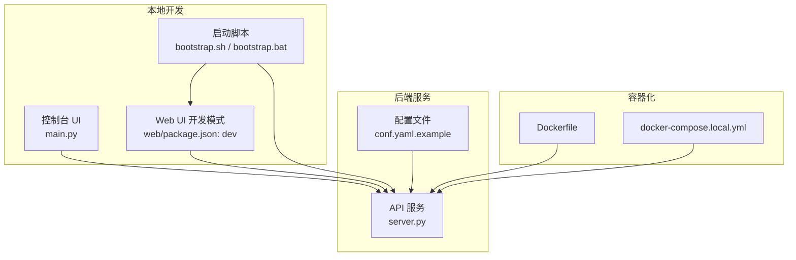
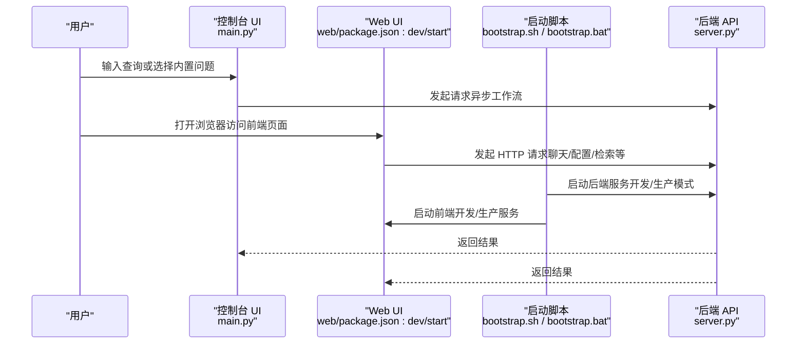
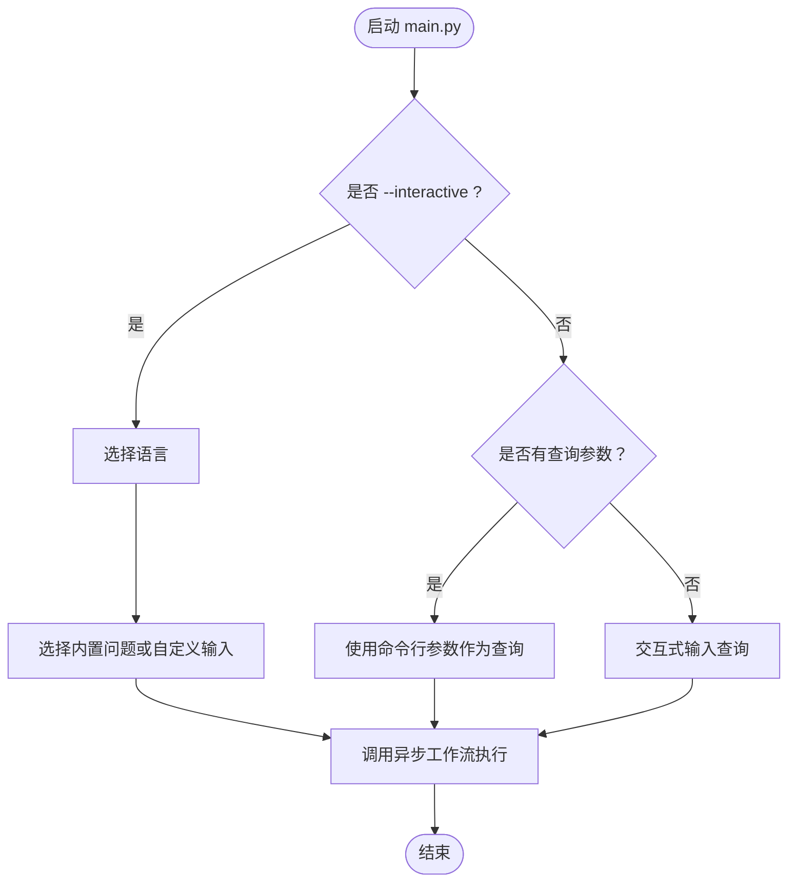
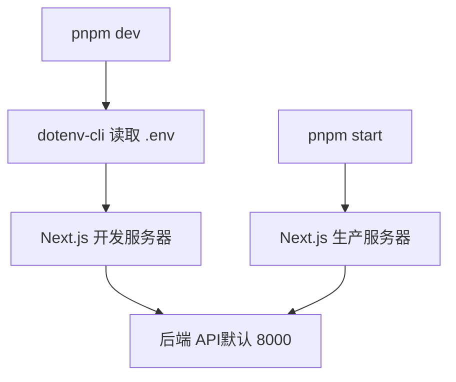
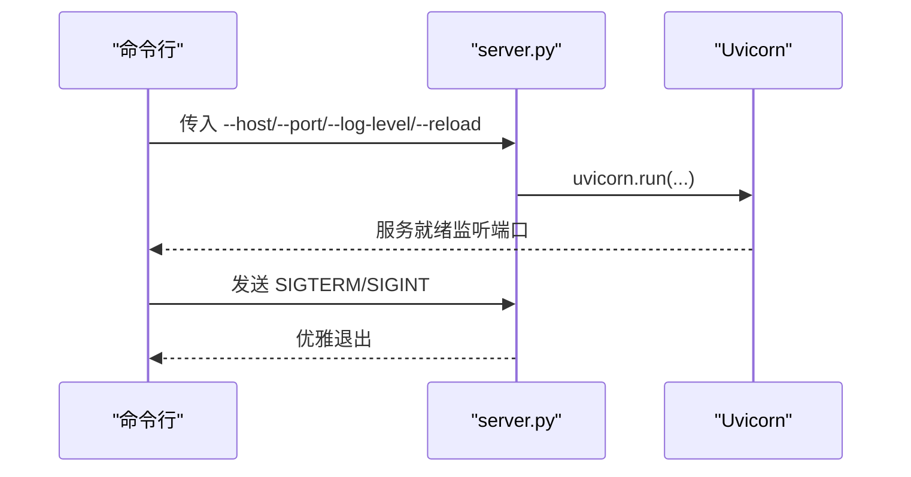
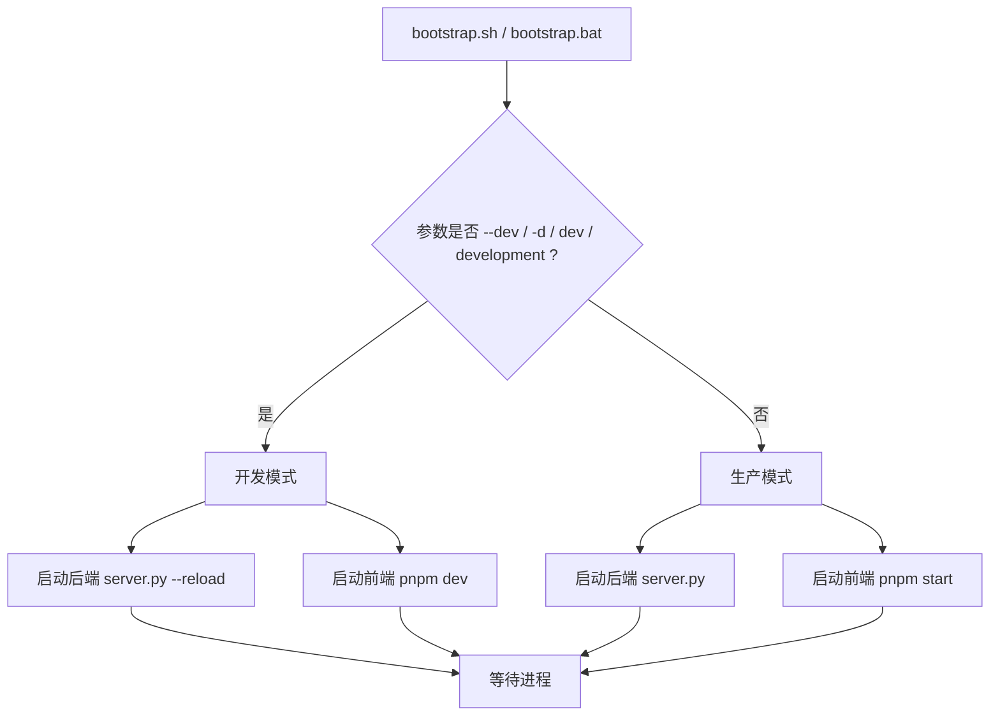
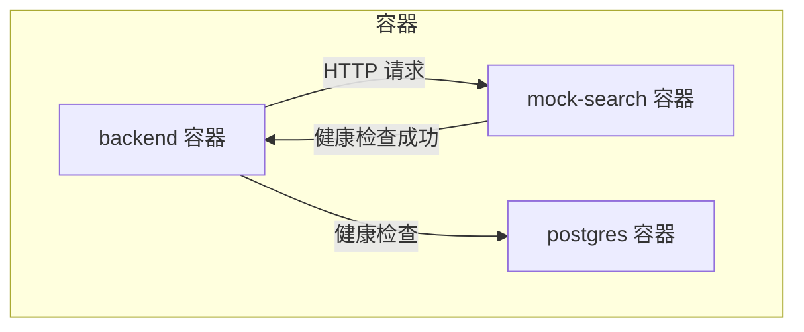
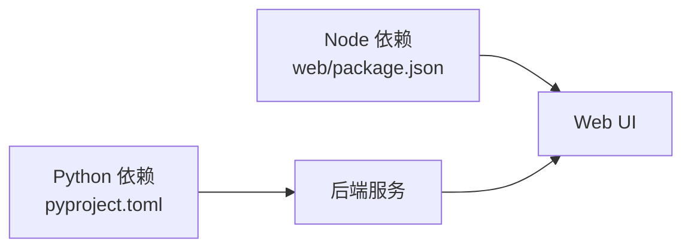

# 快速开始

<cite>
**本文引用的文件**
- [pyproject.toml](file://pyproject.toml)
- [bootstrap.sh](file://bootstrap.sh)
- [bootstrap.bat](file://bootstrap.bat)
- [conf.yaml.example](file://conf.yaml.example)
- [server.py](file://server.py)
- [main.py](file://main.py)
- [web/package.json](file://web/package.json)
- [Dockerfile](file://Dockerfile)
- [docker-compose.local.yml](file://docker-compose.local.yml)
- [.env 示例（未在仓库中直接出现，但用于说明）](file://README.md)
</cite>

## 目录
1. [简介](#简介)
2. [项目结构](#项目结构)
3. [核心组件](#核心组件)
4. [架构总览](#架构总览)
5. [详细组件分析](#详细组件分析)
6. [依赖分析](#依赖分析)
7. [性能考虑](#性能考虑)
8. [故障排除指南](#故障排除指南)
9. [结论](#结论)
10. [附录](#附录)

## 简介
本指南面向首次接触 DeerFlow 的用户，帮助你在最短时间内完成安装、配置与首次运行。内容涵盖：
- 环境要求（Python 3.12+、Node.js 22+）
- 推荐工具（uv、nvm、pnpm）的安装与配置
- 依赖管理与环境变量配置
- 控制台 UI 与 Web UI 两种启动方式
- 常见安装问题与故障排除

## 项目结构
DeerFlow 采用前后端分离架构：
- 后端：Python FastAPI 应用，通过 Uvicorn 提供服务
- 前端：Next.js Web UI，使用 pnpm 管理依赖
- 启动脚本：跨平台启动脚本，支持开发与生产模式
- 配置：后端 YAML 配置示例，前端环境变量通过 dotenv-cli 在开发时加载

**图表来源**
- [server.py:65-112](file://server.py#L65-L112)
- [main.py:99-157](file://main.py#L99-L157)
- [web/package.json:6-18](file://web/package.json#L6-L18)
- [bootstrap.sh:6-18](file://bootstrap.sh#L6-L18)
- [bootstrap.bat:5-25](file://bootstrap.bat#L5-L25)
- [conf.yaml.example:1-70](file://conf.yaml.example#L1-L70)
- [Dockerfile:1-35](file://Dockerfile#L1-L35)
- [docker-compose.local.yml:17-58](file://docker-compose.local.yml#L17-L58)

**章节来源**
- [server.py:65-112](file://server.py#L65-L112)
- [main.py:99-157](file://main.py#L99-L157)
- [web/package.json:6-18](file://web/package.json#L6-L18)
- [bootstrap.sh:6-18](file://bootstrap.sh#L6-L18)
- [bootstrap.bat:5-25](file://bootstrap.bat#L5-L25)
- [conf.yaml.example:1-70](file://conf.yaml.example#L1-L70)
- [Dockerfile:1-35](file://Dockerfile#L1-L35)
- [docker-compose.local.yml:17-58](file://docker-compose.local.yml#L17-L58)

## 核心组件
- 后端 API 服务：通过命令行参数控制主机、端口、日志级别，并支持优雅关闭信号
- 控制台 UI：交互式问答入口，支持内置问题与自定义输入
- Web UI：Next.js 应用，开发模式通过 dotenv-cli 加载 .env
- 启动脚本：统一启动后端与 Web UI，支持开发/生产模式切换
- 配置文件：LLM、搜索引擎等基础配置示例
- 容器化：Dockerfile 与 docker-compose.local.yml 支持本地开发与 Mock 模式

**章节来源**
- [server.py:65-112](file://server.py#L65-L112)
- [main.py:99-157](file://main.py#L99-L157)
- [web/package.json:6-18](file://web/package.json#L6-L18)
- [bootstrap.sh:6-18](file://bootstrap.sh#L6-L18)
- [bootstrap.bat:5-25](file://bootstrap.bat#L5-L25)
- [conf.yaml.example:1-70](file://conf.yaml.example#L1-L70)
- [Dockerfile:1-35](file://Dockerfile#L1-L35)
- [docker-compose.local.yml:17-58](file://docker-compose.local.yml#L17-L58)

## 架构总览
下图展示了从用户发起请求到系统响应的关键路径，涵盖控制台 UI、Web UI 与后端 API 的交互关系。

**图表来源**
- [main.py:99-157](file://main.py#L99-L157)
- [web/package.json:6-18](file://web/package.json#L6-L18)
- [bootstrap.sh:6-18](file://bootstrap.sh#L6-L18)
- [bootstrap.bat:5-25](file://bootstrap.bat#L5-L25)
- [server.py:65-112](file://server.py#L65-L112)

## 详细组件分析

### 环境与工具准备
- Python 3.12+：项目要求 Python 版本不低于 3.12，容器镜像也基于 Python 3.12
- Node.js 22+：Web UI 使用 Next.js，需满足 Node.js 版本要求
- 推荐工具
  - uv：Python 包管理与虚拟环境工具，项目中明确要求版本
  - nvm：Node.js 版本管理工具，便于在不同项目间切换
  - pnpm：前端包管理器，项目中使用 pnpm 管理依赖

**章节来源**
- [pyproject.toml:6-70](file://pyproject.toml#L6-L70)
- [Dockerfile:1-35](file://Dockerfile#L1-L35)
- [web/package.json:111-117](file://web/package.json#L111-L117)

### 依赖管理
- Python 依赖：通过 pyproject.toml 统一声明，使用 uv 进行同步与缓存加速
- Node 依赖：通过 pnpm 管理，开发脚本使用 dotenv-cli 加载 .env
- 可选依赖：测试与开发相关依赖在 pyproject.toml 中定义

**章节来源**
- [pyproject.toml:7-52](file://pyproject.toml#L7-L52)
- [web/package.json:6-18](file://web/package.json#L6-L18)

### 环境变量与配置文件
- 后端配置：参考 conf.yaml.example，包含 BASIC_MODEL、REASONING_MODEL、SEARCH_ENGINE、CUSTOM_SEARCH 等键位
- 前端环境：开发模式通过 dotenv-cli 读取 .env；生产构建通过 next build 生成静态资源
- Docker 环境：容器内默认监听 0.0.0.0:8000，可通过环境变量覆盖

**章节来源**
- [conf.yaml.example:1-70](file://conf.yaml.example#L1-L70)
- [web/package.json:9-16](file://web/package.json#L9-L16)
- [Dockerfile:26-31](file://Dockerfile#L26-L31)

### 控制台 UI 启动
- 交互式模式：通过 main.py 的 --interactive 参数进入内置问题选择与自定义输入
- 命令行模式：直接传入查询参数，或在未传参时交互式输入
- 参数控制：支持最大计划迭代次数、每步最大步骤数、是否启用背景调查、调试日志等

**图表来源**
- [main.py:99-157](file://main.py#L99-L157)

**章节来源**
- [main.py:99-157](file://main.py#L99-L157)

### Web UI 启动
- 开发模式：使用 pnpm dev，dotenv-cli 从 .env 加载环境变量
- 生产模式：使用 pnpm start 或 next start
- 端口与代理：默认开发端口为 3000（Next.js 默认），后端默认 8000

**图表来源**
- [web/package.json:9-16](file://web/package.json#L9-L16)

**章节来源**
- [web/package.json:6-18](file://web/package.json#L6-L18)

### 后端 API 启动
- 命令行参数：支持 --host、--port、--log-level、--reload
- 优雅关闭：注册 SIGTERM/SIGINT 信号处理
- Windows 兼容：强制使用 selector 事件循环策略
- 容器运行：容器内默认 CMD 使用 uv 运行 server.py

**图表来源**
- [server.py:65-112](file://server.py#L65-L112)

**章节来源**
- [server.py:65-112](file://server.py#L65-L112)
- [Dockerfile:29-31](file://Dockerfile#L29-L31)

### 跨平台启动脚本
- bootstrap.sh：支持 dev/prod 模式，后台同时启动后端与前端，Ctrl+C 统一终止
- bootstrap.bat：Windows 批处理，支持 dev/prod 模式，分别启动后端与前端

**图表来源**
- [bootstrap.sh:6-18](file://bootstrap.sh#L6-L18)
- [bootstrap.bat:5-25](file://bootstrap.bat#L5-L25)

**章节来源**
- [bootstrap.sh:6-18](file://bootstrap.sh#L6-L18)
- [bootstrap.bat:5-25](file://bootstrap.bat#L5-L25)

### 容器化与本地 Mock
- Dockerfile：基于 uv 官方 Python 3.12 镜像，预缓存依赖，最终运行 server.py
- docker-compose.local.yml：本地开发支持 Mock 搜索服务，自动将后端搜索接口重定向到 mock-search 容器，并等待其健康检查通过

**图表来源**
- [Dockerfile:1-35](file://Dockerfile#L1-L35)
- [docker-compose.local.yml:17-58](file://docker-compose.local.yml#L17-L58)

**章节来源**
- [Dockerfile:1-35](file://Dockerfile#L1-L35)
- [docker-compose.local.yml:17-58](file://docker-compose.local.yml#L17-L58)

## 依赖分析
- Python 依赖：FastAPI、Uvicorn、LangGraph、LangChain、PostgreSQL 相关驱动等
- Node 依赖：Next.js、React、Tailwind、TypeScript 等
- 可选依赖：测试与开发工具链（pytest、ruff、tsc 等）

**图表来源**
- [pyproject.toml:7-52](file://pyproject.toml#L7-L52)
- [web/package.json:19-88](file://web/package.json#L19-L88)

**章节来源**
- [pyproject.toml:7-52](file://pyproject.toml#L7-L52)
- [web/package.json:19-88](file://web/package.json#L19-L88)

## 性能考虑
- 使用 uv 进行依赖同步与缓存，提升安装速度
- 前端开发模式启用热更新与 Turbo，减少等待时间
- 生产模式建议使用 pnpm offline 缓存镜像，降低网络依赖
- Docker 构建阶段利用缓存目录，避免重复下载依赖

**章节来源**
- [pyproject.toml:69-70](file://pyproject.toml#L69-L70)
- [web/package.json:111-117](file://web/package.json#L111-L117)
- [Dockerfile:14-24](file://Dockerfile#L14-L24)

## 故障排除指南
- Python 版本不匹配
  - 症状：安装失败或运行时报错
  - 解决：确保 Python 版本 ≥ 3.12，使用 nvm 切换版本
- Node.js 版本不匹配
  - 症状：pnpm 安装失败或 Web UI 启动异常
  - 解决：确保 Node.js 版本 ≥ 22，使用 nvm 切换版本
- uv 版本过低
  - 症状：依赖同步失败或缓存异常
  - 解决：升级 uv 至要求版本以上
- 端口冲突
  - 症状：后端或前端无法启动
  - 解决：修改 server.py 的 --port 或前端端口
- Windows 事件循环问题
  - 症状：某些库无法正常工作
  - 解决：使用提供的启动脚本或确保使用 selector 事件循环策略
- Mock 模式未生效
  - 症状：搜索接口未指向 mock-search
  - 解决：确认 docker-compose.local.yml 已生效，并检查环境变量覆盖顺序

**章节来源**
- [server.py:45-52](file://server.py#L45-L52)
- [bootstrap.sh:6-18](file://bootstrap.sh#L6-L18)
- [bootstrap.bat:5-25](file://bootstrap.bat#L5-L25)
- [docker-compose.local.yml:43-55](file://docker-compose.local.yml#L43-L55)

## 结论
通过本指南，你可以：
- 安装并配置 Python 3.12+、Node.js 22+ 与推荐工具（uv、nvm、pnpm）
- 正确管理依赖与环境变量
- 以控制台 UI 或 Web UI 两种方式启动 DeerFlow
- 在遇到常见问题时快速定位与解决

## 附录
- 启动方式对照
  - 控制台 UI：运行 main.py，支持交互式与命令行模式
  - Web UI：开发模式使用 pnpm dev，生产模式使用 pnpm start
  - 跨平台一键启动：使用 bootstrap.sh 或 bootstrap.bat
- 配置要点
  - 后端配置参考 conf.yaml.example，按需填写 LLM 与搜索引擎参数
  - 前端开发通过 dotenv-cli 读取 .env，生产构建由 Next.js 处理

**章节来源**
- [main.py:99-157](file://main.py#L99-L157)
- [web/package.json:6-18](file://web/package.json#L6-L18)
- [bootstrap.sh:6-18](file://bootstrap.sh#L6-L18)
- [bootstrap.bat:5-25](file://bootstrap.bat#L5-L25)
- [conf.yaml.example:1-70](file://conf.yaml.example#L1-L70)