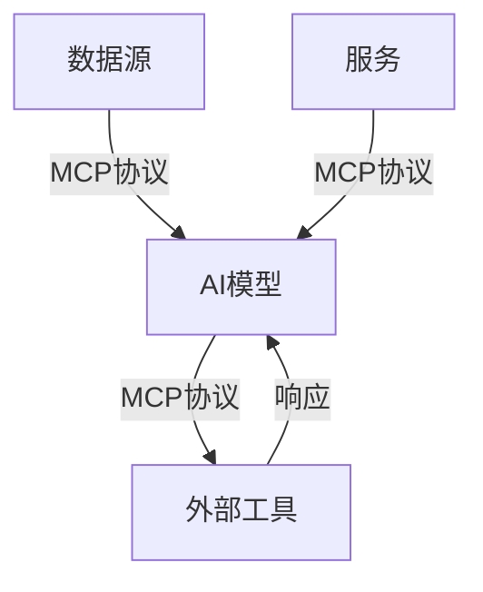
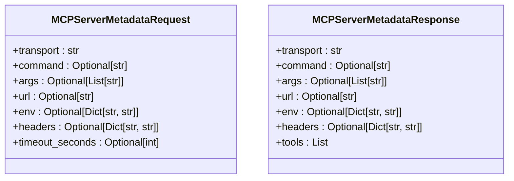
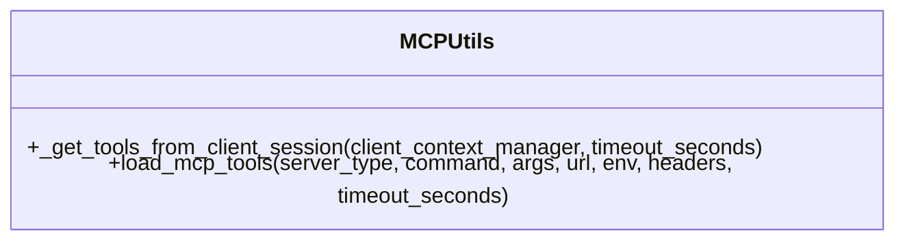
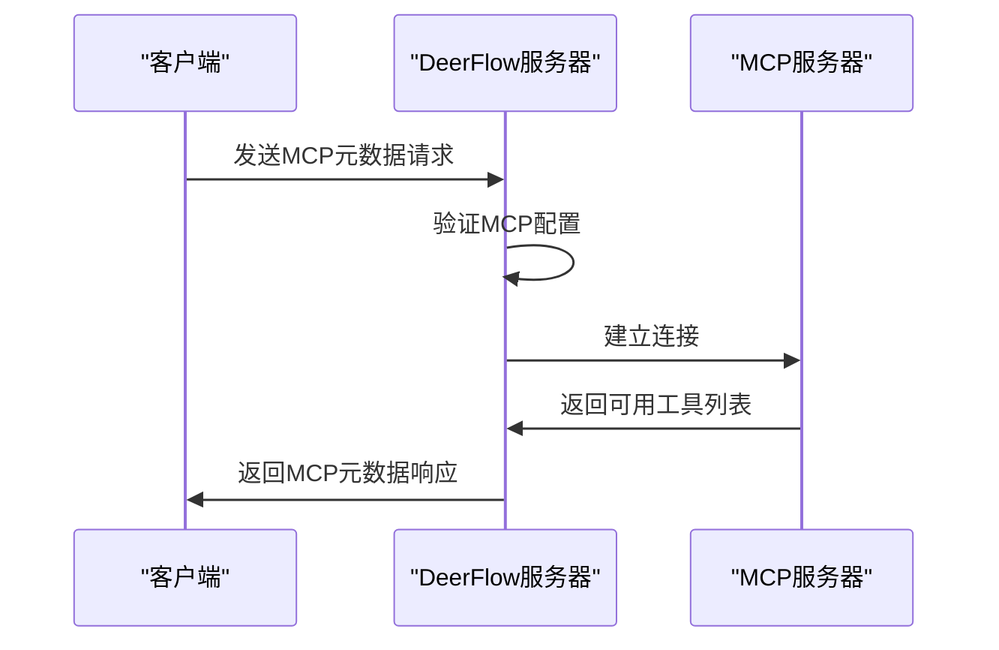
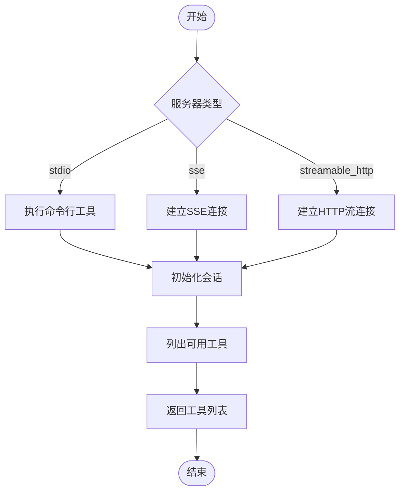
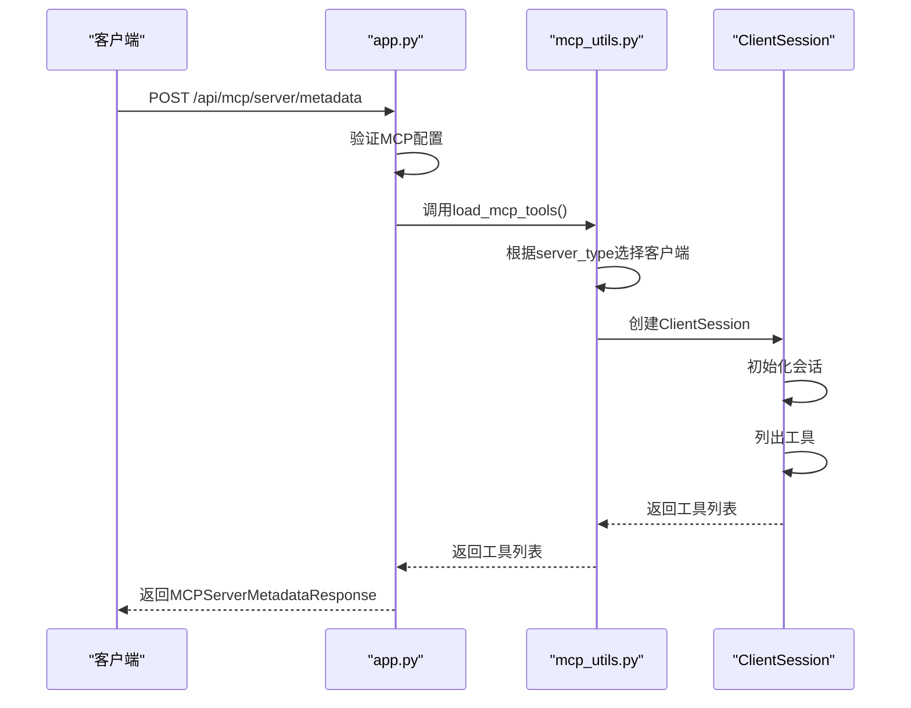
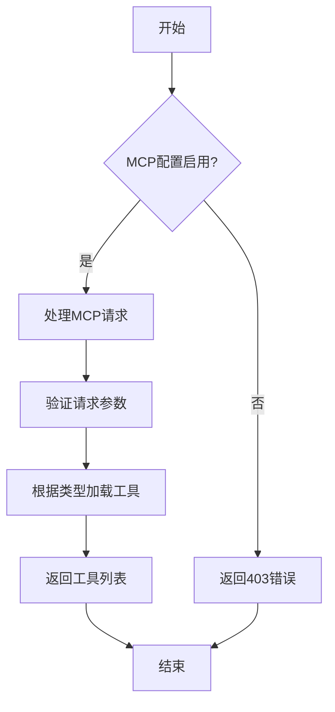
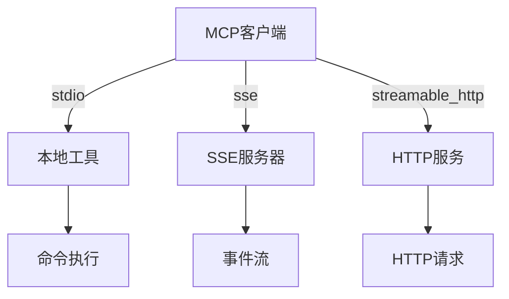
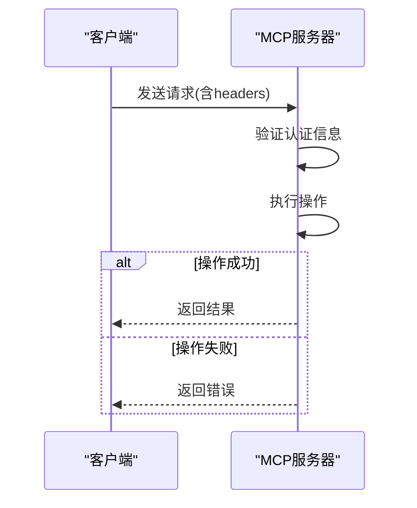

# MCP集成指南

<cite>
**本文档引用的文件**  
- [mcp_request.py](file://src/server/mcp_request.py)
- [mcp_utils.py](file://src/server/mcp_utils.py)
- [app.py](file://src/server/app.py)
- [schema.ts](file://web/src/core/mcp/schema.ts)
- [utils.ts](file://web/src/core/mcp/utils.ts)
- [conf.yaml](file://conf.yaml)
- [workflow.py](file://src/workflow.py)
</cite>

## 目录
1. [引言](#引言)
2. [MCP协议概述](#mcp协议概述)
3. [核心组件分析](#核心组件分析)
4. [动态工具发现机制](#动态工具发现机制)
5. [运行时加载流程](#运行时加载流程)
6. [跨服务通信架构](#跨服务通信架构)
7. [协议版本管理与错误处理](#协议版本管理与错误处理)
8. [认证授权机制](#认证授权机制)
9. [实际部署案例](#实际部署案例)
10. [最佳实践与优化建议](#最佳实践与优化建议)

## 引言
本指南详细阐述了DeerFlow系统中MCP（Model Control Protocol）协议的集成实现，重点介绍动态工具发现、运行时加载和跨服务通信机制。通过解析核心文件`mcp_request.py`中的请求处理流程和`mcp_utils.py`中的工具注册与发现逻辑，说明如何实现MCP服务器端点以支持外部工具接入，并确保与DeerFlow核心工作流的安全交互。

**Section sources**
- [mcp_request.py](file://src/server/mcp_request.py#L1-L65)
- [mcp_utils.py](file://src/server/mcp_utils.py#L1-L123)

## MCP协议概述
MCP（Model Context Protocol）是由Anthropic提出的开放标准，旨在标准化AI模型与外部数据源和工具的交互方式。在DeerFlow系统中，MCP作为通用接口，类似于"USB端口"，使AI模型能够无缝访问外部数据源和执行操作。

该协议通过标准化消息格式实现双向通信，使模型能够获取数据并触发其他系统的操作。MCP解决了AI系统孤立性的问题，通过提供统一的集成方式，促进了AI应用开发的可扩展性和效率。

**Diagram sources**
- [mcp_request.py](file://src/server/mcp_request.py#L1-L65)
- [mcp_utils.py](file://src/server/mcp_utils.py#L1-L123)

## 核心组件分析
DeerFlow系统中的MCP集成主要由以下几个核心组件构成：

### 请求处理组件
`mcp_request.py`文件定义了MCP服务器元数据的请求和响应模型，包括传输类型、命令、参数、URL、环境变量、HTTP头和超时设置等。

**Diagram sources**
- [mcp_request.py](file://src/server/mcp_request.py#L1-L65)

### 工具管理组件
`mcp_utils.py`文件提供了加载MCP工具的核心功能，包括从不同类型的服务器（stdio、sse、streamable_http）获取工具列表。

**Diagram sources**
- [mcp_utils.py](file://src/server/mcp_utils.py#L1-L123)

**Section sources**
- [mcp_request.py](file://src/server/mcp_request.py#L1-L65)
- [mcp_utils.py](file://src/server/mcp_utils.py#L1-L123)

## 动态工具发现机制
MCP的动态工具发现机制允许系统在运行时发现和集成外部工具，而无需预先配置。这一机制通过以下流程实现：

### 工具发现流程
1. 客户端发送MCP服务器元数据请求
2. 服务器验证MCP配置是否启用
3. 根据服务器类型（stdio、sse、streamable_http）建立连接
4. 初始化会话并列出可用工具
5. 返回工具列表给客户端

**Diagram sources**
- [mcp_request.py](file://src/server/mcp_request.py#L1-L65)
- [mcp_utils.py](file://src/server/mcp_utils.py#L1-L123)

### 工具注册与发现
在DeerFlow中，MCP工具通过`load_mcp_tools`函数进行注册和发现。该函数支持三种服务器类型：

- **stdio类型**：通过命令行执行工具
- **sse类型**：通过服务器发送事件（Server-Sent Events）通信
- **streamable_http类型**：通过可流式HTTP连接通信

**Diagram sources**
- [mcp_utils.py](file://src/server/mcp_utils.py#L1-L123)

**Section sources**
- [mcp_utils.py](file://src/server/mcp_utils.py#L1-L123)

## 运行时加载流程
MCP的运行时加载流程确保了外部工具能够在需要时被动态加载和使用。

### 加载流程分析
运行时加载流程从`mcp_server_metadata`端点开始，该端点处理MCP服务器元数据请求并返回可用工具列表。

**Diagram sources**
- [app.py](file://src/server/app.py#L301-L343)
- [mcp_utils.py](file://src/server/mcp_utils.py#L1-L123)

### 配置与环境变量
MCP的运行时加载依赖于环境变量配置，特别是`ENABLE_MCP_SERVER_CONFIGURATION`变量，用于控制MCP服务器配置的启用状态。

**Diagram sources**
- [app.py](file://src/server/app.py#L301-L343)

**Section sources**
- [app.py](file://src/server/app.py#L301-L343)
- [mcp_utils.py](file://src/server/mcp_utils.py#L1-L123)

## 跨服务通信架构
DeerFlow系统通过MCP实现了与外部服务的高效通信，支持多种传输协议。

### 通信协议支持
MCP支持三种主要的通信协议：

| 协议类型 | 描述 | 适用场景 |
|--------|------|--------|
| stdio | 标准输入输出 | 本地命令行工具 |
| sse | 服务器发送事件 | 实时数据流 |
| streamable_http | 可流式HTTP | Web服务集成 |

**Diagram sources**
- [mcp_utils.py](file://src/server/mcp_utils.py#L1-L123)

### 安全通信机制
为了确保跨服务通信的安全性，MCP实现了以下安全机制：

- 环境变量传递：通过`env`参数传递认证信息
- HTTP头支持：通过`headers`参数传递认证令牌
- 超时控制：通过`timeout_seconds`参数防止无限等待

**Diagram sources**
- [mcp_utils.py](file://src/server/mcp_utils.py#L1-L12