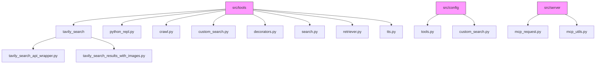
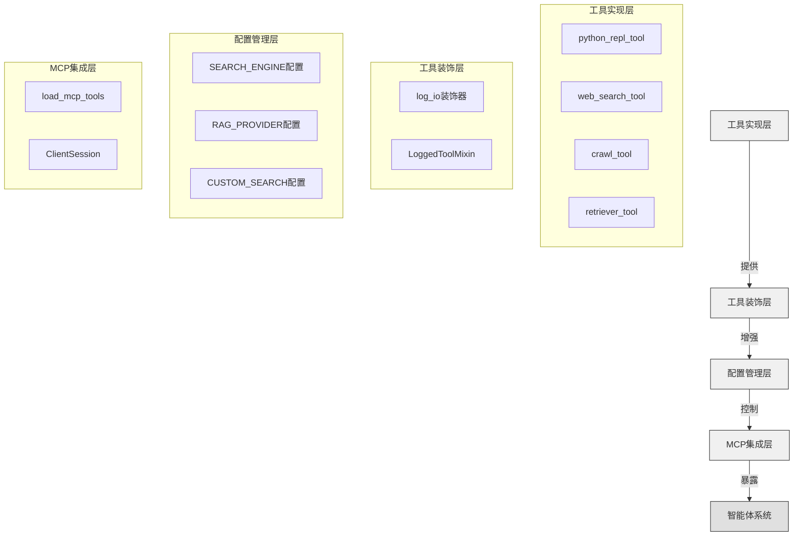
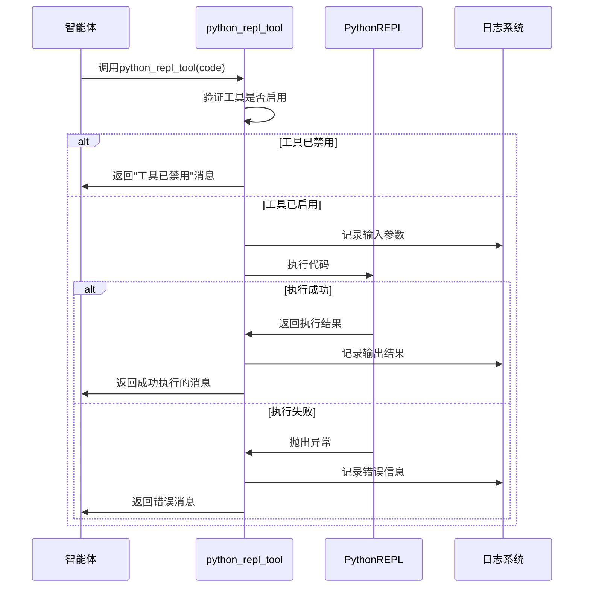
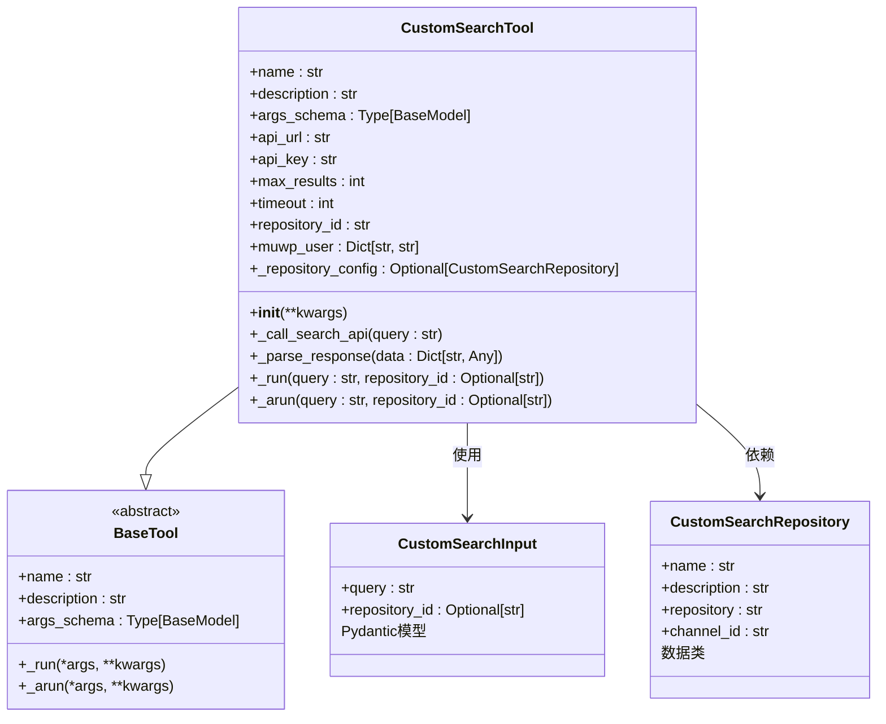
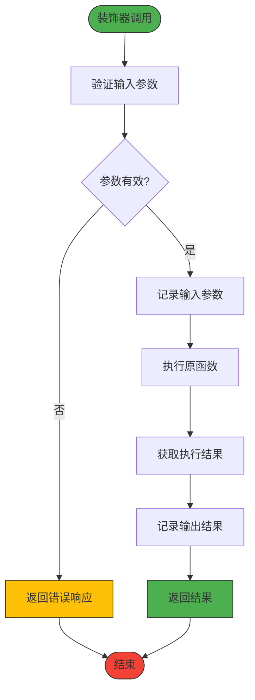
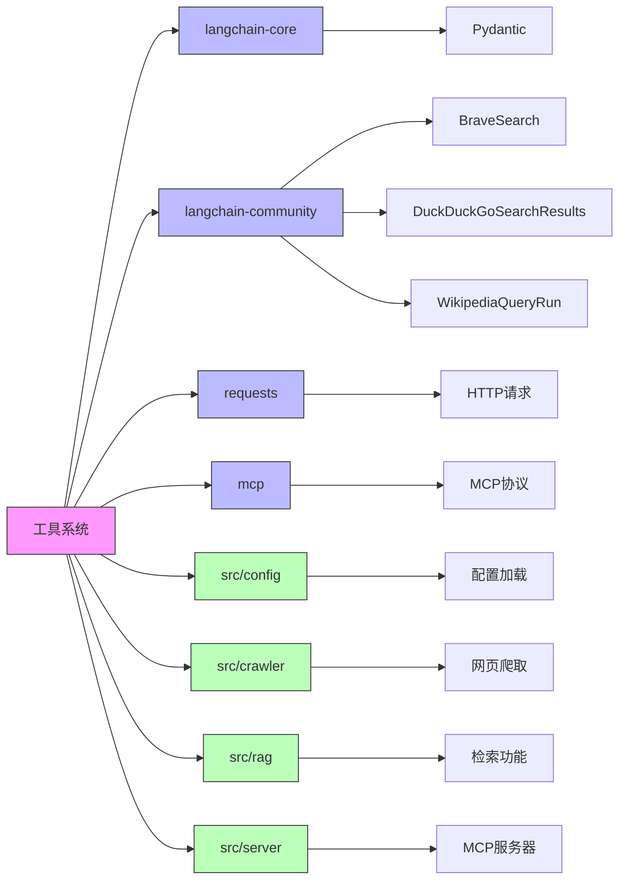

# 开发自定义工具

<cite>
**本文档中引用的文件**  
- [python_repl.py](file://src/tools/python_repl.py)
- [decorators.py](file://src/tools/decorators.py)
- [search.py](file://src/tools/search.py)
- [tavily_search_results_with_images.py](file://src/tools/tavily_search/tavily_search_results_with_images.py)
- [custom_search.py](file://src/tools/custom_search.py)
- [custom_search.py](file://src/config/custom_search.py)
- [mcp_request.py](file://src/server/mcp_request.py)
- [mcp_utils.py](file://src/server/mcp_utils.py)
- [crawl.py](file://src/tools/crawl.py)
- [retriever.py](file://src/tools/retriever.py)
- [tools.py](file://src/config/tools.py)
</cite>

## 目录
1. [简介](#简介)
2. [项目结构](#项目结构)
3. [核心组件](#核心组件)
4. [架构概述](#架构概述)
5. [详细组件分析](#详细组件分析)
6. [依赖分析](#依赖分析)
7. [性能考虑](#性能考虑)
8. [故障排除指南](#故障排除指南)
9. [结论](#结论)

## 简介
本文档提供了在DeerFlow系统中开发自定义工具的全面指南。基于现有工具（如`tavily_search`、`python_repl`）的实现模式，详细说明了如何定义新工具的输入参数、执行逻辑和异常处理机制。文档解释了工具如何通过MCP协议暴露给智能体系统，包括能力描述、参数校验和安全沙箱机制。同时涵盖了工具注册、发现和调用的底层机制，确保开发者理解工具与工作流引擎的集成方式，并提供了单元测试和集成测试的最佳实践。

## 项目结构
DeerFlow项目的工具系统主要位于`src/tools`目录下，采用模块化设计，每个工具或工具集都有独立的模块。工具配置通过`src/config`目录下的配置文件进行管理，支持环境变量和YAML配置文件的灵活配置。

**图示来源**
- [src/tools](file://src/tools)
- [src/config](file://src/config)
- [src/server](file://src/server)

**本节来源**
- [src/tools](file://src/tools)
- [src/config](file://src/config)
- [src/server](file://src/server)

## 核心组件
DeerFlow的工具系统由多个核心组件构成，包括工具定义、装饰器、配置管理和MCP集成。工具通过`langchain_core.tools`提供的`@tool`装饰器进行定义，支持输入参数的类型注解和描述。`decorators.py`模块提供了通用的装饰器功能，如输入输出日志记录。配置系统通过`src/config`目录下的模块实现，支持多种搜索引擎和RAG提供者的灵活切换。MCP服务器通过`mcp_utils.py`实现工具的动态加载和管理。

**本节来源**
- [python_repl.py](file://src/tools/python_repl.py#L1-L64)
- [decorators.py](file://src/tools/decorators.py#L1-L82)
- [tools.py](file://src/config/tools.py#L1-L32)

## 架构概述
DeerFlow的工具架构采用分层设计，从底层的工具实现到上层的MCP协议集成，形成了完整的工具生态系统。工具实现层负责具体的业务逻辑，如Python代码执行、网络搜索等。工具装饰层提供横切关注点的功能，如日志记录、性能监控等。配置管理层通过环境变量和YAML文件实现工具行为的动态配置。MCP集成层负责将本地工具暴露为MCP服务器的能力，实现与智能体系统的无缝集成。

**图示来源**
- [python_repl.py](file://src/tools/python_repl.py#L1-L64)
- [decorators.py](file://src/tools/decorators.py#L1-L82)
- [search.py](file://src/tools/search.py#L1-L114)
- [mcp_utils.py](file://src/server/mcp_utils.py#L1-L123)

## 详细组件分析

### Python REPL工具分析
Python REPL工具允许智能体执行Python代码进行数据分析和计算。该工具通过`@tool`装饰器定义，接受字符串形式的Python代码作为输入。工具实现中包含了详细的异常处理机制，能够捕获并返回执行过程中的错误信息。通过环境变量`ENABLE_PYTHON_REPL`控制工具的启用状态，增强了安全性。

**图示来源**
- [python_repl.py](file://src/tools/python_repl.py#L1-L64)

**本节来源**
- [python_repl.py](file://src/tools/python_repl.py#L1-L64)

### 自定义搜索工具分析
自定义搜索工具实现了与交通银行内部搜索API的集成，支持"边想边搜"功能。工具通过`CustomSearchTool`类实现，继承自`BaseTool`，并重写了`_run`方法。工具支持多种repository配置，可以通过`repository_id`参数动态切换搜索源。异常处理机制完善，能够处理网络请求失败、响应解析错误等各种异常情况。

**图示来源**
- [custom_search.py](file://src/tools/custom_search.py#L1-L295)
- [custom_search.py](file://src/config/custom_search.py#L1-L120)

**本节来源**
- [custom_search.py](file://src/tools/custom_search.py#L1-L295)
- [custom_search.py](file://src/config/custom_search.py#L1-L120)

### 工具装饰器分析
工具装饰器模块提供了通用的横切关注点功能，如输入输出日志记录。`log_io`装饰器通过`functools.wraps`实现，能够在不改变原函数行为的前提下，添加日志记录功能。`LoggedToolMixin`混入类提供了面向类的装饰功能，通过方法重写实现日志记录。`create_logged_tool`工厂函数能够为任何工具类创建带日志功能的版本。

**图示来源**
- [decorators.py](file://src/tools/decorators.py#L1-L82)

**本节来源**
- [decorators.py](file://src/tools/decorators.py#L1-L82)

## 依赖分析
DeerFlow工具系统依赖于多个外部库和内部模块。外部依赖包括`langchain-core`、`langchain-community`、`requests`等，提供了工具基础功能和HTTP客户端功能。内部依赖包括`src/config`、`src/crawler`、`src/rag`等模块，实现了配置管理、网页爬取和检索功能。MCP协议依赖`mcp`库，实现了与智能体系统的通信。

**图示来源**
- [python_repl.py](file://src/tools/python_repl.py#L1-L64)
- [search.py](file://src/tools/search.py#L1-L114)
- [custom_search.py](file://src/tools/custom_search.py#L1-L295)
- [mcp_utils.py](file://src/server/mcp_utils.py#L1-L123)

**本节来源**
- [python_repl.py](file://src/tools/python_repl.py#L1-L64)
- [search.py](file://src/tools/search.py#L1-L114)
- [custom_search.py](file://src/tools/custom_search.py#L1-L295)
- [mcp_utils.py](file://src/server/mcp_utils.py#L1-L123)

## 性能考虑
在开发自定义工具时，需要考虑多个性能因素。首先，工具的执行时间应尽可能短，避免阻塞智能体的决策流程。其次，网络请求应设置合理的超时时间，防止长时间等待。对于可能产生大量输出的工具，应考虑输出截断或分页机制。日志记录应使用适当的日志级别，避免产生过多的日志数据影响系统性能。

## 故障排除指南
当自定义工具出现问题时，可以按照以下步骤进行排查：首先检查环境变量配置是否正确，特别是API密钥和URL等敏感信息。其次查看日志输出，工具的输入输出都会被记录，有助于定位问题。对于网络请求相关的工具，可以使用`requests`库的调试功能查看HTTP请求和响应。最后，可以编写单元测试来验证工具的各个功能模块。

**本节来源**
- [python_repl.py](file://src/tools/python_repl.py#L1-L64)
- [custom_search.py](file://src/tools/custom_search.py#L1-L295)
- [mcp_utils.py](file://src/server/mcp_utils.py#L1-L123)

## 结论
DeerFlow的自定义工具开发框架提供了完整的工具创建、配置、集成和测试解决方案。通过遵循本文档中的模式和最佳实践，开发者可以快速创建安全、可靠、高性能的自定义工具，扩展智能体系统的能力。未来的工作可以包括工具性能监控、自动化测试框架和更丰富的错误处理机制。