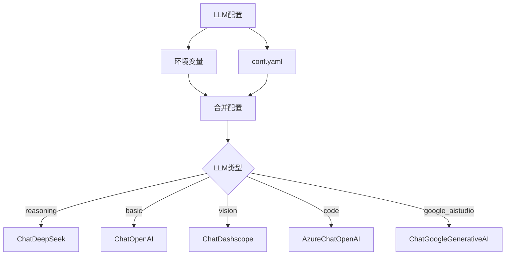
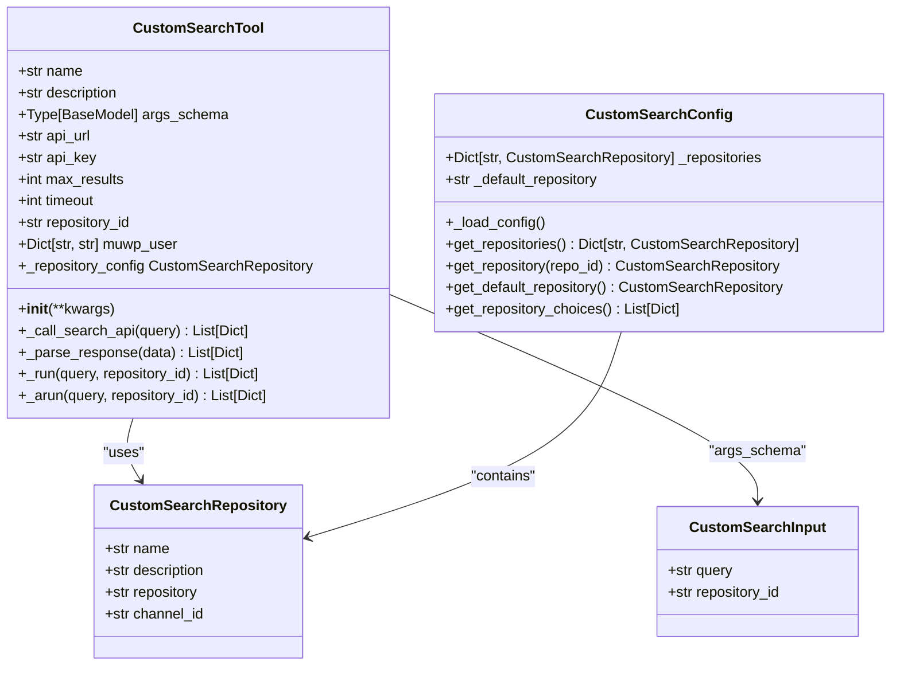

# 扩展与定制

<cite>
**本文档中引用的文件**  
- [agents.py](file://src/agents/agents.py)
- [builder.py](file://src/graph/builder.py)
- [llm.py](file://src/llms/llm.py)
- [dashscope.py](file://src/llms/providers/dashscope.py)
- [search.py](file://src/tools/search.py)
- [custom_search.py](file://src/tools/custom_search.py)
- [custom_search.py](file://src/config/custom_search.py)
- [mcp_request.py](file://src/server/mcp_request.py)
- [mcp_utils.py](file://src/server/mcp_utils.py)
- [conf.yaml](file://conf.yaml)
</cite>

## 目录
1. [简介](#简介)
2. [智能体扩展](#智能体扩展)
3. [LLM提供商集成](#llm提供商集成)
4. [自定义工具开发](#自定义工具开发)
5. [MCP集成](#mcp集成)
6. [版本兼容性与最佳实践](#版本兼容性与最佳实践)

## 简介
DeerFlow 是一个基于 LangGraph 构建的智能体工作流系统，支持灵活的扩展和定制。本指南详细介绍了如何通过修改核心组件来扩展系统功能，包括添加新智能体、集成新的LLM（大型语言模型）提供商、开发自定义工具以及集成MCP（Model Context Protocol）服务。系统采用模块化设计，通过配置文件和工厂模式实现组件的灵活替换和扩展，确保了系统的可维护性和可扩展性。

## 智能体扩展

DeerFlow 的智能体系统基于 `langgraph.prebuilt.create_react_agent` 工厂模式构建，通过 `agents.py` 文件中的 `create_agent` 函数统一创建。每个智能体由名称、类型、工具集和提示模板定义。智能体类型与LLM类型的映射关系在 `config/agents.py` 中通过 `AGENT_LLM_MAP` 字典进行配置。要添加新的智能体类型，开发者需要在 `agents.py` 中定义新的智能体配置，并在 `AGENT_LLM_MAP` 中指定其对应的LLM类型。智能体的行为逻辑由其关联的节点函数（如 `coordinator_node`, `planner_node` 等）实现，这些节点函数定义了智能体在工作流中的具体行为。

**Section sources**
- [agents.py](file://src/agents/agents.py#L1-L20)
- [agents.py](file://src/agents/agents.py#L1-L20)
- [config/agents.py](file://src/config/agents.py#L1-L21)

## LLM提供商集成

**Diagram sources**
- [llm.py](file://src/llms/llm.py#L1-L181)
- [dashscope.py](file://src/llms/providers/dashscope.py#L1-L322)

DeerFlow 的LLM集成通过 `llm.py` 文件中的 `get_llm_by_type` 函数实现。该函数根据LLM类型（如 "basic", "reasoning", "vision", "code"）从缓存中获取或创建相应的LLM实例。LLM的配置优先从环境变量读取，其次从 `conf.yaml` 配置文件读取。要集成新的LLM提供商，开发者需要在 `llms/providers` 目录下创建新的提供商模块（如 `dashscope.py`），该模块应继承自 `langchain_openai.ChatOpenAI` 或其他兼容的基类，并实现必要的适配逻辑。然后，在 `_create_llm_use_conf` 函数中添加对该提供商的实例化逻辑，通常通过检查配置中的 `base_url` 或 `platform` 字段来判断使用哪个提供商。

**Section sources**
- [llm.py](file://src/llms/llm.py#L1-L181)
- [dashscope.py](file://src/llms/providers/dashscope.py#L1-L322)

## 自定义工具开发

**Diagram sources**
- [custom_search.py](file://src/tools/custom_search.py#L1-L295)
- [custom_search.py](file://src/config/custom_search.py#L1-L120)

开发自定义工具需要在 `src/tools` 目录下创建新的工具模块。工具类必须继承自 `langchain_core.tools.BaseTool`，并实现 `_run` 和 `_arun` 方法。`CustomSearchTool` 是一个完整的示例，它封装了与交通银行内部搜索API的交互。该工具通过 `CustomSearchConfig` 从 `conf.yaml` 文件中加载多个repository的配置，允许在运行时动态选择数据源。工具的输入参数通过