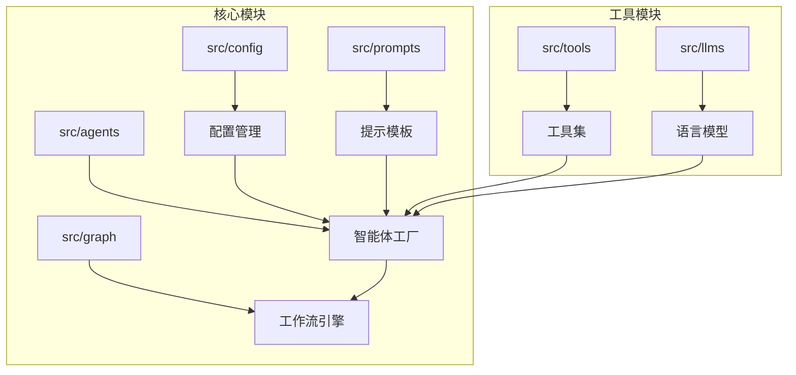
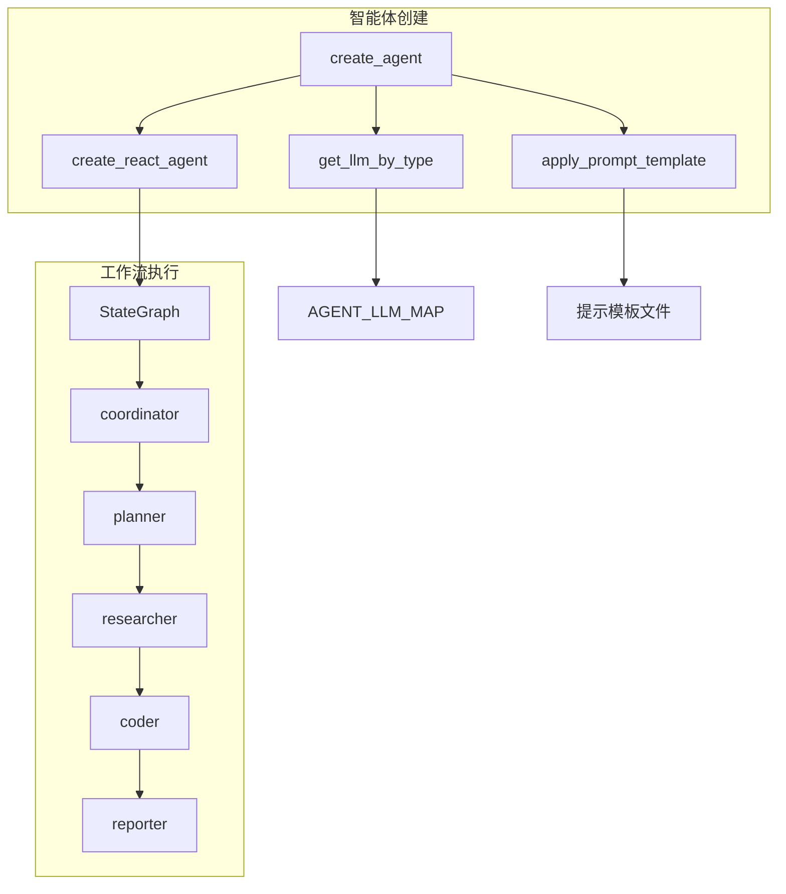
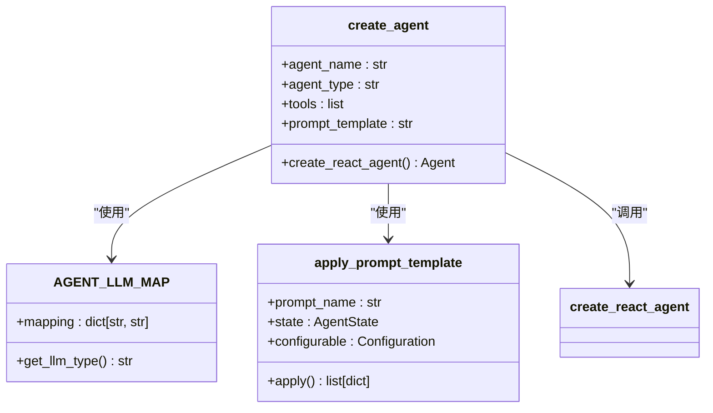
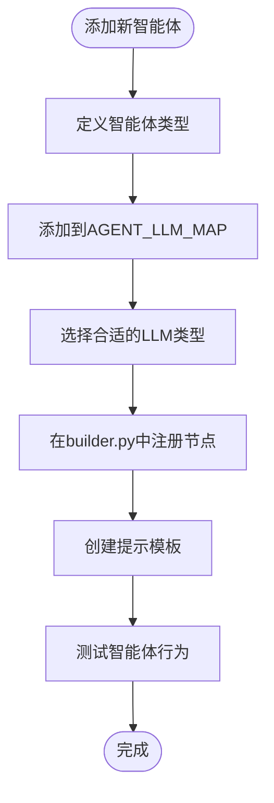
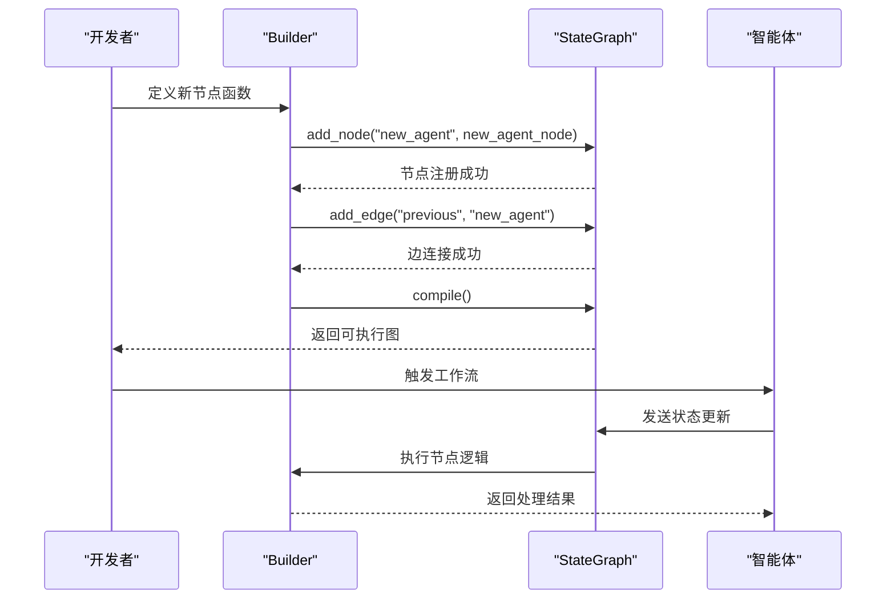
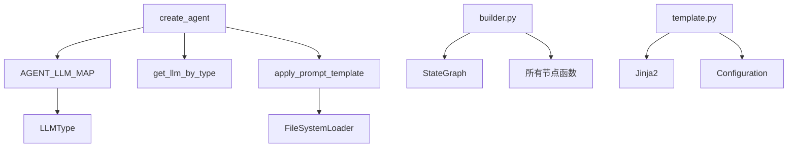

# 添加新智能体

<cite>
**本文档中引用的文件**
- [agents.py](file://src/agents/agents.py)
- [agents.py](file://src/config/agents.py)
- [builder.py](file://src/graph/builder.py)
- [template.py](file://src/prompts/template.py)
- [nodes.py](file://src/graph/nodes.py)
- [coordinator.md](file://src/prompts/coordinator.md)
- [planner.md](file://src/prompts/planner.md)
- [researcher.md](file://src/prompts/researcher.md)
- [coder.md](file://src/prompts/coder.md)
</cite>

## 目录
1. [简介](#简介)
2. [项目结构](#项目结构)
3. [核心组件](#核心组件)
4. [架构概述](#架构概述)
5. [详细组件分析](#详细组件分析)
6. [依赖分析](#依赖分析)
7. [性能考虑](#性能考虑)
8. [故障排除指南](#故障排除指南)
9. [结论](#结论)

## 简介
本文档提供了在DeerFlow中添加新智能体类型的完整指南。基于`create_agent`工厂函数的实现，详细解释了如何定义新的智能体名称、类型、工具集和提示模板。说明了`AGENT_LLM_MAP`配置映射的作用以及如何扩展它以支持新的智能体角色。提供了在`builder.py`中注册新节点并将其集成到状态图工作流中的完整流程。包括智能体行为测试方法和调试技巧，确保新智能体能正确参与多智能体协作。提供可复用的代码模板和最佳实践，如错误处理、状态管理以及与其他智能体的交互模式。

## 项目结构
DeerFlow项目的结构遵循模块化设计原则，将不同功能的组件分离到独立的目录中。智能体相关的核心代码位于`src/agents`、`src/config`、`src/graph`和`src/prompts`目录中。`src/agents`包含智能体创建工厂函数，`src/config`管理智能体与LLM的映射关系，`src/graph`定义了工作流的状态图和节点，`src/prompts`存储了各个智能体的提示模板。

**Diagram sources**
- [src/agents/agents.py](file://src/agents/agents.py)
- [src/config/agents.py](file://src/config/agents.py)
- [src/graph/builder.py](file://src/graph/builder.py)

**Section sources**
- [src/agents/agents.py](file://src/agents/agents.py)
- [src/config/agents.py](file://src/config/agents.py)
- [src/graph/builder.py](file://src/graph/builder.py)
- [src/prompts/template.py](file://src/prompts/template.py)

## 核心组件
DeerFlow的核心组件包括智能体工厂、配置映射、状态图构建器和提示模板系统。`create_agent`工厂函数是创建所有智能体的统一入口，它接收智能体名称、类型、工具列表和提示模板名称作为参数，并返回配置好的智能体实例。`AGENT_LLM_MAP`配置映射定义了不同智能体类型与底层语言模型之间的对应关系，允许根据智能体的角色选择合适的LLM。状态图构建器负责定义智能体之间的协作流程，通过条件边和节点连接实现复杂的多智能体工作流。

**Section sources**
- [src/agents/agents.py](file://src/agents/agents.py#L15-L20)
- [src/config/agents.py](file://src/config/agents.py#L10-L20)
- [src/graph/builder.py](file://src/graph/builder.py#L10-L20)

## 架构概述
DeerFlow采用基于状态图的多智能体架构，其中各个智能体作为独立的节点参与协作。系统通过`StateGraph`定义工作流，智能体节点之间通过预定义的边进行通信。`create_agent`工厂函数使用`langgraph.prebuilt.create_react_agent`创建具体的智能体实例，这些实例被注册到状态图中。智能体的行为由其提示模板驱动，提示模板使用Jinja2模板引擎动态生成，包含当前状态和配置信息。

**Diagram sources**
- [src/agents/agents.py](file://src/agents/agents.py#L1-L20)
- [src/config/agents.py](file://src/config/agents.py#L1-L20)
- [src/graph/builder.py](file://src/graph/builder.py#L1-L20)

## 详细组件分析
### 智能体创建工厂分析
`create_agent`工厂函数是添加新智能体的核心。它通过统一的接口创建智能体实例，确保所有智能体具有一致的配置和行为模式。函数接收四个参数：`agent_name`（智能体名称）、`agent_type`（智能体类型）、`tools`（工具列表）和`prompt_template`（提示模板名称）。工厂函数使用`AGENT_LLM_MAP`查找对应类型的LLM，并通过`apply_prompt_template`函数将提示模板应用于当前状态。

#### 对象导向组件：

**Diagram sources**
- [src/agents/agents.py](file://src/agents/agents.py#L15-L20)
- [src/config/agents.py](file://src/config/agents.py#L15-L20)
- [src/prompts/template.py](file://src/prompts/template.py#L50-L70)

### 配置映射分析
`AGENT_LLM_MAP`配置映射是智能体类型与LLM之间的桥梁。它定义了一个字典，将智能体角色（如"coordinator"、"planner"）映射到特定的LLM类型（如"basic"、"reasoning"）。当添加新智能体时，必须在`AGENT_LLM_MAP`中为其指定合适的LLM类型。这种设计允许系统根据智能体的复杂性选择不同能力的模型，例如将需要复杂推理的智能体分配给"reasoning"类型的LLM。

#### 流程图：

**Diagram sources**
- [src/config/agents.py](file://src/config/agents.py#L10-L20)
- [src/graph/builder.py](file://src/graph/builder.py#L10-L20)
- [src/prompts/template.py](file://src/prompts/template.py#L10-L20)

### 状态图集成分析
在`builder.py`中注册新智能体节点是将其集成到工作流的关键步骤。`_build_base_graph`函数创建了状态图的基本结构，通过`add_node`方法添加新的智能体节点，并使用`add_edge`或`add_conditional_edges`定义节点间的连接。新智能体必须有一个唯一的节点名称，并关联到相应的处理函数。条件边允许根据当前状态动态决定下一个执行的节点，实现复杂的决策逻辑。

#### 序列图：

**Diagram sources**
- [src/graph/builder.py](file://src/graph/builder.py#L50-L80)
- [src/graph/nodes.py](file://src/graph/nodes.py#L1-L20)

## 依赖分析
DeerFlow的组件之间存在明确的依赖关系。`create_agent`工厂函数依赖于`AGENT_LLM_MAP`配置、`get_llm_by_type`函数和`apply_prompt_template`函数。状态图构建器依赖于所有智能体节点函数和状态类型定义。提示模板系统依赖于Jinja2模板引擎和配置管理模块。这些依赖关系通过Python的import机制实现，确保了组件间的松耦合和高内聚。

**Diagram sources**
- [src/agents/agents.py](file://src/agents/agents.py)
- [src/config/agents.py](file://src/config/agents.py)
- [src/graph/builder.py](file://src/graph/builder.py)
- [src/prompts/template.py](file://src/prompts/template.py)

**Section sources**
- [src/agents/agents.py](file://src/agents/agents.py)
- [src/config/agents.py](file://src/config/agents.py)
- [src/graph/builder.py](file://src/graph/builder.py)
- [src/prompts/template.py](file://src/prompts/template.py)

## 性能考虑
在添加新智能体时，需要考虑其对系统性能的影响。每个新智能体都会增加状态图的复杂性，可能影响工作流的执行效率。建议为新智能体选择合适的LLM类型，避免不必要的计算开销。提示模板的设计应尽量简洁，减少LLM的推理负担。工具集的配置应遵循最小权限原则，只授予智能体完成任务所必需的工具，以降低安全风险和资源消耗。

## 故障排除指南
当新智能体无法正常工作时，可以按照以下步骤进行调试：首先检查`AGENT_LLM_MAP`中是否正确配置了智能体类型；其次验证提示模板文件是否存在且语法正确；然后确认节点函数已在`builder.py`中正确注册；最后检查工具集是否正确配置。日志记录是调试的重要工具，可以通过查看`logger.info`输出来跟踪智能体的执行流程和状态变化。

**Section sources**
- [src/agents/agents.py](file://src/agents/agents.py#L10-L20)
- [src/config/agents.py](file://src/config/agents.py#L10-L20)
- [src/graph/builder.py](file://src/graph/builder.py#L10-L20)
- [src/graph/nodes.py](file://src/graph/nodes.py#L10-L20)

## 结论
通过遵循本文档的指南，开发者可以成功地在DeerFlow中添加新的智能体类型。关键步骤包括：使用`create_agent`工厂函数定义智能体，扩展`AGENT_LLM_MAP`配置映射，创建相应的提示模板，在`builder.py`中注册新节点，并将其集成到状态图工作流中。遵循最佳实践，如合理的错误处理、有效的状态管理和清晰的交互模式，可以确保新智能体稳定可靠地参与多智能体协作。