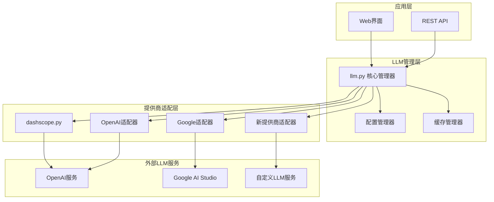
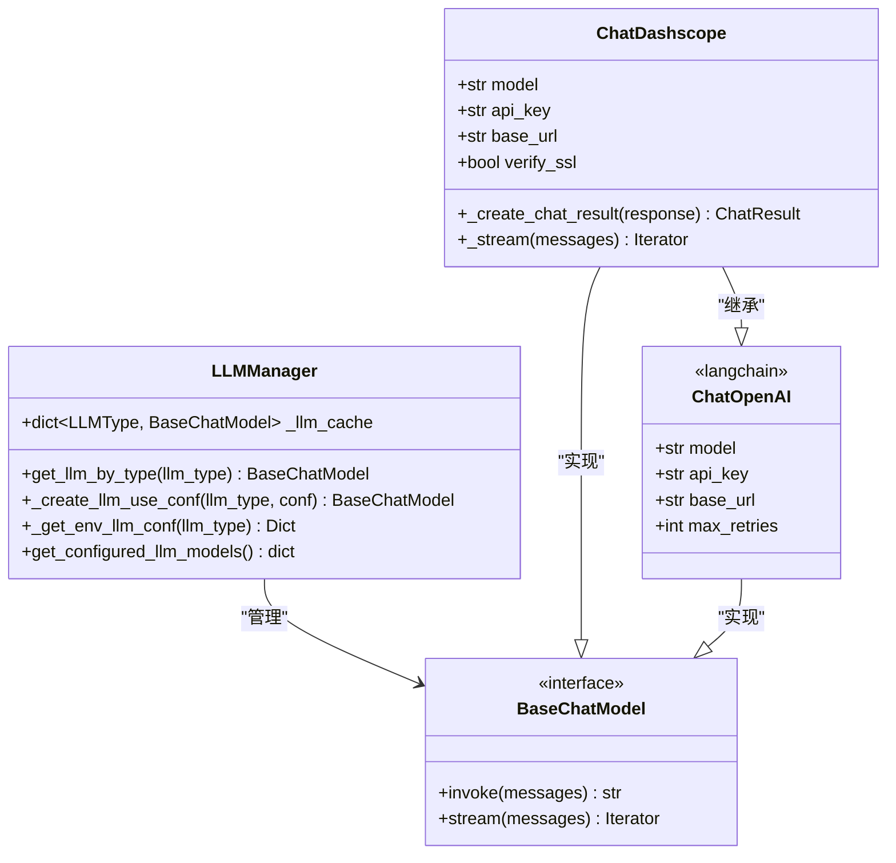
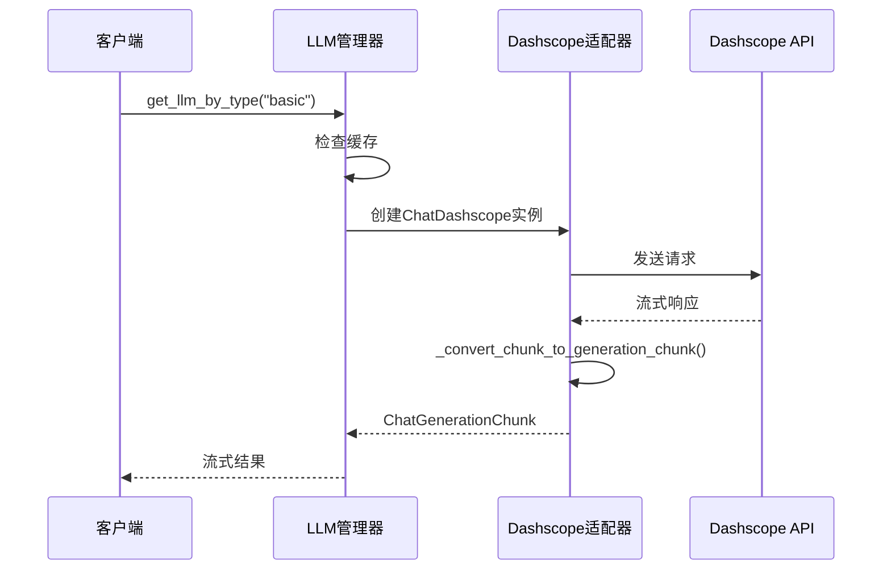
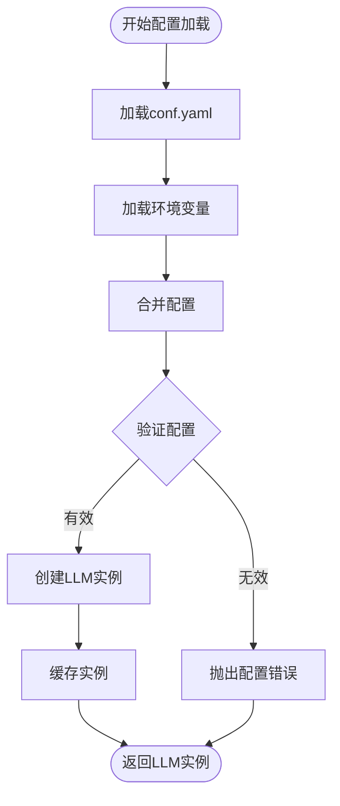

# 集成新的LLM提供商技术指南

<cite>
**本文档引用的文件**
- [src/llms/llm.py](file://src/llms/llm.py)
- [src/llms/providers/dashscope.py](file://src/llms/providers/dashscope.py)
- [src/llms/__init__.py](file://src/llms/__init__.py)
- [src/config/agents.py](file://src/config/agents.py)
- [src/config/configuration.py](file://src/config/configuration.py)
- [conf.yaml](file://conf.yaml)
- [docs/configuration_guide.md](file://docs/configuration_guide.md)
- [tests/unit/llms/test_llm.py](file://tests/unit/llms/test_llm.py)
- [tests/unit/llms/test_dashscope.py](file://tests/unit/llms/test_dashscope.py)
</cite>

## 目录
1. [简介](#简介)
2. [项目架构概览](#项目架构概览)
3. [核心组件分析](#核心组件分析)
4. [提供商适配器开发指南](#提供商适配器开发指南)
5. [配置系统集成](#配置系统集成)
6. [错误处理与生产级特性](#错误处理与生产级特性)
7. [测试验证流程](#测试验证流程)
8. [性能优化建议](#性能优化建议)
9. [故障排除指南](#故障排除指南)
10. [总结](#总结)

## 简介

DeerFlow是一个现代化的AI工作流平台，支持多种LLM提供商的无缝集成。本指南详细介绍了如何为新的LLM提供商创建适配器，包括认证机制、API端点封装、响应格式解析等关键技术实现。

该系统采用统一的LLM抽象层，通过`get_llm_by_type`函数管理不同类型的LLM实例（基础模型、推理模型、视觉模型、代码模型），并提供了完整的配置管理系统和测试框架。

## 项目架构概览



**图表来源**
- [src/llms/llm.py](file://src/llms/llm.py#L1-L181)
- [src/llms/providers/dashscope.py](file://src/llms/providers/dashscope.py#L1-L322)

**章节来源**
- [src/llms/llm.py](file://src/llms/llm.py#L1-L181)
- [src/llms/__init__.py](file://src/llms/__init__.py#L1-L3)

## 核心组件分析

### LLM类型定义

系统支持四种主要的LLM类型：

```python
LLMType = Literal["basic", "reasoning", "vision", "code"]
```

每种类型对应不同的使用场景：
- **basic**: 基础对话模型
- **reasoning**: 推理增强模型
- **vision**: 视觉理解模型  
- **code**: 代码生成模型

### 核心管理器架构



**图表来源**
- [src/llms/llm.py](file://src/llms/llm.py#L15-L181)
- [src/llms/providers/dashscope.py](file://src/llms/providers/dashscope.py#L280-L322)

**章节来源**
- [src/llms/llm.py](file://src/llms/llm.py#L15-L181)
- [src/config/agents.py](file://src/config/agents.py#L1-L21)

## 提供商适配器开发指南

### 创建新的提供商适配器

#### 1. 文件结构要求

在`src/llms/providers/`目录下创建新的Python文件，例如`new_provider.py`：

```python
# Copyright (c) 2025 Your Company
# SPDX-License-Identifier: MIT

from typing import Any, Dict, Iterator, List, Optional
from langchain_core.language_models import BaseChatModel
from langchain_core.messages import BaseMessage, BaseMessageChunk
from langchain_core.outputs import ChatResult, ChatGenerationChunk

class ChatNewProvider(BaseChatModel):
    """New Provider LLM适配器"""
    
    def __init__(self, **kwargs):
        super().__init__(**kwargs)
        # 初始化提供商特定的配置
        self.api_key = kwargs.get('api_key')
        self.base_url = kwargs.get('base_url', 'https://api.newprovider.com/v1')
        self.model = kwargs.get('model')
        
    def _generate(self, messages: List[BaseMessage], **kwargs: Any) -> ChatResult:
        """同步生成响应"""
        # 实现具体的API调用逻辑
        pass
        
    def _stream(self, messages: List[BaseMessage], **kwargs: Any) -> Iterator[ChatGenerationChunk]:
        """流式生成响应"""
        # 实现流式响应处理
        pass
```

#### 2. 继承标准接口

新适配器必须继承`BaseChatModel`或其子类，并实现以下关键方法：

```python
def _generate(self, messages: List[BaseMessage], **kwargs: Any) -> ChatResult:
    """同步生成响应"""
    # 1. 构建请求参数
    # 2. 发送HTTP请求
    # 3. 解析响应
    # 4. 返回ChatResult对象
    pass

def _stream(self, messages: List[BaseMessage], **kwargs: Any) -> Iterator[ChatGenerationChunk]:
    """流式生成响应"""
    # 1. 设置流式模式
    # 2. 处理流式数据块
    # 3. 转换为ChatGenerationChunk
    # 4. 逐个yield结果
    pass
```

#### 3. 响应格式转换

实现消息格式转换函数：

```python
def _convert_response_to_message(self, response_data: Dict) -> BaseMessage:
    """将提供商响应转换为LangChain消息格式"""
    content = response_data.get('content', '')
    role = response_data.get('role', 'assistant')
    
    if role == 'assistant':
        return AIMessage(content=content)
    elif role == 'user':
        return HumanMessage(content=content)
    else:
        return SystemMessage(content=content)
```

#### 4. 错误处理机制

实现统一的错误处理：

```python
def _handle_provider_errors(self, error: Exception) -> None:
    """处理提供商特定的错误"""
    if isinstance(error, HTTPError):
        if error.response.status_code == 401:
            raise AuthenticationError("API key无效")
        elif error.response.status_code == 429:
            raise RateLimitError("请求频率过高")
        elif error.response.status_code >= 500:
            raise ServiceUnavailableError("服务暂时不可用")
    else:
        raise ProviderError(f"提供商错误: {str(error)}")
```

### 示例：Dashscope适配器分析

Dashscope适配器展示了完整的实现模式：



**图表来源**
- [src/llms/providers/dashscope.py](file://src/llms/providers/dashscope.py#L280-L322)
- [src/llms/llm.py](file://src/llms/llm.py#L15-L181)

**章节来源**
- [src/llms/providers/dashscope.py](file://src/llms/providers/dashscope.py#L1-L322)

## 配置系统集成

### 配置文件结构

LLM配置通过YAML文件进行管理：

```yaml
BASIC_MODEL:
  base_url: "https://api.newprovider.com/v1"
  model: "your-model-name"
  api_key: "your-api-key"
  max_retries: 3
  verify_ssl: true
  temperature: 0.7
  top_p: 0.9

REASONING_MODEL:
  base_url: "https://api.newprovider.com/v1"
  model: "your-reasoning-model"
  api_key: "your-api-key"
  extra_body:
    enable_thinking: true
```

### 环境变量优先级

系统支持环境变量覆盖配置文件设置：

```python
def _get_env_llm_conf(llm_type: str) -> Dict[str, Any]:
    """从环境变量获取LLM配置"""
    prefix = f"{llm_type.upper()}_MODEL__"
    conf = {}
    for key, value in os.environ.items():
        if key.startswith(prefix):
            conf_key = key[len(prefix):].lower()
            conf[conf_key] = value
    return conf
```

### 动态配置加载



**图表来源**
- [src/llms/llm.py](file://src/llms/llm.py#L30-L120)

**章节来源**
- [src/llms/llm.py](file://src/llms/llm.py#L30-L120)
- [conf.yaml](file://conf.yaml#L1-L69)

## 错误处理与生产级特性

### 连接池管理

实现HTTP客户端连接池：

```python
import httpx
from typing import Optional

class ChatNewProvider(BaseChatModel):
    def __init__(self, **kwargs):
        super().__init__(**kwargs)
        self._setup_http_clients(kwargs.get('max_retries', 3))
    
    def _setup_http_clients(self, max_retries: int):
        """设置HTTP客户端连接池"""
        timeout = httpx.Timeout(
            connect=10.0,
            read=60.0,
            write=10.0,
            pool=5.0
        )
        
        limits = httpx.Limits(
            max_keepalive_connections=10,
            max_connections=20,
            keepalive_expiry=30.0
        )
        
        self.http_client = httpx.Client(
            timeout=timeout,
            limits=limits,
            verify=self.verify_ssl
        )
        
        self.http_async_client = httpx.AsyncClient(
            timeout=timeout,
            limits=limits,
            verify=self.verify_ssl
        )
```

### 超时控制

```python
def _generate_with_timeout(self, messages: List[BaseMessage], timeout: float = 30.0) -> ChatResult:
    """带超时控制的生成方法"""
    try:
        with httpx.Client(timeout=httpx.Timeout(timeout)) as client:
            response = client.post(
                f"{self.base_url}/chat/completions",
                headers={"Authorization": f"Bearer {self.api_key}"},
                json=self._prepare_request(messages)
            )
            response.raise_for_status()
            return self._parse_response(response.json())
    except httpx.TimeoutException:
        raise TimeoutError(f"请求超时 ({timeout}秒)")
    except httpx.RequestError as e:
        raise ProviderError(f"网络请求失败: {str(e)}")
```

### 重试机制

```python
def _retry_on_failure(func):
    """重试装饰器"""
    def wrapper(*args, **kwargs):
        max_attempts = kwargs.pop('max_retries', 3)
        delay = kwargs.pop('retry_delay', 1.0)
        
        for attempt in range(max_attempts):
            try:
                return func(*args, **kwargs)
            except RateLimitError:
                if attempt == max_attempts - 1:
                    raise
                time.sleep(delay * (2 ** attempt))  # 指数退避
            except ServiceUnavailableError:
                if attempt == max_attempts - 1:
                    raise
                time.sleep(delay)
        return None
    return wrapper
```

### SSL证书验证

```python
def _create_llm_use_conf(llm_type: LLMType, conf: Dict[str, Any]) -> BaseChatModel:
    """创建LLM实例，支持SSL配置"""
    merged_conf = {**llm_conf, **env_conf}
    
    # 处理SSL验证设置
    verify_ssl = merged_conf.pop("verify_ssl", True)
    
    if not verify_ssl:
        http_client = httpx.Client(verify=False)
        http_async_client = httpx.AsyncClient(verify=False)
        merged_conf["http_client"] = http_client
        merged_conf["http_async_client"] = http_async_client
    
    return ChatNewProvider(**merged_conf)
```

**章节来源**
- [src/llms/llm.py](file://src/llms/llm.py#L70-L120)

## 测试验证流程

### 单元测试框架

```python
import pytest
from unittest.mock import Mock, patch
from src.llms.providers.new_provider import ChatNewProvider

class TestNewProvider:
    @pytest.fixture
    def provider_instance(self):
        return ChatNewProvider(
            api_key="test_key",
            base_url="https://api.test.com/v1",
            model="test-model"
        )
    
    def test_sync_generation(self, provider_instance):
        """测试同步生成"""
        messages = [HumanMessage(content="Hello")]
        
        with patch.object(provider_instance, '_generate') as mock_generate:
            mock_generate.return_value = Mock()
            result = provider_instance.invoke(messages)
            
            assert result is not None
            mock_generate.assert_called_once_with(messages)
    
    def test_streaming(self, provider_instance):
        """测试流式生成"""
        messages = [HumanMessage(content="Hello")]
        
        with patch.object(provider_instance, '_stream') as mock_stream:
            mock_stream.return_value = iter([
                ChatGenerationChunk(message=AIMessageChunk(content="Hello")),
                ChatGenerationChunk(message=AIMessageChunk(content=" World"))
            ])
            
            chunks = list(provider_instance.stream(messages))
            assert len(chunks) == 2
            assert chunks[0].message.content == "Hello"
            assert chunks[1].message.content == " World"
```

### 集成测试

```python
def test_provider_integration(monkeypatch):
    """测试提供商集成"""
    # 模拟API响应
    mock_response = {
        'choices': [{
            'message': {
                'role': 'assistant',
                'content': 'Test response'
            }
        }],
        'usage': {
            'prompt_tokens': 10,
            'completion_tokens': 20,
            'total_tokens': 30
        }
    }
    
    # 替换实际的HTTP客户端
    with patch('httpx.Client.post') as mock_post:
        mock_post.return_value.json.return_value = mock_response
        
        # 测试LLM实例创建
        llm = get_llm_by_type("basic")
        
        # 测试调用
        result = llm.invoke([HumanMessage(content="Test")])
        
        assert "Test response" in result
```

### 性能测试

```python
import time
import statistics

def test_performance_metrics():
    """测试性能指标"""
    llm = get_llm_by_type("basic")
    messages = [HumanMessage(content="Hello, world!")]
    
    # 测量响应时间
    latencies = []
    for _ in range(10):
        start_time = time.time()
        llm.invoke(messages)
        latency = time.time() - start_time
        latencies.append(latency)
    
    avg_latency = statistics.mean(latencies)
    p95_latency = sorted(latencies)[int(len(latencies) * 0.95)]
    
    assert avg_latency < 5.0  # 平均响应时间小于5秒
    assert p95_latency < 10.0  # 95百分位响应时间小于10秒
```

**章节来源**
- [tests/unit/llms/test_llm.py](file://tests/unit/llms/test_llm.py#L1-L88)
- [tests/unit/llms/test_dashscope.py](file://tests/unit/llms/test_dashscope.py#L1-L308)

## 性能优化建议

### 连接池优化

```python
class OptimizedChatProvider(BaseChatModel):
    def __init__(self, **kwargs):
        super().__init__(**kwargs)
        
        # 优化连接池配置
        limits = httpx.Limits(
            max_keepalive_connections=20,
            max_connections=50,
            keepalive_expiry=60.0
        )
        
        self.http_client = httpx.Client(
            limits=limits,
            timeout=httpx.Timeout(
                connect=5.0,
                read=30.0,
                write=5.0,
                pool=10.0
            ),
            event_hooks={
                'request': [self._log_request],
                'response': [self._log_response]
            }
        )
```

### 缓存策略

```python
from functools import lru_cache
from typing import Tuple

class CachedChatProvider(BaseChatModel):
    @lru_cache(maxsize=128)
    def _cached_invoke(self, messages_hash: Tuple[str], **kwargs) -> str:
        """缓存常用请求的结果"""
        return self._invoke_without_cache(messages_hash, **kwargs)
    
    def invoke(self, messages: List[BaseMessage], **kwargs) -> str:
        # 生成消息的哈希值用于缓存
        messages_hash = tuple(
            f"{msg.type}:{msg.content[:100]}" for msg in messages
        )
        
        return self._cached_invoke(messages_hash, **kwargs)
```

### 异步处理

```python
async def async_batch_processing(self, requests: List[List[BaseMessage]]) -> List[str]:
    """异步批量处理请求"""
    async with httpx.AsyncClient(limits=self.limits) as client:
        tasks = [
            self._async_process_request(client, messages)
            for messages in requests
        ]
        results = await asyncio.gather(*tasks, return_exceptions=True)
        return results
```

### 内存管理

```python
import gc
from contextlib import contextmanager

@contextmanager
def memory_monitor():
    """内存监控上下文管理器"""
    initial_memory = psutil.Process().memory_info().rss
    try:
        yield
    finally:
        gc.collect()
        final_memory = psutil.Process().memory_info().rss
        memory_used = (final_memory - initial_memory) / 1024 / 1024
        if memory_used > 100:  # 超过100MB
            logger.warning(f"内存使用过多: {memory_used:.2f}MB")
```

## 故障排除指南

### 常见问题诊断

#### 1. 认证失败

```python
def diagnose_auth_issues():
    """诊断认证问题"""
    issues = []
    
    # 检查API密钥
    api_key = os.getenv("BASIC_MODEL__API_KEY")
    if not api_key or api_key == "YOUR_API_KEY":
        issues.append("API密钥未设置或为默认值")
    
    # 检查网络连接
    try:
        response = httpx.get("https://api.newprovider.com/health")
        if response.status_code != 200:
            issues.append(f"API健康检查失败: {response.status_code}")
    except Exception as e:
        issues.append(f"网络连接失败: {str(e)}")
    
    return issues
```

#### 2. 超时问题

```python
def diagnose_timeout_issues():
    """诊断超时问题"""
    import socket
    
    issues = []
    
    # 测试DNS解析
    try:
        socket.gethostbyname("api.newprovider.com")
    except socket.gaierror:
        issues.append("DNS解析失败")
    
    # 测试端口连通性
    try:
        sock = socket.socket(socket.AF_INET, socket.SOCK_STREAM)
        sock.settimeout(5)
        result = sock.connect_ex(("api.newprovider.com", 443))
        if result != 0:
            issues.append(f"HTTPS端口连接失败: {result}")
        sock.close()
    except Exception as e:
        issues.append(f"网络测试失败: {str(e)}")
    
    return issues
```

#### 3. 配置验证

```python
def validate_provider_config():
    """验证提供商配置"""
    try:
        llm = get_llm_by_type("basic")
        test_message = [HumanMessage(content="Hello")]
        result = llm.invoke(test_message)
        
        if not result:
            return "配置正确但无法正常响应"
        return "配置验证成功"
        
    except Exception as e:
        return f"配置验证失败: {str(e)}"
```

### 日志记录

```python
import logging
from datetime import datetime

class ProviderLogger:
    def __init__(self):
        self.logger = logging.getLogger("provider")
        handler = logging.FileHandler("provider.log")
        formatter = logging.Formatter(
            '%(asctime)s - %(name)s - %(levelname)s - %(message)s'
        )
        handler.setFormatter(formatter)
        self.logger.addHandler(handler)
    
    def log_request(self, provider: str, endpoint: str, duration: float):
        self.logger.info(f"{provider} API请求: {endpoint} ({duration:.2f}s)")
    
    def log_error(self, provider: str, error: Exception):
        self.logger.error(f"{provider} API错误: {str(error)}")
    
    def log_cache_hit(self, provider: str, cache_type: str):
        self.logger.debug(f"{provider} 缓存命中: {cache_type}")
```

**章节来源**
- [src/llms/llm.py](file://src/llms/llm.py#L150-L181)

## 总结

本指南详细介绍了如何在DeerFlow系统中集成新的LLM提供商。通过遵循这些最佳实践，开发者可以：

1. **快速集成**：利用现有的适配器模板和配置系统
2. **保证质量**：通过完整的测试框架确保功能正确性
3. **优化性能**：应用连接池、缓存和异步处理等优化技术
4. **维护稳定**：实现完善的错误处理和监控机制

### 关键要点

- **统一接口**：所有提供商必须实现标准的LangChain接口
- **配置灵活**：支持YAML配置和环境变量双重配置方式
- **错误处理**：实现分层的错误处理和重试机制
- **性能优化**：采用连接池、缓存和异步处理提升性能
- **测试完备**：提供单元测试、集成测试和性能测试

### 下一步行动

1. 参考Dashscope适配器实现新的提供商
2. 在`conf.yaml`中添加新的提供商配置
3. 编写全面的单元测试和集成测试
4. 进行性能基准测试和压力测试
5. 更新文档和配置指南

通过遵循本指南，您可以成功地将新的LLM提供商集成到DeerFlow系统中，为用户提供更多样化的AI服务选择。