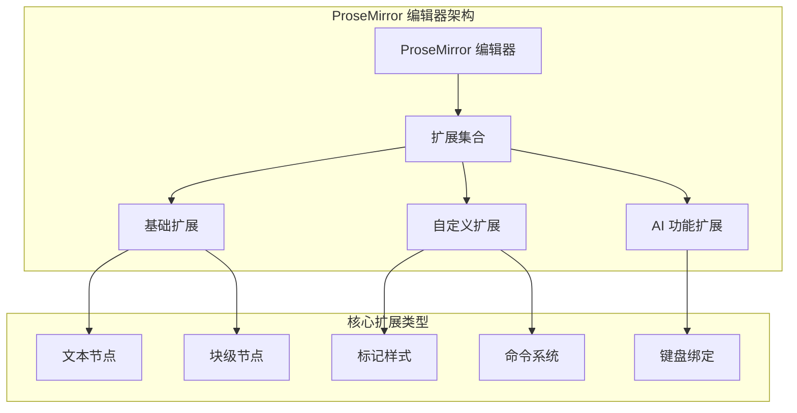
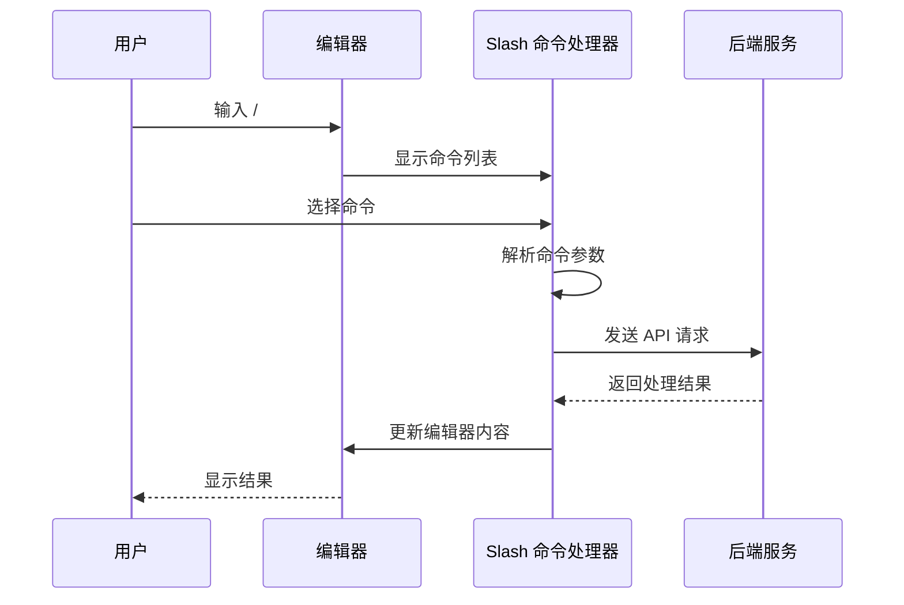
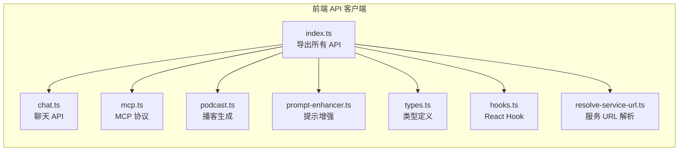
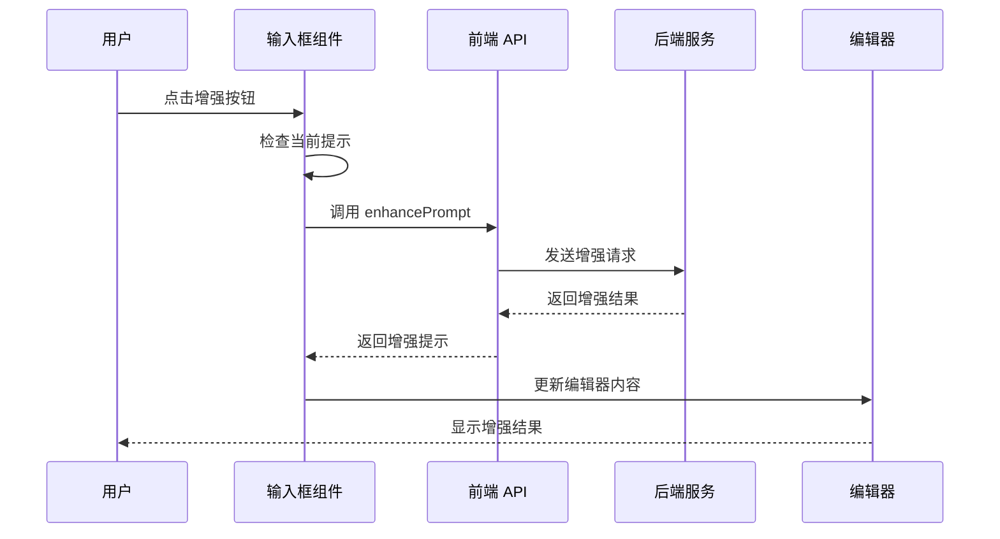

# 前端扩展指南

<cite>
**本文档引用的文件**
- [extensions.tsx](file://web/src/components/editor/extensions.tsx)
- [slash-command.tsx](file://web/src/components/editor/slash-command.tsx)
- [input-box.tsx](file://web/src/app/chat/components/input-box.tsx)
- [prompt-enhancer.ts](file://web/src/core/api/prompt-enhancer.ts)
- [hooks.ts](file://web/src/core/api/hooks.ts)
- [types.ts](file://web/src/core/api/types.ts)
- [index.ts](file://web/src/core/api/index.ts)
</cite>

## 目录
1. [简介](#简介)
2. [ProseMirror 编辑器扩展](#prosemirror-编辑器扩展)
3. [Slash 命令系统](#slash-命令系统)
4. [前端 API 客户端](#前端-api-客户端)
5. [增强提示功能实现](#增强提示功能实现)
6. [扩展开发最佳实践](#扩展开发最佳实践)
7. [故障排除指南](#故障排除指南)
8. [总结](#总结)

## 简介

deer-flow 是一个基于 Next.js 和 ProseMirror 的智能写作平台，提供了强大的前端扩展能力。本指南将详细介绍如何扩展 deer-flow 的 Web 用户界面，包括为内置的 ProseMirror 编辑器添加新的 AI 功能按钮或菜单项，实现新的 Slash 命令，以及如何与后端服务进行交互。

## ProseMirror 编辑器扩展

### 扩展架构概述

deer-flow 使用 Novel 提供的 ProseMirror 集成，通过 `extensions.tsx` 文件管理所有编辑器扩展。这个文件是扩展系统的核心，定义了编辑器的所有功能模块。



**图表来源**
- [extensions.tsx](file://web/src/components/editor/extensions.tsx#L1-L190)

### 扩展配置详解

在 `extensions.tsx` 中，我们定义了默认的扩展集合：

```typescript
export const defaultExtensions = [
  starterKit,
  placeholder,
  tiptapLink,
  updatedImage,
  taskList,
  taskItem,
  table,
  tableRow,
  tableCell,
  tableHeader,
  horizontalRule,
  aiHighlight,
  codeBlockLowlight,
  youtube,
  twitter,
  mathematics,
  characterCount,
  TiptapUnderline,
  markdownExtension,
  HighlightExtension,
  TextStyle,
  Color,
  CustomKeymap,
  globalDragHandle,
];
```

每个扩展都有其特定的功能：
- **StarterKit**: 提供基础的文本编辑功能
- **Placeholder**: 输入占位符功能
- **TiptapLink**: 链接处理
- **UpdatedImage**: 图片上传和处理
- **TaskList/TaskItem**: 待办事项列表
- **Table 相关**: 表格支持
- **AIHighlight**: AI 内容高亮
- **CodeBlockLowlight**: 代码块语法高亮
- **Youtube/Twitter**: 媒体嵌入
- **Mathematics**: 数学公式支持
- **CharacterCount**: 字数统计
- **Markdown**: Markdown 转换
- **TextStyle/Color**: 文本样式和颜色
- **CustomKeymap**: 自定义键盘快捷键
- **GlobalDragHandle**: 拖拽句柄

**章节来源**
- [extensions.tsx](file://web/src/components/editor/extensions.tsx#L150-L190)

### 添加新的 AI 功能按钮

要为编辑器添加新的 AI 功能按钮，您需要：

1. **导入必要的扩展**：
```typescript
import { AIHighlight, CustomKeymap } from "novel";
```

2. **配置扩展选项**：
```typescript
const aiHighlight = AIHighlight.configure({
  HTMLAttributes: {
    class: "ai-highlight",
  },
});
```

3. **将扩展添加到默认扩展集合**：
```typescript
export const defaultExtensions = [
  // ... 其他扩展
  aiHighlight,
  CustomKeymap.configure({
    shortcuts: {
      "Mod-Shift-A": ({ editor }) => {
        // AI 功能逻辑
        console.log("AI 功能被触发");
        return true;
      },
    },
  }),
];
```

### 实现自定义扩展

您可以创建自定义扩展来添加新的功能：

```typescript
import { Extension } from "@tiptap/core";

export const CustomAIExtension = Extension.create({
  name: "customAI",

  addKeyboardShortcuts() {
    return {
      "Mod-Shift-I": () => {
        // 触发 AI 智能功能
        this.editor.commands.toggleItalic();
        return true;
      },
    };
  },

  addCommands() {
    return {
      toggleAIHighlight: () => ({ commands }) => {
        return commands.setMark("aiHighlight");
      },
    };
  },
});
```

## Slash 命令系统

### Slash 命令架构

deer-flow 的 Slash 命令系统允许用户通过 `/` 快速访问各种编辑功能。`slash-command.tsx` 文件定义了所有可用的命令。



**图表来源**
- [slash-command.tsx](file://web/src/components/editor/slash-command.tsx#L1-L209)

### 现有命令分析

系统预定义了多种 Slash 命令：

```typescript
export const suggestionItems = createSuggestionItems([
  {
    title: "Text",
    description: "Just start typing with plain text.",
    searchTerms: ["p", "paragraph"],
    icon: <Text size={18} />,
    command: ({ editor, range }) => {
      editor
        .chain()
        .focus()
        .deleteRange(range)
        .toggleNode("paragraph", "paragraph")
        .run();
    },
  },
  // ... 更多命令
]);
```

### 创建新的 Slash 命令

要创建新的 Slash 命令，按照以下步骤操作：

1. **定义命令结构**：
```typescript
{
  title: "AI Research",
  description: "Generate research content using AI",
  searchTerms: ["research", "ai", "generate"],
  icon: <Search size={18} />,
  command: async ({ editor, range }) => {
    try {
      // 获取当前选中的文本
      const selectedText = editor.state.doc.textBetween(
        range.from, 
        range.to
      );
      
      // 调用 AI 研究 API
      const researchResult = await fetchResearchContent(selectedText);
      
      // 插入研究结果
      editor
        .chain()
        .focus()
        .deleteRange(range)
        .insertContent(researchResult)
        .run();
        
    } catch (error) {
      console.error("AI Research failed:", error);
      // 显示错误信息
    }
  },
}
```

2. **添加到命令列表**：
```typescript
export const suggestionItems = createSuggestionItems([
  // ... 现有命令
  {
    title: "AI Research",
    description: "Generate research content using AI",
    searchTerms: ["research", "ai", "generate"],
    icon: <Search size={18} />,
    command: async ({ editor, range }) => {
      // 命令实现
    },
  },
]);
```

### 实现 AI 驱动的 Slash 命令

对于需要与后端交互的 AI 命令，可以这样实现：

```typescript
command: async ({ editor, range }) => {
  const selectedText = editor.state.doc.textBetween(range.from, range.to);
  
  try {
    // 调用后端 API
    const response = await fetch("/api/ai/generate", {
      method: "POST",
      headers: {
        "Content-Type": "application/json",
      },
      body: JSON.stringify({
        prompt: selectedText,
        type: "research",
        model: "gpt-4"
      }),
    });
    
    if (!response.ok) {
      throw new Error("AI generation failed");
    }
    
    const data = await response.json();
    
    editor
      .chain()
      .focus()
      .deleteRange(range)
      .insertContent(data.content)
      .run();
      
  } catch (error) {
    console.error("AI generation error:", error);
    // 显示错误消息给用户
  }
},
```

**章节来源**
- [slash-command.tsx](file://web/src/components/editor/slash-command.tsx#L10-L100)

## 前端 API 客户端

### API 客户端架构

deer-flow 提供了一个完整的前端 API 客户端系统，位于 `core/api/` 目录下。这个系统负责与后端服务进行通信。



**图表来源**
- [index.ts](file://web/src/core/api/index.ts#L1-L9)

### 核心 API 接口

每个 API 模块都遵循统一的接口模式：

```typescript
export interface EnhancePromptRequest {
  prompt: string;
  context?: string;
  report_style?: string;
}

export interface EnhancePromptResponse {
  enhanced_prompt: string;
}

export async function enhancePrompt(
  request: EnhancePromptRequest,
): Promise<string> {
  const response = await fetch(resolveServiceURL("prompt/enhance"), {
    method: "POST",
    headers: {
      "Content-Type": "application/json",
    },
    body: JSON.stringify(request),
  });

  if (!response.ok) {
    throw new Error(`HTTP error! status: ${response.status}`);
  }

  const data = await response.json();
  return data.result;
}
```

### API 错误处理

API 客户端包含完善的错误处理机制：

```typescript
export async function enhancePrompt(request: EnhancePromptRequest): Promise<string> {
  try {
    const response = await fetch(resolveServiceURL("prompt/enhance"), {
      method: "POST",
      headers: {
        "Content-Type": "application/json",
      },
      body: JSON.stringify(request),
    });

    if (!response.ok) {
      throw new Error(`HTTP error! status: ${response.status}`);
    }

    const data = await response.json();
    return data.result;

  } catch (error) {
    console.error("Failed to enhance prompt:", error);
    // 返回原始提示作为回退
    return request.prompt;
  }
}
```

### 使用 React Hook

系统提供了 React Hook 来简化状态管理：

```typescript
export function useConfig(): {
  config: DeerFlowConfig | null;
  loading: boolean;
} {
  const [loading, setLoading] = useState(true);
  const [config, setConfig] = useState<DeerFlowConfig | null>(null);

  useEffect(() => {
    if (env.NEXT_PUBLIC_STATIC_WEBSITE_ONLY) {
      setLoading(false);
      return;
    }
    
    fetch(resolveServiceURL("./config"))
      .then((res) => res.json())
      .then((config) => {
        setConfig(config);
        setLoading(false);
      })
      .catch((err) => {
        console.error("Failed to fetch config", err);
        setConfig(null);
        setLoading(false);
      });
  }, []);

  return { config, loading };
}
```

**章节来源**
- [prompt-enhancer.ts](file://web/src/core/api/prompt-enhancer.ts#L1-L63)
- [hooks.ts](file://web/src/core/api/hooks.ts#L30-L73)

## 增强提示功能实现

### 增强提示功能架构

deer-flow 的增强提示功能是一个完整的示例，展示了如何将前端扩展与后端服务集成。



**图表来源**
- [input-box.tsx](file://web/src/app/chat/components/input-box.tsx#L100-L150)

### 输入框组件分析

输入框组件 (`input-box.tsx`) 包含增强提示功能的完整实现：

```typescript
const handleEnhancePrompt = useCallback(async () => {
  if (currentPrompt.trim() === "" || isEnhancing) {
    return;
  }

  setIsEnhancing(true);
  setIsEnhanceAnimating(true);

  try {
    const enhancedPrompt = await enhancePrompt({
      prompt: currentPrompt,
      report_style: reportStyle.toUpperCase(),
    });

    // 添加延迟以改善用户体验
    await new Promise((resolve) => setTimeout(resolve, 500));

    // 使用动画更新输入框内容
    if (inputRef.current) {
      inputRef.current.setContent(enhancedPrompt);
      setCurrentPrompt(enhancedPrompt);
    }

    // 保持动画效果一段时间
    setTimeout(() => {
      setIsEnhanceAnimating(false);
    }, 1000);
  } catch (error) {
    console.error("Failed to enhance prompt:", error);
    setIsEnhanceAnimating(false);
  } finally {
    setIsEnhancing(false);
  }
}, [currentPrompt, isEnhancing, reportStyle]);
```

### 增强提示按钮实现

按钮组件使用了动画效果来提升用户体验：

```typescript
<Tooltip title={t("enhancePrompt")}>
  <Button
    variant="ghost"
    size="icon"
    className={cn(
      "hover:bg-accent h-10 w-10",
      isEnhancing && "animate-pulse",
    )}
    onClick={handleEnhancePrompt}
    disabled={isEnhancing || currentPrompt.trim() === ""}
  >
    {isEnhancing ? (
      <div className="flex h-10 w-10 items-center justify-center">
        <div className="bg-foreground h-3 w-3 animate-bounce rounded-full opacity-70" />
      </div>
    ) : (
      <MagicWandIcon className="text-brand" />
    )}
  </Button>
</Tooltip>
```

### 动画效果实现

输入框组件使用了复杂的动画效果：

```typescript
{isEnhanceAnimating && (
  <motion.div
    className="pointer-events-none absolute inset-0 z-20"
    initial={{ opacity: 0 }}
    animate={{ opacity: 1 }}
    exit={{ opacity: 0 }}
    transition={{ duration: 0.3 }}
  >
    <div className="relative h-full w-full">
      {/* 彩色渐变背景 */}
      <motion.div
        className="absolute inset-0 rounded-[24px] bg-gradient-to-r from-blue-500/10 via-purple-500/10 to-blue-500/10"
        animate={{
          background: [
            "linear-gradient(45deg, rgba(59, 130, 246, 0.1), rgba(147, 51, 234, 0.1), rgba(59, 130, 246, 0.1))",
            "linear-gradient(225deg, rgba(147, 51, 234, 0.1), rgba(59, 130, 246, 0.1), rgba(147, 51, 234, 0.1))",
            "linear-gradient(45deg, rgba(59, 130, 246, 0.1), rgba(147, 51, 234, 0.1), rgba(59, 130, 246, 0.1))",
          ],
        }}
        transition={{ duration: 2, repeat: Infinity }}
      />
      {/* 浮动光点效果 */}
      {[...Array(6)].map((_, i) => (
        <motion.div
          key={i}
          className="absolute h-2 w-2 rounded-full bg-blue-400"
          style={{
            left: `${20 + i * 12}%`,
            top: `${30 + (i % 2) * 40}%`,
          }}
          animate={{
            y: [-10, -20, -10],
            opacity: [0, 1, 0],
            scale: [0.5, 1, 0.5],
          }}
          transition={{
            duration: 1.5,
            repeat: Infinity,
            delay: i * 0.2,
          }}
        />
      ))}
    </div>
  </motion.div>
)}
```

**章节来源**
- [input-box.tsx](file://web/src/app/chat/components/input-box.tsx#L100-L200)

## 扩展开发最佳实践

### 1. 组件设计原则

- **单一职责**: 每个组件应该只负责一个功能
- **可复用性**: 设计通用的组件和钩子
- **类型安全**: 使用 TypeScript 确保类型安全
- **性能优化**: 使用 React.memo 和 useMemo 优化性能

### 2. API 集成模式

```typescript
// 1. 定义请求和响应接口
export interface CustomAPIData {
  id: string;
  content: string;
  metadata: Record<string, any>;
}

// 2. 实现 API 函数
export async function fetchCustomData(id: string): Promise<CustomAPIData> {
  const response = await fetch(`/api/custom/${id}`, {
    method: "GET",
    headers: {
      "Content-Type": "application/json",
    },
  });

  if (!response.ok) {
    throw new Error(`HTTP error! status: ${response.status}`);
  }

  return response.json();
}

// 3. 创建 React Hook
export function useCustomData(id: string) {
  const [data, setData] = useState<CustomAPIData | null>(null);
  const [loading, setLoading] = useState(true);
  const [error, setError] = useState<string | null>(null);

  useEffect(() => {
    let mounted = true;

    const fetchData = async () => {
      try {
        const result = await fetchCustomData(id);
        if (mounted) {
          setData(result);
          setLoading(false);
        }
      } catch (err) {
        if (mounted) {
          setError(err.message);
          setLoading(false);
        }
      }
    };

    fetchData();

    return () => {
      mounted = false;
    };
  }, [id]);

  return { data, loading, error };
}
```

### 3. 错误处理策略

```typescript
// 1. 统一的错误处理函数
export function handleError(error: unknown, context: string): void {
  if (error instanceof Error) {
    console.error(`${context}:`, error.message);
    // 可以在这里添加错误报告逻辑
  } else {
    console.error(`${context}: Unknown error`);
  }
}

// 2. 在 API 调用中使用
export async function safeFetch<T>(
  url: string, 
  options: RequestInit = {}
): Promise<T | null> {
  try {
    const response = await fetch(url, options);
    
    if (!response.ok) {
      throw new Error(`HTTP ${response.status}: ${response.statusText}`);
    }
    
    return await response.json();
  } catch (error) {
    handleError(error, "API Call");
    return null;
  }
}
```

### 4. 状态管理

```typescript
// 使用 Zustand 进行状态管理
import { create } from "zustand";

interface AIState {
  isProcessing: boolean;
  progress: number;
  error: string | null;
  startProcessing: () => void;
  updateProgress: (progress: number) => void;
  setError: (error: string | null) => void;
  reset: () => void;
}

export const useAIStore = create<AIState>((set) => ({
  isProcessing: false,
  progress: 0,
  error: null,
  startProcessing: () => set({ isProcessing: true, progress: 0, error: null }),
  updateProgress: (progress) => set({ progress }),
  setError: (error) => set({ error }),
  reset: () => set({ isProcessing: false, progress: 0, error: null }),
}));
```

### 5. 国际化支持

```typescript
import { useTranslations } from "next-intl";

// 在组件中使用
export function EnhancedButton() {
  const t = useTranslations("enhancedFeatures");
  
  return (
    <Button>
      {t("enhanceButton")}
    </Button>
  );
}
```

## 故障排除指南

### 常见问题及解决方案

#### 1. 编辑器扩展不生效

**问题**: 添加的新扩展没有在编辑器中显示

**解决方案**:
- 检查扩展是否正确添加到 `defaultExtensions` 数组
- 确认扩展的配置选项是否正确
- 查看浏览器控制台是否有错误信息

```typescript
// 正确的扩展添加方式
export const defaultExtensions = [
  // ... 其他扩展
  MyCustomExtension.configure({
    // 配置选项
  }),
];
```

#### 2. API 调用失败

**问题**: 前端 API 调用返回错误

**解决方案**:
- 检查网络连接和 CORS 设置
- 验证 API 端点 URL 是否正确
- 确认请求头和请求体格式

```typescript
// 调试 API 调用
const debugEnhancePrompt = async (prompt: string) => {
  console.log("Sending request:", { prompt });
  
  try {
    const result = await enhancePrompt({ prompt });
    console.log("API response:", result);
    return result;
  } catch (error) {
    console.error("API error:", error);
    throw error;
  }
};
```

#### 3. Slash 命令不工作

**问题**: Slash 命令无法正常执行

**解决方案**:
- 检查命令的 `command` 函数是否正确实现
- 确认编辑器链式调用的顺序
- 验证命令的 `searchTerms` 是否合理

```typescript
// 正确的命令实现
command: ({ editor, range }) => {
  // 1. 删除选中区域
  editor.chain().focus().deleteRange(range).run();
  
  // 2. 执行具体操作
  editor.commands.insertContent("New content");
  
  // 3. 返回 true 表示成功
  return true;
},
```

#### 4. 动画效果异常

**问题**: 输入框动画效果不流畅或不显示

**解决方案**:
- 检查 CSS 类名是否正确
- 确认动画配置参数
- 验证 React 动画库版本兼容性

```typescript
// 动画调试
useEffect(() => {
  console.log("Animation state:", isEnhanceAnimating);
}, [isEnhanceAnimating]);
```

### 调试技巧

#### 1. 开发者工具使用

```typescript
// 在关键位置添加调试日志
console.log("Current state:", {
  currentPrompt,
  isEnhancing,
  reportStyle,
});

// 使用断点调试
debugger;
```

#### 2. 性能监控

```typescript
// 性能测量
const measurePerformance = (operation: string, fn: () => Promise<void>) => {
  const start = performance.now();
  
  return fn().then(result => {
    const end = performance.now();
    console.log(`${operation} took ${end - start} milliseconds`);
    return result;
  });
};
```

#### 3. 错误边界

```typescript
// 错误边界组件
class ErrorBoundary extends React.Component {
  state = { hasError: false, error: null };

  static getDerivedStateFromError(error: Error) {
    return { hasError: true, error };
  }

  componentDidCatch(error: Error, errorInfo: React.ErrorInfo) {
    console.error("Error caught by boundary:", error, errorInfo);
  }

  render() {
    if (this.state.hasError) {
      return (
        <div className="error-boundary">
          <h2>Something went wrong.</h2>
          <details>
            <summary>Error Details</summary>
            <pre>{this.state.error?.toString()}</pre>
          </details>
        </div>
      );
    }

    return this.props.children;
  }
}
```

## 总结

本指南详细介绍了 deer-flow 前端扩展系统的各个方面，包括：

1. **ProseMirror 编辑器扩展**: 如何添加新的 AI 功能按钮和自定义扩展
2. **Slash 命令系统**: 实现 AI 驱动的命令和与后端的交互
3. **前端 API 客户端**: 使用统一的 API 接口与后端服务通信
4. **增强提示功能**: 完整的示例展示了如何实现复杂的用户交互
5. **最佳实践**: 提供了组件设计、错误处理、状态管理等方面的建议
6. **故障排除**: 解决常见问题的方法和调试技巧

通过遵循这些指导原则和最佳实践，开发者可以有效地扩展 deer-flow 的功能，创建出色的用户体验。记住始终关注性能、可维护性和用户体验，确保扩展的质量和稳定性。