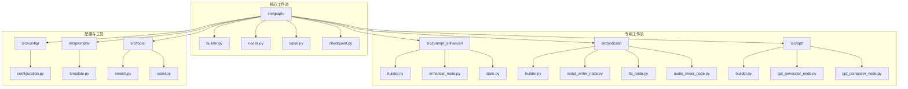
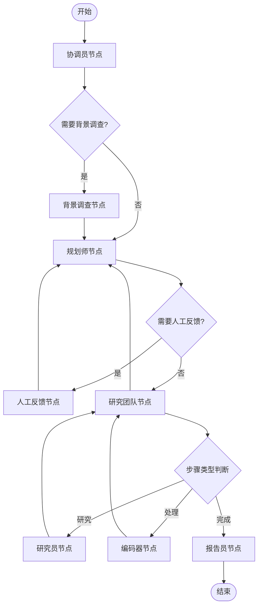
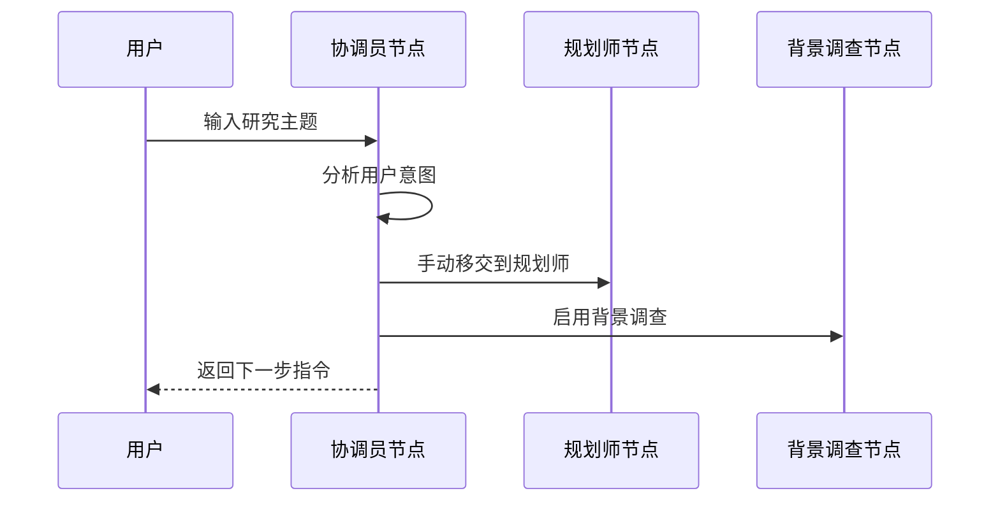
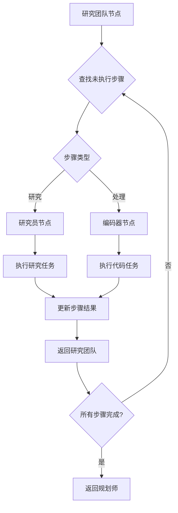

# 工作流扩展指南

<cite>
**本文档引用的文件**
- [src/graph/builder.py](file://src/graph/builder.py)
- [src/graph/nodes.py](file://src/graph/nodes.py)
- [src/graph/types.py](file://src/graph/types.py)
- [src/prompt_enhancer/graph/builder.py](file://src/prompt_enhancer/graph/builder.py)
- [src/podcast/graph/builder.py](file://src/podcast/graph/builder.py)
- [src/ppt/graph/builder.py](file://src/ppt/graph/builder.py)
- [src/config/configuration.py](file://src/config/configuration.py)
- [src/prompts/template.py](file://src/prompts/template.py)
- [src/prompts/planner.md](file://src/prompts/planner.md)
- [tests/unit/graph/test_builder.py](file://tests/unit/graph/test_builder.py)
</cite>

## 目录
1. [简介](#简介)
2. [项目结构概览](#项目结构概览)
3. [核心工作流架构](#核心工作流架构)
4. [基础工作流详解](#基础工作流详解)
5. [节点系统分析](#节点系统分析)
6. [状态管理机制](#状态管理机制)
7. [工作流扩展实践](#工作流扩展实践)
8. [专用工作流示例](#专用工作流示例)
9. [最佳实践与建议](#最佳实践与建议)
10. [故障排除指南](#故障排除指南)

## 简介

deer-flow 是一个基于 LangGraph 的可扩展工作流框架，专为复杂的 AI 协作任务设计。该框架采用状态图模型，支持动态工作流编排、条件分支执行和内存持久化。本文档将深入解析如何扩展和定制工作流，包括创建新的节点、修改现有流程以及实现高级功能。

## 项目结构概览

deer-flow 采用模块化的目录结构，每个功能领域都有独立的工作流实现：



**图表来源**
- [src/graph/builder.py](file://src/graph/builder.py#L1-L88)
- [src/prompt_enhancer/graph/builder.py](file://src/prompt_enhancer/graph/builder.py#L1-L26)
- [src/podcast/graph/builder.py](file://src/podcast/graph/builder.py#L1-L40)
- [src/ppt/graph/builder.py](file://src/ppt/graph/builder.py#L1-L32)

## 核心工作流架构

### 基础工作流构建器

deer-flow 的核心工作流由 `builder.py` 中的 `create_graph` 函数实现，该函数负责定义状态、添加节点和设置边：



**图表来源**
- [src/graph/builder.py](file://src/graph/builder.py#L35-L65)

### 节点连接逻辑

工作流的核心在于 `continue_to_running_research_team` 函数，它实现了智能的节点路由：

```python
def continue_to_running_research_team(state: State):
    current_plan = state.get("current_plan")
    if not current_plan or not current_plan.steps:
        return "planner"

    if all(step.execution_res for step in current_plan.steps):
        return "planner"

    # 查找第一个未完成的步骤
    incomplete_step = None
    for step in current_plan.steps:
        if not step.execution_res:
            incomplete_step = step
            break

    if not incomplete_step:
        return "planner"

    if incomplete_step.step_type == StepType.RESEARCH:
        return "researcher"
    if incomplete_step.step_type == StepType.PROCESSING:
        return "coder"
    return "planner"
```

**章节来源**
- [src/graph/builder.py](file://src/graph/builder.py#L18-L33)

## 基础工作流详解

### 状态定义

工作流的状态通过 `State` 类定义，继承自 `MessagesState` 并扩展了运行时变量：

```python
class State(MessagesState):
    """代理系统的状态，扩展了带有下一个字段的消息状态。"""

    # 运行时变量
    locale: str = "en-US"
    research_topic: str = ""
    observations: list[str] = []
    resources: list[Resource] = []
    plan_iterations: int = 0
    current_plan: Plan | str = None
    final_report: str = ""
    auto_accepted_plan: bool = False
    enable_background_investigation: bool = True
    background_investigation_results: str = None
```

### 节点职责详解

#### 协调员节点 (coordinator_node)
负责与用户交互，接收研究主题并决定下一步行动：



**图表来源**
- [src/graph/nodes.py](file://src/graph/nodes.py#L180-L230)

#### 规划师节点 (planner_node)
生成详细的行动计划，支持深度思考模式：

```python
def planner_node(
    state: State, config: RunnableConfig
) -> Command[Literal["human_feedback", "reporter"]]:
    """规划师节点，生成完整计划。"""
    configurable = Configuration.from_runnable_config(config)
    plan_iterations = state["plan_iterations"] if state.get("plan_iterations", 0) else 0
    messages = apply_prompt_template("planner", state, configurable)
    
    # 检查是否达到最大迭代次数
    if plan_iterations >= configurable.max_plan_iterations:
        return Command(goto="reporter")
    
    # 处理规划响应
    try:
        curr_plan = json.loads(repair_json_output(full_response))
        if isinstance(curr_plan, dict) and curr_plan.get("has_enough_context"):
            new_plan = Plan.model_validate(curr_plan)
            return Command(
                update={
                    "messages": [AIMessage(content=full_response, name="planner")],
                    "current_plan": new_plan,
                },
                goto="reporter",
            )
    except json.JSONDecodeError:
        # 错误处理逻辑
        pass
```

**章节来源**
- [src/graph/nodes.py](file://src/graph/nodes.py#L75-L140)

## 节点系统分析

### 研究团队协作

研究团队节点通过 `_execute_agent_step` 函数实现智能的任务分配：



**图表来源**
- [src/graph/nodes.py](file://src/graph/nodes.py#L235-L280)

### MCP 服务器集成

工作流支持 MCP (Model Context Protocol) 服务器，允许动态加载工具：

```python
async def _setup_and_execute_agent_step(
    state: State,
    config: RunnableConfig,
    agent_type: str,
    default_tools: list,
) -> Command[Literal["research_team"]]:
    """设置代理并执行步骤的辅助函数。"""
    configurable = Configuration.from_runnable_config(config)
    mcp_servers = {}
    enabled_tools = {}

    # 提取 MCP 服务器配置
    if configurable.mcp_settings:
        for server_name, server_config in configurable.mcp_settings["servers"].items():
            if (
                server_config["enabled_tools"]
                and agent_type in server_config["add_to_agents"]
            ):
                mcp_servers[server_name] = {
                    k: v
                    for k, v in server_config.items()
                    if k in ("transport", "command", "args", "url", "env", "headers")
                }
                for tool_name in server_config["enabled_tools"]:
                    enabled_tools[tool_name] = server_name

    # 创建并执行带有 MCP 工具的代理
    if mcp_servers:
        client = MultiServerMCPClient(mcp_servers)
        loaded_tools = default_tools[:]
        all_tools = await client.get_tools()
        for tool in all_tools:
            if tool.name in enabled_tools:
                tool.description = (
                    f"Powered by '{enabled_tools[tool.name]}'.\n{tool.description}"
                )
                loaded_tools.append(tool)
        agent = create_agent(agent_type, agent_type, loaded_tools, agent_type)
        return await _execute_agent_step(state, agent, agent_type)
```

**章节来源**
- [src/graph/nodes.py](file://src/graph/nodes.py#L350-L400)

## 状态管理机制

### 配置系统

工作流通过 `Configuration` 类管理可配置参数：

```python
@dataclass(kw_only=True)
class Configuration:
    """可配置字段。"""

    resources: list[Resource] = field(default_factory=list)
    max_plan_iterations: int = 1
    max_step_num: int = 3
    max_search_results: int = 3
    search_engine: str = "custom_search"
    custom_search_repository: Optional[str] = None
    mcp_settings: dict = None
    report_style: str = ReportStyle.ACADEMIC.value
    enable_deep_thinking: bool = False

    @classmethod
    def from_runnable_config(
        cls, config: Optional[RunnableConfig] = None
    ) -> "Configuration":
        """从 RunnableConfig 创建 Configuration 实例。"""
        configurable = (
            config["configurable"] if config and "configurable" in config else {}
        )
        values: dict[str, Any] = {
            f.name: os.environ.get(f.name.upper(), configurable.get(f.name))
            for f in fields(cls)
            if f.init
        }
        return cls(**{k: v for k, v in values.items() if v})
```

### 提示模板系统

通过 Jinja2 模板引擎实现动态提示生成：

```python
def apply_prompt_template(
    prompt_name: str, state: AgentState, configurable: Configuration = None
) -> list:
    """
    将模板变量应用到提示模板并返回格式化的消息列表。
    
    Args:
        prompt_name: 要使用的提示模板名称
        state: 包含要替换变量的当前代理状态
        
    Returns:
        包含系统提示作为第一条消息的消息列表
    """
    # 将状态转换为字典进行模板渲染
    state_vars = {
        "CURRENT_TIME": datetime.now().strftime("%a %b %d %Y %H:%M:%S %z"),
        **state,
    }

    # 添加可配置变量
    if configurable:
        state_vars.update(dataclasses.asdict(configurable))

    try:
        template = env.get_template(f"{prompt_name}.md")
        system_prompt = template.render(**state_vars)
        return [{"role": "system", "content": system_prompt}] + state["messages"]
    except Exception as e:
        raise ValueError(f"应用模板 {prompt_name} 时出错: {e}")
```

**章节来源**
- [src/config/configuration.py](file://src/config/configuration.py#L40-L70)
- [src/prompts/template.py](file://src/prompts/template.py#L40-L67)

## 工作流扩展实践

### 创建自定义节点

要创建一个新的自定义节点，首先需要定义节点函数：

```python
@tool
def quality_review_tool(
    content: Annotated[str, "需要审查的内容"],
    locale: Annotated[str, "用户的语言环境"],
):
    """质量审查工具，用于检查内容的质量和准确性。"""
    return "审查结果"

async def quality_review_node(
    state: State, config: RunnableConfig
) -> Command[Literal["reporter", "quality_review"]]:
    """质量审查节点，对报告进行质量检查。"""
    logger.info("质量审查节点正在运行。")
    configurable = Configuration.from_runnable_config(config)
    
    # 获取需要审查的内容
    content_to_review = state.get("final_report", "")
    
    # 应用提示模板
    messages = apply_prompt_template("quality_review", state, configurable)
    
    # 调用 LLM 进行质量审查
    response = get_llm_by_type(AGENT_LLM_MAP["quality_review"]).invoke(messages)
    
    # 处理审查结果
    review_result = response.content
    
    # 更新状态
    return Command(
        update={
            "quality_review_results": review_result,
            "messages": [HumanMessage(content=review_result, name="quality_review")],
        },
        goto="reporter",
    )
```

### 修改现有工作流

要在现有工作流中添加质量审查节点，可以修改 `builder.py`：

```python
def _build_base_graph():
    """构建并返回包含所有节点和边的基础状态图。"""
    builder = StateGraph(State)
    builder.add_edge(START, "coordinator")
    builder.add_node("coordinator", coordinator_node)
    builder.add_node("background_investigator", background_investigation_node)
    builder.add_node("planner", planner_node)
    builder.add_node("reporter", reporter_node)
    builder.add_node("quality_review", quality_review_node)  # 新增节点
    builder.add_node("research_team", research_team_node)
    builder.add_node("researcher", researcher_node)
    builder.add_node("coder", coder_node)
    builder.add_node("human_feedback", human_feedback_node)
    
    # 设置节点间的连接
    builder.add_edge("background_investigator", "planner")
    builder.add_conditional_edges(
        "research_team",
        continue_to_running_research_team,
        ["planner", "researcher", "coder"],
    )
    builder.add_edge("reporter", "quality_review")  # 修改连接
    builder.add_edge("quality_review", END)  # 修改连接
    return builder
```

### 多轮迭代优化

实现多轮迭代优化的工作流：

```python
def create_iterative_research_workflow():
    """创建支持多轮迭代的研究工作流。"""
    builder = StateGraph(State)
    
    # 定义节点
    builder.add_node("initial_research", initial_research_node)
    builder.add_node("analysis", analysis_node)
    builder.add_node("iterative_review", iterative_review_node)
    builder.add_node("final_report", final_report_node)
    
    # 设置初始边
    builder.add_edge(START, "initial_research")
    builder.add_edge("initial_research", "analysis")
    
    # 添加条件边
    builder.add_conditional_edges(
        "analysis",
        lambda state: "iterative_review" if needs_more_iterations(state) else "final_report",
        ["iterative_review", "final_report"],
    )
    
    builder.add_edge("iterative_review", "analysis")
    builder.add_edge("final_report", END)
    
    return builder.compile()

def needs_more_iterations(state: State) -> str:
    """判断是否需要更多迭代。"""
    current_iteration = state.get("iteration_count", 0)
    max_iterations = state.get("max_iterations", 3)
    
    if current_iteration < max_iterations:
        return "iterative_review"
    return "final_report"
```

**章节来源**
- [src/graph/builder.py](file://src/graph/builder.py#L35-L65)

## 专用工作流示例

### 提示增强器工作流

提示增强器是一个简单的单节点工作流：

```python
def build_graph():
    """构建并返回提示增强器工作流图。"""
    # 构建状态图
    builder = StateGraph(PromptEnhancerState)

    # 添加增强器节点
    builder.add_node("enhancer", prompt_enhancer_node)

    # 设置入口点
    builder.set_entry_point("enhancer")

    # 设置完成点
    builder.set_finish_point("enhancer")

    # 编译并返回图
    return builder.compile()
```

### 播客生成工作流

播客生成器展示了线性工作流的典型模式：

```python
def build_graph():
    """构建并返回播客工作流图。"""
    # 构建状态图
    builder = StateGraph(PodcastState)
    builder.add_node("script_writer", script_writer_node)
    builder.add_node("tts", tts_node)
    builder.add_node("audio_mixer", audio_mixer_node)
    builder.add_edge(START, "script_writer")
    builder.add_edge("script_writer", "tts")
    builder.add_edge("tts", "audio_mixer")
    builder.add_edge("audio_mixer", END)
    return builder.compile()
```

### PPT 生成工作流

PPT 生成器是最简单的线性工作流：

```python
def build_graph():
    """构建并返回 PPT 工作流图。"""
    # 构建状态图
    builder = StateGraph(PPTState)
    builder.add_node("ppt_composer", ppt_composer_node)
    builder.add_node("ppt_generator", ppt_generator_node)
    builder.add_edge(START, "ppt_composer")
    builder.add_edge("ppt_composer", "ppt_generator")
    builder.add_edge("ppt_generator", END)
    return builder.compile()
```

**章节来源**
- [src/prompt_enhancer/graph/builder.py](file://src/prompt_enhancer/graph/builder.py#L10-L25)
- [src/podcast/graph/builder.py](file://src/podcast/graph/builder.py#L12-L25)
- [src/ppt/graph/builder.py](file://src/ppt/graph/builder.py#L10-L20)

## 最佳实践与建议

### 节点设计原则

1. **单一职责原则**: 每个节点应该只负责一个明确的功能
2. **幂等性**: 节点应该能够安全地重试而不产生副作用
3. **状态隔离**: 节点应该通过状态对象进行通信，避免直接依赖
4. **错误处理**: 实现完善的错误处理和恢复机制

### 性能优化建议

1. **异步处理**: 对于 I/O 密集型操作使用异步函数
2. **缓存策略**: 实现适当的缓存机制减少重复计算
3. **资源管理**: 及时释放不需要的资源和连接
4. **并发控制**: 使用适当的并发限制避免资源耗尽

### 测试策略

```python
@pytest.mark.asyncio
async def test_quality_review_node():
    """测试质量审查节点。"""
    state = {
        "final_report": "测试报告内容",
        "locale": "zh-CN",
        "messages": [],
    }
    
    config = RunnableConfig(configurable={"max_iterations": 3})
    
    result = await quality_review_node(state, config)
    
    assert "quality_review_results" in result.update
    assert result.goto == "reporter"
```

**章节来源**
- [tests/unit/graph/test_builder.py](file://tests/unit/graph/test_builder.py#L1-L134)

## 故障排除指南

### 常见问题及解决方案

#### 1. 节点死锁问题

**症状**: 工作流卡在某个节点无法继续
**原因**: 条件边逻辑错误或状态更新不正确
**解决方案**: 
- 检查 `continue_to_running_research_team` 函数的逻辑
- 确保每个节点都正确返回 `Command` 对象
- 验证状态更新是否包含必要的字段

#### 2. 内存泄漏

**症状**: 长时间运行后内存使用持续增长
**原因**: 未正确清理临时数据或循环引用
**解决方案**:
- 在节点函数中显式清理不需要的数据
- 使用弱引用避免循环引用
- 定期检查和清理状态中的历史记录

#### 3. MCP 服务器连接失败

**症状**: MCP 工具无法正常工作
**原因**: 服务器配置错误或网络问题
**解决方案**:
- 验证 MCP 服务器配置
- 检查网络连接和防火墙设置
- 实现重试机制和降级策略

### 调试技巧

1. **日志记录**: 在关键节点添加详细的日志记录
2. **状态快照**: 定期保存工作流状态用于调试
3. **单元测试**: 为每个节点编写独立的单元测试
4. **集成测试**: 创建端到端的集成测试场景

### 监控和指标

```python
import logging
from functools import wraps

def monitor_node_performance(func):
    """监控节点性能的装饰器。"""
    @wraps(func)
    async def wrapper(state: State, config: RunnableConfig):
        start_time = time.time()
        logger.info(f"开始执行 {func.__name__}")
        
        try:
            result = await func(state, config)
            duration = time.time() - start_time
            logger.info(f"成功完成 {func.__name__}，耗时 {duration:.2f} 秒")
            return result
        except Exception as e:
            duration = time.time() - start_time
            logger.error(f"执行 {func.__name__} 失败，耗时 {duration:.2f} 秒: {e}")
            raise
    
    return wrapper
```

通过遵循这些最佳实践和故障排除指南，开发者可以有效地扩展和维护 deer-flow 工作流系统，创建高效、可靠的 AI 协作应用程序。