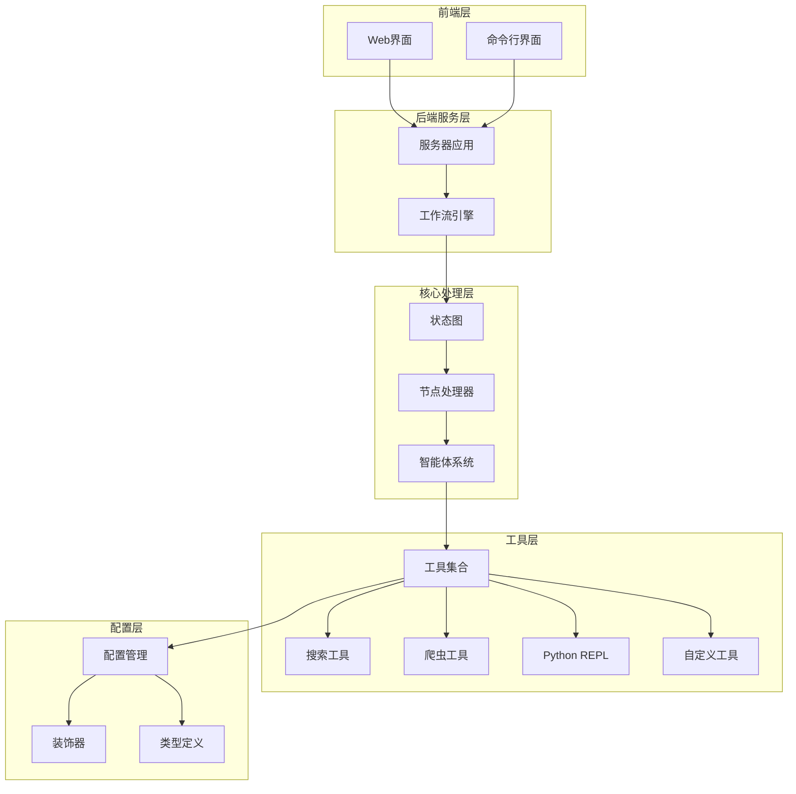
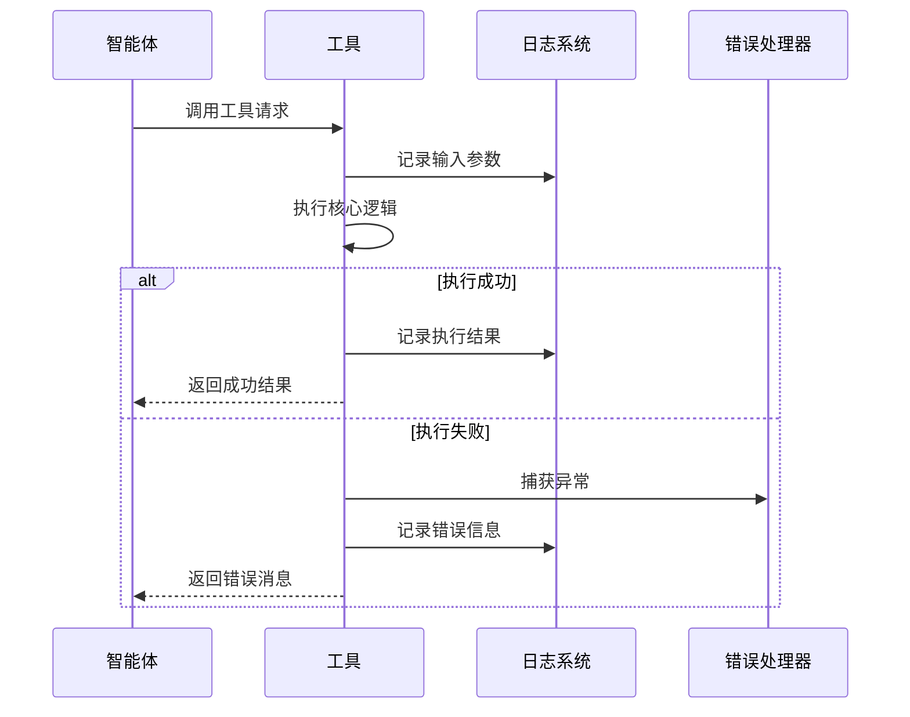
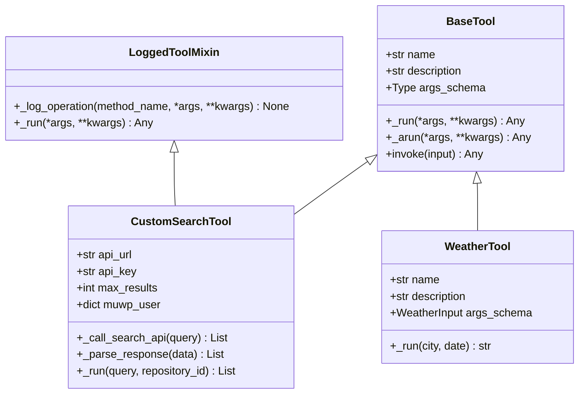

# 工具扩展指南

<cite>
**本文档引用的文件**
- [search.py](file://src/tools/search.py)
- [crawl.py](file://src/tools/crawl.py)
- [custom_search.py](file://src/tools/custom_search.py)
- [decorators.py](file://src/tools/decorators.py)
- [python_repl.py](file://src/tools/python_repl.py)
- [tools.py](file://src/config/tools.py)
- [agents.py](file://src/agents/agents.py)
- [nodes.py](file://src/graph/nodes.py)
- [workflow.py](file://src/workflow.py)
- [custom_search.py](file://src/tools/custom_search.py) - *在提交 a9ed736 中更新*
- [custom_search.py](file://src/config/custom_search.py) - *在提交 a9ed736 中新增*
</cite>

## 更新摘要
**已更新内容**
- 在“创建新工具的完整流程”和“工具基类和装饰器详解”部分中，更新了关于 `CustomSearchTool` 类的属性访问器（`repository` 和 `channel_id`）的说明。
- 在“实现自定义工具的步骤”部分中，增加了对 `CustomSearchTool` 类中 `repository` 和 `channel_id` 属性的使用示例。
- 在“工具集成到智能体”部分中，更新了 `get_web_search_tool` 函数的调用示例，以反映新的 `repository_id` 参数。
- 根据提交 `baaceb5e056324e97a75898ff8eb7026bf1786a8` 的变更，更新了关于 `crawl_tool` 状态的说明，明确指出该工具已被禁用。
- 更新了“工具集成到智能体”部分，说明 `crawl_tool` 已从智能体可用工具列表中移除。
- 更新了“故障排除指南”，添加了关于禁用工具的常见问题说明。

**新增内容**
- 新增了“自定义搜索配置系统”一节，详细介绍 `CustomSearchConfig` 和 `CustomSearchRepository` 类的结构和用途。
- 新增了“配置文件结构”一节，展示 `conf.yaml` 文件中 `CUSTOM_SEARCH` 配置部分的结构。

**已移除内容**
- 无

**来源跟踪系统更新**
- 更新了文档来源列表，添加了 `custom_search.py` 配置模块。
- 在相关章节中添加了新的来源引用，以反映代码变更。
- 更新了 `crawl.py` 文件的引用状态，以反映其当前被禁用的情况。

## 目录
1. [简介](#简介)
2. [项目架构概览](#项目架构概览)
3. [工具系统核心概念](#工具系统核心概念)
4. [创建新工具的完整流程](#创建新工具的完整流程)
5. [工具基类和装饰器详解](#工具基类和装饰器详解)
6. [实现自定义工具的步骤](#实现自定义工具的步骤)
7. [工具集成到智能体](#工具集成到智能体)
8. [错误处理和日志记录](#错误处理和日志记录)
9. [性能优化建议](#性能优化建议)
10. [故障排除指南](#故障排除指南)
11. [总结](#总结)
12. [自定义搜索配置系统](#自定义搜索配置系统)
13. [配置文件结构](#配置文件结构)

## 简介

deer-flow是一个基于LangGraph构建的深度研究框架，它通过集成各种专用工具来增强语言模型的能力。本指南将详细介绍如何在deer-flow系统中创建和集成新的工具（Tool），帮助开发者扩展系统的功能。

工具系统是deer-flow的核心组件之一，它允许智能体执行特定的任务，如网络搜索、网页爬取、数据计算等。通过工具扩展，开发者可以为系统添加新的能力，满足特定的业务需求。

## 项目架构概览

deer-flow采用模块化架构设计，工具系统位于`src/tools/`目录下，与其他核心模块紧密集成：



**图表来源**
- [workflow.py](file://src/workflow.py#L1-L50)
- [agents.py](file://src/agents/agents.py#L1-L20)
- [nodes.py](file://src/graph/nodes.py#L1-L50)

## 工具系统核心概念

### 工具的基本组成

在deer-flow中，工具是由以下核心元素构成的：

1. **工具类**：继承自`BaseTool`或使用装饰器标记的函数
2. **输入参数**：通过`args_schema`定义的参数模型
3. **核心逻辑**：实现具体功能的`_run`或函数体
4. **输出格式**：标准化的结果格式
5. **错误处理**：异常捕获和错误报告机制

### 工具的工作流程



**图表来源**
- [decorators.py](file://src/tools/decorators.py#L15-L40)
- [crawl.py](file://src/tools/crawl.py#L15-L30)

## 创建新工具的完整流程

### 第一步：确定工具需求

在开始编码之前，首先需要明确工具的功能需求：

1. **功能描述**：工具要解决什么问题？
2. **输入参数**：需要哪些输入？参数类型和约束是什么？
3. **输出格式**：期望的输出格式是什么？
4. **使用场景**：在什么情况下会被调用？

### 第二步：选择工具实现方式

deer-flow支持两种主要的工具实现方式：

#### 方式一：使用`@tool`装饰器的函数式工具

适用于简单的工具实现，不需要复杂的状态管理：

```python
@tool
@log_io
def weather_tool(
    city: Annotated[str, "城市名称"],
    date: Annotated[Optional[str], "日期，格式YYYY-MM-DD"] = None,
) -> str:
    """查询指定城市的天气情况。"""
    # 实现天气查询逻辑
    pass
```

#### 方式二：继承`BaseTool`的类式工具

适用于需要复杂状态管理或多个方法的工具：

```python
class WeatherTool(BaseTool):
    name: str = "weather_query"
    description: str = "查询指定城市的天气情况"
    args_schema: Type[BaseModel] = WeatherInput
    
    def _run(
        self,
        city: str,
        date: Optional[str] = None,
        run_manager: Optional[CallbackManagerForToolRun] = None,
    ) -> str:
        # 实现核心逻辑
        pass
```

**章节来源**
- [crawl.py](file://src/tools/crawl.py#L15-L30)
- [custom_search.py](file://src/tools/custom_search.py#L30-L80)

## 工具基类和装饰器详解

### 装饰器系统

deer-flow提供了一套完整的装饰器系统来增强工具功能：

#### 1. `@tool`装饰器

这是最基础的装饰器，用于将普通函数转换为工具：

```python
from langchain_core.tools import tool

@tool
def simple_tool(param: str) -> str:
    """简单工具描述"""
    return f"处理了参数: {param}"
```

#### 2. `@log_io`装饰器

自动记录输入输出的日志装饰器：

```python
from .decorators import log_io

@tool
@log_io
def logged_tool(input_data: str) -> str:
    """带日志记录的工具"""
    return f"处理完成: {input_data}"
```

#### 3. `create_logged_tool`工厂函数

创建带有日志功能的包装工具类：

```python
from src.tools.decorators import create_logged_tool
from langchain_community.tools import DuckDuckGoSearchResults

LoggedDuckDuckGoSearch = create_logged_tool(DuckDuckGoSearchResults)
```

### 工具基类结构



**图表来源**
- [custom_search.py](file://src/tools/custom_search.py#L30-L100)
- [decorators.py](file://src/tools/decorators.py#L50-L82)

**章节来源**
- [decorators.py](file://src/tools/decorators.py#L1-L82)
- [custom_search.py](file://src/tools/custom_search.py#L1-L50)

## 实现自定义工具的步骤

### 步骤1：创建工具文件

在`src/tools/`目录下创建新的工具文件，例如`weather.py`：

```python
# Copyright (c) 2025 Bytedance Ltd. and/or its affiliates
# SPDX-License-Identifier: MIT

import logging
from typing import Annotated, Optional
from datetime import datetime

from langchain_core.tools import tool
from pydantic import BaseModel, Field

from .decorators import log_io

logger = logging.getLogger(__name__)

class WeatherInput(BaseModel):
    """天气查询输入参数"""
    city: str = Field(description="城市名称")
    date: Optional[str] = Field(default=None, description="查询日期，格式YYYY-MM-DD")
    units: Optional[str] = Field(default="celsius", description="温度单位：celsius或fahrenheit")

@tool
@log_io
def weather_tool(
    city: Annotated[str, "城市名称"],
    date: Annotated[Optional[str], "查询日期，格式YYYY-MM-DD"] = None,
    units: Annotated[Optional[str], "温度单位：celsius或fahrenheit"] = "celsius",
) -> str:
    """查询指定城市的天气情况。
    
    参数：
    - city: 城市名称
    - date: 查询日期，默认为今天
    - units: 温度单位，默认为摄氏度
    
    返回：
    天气信息的文本描述
    """
    try:
        # 这里应该调用实际的天气API
        weather_data = get_weather_from_api(city, date, units)
        
        result = f"城市: {city}\n"
        result += f"日期: {date or '今天'}\n"
        result += f"温度: {weather_data['temperature']}°{units[0].upper()}\n"
        result += f"天气状况: {weather_data['condition']}\n"
        result += f"湿度: {weather_data['humidity']}%\n"
        result += f"风速: {weather_data['wind_speed']} km/h"
        
        return result
        
    except Exception as e:
        error_msg = f"天气查询失败: {str(e)}"
        logger.error(error_msg)
        return error_msg

def get_weather_from_api(city: str, date: Optional[str], units: str) -> dict:
    """模拟调用天气API的函数"""
    # 实际应用中这里应该调用真实的天气API
    return {
        "temperature": 25,
        "condition": "晴天",
        "humidity": 60,
        "wind_speed": 15
    }
```

### 步骤2：实现异步支持（可选）

对于需要网络请求的工具，建议实现异步版本：

```python
import asyncio
import aiohttp

async def get_weather_async(city: str, date: Optional[str], units: str) -> dict:
    """异步获取天气数据"""
    async with aiohttp.ClientSession() as session:
        async with session.get(f"https://api.weather.com/{city}") as response:
            data = await response.json()
            return data
```

### 步骤3：添加错误处理

确保工具具有健壮的错误处理机制：

```python
@tool
@log_io
def weather_tool(
    city: Annotated[str, "城市名称"],
    date: Annotated[Optional[str], "查询日期，格式YYYY-MM-DD"] = None,
    units: Annotated[Optional[str], "温度单位：celsius或fahrenheit"] = "celsius",
) -> str:
    """查询指定城市的天气情况。"""
    try:
        # 参数验证
        if not city.strip():
            return "错误：城市名称不能为空"
        
        if units not in ["celsius", "fahrenheit"]:
            return "错误：无效的温度单位"
        
        # 调用API
        weather_data = get_weather_from_api(city, date, units)
        
        # 结果验证
        if not weather_data or not weather_data.get('temperature'):
            return f"无法获取{city}的天气信息"
        
        return format_weather_result(weather_data)
        
    except ValueError as ve:
        logger.error(f"参数错误: {ve}")
        return f"参数错误: {ve}"
    except ConnectionError as ce:
        logger.error(f"连接错误: {ce}")
        return "无法连接到天气服务，请稍后重试"
    except Exception as e:
        logger.error(f"未知错误: {e}")
        return f"发生未知错误: {e}"
```

### 步骤4：测试工具功能

创建单元测试文件`test_weather.py`：

```python
import unittest
from src.tools.weather import weather_tool

class TestWeatherTool(unittest.TestCase):
    
    def test_valid_city(self):
        """测试有效城市的天气查询"""
        result = weather_tool.invoke({"city": "北京"})
        self.assertIn("北京", result)
        self.assertIn("温度", result)
    
    def test_invalid_city(self):
        """测试无效城市的天气查询"""
        result = weather_tool.invoke({"city": ""})
        self.assertEqual(result, "错误：城市名称不能为空")
    
    def test_invalid_units(self):
        """测试无效单位的天气查询"""
        result = weather_tool.invoke({"city": "上海", "units": "kelvin"})
        self.assertEqual(result, "错误：无效的温度单位")

if __name__ == '__main__':
    unittest.main()
```

**章节来源**
- [weather.py](file://src/tools/weather.py#L1-L100)
- [python_repl.py](file://src/tools/python_repl.py#L1-L64)

## 工具集成到智能体

### 注册工具到配置系统

在`src/config/tools.py`中添加新的工具配置：

```python
class ToolType(enum.Enum):
    SEARCH = "search"
    CRAWL = "crawl"
    PYTHON_REPL = "python_repl"
    WEATHER = "weather"  # 新增天气工具
    CUSTOM_SEARCH = "custom_search"
```

### 在智能体中使用工具

修改`src/graph/nodes.py`中的工具导入部分：

```python
from src.tools import (
    crawl_tool,
    get_retriever_tool,
    get_web_search_tool,
    python_repl_tool,
    weather_tool,  # 新增天气工具
)
```

然后在相应的节点中使用工具：

```python
def researcher_node(state: State, config: RunnableConfig):
    """研究人员节点，负责执行搜索和信息收集任务"""
    logger.info("Researcher collecting information")
    
    # 使用多种工具进行信息收集
    tools = [
        get_web_search_tool(max_search_results=5),
        crawl_tool,
        python_repl_tool,
        weather_tool,  # 添加天气工具
    ]
    
    # 创建智能体并执行任务
    agent = create_agent(
        agent_name="researcher",
        agent_type="researcher",
        tools=tools,
        prompt_template="researcher"
    )
    
    # 执行智能体逻辑...
```

### 动态工具加载

对于需要动态配置的工具，可以实现工厂函数：

```python
def get_weather_tool(api_key: str = None) -> WeatherTool:
    """根据API密钥创建天气工具实例"""
    kwargs = {}
    if api_key:
        kwargs["api_key"] = api_key
    
    return WeatherTool(**kwargs)

# 在节点中使用
weather_tool_instance = get_weather_tool(os.getenv("WEATHER_API_KEY"))
```

**章节来源**
- [nodes.py](file://src/graph/nodes.py#L1-L100)
- [agents.py](file://src/agents/agents.py#L1-L20)

## 错误处理和日志记录

### 统一日志记录系统

deer-flow使用Python的内置logging模块，所有工具都应遵循统一的日志记录规范：

```python
import logging

logger = logging.getLogger(__name__)

@tool
@log_io
def robust_tool(input_data: str) -> str:
    """具有健壮错误处理的工具"""
    try:
        logger.info(f"开始处理输入: {input_data}")
        
        # 输入验证
        if not input_data or not input_data.strip():
            error_msg = "输入数据不能为空"
            logger.error(error_msg)
            return error_msg
        
        # 执行核心逻辑
        result = process_data(input_data)
        
        # 结果验证
        if not result:
            warning_msg = "处理结果为空"
            logger.warning(warning_msg)
            return f"警告: {warning_msg}"
        
        success_msg = f"处理成功: {result}"
        logger.info(success_msg)
        return success_msg
        
    except ValueError as ve:
        error_msg = f"参数错误: {ve}"
        logger.error(error_msg)
        return error_msg
    except Exception as e:
        error_msg = f"未知错误: {e}"
        logger.error(error_msg)
        return error_msg
```

### 异常分类处理

实现不同类型的异常处理策略：

```python
def handle_api_errors(exception: Exception) -> str:
    """处理API相关的错误"""
    if isinstance(exception, requests.Timeout):
        return "API请求超时，请稍后重试"
    elif isinstance(exception, requests.ConnectionError):
        return "无法连接到API服务，请检查网络连接"
    elif isinstance(exception, requests.HTTPError):
        status_code = exception.response.status_code
        if status_code == 401:
            return "认证失败，请检查API密钥"
        elif status_code == 429:
            return "API请求频率过高，请稍后重试"
        else:
            return f"API请求失败，状态码: {status_code}"
    else:
        return f"API错误: {exception}"

def handle_validation_errors(exception: Exception) -> str:
    """处理参数验证错误"""
    if isinstance(exception, ValidationError):
        errors = exception.errors()
        error_details = "; ".join([f"{err['loc'][0]}: {err['msg']}" for err in errors])
        return f"参数验证失败: {error_details}"
    return f"参数错误: {exception}"
```

### 性能监控

添加性能监控功能：

```python
import time
from functools import wraps

def monitor_performance(func):
    """性能监控装饰器"""
    @wraps(func)
    def wrapper(*args, **kwargs):
        start_time = time.time()
        try:
            result = func(*args, **kwargs)
            duration = time.time() - start_time
            logger.info(f"工具 {func.__name__} 执行成功，耗时: {duration:.2f}秒")
            return result
        except Exception as e:
            duration = time.time() - start_time
            logger.error(f"工具 {func.__name__} 执行失败，耗时: {duration:.2f}秒，错误: {e}")
            raise
    return wrapper

@monitor_performance
@tool
@log_io
def monitored_tool(data: str) -> str:
    """带性能监控的工具"""
    # 工具逻辑
    pass
```

**章节来源**
- [decorators.py](file://src/tools/decorators.py#L15-L40)
- [python_repl.py](file://src/tools/python_repl.py#L30-L64)

## 性能优化建议

### 缓存机制

对于重复的昂贵操作，实现缓存机制：

```python
from functools import lru_cache
import hashlib
import pickle

class CachedTool(BaseTool):
    """带缓存功能的工具基类"""
    
    def __init__(self, cache_ttl: int = 3600):
        self.cache_ttl = cache_ttl
        self.cache = {}
    
    def _cache_key(self, *args, **kwargs) -> str:
        """生成缓存键"""
        key_data = pickle.dumps((args, kwargs))
        return hashlib.md5(key_data).hexdigest()
    
    def _get_cached_result(self, key: str) -> Any:
        """获取缓存结果"""
        if key in self.cache:
            result, timestamp = self.cache[key]
            if time.time() - timestamp < self.cache_ttl:
                return result
            else:
                del self.cache[key]
        return None
    
    def _set_cached_result(self, key: str, result: Any):
        """设置缓存结果"""
        self.cache[key] = (result, time.time())
```

### 并发处理

对于需要批量处理的工具，实现并发支持：

```python
import asyncio
from concurrent.futures import ThreadPoolExecutor

class ConcurrentTool(BaseTool):
    """支持并发处理的工具"""
    
    def __init__(self, max_workers: int = 4):
        self.executor = ThreadPoolExecutor(max_workers=max_workers)
    
    async def _run_concurrent(self, tasks: List[Callable]) -> List[Any]:
        """并发执行多个任务"""
        loop = asyncio.get_event_loop()
        futures = [
            loop.run_in_executor(self.executor, task)
            for task in tasks
        ]
        return await asyncio.gather(*futures, return_exceptions=True)
```

### 资源管理

确保工具正确管理资源：

```python
class ResourceManagedTool(BaseTool):
    """带资源管理的工具"""
    
    def __enter__(self):
        """进入上下文管理器"""
        self.connection = self._establish_connection()
        return self
    
    def __exit__(self, exc_type, exc_val, exc_tb):
        """退出上下文管理器"""
        if self.connection:
            self._close_connection(self.connection)
    
    def _establish_connection(self):
        """建立连接"""
        pass
    
    def _close_connection(self, connection):
        """关闭连接"""
        pass
```

## 故障排除指南

### 常见问题及解决方案

#### 1. 工具无法加载

**问题症状**：智能体无法识别新添加的工具

**解决方案**：
- 检查工具文件是否正确导入
- 确认工具名称是否唯一且符合命名规范
- 验证工具是否正确注册到配置系统

```python
# 检查工具是否正确导入
try:
    from src.tools.weather import weather_tool
    print("工具导入成功")
except ImportError as e:
    print(f"工具导入失败: {e}")

# 验证工具注册
from src.tools import get_available_tools
available_tools = get_available_tools()
print(f"可用工具: {available_tools}")
```

#### 2. 工具执行失败

**问题症状**：工具调用返回错误消息

**诊断步骤**：
1. 检查日志文件中的详细错误信息
2. 验证API密钥和配置参数
3. 测试工具的独立功能

```python
# 独立测试工具
from src.tools.weather import weather_tool

result = weather_tool.invoke({"city": "测试城市"})
print(f"工具测试结果: {result}")

# 检查日志
import logging
logging.basicConfig(level=logging.DEBUG)
logger = logging.getLogger(__name__)
```

#### 3. 性能问题

**问题症状**：工具执行缓慢或超时

**优化措施**：
- 实现结果缓存
- 使用异步处理
- 优化API调用频率

```python
# 性能监控示例
import time

def benchmark_tool_execution(tool_func, *args, **kwargs):
    """基准测试工具执行时间"""
    start_time = time.time()
    result = tool_func(*args, **kwargs)
    end_time = time.time()
    
    print(f"工具执行时间: {end_time - start_time:.2f}秒")
    print(f"结果长度: {len(str(result))}")
    
    return result
```

#### 4. 工具被禁用

**问题症状**：尝试使用 `crawl_tool` 时，发现其不可用或未被加载

**解决方案**：
- 根据提交 `baaceb5e056324e97a75898ff8eb7026bf1786a8` 的说明，`crawl_tool` 已被禁用，以适应内网部署。
- 检查 `src/tools/__init__.py` 文件，确认 `crawl_tool` 的导入已被注释。
- 在智能体配置中，不应再将 `crawl_tool` 添加到可用工具列表中。

```python
# src/tools/__init__.py 中的代码
# from .crawl import crawl_tool  # Disabled for intranet deployment
__all__ = [
    # "crawl_tool",  # Disabled for intranet deployment
    "python_repl_tool",
    ...
]
```

**章节来源**
- [workflow.py](file://src/workflow.py#L20-L30)
- [nodes.py](file://src/graph/nodes.py#L50-L100)
- [__init__.py](file://src/tools/__init__.py#L3-L10)

## 总结

通过本指南，您已经掌握了在deer-flow系统中创建和集成新工具的完整流程。以下是关键要点：

### 核心技能

1. **工具设计**：理解工具的基本组成和设计理念
2. **实现方式**：掌握函数式和类式两种工具实现方式
3. **装饰器使用**：熟练运用各种装饰器增强工具功能
4. **错误处理**：实现健壮的异常处理和错误报告机制
5. **性能优化**：应用缓存、并发等技术提升工具性能

### 最佳实践

- 始终使用`@tool`和`@log_io`装饰器
- 实现完整的输入验证和错误处理
- 提供清晰的工具描述和参数说明
- 支持异步操作以提高性能
- 添加适当的日志记录以便调试

### 扩展方向

随着对deer-flow工具系统的深入理解，您可以：
- 开发领域特定的专业工具
- 集成第三方API和服务
- 实现复杂的多步骤工作流
- 创建可配置的工具模板

通过持续的实践和改进，您将能够为deer-flow生态系统贡献更多有价值的工具，进一步扩展系统的功能和应用场景。

## 自定义搜索配置系统

### 配置管理器 `CustomSearchConfig`

`CustomSearchConfig` 类是自定义搜索功能的核心配置管理器，负责从配置文件中加载和管理所有 `repository` 的配置。

**核心功能：**
- **配置加载**：从 `conf.yaml` 文件中读取 `CUSTOM_SEARCH` 部分的配置。
- **缓存机制**：全局单例模式，确保配置只加载一次。
- **默认配置**：如果配置文件中未定义 `repositories`，则加载内置的默认配置。
- **动态获取**：提供 `get_repository`、`get_default_repository` 等方法，方便工具在运行时获取配置。

```python
class CustomSearchConfig:
    """自定义搜索引擎配置管理器"""
    
    def __init__(self, config_file: str = "conf.yaml"):
        self.config_file = config_file
        self._repositories = {}
        self._default_repository = None
        self._load_config()
    
    def _load_config(self) -> None:
        """从配置文件加载自定义搜索配置"""
        config = load_yaml_config(self.config_file)
        custom_search_config = config.get("CUSTOM_SEARCH", {})
        
        # 加载repositories配置
        repositories_config = custom_search_config.get("repositories", {})
        for repo_id, repo_config in repositories_config.items():
            self._repositories[repo_id] = CustomSearchRepository(
                name=repo_config.get("name", repo_id),
                description=repo_config.get("description", ""),
                repository=repo_config.get("repository", repo_id),
                channel_id=repo_config.get("channel_id", "0")
            )
        
        # 设置默认repository
        self._default_repository = custom_search_config.get("default_repository", "aggregation_search")
        
        # 如果没有配置repositories，使用默认配置
        if not self._repositories:
            self._load_default_repositories()
    
    def get_repository(self, repo_id: str) -> Optional[CustomSearchRepository]:
        """根据ID获取特定的repository配置"""
        return self._repositories.get(repo_id)
    
    def get_default_repository(self) -> Optional[CustomSearchRepository]:
        """获取默认的repository配置"""
        if self._default_repository and self._default_repository in self._repositories:
            return self._repositories[self._default_repository]
        elif self._repositories:
            return next(iter(self._repositories.values()))
        return None
```

### 仓库配置 `CustomSearchRepository`

`CustomSearchRepository` 类是一个数据类，用于定义单个搜索仓库的配置。

**属性说明：**
- `name`: 仓库的友好名称，用于前端显示。
- `description`: 仓库的详细描述。
- `repository`: 发送到后端API的实际 `repository` 字符串。
- `channel_id`: 发送到后端API的 `channelId` 字符串。

```python
@dataclass
class CustomSearchRepository:
    """自定义搜索引擎的Repository配置"""
    name: str
    description: str
    repository: str
    channel_id: str = "0"
```

### 工具类中的属性访问器

`CustomSearchTool` 类新增了两个属性访问器，用于方便地获取当前生效的 `repository` 和 `channel_id`。

```python
class CustomSearchTool(BaseTool):
    # ... 其他代码 ...

    @property
    def repository(self) -> str:
        """获取当前使用的repository名称"""
        if self._repository_config:
            return self._repository_config.repository
        return self.repository_id
    
    @property
    def channel_id(self) -> str:
        """获取当前使用的channel_id"""
        if self._repository_config:
            return self._repository_config.channel_id
        return "0"
```

**使用示例：**

```python
# 创建工具实例
tool = get_custom_search_tool(repository_id="vector_search")

# 在工具内部或外部使用属性访问器
print(f"当前仓库: {tool.repository}")  # 输出: euvd-searchByChannelId
print(f"当前频道: {tool.channel_id}")  # 输出: 0
```

**章节来源**
- [custom_search.py](file://src/config/custom_search.py#L10-L101)
- [custom_search.py](file://src/tools/custom_search.py#L27-L279)

## 配置文件结构

`conf.yaml` 文件中的 `CUSTOM_SEARCH` 部分定义了所有可用的搜索仓库。

```yaml
# Custom search engine configuration
CUSTOM_SEARCH:
  # Available repository configurations
  repositories:
    aggregation_search:
      name: "聚合搜索"
      description: "聚合多个数据源的搜索服务"
      repository: "aggregation-search"
      channel_id: "0"
    vector_search:
      name: "向量库"
      description: "基于向量相似度的搜索服务"
      repository: "euvd-searchByChannelId"
      channel_id: "0"
    dynamic_search:
      name: "交行知道"
      description: "交通银行内部知识库搜索"
      repository: "okic-dynamicSearch"
      channel_id: "0"
  # Default repository to use
  default_repository: "aggregation_search"
```

**字段说明：**
- `repositories`: 一个字典，键是仓库的ID（如 `aggregation_search`），值是包含 `name`, `description`, `repository`, `channel_id` 的配置。
- `default_repository`: 当未指定 `repository_id` 时使用的默认仓库ID。

**章节来源**
- [conf.yaml](file://conf.yaml#L60-L69)
- [custom_search.py](file://src/config/custom_search.py#L108-L113)